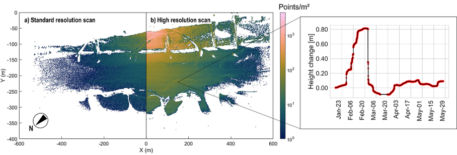

# Use case: Permanent laser scanning observation of the sandy beach at Kijkduin (The Netherlands)

_This use case is part of the [CoastScan](https://coastscan.citg.tudelft.nl/) project, lead by researchers at [TU Delft](https://www.tudelft.nl/en/ceg/about-faculty/departments/geoscience-remote-sensing/)._

## Background and motivation
Coastal environments are highly dynamic and their morphology is continuously changing. With changing climate, high-impact events like storms are becoming more frequent. But the complex interplay of processes that shape the coast is not yet well understood. Coastal monitoring is therefore important for coastal management, as well as for research. Observations allow modeling and predicting coastal dynamics and processes such as sand transport on a beach during storms or recovery of the beach morphology after such events ([Vos et al., 2022](#references)).

Current coastal management uses observation strategies that are either low in spatial resolution (e.g., satellite remote sensing) or low in temporal resolution (e.g. annual airborne LiDAR surveys). To close this gap, near-continuous terrestrial laser scanning is used for spatiotemporally detailed observation (see [CoastScan project](https://coastscan.citg.tudelft.nl/)). This observation strategy generates time series of 3D point clouds, which are introduced in [module 3](../module3/module3.md).

You can find a detailed overview on all data acquired in the CoastScan project on the website: https://coastscan.citg.tudelft.nl/index.php/important-dates-for-the-coastscan-project/

## Study site and data
In this course, we use the laser scanning time series acquired at Kijkduin beach ([52°04’14” N 4°13’10” E](https://www.openstreetmap.org/#map=16/52.0688/4.2216)) in The Netherlands from November 2016 to May 2017 ([Vos et al., 2022](https://doi.org/10.1038/s41597-022-01291-9)), which is openly available [on the PANGAEA data repository](https://doi.org/10.1594/PANGAEA.934058).

During this period, a terrestrial laser scanner (Riegl VZ-2000) was mounted on top of a hotel building adjacent to the beach area (see map below) at a height of around 30 m and 100 to 600 m distance to the target area on the beach. A Riegl VZ-2000 was used as instrument, mounted on an iron pole attached which was fixed to the building roof terrace ([Vos et al., 2022](https://doi.org/10.1038/s41597-022-01291-9)).

<i>Study area and data of terrestrial laser scanning observation at Kijkduin beach, The Netherlands. The point cloud (left) is colored by RGB for visualization, showing the dune area with a path way down to the beach. The overlay shows possible changes due to sand transport when comparing to epochs. The aerial image (right) shows the observed beach area and the laser scanner position (triangle) on the building roof (see photo). Figure by K. Anders. Data source: S. Vos (point cloud, cf. [Vos et al., 2017](#references)) and Het Waterschapshuis (2017) (aerial photo, provided by [pdok.nl](https://www.pdok.nl/copyright)) / [CC BY 4.0].</i>

The dataset consists of 4,082 point clouds hourly between 11 November 2016 and 26 May 26th 2017. Therein, regular scans were acquired at 0.05° resolution, resulting in a point spacing of 2 to 20 points/m² (depending on the range). Additionally, a high-resolution scan was acquired at 0.013° resolution around noon starting end of January 2017 ([Vos et al., 2022](#references)).

<i>View of scans acquired at standard (left part of map) and high (right part of map) resolution, and time series of height change on the beach at one location extracted from the point cloud time series. Figure by K. Anders, modified from [Vos et al. (2022)](https://doi.org/10.1038/s41597-022-01291-9) / [CC BY 4.0](https://creativecommons.org/licenses/by/4.0/) and [Anders et al. (2019)](https://doi.org/10.5194/isprs-annals-IV-2-W5-317-2019) / [CC BY 4.0](https://creativecommons.org/licenses/by/4.0/).</i>

## Use case in the course
The use case is featured in the following parts of the course:

* [Exercise: Time series analysis of 3D point clouds (Module 3, Theme 4)](../module3/04_3d_timeseries_analysis/exercise/m3_theme4_exercise1.md)
* [Case study: Time series-based change analysis of sandy beach dynamics (Module 3, Theme 6)](../module3/06_casestudy_sandybeach/06_casestudy_sandybeach.ipynb)

## References

* Vos, S., Anders, K., Kuschnerus, M., Lindenbergh, R., Höfle, B., Aarninkhof, S., & de Vries, S. (2022). A high-resolution 4D terrestrial laser scan dataset of the Kijkduin beach-dune system, The Netherlands. Scientific Data, 9 (1), pp. 191. doi: [10.1038/s41597-022-01291-9](https://doi.org/10.1038/s41597-022-01291-9).
* Vos, S., Anders, K., Kuschnerus, M., Lindenbergh, R., Höfle, B., Aarninkhof, S., & de Vries, S. (2021). A six month high resolution 4D geospatial stationiary laser scan dataset of the Kijkduin beach dune system, The Netherlands: PANGAEA.
* Vos, S., Lindenbergh, R., & de Vries, S. (2017). CoastScan: Continuous Monitoring of Coastal Change using Terrestrial Laser Scanning. Proceedings of Coastal Dynamics 2017, 233, pp. 1518-1528.