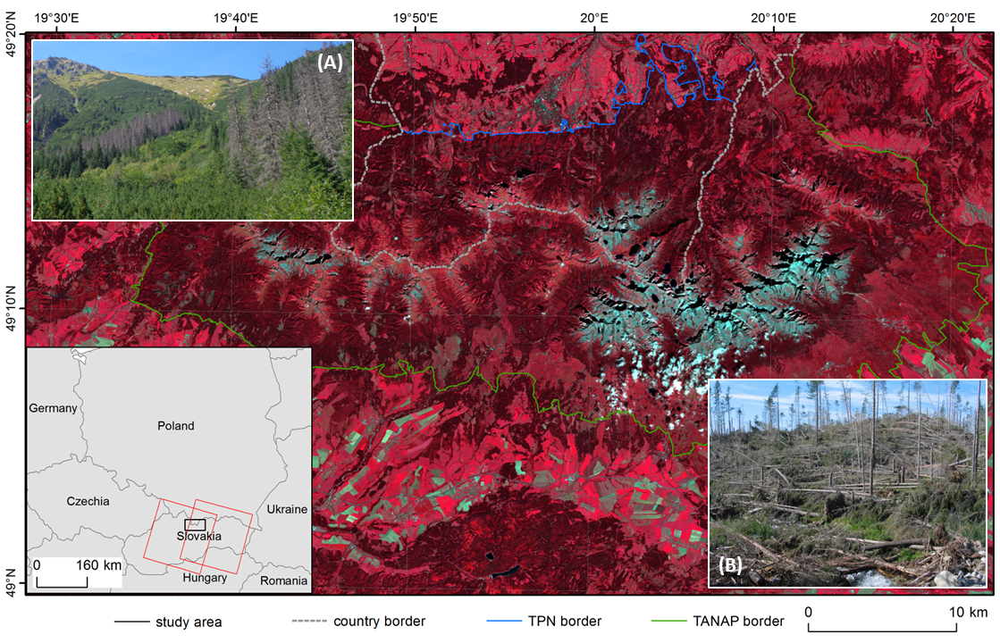

Use case: Vegetation disturbance detection in Polish-Slovak Tatra Mountains
================

This use case is part of the [AveReS project](http://geoinformatics.uw.edu.pl/averes/), lead by researchers at University of Warsaw and part of Adrian Ochtyra PhD thesis.

## Background and motivation

Constant monitoring of the environment allows the detection of disturbances and recovery of vegetation. Satellite image data acquired for decades and developed newer and newer processing methods and algorithms ensures excellent support for traditional monitoring and preservation of vegetation. Temporal-scale changes in vegetation can be divided into two categories: **abrupt** (caused by e.g. windstorm) and **gradual** (e.g. pest infestation). Quantitative estimation of losses after such disasters can be technically difficult with only field inventory ([Nikolov et al., 2014](#references)). It can be more efficiently provided with e.g. annual time series data from various sensors, where a great example is Landsat, whose mission began as early as 1972 ([Kennedy et al., 2010](#references)). Change detection algorithms have evolved from simple ones that indicate changes to more sophisticated ones that enable the analysis of continuous processes, trends or phenological changes in dense time series data ([Zhu et al., 2014](#references)).

## Study site and data

In this course we will focus on forest disturbance detection in Tatras, which is the highest mountain range in the Carpathian Mountains. It is an important area for biodiversity conservation, protected by two national parks: the Slovak Tatranský Národný Park (TANAP) and the Polish Tatrzański Park Narodowy (TPN). Forests cover about 60% of the mountains, where 14% is dwarf pine shrubs ([Ochtyra et al., 2020](#references)). Spruce dominates the majority of the tree stands, while in the lower forest zone, spruce and fir together form tree stands.

Strong winds and bark beetle (*Ips typographus \[L.\]*) outbreaks are the primary causes of vegetation disturbances in Polish-Slovak Tatra Mountains, in particular of spruce (*Picea abies \[L.\] Karst.*) ecosystems ([Mezei et al., 2014](#references)).

<i>Tatra Mountains (red squares in the thumbnail on the left indicate Landsat scenes location, figure by course authors, Landsat 8 courtesy of [the U.S. Geological Survey](https://www.usgs.gov/)/ [Terms of use](https://www.usgs.gov/information-policies-and-instructions/copyrights-and-credits)) and the effects of: (A) bark beetle outbreak (photo by A. Ochtyra) and (B) bora wind (photo by [Falťan et al., 2020](https://doi.org/10.3390/f11121259)/ [CC BY 4.0](https://creativecommons.org/licenses/by/4.0/)).</i>

## Use case in the course

The use case is featured in the following parts of the course:

- [Exercise: Principles of multispectral imaging (Module 2, Theme 1)](../module2/01_multispectral_principles/01_multispectral_principles_exercise.md)
- [Exercise: Temporal information in satellite data (Module 2, Theme 2)](../module2/02_temporal_information/02_temporal_information_exercise.md)
- [Exercise: Image processing (Module 2, Theme 3)](../module2/03_image_processing/03_image_processing_exercise.md)
- [Exercise: Vegetation change and disturbance detection (Module 2, Theme 5)](../module2/05_vegetation_monitoring/05_vegetation_monitoring_exercise.md)
- [Case study: Forest disturbance detection (Tatra Mountains) (Module 2, Case Study 3)](../module2/08_cs_disturbance_detection/08_cs_disturbance_detection.md)

## References

Falťan, V., Katina, S., Minár, J., Polčák, N., Bánovský, M., Maretta, M., … & Petrovič, F. (2020). *Evaluation of abiotic controls on windthrow disturbance using a generalized additive model: A case study of the Tatra National Park, Slovakia.* Forests, 11(12), 1259. <https://doi.org/10.3390/f11121259>

Kennedy, R. E., Cohen, W. B., & Schroeder, T. A. (2007). T*rajectory-based change detection for automated characterization of forest disturbance dynamics*. Remote Sensing of Environment, 110(3), 370-386. <https://doi.org/10.1016/j.rse.2010.07.008>

Mezei, P., Grodzki, W., Blaženec, M., & Jakuš, R. (2014). F*actors influencing the wind–bark beetles’ disturbance system in the course of an Ips typographus outbreak in the Tatra Mountains*. Forest Ecology and Management, 312, 67-77. <https://doi.org/10.1016/j.foreco.2013.10.020>

Nikolov, C., Konôpka, B., Kajba, M., Galko, J., Kunca, A., & Janský, L. (2014). *Post-disaster forest management and bark beetle outbreak in Tatra National Park, Slovakia*. Mountain Research and Development, 34(4), 326-335. <https://doi.org/10.1659/MRD-JOURNAL-D-13-00017.1>

Ochtyra, A., Marcinkowska-Ochtyra, A., & Raczko, E. (2020). *Threshold-and trend-based vegetation change monitoring algorithm based on the inter-annual multi-temporal normalized difference moisture index series: A case study of the Tatra Mountains*. Remote Sensing of Environment, 249, 112026. <https://doi.org/10.1016/j.rse.2020.112026>

Zhu, Z., & Woodcock, C. E. (2014). *Continuous change detection and classification of land cover using all available Landsat data*. Remote sensing of Environment, 144, 152-171. <https://doi.org/10.1016/j.rse.2014.01.011>
