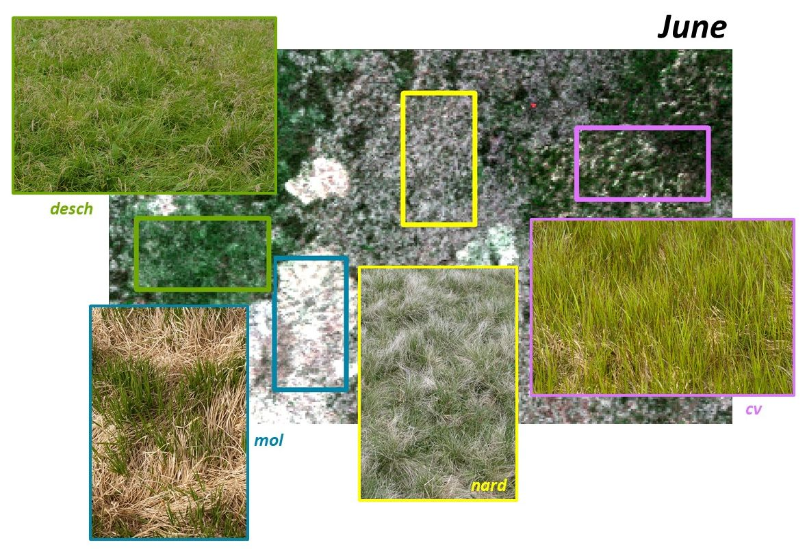
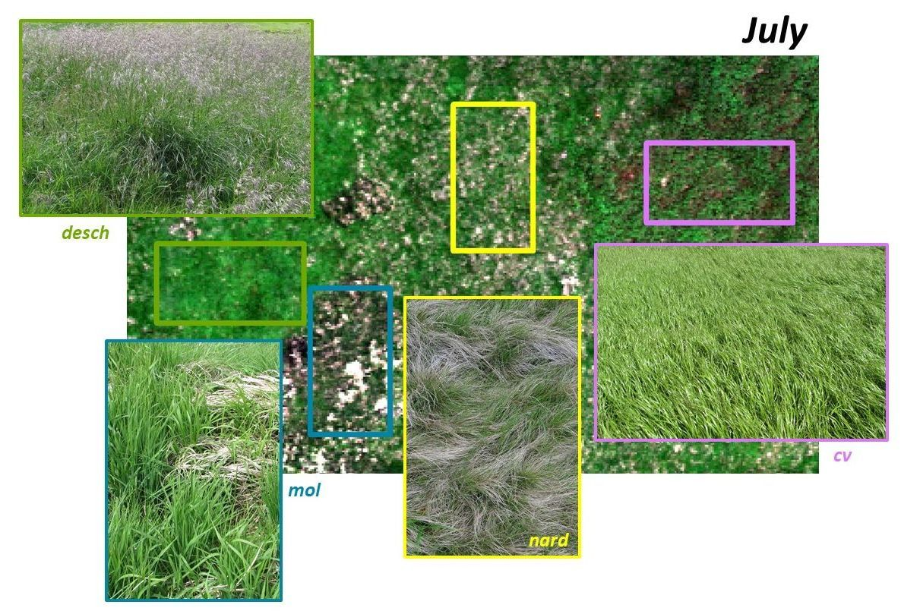
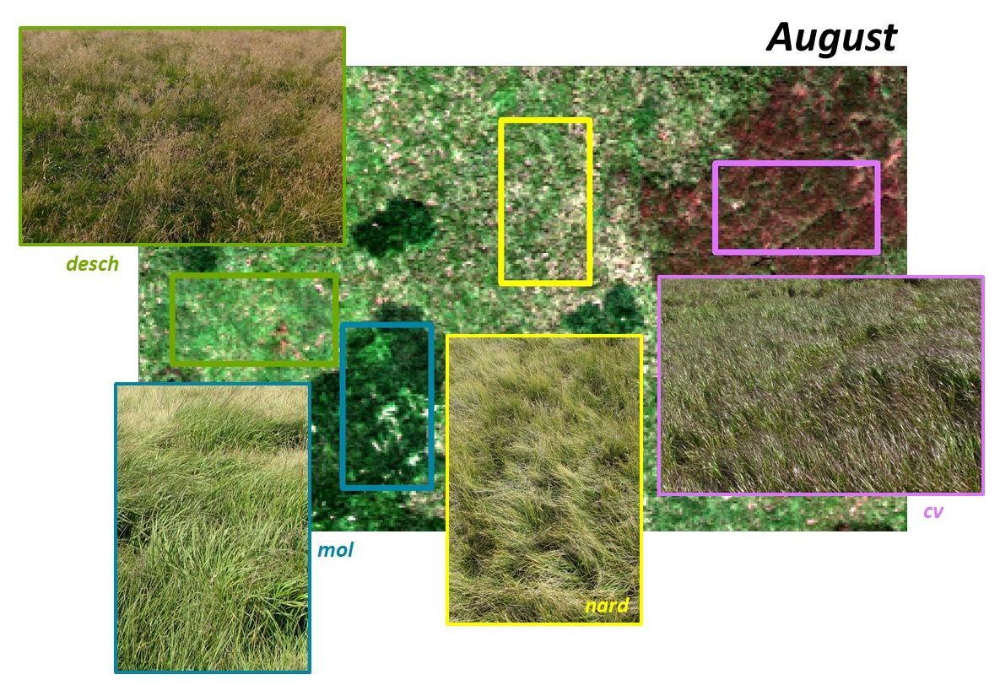

# Use case: Tundra vegetation monitoring in Krkonoše Mountains
All data was collected by researchers from Charles University, Krkonoše Mts. National Park Administration, and Institute of Botany of the Czech Academy of Sciences as part of the project CZ.05.4.27/0.0/0.0/17_078/0009044.

## Background and motivation
The relict arctic-alpine tundra located in the Krkonoše Mountains National Park (KRNAP) above the treeline (1300 m a. s. l., 50.73N, 15.69E) combines arctic, alpine, and middle European flora and fauna with many endangered and endemic species. Different management schemes have been applied in the tundra grasslands over the last 100 years – from grazing and cutting to no human interference. Due to that, as well as nitrogen deposition from acid rains in the 1970s, 80s, and 90s and ongoing climate change, some changes in vegetation composition have been observed: closed alpine grasslands dominated by *Nardus stricta* are threatened by the spread of three native but competitive grass species: *Calamagrostis villosa*, *Molinia caerulea* [(Hejcman et al., 2010)](#references), and *Deschampsia cespitosa* [(Hejcman et al., 2009)](#references). Also, the expansion of *Pinus mugo* shrub [(Štursa and Wild, 2014)](#references) and Norway spruce [(Treml et al., 2012)](#references) was observed. Systematic monitoring of the changes is a key element of tundra conservation. Since 2019, teams from Charles University, in cooperation with the National Park Administration and the Institute of Botany, have been monitoring the changes using remote sensing methods. For the first results, see [Kupková et al. (2023)](#references)

## Study site and data
Three main types of tundra are present in KRNAP: cryo-eolian / lichen tundra (mosses, lichens, and alpine heathlands) on the tops of the highest mountains; vegetated-cryogenic / grassy tundra (closed alpine grasslands dominated by *Nardus stricta* and subalpine tall grasslands, *Pinus mugo* shrubs, and peat bogs) on the plateaus of the huts Luční bouda and Labská bouda; and niveo-glacigenic / flower-rich tundra in the glacier cirques [(Kociánová et al., 2015; Soukupová et al., 1995)](#references). During the above-mentioned project, data was acquired repeatedly for sample areas of each tundra type for four years, four times in a vegetation season. In Module 4, we will use data from lichen tundra (plot called Luční hora mountain) and grassy tundra (plot called Bílá louka meadow), where most changes in vegetation composition are being observed.

### Data
Hyperspectral images were acquired with the Headwall Nano-Hyperspec® fastened to the DJI Matrice 600 Pro drone. The flight height was 68.9 m above the terrain to ensure a ground sampling distance of 3 cm. The scanned areas were 100 m x 100 m in size. The radiometric corrections were performed in the Headwall SpectralView - Hyperspec v3.1.0 software using a portable 3 m x 3 m fabric target placed in the scanned area. The data cube consists of 269 bands, with wavelengths ranging from 400 to 1,000 nm. The geometric corrections were performed in Headwall SpectralView - Hyperspec v3.1.0 and ArcGIS Desktop. The manual addition of tie points and the development of scripts to mosaic the data in ArcGIS Desktop were necessary to reach an acceptable root mean square error (RMSE) on ground control points (RMSE of about 0.1 m).

The mosaics used in this course are resampled to 54 bands and 9 cm to reduce data volume and noise. For both study areas, data acquired in 2020 (or 2019) is provided, approximately in the middle of the months of June (the beginning of the season in tundra), July, August, and September (the end of the season).

The data is provided in the Czech national coordinate system S-JTSK / Krovak East North (EPSG: 5514). 

### Grasses
All four studied grass species (Figures 1-3) belong to the *Poaceae* family. *Nardus stricta* (nard), also known as matgrass, is a strongly tufted grass that usually grows to maximum heights of 40 cm. The leaves are gray-green, thin, and rough, and the stems are stiff and hard. The old biomass is present during the whole growing season. *Calamagrostis villosa* (cv), or reedgrass, is up to 1.2 m high, the knees are often hairy, and the grass-green leaves are smooth and usually 4–10 mm wide. In the KRNAP tundra, the leaves turn a characteristic violet color in August and September (Figure 3). *Molinia caerulea* (mol), also called purple moor-grass, is a very resistant grass, also up to 1.2 m high, with light-green leaves. It prefers sunny and moist locations. In the KRNAP tundra, it is characterized by a large amount of old biomass in June, which can be clearly seen in aerial images (Figure 1). *Deschampsia cespitosa* (desch), known as tufted hairgrass or tussock grass, can grow to 1.4 m and flowers distinctively, mainly in July and August in the KRNAP tundra. The dark green leaf blade's upper surface has a rough texture and can cut in one direction, but is smooth in the other. [(Kubát and Bělohlávková, 2002)](#references) 

*Figure 1. Studied grass species in June visualized, on the hyperspectral image acquired on June 16th, 2020.*

*Figure 2. Studied grass species in July, visualized on the hyperspectral image acquired on July 13th, 2020.*

*Figure 3. Studied grass species in August, visualized on the hyperspectral image acquired on August  11th, 2020.*

## Use case in the course
The use case is featured in the following parts of the course:

* [Exercise: Exploration of hyperspectral data using EnMAP-Box (Module 4, Theme 1)](../module4/01_spectroscopy_principles/01_spectroscopy_principles_exercise.md)

* [Exercise: Geometric correction (Module 4, Theme 2)](../module4/02_aerial_acquisition_preprocessing/02_aerial_acquisition_preprocessing_exercise_geometric.md) 

* [Tutorial: Spectra smoothening and denoising (Module 4, Theme 2)](../module4/02_aerial_acquisition_preprocessing/filtering_spectral_curve.ipynb) 

* [Exercise: Classification of hyperspectral data (Module 4, Theme 4)](../module4/04_time_series_specifics/04_time_series_specifics_exercise.md)

* [Case study: Seasonal spectral separability of selected grass species of the Krkonoše Mts. tundra ecosystem (Module 4, Theme 8)](../module4/08_spectral_separability_grass/08_spectral_separability_grass.md) 

* [Case study: Discrimination of selected grass species from time series of RPAS hyperspectral imagery (Module 4, Theme 6)](../module4/06_Krkonose_tundra_grasslands/06_Krkonose_tundra_grasslands.md)

## References
Hejcman, M., Češková, M., Pavlů, V., (2010). Control of Molinia caerulea by cutting management on sub-alpine grassland. Flora - Morphol. Distrib. Funct. Ecol. Plants 205, 577–582. [10.1016/j.flora.2010.04.019](https://doi.org/10.1016/j.flora.2010.04.019). 

Hejcman, M., Klaudisová, M., Hejcmanová, P., Pavlů, V., Jones, M., (2009). Expansion of Calamagrostis villosa in sub-alpine Nardus stricta grassland: Cessation of cutting management or high nitrogen deposition? Agric. Ecosyst. Environ. 129, 91–96. [10.1016/j.agee.2008.07.007](https://doi.org/10.1016/j.agee.2008.07.007).  

Kociánová, M., Štursa, J., Vaněk, J., (2015). Krkonošská tundra. Správa Krkonošského národního parku, Vrchlabí.

Kubát, K., Bělohlávková, R. (Eds.), (2002). Klíč ke květeně České republiky. 1. edition. Academia, Praha.

Kupková, L., Červená,L., Potůčková, M., Lysák, J., Roubalová, M., Hrázský, Z., Březina, S., Epstein, H.E., Müllerová, J. 2023. Towards reliable monitoring of grass species in nature conservation: Evaluation of the potential of UAV and PlanetScope multi-temporal data in the Central European tundra. Remote Sensing of Environment, 294, 113645. ISSN 0034-4257. [10.1016/j.rse.2023.113645](https://doi.org/10.1016/j.rse.2023.113645).

Soukupová, L., Kociánová, M., Jeník, J., Sekyra, J., (1995). Arctic alpine tundra in the Krkonoše, the Sudetes. Opera Corcon. 32, 5–88.

Štursa, J., Wild, J., (201). Kleč a smilka – klíčoví hráči vývoje alpínského bezlesí Krkonoš (Vysoké Sudety, Česká republika). Opera Corcon. 51, 5–36.

Treml, V., Ponocná, T., Büntgen, U., (2012). Growth trends and temperature responses of treeline Norway spruce in the Czech-Polish Sudetes Mountains. Clim. Res. 55, 91–103. [10.3354/cr01122](https://doi.org/10.3354/cr01122).
