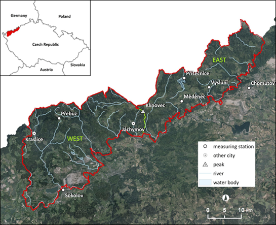

Use case: Forest disturbances in Ore Mountains (Czechia)
================

## Background and motivation

The forests in Ore Mountains with majority of spruce monocultures were heavily damaged by acid pollution in the second half of the 20th century. The pollution was caused mainly by the industry and power plants using the lignite deposits mined from nearby open pit mines. The lignite has a high sulphur content. Until 1990s the sulphur filters were not used in former Czechoslovakia. Therefore, SO2 was the main air pollution agent. The forest decline started already in late 1940s and despite several management actions (planting more resistant and pioneering species, airborne liming) continued till 1980s. The area belonged to the most polluted areas in Europe, often called as “the black triangle” (border area of Germany, Czechia, and Poland). After new regulations in 1990s, the situation stared to become better, and the forest recovery is still in progress. The use case follows the methodology applied in the publication Kupková et al., 2018 which compared forest changes between the western part of the mountains that was less affected by the pollution and the eastern part where the damages were severe.

## Study site and data

The Ore Mountains (Krušné hory, Das Erzgebirge, 50.40N, 12.97E) is about 130 km long mountain range creating a natural border North-Western Bohemia and Saxony. The study area covers the western part of the Ore Mountains (about 90 km long) with the highest elevation Klínovec (1244 meters a. s. l.). The mountain separates the study area into two geologically distinct localities (in the study Kupková et al., 2018 called west and east).

<i>Location of the Ore mountains study area. (figure by [Kupková et al., 2018](https://iopscience.iop.org/article/10.1088/1748-9326/aadd2c), [CC BY 3.0 DEED](https://creativecommons.org/licenses/by/3.0/))</i>

The Case study will use Landsat Collection 2, Level 2 images from 1984 till 2023. The open archive of Landsat images provided by the US Geological Survey will be accessed vie Google Earth Engine tools.

## Use case in the course

The use case is featured in a case study of [Module 2: Forest disturbances in Ore Mountains (Czechia)](../module2/07_cs_forest_changes/07_cs_forest_changes.md).

## References

**Key reference**

Kupková, L., Potůčková, M., Lhotáková, Z., Albrechtová, J. (2018). Forest cover and disturbance changes, and their driving forces: A case study in the Ore Mountains, Czechia, heavily affected by anthropogenic acidic pollution in the second half of the 20th century. Environmental Research Letters, 13(9), 095008. [https://iopscience.iop.org/article/10.1088/1748-9326/aadd2c](https://iopscience.iop.org/article/10.1088/1748-9326/aadd2c)

**Other references (optional)**

*The following list provides selected research studies on spruce forest decline, recovery, and resistance to air pollution in the Ore Mountains using both multispectral satellite data and airborne hyperspectral data (that is the topic of [Module 4](../module4/module4.md) of this course).*

Campbell, P. E., Rock, B. N., Martin, M. E., Neefus, C. D., Irons, J. R., Middleton, E. M., Albrechtova, J. (2004). Detection of initial damage in Norway spruce canopies using hyperspectral airborne data. International Journal of Remote Sensing, 25(24), 5557-5584. [https://doi.org/10.1080/01431160410001726058](https://doi.org/10.1080/01431160410001726058)

Cudlín, P., Seják, J., Pokorný, J., Albrechtová, J., Bastian, O., Marek, M. (2013). Forest ecosystem services under climate change and air pollution. Developments in Environmental Science, 13, 521-546. [https://doi.org/10.1016/B978-0-08-098349-3.00024-4](https://doi.org/10.1016/B978-0-08-098349-3.00024-4)

Mišurec, J., Kopačková, V., Lhotáková, Z., Hanuš, J., Weyermann, J., Entcheva-Campbell, P., Albrechtová, J. (2012). Utilization of hyperspectral image optical indices to assess the Norway spruce forest health status. Journal of Applied Remote Sensing, 6(1), 063545-063545. [https://doi.org/10.1117/1.JRS.6.063545](https://doi.org/10.1117/1.JRS.6.063545)

Mišurec, J., Kopačková, V., Lhotáková, Z., Campbell, P., Albrechtová, J. (2016). Detection of spatio-temporal changes of Norway spruce forest stands in Ore Mountains using Landsat time series and airborne hyperspectral imagery. Remote Sensing, 8(2), 92. [https://doi.org/10.3390/rs8020092](https://doi.org/10.3390/rs8020092)

Polák, T., Rock, B. N., Campbell, P. E., Soukupová, J., Solcová, B., Zvára, K., Albrechtová, J. (2006). Shoot growth processes, assessed by bud development types, reflect Norway spruce vitality and sink prioritization. Forest Ecology and Management, 225(1-3), 337-348. [https://doi.org/10.1016/j.foreco.2006.01.027](https://doi.org/10.1016/j.foreco.2006.01.027)

Soukupová, J., Rock, B. N., Albrechtová, J. (2001). Comparative study of two spruce species in a polluted mountainous region. New Phytologist, 150(1), 133-145. [https://doi.org/10.1046/j.1469-8137.2001.00066.x](https://doi.org/10.1046/j.1469-8137.2001.00066.x)
