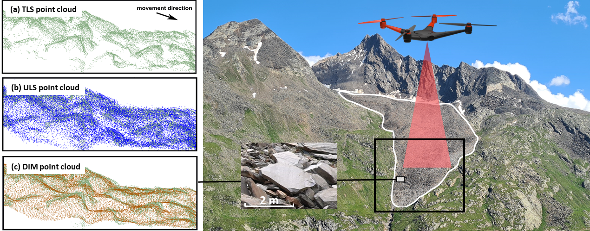

# Use case: Multitemporal and multi-sensor observation of the active rock glacier _Äußeres Hochebenkar_ (Austria)

_This use case is part of the [AHK-4D](https://www.uni-heidelberg.de/ahk-4d) project, lead by researchers at [Heidelberg University](https://www.uni-heidelberg.de/3dgeo)._

## Background and motivation

Rock glaciers are active creep phenomena in high-mountain environments. They occur under permafrost conditions where unconsolidated and ice-supersaturated debris causes topographic deformation ([Barsch et al., 1992](#references)).
Changes to rock glacier surfaces reflect the interaction of various geomorphic deformation processes. These include permafrost creep, permafrost slide, zonal thinning or thickening, advection of surface microtopography, 3D straining, general mass changes (heaving or settlement), and horizontal shearing and rotation. The surface changes induced by these processes feature different spatial characteristics, magnitudes and timescales of occurrence, which are not yet fully understood ([Moore 2014](#references)).
Monitoring 3D surface change at high spatial resolution (centimeter point spacing) and high temporal resolution (sub-monthly) allows characterizing different geomorphic processes by their spatiotemporal dynamics and to reveal their contribution to surface change on rock glaciers. This information can enhance our general understanding of the spatial and temporal variability of rock glacier deformation and the interaction of rock glaciers with connected environmental systems.

## Study site and data

In this course, we use multitemporal point clouds of the rock glacier _Äußeres Hochebenkar_ ([46°50′29″ N 11°0′15″ E](https://www.openstreetmap.org/?mlat=46.8406&mlon=11.0041#map=14/46.8406/11.0041)), located in the southern Ötztal Alps in Austria ([Zahs et al., 2022](#references)).
The active tongue‐shaped, bouldery talus rock glacier is being extensively monitored with different survey strategies and sensors since the 1930s in order to decode the complex dynamics of rock glacier surface and subsurface activities and their driving forces. Multisensor monitoring and data integration revealed cyclical destabilization of the rock glacier with a recent sharp increase of movement rates at the rock glacier front, which is presented in recent research by [Hartl et al. (2023)](#references).

<i>Study area rock glacier Äußeres Hochebenkar (Ötztal Alps, Austria) seen from the opposite side of the valley in 2021. The rock glacier is situated in a NW‐oriented glacial cirque, surrounded by the near‐vertical slopes of Hangerer (left) and Hochebenkamm (right). 
(a) - (c) Cross-sections of different types of point clouds acquired at the lower tongue area of the rock glacier. Figure by V. Zahs.</i>

In this course, we will use point clouds acquired in the summers of 2020 and 2021 by UAV-borne laser scanning and UAV-borne photogrammetry in the lower tongue area of the rock glacier.
The dataset consists of one point cloud per acquisition method and epoch, i.e. one ULS point cloud from 2020, and one ULS and UAV photogrammetry point cloud, respectively, from 2021.

ULS point clouds were collected using a RIEGL VUX-1LR laser scanner mounted on a RIEGL RiCOPTER.
The survey was carried out with a strip spacing of 90 m and a mean flight altitude of 105 m above ground level (AGL). This resulted in point clouds with an average point spacing of 0.05 m.

Images for the photogrammetric point clouds were acquired with a DJI Phantom 4 RTK equipped with a 1” CMOS 20 MP camera mounted on a gimbal. The survey was carried out with a strip spacing of 
40 m at a constant flight altitude of 85 m AGL with 80% front and side overlap of the acquired nadir images. Additionally, a smaller number of 
oblique images were captured to strengthen the bundle block. The point cloud was reconstructed by dense image matching and has an average point spacing of 0.05 m.

All details on the datasets can be found in the related publication ([Zahs et al. 2022](#references)).

The point clouds used in this course are subsampled to a point spacing of 10 cm, to reduce the data volume and enable processing on standard computers.

Coordinates of point clouds are in ETRS89 / UTM 32N (EPSG: 32632).

## Use case in the course
The use case is featured in the following parts of the course:

* [Exercise: Principles of 3D/4D geographic point clouds (Module 3, Theme 1)](../module3/01_pointcloud_principles/01_pointcloud_principles.md)
* [Exercise: Virtual Laser Scanning in HELIOS++ for Point Cloud Change Analysis (Module 3, Theme 2)](../module3/02_pointcloud_programming_python/exercise/m3_theme2_exercise1.ipynb)
* [Exercise: Exercise: 3D Change Analysis at an Active Rock Glacier using Multitemporal Point Clouds](../module3/03_3d_change_analysis/exercise/m3_theme3_exercise1.md)
* [Case study: Multitemporal 3D change analysis at an active rock glacier (Module 3, Theme 6)](../module3/06_casestudy_rockglacier/06_casestudy_rockglacier.ipynb)

## References

* Barsch, D. (1992). Permafrost creep and rockglaciers. Permafrost and Periglacial Processes, 3 (3), pp. 175-188. doi: [10.1002/ppp.3430030303](https://doi.org/10.1002/ppp.3430030303).
* Hartl, L., Zieher, T., Bremer, M., Stocker-Waldhuber, M., Zahs, V., Höfle, B., Klug, C. & Cicoira, A. (2023): Multisensor monitoring and data integration reveal cyclical destabilization of Äußeres Hochebenkar Rock Glacier. Earth Surface Dynamics. Vol. 11, pp. 117-147. doi: [10.5194/esurf-11-117-2023](https://doi.org/10.5194/esurf-11-117-2023)
* Moore, P. L. (2014): Deformation of debris-ice mixtures. Review of Geophysics. Vol. 52(3), pp. 435-467. doi: [10.1002/2014RG000453](https://doi.org/10.1002/2014RG000453).
* Zahs, V., Winiwarter, L., Anders, K., Bremer, M. Rutzinger, M. Potůčková, M. & Höfle, B. (2022): Evaluation of UAV-borne photogrammetry and UAV-borne laser scanning for 3D topographic change analysis of an active rock glacier. International Archives of the Photogrammetry, Remote Sensing and Spatial Information Sciences. Vol. XLIII-B2-2022, pp. 1109-1116. doi: [https://doi.org/10.5194/isprs-archives-XLIII-B2-2022-1109-2022](10.5194/isprs-archives-XLIII-B2-2022-1109-2022).
* Zahs, V., Winiwarter, L., Anders, K., Williams, J.G., Rutzinger, M. & Höfle, B. (2022): Correspondence-driven plane-based M3C2 for lower uncertainty in 3D topographic change quantification. ISPRS Journal of Photogrammetry and Remote Sensing. Vol. 183, pp. 541-559. doi: [https://doi.org/10.1016/j.isprsjprs.2021.11.018](https://doi.org/10.1016/j.isprsjprs.2021.11.018). 

