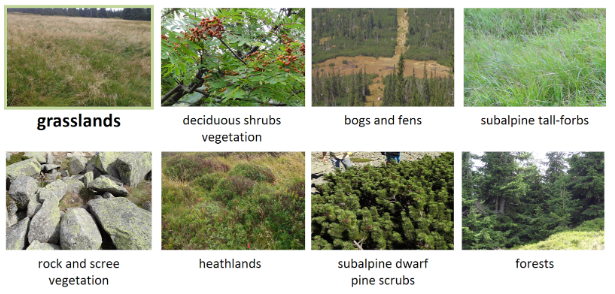

Use case: Land cover monitoring in Karkonosze/Krkonoše Mountains (Poland/Czechia)
================

Field data for this use case were collected as a part of the [HyMountEcos project](https://catalogue.ceda.ac.uk/uuid/998847cad2a54c71ab2a39c0d0735ae0), lead by researchers at University of Warsaw and Charles University in Prague, and part of Adriana Marcinkowska-Ochtyra PhD thesis.

## Background and motivation

The impact of climate change is visible in many environments around the globe. One of them are mountain areas, where changes of the treeline or shrubs encroachment into grassland areas can be observed ([Beniston, 2016](#references)). Mountain vegetation, including endangered species, rare endemic species or glacial relics is unique and systematic monitoring and identification is a key element of its protection. Commonly used field mapping is laborious and time consuming, which is especially visible in case of high-mountain areas, where limited availability affects the possibilities of research. Hence, satellite remote sensing data, characterized by great objectivity and spatial coverage, as well as high temporal resolution are increasingly used in monitoring works ([Wakulińska and Marcinkowska-Ochtyra, 2020](#references)). Due to the presence of difficulties peculiar to this type of terrain many steps required to properly prepare the images from such areas for further analysis.

## Study site and data

The area is located in Polish and Czech Karkonosze/Krkonoše Mountains within the borders of national parks. The highest parts of the mountains cover two plant floors: subalpine (1250–1450 m a.s.l.) and alpine (above 1450 m a.s.l.). Research area is considered unique in this region of arctic-alpine tundra. Examples of vegetation classes occurring there, are presented below.

<i>Subalpine and alpine vegetation in Karkonosze/Krkonoše Mts. (figure by [Wakulińska and Marcinkowska-Ochtyra 2020](https://doi.org/10.3390/rs12172696), modified/ [CC BY 4.0](https://creativecommons.org/licenses/by/4.0/)).</i>

In this course, we will use **multitemporal Sentinel-2 data** and **reference data** in the following lists:

- Sentinel-2 data from four terms of data acquisition (31 May, 7 and 27 August, 18 September 2018) and field data collected in 2013-2014 (updated to 2018 based on high-resolution data interpretation) for classification of **vegetation types**, with focus on **grasslands**,

- Sentinel-2 data from six terms of data acquisition (19, 24 and 27 June, 19 and 24 July, 20 October 2023) as reference data for **land cover** classification from CORINE Land Cover 2018 database.

## Use case in the course

The use case is featured in the following parts of the course:

- [Exercise: Multitemporal classification (Module 2, Theme 4)](../module2/04_multitemporal_classification/04_multitemporal_classification.md)
- [Case study: Monitoring tundra grasslands (Karkonosze) (Module 2, Case study 1)](../module2/06_cs_tundra_grasslands/06_cs_tundra_grasslands.md)

## References

Beniston, M. (2016). Environmental change in mountains and uplands. Routledge.

Wakulińska, M., & Marcinkowska-Ochtyra, A. (2020). Multi-temporal sentinel-2 data in classification of mountain vegetation. Remote Sensing, 12(17), 2696. <https://doi.org/10.3390/rs12172696>
