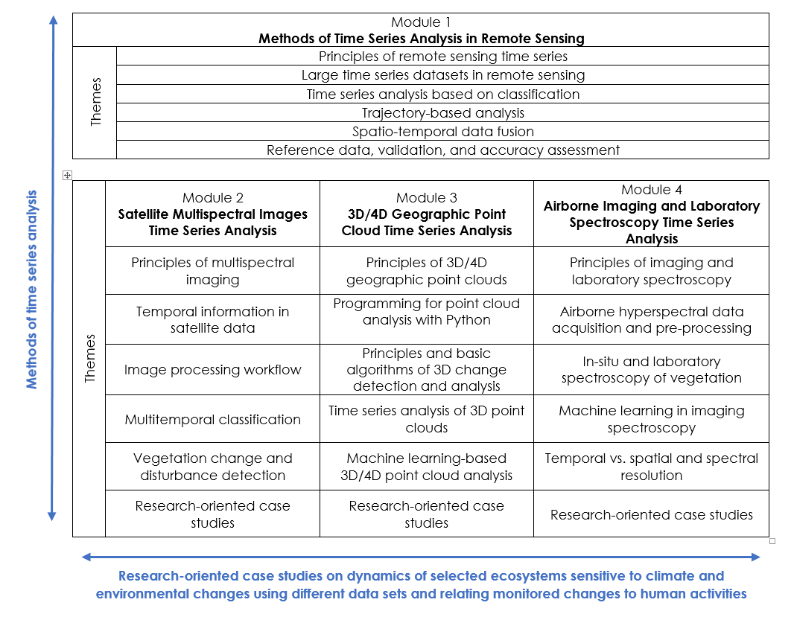

# E-TRAINEE

**E-learning course on Time Series Analysis in Remote Sensing for Understanding Human-Environment Interactions** (E-TRAINEE) was developed by collaboration of research groups from four
partner universities – Charles University, Heidelberg University, University of Innsbruck, and
University of Warsaw within the ERASMUS+ Strategic partnership project (ID 2020-1-CZ01-KA203-078308).

The course provides a theoretical background to methods used for information extraction from time
series of remote sensing data. It consists of the following Modules:

* Module 1: Methods of Time Series Analysis in Remote Sensing
* Module 2: Satellite Multispectral Images Time Series Analysis
* Module 3: 3D/4D Geographic Point Cloud Time Series Analysis
* Module 4: Airborne Imaging and Laboratory Spectroscopy Time Series Analysis

Based on several multimodal data sets - satellite and airborne multi- and hyperspectral imagery and
point clouds, and applications ranging from landcover monitoring on various spatial scales to 3D change
analysis, the course demonstrates the whole processing chain, from data acquisition, pre-processing, 
time series analysis to validation and accuracy assessment of the final product. 

The self-evaluation quizzes and practical exercises follow the theory. Either open data archives, such as
Landsat or Sentinel, or datasets acquired within research projects of participating institutions are
used for exercises. Moreover, application case studies are provided in Modules 2 to 4. All
exercises and case studies are processed in open or free software packages; codes in Python, R, or
Google Earth Engine are provided.

The course is primarily developed for MSc students of geoinformatics and geography who
specialize in remote sensing for monitoring Earth surface dynamics and changes. 
It may also be of interest and use to MSc and PhD students in fields related to environmental 
studies, ecology, geology, and other potential users dealing with remote sensing applications, 
such as practitioners of national environmental and conservation agencies.

[Project partners](https://web.natur.cuni.cz/gis/etrainee/partners.html)

[Project news](https://web.natur.cuni.cz/gis/etrainee/news.html)

