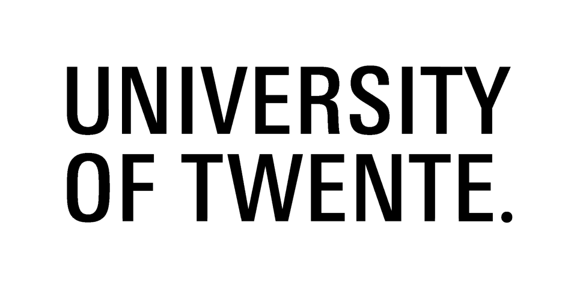

# Before you start the e-learning course…

The e-learning course *Time Series Analysis in Remote Sensing for
Understanding Human-Environment Interactions* is designed for the MSc level,
and some elementary knowledge of statistics, remote sensing, and
programming is required. A summary of knowledge and skills that are essential
for successfully starting and completing the course can be found below. Links to
online materials explaining the necessary theory with practical examples are
provided.  

The practical exercises in the course utilise open or free software packages,
namely QGIS and some of its plugins, R, and Google Earth Engine. Moreover,
programming in Python is required in some modules. Instructions on how to install
the required software packages as well as links to user manuals or tutorials,
explaining basic functions and script writing, are explained in the section
software.

You should be familiar with the following concepts or methods:

## Statistics

* Variable, random variable

* Probability, probability distribution

* Errors in measurements (types and propagation)
  
* Least squares fitting

* Regression

* ANOVA

The following freely accessible resources provide introduction to statistics and explanation of above concepts:

Probability and statistics - [online E-Book](http://wiki.stat.ucla.edu/socr/index.php/EBook#Format)

Online Statistics Education: A Multimedia Course of Study (http://onlinestatbook.com/). Project Leader: David M. Lane, Rice University.

## Geoinformation Systems (GIS)

* Working with raster data (import/export, interpolation, reclassification, resampling, raster math, ...)

* Working with vector data (import/export, digitizing features, attribute table manipulations, spatial overlays, ...)

* Understanding and handling coordinate reference systems (CRS)

## Remote Sensing

* Remote sensing principles

* Optical (multi- and hyperspectral) and LiDAR data

* Basic knowledge of radiometric corrections

* Geometric correction of images (orthorectification)

* Pre-processing of point clouds (from raw measurements to a georeferenced point cloud) – TLS & ULS/ALS

* Generating point clouds from imagery (basic workflow, details on SfM or high density image matching are not necessary)

**Links to tutorials and resources where you can obtain the required skills or knowledge in Remote Sensing:**

**ESA**

Land in Focus – Basics of Remote Sensing - [online](https://eo-college.org/courses/landinfocus/) (registration required)

**Canada Centre for Mapping and Earth Observation**

Remote Sensing Tutorials - [online](http://www.nrcan.gc.ca/earth-sciences/geomatics/satellite-imagery-air-photos/satellite-imagery-products/educational-resources/9309) and [PDF](https://www.nrcan.gc.ca/sites/www.nrcan.gc.ca/files/earthsciences/pdf/resource/tutor/fundam/pdf/fundamentals_e.pdf) version (access without registration)

**University of Twente**

Principles of Remote Sensing - [online textbook](http://www.itc.nl/library/papers_2009/general/PrinciplesRemoteSensing.pdf)

Tempfli, K., Kerle, N., Huurneman, G. C., Janssen, L. L. F. (2009). _Principles of remote sensing : an introductory textbook._ (ITC Educational Textbook Series; Vol. 2). International Institute for Geo-Information Science and Earth Observation.

## Software and programming

This course makes use of various tools and software packages for different analysis tasks throughout the modules.
Below you find an overview of all required software, with further material for setting them up, if applicable.
Check the individual modules for the software/tools that are specifically required.

### Software
The following list contains all software that is used throughout the course.
The links for each software lead to descriptions and (where required) specific information how to set up them up for this course.

* [QGIS](../software/software_qgis.md) (including GRASS GIS and SAGA GIS) + [EnMAP-Box](../software/software_enmap_box.md)

* [R](../software/software_r_language.md)

* [Python](../software/software_python.md) (including Jupyter notebook)

* [CloudCompare](../software/software_cloudcompare.md) (direct download and installation from the website)

* Google Earth Engine

### Programming

Programming is an **important skill for any scientific analyses**, where off-the-shelve software is not available, workflows should be automated, or own/new methods are developed.
The programming languages Python and R are most widely used in data science and scientific analyses in general, and will be used in this course.

**Independent of the specific programming language**, you should have basic programming skills before taking this course.
Importantly, these regard knowledge of **fundamental programming concepts** (e.g., algorithms, syntax).

You should be familiar with the following concepts and operations prior to the course:

* Data types
* Variables
* Conditions
* Arrays
* Loops
* Optional: Functions, Classes

Ideally, you also have some experience with:

* Data visualization (plotting in R and/or Python)
* Reading and writing tabular data as well as raster and vector geodata

The following resources provide introductions to programming regarding above concepts:

* Downey, A.B. (2015): Think Python - How to Think Like a Computer Scientist. O‘Reilly. (open source): https://greenteapress.com/wp/think-python-2e
* [Coursera](https://www.coursera.org/) is a platform that offers a variety of online courses

Below, we provide links to tutorials and resources where you can obtain the required skills using [Python](#programming-in-python) and/or [R](#programming-in-r).

#### Programming in Python
If you are new to Python, you might look into this tutorial on [Python Code Fundamentals](https://www.earthdatascience.org/courses/intro-to-earth-data-science/python-code-fundamentals/) by [Earth Lab](https://www.earthdatascience.org/).

Advanced tutorials or material can be found among the following resources:
* Online course on [Practical Python Programming](https://dabeaz-course.github.io/practical-python/) by David Beazley
* Online course/textbook on [Use Data for Earth and Environmental Science in Open Source Python](https://www.earthdatascience.org/courses/use-data-open-source-python/) by [Earth Lab](https://www.earthdatascience.org/)
