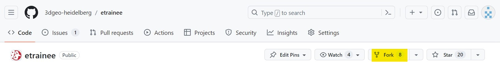
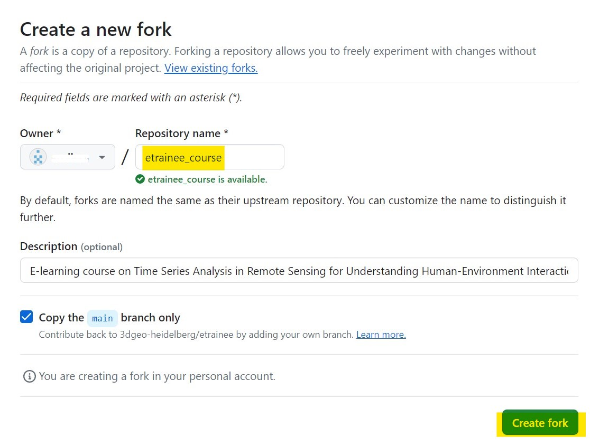
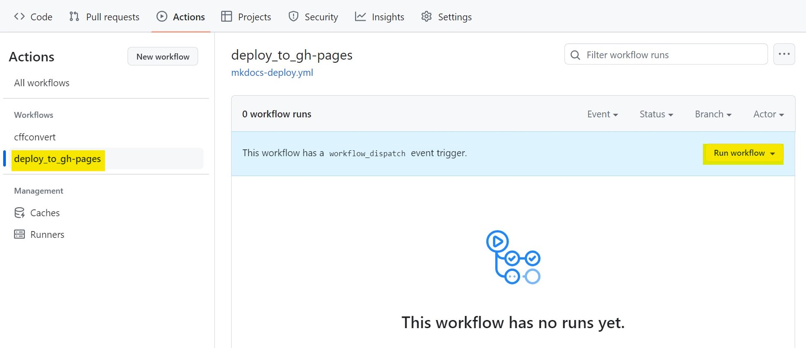
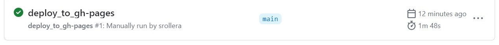
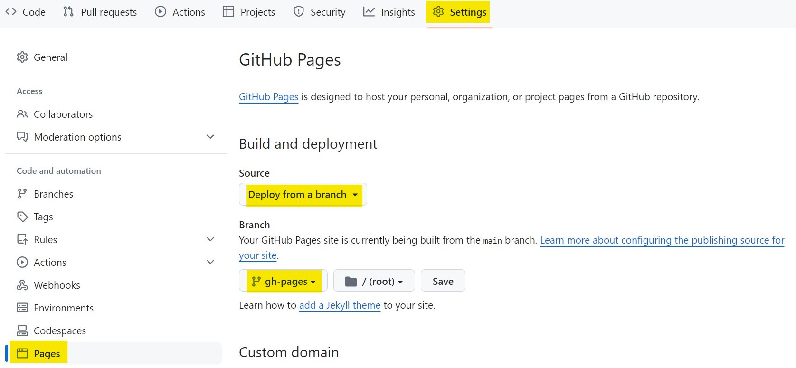
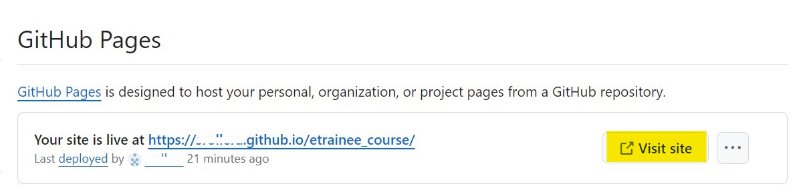

# Setting up online resources for teaching E-TRAINEE as a university course

When using the course, i.e., when teaching or training with it, 
we recommend to fork the repository into your GitHub account/organization and use the latest version of the main branch. 
This ensures that the course content is stable while updates may be merged in this repository. 
If you want to integrate updates from this repository into your fork, 
you can do so by creating a pull request from this repository to your forked repository, or use the syncing offered by GitHub.

## Fork the repository
A fork is a copy of a repository. 
Forking a repository allows you to freely experiment with changes without affecting the original project 
and without being affected by the changes made in the original project.

1. **Create a fork** of the original etrainee respotitory, choose an appropriate name according to your needs
as it's going to be publicly visible. 

2. In the **Actions** tab of your newly created forked repository enable workflows.

Then, **run the workflow** *deploy_to_gh_pages* using the main branch. This takes some times, 
once the workflow has finished, a green check mark will appear next to it. 

 
The workflow is an automatically triggered event, meaning everytime a change in the future is made in the main branch, the github-pages will update
on  their own. 

3. In the Settings tab -> Pages -> Build and Deployment **enable GitHub Pages**. As the source choose *Deploy from a branch* and as the branch
select *gh-pages*. Save the options.

This step takes some minutes. After the deployment has successfully finished a message with the wording "Your site is live at ..." will appear. 
The URL link can be used to access the course website generated from your forked repository. 
You can make the link visible on the repositories landing page by including it in the About section (option: Use your GitHub Pages website)  

## Communicate with students
Students can suggest changes, fix typos, give feedback, etc., either by raising **issues** on GitHub or
by directly applying updates to branches via **pull/merge requests**. 

Issues and pull requests can be linked together to show the progress and automatically close the issues upon their resolution. 

 
## Modify and update course info

## After the semester
Merge back corrections to the original etrainee repository