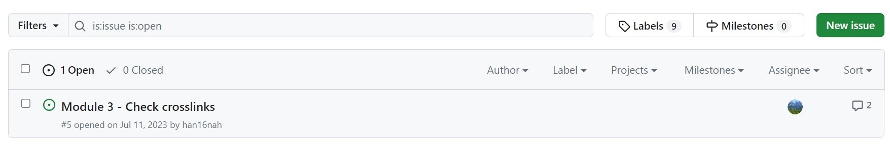

# Setting up online resources for teaching E-TRAINEE as a university course

When using the course, i.e., when teaching or training with it, 
we recommend to fork the repository into your GitHub account/organization and use the latest version of the main branch. 
This ensures that the course content is stable while updates may be merged in this repository. 
If you want to integrate updates from this repository into your fork, 
you can do so by creating a pull request from this repository to your forked repository, or use the syncing offered by GitHub.

## Fork the repository
A fork is a copy of a repository. 
Forking a repository allows you to freely experiment with changes without affecting the original project 
and without being affected by the changes made in the original project. 

## Communication with students
Students can suggest changes, fix typos, give feedback, etc., either by raising **issues** on GitHub or
by directly applying updates to branches via **pull/merge requests**. 

Issues and pull requests can be linked together to show the progress and automatically close the issues upon their resolution. 

 *Issues*
 
## Modify and update course info in markdown files

## After the semester: Merge back corrections to the original etrainee repository