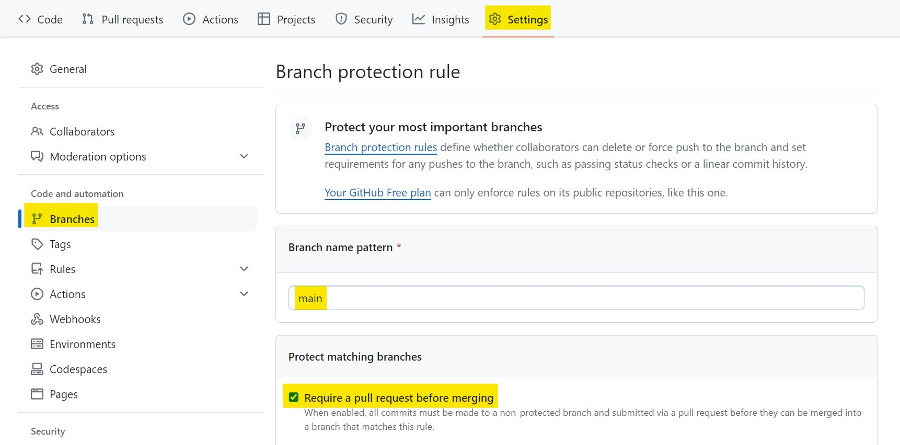

# Setting up online resources for teaching E-TRAINEE as a university course

When using the course, i.e., when teaching or training with it, 
we recommend to [fork the repository](https://docs.github.com/en/pull-requests/collaborating-with-pull-requests/working-with-forks) into your GitHub account/organization and use the latest version of the main branch. 
This ensures that the course content is stable while updates may be merged into this repository. 
If you want to integrate updates from this repository into your fork, 
you can do so by creating a pull request from this repository to your forked repository, or by using the syncing offered by GitHub.


## Set up the course fork

1. **Create a fork** of the original etrainee repository, choose an appropriate name according to your needs
as it's going to be publicly visible. A fork is a copy of a repository. 
Forking a repository allows you to freely experiment with changes without affecting the original project 
and without being affected by the changes made in the original project.

<p align="center">

</p>
<p align="center">

</p>

2. In the **Actions** tab of your newly created forked repository enable workflows.

<p>
<p align="center">

</p>

3. Then, **run the workflow** *deploy_to_gh_pages* using the main branch. This takes some time, 
once the workflow has finished, a green check mark will appear next to it. The workflow is an automatically triggered event, meaning every time a change in the future is made in the main branch, the github-pages will update
on  their own.

<p>
<p align="center">

</p>

4. In the Settings tab -> Pages -> Build and Deployment **enable GitHub Pages**. As the source choose *Deploy from a branch* and as the branch
select *gh-pages*. Save the options.

<p>
<p align="center">

</p>

5. The previous step takes some minutes. After the deployment has successfully finished a message with the wording "Your site is live at ..." will appear. 
The **URL link** can be used to access the course website generated from your forked repository. 
You can make the link visible on the repositories landing page by including it in the About section (option: Use your GitHub Pages website)  

<p>
<p align="center">

</p>

6. It is recommended to **add protection to the main branch**. This can be done in Settings -> Branches -> Add Branch Protection Rule -> Branch name pattern: *main* and check *Require a pull request before merging*. You can further decide if 
pull requests targeting a matching branch should require approval or not. 

<p>
<p align="center">

</p>

## Communicate with students
Students can suggest changes, fix typos, give feedback, etc., either by raising **issues** on GitHub or
by directly applying updates to branches via **pull/merge requests**. Issues need to be enabled first in the 
Settings -> General -> Features: Issues (check box).

Issues and pull requests can be linked together to show the progress and automatically close the issues upon their resolution. 

<p align="center">

</p>


## Modify and update course info
1. The **course website landing page** is generated from *course/index.md*. You can modify this file to contain the
needed information such as the time schedule, topics, contact information, etc. A template that can be edited and used is provided [here](index_template.md). 
The easiest way is to copy the content of this file. 

2. You can **edit the course website structure** and select only some modules to be built by modifying *mkdocs/mkdocs.yml*
and, e.g., deleting lines for modules not to be included. 

3. **Updates and corrections** applied to the main branch of the fork are automatically posted on website 
due to the previously defined actions. 

 

## After the semester
The changes in the forked repository can be transferred back to the original etrainee repository
via pull/merge requests. It is important to not transfer back the altered *course/index.md* 
and other course specific files, only the corrections. This can be done in several ways:

A. Create a new branch in your repository from the [remote upstream](https://docs.github.com/en/pull-requests/collaborating-with-pull-requests/working-with-forks/configuring-a-remote-repository-for-a-fork) (original etrainee repository)
-> **cherry-pick** and push only the specific commits to the branch -> make a pull request.

```
# set remote upstream 
git remote add upstream https://github.com/<upstream_github_username>/<upstream_github_repo_name>.git
# fetch changes
git fetch --all
# create new branch from
git checkout -b branch_name upstream/master
# cherry-pick commits
git cherry-pick <hash of commit>
# push the commit
git push -u origin branch_name
```

or

B. Create a new branch in your repository -> replace the course specific altered files with the 
the ones from the original etrainee repository -> make a pull request.
