# Principles of remote sensing time series

This theme provides general knowledge about the principles of remote sensing time series. At first, we look at time series in general and at some important principles of remote sensing. Then we go on to see how time series principles can be transferred to remote sensing data.

## Objectives

At the end of this theme, you will know concepts and typical properties of time series data in general and how to look at these properties. Further, you will understand how remote sensing time series are acquired, and what needs to be considered generally when using them. Finally, you will explore exemplary data and perform some first analysis steps using Python.

## Time series principles

### What is a time series?

A time series is *a set of observations that are ordered by time* (i.e., by their temporal occurrence; [Castle and Hendry 2019](https://doi.org/10.1007/978-3-030-21432-6)). That means the observations have a clear and unchangeable chronology and distance to each other. The chronology of observations may been seen like neighbourhood and topology in spatial data analysis.

Time series are recorded at different frequencies (number of measurements in given time period), which are often expressed through a measurement interval (i.e. the temporal spacing between consecutive measurements). This can be a (more or less) fixed interval (e.g. hourly, daily, every five days, …) or an irregular one. The moment in time when a measurement is recorded is usually referenced as a time stamp (e.g. *June 5th, 2019 at 7:00 am*).

Imagine two sets of temperature measurements, one with time (day and daytime) included for each measurement and one where the time is missing … Which temperature data set is more valuable for analysis (and why)?

### Properties of time series

The next sections will illustrate some important properties that are commonly found in time series and you will get to know possibilities of looking at these properties, including

* Persistence
* (Non-)stationarity
* Trends, cyclic components and noise
* Temporal aggregates and resampling
* Filtering and noise reduction

#### Patterns of persistence

Time series may contain *patterns of persistence* ([Castle and Hendry 2019](https://doi.org/10.1007/978-3-030-21432-6)), with closely succeeding observations being more similar than observations that are longer apart. This is the case in this time series of daily air temperature from an automatic weather station in the Central Alps ([Institute of Meteorology and Geophysics 2013)](https://doi.org/10.1594/PANGAEA.806623)), contrasted by an example with random numbers:

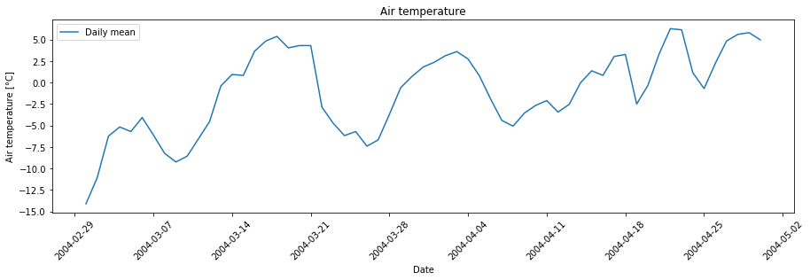

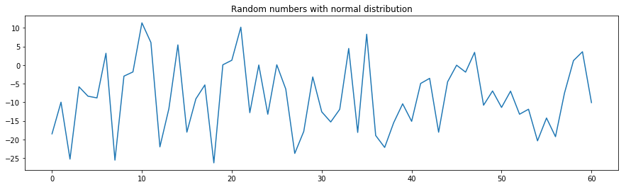

The persistent patterns in the temperature time series can be clearly seen if we calculate and plot the correlations between temperature values *n* days apart (i.e. with a lag of *n* days). On a warm day, chances are quite good that the next day is also quite warm, but often the weather changes after a few days. Accordingly, temperatures measured within a few days show some positive correlation with each other. This effect is decreasing rapidly with increasing time lag, and autocorrelation values range between the 95% and 99% confidence bands (solid grey and dashed lines), suggesting that these autocorrelations are not statistically significant. The series of random numbers shows much less patterns of persistence and lacks the autocorrelation of a few consecutive observation values.

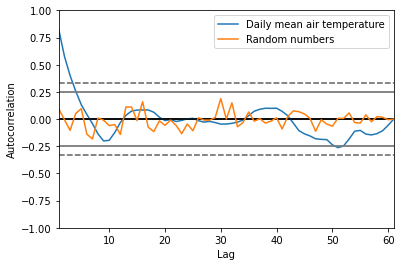

#### (Non-)Stationarity

A time series where the mean and variance of the observations stay constant over time is considered *stationary* (see [Castle and Hendry (2019](https://doi.org/10.1007/978-3-030-21432-6), p. 10) for more detailed explanations and examples). In many environmantal and socio-economic time series this is not the case (*non-stationarity*). Staying with the air temperature example, it matters a lot if temperature on a specific day of the year (DOY) was measured in the 1920ies or very recently, with climate change having now strongly affected the temperatures to be expected with a certain probability. Non-stationarity can be related to gradual developments (like atmospheric CO2 increase) but also to sudden events (like volcanic eruptions), which cause shifts in the means and variances of the data. If undetected, non-stationarity is a problem for empirical forecasting and for an analysis of relations between variables by their temporal development ([Castle and Hendry 2019](https://doi.org/10.1007/978-3-030-21432-6)). Therefore, it can be advisable to check the time series for stationarity, e.g. using the Kwiatkowski-Phillips-Schmidt-Shin test ([Kwiatkowski et al. 1992](https://doi.org/10.1016/0304-4076(92)90104-Y)) or by visual inspection of plotted values.

#### Trend detection and removal

A trend in a time series is often detected by fitting a regression. Here, we detect a linear trend, but note that trends do not need to be linear and other functions (e.g. exponential) may be more appropriate.

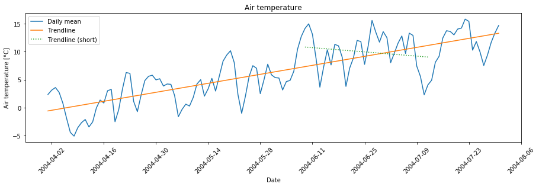

Note also that the time period we look at can matter a lot: In this example, we can detect an overall positive trend, but a negative trend if we take only the observations of a shorter time period (dotted line). Detection of breaks as another source of non-stationarity in time series is treated in Module 1 Theme 4. Some analyses may require to first remove a trend. The detrended series below simply contains the residuals of a regression of a given order.

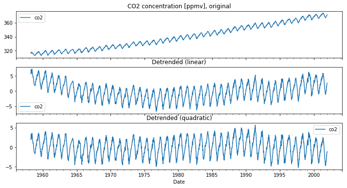

#### Decomposition of a time series: Trends, cyclic components and noise

It may also be informative to further split the variation of a time series. In addition to a level and some amount of noise, a time series may contain a trend and a seasonal or daily (cyclic or periodic) component (sometimes periods span even multiple years, e.g. (due to) the sunspot activity or the El Niño–Southern Oscillation (ENSO)). In a simple model, these components can be combined either additively or multiplicatively with an observation *y* at time *t* given as

    y(t) = Level + Trend + Seasonality + Noise

or

    y(t) = Level * Trend * Seasonality * Noise

The next figure shows (from top to bottom) weekly observations of atmospheric CO2 at Maona Loa (Hawaii), which can be decomposed into a trend, a seasonal component and a residual component based on a simple additive model.

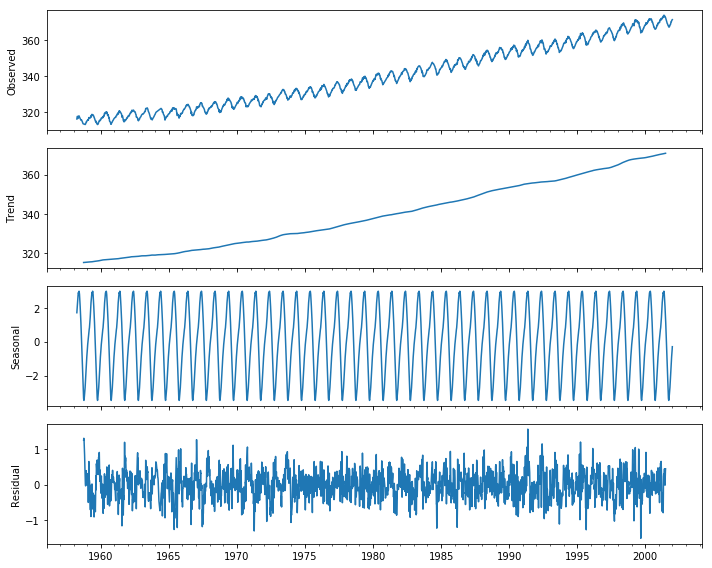

After subtraction of the trend and the seasonal component, we get relatively small residuals centred around zero, which is usually a good result. Such a decomposition may be a helpful tool for understanding your time series data and conceiving the analysis but should always be used with caution. There are more advanced methods available, such as [STL](https://www.statsmodels.org/dev/generated/statsmodels.tsa.seasonal.STL.html) (Season-Trend decomposition using LOESS; based on the work by Cleveland et al. (1990). Nevertheless, a time series can also contain abrupt changes (“breaks”) – we will get back to this later.

#### Time domain vs. frequency domain

Time series can be visualized and analysed in the time domain or in the frequency domain. We can use the [Fast Fourier Transform (FFT)](https://en.wikipedia.org/wiki/Fast_Fourier_transform) to calculate the [Discrete Fourier Transform (DFT)](https://en.wikipedia.org/wiki/Discrete_Fourier_transform), and such a decomposition of time series into different frequencies can reveal different cyclic components. Here, we see a distinct periodicity of 52 weeks in the CO2 dataset, as the CO2 concentration is fluctuating seasonally:

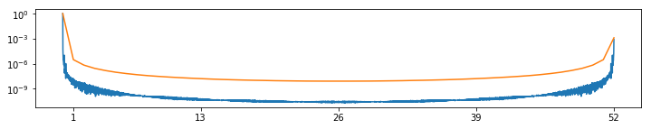

#### Temporal resampling: aggregation/binning into specific temporal units

Time series data is often resampled by aggregating (or *binning*) the observations into specific temporal units by calculating a descriptive statistical measure such as the mean (or minimum, maximum, standard deviation, ...) on a daily (weekly, monthly or yearly) basis. This is a useful step for many applications but one might also loose important information.

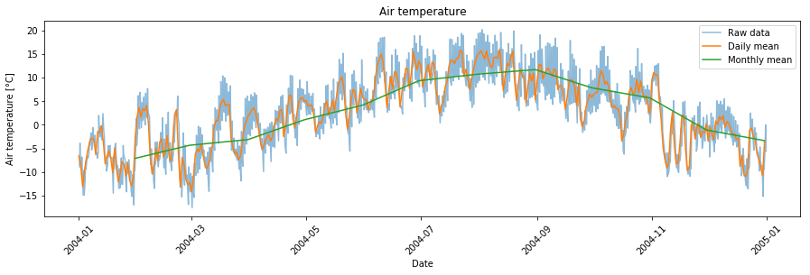

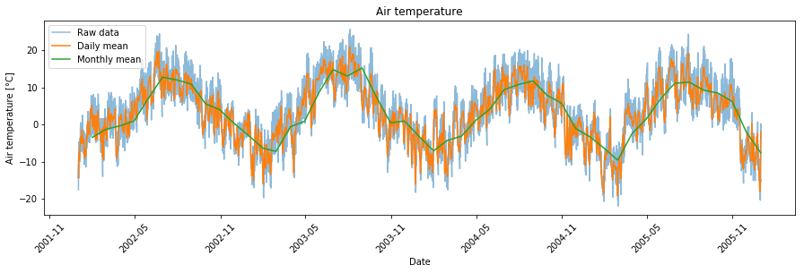

#### Time series filtering and noise reduction

As far as possible, (systematic) errors in a data set should be corrected (e.g. atmospheric and topographic correction of satellite imagery) or, if this is impossible, erroneous points should be removed prior to an analysis (e.g. exclude cloudy satellite images completely or mask clouds and cloud shadows, see the exercises (tutorials) in this and the next theme).
Often, however, some unsystematic errors remain and cause noise in a time series. Apart from random errors, also high-frequency cyclic components (e.g. diurnal temperature cycles) can be regarded as noise if this is not what you are actually interested in. Especially if the sampling rate (temporal resolution) is high, we can reduce noise (by sacrificing some temporal resolution) using temporal filter techniques, while preserving more longer-term variation and trends.
In the following example, we calculated the daily mean air temperature from a time series consisting of three measurements per day, and then we smooth this further by calculating a 10-day rolling mean. In this case, a window/kernel of length 10 days is incrementally moved by observation along the time series, in this case centered on the currently re-computed data point, to compute an average value from all values in the window. We could also aggregate daily means further, e.g., into the monthly mean air temperature.

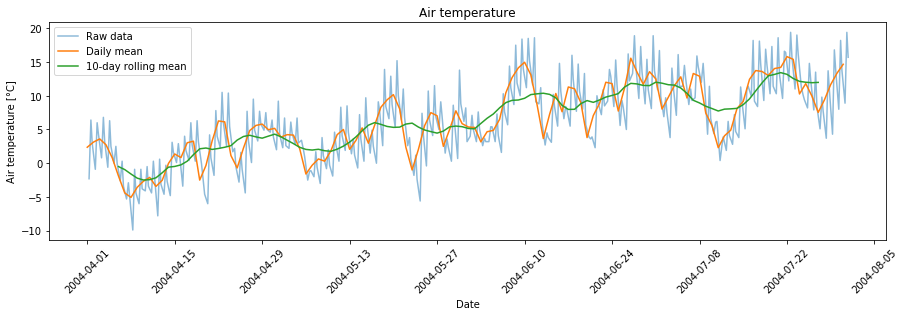

Another popular method for time-series smoothing is the Savitzky-Golay filter ([Savitzky and Golay 1964](https://doi.org/10.1021%2Fac60214a047)), that fits local polynomials to successive subsets of the data to produce values of a new time series.

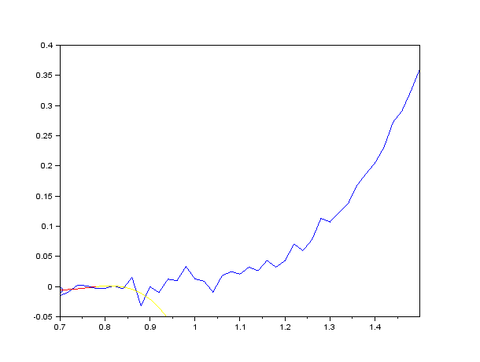

*Smoothing of noisy data by the Savitzky-Golay method (3rd degree polynomial, 9 points wide sliding window). Blue curve: raw data; blue circle: point after smoothing; yellow curve: polynomial used to determine the current point; red curve: polynomial restricted to the sliding window around the current point (figure by [Cdang 2013/Wikipedia](https://en.wikipedia.org/wiki/Savitzky%E2%80%93Golay_filter#/media/File:Lissage_sg3_anim.gif)/ [CC BY-SA 3.0](https://creativecommons.org/licenses/by-sa/3.0)).*

## Remote sensing systems: Platforms and sensors

Following earlier definitions in the literature ([Lillesand et al. 2015](https://www.wiley.com/en-us/Remote+Sensing+and+Image+Interpretation%2C+7th+Edition-p-9781118343289), [Toth and Józków 2016](https://doi.org/10.1016/j.isprsjprs.2015.10.004)), we define *remote sensing* as *the collection of information about the Earth's surface or other objects without making physical contact with it/them, instead using electromagnetic radiation*.
Today a large variety of remote sensing systems is in operational use, with their main components being the sensor and the platform carrying the sensor(s). Furthermore, some systems contain a ground segment dedicated to mission control and data processing.

A general idea of these platforms and sensors is also important for anybody working with their data, as this is related to a number of crucial aspects of data acquisition:

* distance between sensor and Earth surface/object of interest
* viewing angle
* spatial and temporal extent (coverage)
* accuracy and resolution (error sources for measurements, sampling density, repetition frequency, etc.)

More details on the acquisition systems and the characteristics of data covered by this course are provided in the respective modules.

### Platforms

**Satellite**

Earth observation satellites carry a wide range of specifically developed sensors and have played a major role in remote sensing for decades. They often travel around the Earth in a near-polar and sun-synchronous orbit, allowing them to cross the same latitude at the same local solar time (i.e. with similar illumination, which is important for sensing reflected sunlight). Often the orbit exactly repeats after completing a distinct pattern of sub-satellite tracks. Thereby almost the entire Earth is captured during one repeat cycle, with a defined revisit period (repetition frequency). Other (very high spatial resolution) satellite missions are designed to choose the direction of the sensor and thus capture selected parts of the Earth more frequently according to user needs as a commercial service (*tasking*). The continuity of time series provided by such satellite missions over multiple years to decades offers great potential for monitoring Earth surface dynamics and analyses of human-environment interactions.

**Aircraft**

Various types of (occupied) aircraft are flexibly operated to carry a wide range of sensors at hundreds to thousands of metres above ground. Along with the capabilities of the sensor, flying speed determines the covered spatial extent as well as the resulting data resolution and quality.

**Uncrewed aircraft system (UAS)**

During the last decade, drones (uncrewed aircraft) have evolved into an important platform for remote sensing, a development that has been fostered by the rapid miniaturisation of suitable sensors ([Colomina and Molina 2014](https://doi.org/10.1016/j.isprsjprs.2014.02.013), [Cummings et al. 2017](https://doi.org/10.14358/PERS.83.4.317)). In addition to the term drone, many alternative terms and acronyms are in use, most commonly uncrewed aerial vehicle (UAV), uncrewed aircraft system (UAS) and remotely piloted aircraft system (RPAS) ([Granshaw 2018](https://doi.org/10.1111/phor.12244)).

**Terrestrial systems**

Terrestrial (i.e. ground-based) systems can be static (such as terrestrial laser scanners (TLS), which are usually operated on a tripod) or mobile (with sensors mounted on a car, ship, backpack, etc.). While the above platforms mainly acquire data from above the object of interest, terrestrial systems can have very different viewing angles. Sensor-to-object distances are often short (in the order of 100 m to 102 m; "close-range sensing"), although longer ranges may be possible with suitable equipment and terrain. Recently, more and more large time series are being built with autonomously operating terrestrial systems installed permanently at monitoring sites.

### Sensors

Depending on the application, sensors record radiation in different parts of the electromagnetic spectrum (wavelegths) ranging from ultraviolet to radio frequencies. Sensors follow either a passive or an active measurement principle, based on measuring electromagnetic radiation that is emitted either from an external source or actively by the system itself, respectively.

**Passive** measurement principles use radiation from an external source, which is (in earth observation) very often the Sun. Examples are passive microwave sensing and imaging in the visible and near-infrared (NIR) to thermal infrared (TIR) parts of the spectrum. Today most people carry an optical imaging sensor in their pocket (in the camera of their smartphone), which can produce colour images with three bands in the visible spectrum (sensing red, green and blue light). In this Module and in Module 2 you will learn how to use time series of multispectral satellite images, which include additional bands in the NIR to TIR spectrum. Even more (and narrower) bands are recorded by hyperspectral imaging, which is the focus of Module 4.

Systems with an **active** measurement principle record radiation emitted by themselves and then reflected by a surface/object. This includes synthetic aperture radar interferometry and laser scanning, also known as LiDAR (Light detection and ranging). In addition to the quantity of radiation also the time-structure of the emitted and detected radiation can be important, as this contains information about sensor-to-object distances (range measurement). In Module 3 you will learn how to work with time series of 3D point clouds acquired by laser scanning. 

### Resolution and scale of remote sensing data

Typically, the capabilities of these remote sensing systems in terms of coverage/extent, accuracy and resolution (in the spectral, spatial, radiometric and temporal domains) are inversely related, so a large extent usually precludes a very high spatial and temporal resolution. Moreover, a high resolution in multiple domains is largely restricted by sensor properties and their physical limitations. Different remote sensing platforms tend to be associated with typical spatial and temporal acquisition scales related to repetition rate, operative range and spatial resolution.

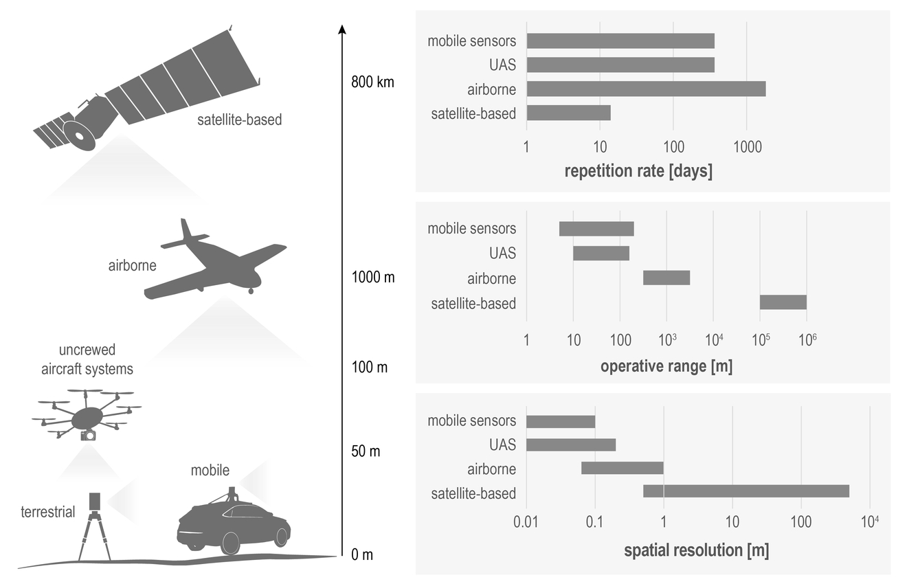

*Different remote sensing platforms along with their typical repetition rate, operative range, and spatial resolution (modified from Rutzinger et al. 2021).*

## Remote sensing time series

### Contents of remote sensing time series

Typical remote sensing time series (RSTS) can be built from

* Geophysical or biophysical variables (e.g. temperature in °C or K, leaf-area-index (LAI), surface reflectance, surface elevation, ...)
* Index variables (often spectral indices, e.g. Normalized Difference Vegetation Index (NDVI), Normalized Difference Snow Index (NDSI), and many more ...)
* Thematic variables
    * Discrete thematic variables (e.g. a landcover category, or a binary snow/no snow value)
    * Continuous field estimates of a thematic variable (e.g. fractional snow cover, or fractional tree cover) indicating how much of a spatial unit (often one pixel) the thematic variable covers

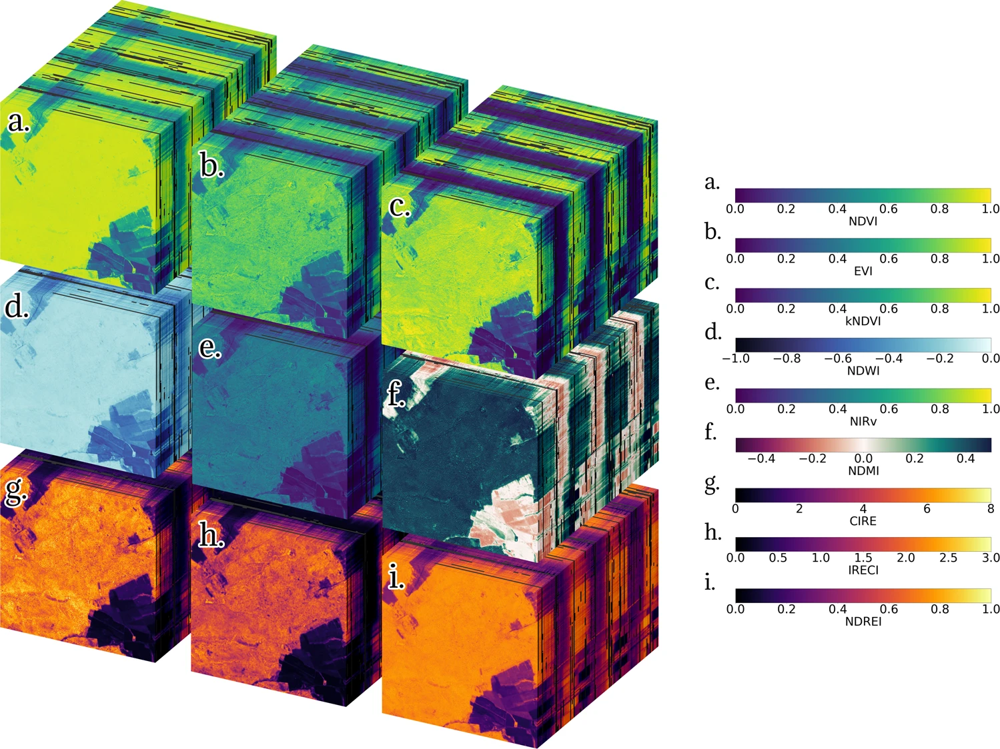

*Time series of spectral indices computed from Sentinel-2 satellite imagery. Each of the nine spectral indices (a) to (i) forms a rectangular cuboid with three dimensions (*x*, *y*, *time*) of length {*lx* = 512, *ly* = 512, *ltime* = 195}. The initial date is 2018-07-09 (front) and the final date is 2021-09-26 (back) (figure by [Montero et al. 2023](https://doi.org/10.1038/s41597-023-02096-0)/ [CC BY 4.0](http://creativecommons.org/licenses/by/4.0/)).*

### Structure of remote sensing time series

The structure of most remote sensing time series (RSTS) can be imagined as a raster stack. In case of a single-band image time series or an elevation model time series (*3D array*), each pixel (defined by location in *x* and *y* dimension) contains one series of observations with unique time stamps (date-time index along the time dimension). 

Often, each timestamp is associated with a couple of variables that are observed (e.g. multispectral image time series from an optical sensor with several bands at different wavelengths) or even hundreds of them (e.g. in hyperspectral time series). A multi-/hyperspectral image time series with *n* bands can be considered as an array with four dimensions (*x, y, time, band*), where each pixel contains *n* series of observations (i.e. length of the *band* dimension). Compared to raster data with its regular spatial structure, the structure of 3D point cloud time series is a bit less straightforward - this will be detailed in Module 3. A good spatial alignment is an important prerequisite of remote sensing time series. If this precondition is not met directly after the data acquisition, it must be established by a co-registration procedure.

### Extent, resolution and scale of phenomena to be observed

Extent and resolution in various domains are key properties of remote sensing data. The extent is the range covered in space (area in 2D, but possibly also in 3D), or in another domain, such as time (the entire Landsat archive, for instance covers the time period since 1972 ([Wulder et al. 2016](https://doi.org/10.1016/j.rse.2015.11.032)), whereas most other RSTS have a much shorter temporal extent). Similarly, the resolution of remote sensing data is defined in different domains, i.e. in the spatial, spectral, radiometric and temporal domain ([Liang et al. 2020](https://doi.org/10.1016/C2017-0-03489-4)).

**Spatial resolution**

*Spatial resolution* most often refers to the (geometric) distance between samples or the size of sampling units in object space (i.e. very often on the ground, sometimes on other objects (such as trees or buildings)), thus also referred to as *ground sample distance* (GSD). Together with the sharpness (blur) and noise of an image, the GSD largely determines the size of the smallest objects or phenomena that can be discriminated ([ECCOE 2020](https://www.usgs.gov/media/images/spatial-resolution-digital-imagery-guideline)/[I2R Corp](https://www.i2rcorp.com/main-business-lines/sensor-hardware-design-support-services/spatial-resolution-digital-imagery-guideline)). Depending on the sensor and on the acquisition geometry, the spatial resolution can be (more or less) homogeneous (e.g. satellite imagery) or strongly varying across the captured area (e.g. point density in terrestrial laser scanning point clouds).

**Spectral resolution**

The *spectral resolution* of a sensor system is determined by the number and width of its spectral bands. A normal digital camera, for instance, can detect visible light and has three bands in the red, green and blue part of the electromagnetic spectrum, whereas *hyperspectral* systems have hundreds of narrow bands. Multispectral sensors typically record a number of bands somewhere in between, i.e. between three and a few tens of bands.

**Radiometric resolution**

*Radiometric resolution* defines the dynamic range and is given as number of bits used to represent the recorded radiation. It determines how many different levels can be differentiated (in each band). With 1 bit, only two levels (e.g. black and white) can be stored, and an 8 bit image can already resolve 256 (28) grey levels per band.

**Temporal resolution**

The repeat cycle or frequency of observations is expressed by the *temporal resolution*. Regular repeat cycles can range from minutes (e.g. ground-based time-lapse cameras/webcams) to days (many satellite systems) and years (typical repeat cycle for aerial imagery). Clearly, this is a critical aspect regarding the frequency and speed of changes to be observed.

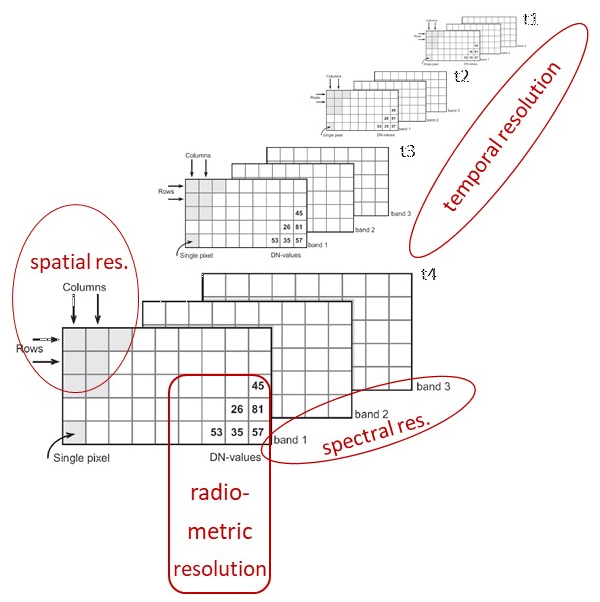

*Remote sensing data resolution in different domains.*

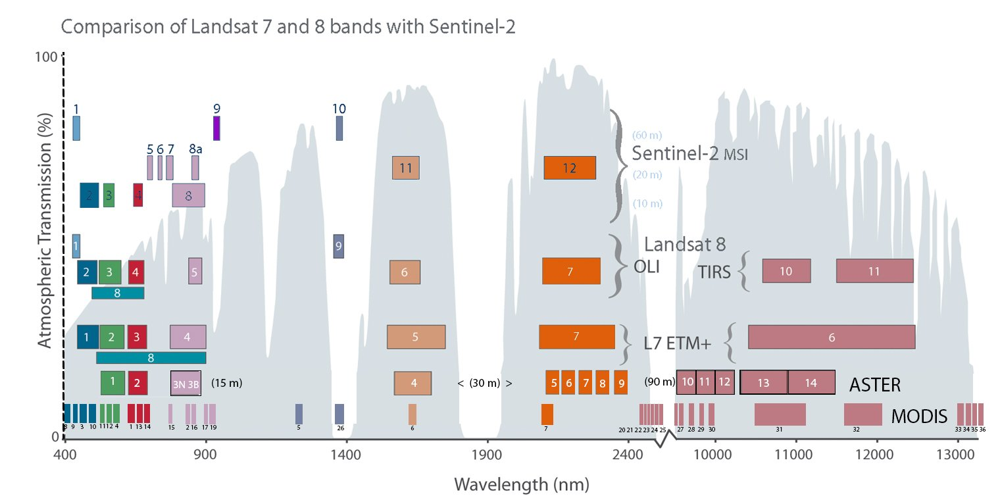

*Comparison of spectral bands for Sentinel-2, Landsat 8, Landsat 7, ASTER and MODIS and atmospheric transmission curve (figure by [USGS Landsat](https://twitter.com/USGSLandsat/status/773939936755982336/photo/1)). Details and other versions of this graphic are provided by [NASA/Barsi and Rocchio 2020](https://landsat.gsfc.nasa.gov/article/the-intervening-atmosphere-tracing-the-provenance-of-a-favorite-landsat-infographic/).*

### Towards analysis-ready remote sensing time series - Some preprocessing considerations

Important for applied remote sensing, the data and its resolution in various domains must be appropriate to resolve the studied phenomena with enough detail (further reading in [Kennedy et al. 2009](https://doi.org/10.1016/j.rse.2008.07.018)). While this often means that we need a data acquisition at high resolution to capture small variations, it can also mean that we need to resample or smooth our data spatially or temporally to extract only the relevant variation, excluding small changes occurring over short spatial distances or in short time periods (depending on the application and data).

In practice, the temporal interval of observations in a remote sensing time series is often irregular due to various constraints of data acquisition (dependence on suitable environmental conditions, temporary system outage, change of the measurement protocol, etc.) or because invalid data has been removed (e.g. by a cloud mask, an outlier filter or some other form of preprocessing). Depending on the further analysis steps, consider if your data should be resampled to regular intervals (e.g. when observations are averaged over a fixed time interval).

Most data sets contain at least some missing values (gaps in certain spatial areas or time periods) and some methods cannot be used adequately with missing values (e.g. many of the popular machine learning algorithms propagate a missing value in the feature vector to the prediction). Therefore, an important consideration is if and how to fill gaps (e.g. impute missing values by a dummy value or by the preceeding/succeeding valid observation ('forward/backward filling'), or interpolate between observations?).

A further pre-processing step potentially needed is some form of harmonization or normalization of data acquired under different conditions or with different sensors. This can prevent a systematic bias being interpreted as change.

Moreover, it is generally a good idea to get to know the quality of your input data before you dive into more complex processing and interpretation. Thus, it is often worth analysing the completeness (proportion and distribution of missing values/gaps) and correctness (comparison with reference data or visual plausibility assessment) of observations.

## Self-evaluation quiz

<form name="quiz" action="" method="post" onsubmit="evaluate_quiz(); return false">

<!--Question 1-->
<label for="q_01">
What are some of the main characteristics of a time series?
</label> 
<input type="checkbox" name="q_01">All values are measured without any errors. 
<input type="checkbox" name="q_01">The time of observation is referenced by a time stamp. 
<input type="checkbox" name="q_01">A time series is a set of observations recorded at the same time. 
<input type="checkbox" name="q_01">The observed values are ordered clearly by time. 

The time of observation is referenced by a time stamp.&The observed values are ordered clearly by time.

<output id="output_q_01"></output>  

<!--Question 2-->
<label for="q_02">
How are patterns of persistence in a time series recognized?
</label> 
<input type="checkbox" name="q_02">Temporally succeeding observations are more similar to each other than those observed longer apart. 
<input type="checkbox" name="q_02">Temporally close observations show some negative correlation, while those observed longer apart are positively correlated. 
<input type="checkbox" name="q_02">Temporally close observations tend to show some positive correlation, while those observed longer do not. 

Temporally succeeding observations are more similar to each other than those observed longer apart.&Temporally close observations tend to show some positive correlation, while those observed longer do not.

<output id="output_q_02"></output>  

<!--Question 3-->
<label for="q_03">
Trends in a time series: Which statement is correct?
</label> 
<input type="checkbox" name="q_03">A trend is always linear. 
<input type="checkbox" name="q_03">A trend is always positive (i.e., values are increasing with time). 
<input type="checkbox" name="q_03">A trend is always the same in one particular time series, regardless if we look at the entire time series or only a part of it. 
<input type="checkbox" name="q_03">Trends can be computationally removed to reveal other components of a time series. 

Trends can be computationally removed to reveal other components of a time series.

<output id="output_q_03"></output>  

<!--Question 4-->
<label for="q_04">
Which of these sensors use a passive measurement principle?
</label> 
<input type="checkbox" name="q_04">Terrestrial laser scanner 
<input type="checkbox" name="q_04">Hyperspectral camera onboard a drone 
<input type="checkbox" name="q_04">Multi-spectral instrument onboard the Sentinel-2 satellites 
<input type="checkbox" name="q_04">Synthetic aperture radar onboard the Sentinel-1 satellites 

Hyperspectral camera onboard a drone&Multi-spectral instrument onboard the Sentinel-2 satellites

<output id="output_q_04"></output>  

<!--Question 5-->
<label for="q_05">
Extent, resolution, and scale of remote sensing time series: Which statement is correct?
</label> 
<input type="checkbox" name="q_05">A high spatial resolution of imagery means each pixel corresponds to a large area on the ground. 
<input type="checkbox" name="q_05">A high spatial resolution of imagery means each pixel corresponds to a small area on the ground. 
<input type="checkbox" name="q_05">We should avoid recording time series with very high temporal resolution because this makes it difficult to detect long term changes and the resolution cannot be changed. 
<input type="checkbox" name="q_05">To constrain the timing of rapid changes, a high temporal resolution is required. 

A high spatial resolution of imagery means each pixel corresponds to a small area on the ground.&To constrain the timing of rapid changes, a high temporal resolution is required.

<output id="output_q_05"></output>  

<input type="submit" value="Submit" style="font-size:14pt">  

<output id="output_overall">
</output>
</form>

## Hands-on remote sensing time series

### Tutorial 1: Raster Time Series in Python using xarray

This [Jupyter notebook](./T1_S2_xarray.ipynb) introduces Python's [`xarray`](https://docs.xarray.dev/en/stable/#), a package for processing large multi-dimensional arrays ([Hoyer and Hamman 2017](https://doi.org/10.5334/jors.148)) and shows how to use it for handling and analysing a Sentinel-2 image time series. The next themes will build on this tutorial, as they use xarray as well (but they also repeat some explanations).

### Tutorial 2 (optional): Exploring a Sentinel-2 time series using QGIS and the GEE Timeseries Explorer plugin

As a straightforward option to access huge collections of Earth observation data we try out the [QGIS GEE Timeseries Explorer](https://geetimeseriesexplorer.readthedocs.io/en/latest/index.html) plugin ([Rufin et al. 2021](https://doi.org/10.5194/isprs-archives-XLVI-4-W2-2021-155-2021)).

Overview:

* Load a few points as geopackage or shapefile (download from the course data repository as `T1_sample_points_001.gpkg` or digitize your own points in a new layer in QGIS) and browse for S2 cloud-free NDVI time series data at these points
* Query NDVI data for a defined time period and for a defined area-of-interest
* Visualize search result: time series plot and single scenes
* Apply a reducer to aggregate data to temporal units
* Visualize aggregated data
* Optionally continue with Tutorial 3: Download temporal profiles as raw text and import them to Python

For more detailed explanations see [this tutorial](./T1_QGIS_GEE_TS_Explorer.md) and the [official plugin documentation](https://geetimeseriesexplorer.readthedocs.io/en/latest/index.html).

### Tutorial 3 (optional): Explore temporal profiles of a vegetation index in Python with pandas

Export temporal profiles of a vegetation index from GEE via QGIS and explore them in Python

In [this tutorial](./T1_spectral-temporal_profiles.md) we explore temporal profiles of Sentinel-2 Normalized Difference Vegetation Index (NDVI). Sample points for different landcover classes are used. They are all located around the village of Obergurgl (Central Alps, Tyrol, Austria).

### Tutorial 4 (optional): Exploring and processing a Sentinel-2 time series using the GRASS GIS temporal framework

[This tutorial](./T1_GRASS_raster_time_series.md) shows how an entire workflow for Sentinel-2 optical image time series can be implemented in GRASS GIS. This includes the search and download of scenes from the Copernicus Open Access Hub, a number of preparatory steps within the GRASS GIS temporal framework and, finally, the exploration and analysis of a Space-Time Raster Dataset (STRDS).

*WARNING:*

*This excercise is provided for interested course participants who are motivated to experiment with GRASS GIS (and ideally have already some experience with the software). Currently, however, we do not recommend this excercise because of known occasional problems with the download from the Copernicus Open Access Hub (especially with data older than one month), with installation of the i.sentinel addon, and a bug in the creation of the temporal register file. Maybe these issues are (partly) resolved in current versions, but this needs further testing. So don't get frustrated if you still encounter problems ...*

## References
### Key references

Castle, J. L., & Hendry, D. F. (2019). Modelling our changing world. Springer Nature. 128 p. https://doi.org/10.1007/978-3-030-21432-6

Eitel, J. U., Höfle, B., Vierling, L. A., Abellán, A., Asner, G. P., Deems, J. S., ... & Vierling, K. T. (2016). Beyond 3-D: The new spectrum of lidar applications for earth and ecological sciences. Remote Sensing of Environment, 186, 372-392. https://doi.org/10.1016/j.rse.2016.08.018

Kennedy, R. E., Townsend, P. A., Gross, J. E., Cohen, W. B., Bolstad, P., Wang, Y. Q., & Adams, P. (2009). Remote sensing change detection tools for natural resource managers: Understanding concepts and tradeoffs in the design of landscape monitoring projects. Remote Sensing of Environment, 113(7), 1382-1396. https://doi.org/10.1016/j.rse.2008.07.018

Künzer, C., Dech, S., & Wagner, W. (2015). Remote sensing time series - Revealing land surface dynamics, Springer, 441 p. https://doi.org/10.1007/978-3-319-15967-6

Liang, S., & Wang, J. (2020). Advanced remote sensing: Terrestrial information extraction and applications, 2nd edition, Academic Press, 1010 p. https://doi.org/10.1016/C2017-0-03489-4

Lillesand, T. M., R. W. Kiefer, and J. W. Chipman, 2015: Remote sensing and image interpretation. 7th ed., John Wiley & Sons, New York, 736 p.

Rees, W. G. (2012). Physical principles of remote sensing, 3rd edition, Cambridge University Press, 441 p. https://doi.org/10.1017/CBO9781139017411

Toth, C. and G. Józków, 2016. Remote sensing platforms and sensors: A survey. ISPRS Journal of Photogrammetry and Remote Sensing, 115, 22–36. https://doi.org/10.1016/j.isprsjprs.2015.10.004

Vosselman, G., & Maas, H.-G. (2010). Airborne and terrestrial laser scanning, CRC Press, 336 p.

Woodcock, C. E., Loveland, T. R., Herold, M., & Bauer, M. E. (2020). Transitioning from change detection to monitoring with remote sensing: A paradigm shift. Remote Sensing of Environment, 238, 111558. https://doi.org/10.1016/j.rse.2019.111558

### Additional references cited in this theme

Cleveland, R. B., Cleveland, W. S., McRae, J. E., & Terpenning, I. (1990). STL: A seasonal-trend decomposition procedure based on LOESS. Journal of Official Statistics, 6, 3-73.

Colomina, I., & Molina, P. (2014). Unmanned aerial systems for photogrammetry and remote sensing: A review. ISPRS Journal of Photogrammetry and Remote Sensing, 92, 79-97.
https://doi.org/10.1016/j.isprsjprs.2014.02.013

Cummings, A. R., McKee, A., Kulkarni, K., & Markandey, N. (2017). The rise of UAVs. Photogrammetric Engineering & Remote Sensing, 83(4), 317-325. https://doi.org/10.14358/PERS.83.4.317

ECCOE (EROS CalVal Center of Excellence)/I2R Corp (2020). Spatial Resolution Digital Imagery Guideline. https://www.usgs.gov/media/images/spatial-resolution-digital-imagery-guideline

Gebbert, S., Pebesma, E. (2014). A temporal GIS for field based environmental modeling. Environmental Modelling & Software, 53, 1-12. https://doi.org/10.1016/j.envsoft.2013.11.001

Gebbert, S., Pebesma, E. (2017). The GRASS GIS temporal framework. International Journal of Geographical Information Science, 31, 1273-1292. http://dx.doi.org/10.1080/13658816.2017.1306862

Granshaw, S. I. (2018). RPV, UAV, UAS, RPAS … or just drone? The Photogrammetric Record, 33(162), 160-170. https://doi.org/10.1111/phor.12244

Hoyer, S., & Hamman, J. (2017). xarray: ND labeled arrays and datasets in Python. Journal of Open Research Software, 5(1). https://doi.org/10.5334/jors.148

Institute of Meteorology and Geophysics (2013). Air temperature and precipitation time series from weather station Obergurgl, 2000-2009. University of Innsbruck, PANGAEA. https://doi.org/10.1594/PANGAEA.806623

Montero, D., Aybar, C., Mahecha, M. D., Martinuzzi, F., Söchting, M., & Wieneke, S. (2023). A standardized catalogue of spectral indices to advance the use of remote sensing in Earth system research. Scientific Data, 10(1), 197. https://doi.org/10.1038/s41597-023-02096-0

Rouse, J.W, Haas, R.H., Scheel, J.A., and Deering, D.W. (1974) 'Monitoring Vegetation Systems in the Great Plains with ERTS.' Proceedings, 3rd Earth Resource Technology Satellite (ERTS) Symposium, Vol. 1, p. 48-62. https://ntrs.nasa.gov/citations/19740022614

Rutzinger, M., Bremer, M., Zieher, T., Mayr, A. (2021): Fernerkundung. In: Bork-Hüffer, Tabea; Füller, Henning; Straube, Till (Eds.): Handbuch Digitale Geographien: Welt - Wissen - Werkzeuge. Bern, Stuttgart, Wien: UTB Hauptverlag, ISBN: 9783825255671. https://elibrary.utb.de/doi/book/10.36198/9783838555676

Savitzky, A., & Golay, M. J. (1964). Smoothing and differentiation of data by simplified least squares procedures. Analytical chemistry, 36(8), 1627-1639. https://doi.org/10.1021%2Fac60214a047

Wulder, M. A., White, J. C., Loveland, T. R., Woodcock, C. E., Belward, A. S., Cohen, W. B., ... & Roy, D. P. (2016). The global Landsat archive: Status, consolidation, and direction. Remote Sensing of Environment, 185, 271-283. https://doi.org/10.1016/j.rse.2015.11.032
