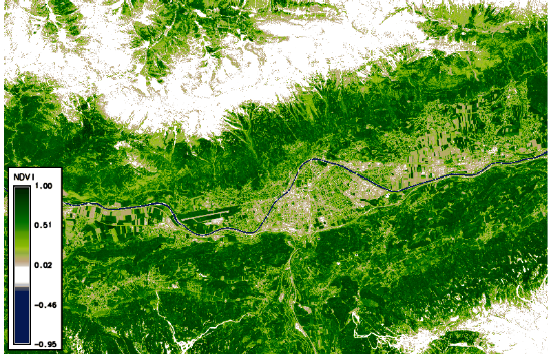
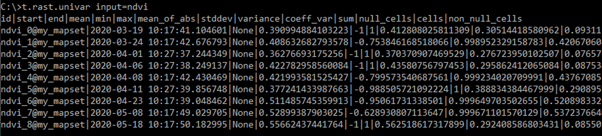
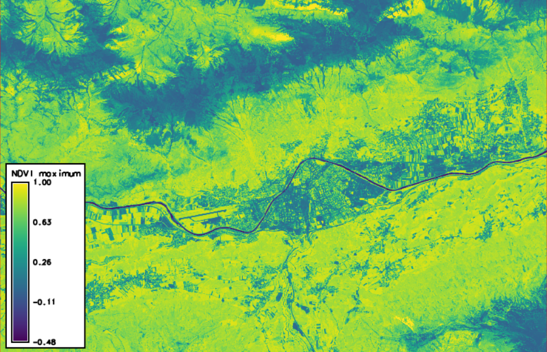
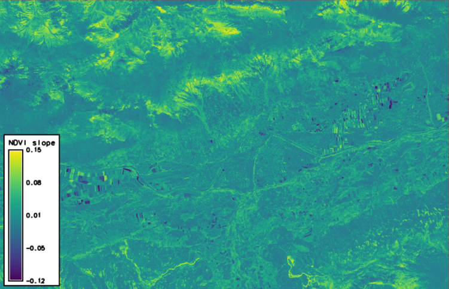

# Exploring and processing a Sentinel-2 time series using the GRASS GIS temporal framework

This section shows how an entire workflow for Sentinel-2 optical image time series can be implemented in GRASS GIS. This includes the search and download of scenes from the Copernicus Open Access Hub, a number of preparatory steps within the GRASS GIS temporal framework and, finally, the exploration and analysis of a Space-Time Raster Dataset (STRDS).

*WARNING:*

*This excercise is provided for interested course participants who are motivated to experiment with GRASS GIS (and ideally have already some experience with the software). Currently, however, we do not recommend this excercise because of known problems with the download from the Copernicus Open Access Hub (especially with data older than one month), with installation of the i.sentinel addon, and a bug in the creation of the temporal register file. Maybe these issues are (partly) resolved in current versions, but this needs further testing. So don't get frustrated if you still encounter problems ...*


## Prerequisites

To download and use the Snetinel-2 imagery you will need

* an account for the Copernicus Open Access Hub (register [here](https://scihub.copernicus.eu/userguide/SelfRegistration))
* the sentinelsat Python package installed (requires pandas)
* a GRASS GIS installation including the i.sentinel addon
* some GB of free storage on your disc (> 2 GB per Sentinel-2 scene; > 2 GB to unzip it)


## Some preparations

Create a settings textfile with credentials for Copernicus Open Access Hub account (two lines with user and PW --> ...\credentials_ESA.txt).

Download an area-of-interest polygon or create your own and save as ...\my_aoi.gpkg.

Launch GRASS GIS and create a new location, set the CRS to WGS84 / UTM zone 32N (EPSG code 32632).

```
grass78			# start GRASS GIS from the commandline

g.gui wxpython	# start GUI (if not started yet)
```

Import my_aoi.gpkg

```
v.import input=C:\work\testing\lv_fe\AOI\my_aoi.gpkg --o
```

Check region and set to AOI extent

```
g.region -p
g.region vect=my_aoi
```

## Search and download of Sentinel-2 scenes

Search the Copernicus Open Access Hub and list only (-l) all available Sentinel-2 products containing the AOI (or for the current region) that meet the search criteria (between two defined dates and with cloud cover <=15%).
```
i.sentinel.download -l settings=C:\work\testing\lv_fe\credentials_ESA.txt producttype=S2MSI2A map=my_aoi area_relation=Contains start=2020-03-01 end=2020-05-31 sort=ingestiondate order=desc clouds=15
```


Download these Sentinel-2 products.
```
i.sentinel.download settings=C:\work\testing\lv_fe\credentials_ESA.txt producttype=S2MSI2A map=my_aoi area_relation=Contains start=2020-03-01 end=2020-05-31 sort=ingestiondate order=desc clouds=15 output=C:\work\testing\lv_fe\S2_time_series
```

## Import these Sentinel-2 products into GRASS GIS

By default input data are imported into GRASS format, alternatively data can be linked if -l is given.
Limit import to selected bands only, here with 10 m resolution. Double quotes may be needed to define a pattern!

At first, print list of raster files to be imported by -p.
For each file also the projection match with current location is printed including detected input data EPSG code. If projection of input data differs from current location consider reprojection (-r) or creating a new location for import.
```
i.sentinel.import -p input=C:\work\testing\lv_fe\S2_time_series pattern="B0(4|8)_10m"
```

It is also useful to import cloud mask features by -c flag (as vector map).
Now import/link (-l) and provide a name for the output file to use later with t.register
```
i.sentinel.import -l -c input=C:\work\testing\lv_fe\S2_time_series pattern="B0(4|8)_10m" register_output=C:\work\testing\lv_fe\S2_time_series\t_register.txt memory=3000 --o					# only import bands 4 and 8
```

## Temporal registration of the imported rasters into a Space Time Dataset

GRASS GIS includes a temporal framework (Gebbert and Pebesma [2014](https://doi.org/10.1016/j.envsoft.2013.11.001), [2017](http://dx.doi.org/10.1080/13658816.2017.1306862)), where spatio-temporal data is be organized in *Space Time Datasets*.


Such a space-time dataset (STDS) is a collection of time stamped maps (snapshots) of the same variable

- Space time raster datasets (strds)
- Space time 3D raster datasets (str3ds)
- Space time vector datasets (stvds)

Space-time datasets are mapset specific, they can only register raster, 3D raster or vector maps from the same mapset.

STDS are processed via a dedicated group of tools (t.*), e.g.:

- t.connect, t.create, t.rename, t.register, …		        (data management)
- t.rast.extract, t.rast.gapfill, t.rast.algebra, … 		(querying and map calculation)
- t.rast.series, t.rast.aggregate, t.rast.accumulate, … 	(aggregation and accumulation analysis)

Visualization of space-time datasets is achieved with

- g.gui.animation
- g.gui.timeline
- g.gui.mapswipe
- g.gui.tplot

For more info, see the GRASS GIS documentation [here](https://grass.osgeo.org/grass78/manuals/temporal.html) and [here](https://grass.osgeo.org/grass78/manuals/temporalintro.html).


So the next step is to create a new Space Time Dataset, more specifically a *Space Time Raster Dataset* (STRDS) called *sentinel*, since we want to use our Sentinel-2 bands (which are rasters).
```
t.create type=strds temporaltype=absolute output=sentinel title="S2_strds" description="Sentinel-2 time series spring 2020"
```

Register all imported Sentinel bands into the prepared STRDS (which is still empty): Assigns timestamps and registers raster maps in a space time raster dataset
```
t.register input=sentinel file=C:\work\testing\lv_fe\S2_time_series\t_register.txt		
```
We use the text file with timestamps for the scenes (created during import of the bands). In case of problems with teh following steps, check if there are empty lines between entries of the t_register.txt file (created by a bug in t.register) and delete such empty lines.


## Handling of a Space Time Dataset

Before analyse the data itself, we check basic metadata of the space time raster dataset (STRDS).

```
t.info input=sentinel                   # print metadata of the *sentinel* STRDS
t.rast.list input=sentinel              # list all rasters contained in the *sentinel* STRDS
```

Using the g.gui.timeline tool, we can plot the timeline of the Sentinel-2 scenes, and (optionally) show also a 3D plot of spatio-temporal extents ("space-time cube").


Note that the observations (Sentinel-2 scenes) are not regularly spaced in time; especially if we queried only scenes with low cloud cover percentage, this can result in larger gaps.

There are also ways to undo the previous steps, i.e. remove data from the temporal database if needed:

```
t.unregister --h		# Unregisters raster, vector and raster3d maps from the temporal database or a specific space time dataset (---h to show help).
t.remove --h			# Removes entire space time datasets from temporal database (---h to show help).
```

## NDVI time series

For Normalized Difference Vegetation index (NDVI) computation we will create two new space time datasets (subsets) for 4th and 8th bands, respectively.

```
t.rast.extract input=sentinel where="name like '%B04%'" output=b4
t.rast.extract input=sentinel where="name like '%B08%'" output=b8
```

Check the content of these strds
```
t.rast.list input=b4
t.rast.list input=b8
```

Calculate NDVI
```
t.rast.algebra expression="ndvi=float(b8 - b4)/(b8 + b4)" basename=ndvi --o
```

Use `t.rast.list in=ndvi` to print a list of the calculated NDVI maps (registered in the new strds *ndvi*) and print info about the *ndvi* STRDS with `t.info ndvi`.

##	Visualization of the NDVI time series

Set an NDVI-specific color table (which is pre-configured in GRASS GIS)

```
t.rast.colors input=ndvi color=ndvi
```



Using *g.gui.animation*, we created the animation above (in case of problems, add multiple rasters, not STRDS, because there is a problem with the way timestamps were created). Note that the cloud masks (boundaries in pink) do not look ideal in all cases. Furthermore, we can plot (and also export) the values of the NDVI time series at a defined point (with the possibility to export values to CSV file) via the GUI or the commandline

```
g.gui.tplot strds=ndvi coordinates=659071.2,5244350.1 title=NDVI xlabel=Date ylabel=NDVI
```


## Univariate statistics for each registered raster

We can easily calculate some univariate statistics for each raster registered in a STRDS and, optionally, export the statistics to a textfile:
```
t.rast.univar input=ndvi out=C:\work\FE-Kurs\sentinel-2\stats.txt sep=tab
```




## Temporal aggregation of time series values for each pixel

**t.rast.series** performs different aggregation algorithms on all or a subset of raster maps in a space time raster dataset.

Aggregate operations to be performed on the raster maps include, e.g.:

- average
- count
- median
- standard deviation
- range
- minimum or maximum
- min/max_raster (raster map number with the maximum (or the minimum) time-series value)
- arbitrary quantiles
- skewness
- parameters of a linear regression model ("trend line") fitted to the time series of each pixel (slope, intercept/offset, coefficient of determination)
- ...
- see the [t.rast.series manual](https://grass.osgeo.org/grass78/manuals/t.rast.series.html) for details

Here, we produce two new rasters containing, for each pixel, the standard deviation and the maximum value of the time series, respectively:

```
t.rast.series in=ndvi method=stddev out=ndvi_stddev --o
t.rast.series in=ndvi method=maximum out=ndvi_max --o
```




Rasters created in GRASS GIS can be exported as GeoTIFF, e.g.:
```
r.out.gdal in=ndvi_stddev out=C:\work\FE-Kurs\sentinel-2\ndvi_stddev.tif format=GTiff --o
```

... and create a map layout in another software (e.g. QGIS):


Finally, we want to look at the trend of NDVI across our time series. Therefore, we let GRASS GIS fit a linear regression to the NDVI time series of each pixel and write the slope to a new raster. 
Here, a positive trend of the NDVI reflects the disappearance of snow and the greening of the vegetation, especially at higher elevations and on ski runs (in the southern part of the AOI). This is contrasted by a negative NDVI trend of some agricultural fields due to the harvest of certain crops.

```
t.rast.series in=ndvi method=slope out=ndvi_slope --o
```




## Summary and outlook

To conclude, this tutorial has povided an introduction to working with remote sensing time series in GRASS GIS. You have learned

- how to search and download Sentinel-2 satellite data from the Copernicus Open Access Hub
- how to import and register the data into the GRASS GIS framework for spatio-temporal processing
- how to run basic analysis steps and visually explore the data

For those who want to dive deeper into spatio-temporal analysis with GRASS GIS, there are a couple of [add-ons] https://grass.osgeo.org/grass80/manuals/addons/) that could be interesting, such as:

- r.regression.series - Makes each output cell value a function of the values assigned to the corresponding cells in the input raster map layers.
- r.mregression.series - Calculates multiple regression between time series: Y(t) = b1 * X1(t) + ... + bn * Xn(t).
- r.seasons - Extracts seasons from a time series.
- r.series.decompose - Calculates decomposition of time series X.
- r.series.diversity - Compute diversity indices over input layers.
- r.series.filter - Performs filtering of raster time series X (in time domain).
- r.series.lwr - Approximates a time series and creates approximated, gap-filled output.
- r.hants - Approximates a periodic time series and creates approximated output.
