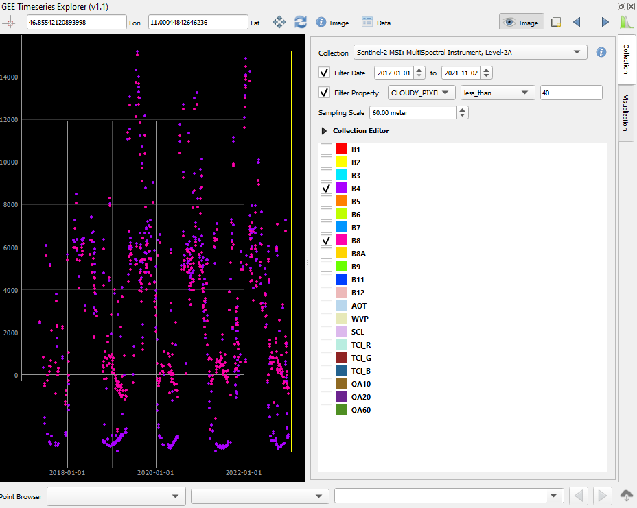
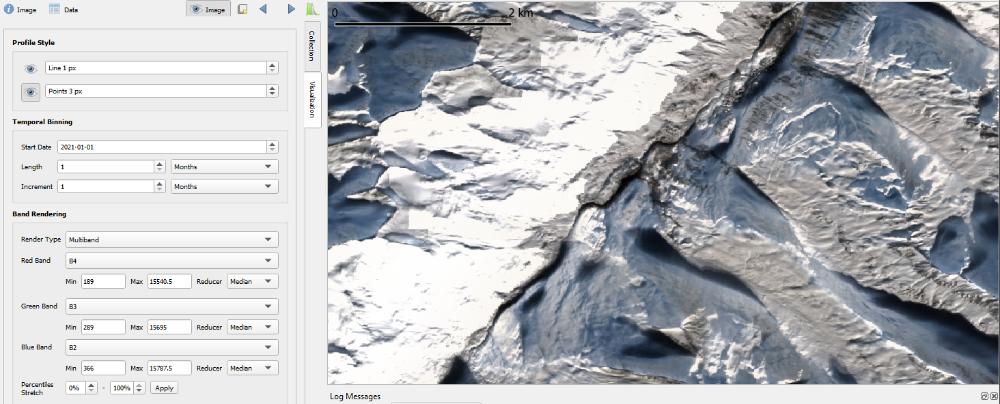
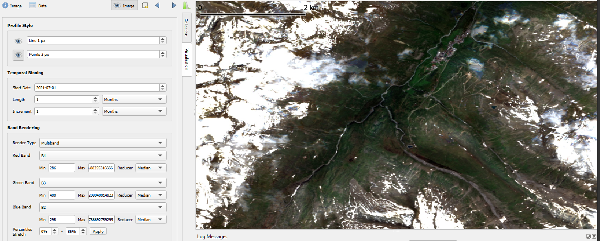
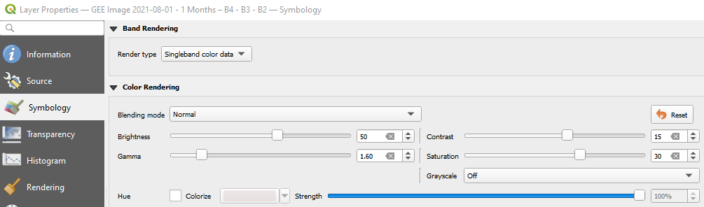
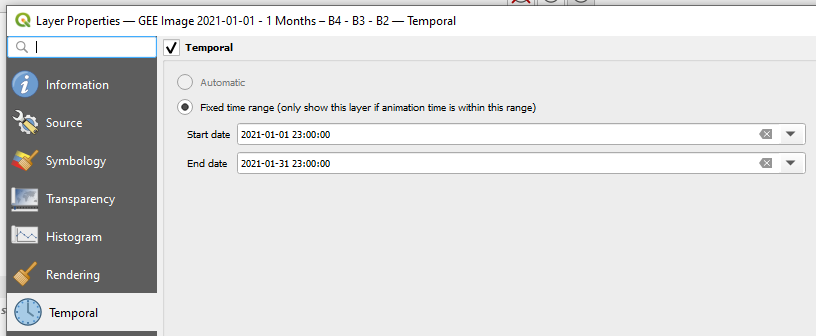

# Exploring a Sentinel-2 time series using QGIS and the GEE Timeseries Explorer plugin

As a straightforward option to access huge collections of Earth observation data we try out the QGIS GEE Timeseries Explorer plugin ([Rufin et al. 2021](https://doi.org/10.5194/isprs-archives-XLVI-4-W2-2021-155-2021)).

## Overview

* load a few points as geopackage (download from the course data repository as `T1_sample_points_001.gpkg` or digitize your own points in a new layer in QGIS) and browse for S2 cloud-free NDVI time series data at these points (inspect and download, import them to Python later)
* query NDVI data for a defined time period and for a defined area-of-interest
* visualize search result: TS plot and single scenes
* apply a reducer to aggregate data to temporal units
* visualize aggregated data

Note that the following steps were tested with an earlier version of the plugin. Therefore see also the latest [plugin documentation](https://geetimeseriesexplorer.readthedocs.io/en/latest/index.html).

## Steps

1. **Browse for data at a specific location in the Central Alps (close to Obergurgl (Austria))**

    Lon 46.85542120893998

    Lat 11.00044842646236
    
    collection: Sentinel-2 MSI Level-2A
    
    We use filters to constrain the search to a time period and to obtain only data from scenes with less than 40% of pixels classified as cloudy

    We visualize the time series profile for band 4 and band 8 at this point (the same bands as used for NDVI calculation).

    

2. **Create a monthly aggregate of the RGB bands**

    The scenes of a *temporal bin* are aggregated (*reduced*) to one composite layer which can be visualized in the map panel. You can play with different reducers (e.g. *Median*) and percentile stretches controlling the color visualization of reflectance values. The temporal bin is marked by a yellow box in the temporal profile plot (There seems to be an offset in the time scale labels on the y-axis, i.e. a small bug?).

    
    
3. **Pin each aggregate image to the layer panel**

    We repeat this for subsequent bins to get a series of monthly aggregate map layers. We have a single-band RGB for each month now.

    

    Note that we apply a rather strong percentile stretch here to get enough contrast in the darker (snow-free) areas. There is still snow in higher elevations. Note also that we did not apply cloud masking, and here spurious cloud effects are visible (some of the bright areas), although the median aggregation mitigates this problem a lot.

    Alternatively, you can adjust the color rendering in the Layer Properties (Symbology), e.g.:

    

    Now we enable the temporal control on each layer and set its time range (when it should be displayed in an animation).

    

    Here, we exported the frames and built a GIF.

    

