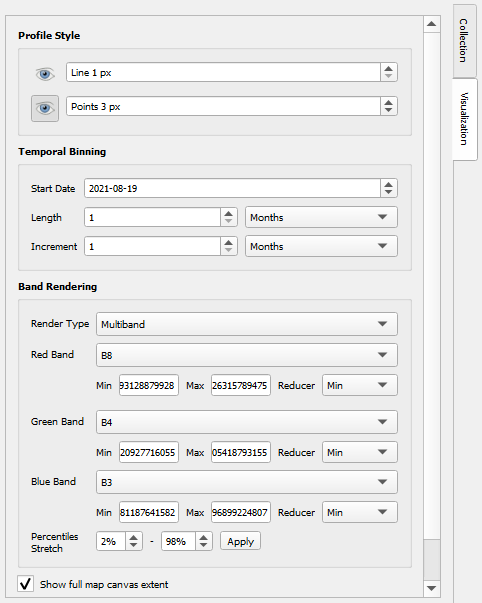
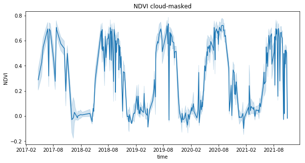
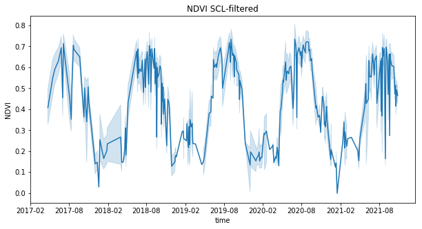

# Explore temporal profiles of a vegetation index in Python with pandas

In this tutorial, we explore temporal profiles drawn from Sentinel-2 data showing the variation of spectral values over time at the example of the popular Normalized Difference Vegetation Index (NDVI). We use Python with the packages pandas, matplotlib and seaborn.


## *Optionally* Query the required spectral bands from GEE via QGIS and download temporal profiles for sample points

(*Shortcut: Download the folder `T1_point_profiles.zip` with the spectral profiles directly from the course data repository.*)

First, download and import the geopackage `T1_sample_points_001.gpkg` from the course data repository containing a few sample points located around the village of Obergurgl (Central Alps, Tyrol, Austria). These points were labelled as

- meadow
- pasture
- forest
- bare earth

by visual interpretation of an aerial orthophoto (acquired in 2020 and provided by the federal authorities of Tyrol).
  
Query Sentinel-2 Level-2A data as before, this time by choosing your sample points layer and its landcover field in the GEE Timeseries Explorer's point browser (bottom line). You can browse through the points and display a temporal profile for each point (arrow buttons). We choose band 4 and band 8 now, plus the Scene Classification Map (SCL) and the Cloud Mask (QA60).

Again we run a monthly binning on the time series, this time rendering a false-color composite (bands 843 as RGB) with each bin's minimum as a reducer. This prefers cloud- and snow-free pixels if available in the bin (but unfortunately also cloud shadows are preferred).




What spectral-temporal patterns can you identify?

Finally, we download all point profile data as a set of textfiles, using the button in the lower right corner.


## Analyse spectral-temporal profiles for the sample points

For further analysis, we continue in Python and load all point profiles into a pandas dataframe:

```python
# load some packages we'll use
import os
from glob import glob
import pandas as pd
import matplotlib.pyplot as plt
import seaborn as sns

txtfiles = glob(os.path.join(
    'T_1_point_profiles', 'profile*.txt'))           # profiles in directory /T_1-1_point_profiles/

# read all point profiles (*.txt) into a dataframe and add it to a list
df_list= []                                           # create empty list to store dataframes
for f in txtfiles:
    tmp_df = pd.read_csv(f, delimiter=";",
                        na_values="None",                                      # the profiles may contain NoData values marked as "None"
                        index_col="time", parse_dates=True)                    # index the data by sensing time of the Sentinel scenes
    df_list.append(tmp_df)                                                      # append df to list (any better suggestions?)
    print(f'Successfully created dataframe for {f} with shape {tmp_df.shape}')

# concatenate our list of dataframes into one
df = pd.concat(df_list, axis=0, sort=True)
# inspect the new dataframe
print(df.shape)
df.info()
df.head()
```

We calculate the NDVI (Rouse et al. 1974) for each observation as

```python
df["NDVI"] = (df["B8"] - df["B4"]) / (df["B8"] + df["B4"])
 ```

Now let's plot using the matplotlib and seaborn data visualization libraries. Passing the entire NDVI column in long-form mode will aggregate over repeated values (each date) to show the mean of our observations and the 95% confidence interval:

```python
plt.figure(figsize=(10, 5))
sns_plot = sns.lineplot(data=df, x=df.index, y='NDVI')
```


## Using cloud and snow masks

Above, we see a clear seasonal component but also lots of noise, caused probably by clouds (and snow). Remember that we did not constrain our search for S-2 scenes very strictly (< 40% cloudy pixels in a scene).
As an easy way to omit cloudy observations, we use the quality band ([QA60](https://sentinels.copernicus.eu/web/sentinel/technical-guides/sentinel-2-msi/level-2a/algorithm)) delivered with the Sentinel-2 L-2A product. Clouds are encoded as "0" there.

```python
df_cloudless = df[df['QA60']==0]
```

Alternatively, we could use the Sentinel-2 scene classification ([SCL](https://sentinels.copernicus.eu/web/sentinel/technical-guides/sentinel-2-msi/level-2a/algorithm)) to filter.

```python
df_filtered = df[df.SCL.isin([4, 5, 7])]    # take only observations where pixels are classified as vegetation, not vegetated, unclassified
print(df.shape)
print(df_cloudless.shape)   # the new dataframes have less rows
print(df_filtered.shape)    # the new dataframes have less rows
```

```python
# plot the cloud-masked NDVI time series
plt.figure(figsize=(10, 5))
sns_plot = sns.lineplot(data=df_cloudless, x=df_cloudless.index, y='NDVI')
plt.title('NDVI cloud-masked')

# plot the filtered NDVI time series
plt.figure(figsize=(10, 5))
sns_plot = sns.lineplot(data=df_filtered, x=df_filtered.index, y='NDVI')
plt.title('NDVI SCL-filtered')
```




While the results looks much improved, they differ and they are still far from a smooth curve.

Now let's focus on one landcover class. Note that the bottom plot lacks observations in winter as snow is filtered via the SCL.

```python
sns.set_style("whitegrid")
fig, axes = plt.subplots(3, 1, figsize=(10, 5), sharex=True)
sns_plot = sns.lineplot(data=df[df['landcover']=='meadow'],
                        x=df[df['landcover']=='meadow'].index, y='NDVI',
                        color='limegreen',
                        ci='sd',        # show standard deviation
                        ax=axes[0])
sns_plot.set_title('Meadow - unfiltered')
sns_plot.set(ylim=(-0.2, 1))

sns_plot = sns.lineplot(data=df_cloudless[df_cloudless['landcover']=='meadow'],
                        x=df_cloudless[df_cloudless['landcover']=='meadow'].index, y='NDVI',
                        color='limegreen',
                        ci='sd',
                        ax=axes[1])
sns_plot.set_title('Meadow - cloud-masked')
sns_plot.set(ylim=(-0.2, 1))

sns_plot = sns.lineplot(data=df_filtered[df_filtered['landcover']=='meadow'],
                        x=df_filtered[df_filtered['landcover']=='meadow'].index, y='NDVI',
                        color='limegreen',
                        ci='sd',
                        ax=axes[2])
sns_plot.set_title('Meadow - SCL-filtered')
sns_plot.set(ylim=(-0.2, 1))
fig.tight_layout()
```


## Visualizing NDVI time series per point

To get an impression of the entire set of NDVI observations at all our sample points we can plot a heatmap for each landcover class.

```python
# separate dataframes by landcover
df_cl_m = df_cloudless[df_cloudless['landcover']=='meadow']
df_cl_p = df_cloudless[df_cloudless['landcover']=='pasture']
df_cl_f = df_cloudless[df_cloudless['landcover']=='forest']
df_cl_b = df_cloudless[df_cloudless['landcover']=='bare earth']

# pivot tables (each point profile in a separate column)
df_cl_m_pivot = pd.pivot_table(df_cl_m, values='NDVI', index='time', columns='fid')     # fid: feature identifier of point
df_cl_p_pivot = pd.pivot_table(df_cl_p, values='NDVI', index='time', columns='fid')
df_cl_f_pivot = pd.pivot_table(df_cl_f, values='NDVI', index='time', columns='fid')
df_cl_b_pivot = pd.pivot_table(df_cl_b, values='NDVI', index='time', columns='fid')

# keep only the date part of the datetime index (scene timestamps)
df_cl_m_pivot.index=df_cl_m_pivot.index.date            # meadow
df_cl_p_pivot.index=df_cl_p_pivot.index.date            # pasture
df_cl_f_pivot.index=df_cl_f_pivot.index.date            # forest
df_cl_b_pivot.index=df_cl_b_pivot.index.date            # bare earth

# plot heatmaps
fig, axes = plt.subplots(1,4, figsize=(12, 7), sharey=True)
sns_plot = sns.heatmap(data=df_cl_m_pivot, vmin=-0.3, vmax=0.9, cmap='PRGn', center=0.1, yticklabels=20, ax=axes[0])
sns_plot.set_title('NDVI meadow points')
sns_plot = sns.heatmap(data=df_cl_p_pivot, vmin=-0.3, vmax=0.9, cmap='PRGn', center=0.1, yticklabels=20, ax=axes[1])
sns_plot.set_title('NDVI pasture points')
sns_plot = sns.heatmap(data=df_cl_f_pivot, vmin=-0.3, vmax=0.9, cmap='PRGn', center=0.1, yticklabels=20, ax=axes[2])
sns_plot.set_title('NDVI forest points')
sns_plot = sns.heatmap(data=df_cl_b_pivot, vmin=-0.3, vmax=0.9, cmap='PRGn', center=0.1, yticklabels=20, ax=axes[3])
sns_plot.set_title('NDVI bare earth points')
```


## Temporal aggregates

To get a more generalized view we can calculate *temporal aggregates* (such as the monthly maximum NDVI), also called temporal *resampling* or *reducing*. First, we have to restore the pivot tables with the full DatetimeIndex, needed for temporal resampling (we reduced this to the date to get cleaner labels on the time axis). *(Maybe omit this step?)*

```python
# restore pivot tables
df_cl_m_pivot = pd.pivot_table(df_cl_m, values='NDVI', index='time', columns='fid')     # fid: feature identifier of point
df_cl_p_pivot = pd.pivot_table(df_cl_p, values='NDVI', index='time', columns='fid')
df_cl_f_pivot = pd.pivot_table(df_cl_f, values='NDVI', index='time', columns='fid')
df_cl_b_pivot = pd.pivot_table(df_cl_b, values='NDVI', index='time', columns='fid')

# aggregate over temporal units (monthly maximum NDVI)
df_cl_m_pivot_monthly = df_cl_m_pivot.resample('M').max()
df_cl_p_pivot_monthly = df_cl_p_pivot.resample('M').max()
df_cl_f_pivot_monthly = df_cl_f_pivot.resample('M').max()
df_cl_b_pivot_monthly = df_cl_b_pivot.resample('M').max()

# keep only the date part of the datetime index (scene timestamps)
df_cl_m_pivot_monthly.index=df_cl_m_pivot_monthly.index.date            # meadow
df_cl_p_pivot_monthly.index=df_cl_p_pivot_monthly.index.date            # pasture
df_cl_f_pivot_monthly.index=df_cl_f_pivot_monthly.index.date            # forest
df_cl_b_pivot_monthly.index=df_cl_b_pivot_monthly.index.date            # bare earth

# plot heatmaps
fig, axes = plt.subplots(1,4, figsize=(12, 7), sharey=True)
sns_plot = sns.heatmap(data=df_cl_m_pivot_monthly, vmin=-0.2, vmax=0.9, cmap='PRGn', center=0.1, yticklabels=4, ax=axes[0])
sns_plot.set_title('NDVI meadow')
sns_plot = sns.heatmap(data=df_cl_p_pivot_monthly, vmin=-0.2, vmax=0.9, cmap='PRGn', center=0.1, yticklabels=4, ax=axes[1])
sns_plot.set_title('NDVI pasture')
sns_plot = sns.heatmap(data=df_cl_f_pivot_monthly, vmin=-0.2, vmax=0.9, cmap='PRGn', center=0.1, yticklabels=4, ax=axes[2])
sns_plot.set_title('NDVI forest')
sns_plot = sns.heatmap(data=df_cl_b_pivot_monthly, vmin=-0.2, vmax=0.9, cmap='PRGn', center=0.1, yticklabels=4, ax=axes[3])
sns_plot.set_title('NDVI bare earth')
```


Try other options for aggregation (min, mean, standard deviation, ...) and see the effect on the plot. What could be applications for the specific methods?
