# Theme 2 - Large time series datasets in remote sensing

## Introduction

Remote sensing (RS) applications are increasingly based on large time series, which have opened new possibilities for understanding land surface dynamics and human-environment interactions. The data is often too big (mainly as an effect of large extent and high resolution in space, time and other dimensions, such as spectral wavelength) to be processed with standard methods.

**Objective**

The objective of this theme is to overview methods and approaches to query, access and handle such large time series datasets in remote sensing. The scope ranges from improvement of processes on a single local machine to efficiently querying and downloading the data you need from huge archives and to scalability of entire workflows using distributed computing on high-performance clusters and cloud infrastructure. Data-wise, the focus is on medium resolution satellite data but 3D point clouds, typically acquired from airborne and terrestrial platforms, are also touched briefly.

At the end of this theme, you will

* know several of the most important remote sensing missions and public archives hosting remote sensing time series data
* be able to search and download such open data efficiently; the focus here is on time series of optical images with medium spatial resolution from
	* the NASA/USGS Landsat program
	* the Copernicus Sentinel-2 mission
* have an overview of the possibilities currently available for big data management and processing in remote sensing

Working through the tutorials and exercises of this theme you will try some convenient methods to access and start working with large remote sensing time series. This includes various state-of-the-art approaches, such as Spatio-Temporal Asset Catalogs (STAC) or the Google Earth Engine (GEE) which enables you to utilize cloud storage and computing infrastructure.

##	Major Earth observation missions, data archives, and access

This section overviews a selection of the most important global Earth observation missions and the resulting data products along with their spatial, spectral and temporal properties (see also the respective sections in [Theme 1](https://3dgeo-heidelberg.github.io/etrainee/module2/01_multispectral_principles/01_multispectral_principles.html#selected-sensor-characteristics) and [Theme 2](https://3dgeo-heidelberg.github.io/etrainee/module2/02_temporal_information/02_temporal_information.html#temporal-resolution-of-selected-sensors) of the second E-TRAINEE Module). A few examples for public data archives of national or regional remote sensing data are also presented. Furthermore, the main possibilities for accessing this data are outlined (see also [this section](https://3dgeo-heidelberg.github.io/etrainee/module2/01_multispectral_principles/01_multispectral_principles.html#multispectral-satellite-data-archives) in Module 2, with links to additional archives). A searchable and comprehensive collection of satellites and sensors is provided in the [Land Remote Sensing Satellites Online Compendium](https://calval.cr.usgs.gov/apps/compendium).

### Landsat missions

The [Landsat program](https://landsat.gsfc.nasa.gov/), jointly run by the NASA and the USGS, provides the longest and most continuous time series of Earth observation images. Starting with the launch of Landsat 1 in 1972, a series of satellite missions have produced millions of images covering a time period where major anthropogenic and natural changes of the Earth's surface took place. The revisit period of a single Landsat is 16 days (18 days for L1-3). Whereas the use of Landsat time series had long been limited by data charges and access, the consolidation of all data into a centralized and open archive (at a time when also computational ressources and storage improved rapidly) have marked a new era of Earth observation ([Woodcock et al. 2008](https://doi.org/10.1126/science.320.5879.1011a), [Wulder et al. 2016](https://doi.org/10.1016/j.rse.2015.11.032)). Hence, Landsat data have been used in numerous applications and scientific studies on long-term ecosystem monitoring, human-environment interactions and other topics ([Wulder et al. 2019](https://doi.org/10.1016/j.rse.2019.02.015)).

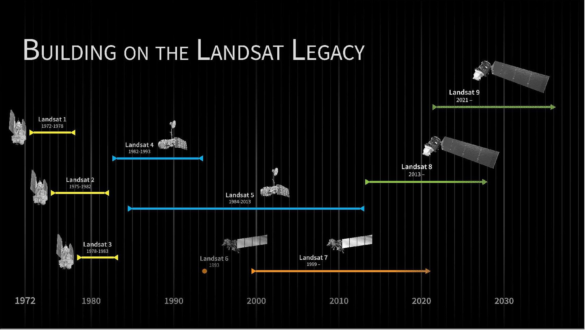

*Timeline of Landsat satellite missions (figure by [NASA's Scientific Visualization Studio](https://svs.gsfc.nasa.gov/11433)).*

Although continuity and interoperability is a priority of the program, the technology employed by the Landsat missions has undergone considerable improvements over the decades. Based on sensor similarities, the missions and their data can be grouped into L1-3, L4-5, L7, and L8-9. Landsat 8 and 9 (launched in 2013 and 2021, respectively) feature 11 spectral bands with spatial resolutions ranging from 15 m (panchromatic) to 30 m (VNIR and SWIR) and 100 m (thermal; resampled to 30 m for delivery). The successior mission [Landsat Next has been announced](https://landsat.gsfc.nasa.gov/satellites/landsat-next/) to improve on temporal, spectral and spatial resolution.

**Data products and access**

Global Landsat data has been reprocessed by the USGS and archived into different [Collections](https://www.usgs.gov/landsat-missions/landsat-collections) and processing levels:

* Landsat [Collection 2](https://www.usgs.gov/landsat-missions/landsat-collection-2) is currently the collection processed with state-of-the-art algorithms and auxiliary data, with its products of Level-1 and Level-2 being available for download from [EarthExplorer](https://earthexplorer.usgs.gov/)
* [Level-1 data](https://www.usgs.gov/landsat-missions/landsat-collection-2-level-1-data) for all Landsat sensors 1-9 since 1972 are delivered as Digital Numbers (DN) in an unsigned 16-bit integer format. DN can be converted to Top of Atmosphere (TOA) reflectance or radiance using the radiometric scaling factors provided in each scene metadata file.
* [Level-2 data](https://www.usgs.gov/landsat-missions/landsat-collection-2-level-2-science-products) contains surface reflectances and land surface temperatures along with [Quality Assessment (QA) masks](https://www.usgs.gov/core-science-systems/nli/landsat/landsat-surface-reflectance-quality-assessment) and is currently available for Landsat 4-9 (i.e. from 1982 on) in [Collection 2](https://www.usgs.gov/landsat-missions/landsat-collection-2). These products are generated from Level-1 inputs that meet the <76 degrees Solar Zenith Angle constraint (i.e. no processing of images taken with low sun angles) and include the required auxiliary data inputs to generate a scientifically viable product.
* For the United States, Landsat Collection 2 also contains [ARD](https://doi.org/10.5066/P960F8OC) (analysis-ready data), with TOA refelctances/brightness temperatures and surface reflectances/temperatures as well as pixel-level quality assessment data gridded in Albers projection and distributed as tiles of 5,000 x 5,000 30-m pixels.
* Frome the above products the USGS is deriving a few [Level-3 science products](https://www.usgs.gov/landsat-missions/landsat-science-products) (currently on-demand?) that represent biophysical properties of the Earth's surface, such as Dynamic Surface Water Extent, Fractional Snow Covered Area, Burned Area, or Provisional Actual Evapotranspiration.

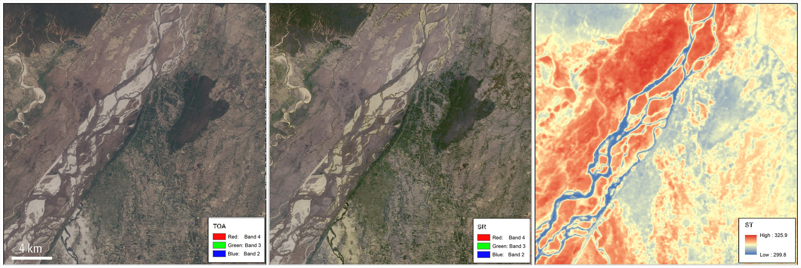

*Landsat 8 Collection 2 products for an area over the Sapta Koshi River in Bairawa, Nepal (path 140 row 41) acquired on May 3, 2013. Left: Level-1 top of atmosphere reflectance (TOA) image. Center: Atmospherically corrected surface reflectance (SR) image. Right: Level-2 surface temperature (ST [K]) image (figure by M. A. Bouchard, [USGS (2013)](https://www.usgs.gov/media/images/example-landsat-8-collection-2-products)).*

*An animation of the Omaha area (Nebraska, USA) that shows spring flooding rendered first in a Landsat 8 Operational Land Imager (OLI) false color composite, and second by the Landsat Level-3 Dynamic Surface Water Extent (DSWE) product. (figure by [Earth Resources Observation and Science (EROS) Center (2019)](https://www.usgs.gov/media/images/dynamic-surface-water-extent-omaha-nebraska)).*

You can **inspect Landsat images** with RGB natural color, a range of other band combinations (composites) and a few different indices (band ratios) in the [LandsatLook](https://landsatlook.usgs.gov/explore) viewer.

As shown in this [overview page](https://www.usgs.gov/landsat-missions/landsat-data-access), there are several options for **downloading Landsat data**:

* [EarthExplorer](https://usgs.gov/ee) with a graphical user interface (GUI)
* [EE Bulk Download Web Application (BDWA)](https://eebulk.cr.usgs.gov/): Web-based tool useful for downloading large quantities of Landsat Collection 2 products with limited user interaction.
* The [The EROS Science Processing Architecture On Demand Interface](https://espa.cr.usgs.gov/) produces Landsat Surface Reflectance-derived Spectral Indices on demand and includes options for reprojection and spatial sub-setting (https://www.usgs.gov/media/files/eros-science-processing-architecture-demand-interface-user-guide).
* The [landsatexplore](https://pypi.org/project/landsatxplore/) package provides an interface to the EarthExplorer portal to search and download Landsat Collections scenes through a command-line interface or a Python API.
- If you need to download a lot of scenes, see [this description](https://blogs.fu-berlin.de/reseda/landsat-big-data-download/#3) of how to create a file list and use it to download the scenes listed.
* Landsat ARD (analysis-ready data) can be accessed and visualized via the AppEEARS API (see this [Jupyter Notebook Python Tutorial](https://git.earthdata.nasa.gov/projects/LPDUR/repos/landsat-ard-appeears-api/browse))
* Landsat Collection 2 Level-1 and Level-2 global scene-based data products and Landsat Collection 2 ARD are hosted on the [Amazon Web Services (AWS) cloud platform](https://www.usgs.gov/landsat-missions/landsat-commercial-cloud-data-access) in a Simple Storage Service (S3) requester pays bucket, and can be accessed via the SpatioTemporal Asset Catalog (STAC) API (as shown in [this tutorial](https://gallery.pangeo.io/repos/pangeo-data/landsat-8-tutorial-gallery/landsat8.html) and in [this post](https://www.matecdev.com/posts/landsat-sentinel-aws-s3-python.html)).

### Sentinel-2 mission

[Copernicus](https://www.copernicus.eu/en) is the European Union's Earth Observation Programme. It includes, among others, the [Sentinel missions](https://www.esa.int/Applications/Observing_the_Earth/Earth_observing_missions), a series of (currently) seven space missions dedicated to radar and multi-spectral imaging for land, ocean and atmosphere observation, each comprising a constellation of two satellites. Among these missions we focus on Sentinel-2, with its two satellites (Sentinel-2A/B) acquiring optical images for land monitoring services (e.g. land cover change, vegetation state, water or snow extent etc.) since 2015 and 2017, respectively. Important for time series analysis, the revisit period of the two satellites together is 5 days at the equator, and shorter at higher latitudes. Unfortunately, the true temporal resolution of useful data can be heavily impaired by clouds.

The multi-spectral instrument (MSI) onboard each Sentinel-2 features 13 spectral bands in the visible-to-near infrared (VNIR) and short wave infrared (SWIR) ranges. In addition to the four VNIR bands at 10-m resolution, coarser resolution bands (20/60 m) are available for vegetation monitoring in the so-called *red-edge* ([Horler et al. 1983](https://doi.org/10.1080/01431168308948546)), and for snow, ice and cloud discrimination as well as for aerosols, water vapour and cirrus cloud detection. In the examples of this theme we will work with the VNIR bands (2, 3, 4, and 8) and the SWIR-1 band.

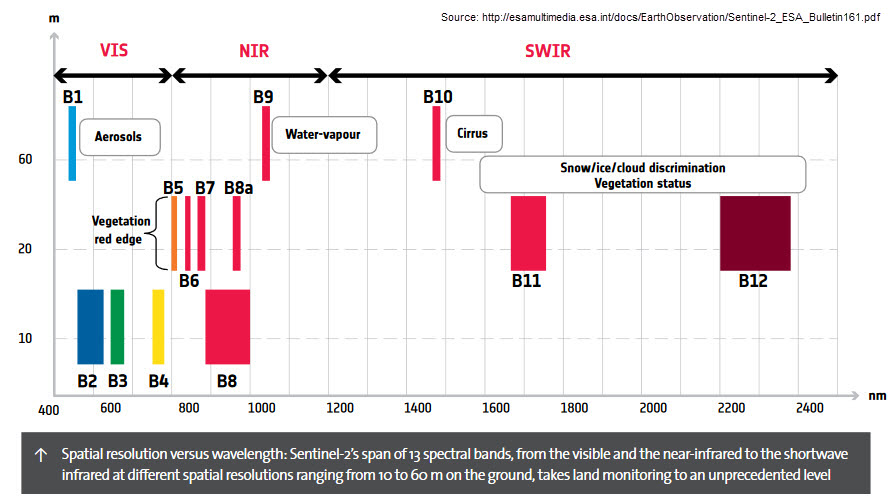

*Sentinel-2 bands overview (figure by [Digital Earth Australia](https://docs.dea.ga.gov.au/notebooks/DEA_products/DEA_Sentinel2_Surface_Reflectance.html), reused from [ESA](https://www.esa.int/)).*

**Data products and access**

The easiest way to look at Sentinel-2 imagery (and often also other free satellite data) is through one of the online viewers, such as

* [Sentinel Playground](http://apps.sentinel-hub.com/sentinel-playground)
* [Sentinel Hub EO Browser](https://www.sentinel-hub.com/explore/eobrowser/)

The core products generated from the raw Sentinel-2 data correspond to two processing levels:

* [Level-1C](https://doi.org/10.5270/S2_-742ikth): Top-of-atmosphere reflectances in cartographic geometry, i.e. radiometrically and geometrically corrected (including orthorectification) but without correction of atmospheric effects.
* [Level-2A](https://doi.org/10.5270/S2_-znk9xsj): This is the product typically used for analysis. It contains surface reflectances in cartographic geometry (UTM/WGS84) as well as a [scene classification map and cloud masks](https://sentinel.esa.int/web/sentinel/technical-guides/sentinel-2-msi/level-2a/algorithm). It can either be generated from Level-1C data on the user side with the [sen2cor](http://step.esa.int/main/snap-supported-plugins/sen2cor/) processor from ESA's SNAP Toolbox or directly obtained from the Copernicus Open Access Hub.

The [Copernicus Open Access Hub](https://scihub.copernicus.eu/) (also called "SciHub") is currently considered the primary access point for Sentinel data. After registration, users can search for available images and download them as ZIP-compressed archives in a folder structure called SAFE (Standard Archive Format for Europe). Each SAFE archive contains a 110 x 110 km tile with the corresponding rasters in JPEG2000 format.

The Copernicus Open Accces Hub offers two options

* a web browser graphical user interface ([GUI](https://scihub.copernicus.eu/dhus))
* an Application Programming Interface [API](https://scihub.copernicus.eu/twiki/do/view/SciHubWebPortal/APIHubDescription?TWIKISID=bcd1a0dff42315102f9f72addfd29375), which can be used for automatic search and download via [batch scripting](https://scihub.copernicus.eu/userguide/BatchScripting) or using dedicated packages for R ([sen2R](https://sen2r.ranghetti.info/), [Ranghetti et al. 2020](https://doi.org/10.1016/j.cageo.2020.104473)) or Python ([Sentinelsat](https://sentinelsat.readthedocs.io/en/stable/)). See also [this description](https://un-spider.org/links-and-resources/data-sources/batch-download-sentinel) for bulk downloading with a lightweight tool ([aria2](https://aria2.github.io/)) from the command line.

Sentinel data filtering and retrieval via SciHub is possible using Python and the [Sentinelsat](https://sentinelsat.readthedocs.io/en/stable/api_overview.html) package. In GRASS GIS the i.sentinel add-on is available and uses Sentinelsat as a backend.

As of June 2022 downloading longer S-2 time series from the SciHub does not seem to be an ideal option (amongst others because the rolling download archive contains only data of the last month, older data has to be transferred from the long-term archive to the download archive, triggered by a first download request before it can be downloaded by a second request). So we do not detail this here.

Currently, the [Copernicus Data Space Ecosystem](https://dataspace.copernicus.eu/) is being developed. It has been announced to replace the SciHub and provide the "next level of data processing and distribution infrastructure" in the course of 2023.
As soon as this is operational, we will briefly overview it here and link to the key options it provides for Copernicus data access. <!--Check the status of these developments and revise this section accordingly!-->

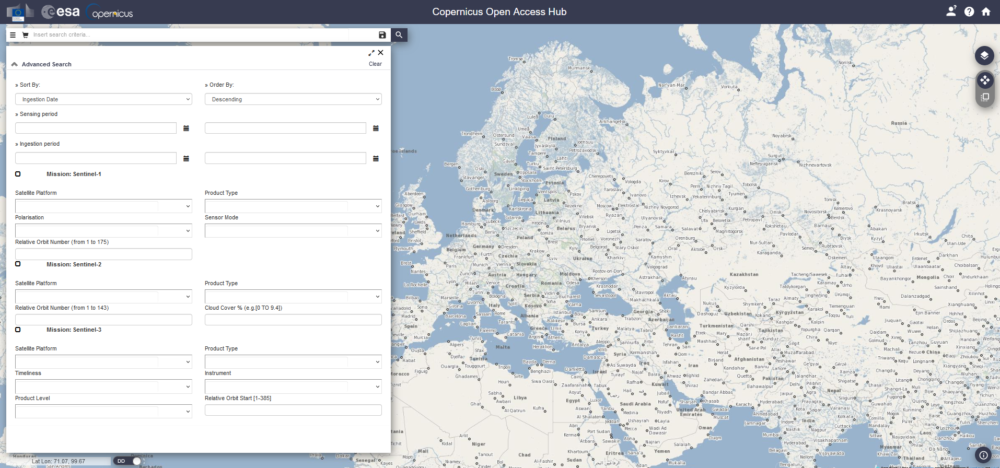

*Browser-based graphical user interface of the Copernicus Open Accesss Hub, useful mainly for downloading one or a few scenes.*

Furthermore, Copernicus data are distributed by several national mirrors, and by partial mirrors (integrating specific Sentinel data (products or geographic coverages) into their platforms). In addition, Sentinel data can be obtained via several free or paid versions of Copernicus Data and Information Access Services (DIAS), such as [Mundi](https://mundiwebservices.com/data) or [CREODIAS](https://eodag.readthedocs.io/en/stable/getting_started_guide/register.html).

A comprehensive (*but a bit outdated!?*) list of tools and access options for Sentinel data, including mirrors and DIAS, is provided at [Awesome Sentinel](https://github.com/Fernerkundung/awesome-sentinel). With all these possibilities for data access one can easily get lost long before starting the actual analysis. Therefore, [EODAG](https://eodag.readthedocs.io/en/stable/index.html) (Earth Observation Data Access Gateway) can be an interesting service, which is offered by the French CS Group. It has a command line tool and a Python package for searching and downloading remotely sensed images with a unified API for more than 10 providers, with more than 50 different product types (Sentinel-1, Sentinel-2, Sentinel-3, Landsat, etc.). As the providers typically require their users to register to their service, you need to [edit a YAML configuration file](https://eodag.readthedocs.io/en/stable/getting_started_guide/configure.html#configure) where you supply your set of [user credentials for each provider](https://eodag.readthedocs.io/en/stable/getting_started_guide/register.html) before using EODAG for downloading satellite data.

Finally, cloud providers (such as Amazon Web Services ([AWS](https://registry.opendata.aws/tag/satellite-imagery/)) or [Google Cloud Storage](https://cloud.google.com/storage/docs/public-datasets)) are hosting various collections of Earth observation data. Tools like [sen2R](https://www.r-bloggers.com/2021/06/downloading-sentinel-2-archives-from-google-cloud-with-sen2r/) and GRASS GIS [i.sentinel.download](https://grass.osgeo.org/grass78/manuals/addons/i.sentinel.download.html) are increasingly adding these sources to their download options. If such data collections are combined with a powerful cloud computing infrastructure as well as basic and advanced processing algorithms, this opens interesting possibilities for large scale analysis (as detailed [below](./02_large_time_series_datasets_in_remote_sensing.md/#distributed-storage-and-computing-in-the-cloud)).

### The Harmonized Landsat and Sentinel-2 (HLS) archive

For many time series applications the temporal resolution of a single archive (i.e. either Landsat or Sentinel) alone is not enough, and it is therefore necessary to combine the data from the Landsat and the Sentinel missions. Since the two original archives contain differences in terms of data structure and content (related to sensor characteristics and data management), the user has to perform sophisticated preprocessing steps to make the data consistent and ready to use in a joint analysis.

For some applications this effort can now be omitted with NASA EOSDIS Land Processes DAAC having released a [Harmonized Landsat and Sentinel-2 (HLS) archive](https://lpdaac.usgs.gov/news/release-of-harmonized-landsat-and-sentinel-2-hls-version-20/). These HLS products provide consistent surface reflectance (SR) and top of atmosphere (TOA) brightness data from the Landsat 8 OLI and the Sentinel-2 MSI at 30 m resolution with global observations of the land every 2–3 days ([Claverie et al. 2018](https://doi.org/10.1016/j.rse.2018.09.002)). Preprocessing steps performed by the HLS project to create seamless products from both sensors (OLI and MSI) include

* atmospheric correction
* masking of cloud and cloud shadows
* spatial co-registration, common gridding and tiling
* illumination and view angle normalization
* spectral bandpass adjustment

	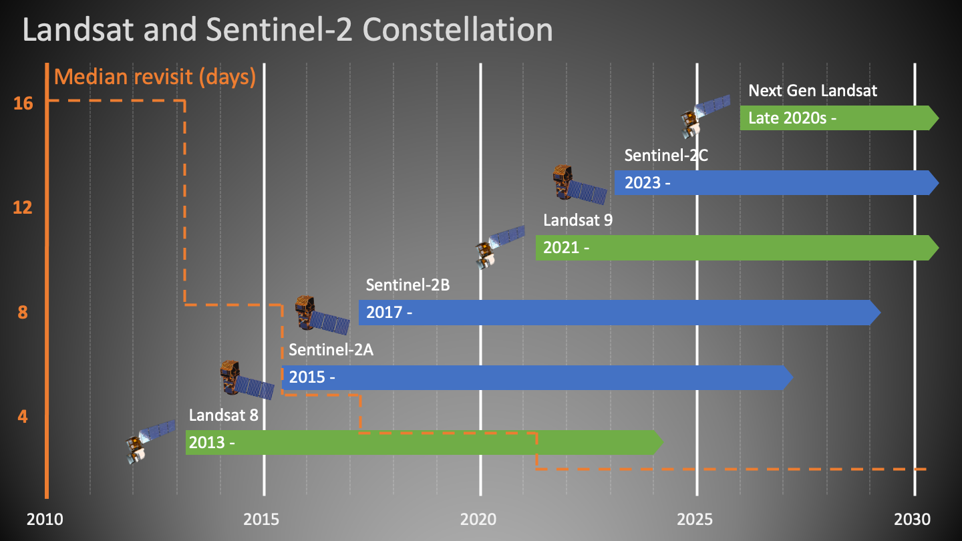

*Timeline of the Landsat/Sentinel-2 Virtual Constellation, contributing to the Harmonized Landsat and Sentinel-2 (HLS) archive with consistent surface reflectance at improved temporal resolution (figure by [HLS Science Team/NASA EarthData](https://www.earthdata.nasa.gov/esds/harmonized-landsat-sentinel-2)). See also [this animation](https://svs.gsfc.nasa.gov/4745) of the different satellites with orbits and data swaths.*

You can download HLS products through NASA's [Earthdata Search](https://search.earthdata.nasa.gov/search?q=hls&ok=hls) or use the following ressources to get started:

* [HLS Quick Guide](https://lpdaac.usgs.gov/documents/768/HLS_Quick_Guide_v011.pdf)
* Jupyter Notebook Tutorials with HLS data
	* in [Python](https://git.earthdata.nasa.gov/projects/LPDUR/repos/hls-tutorial/browse)
	* in [R]( https://git.earthdata.nasa.gov/projects/LPDUR/repos/hls_tutorial_r/browse)
* HLS subsetting, processing, and exporting reformatted data [Python script](https://git.earthdata.nasa.gov/projects/LPDUR/repos/hls-super-script/browse)

### Low (spatial) resolution missions

While Landsat and Sentinel-2 data are, due to their spatial resolution of a few decametres, often used for land use and land cover monitoring, lower resolution data is often not suitable for mapping discrete objects (like land parcels). However, for continental scale monitoring of more continuous phenomena (such as sea and land surface temperature, vegetation phenology, or snow cover) spatial resolutions of several hundred meters are often sufficient. Missions dedicated to such applications typically prioritize higher resolutions in the spectral and temporal domains (i.e. more bands and shorter revisit time).

The main missions in this context are the Moderate Resolution Imaging Spectroradimeter ([MODIS](https://modis.gsfc.nasa.gov/)) and its predecessor and successor missions [AVHRR](https://www.earthdata.nasa.gov/sensors/avhrr) and [VIIRS](https://lpdaac.usgs.gov/data/get-started-data/collection-overview/missions/s-npp-nasa-viirs-overview/), respectively. Moreover, the [Sentinel-3 mission](https://sentinels.copernicus.eu/web/sentinel/missions/sentinel-3) is an important initiative in low-spatial, high-temporal resolution Earth Observation. The Sentinel-3 mission is intensively discussed - also in comparison with similar missions named above - in a series of posts ([1](https://imagico.de/blog/sentinel-3-a-first-look-at-the-data-part-1/), [2](https://imagico.de/blog/sentinel-3-a-first-look-at-the-data-part-2/), [3](https://imagico.de/blog/en/sentinel-3-a-first-look-at-the-data-part-3/)) of the [imagico.de](https://imagico.de/blog/en/) blog by [Hormann (2016)](https://imagico.de/blog/en/).

These two lessons on using MODIS data with Python are provided by the [Earth Lab at University of Colorado, Boulder](http://www.colorado.edu/earthlab):

* [How to find and download MODIS products from the USGS Earth Explorer website](https://www.earthdatascience.org/courses/use-data-open-source-python/multispectral-remote-sensing/modis-data-in-python/download-modis-hdf4-data/)
* [Working with MODIS data in Python](https://www.earthdatascience.org/courses/use-data-open-source-python/multispectral-remote-sensing/modis-data-in-python/)

### Commercial satellite imagery

In addition to the satellite imagery acquired by public organizations which are accessible as open data, there are a number of commercial providers for satellite imagery. Their imagery has often a very high spatial resolution but is acquired on-demand, i.e. acquisitions of specific areas are tasked upon request by paying clients (in contrast to e.g. Sentinels and Landsats capturing most of the Earth surface in a fixed schedule defined by their orbits and sensor orientations).

[SpyMeSat](https://www.spymesat.com/) provides a smartphone app and a web interface for Earth observation satellite overpass notifications (when is your point of interest captured by which satellite system), options for purchasing the imagery from leading providers, and management and observation of tasking requests (for taking new imagery on-demand).

### National and regional scale remote sensing data from aerial platforms

Aerial remote sensing data (mostly orthophotos and airborne laser scanning data) is typically acquired at frequencies of several years. Private companies are usually contracted by the public authorities to acquire and process the data and to deliver a specified product.
These products are usually distributed on a regional/national basis by the respective public authorities, often via web services and sometimes (and increasingly) with a query and download platform, e.g.:

**Autonomous Province of South Tyrol - Bolzano (Italy)**

A comprehensive set of public geodata covering the Autonomous Province of South Tyrol - Bolzano (Italy) can be searched and downloaded via the [GeoKatalog](http://geokatalog.buergernetz.bz.it/geokatalog/) under a [CC0 1.0 license](https://creativecommons.org/publicdomain/zero/1.0/deed.en). Amongst others, the archive comprises RGB and color-infrared orthophotos and ALS point clouds from different campaigns. Spatial subsets can be defined (by a box, a polygon, a place or a map tile) and then downloaded in a chosen coordinate reference system. Links to the respective Web Mapping Services (WMS) can be obtained from the same application.

**Tyrol (Austria)**

In the federal state of Tyrol (Austria; Land Tirol - data.gv.at), multitemporal orthophotos, digital terrain models (DTM) from airborne laser scanning (and derivatives, such as shaded relief or slope gradient rasters), and some other geodata are provided as WMS, WCS, WFS, and WMTS (see [this website](https://www.tirol.gv.at/sicherheit/geoinformation/geodaten/orthofotos/) and [this document](https://gis.tirol.gv.at/statisch/AnleitungGeodatendienste.pdf) for instructions and links to the services). While these services are very convenient for displaying (background) maps, download capabilities are limited (to subsets of raster DTMs and vector data).

Download of data (under a [CC BY 4.0](https://creativecommons.org/licenses/by/4.0/) license) is possible at two applications for [recent RGB orthophotos](https://tirol.gv.at/dop) (0.2 m resolution) and for [airborne laser scanning data](http://www.tirol.gv.at/als) (1-m DTM, DSM, and contours) from the latest acquisition.

An overview of data acquisition campaigns for orthophotos and airborne laser scanning is provided at [this application](https://lba.tirol.gv.at/public/karte.xhtml), as a possibility to search for available datasets in a specific area. The data (including RGB/CIR orthophotos, 0.5-m elevation models, and ALS point clouds) could then be ordered from the [Geoinformation Department](https://www.tirol.gv.at/sicherheit/geoinformation/geodaten/laserscandaten/) at the Office of the Federal Government of Tyrol.

**Switzerland**

The [Swiss Geodownloader](https://plugins.qgis.org/plugins/swissgeodownloader/) plugin for QGIS allows you to download Swiss open geodata (such as the swissALTI3D digital elevation model or Swisstopo maps). You can search for datasets, filter files by extent, timestamp or file type and add the geodata directly to QGIS.

**USA**

In the continental USA, the [National Agriculture Imagery Program (NAIP)](https://www.fsa.usda.gov/programs-and-services/aerial-photography/imagery-programs/naip-imagery/) acquires aerial imagery at 1 m resolution during the agricultural growing seasons every three years. The following notebooks demonstrate the access of NAIP orthophotos using Microsoft cloud services:

* [Accessing NAIP data with the Microsoft Planetary Computer STAC API](https://planetarycomputer.microsoft.com/dataset/naip#Example-Notebook)
* [Accessing NAIP data on Microsoft Azure](https://planetarycomputer.microsoft.com/dataset/naip#Blob-Storage-Notebook)

**New Zealand**

For New Zealand a rich archive of national and regional geospatial data is available from the [Land Information New Zealand (LINZ)](https://data.linz.govt.nz/) data service.

**OpenAerialMap**

[OpenAerialMap](https://openaerialmap.org/) is a platform for openly licensed imagery, where you can browse for available imagery in a map viewer or share your own images. It contains both imagery from occupied aircraft and from unoccupied aircraft/drones.
<!--As of 2022-05 it seems to contain (almost) no multitemporal imagery or it is difficult to filter for this. So let's probably delete this section ...*]-->

##  Strategies and computing facilities for large remote sensing time series: An overview

In remote sensing analyses covering a single or a few points in time the data sets can already be quite large, depending on the extent and resolution (a single Sentinel-2 scene for instance has more than 1 GB). If we move to time series of remote sensing data, our data sets can easily grow huge, meaning that we need dedicated tools for management and analysis.

This section gives a short overview of the strategies commonly used for processing large remote sensing data. This includes:  

* Approaches to handle (moderately large) datasets and processing tasks on a single, local machine (laptop, desktop computer/workstation)
* Processing on a high-performance computing (HPC) cluster
* Cloud computing

### Local data management and processing

Clearly, the possibilities for processing large time series of remote sensing data locally on your laptop and even on more powerful workstations are limited. Nevertheless, there are ways to make ideal use of the available ressources or to reduce the data amount and the processing to what is really needed (without necessarily sacrificing too much in terms of accuracy or completeness of the outcome). Some considerations for local data management and processing in the context of remote sensing time series include:

* *Tiling* and *virtual data sets* (rasters or point clouds): E.g., using GDAL you can create Virtual Rasters that do not copy the original raster data but reference them in a rather small XML file (normally with the extension .vrt) specifiying, e.g., that multiple bands compose a multi-band raster. See the documentation of the [GDAL Virtual Format](https://gdal.org/drivers/raster/vrt.html). In QGIS this is possible with the [Virtual Raster Builder](https://plugins.qgis.org/plugins/vrtbuilderplugin/) plugin or via the standard save or export file dialogs.
* *Data formats* (NetCDF, HDF5, Parquet, Zarr, ...), see e.g. [here](https://vaex.io/docs/faq.html#What-is-the-optimal-file-format-to-use-with-vaex?)
* For vector data it may be worth investigating the relatively new *[Geoparquet](https://geoparquet.org/) format*, that adds interoperable geospatial types (Point, Line, Polygon) to Apache Parquet.
* *Point cloud thinning*, i.e. keeping only a subset of the points. The motivation can be to ease processing (reduce data) or to homogenize the point density. Various algorithms and tools for thinning are available, e.g. in [SAGA GIS](https://saga-gis.sourceforge.io/saga_tool_doc/2.2.0/pointcloud_tools_9.html), [PDAL](https://pdal.io/en/latest/workshop/exercises/analysis/thinning/thinning.html), or [CloudCompare](https://www.cloudcompare.org/doc/wiki/index.php/Edit%5CSubsample).
* Such a subset of a larger point cloud is sometimes referred to as *core points*, and it can make sense to perform certain processing steps only for these core points (e.g. for distance calculation with the M3C2 method ([Lague et al. 2013](https://doi.org/10.1016/j.isprsjprs.2013.04.009)) in [CloudCompare](https://www.cloudcompare.org/doc/wiki/index.php/M3C2_(plugin))).
* Keep in mind that not all applications need 64-bit precision, so you might save memory by changing the *data type* to one that is sufficient for the specific dataset (e.g. 32-bit (float32)). Satellite imagery level 2 products (e.g. Landsat and Sentinel-2) often come with a scaling factor applied to surface reflectance (e.g., multiplied by 10000) to store integers instead of floating point values.
* *Dimensionality reduction* (e.g. by a Principal Components Analysis (PCA))
* *Parallelization* of processing tasks
* *Out-of-core* solutions where only those parts of the data are read into memory that are currently needed

### High performance computing on a central cluster

High Performance Compute (HPC) systems are large networks of multicore processors. They make it possible to run programs which require more ressources than those available with a single workstation. Such applications include:

* Parallel computations on many CPUs
* Parallel computations with large demand of memory
* Computations with extensive temporary disk space usage

In other words: Why use a HPC?

* Parallelization - run many small tasks at the same time; it is important that your code is designed for parallel computing to actually make use of it
* Run a very large task that requires a lot of computational power or RAM

Typical examples for parallel computing would be a sensitivity/parameter study with many runs of a program, a task that is performed for many spatial or temporal subsets of the data (pixel time series or tiles/chunks, as long as no interaction between these subsets is required). In many RS projects with high computational demand the input data is huge. Thus, you should first consider if and how your data can be transferred from its archive to the HPC infrastructure.

Academic research cluster facilities can be divided into institutional (university-based) infrastracture, national collaborations and international/supranational collaborations. Examples maintained at university level are:

* [LEO4](https://www.uibk.ac.at/zid/systeme/hpc-systeme/leo4/) HPC infrastructure of the University of Innsbruck (A), consisting of 50 nodes with a total of 1452 cores and 8.4 TB of memory. An introduction for LEO4 users is provided [here](https://www.uibk.ac.at/zid/mitarbeiter/fink/hpc-introduction-using-uibk.pdf).
* [CRIB](https://crib.utwente.nl/), the platform of the Univesity of Twente (NL) for parallel, distributed, or GPU-assisted computing capabilities for (big) geospatial data analysis.

While institutional clusters are usually quite well accessible for staff (and often also for students of the institution) the computing ressources established through national and supranational collaborations can typically be used only after (peer-reviewed) application. Examples are:

* [Vienna Scientific Cluster (VSC)](http://vsc.ac.at/), a collaboration of several Austrian universities that provides HPC resources and corresponding services to their users
* [Partnership for Advanced Computing in Europe (PRACE)](http://www.prace-ri.eu/)

The way how you actually connect to the HPC system, set up your software environment, and submit your computing tasks (*jobs*) to be scheduled and distributed depends on the specific HPC system. Therefore, we do not go into the details here and encourage you to look into the instructions provided by the system administrator.

### Distributed storage and computing in the cloud

If the data to be processed is huge, it becomes impractical to transfer the data (including unnecessary parts of it) to the computing ressource. Then, it rather makes sense to ship the requests with processing instructions for the computer to the data and run the processes there on dedicated, shared hardware, as it is done in *cloud computing*.
	
**Cloud computing** is the "on-demand availability of computer system resources, especially data storage (cloud storage) and computing power, without direct active management by the user" ([Wikipedia](https://en.wikipedia.org/wiki/Cloud_computing)). Providers deliver cloud computing services (such as storage, data, software and computing power) via the internet to their users, who pay for the services they use (or use a limited amount of ressources for free). Read more about the general concepts of cloud computing [here](https://azure.microsoft.com/en-us/overview/what-is-cloud-computing/).

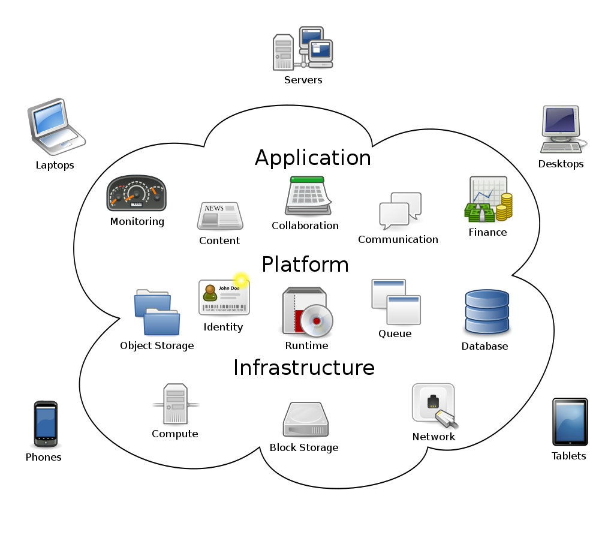

*Concepts of cloud computing, where networked user elements access the services, hardware and software managed by a provider in a system that can be thought of as an amorphous cloud (figure by [Johnston 2009/Wikipedia](https://en.wikipedia.org/wiki/Cloud_computing)/ [CC BY-SA 3.0](https://creativecommons.org/licenses/by-sa/3.0)).*

For remote sensing and geospatial cloud computing, prominent providers of such services are:

* Google with its [Google Earth Engine (GEE)](./02_large_time_series_datasets_in_remote_sensing.md#google-earth-engine)
* Amazon with its [Amazon Web Services (AWS)](https://aws.amazon.com/earth/)
* Microsoft with its [Microsoft Planetary Computer (MPC)](https://planetarycomputer.microsoft.com/), for details see e.g. [this talk](https://www.itc.nl/research/research-facilities/labs-resources/itc-big-geodata/events/2021/10/96690/big-geodata-talks-microsoft-planetary-computer) or the Planetary Computer [tutorials repository](https://github.com/microsoft/PlanetaryComputerExamples/tree/main/tutorials)

Despite the impressive benefits of cloud computing services in terms of available computing power, you have to expect limitations due to computing ressources allocated to a user by the specific service. This may require some kind of sampling or another kind of workaround (see e.g. [Anderson et al. 2020](https://doi.org/10.1111/gcb.14919) or [Yang et el. 2021](https://doi.org/10.1016/j.jag.2021.102446)). So far, especially the Google Earth Engine has been extensively used to study land surface processes and human-environment interactions. Examples include:

* Forest monitoring: Detection and analysis of tree cover change on a global scale, see [Hansen et al. 2013](https://doi.org/10.1126/science.1244693) and the [Global Forest Watch (GFW)](https://globalforestwatch.org/) online platform providing maps of forest change, monthly and weekly deforestation alerts as well as data showing the dominant drivers of tree cover loss
* Climate change related greening trends in sparsely vegetated ecosystems: [Anderson et al. 2020](https://doi.org/10.1111/gcb.14919) used data from the Landsat archive to study trends and patterns of greening in the Hindu Kush Himalaya
* National-scale monitoring of agricultural practices and use intensities: [Stumpf et al. 2018](https://doi.org/10.1016/j.agee.2018.02.012) mapped annual grass-/cropland distributions, and [Stumpf et al. 2020](https://doi.org/10.1016/j.ecolind.2020.106201) differentiated grassland management practices (mowing or grazing) and use intensities across Switzerland based on Landsat time series metrics. Together with a database from field survey programs this revealed the effects of landuse practices on key ecosystem parameters such as soil organic carbon and plant diversity.

To make access of geospatial data from clouds and other web-based services more efficient, specific *cloud-native data formats* have been specified:

* [Cloud-optimized GeoTIFFs (COGs)](https://www.cogeo.org/) are essentially regular GeoTIFFs with a special internal structure that makes it possible to download only parts of them (blocks) or lower-resolution versions (overviews).
* [Zarr](https://zarr.dev/) is a cloud-native format for the storage of large multidimensional arrays. Watch [this video](https://www.youtube.com/watch?v=KiiKvXzhyMs) to learn more about Zarr.
* For point clouds the [Cloud Optimized Point Cloud (COPC)](https://copc.io/) format has recently been developed. A COPC file is a LAZ 1.4 file that stores chunks of point data organized in a clustered octree. Read the blog post about [COPC in QGIS](https://mapscaping.com/cloud-optimized-point-clouds-in-qgis/). Sample COPC datasets can be seen in [this viewer](https://viewer.copc.io/?copc=https://s3.amazonaws.com/hobu-lidar/autzen-classified.copc.laz) or downloaded [here](https://github.com/PDAL/data/blob/master/autzen/autzen-classified.copc.laz) and [here](https://github.com/PDAL/data/blob/master/autzen/autzen-classified.copc.laz). A point cloud dataset from the USGS 3D Elevation Program can be accessed via the [Microsoft Planetary Computer](https://planetarycomputer.microsoft.com/dataset/3dep-lidar-copc).

## Data cubes

Although proposed already in the 1990s ([Baumann et al. 1993](https://doi.org/10.1007%2F978-3-642-77811-7_19)), *data cubes* have recently emerged as a powerful approach for the management and analytics of multi-dimensional EO data (more correctly: "hyper-rectangles" ([Pebesma and Bivand 2023](https://r-spatial.org/book/06-Cubes.html)). The data cubes are based on gridded spatio-temporal data with spatial (e.g. latitude and longitude) and time dimensions creating a three-dimensional cube of data. Various thematic data parameters (e.g. spectral bands) can be represented by additional dimensions of the data cube. A data cube can be deployed on various scales and infrastructures: from local workstations for use in smaller projects to large scale (cloud) back-ends serving a wider user community ([Sudmanns et al. 2022](https://doi.org/10.1080/20964471.2022.2099236)).

There are various data cube initiatives which share the intention to facilitate access and processing of big geo-spatial data for users. By providing Analysis-Ready-Data (ARD) structured uniformly (in a common grid) and indexed by their dimensions (as opposed to a sensor and provider dependent structure) they reduce the burden of data search, handling and pre-processing. For practical implementation of a data cube, however, there are various approaches and technologies around, which we try to grasp in the following.

*Data cube with five dimensions: latitude, longitude, time, spectral band, and sensor (figure by [Pebesma 2023/r-spatial](https://r-spatial.github.io/stars/)/ [Apache License 2.0](https://www.apache.org/licenses/LICENSE-2.0)).*

### Open Data Cube approach and implementations

[Open Data Cube (ODC)](https://www.opendatacube.org/) is an open source geospatial data management and analysis software project that helps you harness the power of satellite data. At its core, ODC is a set of Python libraries and PostgreSQL database that helps you work with geospatial raster data. The Open Data Cube can be deployed on HPC, cloud, and local installations and accessed via a Python API which loads the data as xarray objects. Check out the [ODC manual](https://datacube-core.readthedocs.io/en/latest/) or the [ODC Notebooks](https://github.com/ceos-seo/data_cube_notebooks).

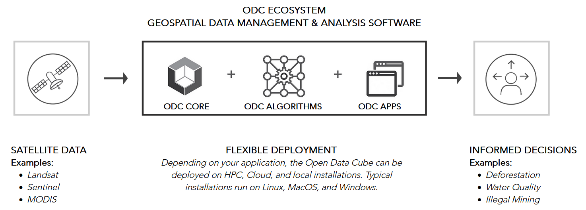

*The Open Data Cube ecosystem (figure by [Open Data Cube](https://www.opendatacube.org/)/ [Apache License 2.0](https://www.apache.org/licenses/LICENSE-2.0)).*

ODC projects and implementations include:

* [Digital Earth Australia](https://www.dea.ga.gov.au/about) - A platform to make satellite data and its derivatives accessible and manageable for Australian purposes. This concept has evolved into the Open Data Cube (ODC), a not-for-profit open source project and community developing.
	Check out the [DEA Sandbox](https://www.dea.ga.gov.au/developers/sandbox), a learning and analysis environment created as an introduction to Digital Earth Australia and the Open Data Cube, or have a look at the notebooks by [Krause et al. 2021](https://doi.org/10.26186/145234).
* [Swiss Data Cube](http://sdc.unepgrid.ch/) ([Chatenoux et al. 2021](https://doi.org/10.1038/s41597-021-01076-6)) - 
	The Swiss Data Cube was one of the first adopters of the Data Cube system for a national scale platform. It includes data from Landsat, and Sentinel-1 and -2 over Switzerland, as well as products related to urbanization, cloud free mosaics, and snow cover (from https://www.opendatacube.org/overview).
* [Digital Earth Africa](https://www.digitalearthafrica.org/) deploys the Africa Regional Data Cube. For more information see [this video](https://www.youtube.com/watch?v=tEeT5VH7qVc&t=1s), try the [Sandbox](https://www.digitalearthafrica.org/platform-resources/platform/#sandbox) and see the [documentation](https://docs.digitalearthafrica.org/en/latest/).

### Euro Data Cube and xcube

*Euro Data Cube*

The [Euro Data Cube](https://eurodatacube.com/) (EDC) is operated by a consortium of private Earth observation companies and cloud providers and supported by the European Space Agency. The EDC is offered as a [subscription-based, paid service](https://eurodatacube.com/marketplace/infra/edc_eoxhub_workspace). Its main objective is to provide a data archive and computing platform for commercial applications, including the possibility for companies to develop applications on top of EDC and sell it to their customers. However, a (small) trial is available for free and researchers may apply for a free account - check out the [announcements of opportunity](https://earth.esa.int/web/guest/pi-community/apply-for-data/ao-s) and the [FAQ](https://eurodatacube.com/support?faq=free-account). A good impression of various variables relevant for Earth System Science (such as gross primary productivity, fractional snow cover, ...) with map views at coarse resolutions (of >20 km) and temporal point profiles is provided by [this](https://edc-viewer.brockmann-consult.de/) variant of the EDC. All further information can be found in the official [documentation](https://eurodatacube.com/documentation). There are different options for access and analysis of the EDC, including a [QGIS plugin](https://eurodatacube.com/documentation/qgis) and *xcube*.

*xcube*

[xcube](https://xcube.readthedocs.io/en/latest/) is an open-source Python package and toolkit used for the Euro Data Cube. It helps to create self-contained data cubes that can be published in the cloud and it offers customizable analysis and processing based on Python's xarray.

[Plugins](https://xcube.readthedocs.io/en/latest/plugins.html#available-plugins) for xcube add support for the [Sentinel Hub](https://www.sentinel-hub.com/) Cloud API, the [ESA Climate Change Initiative](https://climate.esa.int/en/odp/) Open Data Portal, or the Copernicus [Climate Data Store](https://cds.climate.copernicus.eu/).

### Data cubes based on array databases

An alternative approach to data cubes is based on array databases ([Baumann et al. 2019](https://doi.org/10.1007/978-3-319-72434-8_14)). The pioneering implementation of an array database management system is [rasdaman](http://www.rasdaman.org/) ("raster data manager"), featuring

* support of the *Coverage* data model for multi-dimensional raster data and related Open Geospatial Consortium (OGC) web service standards, most notably *Web Coverage Service (WCS)* and *Web Coverage Processing Service (WCPS)*, as explained [here](https://earthserver.eu/wcs/)
* the query language [*rasql*](http://www.rasdaman.org/wiki/Features#Querylanguage)
* server-side tiled storage in a relational database with spatial indexing
* tile streaming
* dynamic scheduling of processes on a rasdaman server installation
* client APIs for C++ (*raslib*), Java (*rasj*) and Python ([*rasdapy*](https://pypi.org/project/rasdapy/))

 These demos show how to use Coverages by connecting to the rasdaman service endpoint via QGIS or Python:

 * [QGIS](https://standards.rasdaman.org/demo_qgis.html)
 * [Python](https://standards.rasdaman.com/demo_jupyter.html) (Jupyter Notebook)

 The [EarthServer](https://earthserver.eu/) federation is an initiative that uses this data cube approach to share and unify spatio-temporal data from multiple large-scale Earth data providers. The federation members include research centers, supercomputing centers, companies, and agencies.

### Data cubes with other/unknown architecture

Further implementations and prototypes of a data cube include:

* Germany's Copernicus Data and Exploitation Platform [CODE-DE](https://code-de.org/de/) ([Storch et al. 2019](https://doi.org/10.1080/20964471.2019.1692297)) amongst other services hosts two data cubes, one based on the [Sentinel Hub](https://docs.sentinel-hub.com/api/latest/) software by Sinergise, and one based on the [FORCE](https://force-eo.readthedocs.io/en/latest/about.html) software by David Frantz ([2019](https://doi.org/10.3390/rs11091124)).
* The Earth System Data Lab ([ESDL](https://earthsystemdatalab.net/)) follows a data cube approach with a multivariate focus. It prioritizes efficient exploitation of multiple data streams for a joint analysis over efficiency with a high-resolution data stream ([Mahecha et al. 2020](https://doi.org/10.5194/esd-11-201-2020)). Analyses can be deployed in the ESDL with Python or Julia and via user-defined functions (UDFs).
* The Brasil Data Cube ([Simoes et al. 2021](https://doi.org/10.3390/rs13132428)) is implemented using the R programming language and the SITS package.
* The [Austrian Data Cube](https://acube.eodc.eu/) (ACube) is run by the Earth Observation Data Centre for Water Resources Monitoring (EODC) and provides pre-processed Sentinel-1 & -2 data. The ACube can be accessed throught an application programming interface (API) or via WMS/WCS Geoserver (e.g. with QGIS). (*?)*
* The Austrian semantic EO data cube [Sen2Cube](https://www.sen2cube.at/) is a prototype(?) for a semantically enriched, web-based data cube ([Sudmanns et al. 2021](https://doi.org/10.3390/rs13234807)).
* The [SemantiX project](https://www.semantixcube.net/) aims to retrieve Essential Climate Variables (ECVs) from AVHHR data (1981-today) and Sentinel-3 data(2016-today) covering the entire European Alps. The ECVs are made publicly available via a data cube and a smartphone app.

### More tools for building your own data cube

If you want to build your own data cube:

* [gdalcubes](https://github.com/appelmar/gdalcubes) - Earth observation data cubes from GDAL image collections. The library is written in C++ and includes a basic command line interface and an R package. A Python package is planned for the future.
* [gdalcubes_R](https://github.com/appelmar/gdalcubes_R) - A package for creating and analyzing Earth observation data cubes in R (limitations: no vector data support, only 4 D; opposed to starspackage).
* [stars](https://r-spatial.github.io/stars/) - An R package for spatiotemporal arrays, raster and vector data cubes.
* [SITS](https://github.com/e-sensing/sits) - An R package for satellite image time series analysis and machine learning based classification of image time series obtained from data cubes ([Simoes et al. 2021](https://doi.org/10.3390/rs13132428), [Camara et al. 2023](https://e-sensing.github.io/sitsbook/)).

### Working with a data cube: External demos and tutorials

If you want to try working with data cubes, check out these external ressources:

* [Open Data Cube Sandbox](https://www.opendatacube.org/sandbox), which is a JupyterHub Python notebook server with individual work spaces and with global Landsat 8 data indexed
* [This](https://github.com/ceos-seo/data_cube_notebooks/blob/master/docs/notebooks_overview.md) collection of notebooks covering, e.g., [landslide detection](https://github.com/ceos-seo/data_cube_notebooks/blob/master/notebooks/landslides/Landslide_Identification_SLIP.ipynb) and [machine learning](https://github.com/ceos-seo/data_cube_notebooks/blob/master/notebooks/machine_learning/Uruguay_Random_Forest/Random_Forests_Uruguay.ipynb)
* [ODC-Colab](https://github.com/ceos-seo/odc-colab) - This aims at a demonstration of Open Data Cubes within Google Colab and performs an automated setup of an ODC environment with GEE data.

## Large time series datasets in Python

Clearly, automatisation of workflows by scripting your processing pipelines is key to any successful working with large datasets, especially when scientific criteria such as reproducibility and objectivity are important. Compared to clicking your way through a graphical user interface (GUI) of a specialized GIS/remote sensing software, this is much more efficient and enables you to flexibly customize the processing exactly to your needs. In this context, the Python ecosystem provides a rich set of tools and interfaces to data and computing platforms and is, thus, the preferred choice for many professional applications. 

### Python libraries

Some Python libraries you might find useful for the management and analysis of (large) remote sensing data sets (including remote sensing time series):

* [Numba](https://numba.pydata.org/): You may accelerate your code with Numba, which translates Python functions into optimized machine code at runtime.
* Scale your Python workflows (whether they are based on arrays or on dataframes) by dynamic task scheduling, parallel computing and lazy evaluation using [Dask](https://docs.dask.org/). This library extends the size of convenient datasets from “fits in memory” to “fits on disk” and can be useful both on a single machine and in distributed environments (clusters with 100s of cores). Further reading in [Daniel (2019)](https://www.manning.com/books/data-science-with-python-and-dask).

* Handling tabular (column-oriented) data:

	* [Pandas](https://pandas.pydata.org/) and its DataFrames are a popular choice in data science and can also be useful in remote sensing applications (when data is not array-like but tabular, e.g. image objects, sample points, ...). However, it is neither  specifically made for geodata nor for very large datasets.
	* [GeoPandas](https://geopandas.org/en/stable/) extends the capabilities of pandas by possibilities for spatial operations, making it ideal for vector geodata. Recent efforts included performance improvements and support for storing geospatial vector data (point, line, polygon) efficiently according to the [GeoParquet](https://github.com/opengeospatial/geoparquet) specification.
	* [Dask-Geopandas](https://dask-geopandas.readthedocs.io/en/latest/) merges the geospatial capabilities of GeoPandas and scalability of Dask. Thus, it can be an interesting option if you have large GeoDataFrames that either do not comfortably fit in memory or require expensive computation that can be easily parallelised.
	* [Spatialpandas](https://github.com/holoviz/spatialpandas) is developed for vectorized spatial and geometric operations on DataFrames using numba (with support for Parquet and Dask).
	* [Modin](https://modin.readthedocs.io/en/stable/) provides a convenient way to speed up pandas code by parallelization (without changes in your existing pandas code). It uses Ray or Dask internally to schedule the computations on multiple cores (which pandas normally does not do). Moreover, it supports out-of-core processing to prevent pandas from running out of memory.

	* [Vaex](https://vaex.io/docs/index.html) is a library developed for large tabular datasets (that otherwise tend to raise memory errors). With its memory mapping and lazy reading capabilities, Vaex works well with file formats like HDF5, Apache Arrow and Apache Parquet. It has a focus on

		* Visualization: Histograms, density plots and 3D volume rendering.
		* Exploration: Calculate statistics (such as mean, sum, count, standard deviation etc.) on an N-dimensional grid with up to a billion (109) objects/rows per second.
		* Machine learning with [vaex.ml](https://vaex.io/docs/tutorial_ml.html): So far with data transformers, wrappers to ML libraries (Scikit-Learn, xgboost) and a performant KMeans implementation.

	* [dask.dataframe](https://docs.dask.org/en/stable/dataframe.html) is a large parallel DataFrame composed of many smaller pandas DataFrames, split along the index. It is a more flexible option than Dask-Geopandas but lacks the convenient implementation of geospatial functionality.
	* In summary: Small data: use Pandas. Out of memory error: move to vaex. Crazy amount of data (many TB) that will never fit onto 1 computer: dask.dataframe (as recommended [here](https://news.ycombinator.com/item?id=21682910))

* Handling array data:

	* [xarray](https://docs.xarray.dev/en/stable/) ([Hoyer and Hamman 2017](https://doi.org/10.5334/jors.148)) is a package for labelled multi-dimensional arrays and integrates tightly with Dask (see [this example](https://examples.dask.org/xarray.html)). [Rasterio](https://rasterio.readthedocs.io/en/latest/) (a library for geospatial raster data access) extends the general purpose Xarray library to [Rioxarray](https://corteva.github.io/rioxarray/stable/), with improved geospatial capabilities.
	* The [Satpy](https://satpy.readthedocs.io/en/stable/) library also builds on xarray and is made to conveniently handle satellite data, i.e. to import various formats, create composites, perform atmospheric corrections and visual enhancements.
	* The [Iris](https://scitools-iris.readthedocs.io/en/latest/index.html) library can be seen as an alternative to xarray, with a focus on keeping metadata (such as information on units following the [CF conventions](http://cfconventions.org/)) while working with multi-dimensional Earth Science data (e.g. meteorological and oceanographic data).
	* [Geoxarray](https://geoxarray.github.io/latest/) is intended as a library for simple utilities and wrappers around common geospatial data workflows. (As of 2023-03 it is still in pre-alpha state/without a release, but let's keep an eye on this.)
	* [RasterFrames](https://rasterframes.io/index.html) is a data model and processing software system developed by Astraea, Inc.. It organizes raster data in [Spark](https://spark.apache.org/docs/latest/sql-programming-guide.html) DataFrames and has a focus on scalability of Earth observation data analytics.

* Spectral indices: The [Spyndex](https://spyndex.readthedocs.io/en/latest/) package is specialized on computing a wide range of spectral indices for arrays and dataframes together with pandas, geopandas, xarrays and dask.
* [EOReader](https://eoreader.readthedocs.io/en/latest/) is a package for reading (your locally stored) data from optical and SAR constellations, loading and stacking bands, clouds, DEM and spectral indices in a sensor-agnostic way. (Comparable to what eemont does compared to the raw GEE Python API) it simplifies these tasks as compared to rasterio/rioxarray:

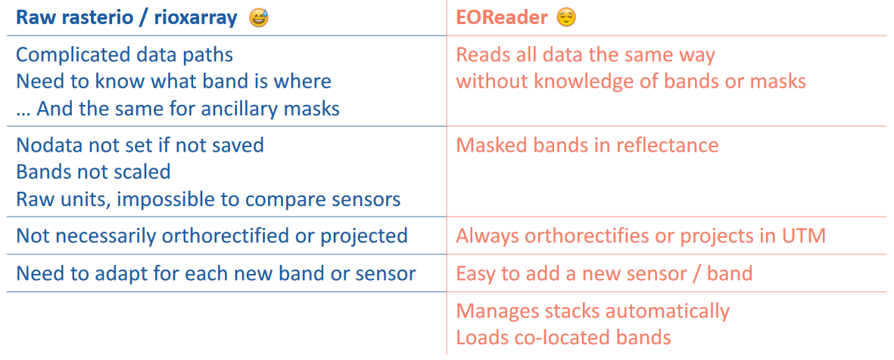

*EOReader simplifications overview (figure by [ICube-SERTIT](https://sertit.unistra.fr/)/[EOReader documentation](https://eoreader.readthedocs.io/en/latest/notebooks/why_eoreader.html)/ [Apache License 2.0](https://www.apache.org/licenses/LICENSE-2.0)).*

### Tutorials: Remote sensing time series in Python

Some of the tools listed above are demonstrated in the following notebooks:

* [Large point clouds in Python tutorial](./PC_explore_v02.ipynb), providing a couple of hints for handling and exploring large point clouds efficiently in Python (so far not time-series specific). Use sample data provided or try with your own point cloud.

* External ressources:
	* [Why Xarray and Dask?](https://pangeo.io/packages.html#why-xarray-and-dask) (Pangeo)
	* [Parallel computations on dataframes and arrays using Dask](https://gallery.pangeo.io/repos/pangeo-data/pangeo-tutorial-gallery/dask.html) (Pangeo tutorial)
	* [Parallel raster computations using Dask](https://carpentries-incubator.github.io/geospatial-python/11-parallel-raster-computations/index.html) (Carpentries Incubator tutorial)

### Data access from SpatioTemporal Asset Catalogs (STAC)

#### Introduction to SpatioTemporal Asset Catalogs (STAC)

The [SpatioTemporal Asset Catalog (STAC) specification](https://stacspec.org/) enables online search and discovery of geospatial assets (i.e. specifc data products) by providing a common language to describe a range of geospatial information, so it can more easily be indexed and discovered. A 'spatiotemporal asset' is any file that represents information about the Earth captured in a certain space and time.

When analyzing optical imagery, in many cases you need only certain spectral bands covering your area-of-interest, instead of entire scenes. An important advantage of accessing a STAC server is that you can constrain the download to the specific data you actually need, not only in terms of Earth observation mission, sensor and time period, but also in terms of bands and spatial coverage.

Watch [this video](https://www.youtube.com/watch?v=Ugazf5bWsGE) to learn more about STAC. A list of STAC APIs and catalogs is provided on the [STAC Index](https://stacindex.org/catalogs) website. QGIS users can access data from several endpoints via the [QGIS STAC API plugin](https://stac-utils.github.io/qgis-stac-plugin/)).

	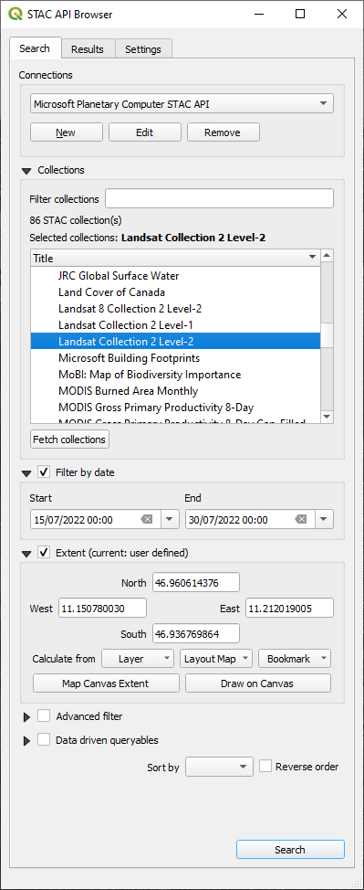
	&nbsp;
	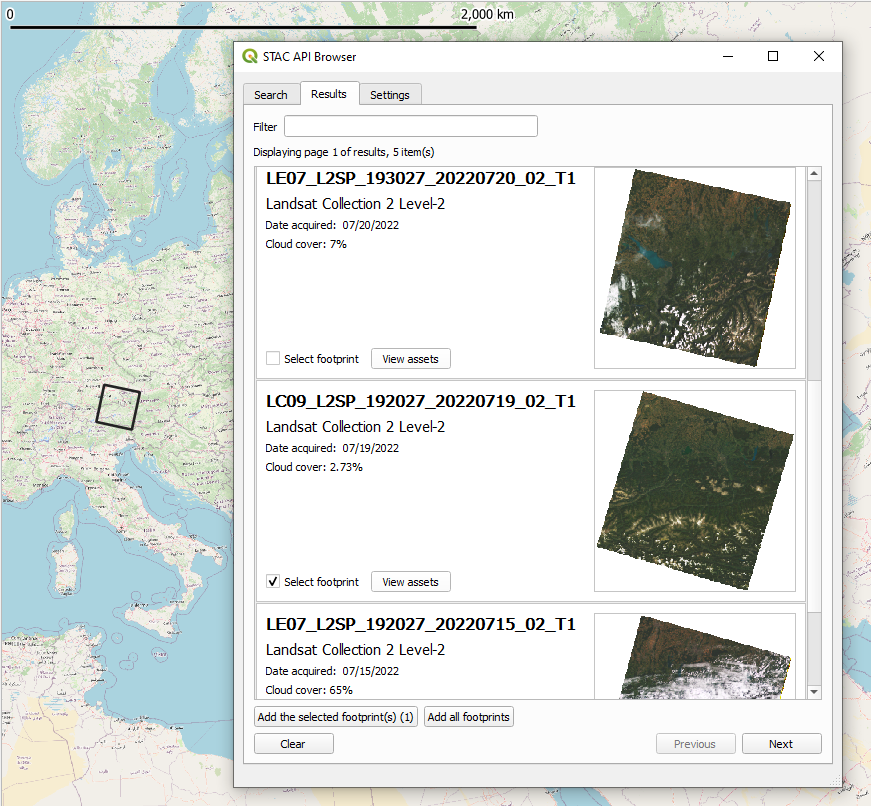

*The QGIS STAC API Browser, the search results, and footprint of one item (a Landsat 9 scene) loaded to the map canvas.*

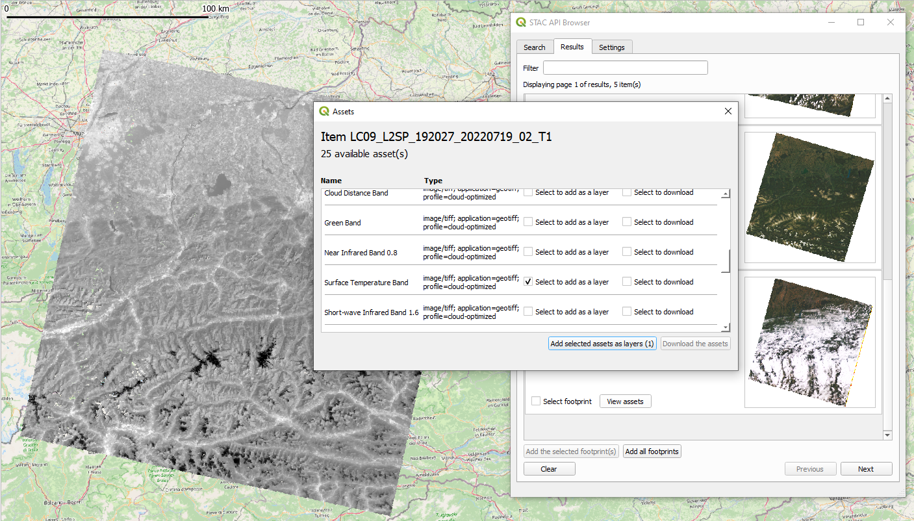

*One asset (Surface Temperature Band) of the STAC item (Landsat 9 scene) found is loaded as a layer to the QGIS map canvas.*

#### Tutorials: Getting satellite data from a STAC catalog

[This ETRAINEE notebook](./T2_Sentinel_STAC_v03.ipynb) illustrates how to query and download Sentinel-2 satellite imagery from the Amazon Web Service (AWS) cloud using the pystac-client library. Furthermore, it shows how to work with the data using the xarray library and how to perform tasks like subsetting, cloud masking, spectral index calculation, temporal aggregation, and trend analysis. A few simple processing steps let you explore the development of the Normalized Difference Vegetation Index (NDVI) in spring and summer, including e.g. the seasonal greening of mountain grasslands.

More (external) Python Jupyter Notebooks:

* [Access Landsat data from Microsoft Planetary Computer](https://stacspec.org/en/tutorials/reading-stac-planetary-computer/)
* [Access Sentinel 2 Data from AWS (1)](https://stacspec.org/en/tutorials/access-sentinel-2-data-aws/), including visualization of asset footprints
* [Access Sentinel 2 Data from AWS (2)](https://carpentries-incubator.github.io/geospatial-python/05-access-data/index.html)
* [Access Landsat data from AWS](https://github.com/Element84/geo-notebooks/blob/main/notebooks/odc-landsat.ipynb), a rendered version is [here](https://nbviewer.org/gist/rsignell-usgs/8cc1d3b8832cd89f984f75db761eaf59)

## Google Earth Engine

Earth Engine is a service offered by Google for analysis and visualization of geospatial datasets, based on data storage and computing on a large cloud ([Gorelick et al. 2017](https://doi.org/10.1016/j.rse.2017.06.031), [Amani et al. 2020](https://doi.org/10.1109/JSTARS.2020.3021052), [Tamiminia et al. 2020](https://doi.org/10.1016/j.isprsjprs.2020.04.001), ). The Google Earth Engine (GEE) is free to use for research, education, and nonprofit use after [signing up](https://signup.earthengine.google.com/#!/) for access to the service.

There are different ways to use GEE:

* the JavaScript Code Editor used in a web browser
* an Earth Engine client library for Python
* an Earth Engine client library for R (rgee; [Aybar et al. 2020](https://doi.org/10.21105/joss.02272)), which wraps the Earth Engine Python API
* a [command line tool](https://developers.google.com/earth-engine/guides/command_line)
* via QGIS with the [GEE Plugin](http://qgis-ee-plugin.appspot.com/) or the [GEE Timeseries Explorer](https://geetimeseriesexplorer.readthedocs.io/en/latest/index.html)

### The JavaScript Code Editor

The "standard" way of using GEE is via its JavaScript [Code Editor](https://code.earthengine.google.com/) in a web browser, which is introduced [here](https://developers.google.com/earth-engine/guides/getstarted) and [here](https://developers.google.com/earth-engine/tutorials/community/beginners-cookbook). In this editor you can simply run one of the many scripts already available (in the *Scripts* tab in the left pane) or develop your own code for a custom analysis. The results are displayed in the map pane or in the *Inspector* and *Console* tabs in the right pane.

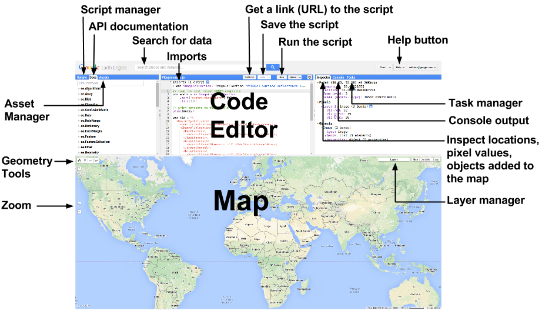

*The Google Earth Engine has a web browser based graphical user interface (figure by [Google Developers](https://developers.google.com/earth-engine/tutorials/community/beginners-cookbook)/ [CC BY 4.0](https://creativecommons.org/licenses/by/4.0/)).*

To get a quick impression of the data archive and the computational power of GEE, for example, click [this link](https://code.earthengine.google.com/?scriptPath=Examples%3AImage%20Collection%2FAnimated%20Thumbnail), You will find a script that creates an animated thumbnail of a 1-year time series with MODIS NDVI composites over Australia and Tasmania. In the Code Editor, simply click *Run* and you should see something like this added to the map pane:

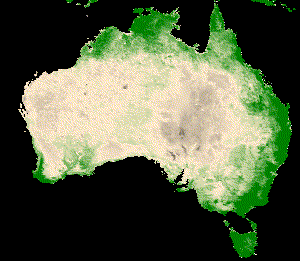

*One year of MODIS NDVI over Australia and Tasmania (Created with [Google Earth Engine](https://code.earthengine.google.com/?scriptPath=Examples%3AImage%20Collection%2FAnimated%20Thumbnail)).*

A comprehensive online course with well-structured material is provided by Ujaval Gandhi at the [Spatial Thoughts](https://courses.spatialthoughts.com/end-to-end-gee.html) website. It is focused on the JavaScript Code Editor but contains also an introduction to the Python API.

### A selection of cool apps

There is a growing variety of easy to use apps based on the Google Earth Engine and developed by the remote sensing community using the [Google App Engine](https://developers.google.com/earth-engine/guides/app_engine_intro). Some of the apps make requests to the Earth Engine backend using a service account, thus allowing anyone to use the app without logging in or being a registered GEE user. Other apps use client-side authentication, meaning that you need to sign up with your own account to use the app. A few examples are listed in the following:

* Landsat time series animations for any rectangular area on Earth can be created quite easily by [these two GEE apps](https://github.com/jdbcode/Snazzy-EE-TS-GIF). First, the [EE-TS-GIF app](https://emaprlab.users.earthengine.app/view/lt-gee-time-series-animator) creates a GIF from a smoothed Landsat time series with a choice of three bands. The output of this can be further enriched by annotating years and adding a context map through using the [Snazzy-EE-TS-GIF app](https://jstnbraaten.shinyapps.io/snazzy-ee-ts-gif/).
* [GEE JavaScript module to color time series chart points as stretched 3-band RGB](https://github.com/jdbcode/ee-rgb-timeseries)
* [Annual cloud-free Landsat composite time series app](https://jstnbraaten.users.earthengine.app/view/landsat-timeseries-explorer)
* [Sentinel-2 and Landsat-8 image time series app](https://jstnbraaten.users.earthengine.app/view/eo-timeseries-explorer)
* Snow monitors (created with the method described in [Gascoin et al. 2022](https://doi.org/10.1088/1748-9326/ac9e6a)) for [the Alps](https://labo.obs-mip.fr/multitemp/apps/alps-snow-monitor/), [the Pyrenees](https://labo.obs-mip.fr/multitemp/pyrenees-snow-monitor/), [the Western USA](https://labo.obs-mip.fr/multitemp/western-usa-snow-monitor/), and the [Sierra Nevada (Spain)](https://labo.obs-mip.fr/multitemp/sierra-nevada-snow-monitor/)

### Using GEE with Python

The [Earth Engine Python client](https://developers.google.com/earth-engine/guides/python_install) is a library called `ee`. To do the tutorials and excercises of this module we recommend to set up the environment with the `m1_etrainee.yml` file which contains the `ee` package and some related ones.

Other helpful Python packages for GEE include *geemap*, *eemont* and *wxee*. [*geemap*](https://geemap.org/) is a Python package by [Wu (2020)](https://doi.org/10.21105/joss.02305), developed for interactive mapping with Google Earth Engine (GEE) within a Jupyter-based environment. Using GEE with Python becomes even more convenient with the [*eemont*](https://eemont.readthedocs.io/en/latest/) package by [Montero et al. (2021)](https://doi.org/10.21105/joss.03168). The eemont package extends the GEE Python API with pre-processing and processing tools for the most used satellite platforms by adding utility methods for different Earth Engine Objects that are friendly with the Python method chaining. It facilitates for instance cloud masking, calculation of spectral indices, extraction of time series by region and other tasks. For time series processing, *eemont* combines well with the [*wxee*](https://wxee.readthedocs.io/en/latest/index.html) package, which integrates the data catalog and processing power of Google Earth Engine with the flexibility of xarray.

An introduction to the GEE Python API is provided in [this E-TRAINEE notebook](./T2_GEE_s2cloudless_v03_export_time_series.ipynb), which illustrates how to query the Sentinel-2 collection for a defined region and time period, mask clouds efficiently (optionally calculate also the NDVI) - all in the cloud - and then get the resulting time series on your local harddrive. This gives you the flexibility to run subsequent analyses with your preferred software (e.g. the scientific Python stack or R). More tutorials using GEE and some Python packages extending this are waiting for you in the next themes. [This external example](https://developers.google.com/earth-engine/tutorials/community/intro-to-python-api-guiattard) provides a very good introduction to the GEE Python API, working on a time series of MODIS landcover and land surface temperature.

## OpenEO

Another interesting initiative targeting large remote sensing time series with cloud computing and the data cube concept is [openEO](https://openeo.org/). This project develops an open application programming interface (API) that allows you to connect clients for R, Python and JavaScript to big Earth observation cloud back-ends in a simple and unified way. With this openEO API you can run a selection of defined processes on the cloud infrastructure. The processes available are depending on the back-end; they cover mostly data download, handling and basic processing steps (aggregations, resampling, filters, math, pixel operations, NDVI, ...). Currently, openEO features

* Three official client libraries for [R](https://open-eo.github.io/openeo-r-client), [Python](https://open-eo.github.io/openeo-python-client/), and [JavaScript](https://open-eo.github.io/openeo-js-client/latest/)
* A [web-based editor](https://editor.openeo.org/) - Supports visual modelling of your algorithms and a simplified JavaScript based access to the openEO workflows and providers.
* A [QGIS plugin](https://plugins.qgis.org/plugins/openeo-qgis-plugin-master/)

See [this list](https://hub.openeo.org/) for known openEO providers (back-ends) and their services, including the [openEO Platform](https://openeo.cloud/). To dive into the openEO functionality see the [documentation](https://openeo.org/documentation/1.0/) and the [cookbook](https://openeo.org/documentation/1.0/cookbook/) therein, or try the [full example](https://openeo.org/documentation/1.0/python/#full-example) on retrieving monthly mean Sentinel-1 backscatter data with Python and the Google Earth Engine back-end.

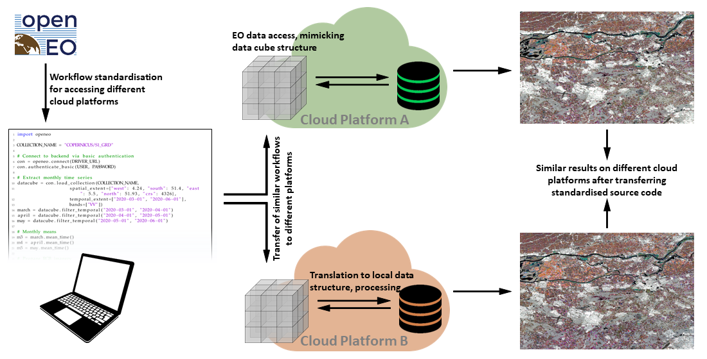

*Concept of the openEO API (figure by [Schramm et al. 2021](https://doi.org/10.3390/rs13061125)/ [CC BY 4.0](http://creativecommons.org/licenses/by/4.0/)).*

## Summary and outlook

Accessing and handling large remote sensing time series data or selected parts of them can be a major obstacle for anyone starting to use that in his work. Hence, this theme has introduced the most important data sources and tools needed as a prerequisite for any more advanced analysis. For further reading on recent and anticipated future development and trends in the area of big remote sensing data see, e.g., [Sudmanns et al. 2022](https://doi.org/10.1080/20964471.2022.2099236), [Xu et al. 2022](https://doi.org/10.1080/17538947.2022.2115567) and [Backeberg et al. 2022](https://doi.org/10.1080/20964471.2022.2094953).

## Self-evaluation quiz

<form name="quiz" action="" method="post" onsubmit="evaluate_quiz(); return false">

<!--Question 1-->
<label for="q_01">
Optical satellite data from the Landsat program: Which statements are correct?
</label> 
<input type="checkbox" name="q_01">To map recent land cover changes in small-structured agricultural systems, Landsat-9 data is ideal, because it can provide vegetation indices at the highest spatial and temporal resolution. 
<input type="checkbox" name="q_01">The long period of relatively continuous observation across large parts of the Earth is one of the biggest strengths of the Landsat archive. 
<input type="checkbox" name="q_01">To ensure continuity, all Landsat satellites used exactly the same sensor. 
<input type="checkbox" name="q_01">Level-1 Landsat data from Landsat Collection 1 is the best choice for any remote sensing time series analysis. 

The long period of relatively continuous observation across large parts of the Earth is one of the biggest strengths of the Landsat archive.

<output id="output_q_01"></output>  

<!--Question 2-->
<label for="q_02">
Which of these statements about data cubes are correct?
</label> 
<input type="checkbox" name="q_02">Data cubes always have three dimensions. 
<input type="checkbox" name="q_02">Observations and derivatives of different variables and even from multiple different remote sensing systems can be managed in a well-structured form by a data cube. 
<input type="checkbox" name="q_02">Data cubes can be deployed on a local machine but most commonly they are hosted on larger (cluster/cloud) infrastructure to serve more users. 

Observations and derivatives of different variables and even from multiple different remote sensing systems can be managed in a well-structured form by a data cube.&Data cubes can be deployed on a local machine but most commonly they are hosted on larger (cluster/cloud) infrastructure to serve more users.

<output id="output_q_02"></output>  

<!--Question 3-->
<label for="q_03">
True or false: Clouds are not a problem for monitoring crop growth or snow cover with Sentinel-2 time series because very good cloud removal algorithms exist, and they can reveal the ground under cloud cover.
</label> 
<input type="radio" name="q_03">True
<input type="radio" name="q_03">False 

False

<output id="output_q_03"></output>  

<input type="submit" value="Submit" style="font-size:14pt">  

<output id="output_overall">
</output>
</form>

## Excercise

**Search and load Landsat data to QGIS via a STAC API**

The goal of this excercise is learn how to search and load Landsat data of selected scenes from large archives of cloud providers to QGIS. Try to accomplish the following tasks using QGIS and the STAC API Plugin:

1. Install the ([QGIS STAC API Plugin](https://stac-utils.github.io/qgis-stac-plugin/#quick-installation)) and read the [documentation](https://stac-utils.github.io/qgis-stac-plugin/).
2. Connect to a STAC API and search for Landsat scenes of a specific time period (e.g. July 2022) covering an area of your choice (e.g. your university's city). For the different Landsat sensors, how many scenes do you find?  
(*Hint:* AWS/EarthSearch and Microsoft Planetary Computer make their STAC APIs available without authentication (as of 03/2023))
3. Select a scene for further use, preferably one with little cloud cover. Load the footprint of the scene to your map canvas (along with a background map, e.g. Open Street Map).
4. Add selected bands (e.g. red, green, blue bands) as layers to the map canvas (*Hint:* To directly downolad the assets, set download folder under *Settings*).
5. Create a composite Virtual Raster (VRT) out of the selected bands.
6. Clip VRT to a relatively small area-of-interest (AOI) polygon.
7. Save the clipped VRT as GeoTiff (RGB composite for the AOI in the bands' native resolution).

<iframe width="560" height="315" src="https://www.youtube.com/embed/7bkkgNWe2b8?si=nYydt8wG0tlXWMPn" title="YouTube video player" frameborder="0" allow="accelerometer; autoplay; clipboard-write; encrypted-media; gyroscope; picture-in-picture; web-share" allowfullscreen></iframe>

## References

Amani, M., Ghorbanian, A., Ahmadi, S. A., Kakooei, M., Moghimi, A., Mirmazloumi, S. M., ... & Brisco, B. (2020). Google earth engine cloud computing platform for remote sensing big data applications: A comprehensive review. IEEE Journal of Selected Topics in Applied Earth Observations and Remote Sensing, 13, 5326-5350. https://doi.org/10.1109/JSTARS.2020.3021052

Backeberg, B., Šustr, Z., Fernández, E., Donchyts, G., Haag, A., Oonk, J. R., ... & Chatzikyriakou, C. (2022). An open compute and data federation as an alternative to monolithic infrastructures for big Earth data analytics. Big Earth Data, 1-19. https://doi.org/10.1080/20964471.2022.2094953

Baumann, P. (1993). Language Support for Raster Image Manipulation in Databases. In: Graphics Modeling and Visualization in Science and Technology (pp. 236-245). https://doi.org/10.1007%2F978-3-642-77811-7_19

Baumann, P., Misev, D., Merticariu, V., Huu, B.P. (2019). Datacubes: Towards Space/Time Analysis-Ready Data. In: Döllner, J., Jobst, M., Schmitz, P. (eds). Service-Oriented Mapping. Lecture Notes in Geoinformation and Cartography. Springer, Cham. https://doi.org/10.1007/978-3-319-72434-8_14

Daniel, J. (2019). Data Science with Python and Dask.  ISBN 9781617295607, 296 p., https://www.manning.com/books/data-science-with-python-and-dask

Gascoin, S., Monteiro, D., & Morin, S. (2022). Reanalysis-based contextualization of real-time snow cover monitoring from space. Environmental Research Letters, 17(11), 114044. https://doi.org/10.1088/1748-9326/ac9e6a

Gorelick, N., Hancher, M., Dixon, M., Ilyushchenko, S., Thau, D., & Moore, R. (2017). Google Earth Engine: Planetary-scale geospatial analysis for everyone. Remote sensing of Environment, 202, 18-27. https://doi.org/10.1016/j.rse.2017.06.031

Hansen, M. C., Potapov, P. V., Moore, R., Hancher, M., Turubanova, S. A., Tyukavina, A., ... & Townshend, J. (2013). High-resolution global maps of 21st-century forest cover change. Science, 342(6160), 850-853.

Horler, D. N. H., DOCKRAY, M., & Barber, J. (1983). The red edge of plant leaf reflectance. International Journal of Remote Sensing, 4(2), 273-288 https://doi.org/10.1080/01431168308948546

Hoyer, S., & Hamman, J. (2017). xarray: ND labeled arrays and datasets in Python. Journal of Open Research Software, 5(1). https://doi.org/10.5334/jors.148

Krause, C., Dunn, B., Bishop-Taylor, R., Adams, C., Burton, C., Alger, M., Chua, S., Phillips, C., Newey, V., Kouzoubov, K., Leith, A., Ayers, D., Hicks, A., DEA Notebooks contributors (2021). Digital Earth Australia notebooks and tools repository. Geoscience Australia, Canberra. https://doi.org/10.26186/145234

Lewis, A., Oliver, S., Lymburner, L., Evans, B., Wyborn, L., Mueller, N., ... & Wang, L. W. (2017). The Australian geoscience data cube—foundations and lessons learned. Remote Sensing of Environment, 202, 276-292. https://doi.org/10.1016/j.rse.2017.03.015

Li, J., & Roy, D. P. (2017). A global analysis of Sentinel 2A, Sentinel 2B and Landsat 8 data revisit intervals and implications for terrestrial monitoring. Remote Sensing, 9 (9). https://doi.org/10.3390/rs9090902

Mahecha, M. D., Gans, F., Brandt, G., Christiansen, R., Cornell, S. E., Fomferra, N., ... & Reichstein, M. (2020). Earth system data cubes unravel global multivariate dynamics. Earth System Dynamics, 11(1), 201-234. https://doi.org/10.5194/esd-11-201-2020

Montero, D., (2021). eemont: A Python package that extends Google Earth Engine. Journal of Open Source Software, 6(62), 3168, https://doi.org/10.21105/joss.03168

Pebesma, E.; Bivand, R. (2023). Spatial Data Science: With Applications in R (1st ed.). 314 pages. Chapman and Hall/CRC. https://doi.org/10.1201/9780429459016

Ranghetti, L., Boschetti, M., Nutini, F., & Busetto, L. (2020). “sen2r”: An R toolbox for automatically downloading and preprocessing Sentinel-2 satellite data. Computers & Geosciences, 139, 104473. https://doi.org/10.1016/j.cageo.2020.104473

Schramm, M., Pebesma, E., Milenković, M., Foresta, L., Dries, J., Jacob, A., ... & Reiche, J. (2021). The openEO API – Harmonising the use of Earth Observation cloud services using virtual data cube functionalities. Remote Sensing, 13(6), 1125. https://doi.org/10.3390/rs13061125

Simoes, R., Camara, G., Queiroz, G., Souza, F., Andrade, P. R., Santos, L., Carvalho, A., & Ferreira, K. (2021). Satellite Image Time Series Analysis for Big Earth Observation Data. Remote Sensing, 13(13), 2428. https://doi.org/10.3390/rs13132428

Storch, T., Reck, C., Holzwarth, S., Wiegers, B., Mandery, N., Raape, U., Strobl, C., Volkmann, R., Böttcher, M., Hirner, A., Senft, J., Plesia, N., Kukuk, T., Meissl, S., Felske, J.-R., Heege, T.,Keuck, V., Schmidt, M., & Staudenrausch, H. (2019). Insights into CODE-DE Germany’s Copernicus data and exploitation platform. Big Earth Data, 3(4), 338–361. https://doi.org/10.1080/20964471.2019.1692297

Strobl, P., Baumann, P., Lewis, A., Szantoi, Z., Killough, B., Purss, M., Craglia, M., Nativi, S., Held, A., & Dhu, T. (2017). The six faces of the data cube. Proc. of the 2017 Conference on Big Data from Space (BIDS' 2017), 28th - 30th Nov 2017, Toulouse (France). https://doi.org/10.2760/383579

Sudmanns, M., Augustin, H., Killough, B., Giuliani, G., Tiede, D., Leith, A., ... & Lewis, A. (2022). Think global, cube local: an Earth Observation Data Cube’s contribution to the Digital Earth vision. Big Earth Data, 1-29. https://doi.org/10.1080/20964471.2022.2099236

Tamiminia, H., Salehi, B., Mahdianpari, M., Quackenbush, L., Adeli, S., & Brisco, B. (2020). Google Earth Engine for geo-big data applications: A meta-analysis and systematic review. ISPRS Journal of Photogrammetry and Remote Sensing, 164, 152-170. https://doi.org/10.1016/j.isprsjprs.2020.04.001