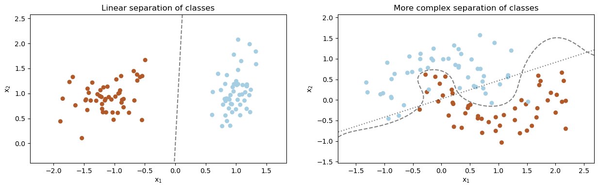
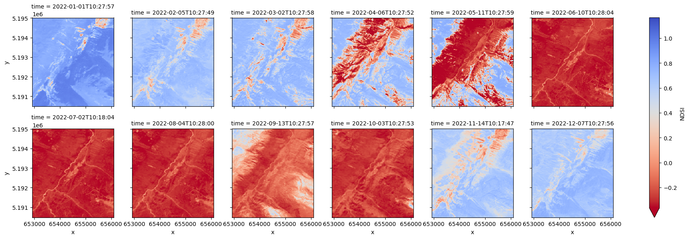
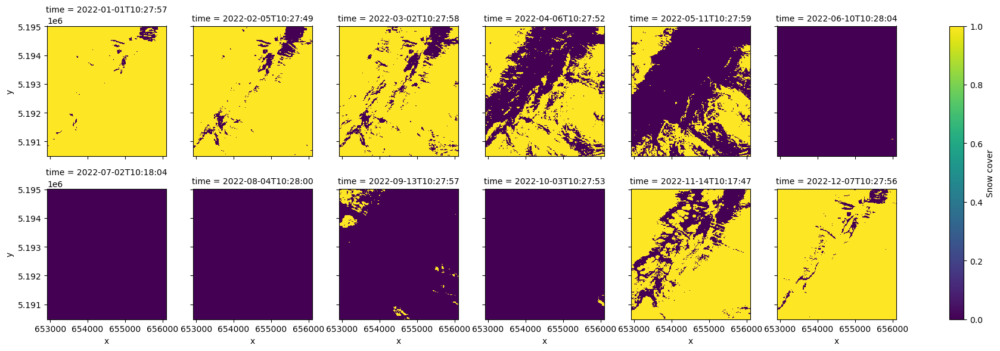
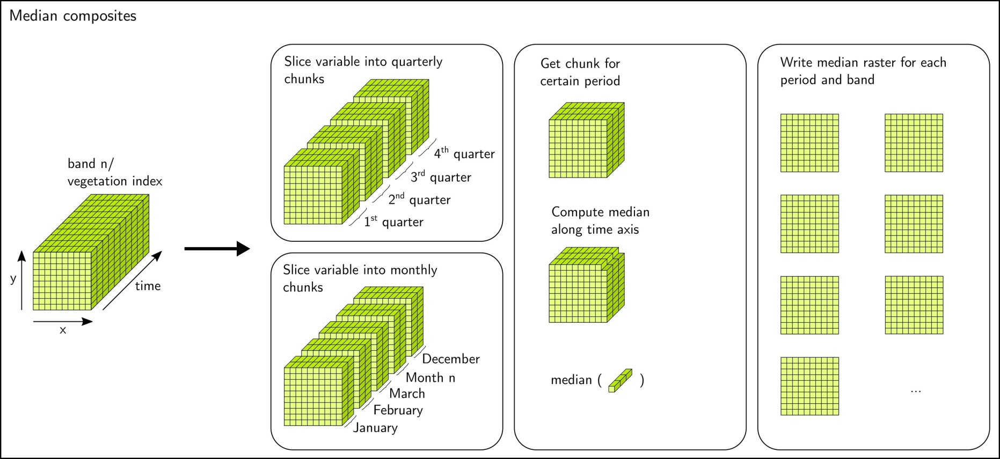
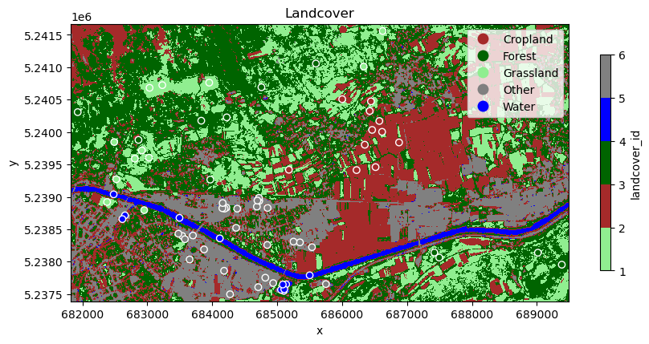

# Theme 3 - Time series analysis based on classification

## Introduction

Studying human-environment interactions with remote sensing very often relies on an investigation of discrete categories of landcover, land surface processes or other phenomena. Hence, classification of such target categories in remote sensing data is a vital task in many information extraction pipelines. Automating this task continues to receive a lot of interest by the Earth observation research community and by the geospatial industry.

With the increasing availability of remote sensing time series, such classification tasks are no longer limited to single epochs (single-date classification). More and more classifications are run on time series either (i) in a multitemporal fashion to track categories or discrete objects through time or (ii) exploiting temporal information (on class-specific variations with time) to enhance a classification regarding its robustness and its capability to separate specific classes.

**Objectives**

The objectives of this theme are to

* understand the principles of automated classification of remote sensing data
* overview the main approaches to multitemporal classification vs. classification based on temporal information
* understand how these approaches can be implemented (shown in tutorials for simplified use cases)
* get an idea of exemplary applications (from the scientific literature)

## Theoretical background and approaches to automated classification in remote sensing

The general idea behind any data classification is that the data can be grouped into meaningful semantic categories (classes) based on characteristic patterns in the data. The goal of *image classification* (or *point cloud classification*) is to assign each spatial unit (pixel or point) a discrete category (or probabilities for several categories in case of fuzzy classifications). In the computer vision community, this task is also known as *semantic segmentation* or *semantic labelling*, in contrast to *image labelling* (e.g. *This image contains a dog.*) or *object detection* (resulting usually in bounding boxes around objects in an image, e.g. faces).

The basis for any classification is formed by one or more variables (*features* or *predictors*) that allow to separate the target classes, ideally without ambiguity. In remote sensing, a *feature set* used as input to a classification is typically composed of spectral or geometric features or a combination of both:

* Spectral features such as spectral band values, spectral indices, texture metrics derived by focal statistics of spectral values
* Geometric features characterizing the shape or structure of a surface, such as morphometric variables derived from a digital terrain model (e.g. slope, curvature, ...) or the local distribution of points in a 3D point cloud (e.g. eigenvalue ratios, 3D/2D density ratio, ...)

*Left: Dataset with two classes that are well separable by a straight line in a two-dimensional feature space (dashed linear decision boundary found by linear Support Vector Classification (SVC)). Right: Dataset with two classes that are not well separable by a decision boundary found by linear SVC (dotted line). Separability is better here with a non-linear decision boundary found by SVC with radial basis function (RBF) kernel (dashed line).*

Remote sensing data (such as satellite images) can be classified through *visual interpretation* by a human operator, who is drawing object boundaries (such as lake outlines) or linear objects (such as a river network) over an analogue or digital view of the image based on his visual perception, his experience, and certain (more or less systematic) criteria. For such an interpretation, a few features can be visualized in a color image, most intuitively by combining the red, green and blue bands recorded by an imaging sensor but other features (e.g. spectral bands or terrain parameters) can be encoded as RGB color as well. The lines and polygons drawn (vector data) may be converted to raster data if needed. On the one hand, humans are very good in considering complex spatial contexts for object recognition and classification. On the other hand, drawbacks of such a manual classification are subjectivity, a lack of efficiency, repeatability and limitations regarding the systematic consideration of many different features.

Alternatively, humans can instruct a computer to categorize spatial units *automatically* according to certain criteria. These criteria (conditions) can be defined directly via rules or indirectly (in a data-driven manner) by constructing a statistical classifier from the data (e.g. as in the figure above where each data point could be a pixel and the features x1 and x2 could be spectral bands). The latter option is often based on *[machine learning (ML)](https://en.wikipedia.org/wiki/Machine_learning)*. In unsupervised approaches, the user supplies only the features and chooses a value for certain hyperparameters (depending on the algorithm; e.g., the number of clusters *k* in [k-means](https://en.wikipedia.org/wiki/K-means_clustering) clustering). In a supervised classification, the user has to provide additionally the labels for a set of samples (*training data*) which can then be used by the algorithm to learn classification rules based on the features (a *classifier*). Once such a classifier has been trained, it can be applied to predict the labels for previously unseen samples based on the feature vector of each sample. Among a variety of ML algorithms, Random Forest (RF; [Breiman 2001](https://doi.org/10.1023/A:1010933404324)) and Support Vector Machines (SVM; [Cortes and Vapnik](https://doi.org/10.1007/BF00994018)) are among the most popular ones of the last two decades ([Belgiu and Drăguţ 2016](https://doi.org/10.1016/j.isprsjprs.2016.01.011), [Mountrakis et al. 2011](https://doi.org/10.1016/j.isprsjprs.2010.11.001)). For getting started with the machine learning vocabulary and concepts (along with a Python scikit-learn example) we recommend to read [this scikit-learn introduction to ML](https://scikit-learn.org/stable/tutorial/basic/tutorial.html#machine-learning-the-problem-setting).

Hence, we can distinguish three general approaches to (semi-)automatic classification:

* Rule-based classification (e.g. NDSI thresholding to classify snow/no-snow)
* Unsupervised classification (e.g. clustering NDSI and possibly brightness to classify snow/no-snow)
* Supervised classification (usually with machine learning approaches, including deep learning)

Often, input data comprising many features is sensed (e.g. by multitemporal or hyperspectral remote sensing) or a large number of features is extracted from the input data (such as spectral indices, time series metrics or morphometric variables, potentially at different scales), and some of the features are actually redundant or irrelevant for the classification. In such cases, feature selection (different techniques to select a subset of features) or some other form of dimensionality reduction (such as [principal component analysis (PCA)](https://en.wikipedia.org/wiki/Principal_component_analysis)) is often applied. The main motivation for this step is usually to avoid negative effects known as the [curse of dimensionality](https://en.wikipedia.org/wiki/Curse_of_dimensionality) and/or to reduce the time and computing power needed to train a classifier (and for feature extraction on the full dataset). Learn more about feature selection for multitemporal classification in [Module 2](../../module2/04_multitemporal_classification/04_multitemporal_classification.md#feature-selection-as-potential-to-optimise-multitemporal-classification).

Some external tutorials:

* Intermediate Earth Eata Science Textbook Course [here](https://www.earthdatascience.org/courses/use-data-open-source-python/intro-raster-data-python/raster-data-processing/classify-plot-raster-data-in-python/) by [Wasser et al. (2021)](https://doi.org/10.5281/zenodo.4683910) - Rule-based classification of a LiDAR canopy height model
* [PyGIS Course](https://pygis.io/docs/f_rs_ml_predict.html) - Supervised and unsupervised classification of a single scene with scikit-learn and GeoWombat (ML pipeline, cross-validation, etc.)
* [Supervised classification with Sentinel-2 images](https://www.youtube.com/watch?v=N_yJDMgRfik) (in GEE, with one cloud-free image)

Now let's have a look at how these key concepts for automated classification of (mono-temporal) remote sensing data can be transferred or extended to time series of images and point clouds.

## Classification of remote sensing time series

### Multitemporal classification

#### Concept

A multitemporal classification can produce a time series of thematic maps based on monotemporal (single-date) features. This is often followed by spatio-temporal visualization, by post-classification change detection or by another kind of analysis of classes’/objects’ properties (location and area, or temporal-thematic information). We illustrate this approach at the example of snow cover mapping where a snow cover map is produced for each month of 2022.

#### Tutorial: **Sentinel-2 snow cover classification in Python**

[This tutorial](./T3_S2_snow_classification.ipynb) introduces a very basic procedure for (binary) snow cover mapping by retreiving and thresholding a time series of the Normalized Difference Snow Index (NDSI). This results in one snow cover map per month (which can be implemented in a straightforward Python workflow using GEE and related tools; however, a higher resolution (such as weekly) could make sense). Moreover, the tutorial shows possibilities for analysis and visualization of the classified time series. At the end of this theme, [excercise 1](./03_time_series_analysis_based_on_classification.md#excercise-1-snow-cover-mapping-interpretation-and-sensitivity-analysis) builds on and extends the tutorial.

The examined workflow involves the following steps:

* NDSI time series query, monthly aggregation and download
* Rule-based classification (NDSI thresholding)
* Calculation of snow covered area (SCA) and plotting of SCA over time
* Further time series analysis, e.g. of snow cover duration per pixel (map)

*Monthly mean Sentinel-2 NDSI (top) and snow cover derived from this (bottom) using a threshold of 0.4 to separate snow-covered and snow-free pixels.*

    
    

*Percentage of area covered by snow based on monthly Sentinel-2 NDSI (left) and number of snow covered months per pixel based on the classification (right). Note that the aggregation methods and time periods for this may (in addition to the availability of cloud-free observations) have a substantial impact on the results.*

To build a more sophisticated ML pipeline on a time series of images instead of a simple rule-based binary classification see also [this](https://pygis.io/docs/f_rs_ml_predict.html#spatial-prediction-with-time-series-stack-using-geowombat-sklearn) tutorial from the PyGIS course (v1.2.0; [Mann et al. 2022](https://github.com/mmann1123/pyGIS/releases/tag/v1.2.0)).

### Classification based on time series features

#### Concept

In another approach the classification exploits the temporal “fingerprint” of a spectral feature. In this case, multi-temporal observations of spectral measurements or their derivatives are used to extract *time series based metrics as classification features*, and these features are used to derive one detailed thematic map. This approach is most commonly applied when the target classes are assumed to be separable by their distinctive seasonal (or management-related) variation and timing of remotely-sensed vegetation vigour and amount (i.e., *land surface phenology (LSP)*). Time series of satellite derived vegetation indices or biophysical variables are then used as proxies to study LSP or to characterize plants in different phenological phases ([Helman 2018](https://doi.org/10.1016/j.scitotenv.2017.07.237), [Caparros-Santiago et al. 2021](https://doi.org/10.1016/j.isprsjprs.2020.11.019)).

In a more basic version, a couple of multitemporal, cloud-free images are directly used ("*standard multitemporal features*"). In this case, a few different acquisition dates, where classes are well separable, are selected. For discriminating for example different forest types (with their dominating tree species), such a selection typically includes scenes from different phenological phases (such as green-up or senescence; [Fassnacht et al. 2016](https://doi.org/10.1016/j.rse.2016.08.013)). For larger study areas covered by multiple satellite orbits, however, cloud-free images of the same date are often unavailable. Hence, the resulting feature sets contain missing values, which are problematic for most machine learning algorithms.

To alleviate this problem, time series with all available, cloud-masked imagery from an observation period (e.g. one year) can be aggregated at pixel level to calculate composites for certain time periods. Also referred to  as *spectral-temporal metrics*, these composites typically contain temporal mean or median values but can also include other statistics, such as standard deviation, minimum and maximum values or selected percentiles (e.g. [Pflugmacher et al. 2019](https://doi.org/10.1016/j.rse.2018.12.001)).

Temporal aggregation (compositing) of such metrics for a long interval, such as multiple months, a growing season or an entire year, reduces the number of features and the data volume for classification. However, aggregation of observations with shorter intervals, capturing the distinct timing of seasonal spectral variation, might perform better for mapping vegetation categories (e.g. 10-day intervals used for crop mapping by [Griffiths et al. 2019](https://doi.org/10.1016/j.rse.2018.10.031)). The length of adequate aggregation intervals (*bins*) depends on the application and target classes but also on the density of valid observations in the input time series (e.g. constrained by revisit interval and cloud cover).

*Spectral-temporal metrics extraction at the example of quaterly and monthly median composites (figure by [Kollert et al. 2021](https://doi.org/10.1016/j.jag.2020.102208))/ [CC BY-NC-ND 4.0](https://creativecommons.org/licenses/by-nc-nd/4.0/).*

In addition to such statistical metrics for a defined time interval, ecologically-meaningful metrics related to LSP can be derived from a time series of remotely sensed vegetation indices or biophysical variables ([Caparros-Santiago et al. 2021](https://doi.org/10.1016/j.isprsjprs.2020.11.019)). Such *phenological metrics (phenometrics)* typically include the *start-of-season (SOS)*, the *end-of-season (EOS)*, and the *length-of-the-growing-season (LOS)*. They have not only been used to study LSP in relation to environmental factors but also to discriminate different landcover classes (such as forest types; [Pasquarella et al. 2018](https://doi.org/10.1016/j.rse.2018.02.064), [Kollert et al. 2021](https://doi.org/10.1016/j.jag.2020.102208)). All three types of features obtained from a remote sensing time series (*standard multitemporal features*, *spectral-temporal metrics*, and *phenological metrics*) can be fed into a machine learning pipeline for classification.

*Extraction of phenological metrics from an NDVI time series (figure by [Kollert et al. 2021](https://doi.org/10.1016/j.jag.2020.102208)/ [CC BY-NC-ND 4.0](https://creativecommons.org/licenses/by-nc-nd/4.0/)).*

#### Tutorial: **Image time series classification in Python tutorial**

[This E-TRAINEE tutorial](./T3_S2_landcover_classification.ipynb) on landcover classification shows how you can implement a machine learning workflow with time series metrics as features. For simplicity, we aggregate over the entire growing season (i.e. we do not calculate spectral-temporal metrics for shorter time periods such as months). However, we compute different metrics (mean, standard deviation, minimum and maximum) to capture the temporal variability of the NDVI in each pixel over the growing season.

*Landcover map produced by a supervised classification with seasonal spectral metrics (derived from a Sentinel-2 time series) and manually labelled training data points (indicated by circles).*

#### Application examples: National-scale mapping of agricultural practices

Classification based on spectral-temporal metrics is particularly useful for mapping and monitoring agricultural landuse in optical satellite image time series. Landuse practices are often not well separable using spectral data from a single point in time but multiple studies have successfully used image time series for this task. The rationale behind this is that landuse events modify the spectral reflectance of the land surface and are, thus, captured by the spectral time series. To learn more about this approach, have a look at these examples from the scientific literature:

[Stumpf et al. 2018](https://doi.org/10.1016/j.agee.2018.02.012) used Landsat time series together with auxiliary variables in a supervised machine learning classification to map grassland and cropland across Switzerland for each year in the period 2000-2015. The annual land use maps were then categorized into permanent grassland or cropland, respectively, and different conversion regimes. This served as a basis to investigate the soil organic carbon and its change in relation to different agricultural practices. <!--Add figure 2 (Optimized irregular composites (describe also method!)) after obtaining permission.-->

In a follow-up study, [Stumpf et al. 2020](https://doi.org/10.1016/j.ecolind.2020.106201) calculated Landsat time series metrics to distinguish spatio-temporal grassland management patterns. The resulting management classes describe use intensities of mowing and grazing practices and were subsequently analysed in relation to plant species richness.

*Grassland management classes and their areal proportions within three subregions of characteristic grassland management in Switzerland. Grassland was classified according to prevailing management practices (mowing or grazing) and use intensities (high, moderate, low) (figure by [Stumpf et al. 2020](https://doi.org/10.1016/j.ecolind.2020.106201)/ [CC BY-NC-ND 4.0](http://creativecommons.org/licenses/by-nc-nd/4.0/)).*

A comprehensive example for (i) binary classification of annual cropland and (ii) cropping practice classification is provided by [Rufin et al. 2019](https://doi.org/10.3390/rs11030232), who derived a large set of features from on year of Landsat imagery and used this as input to Random Forest classifiers. This feature set included best-observation composites for four target days in the year, and spectal temporal metrics for each quarter and the entire year using all clear-sky observations available in the respective period. These metrics were the band-wise minimum, 25th percentile, median, 75th percentile, and maximum, mean spectral reflectance as well as the inter-quartile range, range, standard deviation, skewness and kurtosis of all reflectance values from each period. Additionally, a smoothed and gap-filled time series with equidistant eight-day intervals was produced for the three Tasseled Cap components Brightness, Greenness and Wetness ([Crist 1985](https://doi.org/10.1016/0034-4257(85)90102-6)). An extensive comparison of the classification accuracy obtained with different feature sets (and combinations) was conducted. This revealed that for mapping cropping practices it is highly beneficial to retain the information on intra-annual spectral variation contained in the time series. In specific, [Rufin et al. 2019](https://doi.org/10.3390/rs11030232) found that an aggregation of observations into quaterly to near-weekly bins produced suitable classification features resulting in high classification accuracy.

[Griffiths et al. 2019](https://doi.org/10.1016/j.rse.2018.10.031) produced a national-scale crop and land cover map for Germany using spectral-temporal metrics from [Harmonized Landsat Sentinel (HLS) data](https://hls.gsfc.nasa.gov/). The study found gap-filled metrics (composites) for 10-day intervals outperforming monthly or seasonal ones.

*Crop type and landcover map for Germany (for 2016) produced with a time series of 10-day reflectance composites from Harmonized Landsat Sentinel (HLS) data. Reference data was available for three states outlined in magenta (figure by [Griffiths et al. 2019](https://doi.org/10.1016/j.rse.2018.10.031)/ [CC BY-NC-ND 4.0](http://creativecommons.org/licenses/by-nc-nd/4.0/)).*

## Useful tools for remote sensing time series classification

For practical implementation of classifications on remote sensing time series have a look at the following lists with tools dedicated to related tasks.

**Tools for machine learning/deep learning classification:**

Machine learning classification tools are most commonly used for classification (semantic segmentation) of a single scene but usually you can feed them with spatio-temporal metrics as feature vector to perform a temporally informed supervised classification. A selection of software packages to get started:

* Open source GIS and remote sensing software contains ML tools for classification (sometimes as plugins/addons), e.g.:
    * [SAGA GIS](https://saga-gis.sourceforge.io/en/index.html) (with image classification tools using Random Forest, Support Vector Machine, ...)
    * GRASS GIS [r.learn.ml2](https://grass.osgeo.org/grass82/manuals/addons/r.learn.ml2.html) addon (needs scikit-learn and pandas installed)
    * QGIS [Semi-Automatic Classification Plugin](https://semiautomaticclassificationmanual-v5.readthedocs.io/en/latest/) (SCP; needs scikit-learn installed to run a Random Forest classification)
* Machine learning and deep learning packages for Python
    * [Scikit-learn](https://scikit-learn.org/stable/) - Widely used and well documented ML library with many algorithms and tools
    * Deep Learning: [PyTorch](https://pytorch.org/), [TensorFlow](https://www.tensorflow.org/) and the [Keras](https://keras.io/) API built on top of TensorFlow
    * [Pycaret](https://pycaret.gitbook.io/docs/) - A wrapper for scikit-learn and other ML packages aimed at simplification and code reduction for ML experiments (and also for [ML on time series](https://pycaret.gitbook.io/docs/#time-series))
    * [Pyspatialml](https://github.com/stevenpawley/pyspatialml) - ML classification and regression modelling for spatial raster data.
    * [Mlxtend](https://rasbt.github.io/mlxtend/) - ML extensions and utilities compatible with (e.g.) scikit-learn.
    * [Optuna](https://optuna.org/) - Hyperparameter optimization for different frameworks (incl. scikit-learn, PyTorch, Keras, ...)
* Machine learning packages for the R language
    * ["Official" overview](https://cran.r-project.org/web/views/MachineLearning.html)
    * [Overview](../../module2/04_multitemporal_classification/04_multitemporal_classification.md#r-packages-including-machinestatistical-learning-algorithms) in E-TRAINEE Module 2
    * [mlr3](https://mlr3.mlr-org.com/) - A framework for ML regression and classification in the R language, and its extension [mlr3spatial](https://mlr3spatial.mlr-org.com/) that facilitates handling spatial objects (vector and raster data), see e.g. the [landcover classification tutorial](https://mlr-org.com/gallery/technical/2023-02-27-land-cover-classification/)

**Feature extraction from a time series in Python:**

* [stmetrics package](https://stmetrics.readthedocs.io/en/latest/index.html)
    * object-based features and very interesting temporal features for RS time series classification
    * nice [tutorial](https://stmetrics.readthedocs.io/en/latest/examples/TimeMetrics.html) for OBIA classification using the Brasil Data Cube via STAC
    * installation could be a bit difficult on Windows
* [tsfresh package](https://tsfresh.readthedocs.io/en/latest/) - Extracts a large number of features from a time series.
* [Feature tools package](https://www.featuretools.com/) - Featuretools automatically creates features from temporal and relational datasets.

**Time series classification tools:**

* [tslearn](https://tslearn.readthedocs.io/en/stable/) - A Python package that provides machine learning tools for the analysis of time series. It includes, e.g., a clustering module that combines k-means clustering with Dynamic Time Warping as a distance metric.
* [Cesium](https://cesium-ml.org/) - A package for ML time series analysis, including feature extraction, model building and prediction.
* [tsai](https://timeseriesai.github.io/tsai/) - An open-source deep learning package built on top of Pytorch & fastai focused on state-of-the-art techniques for time series tasks like classification, regression, forecasting, imputation.

## Self-evaluation quiz

<form name="quiz" action="" method="post" onsubmit="evaluate_quiz(); return false">

<!--Question 1-->
<label for="q_01">
Training data is essential for any remote sensing time series classification. True or false?
</label> 
<input type="radio" name="q_01">True
<input type="radio" name="q_01">False 

False

<output id="output_q_01"></output>  

<!--Question 2-->
<label for="q_02">
What can be the result of classifying a remote sensing time series?
</label> 
<input type="checkbox" name="q_02">A time series of classified maps. 
<input type="checkbox" name="q_02">One map with a classification resulting from aggregate characteristics of the entire time series. 
<input type="checkbox" name="q_02">Several maps describing multiple aspects of a phenomenon (such as landuse categories and landuse intensity levels). 

A time series of classified maps.&One map with a classification resulting from aggregate characteristics of the entire time series.&Several maps describing multiple aspects of a phenomenon (such as landuse categories and landuse intensity levels).

<output id="output_q_02"></output>  

<!--Question 3-->
<label for="q_03">
3)	Which statements about classification based on time series features are correct?
</label> 
<input type="checkbox" name="q_03">Spectral-temporal metrics used for classification should always be computed as aggregates over an entire season. 
<input type="checkbox" name="q_03">If we calculate spectral-temporal metrics over relatively short time intervals, we probably get missing values, and these can be a problem for subsequent machine learning steps. 
<input type="checkbox" name="q_03">For mapping crop types, a classifier trained accurately with spectral-temporal metrics from one season might perform poorly for other seasons if, e.g., the weather and/or agricultural management was different between years. 

If we calculate spectral-temporal metrics over relatively short time intervals, we probably get missing values, and these can be a problem for subsequent machine learning steps.&For mapping crop types, a classifier trained accurately with spectral-temporal metrics from one season might perform poorly for other seasons if, e.g., the weather and/or agricultural management was different between years.

<output id="output_q_03"></output>  

<input type="submit" value="Submit" style="font-size:14pt">  

<output id="output_overall">
</output>
</form>

## Excercise: Snow cover mapping - Interpretation and sensitivity analysis

Work through the [E-TRAINEE tutorial on Sentinel-2 snow cover classification in Python](./T3_S2_snow_classification.ipynb). Based on this tutorial, try to interpret the spatial patterns of snow cover duration and investigate the sensitivity of such a rule-based classification regarding the classification threshold.

*Tasks and questions:*

* The snow cover duration appears to be quite short in some parts of our AOI (given that the village of Obergurgl is located at > 1900 m a.s.l.)? Let's have a look at these areas. Try to get a simple color composite for one date using Google Earth Engine and the tools shown in the tutorial. Maybe this helps with interpretation. Alternatively use (monotemporal) higher resolution data from other sources and display them in Python or in a GIS. What are the surface characteristics of the areas with short snow cover duration? Does this point to potential limitations of the snow classification approach?
* For the binary classification of NDSI into "snow" and "no snow", we had chosen an NDSI threshold of 0.4. What if we change this threshold? How does this affect the classification results? Test a range of thresholds (0.2 to 0.6 with step 0.02), and visualize the effects of varying the threshold on the spatio-temporal classification results.

*Solution:*

One possible solution for this excercise is suggested in [this notebook](./T3_S2_snow_classification__excercise.ipynb) (where the excercise is appended to the tutorial). It also includes some conclusions on the classification approach based on the tutorial and the excercise.

## References

Belgiu, M., & Drăguţ, L. (2016). Random forest in remote sensing: A review of applications and future directions. ISPRS Journal of Photogrammetry and Remote Sensing, 114, 24-31. https://doi.org/10.1016/j.isprsjprs.2016.01.011

Breiman, L. (2001). Random forests. Machine Learning, 45, 5-32. https://doi.org/10.1023/A:1010933404324

Caparros-Santiago, J. A., Rodriguez-Galiano, V., & Dash, J. (2021). Land surface phenology as indicator of global terrestrial ecosystem dynamics: A systematic review. ISPRS Journal of Photogrammetry and Remote Sensing, 171, 330-347. https://doi.org/10.1016/j.isprsjprs.2020.11.019

Cortes, C., & Vapnik, V. (1995). Support-vector networks. Machine Learning, 20, 273-297. https://doi.org/10.1007/BF00994018

Crist, E. P. (1985). A TM tasseled cap equivalent transformation for reflectance factor data. Remote Sensing of Environment, 17(3), 301-306. https://doi.org/10.1016/0034-4257(85)90102-6

Fassnacht, F. E., Latifi, H., Stereńczak, K., Modzelewska, A., Lefsky, M., Waser, L. T., ... & Ghosh, A. (2016). Review of studies on tree species classification from remotely sensed data. Remote Sensing of Environment, 186, 64-87. https://doi.org/10.1016/j.rse.2016.08.013

Griffiths, P., Nendel, C., & Hostert, P. (2019). Intra-annual reflectance composites from Sentinel-2 and Landsat for national-scale crop and land cover mapping. Remote Sensing of Environment, 220, 135-151. https://doi.org/10.1016/j.rse.2018.10.031

Helman, D. (2018). Land surface phenology: What do we really ‘see’from space?. Science of the Total Environment, 618, 665-673. https://doi.org/10.1016/j.scitotenv.2017.07.237

Kollert, A., Bremer, M., Löw, M., & Rutzinger, M. (2021). Exploring the potential of land surface phenology and seasonal cloud free composites of one year of Sentinel-2 imagery for tree species mapping in a mountainous region. International Journal of Applied Earth Observation and Geoinformation, 94, 102208. https://doi.org/10.1016/j.jag.2020.102208

Mountrakis, G., Im, J., & Ogole, C. (2011). Support vector machines in remote sensing: A review. ISPRS Journal of Photogrammetry and Remote Sensing, 66(3), 247-259. https://doi.org/10.1016/j.isprsjprs.2010.11.001

Pasquarella, V. J., Holden, C. E., & Woodcock, C. E. (2018). Improved mapping of forest type using spectral-temporal Landsat features. Remote Sensing of Environment, 210, 193-207. https://doi.org/10.1016/j.rse.2018.02.064

Pflugmacher, D., Rabe, A., Peters, M., & Hostert, P. (2019). Mapping pan-European land cover using Landsat spectral-temporal metrics and the European LUCAS survey. Remote Sensing of Environment, 221, 583-595. https://doi.org/10.1016/j.rse.2018.12.001

Rufin, P., Frantz, D., Ernst, S., Rabe, A., Griffiths, P., Özdoğan, M., & Hostert, P. (2019). Mapping cropping practices on a national scale using intra-annual landsat time series binning. Remote Sensing, 11(3), 232. https://doi.org/10.3390/rs11030232

Stumpf, F., Keller, A., Schmidt, K., Mayr, A., Gubler, A., & Schaepman, M. (2018). Spatio-temporal land use dynamics and soil organic carbon in Swiss agroecosystems. Agriculture, Ecosystems & Environment, 258, 129-142. https://doi.org/10.1016/j.agee.2018.02.012

Stumpf, F., Schneider, M. K., Keller, A., Mayr, A., Rentschler, T., Meuli, R. G., Schaepman, M., & Liebisch, F. (2020). Spatial monitoring of grassland management using multi-temporal satellite imagery. Ecological Indicators, 113, 106201. https://doi.org/10.1016/j.ecolind.2020.106201