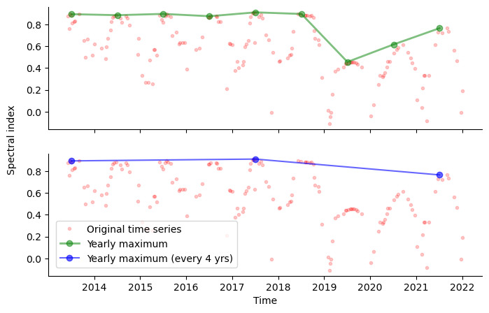
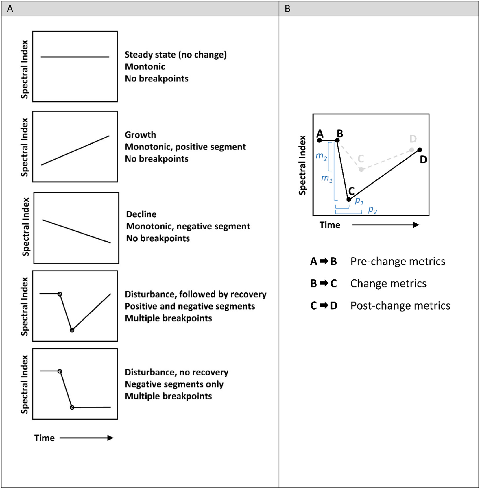
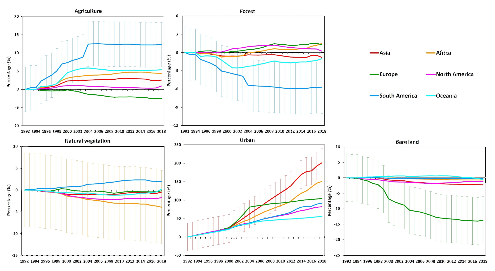
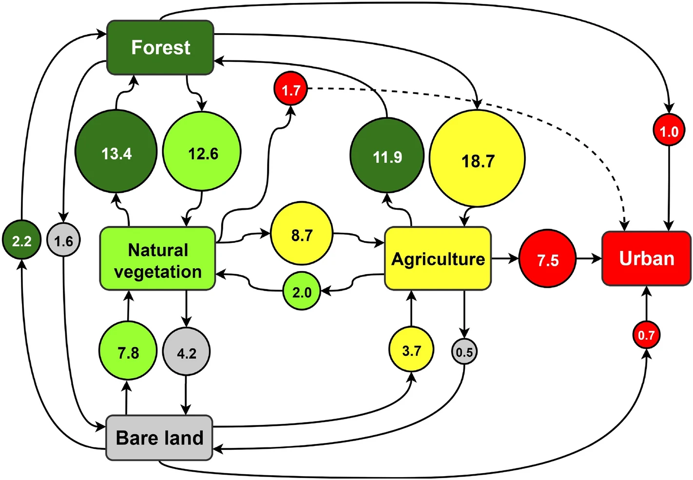
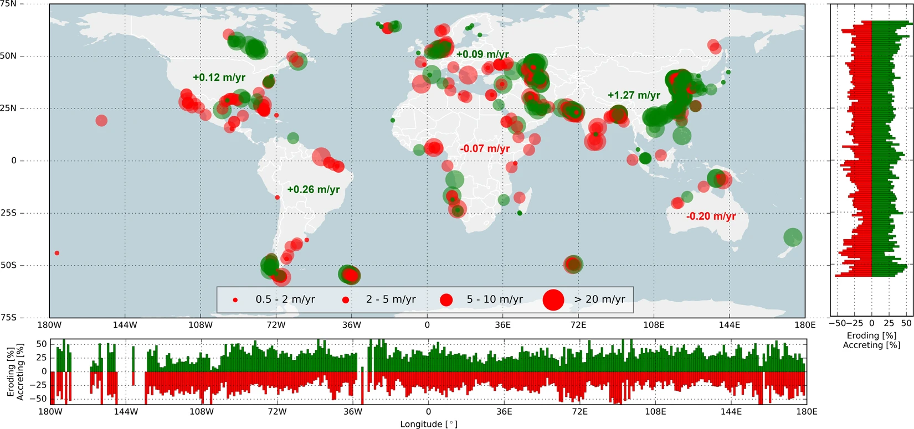
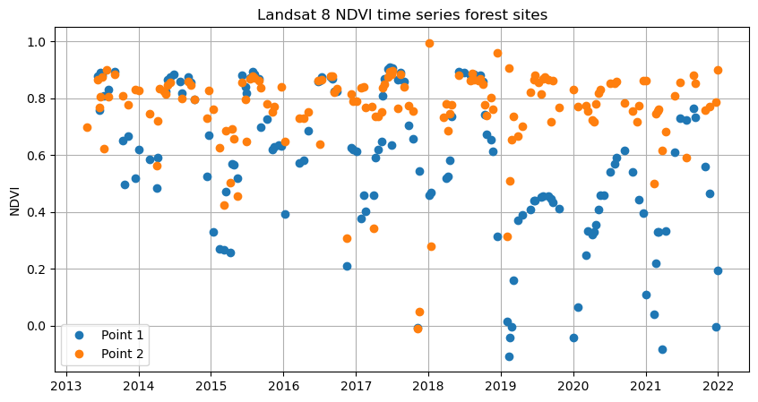
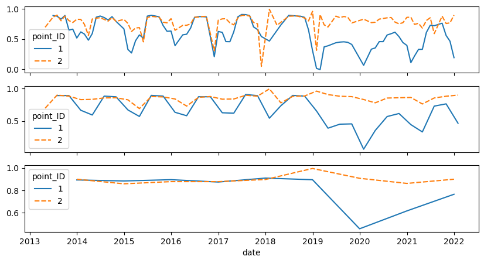

# Theme 4 - Trajectory-based analysis

## Introduction

**Objectives**

The objectives of this theme are to

* overview different ways how land surface change can be studied with remote sensing
* understand the concept of trajectories of a remotely sensed variable along the time dimension
* overview the main approaches to an analysis of such trajectories
* understand how a trajectory-based analysis can be implemented (shown in tutorials for simplified use cases)
* get an idea of exemplary applications of a trajectory-based view on remote sensing time series (from the scientific literature)

**Concept**

For many applications related to the study of human-environment interactions it is crucial to find out when and where changes occur on the land surface, and to characterize these changes in terms of their magnitude, type or direction, as well as spatial and temporal patterns. In this context, temporally dense time series of remote sensing data offer new possibilities for the detection and analysis of land change. Compared to temporally coarser time series (or multi-temporal data with a few observations only), they not only increase the chance that even short-term changes are captured and precisely located in space and time, they also enhance the possibility to separate different components of variation of a signal (thereby overcoming partly the problem of rather low signal to noise ratios). 

Time series of remote sensing data essentially provide for every spatial unit (e.g. pixel) a series of observations, with each observation containing the value of a variable at a specific point in time. The fluctuation of these values with time can be seen as a *trajectory* in variable space (feature space). This may become clearer when we plot the observations for one spatial unit as points, connect them with lines and add a resampling or smoothing operation to the time series (to remove noise or high frequency parts of the signal).

	

*Example of a spectral trajectory. The detectability of changes is depending on how the original time series is acquired and processed (e.g. resampled or smoothed). The yearly maxima of a vegetation index indicate a change in the year 2019, whereas this is not well visible if observations are available only every four years, i.e. the temporal resolution of observations and aggregated time series is important.*

The development of observed values with time (*trajectory*) often follows a distinct pattern, Such patterns may be a constant increase, a constant decrease, or a succession of the two types in different phases of the development (e.g., increase followed by decrease). The transition between such phases can be gradual or abrupt (slow or sudden change of the direction of slope of a trend fitted locally to the trajectory). The observed value may also drop or jump suddenly between two (or a few) observations (*breaks*).

With the increasing availability of dense remote sensing time series, a number of methods have been established to disentangle various components of a spectral trajectory (such as trends, seasonality, noise and short-term change). Before detailing more sophisticated trajectory-based analysis, however, let's have a look at more traditional and general approaches to remote sensing change detection and analysis.

## Approaches and methods

### Change detection in multitemporal remote sensing data

Following the definition of [Singh (1989)](https://doi.org/10.1080/01431168908903939), *change detection* is "the process of identifying differences in the state of an object or phenomenon by observing it at different times". The classic way of change detection in remote sensing is a pairwise comparison of data acquired at different points in time. If corresponding spatial units (e.g. pixels) in these data differ from each other (e.g. the difference of a continuous variable exceeding a threshold), the spatial unit is assumed to have changed. A key challenge is to discriminate "real" change against noise (random variation) or systematic errors in the data. Therefore, preprocessing steps (such as filtering/de-noising/smoothing and data harmonization) are typically applied prior to any change detection. Over the years, many algorithms have been developed for finding differences in multitemporal data and deciding if these correspond to change. [Tewkesbury et al. (2015)](https://doi.org/10.1016/j.rse.2015.01.006) suggest to distinguish change detection techniques primarily by the unit of analysis and by the comparison method.

Moreover, a general categorization of change detection approaches is often made into *pre-classification change detection* vs. *post-classification change detection*. *Pre-classification change detection* involves a comparison of continuous variables (such as surface reflectance or a vegetation index; e.g. by layer arithmetic), whereas in *post-classification change detection* the data from each observation is first classified into discrete categories (such as landcover classes) and then these categories are compared.

While the detection of change is an important step, in most cases also the nature of change (such as magnitude, direction, timing, speed, thematic categories (*from-to change information*) or aggregated values (e.g. affected area or volumes)) are of interest. Often, the nature of change can be characterized as either *abrupt* or *gradual* (in relative terms) but it may also be something in between, e.g. a sequence of small abrupt events looking like a gradual development ([Woodcock et al. 2020](https://doi.org/10.1016/j.rse.2019.111558)). Following [Woodcock et al. (2020)](https://doi.org/10.1016/j.rse.2019.111558), change can be *transitional* or *conditional*. *Transitional changes* typically refer to a complete transition of the surface type (e.g. from forest to parking lot), whereas *conditional changes* represent a change in the condition of the surface (e.g. seasonal green-up of a forest). For detailed reviews of change detection methods see [Singh (1989)](https://doi.org/10.1080/01431168908903939), [Tewkesbury et al. (2015)](https://doi.org/10.1016/j.rse.2015.01.006) and [Ban & Youssif (2016)](https://doi.org/10.1007/978-3-319-47037-5_2). A starting point for 3D change detection is provided in review articles by [Qin et al. (2016)](https://doi.org/10.1016/j.isprsjprs.2016.09.013) and [Xiao et al. (2023)](https://doi.org/10.1016/j.jag.2023.103258).

Classic change detection techniques by pairwise comparison of images are to some extent possible with basic raster processing tools (raster calculator, reclassify, ...) available in most GIS and remote sensing software suites (e.g. QGIS). For more specific algorithms you may need plugins or implementations in a programming language. Code and links to traditional and deep learning algorithms for change detection in Python and other languages are collected, for instance, in the repositories by [Chen Hongruixuan (2023)](https://github.com/ChenHongruixuan/ChangeDetectionRepository), [Wenhwu (2023)](https://github.com/wenhwu/awesome-remote-sensing-change-detection), and [Min Zhang-Whu (2023)](https://github.com/MinZHANG-WHU/Change-Detection-Review).

Learn more on theoretical backgrounds and practical implementations in the dedicated sections of the **E-TRAINEE Modules 2 and 3**, which focus on change detection and analysis in [optical satellite data](../../module2/05_vegetation_monitoring/05_vegetation_monitoring.md) and in [3D point clouds](../../module3/03_3d_change_analysis/03_3d_change_analysis.md), respectively.

### Analysis and decomposition of spectral trajectories

As time series of remote sensing data are expanding the possibilities for land change analysis, [Woodcock et al. (2020)](https://doi.org/10.1016/j.rse.2019.111558) have postulated a paradigm shift away from bi-temporal change detection towards more continuous monitoring of change. This methodological trend enhances the detection of subtle changes, the precise recognition of their timing, and the characterization of the nature of change (e.g. gradual vs. abrupt). Especially the imagery from Landsat and Sentinel-2 permit users to conduct analyses at spatial and temporal scales appropriate for many ecological topics ([Kennedy et al. 2014](https://doi.org/10.1890/130066)).

**Monitoring ecosystem disturbance and recovery**

Among the many applications of such analyses, one of the most prominent ones is studying ecosystem disturbance and recovery, especially of forests (e.g., [Kennedy et al. 2007](https://doi.org/10.1016/j.rse.2007.03.010), [White et al. 2017](https://doi.org/10.1016/j.rse.2017.03.035), [Zhu et al 2020](https://doi.org/10.1016/j.rse.2019.03.009)). 
To identify and categorize vegetation cover disturbance by open-pit mining and assess the status of subsequent vegetation recovery, [Yang et al. (2018)](https://doi.org/10.1016/j.scitotenv.2018.06.341) classified different types of Landsat NDVI trajectories. In this context, the *LandTrendr* software ([Kennedy et al. 2010](https://doi.org/10.1016/j.rse.2010.07.008)) was developed for segmenting spectral-temporal time series. It is capable of capturing and describing the characteristic trajectories of different forest states, with shorter disturbance events and longer-term processes of recovery in forested ecosystems (see also [Module 2](https://3dgeo-heidelberg.github.io/etrainee/module2/05_vegetation_monitoring/05_vegetation_monitoring.html#the-landsat-based-detection-of-trends-in-disturbance-and-recovery-landtrendr)). The LandTrendr algorithm has also been ported from its original IDL implementation to the Google Earth Engine platform ([Kennedy et al. 2018](https://doi.org/10.3390/rs10050691)), for details see the documentation at the [LT-GEE website](https://emapr.github.io/LT-GEE/index.html).

	

*Spectral trajectories for different forest states (left) and an illustration of different change metrics (such as magnitude (m1, m2) and persistence (p1, p2); right; figure by [Wulder et al. 2019](https://doi.org/10.1016/j.rse.2019.02.015)/ [CC BY 4.0](http://creativecommons.org/licenses/by/4.0/)).*

Another widely used option for landcover change detection is the search for breakpoints in remote sensing trajectories, e.g. with the [Breaks For Additive Season and Trend (BFAST)](https://bfast.readthedocs.io/en/latest/index.html) algorithm ([Verbesselt et al. 2010](https://doi.org/10.1016/j.rse.2009.08.014)). BFAST is an unsupervised time series change detection algorithm specialised in detecting multiple breakpoints within a multi-year time series. It involves an iterative process with multiple steps for decomposing a time series into trend, seasonal and error components, and for detecting breakpoints in each of the components. Variants developed on this basis include the faster and more flexible BFASTlite ([Masiliūnas et al. 2021](https://doi.org/10.3390/rs13163308)), BFASTmonitor (for near-real time detection of a single break; [Verbesselt et al. 2012](https://doi.org/10.1016/j.rse.2012.02.022)), and a Google Earth Engine implementation of BFASTmonitor ([Hamunyela et al. 2020](https://doi.org/10.3390/rs12182953)).

A comprehensive overview of algorithms for change detection and characterization in satellite image time series is provided in [Module 2](https://3dgeo-heidelberg.github.io/etrainee/module2/05_vegetation_monitoring/05_vegetation_monitoring.html#algorithms). A single change detection method often turns out to be not reliable enough and, depending on the situation (e.g. change type, data availability, etc.), different algorithms will be most suitable. This motivates the development of multi-algorithm ensembles to increase change detection accuracy. [Xu et al. (2022)](https://doi.org/10.1016/j.rse.2022.112905) took an ensemble approach for land cover change detection and combined different BFAST outputs in a Random Forest classification. [Bullock et al. (2020)](https://doi.org/10.1016/j.rse.2019.04.018) found that using a combination of break detection algorithms based on fundamentally different approaches can considerably improve the robustness of land change monitoring. In their study, they applied two tests to detect breaks and another test to identify falsely identified breaks.

**Seasonality parameters/phenology**

Another application where satellite image time series are invaluable, is the study of distinctive seasonal variation and timing of vegetation vigour and amount (i.e., *land surface phenology (LSP)*). Here, time series of satellite derived vegetation indices or biophysical variables are used as proxies to study LSP and to investigate potential trends in LSP-related parameters and their drivers ([Henebry and de Boers 2013](https://doi.org/10.1007/978-94-007-6925-0_21), [Helman 2018](https://doi.org/10.1016/j.scitotenv.2017.07.237), [Caparros-Santiago et al. 2021](https://doi.org/10.1016/j.isprsjprs.2020.11.019)).

The *TIMESAT* software ([Eklundh & Jönsson 2016](https://doi.org/10.1007/978-3-319-47037-5_9), [Eklundh 2023](https://web.nateko.lu.se/timesat/timesat.asp)) was developed to derive a number of seasonality parameters from satellite image time series. A smoothing method (either asymmetric Gaussian fits, double-logistic fits, or Savitzky-Golay filtering) is applied to the time series of each pixel. A range of parameters can then be extracted from the smoothed trajectories for each season. TIMESAT is typically employed for phenological studies, and the upcoming release (version 4) is also used for the [Copernicus HR-VPP](https://land.copernicus.eu/pan-european/biophysical-parameters/high-resolution-vegetation-phenology-and-productivity) (high-resolution vegetation phenology and productivity) product suite.

	

*Some of the seasonality parameters generated in TIMESAT: (a) beginning of season, (b) end of season, (c) length of season, (d) base value, (e) time of middle of season, (f) maximum value, (g) amplitude, (h) small integrated value, (h+i) large integrated value. (figure by [Eklundh 2023](https://web.nateko.lu.se/timesat/timesat.asp)/ [CC BY-NC-ND 2.5 SE](http://creativecommons.org/licenses/by-nc-nd/2.5/se/)).*

### Spatial segmentation based on similarity of trajectories

Striving to delineate areas with a homogeneous development through time, remote sensing data can be segmented spatially according to time series similarity ([Maus et al. 2016](https://doi.org/10.1109/JSTARS.2016.2517118), [Belgiu & Csilik 2018](https://doi.org/10.1016/j.rse.2017.10.005), [Anders et al. 2021](https://doi.org/10.1016/j.isprsjprs.2021.01.015)). In this approach, trajectories of a spectral band or index or another variable (such as topographic change measured by photogrammetry or laser scanning) are grouped (i) by a clustering algorithm applied to the time series ([Kuschnerus et al. 2021](https://doi.org/10.5194/esurf-9-89-2021)) or (ii) by spatial segmentation according to a similarity measure used to compare trajectories of adjacent spatial units ([Anders et al. 2021](https://doi.org/10.1016/j.isprsjprs.2021.01.015)). The result are spatial objects with relatively homogeneous development through time ("objects-by-change"; [Anders et al. 2020](https://doi.org/10.1016/j.isprsjprs.2019.11.025)), and these objects can help to interpret the dataset with respect to underlying processes and drivers of change. This approach is contained in detail in [module 3](../../module3/module3.md#structure) of this course!

## Research examples

Some examples of multi-temporal change detection and trajectory-based time series analysis for investigating human-environment interactions:

**Global land cover change**

[Song et al. (2018)](https://doi.org/10.1038/s41586-018-0411-9) analysed 35 years of multi-sensor satellite image data to map global land-change dynamics. For each year, vegetation continuous fields (VCF, i.e. percent cover of tree canopy, short vegetation and bare ground) at the local growing season peak were derived per 0.05° × 0.05° pixel. A comprehensive analysis of VCF changes revealed that 60% of all land changes were associated with direct human activities and 40% with indirect drivers such as climate change. VCF change and uncertainty layers are published [here](https://glad.umd.edu/dataset/long-term-global-land-change).

Similarly, [Radwan et al. (2021)](https://doi.org/10.1038/s41598-021-92256-2) provide a global perspective on land cover trajectories and transitions. This was achieved by an analysis of the European Space Agency’s Climate Change Initiative-Land Cover (ESA-CCI-LC27) dataset with 300 m spatial resolution and global coverage annually from 1992 to 2018.

*Areal development of different landcover types per continent between 1992 and 2018, relative to the initial area. Error bars for the 95% confidence interval are provided for the continent showing greatest change in each plot (figure by [Radwan et al. 2021](https://doi.org/10.1038/s41598-021-92256-2)/ [CC BY 4.0](http://creativecommons.org/licenses/by/4.0/))*

	

*Global LC transitions (from-to change) between 1992 and 2018, expressed in percentage terms relative to the total global LC area that changed over this period (figure by [Radwan et al. 2021](https://doi.org/10.1038/s41598-021-92256-2)/ [CC BY 4.0](http://creativecommons.org/licenses/by/4.0/)).*

**Coastal change**

[Murray et al. (2019)](https://doi.org/10.1038/s41586-018-0805-8) used satellite image time series analysis to map and study the global extent of and change in tidal flats over the course of 33 years (1984–2016). This analysis was later expanded until 2019 by [Murray et al. (2022)](https://doi.org/10.1038/s41597-022-01635-5). The dataset can be explored in [this](https://www.intertidal.app/home) Google Earth Engine app. [Luijendijk et al. (2018)](https://doi.org/10.1038/s41598-018-24630-6) used data from the Landsat archive to study directions and rates of shoreline change at sandy beaches of the World.

*Global hotspots of beach erosion and accretion. The red (green) circles indicate erosion (accretion) for the four shoreline change rate categories (depicted in the legend). The bar plots to the right and at the bottom present the relative occurrence of eroding (accreting) sandy shorelines per degree latitude and longitude, respectively. The numbers presented in the main plot represent the average change rate for all sandy shorelines per continent (figure by [Luijendijk et al. (2018)](https://doi.org/10.1038/s41598-018-24630-6)/ [CC BY 4.0](http://creativecommons.org/licenses/by/4.0/)).*

## Self-evaluation quiz

<form name="quiz" action="" method="post" onsubmit="evaluate_quiz(); return false">

<!--Question 1-->
<label for="q_01">
1) Correct or false: A trajectory-based analysis of remote sensing time series (RSTS) …
</label> 
<input type="checkbox" name="q_01">… looks at the spatial variation at each moment by computing a variable’s differences between neighbouring spatial units (e.g., pixels). 
<input type="checkbox" name="q_01">… analyses how a variable fluctuates in a spatial unit with time. 

… analyses how a variable fluctuates in a spatial unit with time.

<output id="output_q_01"></output> 

<!--Question 2-->
<label for="q_02">
2) Correct or false: For an analysis of spectral-temporal trajectories in RSTS, it is usually best to …
</label> 
<input type="checkbox" name="q_02">… use the original data with high temporal resolution to ensure maximum accuracy. 
<input type="checkbox" name="q_02">… resample, aggregate, or smooth the time series to identify changes at the desired temporal scale and ignore higher-frequency fluctuations. 
<input type="checkbox" name="q_02">… strive for a good trade-off between high temporal resolution and filtering of undesired parts of the signal. 

… resample, aggregate, or smooth the time series to identify changes at the desired temporal scale and ignore higher-frequency fluctuations.&… strive for a good trade-off between high temporal resolution and filtering of undesired parts of the signal.

<output id="output_q_02"></output> 

<!--Question 3-->
<label for="q_03">
3) What are main differences between classic change detection with bi-temporal data and change analysis in remote sensing time series (RSTS)?
</label> 
<input type="checkbox" name="q_03">RSTS enhance the possibilities for a detection of subtle changes, for a precise recognition of their timing, and for the characterization of the nature of change (e.g., gradual vs. abrupt). 
<input type="checkbox" name="q_03">Bi-temporal change detection can deal with heterogeneous input data and needs no preprocessing (such as harmonization) of this data. 
<input type="checkbox" name="q_03">Change detection and analysis with RSTS requires more specialized algorithms and software. 

RSTS enhance the possibilities for a detection of subtle changes, for a precise recognition of their timing, and for the characterization of the nature of change (e.g., gradual vs. abrupt).&Change detection and analysis with RSTS requires more specialized algorithms and software.

<output id="output_q_03"></output> 

<input type="submit" value="Submit" style="font-size:14pt"> 

<output id="output_overall">
</output>
</form>

## Tutorial: Forest disturbance assessment in Python and GEE

In [this Jupyter Notebook](./T4_GEE_NDVI_time_series_points.ipynb) we compare Landsat 8 NDVI time series (spectral-temporal trajectory) for a disturbed forest location and for an undisturbed location to assess the timing of forest disturbance. You will learn how to extract, process and visualize spectral-temporal profiles (trajectories) for defined locations using Python and the Google Earth Engine (GEE). In this case the process and timing of forest damage on the mountain above Innsbruck (Tyrol, Austria) is well-known: a large avalanche in January 2019; see [this image](https://1.bp.blogspot.com/-dO3xdg0wjzY/XQf-Qf4F5eI/AAAAAAAAkAY/2BtsxKHkDJsWsbzRmTRlRLSm6IUNUgvcQCEwYBhgL/s1600/2019-06-05%2BNordkette%2B%255BLWD%2BTirol%255D%2B%25282%2529.jpg) by the Avalanche Warning Service Tyrol; more photographs and background information here: [in German](https://www.derstandard.at/story/2000102922413/innsbrucker-schutzwald-trug-aus-dem-winter-schwere-schaedendavon) and [in English](https://wasatchweatherweenies.blogspot.com/2019/05/aftermath-of-nordkette-avalanches.html).

	
	&nbsp;
	

*Avalanche zone north of Innsbruck (Austria) with forest damaged in January 2019 (images by A. Mayr, 23 June 2019/ [CC BY-SA 4.0](https://creativecommons.org/licenses/by-sa/4.0/)).*

	

*Landsat 8 NDVI time series of a disturbed (blue) and an undisturbed (orange) forest site.*

	

*Monthly (top), three monthly (center) and annual (bottom) maximum Landsat 8 NDVI time series of a disturbed (blue) and an undisturbed (orange) forest site.*

## References

Ban, Y., Yousif, O. (2016). Change Detection Techniques: A Review. In: Ban, Y. (eds). Multitemporal Remote Sensing. Remote Sensing and Digital Image Processing, vol 20. Springer, Cham. https://doi.org/10.1007/978-3-319-47037-5_2

Bullock, E. L., Woodcock, C. E., & Holden, C. E. (2020). Improved change monitoring using an ensemble of time series algorithms. Remote Sensing of Environment, 238, 111165. https://doi.org/10.1016/j.rse.2019.04.018

Caparros-Santiago, J. A., Rodriguez-Galiano, V., & Dash, J. (2021). Land surface phenology as indicator of global terrestrial ecosystem dynamics: A systematic review. ISPRS Journal of Photogrammetry and Remote Sensing, 171, 330-347. https://doi.org/10.1016/j.isprsjprs.2020.11.019

Eklundh, L., Jönsson, P. (2016). TIMESAT for Processing Time-Series Data from Satellite Sensors for Land Surface Monitoring. In: Ban, Y. (eds) Multitemporal Remote Sensing. Remote Sensing and Digital Image Processing, vol 20. Springer, Cham. https://doi.org/10.1007/978-3-319-47037-5_9

Hamunyela, E., Rosca, S., Mirt, A., Engle, E., Herold, M., Gieseke, F., & Verbesselt, J. (2020). Implementation of BFASTmonitor algorithm on google earth engine to support large-area and sub-annual change monitoring using earth observation data. Remote Sensing, 12(18), 2953. https://doi.org/10.3390/rs12182953

Helman, D. (2018). Land surface phenology: What do we really ‘see’ from space? Science of the Total Environment, 618, 665-673. https://doi.org/10.1016/j.scitotenv.2017.07.237

Henebry, G. M., de Beurs, K. M. (2013). Remote Sensing of Land Surface Phenology: A Prospectus. In Schwartz, M. D. (Ed.), Phenology: An Integrative Environmental Science, Springer, Dordrecht, Netherlands. https://doi.org/10.1007/978-94-007-6925-0_21

Kennedy, R. E., Cohen, W. B., & Schroeder, T. A. (2007). Trajectory-based change detection for automated characterization of forest disturbance dynamics. Remote Sensing of Environment, 110(3), 370-386. https://doi.org/10.1016/j.rse.2007.03.010

Kennedy, R. E., Andréfouët, S., Cohen, W. B., Gómez, C., Griffiths, P., Hais, M., ... & Zhu, Z. (2014). Bringing an ecological view of change to Landsat‐based remote sensing. Frontiers in Ecology and the Environment, 12(6), 339-346. https://doi.org/10.1890/130066

Kennedy, R.E., Yang, Z., Gorelick, N., Braaten, J., Cavalcante, L., Cohen, W.B., Healey, S. (2018). Implementation of the LandTrendr Algorithm on Google Earth Engine. Remote Sensing. 10, 691. https://doi.org/10.3390/rs10050691

Luijendijk, A., Hagenaars, G., Ranasinghe, R. et al. (2018). The State of the World’s Beaches. Scientific Reports 8, 6641. https://doi.org/10.1038/s41598-018-24630-6

Masiliūnas, D., Tsendbazar, N. E., Herold, M., & Verbesselt, J. (2021). BFAST Lite: A lightweight break detection method for time series analysis. Remote Sensing, 13(16), 3308. https://doi.org/10.3390/rs13163308

Murray, N. J., Phinn, S. R., DeWitt, M., Ferrari, R., Johnston, R., Lyons, M. B., ... & Fuller, R. A. (2019). The global distribution and trajectory of tidal flats. Nature, 565(7738), 222-225. https://doi.org/10.1038/s41586-018-0805-8

Radwan, T. M., Blackburn, G. A., Whyatt, J. D., & Atkinson, P. M. (2021). Global land cover trajectories and transitions. Scientific Reports, 11(1), 1-16. https://doi.org/10.1038/s41598-021-92256-2

Singh, A. (1989). Review article digital change detection techniques using remotely-sensed data. International Journal of Remote Sensing, 10(6), 989-1003. https://doi.org/10.1080/01431168908903939

Song, X.P., Hansen, M.C., Stehman, S.V., Potapov, P.V., Tyukavina, A., Vermote, E.F., & Townshend, J.R. (2018). Global land change 1982-2016. Nature 560, 639–643. https://doi.org/10.1038/s41586-018-0411-9

Tewkesbury, A. P., Comber, A. J., Tate, N. J., Lamb, A., & Fisher, P. F. (2015). A critical synthesis of remotely sensed optical image change detection techniques. Remote Sensing of Environment, 160, 1-14. https://doi.org/10.1016/j.rse.2015.01.006

Verbesselt, J., Hyndman, R., Newnham, G., & Culvenor, D. (2010). Detecting trend and seasonal changes in satellite image time series. Remote Sensing of Environment, 114(1), 106-115. https://doi.org/10.1016/j.rse.2009.08.014

Verbesselt, J., Zeileis, A., & Herold, M. (2012). Near real-time disturbance detection using satellite image time series. Remote Sensing of Environment, 123, 98-108. https://doi.org/10.1016/j.rse.2012.02.022

White, J. C., Wulder, M. A., Hermosilla, T., Coops, N. C., & Hobart, G. W. (2017). A nationwide annual characterization of 25 years of forest disturbance and recovery for Canada using Landsat time series. Remote Sensing of Environment, 194, 303-321. https://doi.org/10.1016/j.rse.2017.03.035

Wulder, M. A., Loveland, T. R., Roy, D. P., Crawford, C. J., Masek, J. G., Woodcock, C. E., ... & Zhu, Z. (2019). Current status of Landsat program, science, and applications. Remote Sensing of Environment, 225, 127-147. https://doi.org/10.1016/j.rse.2019.02.015

Xiao, W., Cao, H., Tang, M., Zhang, Z., & Chen, N. (2023). 3D urban object change detection from aerial and terrestrial point clouds: A review. International Journal of Applied Earth Observation and Geoinformation, 118, 103258. https://doi.org/10.1016/j.jag.2023.103258

Xu, L., Herold, M., Tsendbazar, N. E., Masiliūnas, D., Li, L., Lesiv, M., ... & Verbesselt, J. (2022). Time series analysis for global land cover change monitoring: A comparison across sensors. Remote Sensing of Environment, 271, 112905. https://doi.org/10.1016/j.rse.2022.112905

Yang, Z., Li, J., Zipper, C. E., Shen, Y., Miao, H., & Donovan, P. F. (2018). Identification of the disturbance and trajectory types in mining areas using multitemporal remote sensing images. Science of the Total Environment, 644, 916-927. https://doi.org/10.1016/j.scitotenv.2018.06.341

Zhu, Z., Zhang, J., Yang, Z., Aljaddani, A. H., Cohen, W. B., Qiu, S., & Zhou, C. (2020). Continuous monitoring of land disturbance based on Landsat time series. Remote Sensing of Environment, 238, 111116. https://doi.org/10.1016/j.rse.2019.03.009