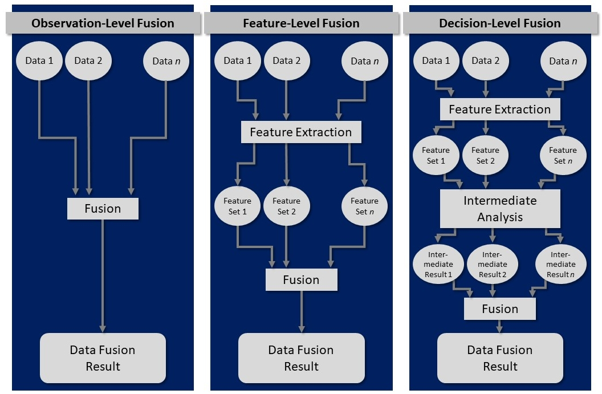
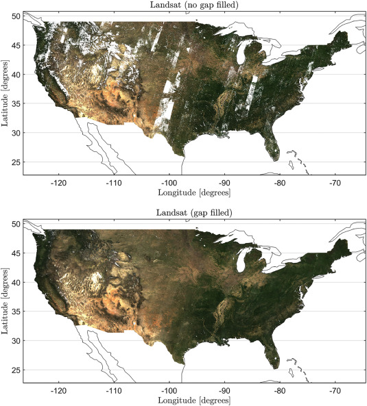
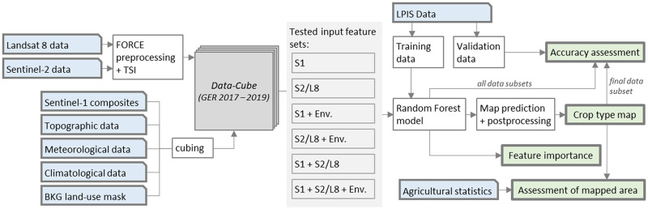
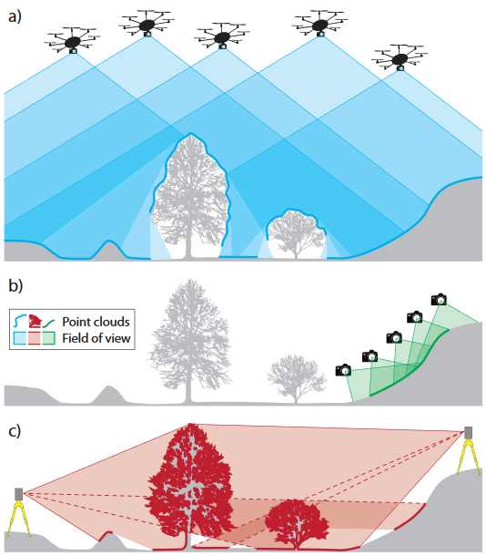
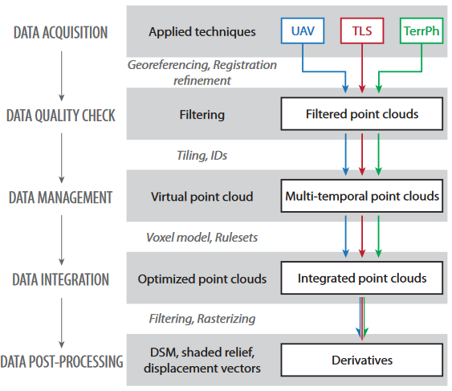
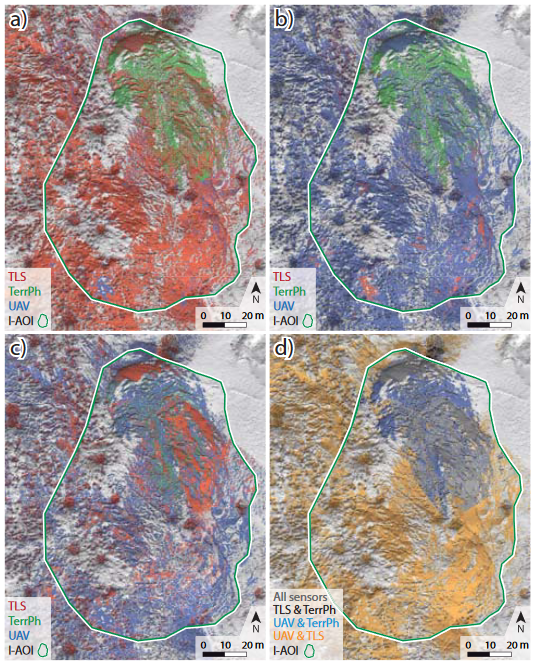
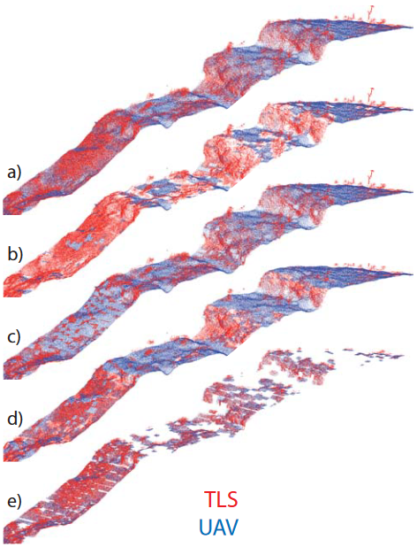
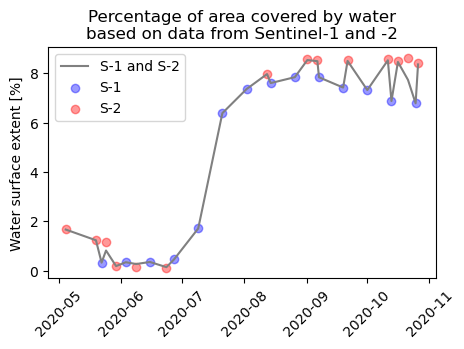
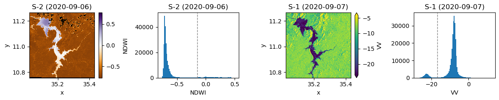
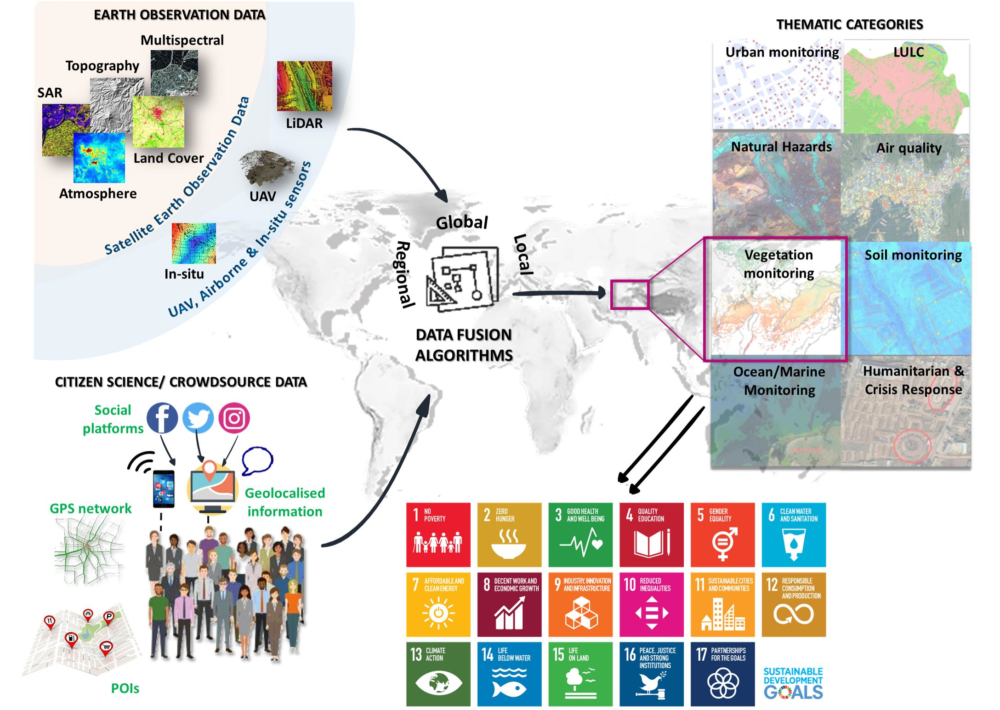

# Theme 5 - Spatio-temporal data fusion

## Introduction

In the first themes (mainly themes 1 and 2) you have learned about the characteristics of remote sensing time series (RSTS) from different sources. In each excercise or practical tutorial we have used data from a single source (mostly Sentinel-2). For capturing environmental dynamics, you may, however, also have identified some limitations related to the data characteristics, such as the native spatial, spectral or temporal resolution or data gaps due to cloud cover. This theme deals with possibilities of addressing such limitations by spatio-temporal data fusion.

**Objectives**

The objectives of the **theoretical part** of this theme are to

* Understand why spatio-temporal data fusion is needed for analysing human-environment interactions
* Learn about important theoretical concepts of data fusion and different approaches
* Overview some popular data type combinations and typical or innovative methods to fuse RSTS data
<!--* Get to know some use cases where the benefits of multi-modal data are leveraged by data fusion-->

In the **practical parts** of the theme, one possible way to combine multi-modal data for observing human-environment interactions is illustrated in a [tutorial Notebook](#tutorial-sentinel-1-2-surface-water-monitoring). There, you will learn how to jointly analyse Sentinel-1 and Sentinel-2 data for monitoring the extent of a water surface at the example of the Grand Ethiopian Rennaissance Dam (GERD). Afterwards there is an [excercise](#excercise-flood-mapping-with-sentinel-1-and-sentinel-2-data), where this approach is used as a basis for flood mapping.

## Theory and concepts for spatio-temporal fusion of remote sensing time series

### Motivation and general concept

In remote sensing applications there are very often high expectations on monitoring phenomena with challenging characteristics, such as

* Small magnitudes of change (compared to the noise in our data or its resolution)
* Small object size (Can you detect colonization by individual trees in 30-m pixels?)
* Rapid changes or fluctuations compared to the frequency of observations
* Slow, gradual changes or trends over multiple decades (which are usually not covered by RSTS from a single system)
* Similarity of different phenomena in a remotely sensed feature space (e.g., similar spectral change due to a construction site and due to a landslide)

In many cases analysis of RSTS from a single source just does not contain enough information, either in terms of detail (resolution in any domain) or in terms of extent (spatially or temporally, i.e., the area covered is too small or the time series is too short). Given such issues we often get disappointed when we see how even sophisticated RSTS methods really perform, as the results may contain too much spatial, temporal or semantic uncertainty to make any reliable interpretation and to ground our decisions on it. Sometimes only a combination of data from different systems provides the desired results.

Therefore, we can try to perform a **spatio-temporal fusion of data from different systems** (sensors and platforms) that are resolving different phenomena or aspects of them (spatially, spectrally, and temporally). As a broad definition for data fusion we may use the one proposed by [Steinberg et al. (1999)](https://doi.org/10.1117/12.341367):

*"Data fusion is the process of combining data to refine state estimates and predictions."*

Following [Schmitt and Zhu 2016](https://doi.org/10.1109/MGRS.2016.2561021), such a data fusion has typically one of the following two goals:

*"To estimate the state of a target or object from multiple sensors, if it is not possible to carry out the estimate from one sensor or data type alone"*
    
*"Improve the estimate of this target state by the exploitation of redundant and complementary information"*

That means, the general concept of data fusion is to jointly exploit the information contained in two or more datasets from different acquisition systems in order to produce a result that could not be obtained (at this spatial, temporal or semantic quality) from a single data source. While these aspects are applicable to any data fusion task, fusing RSTS is somewhat special: We must make sure that the datasets are in a common resolution and reference frame in space and time. This will often require a matching and co-registration step and a resampling ([Schmitt and Zhu 2016](https://doi.org/10.1109/MGRS.2016.2561021)), which is often a challenge on its own. At least in the geospatial domain, *data integration* is often used synonymously with *data fusion*.

### Data fusion at different levels

In the following, we will look at how this process of spatio-temporal data fusion can look like and which data is typically combined. The topic is quite large, but we try to give a concise overview of popular combinations and typical or innovative approaches to fuse spatio-temporal data. First of all, multi-modal data can be fused at different levels (see e.g. [Schmitt and Zhu 2016](https://doi.org/10.1109/MGRS.2016.2561021) or [Hu et al. 2021](https://doi.org/10.1016/j.ophoto.2021.100002)), and fusion approaches are often characterized as *low-, mid- or high-level fusion* or categorized into these three categories:

1. *Observation-level fusion* (a.k.a. *signal-level fusion*)
2. *Feature-level fusion*
3. *Decision-level fusion*

What does this mean? An *observation-level* (low-level) data fusion is typically performed for remote sensing time series from relatively similar systems (e.g., optical satellite sensors, such as Landsat 7/8/9, Sentinel-2, MODIS, …). A key requirement here is often, that an assimilation is done for the datasets (e.g., rescaling or normalization, a resampling, a spatial transformation to a common reference system and an accurate co-registration, ...; after their "normal" pre-processing (e.g., atmospheric correction etc.)). Then, the actual fusion is only a relatively simple combination of the values from multiple datasets (such as spectral reflectance in corresponding bands). The fused data can then be used for further analysis.

In a *feature-level* (mid-level) data fusion, the observations are not directly combined; instead they are used to derive features, such as vegetation indices (from multi-spectral imagery) or geometric/morphometric features (from raster DEMs or 3D point clouds, e.g., slope gradient, roughness, planarity, curvature, eigenvalue-based features, height above ground, etc.). These features are then fused, for example by a machine learning algorithm to predict a category (classification) or a target quantity (regression).

In a *decision-level* (high-level) data fusion, each dataset from a specific system is first used to produce a 'decision' (higher-level information, such as a classification or a modelled target quantity). In the actual fusion step, these decisions are then merged into spatially or temporally more complete product or they are aggregated (summarized) into an ensemble output (e.g. as the median value or the mode of multiple model outputs). Such higher-level fusion approaches are typically applied for datasets from more diverse sensors.

    

*Data fusion levels (modified from [Schmitt and Zhu 2016](https://doi.org/10.1109/MGRS.2016.2561021)).*

### Fusion approaches for remote sensing time series

With remote sensing time series (RSTS) data we have (at least) two general options for the fusion step (regardless of the fusion level):

1. We can either maintain individual data values (observations, features or decisons) from multiple systems and merge them into a denser time series (hopefully with less gaps in space and time), or
2. We aggregate values from multiple systems:

    * We may use observations (such as spectral band reflectance) or derived higher-level features (such as vegetation indices or morphometric/geometric features from raster DEMs or 3D point clouds (e.g., slope gradient, roughness or height above ground)) as input for a classifier.
    * At decision-level we may take an ensemble from multiple decisions (e.g. majority vote from multiple classifiers or median value from multiple regression models).

The ideal data fusion level depends on the analysis task and the characteristics of the datasets (also relative to each other).

## Popular data combinations for spatio-temporal fusion

### Data from different multispectral satellite systems

Image time series from different multispectral satellite systems are typically fused to optimize the spatial and/or temporal resolution, compared to a single source time series. Such RSTS types are among the most frequently combined, e.g.:

* Imagery from different Landsats make up an unprecedentedly long and consistent time series, which is used in numerous studies (mostly Landsat 4-9, including earlier ones is a bit more difficult). For detecting forest-cover change [Fortin et al. (2020)](https://doi.org/10.1016/j.rse.2019.111266) presented an interesting example of fusing a large and diverse set of data collections (back to Landsat 1) via post-classification data fusion (BULC approach and CART classifiers), including also a modification of the minimum mapping unit.
* Data from Landsat and Sentinel-2 satellites are similar in many aspects but they still require adjustments and homogenization for optimum fusion results (e.g., [Gan et al. 2021](https://doi.org/10.1109/JSTARS.2021.3069855)). For Landsat 8 OLI and Sentinel-2 MSI data, you can readily use the surface reflectance products of the [Harmonized Landsat and Sentinel-2 (HLS) archive](https://lpdaac.usgs.gov/news/release-of-harmonized-landsat-and-sentinel-2-hls-version-20/) at (Landsat-native) 30-m resolution ([Claverie et al. 2018](https://doi.org/10.1016/j.rse.2018.09.002), [Franch et al. 2019](https://doi.org/10.3390/rs11060632)).
* Sentinel-2 and MODIS, or (similarly) Landsat and MODIS (e.g. [Gevaert and García-Haro 2015](https://doi.org/10.1016/j.rse.2014.09.012), [Gao et al. 2017](https://doi.org/10.1016/j.rse.2016.11.004), [Moreno-Martínez et al. 2020](https://doi.org/10.1016/j.rse.2020.111901)), or Sentinel-2 and Sentinel-3 ([Wang and Atkinson 2018](https://doi.org/10.1016/j.rse.2017.10.046)) - These pairs are particularly attractive as they combine relatively high spatial and temporal resolutions, and suitable fusion methods are the subject of ongoing research.
* Planet (CubeSat), Landsat and MODIS data - While the Planet CubeSat system offers unprecedented spatio-temporal observing capacity, the relatively low radiometric quality and cross-sensor inconsistencies challenge its use. [Houborg and McCabe 2018](https://doi.org/10.1016/j.rse.2018.02.067) presented a multi-scale machine-learning method to radiometrically rectify multi-date CubeSat data into L8 consistent VNIR data.

    

*Monthly RGB composites (for April 2010) of original Landsat reflectance (top) and of the smoothed and gap filled reflectance estimates by the HIghly Scalable Temporal Adaptive Reflectance Fusion Model (HISTARFM) algorithm (bottom). HISTARFM combines multispectral images of different sensors (Landsat and MODIS) to reduce noise and produce monthly gap free high resolution (30 m) observations (figure by [Moreno-Martínez et al. 2020](https://doi.org/10.1016/j.rse.2020.111901) / [CC BY-NC-ND 4.0](http://creativecommons.org/licenses/by-nc-nd/4.0/)).*

### Data from active and passive sensing techniques

A major limitation of passively sensed imagery (e.g., from Sentinel-2) is that the objects of interest are frequently obstructed by clouds, resulting in many gaps in a time series. Actively sensed data (such as Sentinel-1 data acquired with synthetic aperture radar (SAR)) can reduce this problem and a fusion of optical and SAR data might provide you with a substantively improved temporal resolution and completeness. See the [E-TRAINEE tutorial below](#tutorial-sentinel-1-2-surface-water-monitoring), where you learn how to implement such an approach for monitoring the extent of a water surface.

Other approaches using such a combination of optical and SAR data have been presented in the context of agricultural monitoring, e.g., for grassland mowing detection ([De Vroey et al. 2022](https://doi.org/10.1016/j.rse.2022.113145)) and for crop types and crop sequences monitoring ([Blickensdörfer et al. 2022](https://doi.org/10.1016/j.rse.2021.112831)). 

*Example for a crop type monitoring workflow based on optical and SAR time series in combination with variables describing local and seasonal environmental conditions (figure by [Blickensdörfer et al. 2022](https://doi.org/10.1016/j.rse.2021.112831) / [CC BY 4.0](https://creativecommons.org/licenses/by/4.0/)).*

### 3D Point clouds from different systems

3D point clouds aacquired with different platforms and sensors may be combined to provide a more complete representation of a three-dimensional scene. This can be especially attractive if complex terrain, vegetation and unfavourable viewing angles degrade the geometric quality or leave gaps in a single source point cloud. Given a sufficiently good co-registration of multiple point clouds, a simple way to fuse them would be to merge them and keep the sum of all points. Other methods, however, might better combine the strengths of multiple systems.

In this context, [Zieher et al. (2018)](https://doi.org/10.5194/isprs-archives-XLII-2-1243-2018) presented an approach for fusing point clouds from terrestrial laser scanning (TLS), uncrewed aerial vehicle (UAV) photogrammetry and terrestrial photogrammetry (TerrPh), respectively, thereby combining the advantages of the different measurement principles for landslide monitoring. At the core of this approach is a rule-based selection of points that are kept, depending on local morphometric features computed from eigenvectors, elevation and the agreement of the individual point clouds. The rules tested in the study were:

1. ’Maximum geometric curvature’: data of the sensor with significantly higher geometric curvature are kept
2. ’Maximum planarity’: data of the sensor with significantly higher planarity are kept
3. ’Minimum elevation’: data of the sensor located significantly below the other sensors’ data are kept
4. ’Sensor correspondence’: only data within voxels are kept where two or more sensors are represented by at least 20 points

It was found that, depending on the subsequent analysis (e.g., extraction of morphological features such as edges or derivation of displacement vectors vs. topographic change detection) and the data quality requirements (outlier and error filtering vs. completeness of the scene), different rules are suitable for point cloud fusion. Details on these rules, their rationale, and the advantages and disadvantages found can be read in [Zieher et al. (2018)](https://doi.org/10.5194/isprs-archives-XLII-2-1243-2018). The suggested workflow was applied for two years and a subsequent bi-temporal displacement vector analysis but it could also be rolled out to more observations and, thereby, offers a systematic and reproducible method to conduct a monitoring over multiple years or at a higher frequency.

    
    &nbsp;
    

*Left: Data acquisition principles of the considered platforms/sensors including UAV (a), TerrPh (b) and TLS (c). Right: Rule-based point cloud fusion workflow (figures by [Zieher et al. 2018](https://doi.org/10.5194/isprs-archives-XLII-2-1243-2018)/ [CC BY 4.0](https://creativecommons.org/licenses/by/4.0/)).*

    
    &nbsp;
    

*Left: Planimetric view of the point cloud fusion results, with color-coded decisions for the applied fusion rules ’maximum geometric curvature’ (a), ’maximum planarity’ (b), ’minimum elevation’ (c), and ’sensor correspondence’ (d). Right: Oblique view of a subset of the point cloud fusion results (figures by [Zieher et al. 2018](https://doi.org/10.5194/isprs-archives-XLII-2-1243-2018)/ [CC BY 4.0](https://creativecommons.org/licenses/by/4.0/)).*

### Other combinations

In addition to the fusion approaches outlined above, there are plenty of studies where remote sensing time series are fused with other geospatial data (not remotely sensed or higher-level information from interpreted remote sensing data). Such datasets can be raster or vector data, including digital elevation models, climatological or meteorological data (e.g. [Stumpf et al. 2018](https://doi.org/10.1016/j.agee.2018.02.012) or [Blickensdörfer et al. 2022](https://doi.org/10.1016/j.rse.2021.112831)), or cadastral data and building footprints (e.g. [Uhl and Leyk 2020](https://doi.org/10.1016/j.rse.2019.05.016)). Such auxilliary datasets can be very helpful in combination with remote sensing time series, also if they are not multi-temporal.

## Self-evaluation quiz

<form name="quiz" action="" method="post" onsubmit="evaluate_quiz(); return false">

<!--Question 1-->
<label for="q_01">
1) The purpose of data fusion is typically ...
</label> 
<input type="checkbox" name="q_01">to reduce the data volume by condensing the information content. 
<input type="checkbox" name="q_01">to highlight differences in the results obtained with different platforms, sensors, and analysis methods. 
<input type="checkbox" name="q_01">to combine data from different sources and thereby reveal information that would not be clearly visible in single-source data. 

to combine data from different sources and thereby reveal information that would not be clearly visible in single-source data.

<output id="output_q_01"></output> 

<!--Question 2-->
<label for="q_02">
2) Data fusion can be performed at different levels, namely ...
</label> 
<input type="checkbox" name="q_02">observation level 
<input type="checkbox" name="q_02">signal level 
<input type="checkbox" name="q_02">feature level 
<input type="checkbox" name="q_02">decision level 

observation level&signal level&feature level&decision level

<output id="output_q_02"></output> 

<!--Question 3-->
<label for="q_03">
3) A fusion of remote sensing time series ...
</label> 
<input type="checkbox" name="q_03">may be used to improve the spatial and temporal resolution of an analysis. 
<input type="checkbox" name="q_03">is sometimes needed for long-term monitoring tasks where the observation period must be extended beyond the operating time of a single system. 
<input type="checkbox" name="q_03">is a typical strategy for streamlining the preprocessing steps. 

may be used to improve the spatial and temporal resolution of an analysis.&is sometimes needed for long-term monitoring tasks where the observation period must be extended beyond the operating time of a single system.

<output id="output_q_03"></output> 

<input type="submit" value="Submit" style="font-size:14pt"> 

<output id="output_overall">
</output>
</form>

## Tutorial: Sentinel-1/-2 surface water monitoring

If you are finished with the theoretical part of this theme, you are ready to try a data fusion approach to monitoring the extent of a water surface.

**Case study**

 With the [Grand Ethiopian Renaissance Dam (GERD)](https://en.wikipedia.org/wiki/Grand_Ethiopian_Renaissance_Dam) being constructed on the Blue Nile river in Ethiopia, filling of a large water reservoir for hydroelectric power production started in the year 2020. We will try to observe the surface water extent in the GERD reservoir area during the first filling phase in 2020. As the filling makes quite rapid progress during the rainy season (when clouds tend to obstruct the view for optical satellite sensors), we want to combine data from Sentinel-1 and -2 to keep track of the lake extent dynamics.

**Approach**

On the one hand, we will get a time series of Normalized Difference Water Index (NDWI) computed from Sentinel-2 optical bands in the Google Earth Engine (GEE). On the other hand, we will use a time series of Sentinel-1 Synthetic Aperture Radar (SAR) data from the GEE, more specifically this is C-band SAR Ground Range Detected (GRD) backscatter intensity. Learn more about SAR characteristics and Sentinel-1 (in general and in the GEE) [here](https://doi.org/10.1109/MGRS.2013.2248301) and [here](https://developers.google.com/earth-engine/tutorials/community/sar-basics).

We will not directly fuse data from S-1 and S-2, instead we first apply a simple classification of water and non-water and then fuse the classified water time series. As water contrasts well with other surface types in both S-1 and S-2 features and the changes taking place are large, we can expect such a relatively simple approach to work reasonably well (but let's see ...). The goal is to get something like the figure below that informs us about the progress of reservoir filling with time.

**Tutorial Notebook**

You can find an interactive tutorial where you can try the approach in [this Notebook](./T5_water_surface_data_fusion.ipynb). There, you can learn how to achieve the following outputs:

    

*Percentage of area covered by water based on data from Sentinel-1 and -2.*

    

*Water surface classification based on Sentinel-2 and -1, respectively, needs different (user-defined) classification thresholds, here shown for one scene each.*

    

*Fused water surface time series from the S-2/-1 classification with water pixels shown in blue and non-water pixels shown in light brown. The white NoData pixels results from (masked) clouds in S-2 imagery.*

## Excercise: Flood mapping with Sentinel-1 and Sentinel-2 data

The Sentinel-1/-2 surface water monitoring approach presented in the Notebook above cannot only be used for monitoring the progress of resevoir filling, it could also be used for mapping the inundated areas in a river flood event. This might be important for authorities, humanitarian aid organizations etc. who need rapid estimates of the affected areas and the damage. Do a short internet search on possible use cases for flood mapping. Maybe a major flooding event has been reported on the media recently? Select an event according to your interest and choose area and time period accordingly (a few weeks should be enough).

* Try to replicate the approach from the tutorial Notebook for this use case (with the small adaptations, e.g. it probably makes sense to download data at higher spatial resolution but for a shorter time period).
* Briefly discuss the data fusion: Did it work well? Any obvious problems? Does the fusion of S-1 and S-2 data improve the analysis compared to using a single data set?
* Extract only the areas flooded by the event, beyond the "normal" river area. (*Hint*: Use a *pre-flood water map* as a baseline and intersect this with a *peak flood water map*.)
* Make a qualitative assessment of the inundation (describe regarding space and time) and its likely consequences (settlements, infrastructure and agricultural area affected?). (*Hint*: For such an interpretation you will need at least some background layer ...)
* Beyond this practical excercise, think about other geospatial data: What else could be combined with the satellite data and what kind of analyses could be useful then? Briefly discuss this! <!--DTM, landuse, buildings, roads and other infrastructure, population data, ...-->

## More practical material

Another interesting excercise is provided in [this tutorial](https://worldbank.github.io/OpenNightLights/tutorials/mod6_0_overview.html) by the Worldbank. It presents a data fusion approach for assessing change in built-up land cover in Nepal, involving

* Nighttime lights (monthly composites) data from the Visible Infrared Imaging Radiometer Suite (VIIRS) Day-Night Band (DNB)
* Sentinel-2 daytime visible band images (monthly composites)
* Global Human Settlement Layer for training data

## Further reading

To learn more about recent developments and trends in spatio-temporal data fusion the following articles are recommended:

Ghamisi, P., Rasti, B., Yokoya, N., Wang, Q., Hofle, B., Bruzzone, L., ... & Benediktsson, J. A. (2019). Multisource and multitemporal data fusion in remote sensing: A comprehensive review of the state of the art. IEEE Geoscience and Remote Sensing Magazine, 7(1), 6-39. https://doi.org/10.1109/MGRS.2018.2890023

Karagiannopoulou, A., Tsertou, A., Tsimiklis, G., & Amditis, A. (2022). Data fusion in earth observation and the role of citizen as a sensor: A scoping review of applications, methods and future trends. Remote Sensing, 14(5), 1263. https://doi.org/10.3390/rs14051263

Li, J., Hong, D., Gao, L., Yao, J., Zheng, K., Zhang, B., & Chanussot, J. (2022). Deep learning in multimodal remote sensing data fusion: A comprehensive review. International Journal of Applied Earth Observation and Geoinformation, 112, 102926. https://doi.org/10.1016/j.jag.2022.102926

    

*Data Fusion in Earth Observation and Citicen Science (figure by [Karagiannopoulou et al. 2022](https://doi.org/10.3390/rs14051263) / [CC BY 4.0](https://creativecommons.org/licenses/by/4.0/)).*

## References (cited above)

Blickensdörfer, L., Schwieder, M., Pflugmacher, D., Nendel, C., Erasmi, S., & Hostert, P. (2022). Mapping of crop types and crop sequences with combined time series of Sentinel-1, Sentinel-2 and Landsat 8 data for Germany. Remote Sensing of Environment, 269, 112831. https://doi.org/10.1016/j.rse.2021.112831

Franch, B., Vermote, E., Skakun, S., Roger, J. C., Masek, J., Ju, J., ... & Santamaria-Artigas, A. (2019). A method for Landsat and Sentinel 2 (HLS) BRDF normalization. Remote Sensing, 11(6), 632. https://doi.org/10.3390/rs11060632

De Vroey, M., de Vendictis, L., Zavagli, M., Bontemps, S., Heymans, D., Radoux, J., ... & Defourny, P. (2022). Mowing detection using Sentinel-1 and Sentinel-2 time series for large scale grassland monitoring. Remote Sensing of Environment, 280, 113145. https://doi.org/10.1016/j.rse.2022.113145

Gan, W., Albanwan, H., & Qin, R. (2021). Radiometric normalization of multitemporal Landsat and Sentinel-2 images using a reference MODIS product through spatiotemporal filtering. IEEE Journal of Selected Topics in Applied Earth Observations and Remote Sensing, 14, 4000-4013. https://doi.org/10.1109/JSTARS.2021.3069855

Li, J., Hong, D., Gao, L., Yao, J., Zheng, K., Zhang, B., & Chanussot, J. (2022). Deep learning in multimodal remote sensing data fusion: A comprehensive review. International Journal of Applied Earth Observation and Geoinformation, 112, 102926. https://doi.org/10.1016/j.jag.2022.102926

Moreno-Martínez, Á., Izquierdo-Verdiguier, E., Maneta, M. P., Camps-Valls, G., Robinson, N., Muñoz-Marí, J., ... & Running, S. W. (2020). Multispectral high resolution sensor fusion for smoothing and gap-filling in the cloud. Remote Sensing of Environment, 247, 111901. https://doi.org/10.1016/j.rse.2020.111901

Schmitt, M., & Zhu, X. X. (2016). Data fusion and remote sensing: An ever-growing relationship. IEEE Geoscience and Remote Sensing Magazine, 4(4), 6-23. https://doi.org/10.1109/MGRS.2016.2561021

Steinberg, A. N., Bowman, C. L., & White, F. E. (1999). Revisions to the JDL data fusion model. In Sensor fusion: Architectures, algorithms, and applications III (Vol. 3719, pp. 430-441). SPIE. https://doi.org/10.1117/12.341367, https://apps.dtic.mil/sti/pdfs/ADA391479.pdf

Uhl, J. H., & Leyk, S. (2020). Towards a novel backdating strategy for creating built-up land time series data using contemporary spatial constraints. Remote Sensing of Environment, 238, 111197. https://doi.org/10.1016/j.rse.2019.05.016