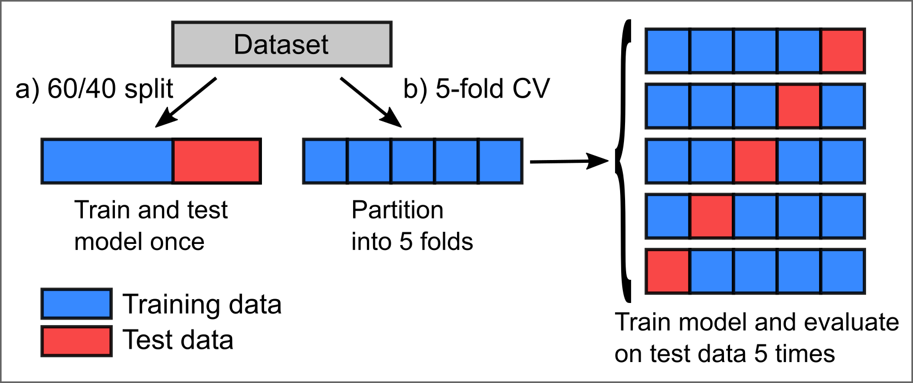
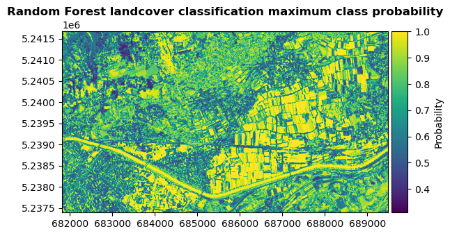
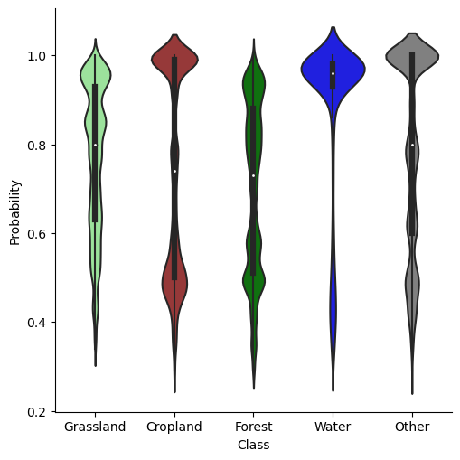
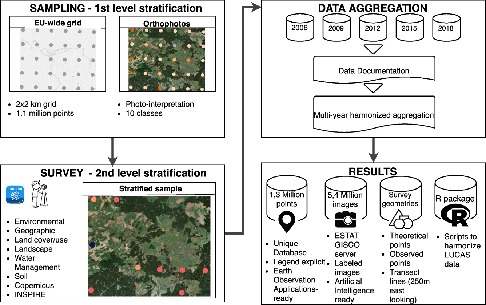
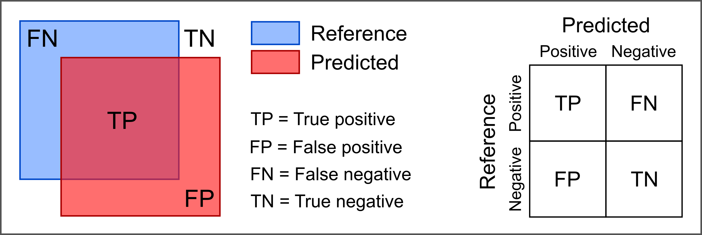
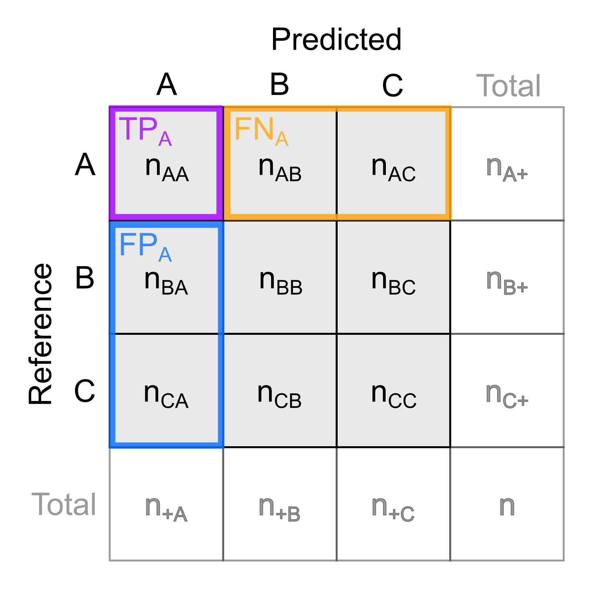
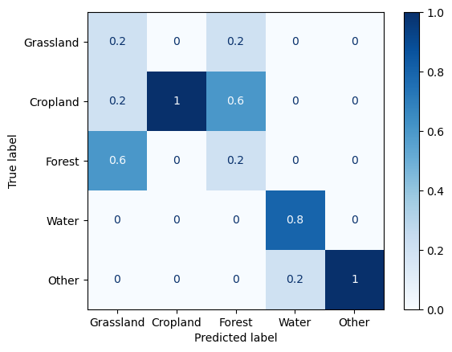

# Theme 6 - Reference data, validation and accuracy assessment

## Introduction

As we have seen in the previous themes of this module, remote sensing time series analysis is a powerful tool for monitoring changes in the environment over time. When we ground our interpretations and decisions in such an analysis, however, it is essential to validate the analysis results and ensure their reliability. In this theme we will have a look at how this can be done and what data we might use as a reference.

**Objectives**

The objective of this theme is to understand important principles of validation in remote sensing analyses. You will get an idea of potential reference data sources and learn which metrics are appropriate for assessing the accuracy of regressions, classifications and change detection. A particular focus is on critical issues in acquiring and using reference data for time series analysis in remote sensing. Finally, you will gain practical experience with assessing the accuracy of a classification in an excercise.


## Principles of validation and accuracy assessment in remote sensing

### Aims of validation and accuracy assessment

A rigorous validation and accuracy assessment should be a key element of any remote sensing analysis as it serves to

* Judge the performance of a method: We want to know how good it works, i.e. how accurate it is.
* Learn in which situations a method tends to deliver reliable results and in which situations uncertainty remains high (e.g. by assessing the spatial or temporal distribution of errors or uncertainty).
* Identify strengths and weaknesses of a method for a certain application (e.g. ability to predict a certain class, effects of data acquisition scenarios and error propagation).
* Help with improving the method and/or the input data it uses.
* Make it possible to compare different methods subjectively and by scientific standards (thereby helping ourselves or others to choose the most suitable method for applied use).
* Evaluate a method's potential for transferability and scalability (to some degree).
* Provide you and others with confidence (or scepticism) for any interpretation, conclusions and decisions based on the data analysis. An accuracy assessment is needed to judge if and how far such further steps make sense.

### Methodological principles

**'External' accuracy estimates**
<!-- Do you agree with this separation of 'external' and 'internal' accuracy estimates? -->

Validation and accuracy analysis in remote sensing is typically based on a comparison of analysis results against *reference data*. Reference data are measurements or observations of the target variable collected *in-situ* (i.e. directly at the site) or through remote sensing. In many cases *reference data* serves two different purposes:

* *Model building* (often by training a supervised classifier or regression model through statistical learning; see theme 3)
* *Validation and accuracy analysis* (i.e. checking if the information obtained via our analysis is correct (to a required degree) and quantify the errors of this analysis)

In this theme, we focus on the second purpose, and hence can (more specifically) refer to *validation data*. Typically, the validation data covers only a fraction of the space (and time) under investigation but is of higher quality (more accurate) than the classification or regression result. As the validation data and the calculation of accuracy metrics is separated from the classification or regression part (main analysis), we refer to the outcomes of this approach as 'external' accuracy estimates.

Some key principles of validation and accuracy analysis are

* Transparency: Clearly describe the methods and data used.
* Independence of validation data
    * Use data for validation that has not been used for building your model (e.g. for training a machine learning classifier):
        * Often an initial reference data set is split into a training data set and a validation (or 'test') data set. Then, the training data is used for building the model (*training*), while the validation data is excluded from this (put aside) and subsequently used for accuracy assessment.
        * Such a split can be random with a defined ratio (e.g., 70% of the data for training, 30% of the data for validation), or by spatial subsets of your study area (i.e. use one part of the area for training and the other one for validation).
        * Looking not only at the (in-sample) *training error* but also at the (out-of-sample) *test error* is important to evaluate how good the model generalizes, i.e. avoids *overfitting* (to the training data). In most cases we want a model that does not only fit well to the data it was trained on but also accurately predicts cases not seen during training.
        * Using only one hold-out test set from a single (random) split is straightforward. However, the resulting accuracy estimate lacks robustness because, if the proceedure is repeated with different random splits, the variance of estimated accuracy is large. More robust estimates and confidence intervals (or variance) for classification accuracy can be obtained by resampling frameworks, typically using bootstrapping or cross-validation, into the classification and accuracy assessment (further reading in [Module 2](../../module2/04_multitemporal_classification/04_multitemporal_classification.md#results-validation-and-accuracy-assesment) and in [Lyons et al. 2018](https://doi.org/10.1016/j.rse.2018.02.026)).
        * Cross-validation (CV) - In the basic version, *k*-fold CV, the training set is split into *k* smaller sets of data (called *folds*), and for each fold a model is trained on the other (*k* - 1) folds and then validated on the current fold.
        * Cross validation can be used to assess the performance of a (final) model, but also for tuning hyperparameters of a machine learning model
        * If you have multi-temporal reference data, you can also make a temporal split (e.g. use one year for training, the other years for validation or set up a temporal cross-validation with years as folds).
    * As an alternative to splitting the initial reference dataset into training data and validation data, you might collect new validation data (in a separate campaign after collecting training data) but beware of a potential operator bias if you already know the predicted results at this time.
* Reporting: It is often advisable to present your accuracy assessment in different ways, graphically and with different statistical measures (accuracy metrics) for summary. This allows you and others to judge the results critically and from different perspectives. Commonly used accuracy metrics are detailed below.

<center>


<i>Two possibilities of (randomly) splitting a dataset for training and validation (testing). a) Single split (here as a 60/40 split). b) Cross-validation (CV) with k-folds (here with k = 5) and averaging the output of k runs for modelling and validation.</i>
</center>


**'Internal' accuracy estimates**

'Internal' accuracy estimates, in contrast, are indicators of reliability computed without the use of external validation data. Instead, they are based on knowledge and understanding of the data observation and information extraction processes, on certain assumptions made, and on statistics. Examples are

* **Probability** of a classification based on ensemble classifiers
    * Ensemble models can be constructed by combining multiple components (such as trees in a Random Forest, a model used in different variations (e.g. with different thresholds), or a set of models with different approaches).
    * Outputs of ensemble components are usually aggregated (i) into a 'majority vote', i.e. the most frequently predicted class per predicted unit (pixel, point, or segment), or (ii) by averaging the components' probabilistic predictions.
    * Additionally, the fraction of components predicting this class can be reported as relative probability of the class being the best prediction (Note that 'best' prediction and 'probability' must be seen in the context of model setups tested (algorithm, parameters, parameters' range, features, training data, defined classes).
* An **error budget** of measurements can be constructed from known or estimated error components as an estimate for analysis uncertainty. It is also important to consider how the error components of single epochs can propagate into multitemporal derivatives (e.g., in change analysis; see [Module 3](../../module3/03_3d_change_analysis/03_3d_change_analysis.md#uncertainty-in-change-analysis))
* **Level-of-detection** and confidence intervals for topographic change
    * Topographic change detection studies often propagate the uncertainty (error budget) of multitemporal input data (3D point clouds or raster digital terrain models (DTMs)) and potentially other parameters (such as local surface roughness) into a global or spatially varying *level-of-detection (LOD)* at a defined confidence interval (e.g. [Lane et al. 2003](https://doi.org/10.1002/esp.483), [Wheaton et al. 2010](https://doi.org/10.1002/esp.1886), [Lague et al. 2013](https://doi.org/10.1016/j.isprsjprs.2013.04.009)). This LOD indicates the minimum magnitude of change that can be detected; smaller changes are then excluded from further analysis as they could also result from measurement errors.
    * For 3D point clouds from topographic laser scanning, different error sources can be considered to determine such an LOD (including registration errors, local surface roughness, and 3D positional errors per point as a function of the scanning geometry; see e.g. [Mayr et al. 2020](https://doi.org/10.5194/isprs-annals-V-2-2020-765-2020)).
    * For terrestrial laser scanning time series (4D point clouds) the temporal resolution can additionally be considered for investigating the LOD ([Kromer et al. 2017](https://doi.org/10.5194/esurf-5-293-2017), [Anders et al. 2019](https://doi.org/10.5194/isprs-annals-IV-2-W5-317-2019)). <!-- How? -->
* Learn more about uncertainty in 3D change analysis and how it can be quantified in [Module 3](../../module3/03_3d_change_analysis/03_3d_change_analysis.md#uncertainty-in-change-analysis)
* Learn more about uncertainty of satellite data products in [Module 2](../../module2/02_temporal_information/02_temporal_information.md#uncertainty-of-satellite-time-series-data-products)

<center>



<i>Left: Example for a classification probability raster, derived for the landcover map produced in theme 3 by Random Forest classification based on spectral-temporal metrics. For every pixel, the map shows the average probability of all trees for the most likely class (i.e. the majority vote of the ensemble). Thereby, it indicates where the classifier is certain about a predicted class and where it is less certain. Right: Distribution of classification probabilities per landcover class.</i>
</center>


## Freely available reference data sets

When looking for reference data, you can search public archives hosted by governmental authorities. These increasingly open the access to regional and national geodata acquired covering a range of different topics. In addition, you might find reference data for your (satellite-based) analysis in collections and platforms of a range of (international) initiatives dedicated to collecting, harmonizing and provisioning of reference data (see also [Module 2](../../module2/04_multitemporal_classification/04_multitemporal_classification.md#multitemporal-reference-dataset)). Examples are

* The [Radiant MLHub](https://mlhub.earth/) by the Radiant Earth Foundation allows anyone to access, store, register, and share open training datasets and models for machine learning in Earth observation. The [datasets](https://mlhub.earth/datasets) cover applications ranging from crops, wildfire, flood, building footprints, and tropical storms to land cover, and they can be useful also for validation of your models (not only training) if you split the data appropriately.
* [World Cereal](https://worldcereal-rdm.geo-wiki.org/) - The WorldCereal Reference Data Module (RDM) is a reference data store containing labelled data which can be used for crop and irrigation related model training and validation (with varying accessibility and licences of datasets).
* Land Use/Cover Area frame Survey ([LUCAS](https://ec.europa.eu/eurostat/web/lucas)) - Since 2006, the LUCAS initiative has collected tri-annual in-situ observations of land cover, land use and environmental parameters along with photographs at hundreds of thousands of unique locations across the European Union. The datasets have been used for supervised landcover classification (e.g. [Pflugmacher et al. 2019](https://doi.org/10.1016/j.rse.2018.12.001), [Weigand et al. 2020](https://doi.org/10.1016/j.jag.2020.102065)) and harmonized into a consolidated, openly accessible [database](https://doi.org/10.2905/f85907ae-d123-471f-a44a-8cca993485a2) by [d'Andrimont et al. (2020)](https://doi.org/10.1038/s41597-020-00675-z).

<center>


<i>Schematic overview of the LUCAS initiative and harmonisation of datasets (figure by [d'Andrimont et al. 2020](https://doi.org/10.1038/s41597-020-00675-z)/ [CC BY 4.0](http://creativecommons.org/licenses/by/4.0/)).</i>
</center>


## Acquiring reference data

### Acquisition of reference data in the field

One possibility of getting reference data is visiting sample locations in the field (*in-situ*) and

* making (visual) observations and categorizing these into discrete semantic categories (such as landcover, landform or status of the land surface) or into categorized values of a continuous variable (e.g. plant species cover values in percent in percent of a certain area)
* performing measurements of a (bio-)physical variable (such as temperature, snow depth, vegetation height, surface elevation, ...) with appropriate measurement devices
* collecting samples of soil, rock, plants etc. for subsequent analysis in the lab (if the properties of interest cannot be estimated in the field)

A wide variety of measurement devices is used for such purposes, ranging from simple tools like a ruler to more complex instruments like field spectrometers. For time series observations, sensors connected to a data logger or a data transmission system can be used.

Thorough planning is crucial to any field data acquisition campaign, so include this planning stage in your time schedule.
To avoid observer/surveyor bias, data at each sample location should be acquired by a standardized procedure defined in a manual before the field campaign. In the planning stage of a field campaign consider also

* safety-related issues (e.g. when working in areas with rough terrain or extreme climate)
* privacy-related issues (e.g. permission to collect and publish data)
* accessibility (permission, time needed, terrain, physical ability and hazard management)

A key issue of field observations and measurements is the recording of their position, which can often be achieved by (differentially corrected) Global Navigation Satellite System (GNSSS) measurements. To facilitate re-locating the exact locations for repeat measurements, consider marking them physically (in addition to recording the GNSS position). In general, a thorough documentation following a pre-designed protocol is important, and (geotagged) photographs of the sample site are recommended. Often, a mobile GIS (e.g. [QField](https://qfield.org/), a mobile app version of QGIS) is an ideal tool for these tasks.

<center>


<i>QField app on a smartphone used for the collection of observations and metadata and for navigation to sample locations.</i>
</center>
<!--Any nice images for reference data collection? -->


### Remotely sensed reference data

Furthermore, reference data is frequently collected through remote sensing:

* This typically involves input data of higher (spatial) resolution and/or alternative analysis methods with presumably superior accuracy (e.g. visual interpretation and manual mapping). Module 1 Theme 3 of this course includes a tutorial where the landcover data was collected by placing and labelling points in an aerial orthophoto (0.2 m resolution), and this data was used for training a classifier on Sentinel-2 data (20 m resolution). Similarly, we could use a part of this data or new data acquired in the same way for validation of the classification results.
* When we generate reference data by visual interpretation and manual labelling, we have different options:
    * Labelling entire scenes
    * Labelling individual points or pixels
    * Labelling groups of points or pixels
        * Contiguous patches that are homogeneous according to certain features and labelled with one label per patch
            * Derived by segmentation (e.g [Kollert et al. 2021](https://doi.org/10.1016/j.jag.2020.102208))
            * Delineated by visual interpretation
        * Contiguous patches defined by a (random) sampling strategy and labelled on a per pixel basis (e.g. random points with a buffer or rectangular image chips)
* Critically judge the quality of your reference data: Depending on the target classes and their visual separability in the remote sensing data interpreted to create a reference, such an approach may be quite accurate or not.


**Tools for reference data acquisition and for validation**

Various tools have been developed to improve the efficiency of reference data collection based on remote sensing data and for using such data for validation, e.g.:

* [TimeSync](https://timesync.forestry.oregonstate.edu/) - A tool for human interpretation of Landsat time series. It is made to calibrate and validate a temporal segmentation of Landsat time series and a trajectory-based detection of land change [Cohen et al. (2010)](https://doi.org/10.1016/j.rse.2010.07.010).
* [Computer Vision Annotation Tool (CVAT)](https://opencv.github.io/cvat/docs/) - A free, online, interactive video and image annotation tool for computer vision.
* R tool for reference data collection presented in [Exercise 2 in Module 2](../../module2/02_temporal_information/02_temporal_information_exercise.md)
* Standard GIS packages (and plugins) contain various tools for accuracy assessment of raster-based remote sensing classifications
    * Digitizing tools to create points or polygons as reference (and optionally rasterize them)
    * Tools for placing sample points randomly or on a regular grid
    * QGIS [AcATaMa](https://smbyc.github.io/AcATaMa/) plugin ([Llano 2022](https://github.com/SMByC/AcATaMa)) - A comprehensive plugin for accuracy assessment of thematic maps with many options for sample design, response design  following key recommendations in the scientific literature (e.g. in [Stehman and Foody 2019](https://doi.org/10.1016/j.rse.2019.05.018))
    * QGIS Semi-automatic Classification Plugin (SCP) - Amongst many other tools for satellite remote sensing, this plugin by [Congedo (2021)](https://doi.org/10.21105/joss.03172) contains a tool for accuracy assesssment, see the [documentation](https://semiautomaticclassificationmanual.readthedocs.io/it/latest/accuracyTab.html) and this [tutorial](https://fromgistors.blogspot.com/2019/09/Accuracy-Assessment-of-Land-Cover-Classification.html).
    * GRASS GIS features the [r.kappa](https://grass.osgeo.org/grass82/manuals/r.kappa.html) module for creating a confusion matrix and deriving accuracy metrics.
    * SAGA GIS has two tools for accuracy assessment of a classification raster: The tool [*Confusion Matrix (Polygons / Grid)*](https://saga-gis.sourceforge.io/saga_tool_doc/9.0.1/imagery_classification_6.html)) taking the reference data as polygons, and the tool [*Confusion Matrix (Two Grids)*](https://saga-gis.sourceforge.io/saga_tool_doc/9.0.1/imagery_classification_2.html) taking the reference data as a raster.


### Sampling strategies

<!-- Add references and a figure to illustrate the sampling strategies.-->

When collecting your own reference data, where do you sample? I.e. which locations do you choose for measurements, to collect sample material for analysis in the lab, or for placing manually labelled points in images?

In general we should aim for samples that are representative for the problem at hand and for the study area where the analysis is applied. Therefore, try to cover the variability of your target variable (if known) or the variables (features) used for analysis as good as possible with a given number of samples. As a guideline, 50 sample units (locations) per thematic class (or more for complex scenarios, i.e. with large areas or many classes) are recommended by [Congalton (2015)](https://doi.org/10.1201/b19294).

Popular sampling strategies include:

* User defined sampling - A simple approach is to subjectively select locations to sample (not recommended in general).
* Sampling on a regular grid - Sample points are placed in regular spatial intervals to cover the study area homogeneously
* Random sampling  - A defined number of samples is placed in the study area.
* Stratified (random) sampling - Prior to sampling, the study area is divided into sub-units (strata), where samples are then placed (randomly). A stratification can be achieved by categories of a single variable (e.g. elevation bands or categories of an available land cover map) or by clustering several variables (clusters then used as strata). If you already have a (pre-)classification of your data and need validation data (no training data), you could also use the target classes as strata.
* A stratified sampling can be designed to either place a fixed, equal number of samples per stratum or a variable number of samples per stratum. The latter option typically defines the number of samples as proportionate to the stratum size.
* Sometimes you have to constrain the area for sampling by auxiliary variables (e.g. accessibility of terrain, distance from road network, ...).

For a multitemporal analysis consider if you can collect multitemporal samples and if this is needed. Then, an additional question is how to distribute the samples in time. Do we place the samples randomly in time or with a defined number of samples per fixed time interval?


### Citizen science

Collecting reference data in the field or by manually labelling (remote sensing) imagery is often relatively easy for humans. Depending on the specific task, even untrained persons can do this quite reliably. However, labelling a large amount of digital samples or visiting a lot of sampling locations spread across large areas is costly in terms of time and labour.

TO improve the efficiency of data collection (amongst others), *crowdsourcing* and digital *citizen science* approaches have emerged ([Kullenberg and Kasperowski 2016](https://doi.org/10.1371/journal.pone.0147152), [See et al. 2016](https://doi.org/10.3390/ijgi5050055), [Liu et al. 2021](https://doi.org/10.1007/978-3-030-58278-4_22)), and are also used in remote sensing ([Dell'Acqua 2015](https://www.taylorfrancis.com/chapters/edit/10.1201/b19294-41/crowdsourcing-remote-sensing-combining-two-views-planet-earth-fabio-dell-acqua?context=ubx&refId=d573b2ee-1333-4969-8e86-98863fca6802), [Fritz et al. 2017a](https://doi.org/10.3390/rs9040357), [Purdy et al. 2023](https://doi.org/10.1016/j.jag.2022.103148)). The idea is to spread relatively simple, yet repetitive tasks over a large group of volunteers, thereby gathering a large set of urgently needed reference data. These volunteers usually perform well defined tasks, like image labelling or making and reporting geolocalized field observations, typically using smartphones and/or dedicated web applications. Motivating a sufficent number of people for engaging in such a citizen science initiative is a key issue. Therefore, the usefulness and value of the collected datasets for a higher-level goal (serving sustainable development, environmental protection, food security, solving socio-economic problems, contributing to the progress of basic science) must be well communicated. Moreover, some citizen science apps are designed like a game (e.g. with points earned for the tasks and participant rankings being listed) to let participants have fun while performing the task. Citizen Science is also seen as contributing to Open Science aims and principles ([Wagenknecht et al. 2021](https://doi.org/10.1162/dint_a_00085)).

Examples for citizen science projects and platforms in remote sensing are

* [Zooniverse](https://www.zooniverse.org/) - A large platform hosting many citizen science projects from various domains, such as [Beavers from Space](https://www.zooniverse.org/projects/ab-beavers/beavers-from-space) or [ForestEyes](https://fafaria.wixsite.com/fabiofaria/amazon-deforestation) ([Dallacqua et al. 2020](https://doi.org/10.1109/LGRS.2020.3032098)).
* [LandSense](https://landsense.eu/About) - A project that aims to bring together various citizen science data sets on land use and land cover.
* [Geo-Wiki](https://www.geo-wiki.org/) ([Fritz et al. 2012](https://doi.org/10.1016/j.envsoft.2011.11.015), [Fritz et al. 2017b](https://doi.org/10.1038/sdata.2017.75))
* [LACO-Wiki](https://www.laco-wiki.net/en/Welcome), 'The Land Cover Validation Platform' ([See et al. 2015](https://doi.org/10.5194/isprsannals-II-3-W5-167-2015)).
* [FotoQuest Go](http://fotoquest-go.org/en/)
* [MountaiNow](https://www.mountainow.net/en/community/) - A platform for sharing mountain observations (e.g. in the context of glacier and permafrost monitoring).
* [IceWatch](https://icewatch.met.no/) - A program collecting sea ice observations.
* [eu-citizen.science](https://eu-citizen.science/) - A platform that aims to become the central knowledge-sharing hub for citizen science in Europe.


## Accuracy metrics

Depending on the type of data that you compare against reference data, different sets of accuracy metrics can be used. We will first look at ways to assess categorical data (discrete values or labels of a classification), then at measures for assessing continuous variables measured by a sensor or predicted by a model with one or more input variables.

### Classification

**The confusion matrix**

A basic, yet quite useful way of presenting the output of a classification model (*predicted labels*) compared with values at validation samples (*reference labels*) is the *confusion matrix* (also known as *cross-tabulation matrix* or *error matrix*). This is a cross-tabulation of how many classification units (pixels, points or polygons) were predicted for a certain class vs. how many actually belong to this class (according to the reference data). The matrix allows us to see if a classifier confuses two classes (hence the name), i.e. mislabels one class as another.

The following figure illustrates this for a binary classification. The two classes ('positive' and 'negative') could be, for example, 'snow' and 'no snow'.

<center>


<i>Confusion matrix for binary classification.</i>
</center>

Here, we display the predicted values along the rows, the reference values along the columns. Note, however, that the matrix may be transposed (i.e. the axes swapped), as there is no uniform convention for this layout; so check the documentation of the software package you are using.


**Classification metrics**

The confusion matrix itself is already very informative, especially if colourized as a heatmap (i.e. colorized by the (relative) number of samples in a matrix cell). Moreover, it forms the basis of different accuracy metrics , e.g.:

* *Overall accuracy*: The fraction of correctly classified samples (TP + TN) out of all reference samples, a value ranging from 0 to 1 (or from 0% to 100%).

* *Precision* (a.k.a. *user's accuracy* or *correctness*)

        precision = TP / TP + FP

* *Recall* (a.k.a. *producers's accuracy* or *completeness* or *sensitivity*)

        recall = TP / TP + FN

* [*F1 score*](https://en.wikipedia.org/wiki/F-score), the harmonic mean of precision and recall (equal contributions of the two measures)

        F1 score = 2 * (precision * recall) / (precision + recall)

    As the different types of mis-classification are not for all applications equally important, measures with different a weighting of precision and recall have been proposed (see e.g. [here](https://en.wikipedia.org/wiki/Precision_and_recall#F-measure)).

* *Error of omission* and *error of commission*

        error of omission = 1 - recall

        error of commission = 1 - precision

To understand the performance of a model, it is often a good idea to look at a few different metrics as well as the confusion matrix itself. The 'Kappa' metric, despite being widely used to assess remote sensing classifications, is critized as providing redundant or misleading information for practical decision making and is, therefore, no longer recommended ([Pontius and Millones 2011](https://doi.org/10.1080/01431161.2011.552923), [Foody 2020](https://doi.org/10.1016/j.rse.2019.111630)).

Most metrics range from 0 to 1, with 1 being the best rating. We recommend to look up details on interpretation as well as advantages and drawbacks of the metrics or options to calculate with specific settings (especially in the multilabel case), e.g. in [Olson and Delen 2008](https://doi.org/10.1007/978-3-540-76917-0), [Congalton and Green 2019](https://doi.org/10.1201/9780429052729), [Stehman et al. 2019](https://doi.org/10.1016/j.rse.2019.05.018), [Hand et al. 2012](https://doi.org/10.1111/j.1751-5823.2012.00183.x). Also the documentation of software packages often provides details on the implementation and advice on the use of available accuracy metrics, e.g. in Python [scikit-learn](https://scikit-learn.org/stable/modules/model_evaluation.html).


**Confusion matrix with more than two categories**

The next figure illustrates a confusion matrix for more than two classes. If all samples are predicted correctly, they are aligned along the diagonal (top left to lower right). Here, we also sum up the number of samples per class.

In such multiclass scenarios, accuracy metrics can be calculated for each class separately or for all classes. Class-specific accuracy metrics provide a more differentiated view and often a better identification of potential problems with a specific class. To summarize the performance for all classes, a metric can be averaged over all classes, with different possibilities how this is done in case of imbalanced datasets (weighting etc.; further reading in the [scikit-learn documentation](https://scikit-learn.org/stable/modules/model_evaluation.html#from-binary-to-multiclass-and-multilabel)).

<p align="center">


</p>

<i>Left: Schematic confusion matrix for multiple classes (classes A, B, and C). Right: Confusion matrix for the landcover map produced in the classification tutorial of theme 3. Here, the confusion matrix is normalized over the predicted conditions, i.e. the displayed values indicate the fraction of predictions per class being correct or misclassified as a certain other class.</i>

In the matrix above, *n<sub>ij</sub>* is the number of samples labelled as class *i* in the reference and predicted as class *j* by the model. *n<sub>i+</sub>* is the total number of samples actually being class *i*, *n<sub>+i</sub>* is the total number of samples predicted as class *i*, and *n* is the total number of samples. <!--Is this correct and understandable?-->

How would you calculate precision and recall for class A? Write down the two formulas.
<!--This could be a quizz question for self-evaluation!?-->

### Regression

For a comparison of continuous variables, such as a variable estimated through a regression vs. an observed (reference) variable, we need different measures than for categorical data. In addition to a visual inspection of (i) predicted values plotted against actual values (reference data) or (ii) residuals plotted against predicted values, these are a few metrics commonly used to assess the performance of regression:

* **R<sup>2</sup>** - The 'coefficient of determination' R<sup>2</sup> provides a measure for the goodness of fit (model output vs. reference) and indicates the proportion of variance (of a target variable *y*) that is explained by the model based on the independent variables. Ideally, R<sup>2</sup> yields 1.0 (or 100%) but, unlike most other metrics, the R<sup>2</sup> can be negative for badly performing models.
* **Mean error (ME)** - The average of the errors (or 'residuals' if computed on the training set), i.e. the differences between observed (reference) values and estimated values. An accurate prediction has a small ME. However, large positive and negative errors can balance each other out and lead to a small ME as well. A large ME points to systematic errors into one direction (bias).
* **Mean squared error (MSE)** - The MSE is the average of the squared errors. Squaring the errors avoids that positive and negative ones cancel each other out. Squaring both the errors and their units, however, makes them difficult to interpret.
* **Root mean squared error (RMSE)** - The RMSE is the square root of the MSE and, thus, has the same unit as the estimated quantity. As a result of squaring each error, both MSE and RMSE put more weight to large errors than to small ones and, therefore, are sensitive to outliers (more than, e.g., the MAE). If occasional large outliers in the prediction of a model are acceptable for an application or cannot be avoided, RMSE and MSE are the wrong metrics. If you want to penalize large errors strongly, RMSE may be suitable.
* **Mean absolute error (MAE)** - The MAE is the average of the absolute (i.e. non-negative) errors. It avoids the effect of positive and negative errors balancing each other out.

Of these metrics, only R<sup>2</sup> is on a relative scale and is, thereby, suitable for direct comparisons of regression performance with different datasets. The other metrics depend on the dataset and problem at hand and on the scale and unit of the estimated quantity and are, thus, often harder to assess (What is a good MSE?). However, keep in mind, that also metrics on a relative (or normalized) scale (like R<sup>2</sup> or recall of a classification) must be seen in context, and depending on the application requirements and our expectation on model performance. For some applications we may be excited about an R<sup>2</sup> of 0.7, for others we need an R<sup>2</sup> > 0.9 to make use of the model. It is often a good idea to compute R<sup>2</sup>, ME and MAE as a basis for evaluation.


## Challenges of accuracy analysis

Acquisition of reference data is in most cases constrained by practical aspects (e.g. site accessibility) and costs (time and money). So there is usually a tradeoff between quality and size of the reference data set, and this tradeoff needs to be balanced. In other words:

* How can we obtain reliable data for a sufficient number of samples?
* Where do we collect reference samples to get unbiased, statistically defendable accuracy estimates?

Moreover, when validating analysis results by comparison against external, independent data (e.g. from *in-situ* observations), we must consider the quality of this validation data. Can we justify the assumption that this is the 'best available measurement'? Can we quantify the uncertainty of this validation data itself?

For a validation of **time series analyses** we face additional challenges that need to be considered:

* How can we ensure that the samples are not only representative for our area of interest but also for our time period under investigation or for certain points in time?
* For retrospective analyses we often do not have specifically collected in-situ data and must rely on archive data.
* Archive data often does not match the points in time and area that we cover by our (main) analysis. Therefore, we might have to perform an accuracy analysis for areas and time periods matching the available reference data and then assume that the outcomes are valid also for our main analysis.
* Repeat visits of a site for multi-temporal sampling are often difficult to organize practically. Often we need to balance a tradeoff between spatial and temporal coverage.
* Permanently installed in-situ or close-range sensing systems collecting time series data autonomously at high spatial and temporal resolution can be useful. An example are webcams or soil temperature loggers used to validate satellite-based snow cover products<!--Example figures from Microclim project coming soon-->.

## Self-evaluation quiz

<form name="quiz" action="" method="post" onsubmit="evaluate_quiz(); return false">

<!--Question 1-->
<label for="q_01">
Principles of validation and accuracy assessment – Which of the following statements is correct?
</label><br>
<input type="checkbox" name="q_01">Accuracy assessment of a remote sensing analysis is needed to judge if we can use the results as a basis for further interpretation and/or decision making.<br>
<input type="checkbox" name="q_01">To ensure consistency we should use the same data for accuracy assessment that we used for training our model.<br>
<div hidden id="correct_q_01">Accuracy assessment of a remote sensing analysis is needed to judge if we can use the results as a basis for further interpretation and/or decision making.</div>
<output id="output_q_01"></output><br><br>

<!--Question 2-->
<label for="q_02">
Which accuracy metrics are suited for classification?
</label><br>
<input type="checkbox" name="q_02">Root mean squared error<br>
<input type="checkbox" name="q_02">User’s accuracy<br>
<input type="checkbox" name="q_02">Producer’s accuracy<br>
<input type="checkbox" name="q_02">Recall<br>
<div hidden id="correct_q_02">User’s accuracy&Producer’s accuracy&Recall</div>
<output id="output_q_02"></output><br><br>

<!--Question 3-->
<label for="q_03">
Which accuracy metrics are suitable for regression?
</label><br>
<input type="checkbox" name="q_03">Mean absolute error<br>
<input type="checkbox" name="q_03">F1 score<br>
<input type="checkbox" name="q_03">R²<br>
<div hidden id="correct_q_03">Mean absolute error&R²</div>
<output id="output_q_03"></output><br><br>

<!--Question 4-->
<label for="q_04">
True or false: Overall accuracy or the Kappa value are the best metric to look at, when we want to learn how to improve a method.
</label><br>
<input type="radio" name="q_04">True
<input type="radio" name="q_04">False<br>
<div hidden id="correct_q_04">False</div>
<output id="output_q_04"></output><br><br>


<input type="submit" value="Submit" style="font-size:14pt"><br><br>

<output id="output_overall">
</output>
</form>

## Exercise: Assessment of landcover classification accuracy

In the image time series classification tutorial of theme 3, we produced a landcover classification by a machine learning approach with time series metrics as features. The resulting landcover map of this tutorial is provided in the course data repository.

### Task

The task in this excercise is to perform an accuracy assessment for this landcover map (using Python and/or a GIS package). These are the main steps:

* Place random points as validation samples. To get an equal number of samples (e.g. 10) for each class use e.g.
    * QGIS and the tool [Random Points in Polygons](https://docs.qgis.org/3.28/en/docs/user_manual/processing_algs/qgis/vectorcreation.html#random-points-in-polygons) or
    * Python and the GeoPandas [```sample_points()```](https://geopandas.org/en/stable/docs/user_guide/sampling.html#)) method
* Label samples (QGIS editing functionality recommended)
* Compute confusion matrix and accuracy metrics, using e.g. one of these:
    * Python scikit-learn with its [```sklearn.metrics```](https://scikit-learn.org/stable/modules/classes.html#module-sklearn.metrics) module (Tipp: [```classification_report```](https://scikit-learn.org/stable/modules/model_evaluation.html#classification-report) and [```ConfusionMatrixDisplay```](https://scikit-learn.org/stable/modules/generated/sklearn.metrics.ConfusionMatrixDisplay.html#sklearn.metrics.ConfusionMatrixDisplay) functions)
    * QGIS with the AcaTaMa plugin or the Semi-Automatic Classification plugin
    * SAGA GIS or GRASS GIS (as standalone software or within QGIS)
* Discuss the results of this accuracy analysis:
    * Which classes have been classified well and which classes not?
    * How do you see this in the computed metrics?
    * Which classes get confused frequently? Any ideas why? How could this be improved?
    * Limitations of this accuracy analysis?

### Solution

A Python solution is provided in [this notebook](./T6_S2_landcover_classification_accuracy_solution.ipynb). The notebook demonstrates how to create validation data by stratified random sampling of points and manual labelling of these points in an orthophoto (in QGIS), then creates a confusion matrix and a tabular classification report from this validation data and the classified map.


## References

Anders, K., Lindenbergh, R. C., Vos, S. E., Mara, H., De Vries, S., & Höfle, B. (2019). High-frequency 3D geomorphic observation using hourly terrestrial laser scanning data of a sandy beach. ISPRS Annals of the Photogrammetry, Remote Sensing and Spatial Information Sciences, 4(2/W5), 317-324. https://doi.org/10.5194/isprs-annals-IV-2-W5-317-2019

Cohen, W. B., Yang, Z., & Kennedy, R. (2010). Detecting trends in forest disturbance and recovery using yearly Landsat time series: 2. TimeSync—Tools for calibration and validation. Remote Sensing of Environment, 114(12), 2911-2924. https://doi.org/10.1016/j.rse.2010.07.010

Congalton R.G. (2015). Assessing positional and thematic accuracies of maps generated from remotely sensed data. In: Thenkabail P.S. (ed.). Remotely sensed data characterisation, classification, and accuracies. CRC Press, Boca Raton, 712 p. https://doi.org/10.1201/b19294 

Congalton , R. G., & Green, K. (2019). Assessing the accuracy of remotely sensed data: principles and practices. 3rd edition, CRC Press, Boca Raton. https://doi.org/10.1201/9780429052729

Congedo, L. (2021). Semi-Automatic Classification Plugin: A Python tool for the download and processing of remote sensing images in QGIS. Journal of Open Source Software, 6(64), 3172, https://doi.org/10.21105/joss.03172

Dallaqua, F. B. J. R., Faria, F. A., & Fazenda, Á. L. (2020). Building data sets for rainforest deforestation detection through a citizen science project. IEEE Geoscience and Remote Sensing Letters, 19, 1-5. https://doi.org/10.1109/LGRS.2020.3032098

Dell’Acqua, F. (2015). Crowdsourcing and Remote Sensing: Combining Two Views of Planet Earth. In: Thenkabail P.S. (ed.). Remotely sensed data characterisation, classification, and accuracies. CRC Press, Boca Raton, 712 p. https://doi.org/10.1201/b19294

d’Andrimont, R., Yordanov, M., Martinez-Sanchez, L., Eiselt, B., Palmieri, A., Dominici, P., ... & van der Velde, M. (2020). Harmonised LUCAS in-situ land cover and use database for field surveys from 2006 to 2018 in the European Union. Scientific data, 7(1), 352. https://doi.org/10.1038/s41597-020-00675-z

Foody, G. M. (2020). Explaining the unsuitability of the kappa coefficient in the assessment and comparison of the accuracy of thematic maps obtained by image classification. Remote Sensing of Environment, 239, 111630. https://doi.org/10.1016/j.rse.2019.111630

Fritz, S., McCallum, I., Schill, C., Perger, C., See, L., Schepaschenko, D., ... & Obersteiner, M. (2012). Geo-Wiki: An online platform for improving global land cover. Environmental Modelling & Software, 31, 110-123. https://doi.org/10.1016/j.envsoft.2011.11.015

Fritz, S., Fonte, C. C., & See, L. (2017). The role of citizen science in earth observation. Remote Sensing, 9(4), 357. https://doi.org/10.3390/rs9040357

Fritz, S., See, L., Perger, C., McCallum, I., Schill, C., Schepaschenko, D., ... & Obersteiner, M. (2017b). A global dataset of crowdsourced land cover and land use reference data. Scientific data, 4(1), 1-8. https://doi.org/10.1038/sdata.2017.75

Hand, D. J. (2012). Assessing the performance of classification methods. International Statistical Review, 80(3), 400-414. https://doi.org/10.1111/j.1751-5823.2012.00183.x

Kollert, A., Bremer, M., Löw, M., & Rutzinger, M. (2021). Exploring the potential of land surface phenology and seasonal cloud free composites of one year of Sentinel-2 imagery for tree species mapping in a mountainous region. International Journal of Applied Earth Observation and Geoinformation, 94, 102208. https://doi.org/10.1016/j.jag.2020.102208

Kromer, R. A., Abellán, A., Hutchinson, D. J., Lato, M., Chanut, M. A., Dubois, L., & Jaboyedoff, M. (2017). Automated terrestrial laser scanning with near-real-time change detection–monitoring of the Séchilienne landslide. Earth Surface Dynamics, 5(2), 293-310. https://doi.org/10.5194/esurf-5-293-2017

Kullenberg, C., & Kasperowski, D. (2016). What is citizen science? – A scientometric meta-analysis. PloS one, 11(1), e0147152. https://doi.org/10.1371/journal.pone.0147152

Lague, D., Brodu, N., & Leroux, J. (2013). Accurate 3D comparison of complex topography with terrestrial laser scanner: Application to the Rangitikei canyon (NZ). ISPRS Journal of Photogrammetry and Remote Sensing, 82, 10-26. https://doi.org/10.1016/j.isprsjprs.2013.04.009

Lane, S.N., Westaway, R.M., Murray HD., (2003). Estimation of erosion and deposition volumes in a large, gravel‐bed, braided river using synoptic remote sensing. Earth Surface Processes and Landforms, 28(3), 249-271. https://doi.org/10.1002/esp.483

Lyons, M. B., Keith, D. A., Phinn, S. R., Mason, T. J., & Elith, J. (2018). A comparison of resampling methods for remote sensing classification and accuracy assessment. Remote Sensing of Environment, 208, 145-153. https://doi.org/10.1016/j.rse.2018.02.026

Llano, X. (2022), SMByC-IDEAM. AcATaMa - QGIS plugin for Accuracy Assessment of Thematic Maps, version v23.4. https://github.com/SMByC/AcATaMa

Liu, H. Y., Dörler, D., Heigl, F., & Grossberndt, S. (2021). Citizen science platforms. In: Vohland et al. (Eds.): The Science of Citizen Science, Springer, Cham, 439-459. https://doi.org/10.1007/978-3-030-58278-4_22

Mayr, A., Bremer, M., & Rutzinger, M. (2020). 3D point errors and change detection accuracy of unmanned aerial vehicle laser scanning data. ISPRS Annals of the Photogrammetry, Remote Sensing and Spatial Information Sciences, 2, 765-772. https://doi.org/10.5194/isprs-annals-V-2-2020-765-2020

Olson, D.L. and Delen D. (2008). Performance evaluation for predictive modeling. Chapter 9 in: Advanced Data Mining Techniques Springer, Berlin, Germany. https://doi.org/10.1007/978-3-540-76917-0

Pflugmacher, D., Rabe, A., Peters, M., & Hostert, P. (2019). Mapping pan-European land cover using Landsat spectral-temporal metrics and the European LUCAS survey. Remote Sensing of Environment, 221, 583-595. https://doi.org/10.1016/j.rse.2018.12.001

Pontius Jr, R. G., & Millones, M. (2011). Death to Kappa: birth of quantity disagreement and allocation disagreement for accuracy assessment. International Journal of Remote Sensing, 32(15), 4407-4429. https://doi.org/10.1080/01431161.2011.552923

Purdy, L. M., Sang, Z., Beaubien, E., & Hamann, A. (2023). Validating remotely sensed land surface phenology with leaf out records from a citizen science network. International Journal of Applied Earth Observation and Geoinformation, 116, 103148. https://doi.org/10.1016/j.jag.2022.103148

See, L., Perger, C., Hofer, M., Weichselbaum, J., Dresel, C., & Fritz, S. (2015). LACO-WIKI: an open access online portal for land cover validation. ISPRS Ann Photogramm Remote Sens Spatial Inf Sci, 2, 167-171.  https://doi.org/10.5194/isprsannals-II-3-W5-167-2015

See, L., Mooney, P., Foody, G., Bastin, L., Comber, A., Estima, J., ... & Rutzinger, M. (2016). Crowdsourcing, citizen science or volunteered geographic information? The current state of crowdsourced geographic information. ISPRS International Journal of Geo-Information, 5(5), 55. https://doi.org/10.3390/ijgi5050055

Stehman, S. V., & Foody, G. M. (2019). Key issues in rigorous accuracy assessment of land cover products. Remote Sensing of Environment, 231, 111199. https://doi.org/10.1016/j.rse.2019.05.018

Weigand, M., Staab, J., Wurm, M., & Taubenböck, H. (2020). Spatial and semantic effects of LUCAS samples on fully automated land use/land cover classification in high-resolution Sentinel-2 data. International Journal of Applied Earth Observation and Geoinformation, 88, 102065. https://doi.org/10.1016/j.jag.2020.102065

Wheaton, J. M., Brasington, J., Darby, S. E., & Sear, D. A. (2010). Accounting for uncertainty in DEMs from repeat topographic surveys: improved sediment budgets. Earth Surface Processes and Landforms, 35(2), 136-156. https://doi.org/10.1002/esp.1886