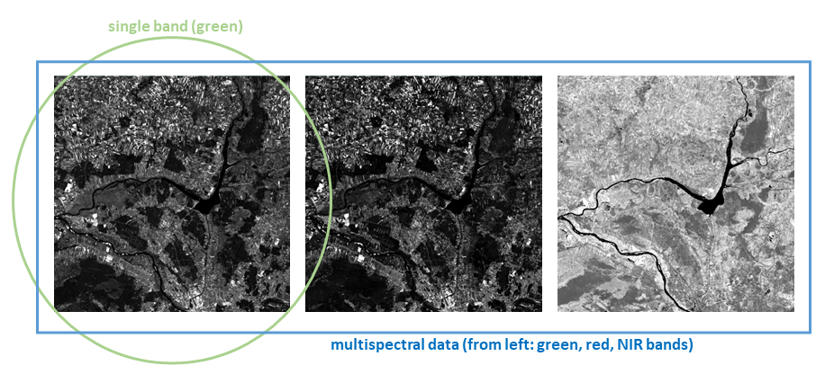
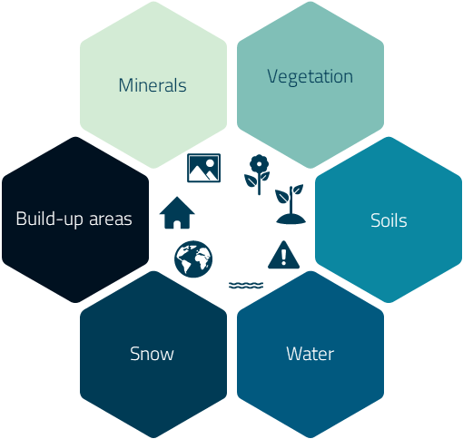
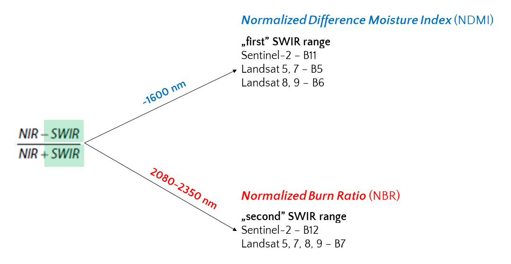
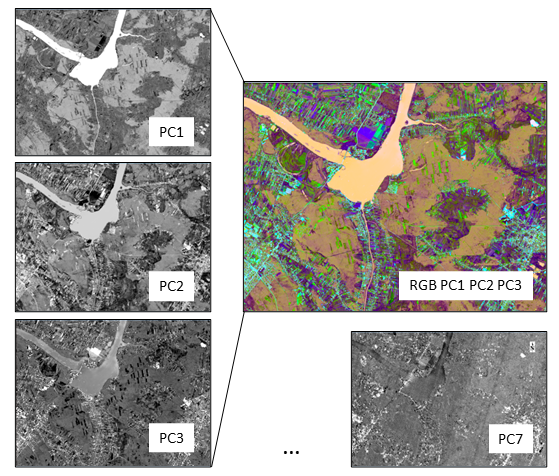

Principles of multispectral imaging
================

Before we move on to time series analysis we will generally introduce the topic of **multispectral satellite data properties**. We acknowledge that multispectral imagery can also be acquired with aerial and UAV platforms. However, since this module covers satellite data level of acquisition we will focus only on this type of data. We will present the potential of these satellite images in environmental applications.

In this theme, you will learn about:

- **[visual interpretation of satellite data](#visual-interpretation-of-satellite-data-concept)**
- **[the concept of multispectral data](#spectral-ranges-in-the-optical-domain)**
- **[use of different ranges](#use-of-different-ranges)**
- **[spectral indices and transformations](#spectral-indices)**
- **[selected sensor characteristics](#selected-sensor-characteristics)**
- **[advantages and limitations of satellite multispectral imaging](#advantages-and-limitations-of-satellite-multispectral-imaging)**
- **[multispectral satellite data archives](#multispectral-satellite-data-archives)**

This theme will conclude with:

- **[Self-evaluation quiz](#self-evaluation-quiz)**
- **[References](#references)**

To consolidate your knowledge and test it in a more practical environment complete the **[Exercise](01_multispectral_principles_exercise.md)**.

After finishing this theme you will:

- gain knowledge of the spatial and spectral resolution in the context of satellite data
- understand how to visually interpret satellite images based on more or less complex features (e.g. tone/brightness, size, texture, shadows, phenology)
- learn about the use of specific spectral ranges and RGB compositions to observe and analyze different phenomena
- understand how to calculate, differentiate, and use selected spectral indices and data transformation techniques like Tasseled Cap (TC) and Principal Component Analysis (PCA) for dealing with multispectral data
- gain familiarity with various satellite multispectral sensors and their specific applications in remote sensing research
- discover the advantages and limitations of satellite multispectral imaging for diverse fields of study
- know the increasing availability and variety of satellite data archives and their relevance for various applications

## Visual interpretation of satellite data concept

Image data can be analyzed based on their **resolutions**. In the context of satellite data, we consider four types of resolution: spatial, spectral, radiometric, and fixed temporal. We will discuss the last in more detail in [**Theme 2**](../02_temporal_information/02_temporal_information.md), while the others will be covered in this Theme.

Starting with the visual interpretation of satellite images, they can be grouped hierarchically, with respect to the degree of complexity ([European Commission, 1994](https://op.europa.eu/en/publication-detail/-/publication/6a5a57d8-d7af-4947-9074-609e792ffaad), [Chuvieco, 2020](https://doi.org/10.1201/9780429506482)). At the most basic level, **tone/brightness** and **color** are the most intuitive factors for visual interpretation. Following these, spatial characteristics such as the **size**, **form (shape)**, and **texture (spatial heterogeneity)** of identified objects are considered. More complex factors include **spatial patterns** or **shadows**, which are connected with the **height** of objects. Finally, **phenology** is considered the most challenging to capture visually, since it is influenced by seasonal and interannual variations in climate. This requires a deep understanding of the biological and ecological processes at play, as well as the ability to interpret subtle changes in color and texture that may indicate changes in vegetation health.

We will discuss **spectral** factors in the following sections, explaining how multispectral data is constructed.

## Spectral ranges in the optical domain

Optical remote sensing is based on specific parts of the electromagnetic spectrum, particularly the wavelengths from the visible, near, and shortwave infrared ranges (approximately 0.4-2.5 micrometers [Landgrebe, 2003](https://doi.org/10.1002/0471723800)). Specific wavelength ranges can be captured into separate images of the same scene, known as **bands**. Such data is referred to as **multispectral**.

<i>The example of selected Landsat OLI2 spectral bands (acquired 5.06.2022, figure by course authors, Landsat 9 [courtesy of the U.S. Geological Survey](https://www.usgs.gov/)/ [Terms of use](https://www.usgs.gov/information-policies-and-instructions/copyrights-and-credits)).</i>

The satellite multispectral data gathering process is based on three interrelated fundamental parameters: **spatial** and **spectral** resolution and **signal-to-noise (S/N) ratio**. The power level of energy in each pixel is divided into the spectral bands. The finer the spatial and spectral resolution, the less power is left to overcome the system sensor noise. This is where the S/N ratio comes into play. The primary objective of remote sensing is to maximize the S/N ratio, ensuring that the recorded signal significantly surpasses the noise, thereby enhancing the quality of the data collected.

The prerequisite for further quantitative analysis of satellite data in the optical domain is the calibration to spectral radiance, followed by the calculation of reflectance (we describe this in **[**Theme 3**](../03_image_processing/03_image_processing.md)**). But qualitatively, we can visually analyze images as described above based on tone/brightness or color.

## Use of different ranges

Various materials have unique reflection and absorption properties of electromagnetic radiation at different wavelengths. Those different characteristics make it possible to use particular spectral ranges for their analysis and target specific phenomena. For instance **band 1** (0.43-0.45 micrometers) from Landsat 8 OLI is particularly useful for **coastal zone** observations due to the way water absorbs and reflects light in this range.

This dependence on the use of specific bands for specific analyses results from the **number of gray levels** associated with **radiometric** resolution of the data and **brightness** of particular pixels. The greater the variation in the brightness of pixels representing different objects - the more useful the band for analysis. However, the human eye is more sensitive to color variations than brightness variations, which is why **color (multiband) compositions** are often used in the visual interpretation of satellite images.

Plotting three selected spectral bands together allows for the creation of an **RGB image composition**. While our eyes are most accustomed to compositions based on red, green, and blue bands (part (a) of Figure below), the availability of near and shortwave infrared bands allows us to create false color images (part (b)). Such compositions allow for better discrimination of e.g. deciduous/coniferous forests, healthy/damaged vegetation, and so on.

<i>Multispectral data concept: left: Landsat OLI2 natural and false colours RGB compositions (a) 432 and b) 543 bands used), right: spectral curves for selected land cover classes (NOTE: the reflectance values for specific objects are from a particular time, not general. Figure by course authors, Landsat 9 courtesy of [the U.S. Geological Survey](https://www.usgs.gov/)/ [Terms of use](https://www.usgs.gov/information-policies-and-instructions/copyrights-and-credits)).</i>

In multispectral data, the number of bands and their width are crucial factors. Generally, this type of data includes 3 to 10 discrete and rather broad bands (distinguishing them from hyperspectral data, which can include hundreds of very narrow bands, see **[Theme 1 of Module 4](../../module4/01_spectroscopy_principles/01_spectroscopy_principles.md)**). The figure below presents the comparison of bandwidths of several Landsat sensors as well as a comparison of multi- and hyperspectral characteristics of healthy plant.

<i>Differences between multispectral vs hyperspectral data, plant spectral characteristics example (each color of the line at the top of the figure corresponds to a specific Landsat sensor band, and the width is approximately proportional to the range of wavelengths that it covers. Figure by course authors).</i>

Many spectral bands offer numerous possibilities for analysis (e.g. assessment of leaf pigments or cellular structures of plant as you can see above), however, they can also be correlated, leading to redundancy in gathered information. Therefore, remote sensing offers the possibility to choose the bands that interest us the most. These selected bands can both be used to calculate **spectral indices** and subjected to **transformations**.

## Spectral indices

Different spectral bands allow for creating their combinations called **spectral indices**. Let’s recall what spectral indices are: mathematical measures that compare the spectral reflection in more than one spectral band.

For multispectral data analysis, both broadband and narrowband indices can be calculated, depending on the sensor used (e.g. [Henrich et al., 2009](https://www.researchgate.net/publication/259802556_Development_of_an_online_indices_database_Motivation_concept_and_implementation) listed 249 indices possible to calculate on only Sentinel-2 data! And many others).

Spectral indices can be dedicated to various objects and their characteristics. Due to the great dynamics of the changes taking place, most indices are related to **vegetation**. There are also indices developed for studying topics such as **snow cover**, **built-up areas**, **rocks and minerals**, and **fire/burnt areas**. You can find the examples of those in [Index Database](https://www.indexdatabase.de/) or [Awesome Spectral Indices](https://awesome-ee-spectral-indices.readthedocs.io/en/latest/index.html#).

<i>Example spectral indices applications (figure by course authors).</i>

Vegetation is one of the most *visually dynamic* land cover classes during the year and over many years, hence it is one of the most frequently studied objects using spectral indices. Its physiognomy and morphology are expressed in specific values of the reflectance. That, for instance, allows the user to assess whether the plant is healthy, stressed, or dead.

**Normalized Difference Vegetation Index** (NDVI, [Rouse et al., 1973](https://ntrs.nasa.gov/api/citations/19730017588/downloads/19730017588.pdf)) is one of the most common vegetation indices, which provides a measure of the general condition of vegetation and biomass. It is also often used in multitemporal analysis, as you will see throughout our course. However, there are also other indices related to:

- water content in plants, e.g. **Normalized Difference Moisture Index** (NDMI, [Hardisky et al., 1983](https://www.asprs.org/wp-content/uploads/pers/1983journal/jan/1983_jan_77-83.pdf)),
- chlorophyll content, e.g. **Normalized Pigment Chlorophyll Index** (NPCI, [Peñuelas et al., 1993](https://doi.org/10.1080/01431169308954010)),
- light use efficiency, e.g. **Structural Independent Pigment Index** (SIPI, [Peñuelas et al., 1994](https://www.researchgate.net/profile/Josep-Penuelas/publication/235645504_Photosyn1995/links/02bfe512443728f376000000/Photosyn1995.pdf)). etc.

**Normalized Burn Ratio** (NBR, [Roy et al., 2006](https://doi.org/10.1109/LGRS.2005.858485)) is also frequently used for mapping burned areas.

As you will see in the next chapter discussing the characteristics of various satellite sensors, they differ in, among others, spectral ranges. The formulas for calculating spectral indices on them are the same, but the correct band must be inserted into the formula. The **Table** below presents the formulas for the above-mentioned indices defined using bands from several selected sensors.

<b>Table 1. Selected vegetation indices formulas.</b>

| index | general formula   | Landsat 5-7 | Landsat 8-9 | Sentinel-2    | PlanetScope PSB.SD | PlanetScope PS2.SD |
|-------|-------------------|-------------|-------------|---------------|--------------------|--------------------|
| NDVI  | NIR-RED/NIR+RED   | B4-B3/B4+B3 | B5-B4/B5+B4 | B8-B4/B8+B4   | B8-B6/B8+B6        | B4-B3/B4+B3        |
| NDMI  | NIR-SWIR/NIR+SWIR | B4-B5/B4+B5 | B5-B6/B5+B6 | B8-B11/B8+B11 | \-                 | \-                 |
| NPCI  | RED-BLUE/RED+BLUE | B3-B1/B3+B1 | B4-B2/B4+B2 | B4-B2/B4+B2   | B6-B2/B6+B2        | B3-B1/B3+B1        |
| SIPI  | NIR-BLUE/NIR-RED  | B4-B1/B4-B3 | B5-B2/B5-B4 | B8-B2/B8-B4   | B8-B2/B8-B6        | B4-B1/B4-B3        |
| NBR   | NIR-SWIR/NIR+SWIR | B4-B7/B4+B7 | B5-B7/B5+B7 | B8-B12/B8+B12 | \-                 | \-                 |

**NOTE: some of the indices cannot be calculated on particular satellite data due to the lack of bands from specific ranges (e.g. lack of SWIR bands in PlanetScope data).**

Interestingly, both NDMI and NBR make use of NIR and SWIR bands and the general formula is the same, however, the SWIR band in NBR has a longer wavelength than in the case of NDMI, as you can see below.

<i>Difference between the formulas in NDMI and NBR indices (figure by course authors).</i>

Spectral indices can be presented on a map to analyze their values on various forms of land cover, but they can also be used as variables:

- increasing the accuracy of classification

or

- indicating a change in time.

We will show you examples of their use in the exercises of Themes [4](../04_multitemporal_classification/04_multitemporal_classification_exercise.md) and [5](../05_vegetation_monitoring/05_vegetation_monitoring_exercise.md), respectively.

More about vegetation indices calculated on e.g. multispectral Sentinel-2 data and their applications you can find [in this EO4GEO course](http://www.eo4geo.eu/training/sentinel-2-data-and-vegetation-indices/).

## Transformations

Apart from spectral indices, multispectral data bands can be used to transform into new informative, **uncorrelated** bands. This can be particularly useful when dealing with time series data or when trying to reduce redundancy in the data.

One of the most well-known transformations is **Tasselled Cap** (TC) producing thematic bands, from which the three most commonly used are **Greenness** (TCG), **Brightness** (TCB), and **Wetness** (TCW). This transformation was introduced for Landsat MSS data crops analysis and its name is because of the shape of phenological trajectories in red-NIR feature space ([Kauth and Thomas, 1976]((http://docs.lib.purdue.edu/lars_symp?utm_source=docs.lib.purdue.edu%2Flars_symp%2F159&utm_medium=PDF&utm_campaign=PDFCoverPages))). TC transformation has since been adapted for newer Landsat sensors and other platforms such as Sentinel-2. The applications have broadened as well. For instance, in forest disturbance detection researchers often use TCW band, which uses the contrast between shortwave and near-infrared, which is a good characteristic of disturbed and regenerating vegetation ([Cohen et al., 2010](https://doi.org/10.1016/j.rse.2010.07.008), we refer to this in [**Theme 5**](../05_vegetation_monitoring/05_vegetation_monitoring.md)).

Another transformation is **Principal Component Analysis** (PCA, [Hotelling, 1933](https://doi.org/10.1037/h0071325)) which is used for dimensionality reduction or noise removal by maximising the amount of information from original spectral bands by transforming them into a new set of bands, called principal components. They are uncorrelated with each other and ordered by the amount of variance they explain in the original data. The resulting band does not contain spectral information but instead provides a different, statistically most informative quality data.

<i>First PCA bands RGB composition (right) and principal components from Landsat OLI2 (acquired 5.06.2022). You can note that PC7 contains more noise than information (figure by course authors, Landsat 9 courtesy of [the U.S. Geological Survey](https://www.usgs.gov/)/ [Terms of use](https://www.usgs.gov/information-policies-and-instructions/copyrights-and-credits)).</i>

## Selected sensor characteristics

Over the past decades, the development of remote sensing instruments has been carried out. An extensive database of satellites is provided by [Union of Concerned Scientists (UCS)](https://www.ucsusa.org/resources/satellite-database), where they listed a total number of 6718 operational satellites in orbit around Earth (updated Jan 1, 2023). From over 600 are oriented on Earth Observation and more specifically on multispectral, optical, and infrared imaging as well as Earth science. They are also divided into the user’s classes like government, military, commercial, and civil.

**Table 2** presents the characteristics of selected satellite multispectral sensors most often used in scientific remote sensing research. Temporal information concerning most of them is described in [**Theme 2 of this Module**](../02_temporal_information/02_temporal_information.md#temporal-resolution-of-selected-sensors). See also [**Module 1 Theme 2**](../../module1/02_large_time_series_datasets_in_remote_sensing/02_large_time_series_datasets_in_remote_sensing.md#major-earth-observation-missions-data-archives-and-access) for different satellites characteristics.

<b>Table 2. Selected satellite sensor characteristics.</b>

| Satellite         | Sensor                                                         | Abbreviation | Spectral range (µm)                                       | Pixel size (m)                         | Swath width (km) | Sources                                                                                                                                                                                                                                                                                                                             |
|-------------------|----------------------------------------------------------------|--------------|-----------------------------------------------------------|----------------------------------------|------------------|-------------------------------------------------------------------------------------------------------------------------------------------------------------------------------------------------------------------------------------------------------------------------------------------------------------------------------------|
| Aqua              | Moderate Resolution Imaging Spectroradiometer                  | MODIS        | VNIR+SWIR (0.40-2.155), TIR (3.66-14.28)                  | 250-1000                               | 2330             | [LAADS DAAC](https://ladsweb.modaps.eosdis.nasa.gov/missions-and-measurements/modis/)                                                                                                                                                                                                                                               |
| Landsat 1/2/3     | Return Beam Vidicon                                            | RBV          | VNIR (0.47-0.83)                                          | 80/80/80                               | 185              | [USGS LT1](https://www.usgs.gov/landsat-missions/landsat-1)  [USGS LT2](https://www.usgs.gov/landsat-missions/landsat-2)  [USGS LT3](https://www.usgs.gov/landsat-missions/landsat-3)                                                                                                                                     |
| Landsat 1/2/3/4/5 | Multispectral Scanner                                          | MSS          | VNIR (0.50-1.10)                                          | 80/80/40/80                            | 185              | [USGS LT1](https://www.usgs.gov/landsat-missions/landsat-1)  [USGS LT2](https://www.usgs.gov/landsat-missions/landsat-2)  [USGS LT3](https://www.usgs.gov/landsat-missions/landsat-3)  [USGS LT4](https://www.usgs.gov/landsat-missions/landsat-4)  [USGS LT5](https://www.usgs.gov/landsat-missions/landsat-5) |
| Landsat 4/5       | Thematic Mapper                                                | TM           | VNIR+SWIR (0.45-2.35)                                     | 30/30                                  | 185              | [USGS LT4](https://www.usgs.gov/landsat-missions/landsat-4)  [USGS LT5](https://www.usgs.gov/landsat-missions/landsat-5)                                                                                                                                                                                                       |
| Landsat 7         | Enhanced Thematic Mapper Plus                                  | ETM+         | PAN (0.52-0.90), VNIR+SWIR (0.45-2.35), TIR (10.40-12.50) | 15 (PAN), 30 (MS), 60 (TIR)            | 185              | [USGS LT7](https://www.usgs.gov/landsat-missions/landsat-7)                                                                                                                                                                                                                                                                         |
| Landsat 8         | Operational Land Imager/                                       | OLI/TIRS     | PAN (0.50-0.68), VNIR+SWIR (0.43-2.29), TIR (10.60-12.51) | 15 (PAN), 30 (MS), 100 (TIR)           | 185              | [USGS LT8](https://www.usgs.gov/landsat-missions/landsat-8)                                                                                                                                                                                                                                                                         |
| Landsat 9         | Operational Land Imager 2                                      | OLI2         | PAN (0.50-0.68), VNIR+SWIR (0.43-2.29), TIR (10.30-12.50) | 15 (PAN), 30 (MS), 100 (TIR)           | 185              | [USGS LT9](https://www.usgs.gov/landsat-missions/landsat-9)                                                                                                                                                                                                                                                                         |
| Pleiades-1        | High-Resolution Imager                                         | HiRI         | PAN (0.47-0.83), VNIR (0.43-0.94)                         | 0.5 (PAN), 2 (MS)                      | 20               | [eoPortal](https://www.eoportal.org/satellite-missions/pleiades#pleiades-hr-high-resolution-optical-imaging-constellation-of-cnes)                                                                                                                                                                                                  |
| PlanetScope       | PS2, PS2.SD, PSB.SD                                            | \-           | VNIR (0.45-0.86)                                          | 3                                      | 24               | [Planet](https://developers.planet.com/docs/apis/data/sensors/)                                                                                                                                                                                                                                                                     |
| RapidEye          | RapidEye Earth-imaging System                                  | REIS         | VNIR (0.40-0.85)                                          | 5                                      | 77               | [eoPortal](https://www.eoportal.org/satellite-missions/rapideye)                                                                                                                                                                                                                                                                    |
| Sentinel-2        | Multispectral Instrument                                       | MSI          | VNIR+SWIR (0.44-2.20)                                     | 10-60 (MS)                             | 290              | [ESA](https://sentinels.copernicus.eu/web/sentinel/technical-guides/sentinel-2-msi/msi-instrument)                                                                                                                                                                                                                                  |
| SPOT 1/2/3        | High Resolution Visible                                        | HRV          | PAN (0.51-0.73), VNIR (0.50-0.89)                         | 10 (PAN), 20 (MS)                      | 60               | [Airbus](https://www.intelligence-airbusds.com/files/pmedia/public/r329_9_spotsatellitetechnicaldata_en_sept2010.pdf)                                                                                                                                                                                                               |
| SPOT 4            | High Resolution Visible Infrared                               | HRVIR        | PAN (0.61-0.68), VNIR+SWIR (0.50-1.75)                    | 10 (PAN), 20 (MS)                      | 60               | [Airbus](https://www.intelligence-airbusds.com/files/pmedia/public/r329_9_spotsatellitetechnicaldata_en_sept2010.pdf)                                                                                                                                                                                                               |
| SPOT 5            | High Resolution Stereoscopic                                   | HRS          | PAN (0.48-0.70)                                           | 5-10                                   | 120              | [Airbus](https://www.intelligence-airbusds.com/files/pmedia/public/r329_9_spotsatellitetechnicaldata_en_sept2010.pdf)                                                                                                                                                                                                               |
| SPOT 5            | High Resolution Geometric                                      | HRG          | PAN (0.48-0.71), VNIR+SWIR (0.50-1.75)                    | 2.5-5 (PAN), 10-20 (MS)                | 60               | [Airbus](https://www.intelligence-airbusds.com/files/pmedia/public/r329_9_spotsatellitetechnicaldata_en_sept2010.pdf)                                                                                                                                                                                                               |
| SPOT 6/7          | New AstroSat Optical Modular Instrument                        | Naomi        | PAN (0.45-0.75), VNIR (0.45-0.89)                         | 1.5 (PAN), 6 (MS)                      | 60               | [Airbus](https://www.intelligence-airbusds.com/files/pmedia/public/r329_9_spotsatellitetechnicaldata_en_sept2010.pdf)                                                                                                                                                                                                               |
| Terra             | Advanced Spaceborne Thermal Emission and Reflection Radiometer | ASTER        | VNIR+SWIR (0.52-2.43), TIR (8.12-11.65)                   | 15-30 (MS), 90 (TIR)                   | 60               | [LAADS DAAC](https://lpdaac.usgs.gov/data/get-started-data/collection-overview/missions/aster-overview/)                                                                                                                                                                                                                            |
| Terra             | Moderate Resolution Imaging Spectroradiometer                  | MODIS        | VNIR+SWIR (0.40-2.155), TIR (3.66-14.28)                  | 250-1000                               | 2330             | [LAADS DAAC](https://ladsweb.modaps.eosdis.nasa.gov/missions-and-measurements/modis/)                                                                                                                                                                                                                                               |
| QuickBird         | Ball Global Imagery System 2000                                | BGIS2000     | PAN (0.45-0.90), VNIR (0.45-0.90)                         | 0.65-0.73 (PAN), 2.62-2.92 (MS)        | 16.8/18          | [Satellite Imaging Corporation](https://www.satimagingcorp.com/satellite-sensors/quickbird/)                                                                                                                                                                                                                                        |
| WorldView-2       | WorldView-110 camera                                           | WV110        | PAN (0.45-0.80), VNIR (0.40-1.04)                         | 0.46 (PAN), 1.8 (MS)                   | 16.4             | [Satellite Imaging Corporation](https://www.satimagingcorp.com/satellite-sensors/worldview-2/)                                                                                                                                                                                                                                      |
| WorldView-3       | WorldView-110 camera                                           | WV110        | PAN (0.45-0.80), VNIR+SWIR (0.40-2.36), CAVIS (0.40-2.24) | 0.31 (PAN), 1.24-3.70 (MS), 30 (CAVIS) | 13.1             | [Satellite Imaging Corporation](https://www.satimagingcorp.com/satellite-sensors/worldview-3/)                                                                                                                                                                                                                                      |
| WorldView-4       | SpaceView-110 camera                                           | WV110        | PAN (0.45-0.80), VNIR (0.45-0.92)                         | 0.31 (PAN), 1.24 (MS)                  | 13.1             | [Satellite Imaging Corporation](https://www.satimagingcorp.com/satellite-sensors/geoeye-2/)                                                                                                                                                                                                                                         |

## Advantages and limitations of satellite multispectral imaging

Multiple spectral bands foster a wider range of interpretation and analysis possibilities of objects than in the case of ‘traditional’ RGB photographs. Availability of **red-edge, near-infrared, and mid-infrared** bands significantly strengthens vegetation analyses. The width of the spectral bands is of great importance here, which varies depending on the sensor as mentioned above.

The temporal regularity of the satellite level of data acquisition greatly enhances the potential of multitemporal analyses. Even that advantage, however, doesn’t prevent the occurrence of a clouded series of images. This phenomenon concerns data collected on request as well.

Individual mission differences in technical parameters, which are presented in Table 1 above, make it complicated to generalise advantages and disadvantages across the whole satellite data industry. Multispectral data can also be obtained from the airborne or UAV level. Similarly, in recent years, new hyperspectral satellites have appeared (e.g. [PRISMA](https://www.asi.it/en/earth-science/prisma/) in 2019 or [EnMAP](https://www.enmap.org/) in 2022), but since this Module deals with multispectral satellite data, the information below is limited to such sensor characteristics.

<i>Advantages and limitations of satellite multispectral imaging (figure by course authors).</i>

More points at the positive side should hint on the promising opportunities for using this data for a wide variety of applications.

## Multispectral satellite data archives

The wide range of Earth observation missions by various government agencies and private companies means that the **number of available sources with access to satellite data is increasing every year**. The vast amount of information requires that the data be properly catalogued and offered to the end user in as simple a form as possible so that they can easily find the data relevant to the applications and effects they wish to obtain. It also offers access to the computing power to find, process, and analyse multi-temporal (and sometimes multi-sensor) collections in some cases within a single platform. The large data archive services of major national and international government agencies such as NASA or ESA and the major private companies that provide cloud space and computing power are filled with data from many different missions. Smaller archives often offer more specialised data from smaller satellite missions or are processed to a level that allows analysis in selected areas.

Data available in archives can be divided by several characteristics. Archives offering free access are most often projects of agencies (that own the satellites), universities, and enthusiast communities. Commercially available data are owned by companies that operate private satellites and repositories of data from them. Some of the preprocessed Analysis Ready Data may also sometimes be available for a fee. Commercial parties often offer a free sample of data or a trial plan to get you acquainted with the service. All services may offer tools for **searching, browsing, downloading, processing, and analysing data**. Some offer multiple functionalities simultaneously. Depending on the user’s needs and level of sophistication, they can be operated using a graphical interface or, in some cases, also using a programming console and API. Large fragmentation and multiplicity of possibilities, apart from many advantages of such a solution, also make it necessary to spend time on the selection of appropriate sources, which may require creating multiple accounts in different services and the necessity of learning how to use them.

The **Table 3** below consists of multiple different purposes and content platforms available in English containing optical satellite imagery. We chose to present archives not related to just one area or mission, albeit those services can be useful for a specific purpose. A short list of such platforms can be found below.

<b>Table 3. Selected satellite data platforms.</b>

| Company/agency                                | Platform (site)                                                                | Description                                                                                                                                                       | Quick links                                                                                                                                                                                                                                                                                                                                                                                                                                                                                                                                                                                                                                                                                                                                                                                                                                                                                                                        | Open | Commercial (free samples) | Visualize | Download | Analysis | Imagery sources/satellites                                                                                                                                                                                                           | Notes                                                                 |
|-----------------------------------------------|--------------------------------------------------------------------------------|-------------------------------------------------------------------------------------------------------------------------------------------------------------------|------------------------------------------------------------------------------------------------------------------------------------------------------------------------------------------------------------------------------------------------------------------------------------------------------------------------------------------------------------------------------------------------------------------------------------------------------------------------------------------------------------------------------------------------------------------------------------------------------------------------------------------------------------------------------------------------------------------------------------------------------------------------------------------------------------------------------------------------------------------------------------------------------------------------------------|------|---------------------------|-----------|----------|----------|--------------------------------------------------------------------------------------------------------------------------------------------------------------------------------------------------------------------------------------|-----------------------------------------------------------------------|
| [Amazon](https://www.aboutamazon.com/)        | [Amazon Web Services Earth](https://aws.amazon.com/earth/)                     | Cloud computing platform offering various ranges of data and services.                                                                                            | [REGISTRATION](https://portal.aws.amazon.com/billing/signup?nc2=h_ct&src=header_signup&redirect_url=https%3A%2F%2Faws.amazon.com%2Fregistration-confirmation#/start/email)  [LOGIN](https://signin.aws.amazon.com/signin?redirect_uri=https%3A%2F%2Fus-east-1.console.aws.amazon.com%2Fconsole%2Fhome%3FhashArgs%3D%2523%26isauthcode%3Dtrue%26nc2%3Dh_ct%26region%3Dus-east-1%26skipRegion%3Dtrue%26src%3Dheader-signin%26state%3DhashArgsFromTB_us-east-1_e67c8d43f6386ce8&client_id=arn%3Aaws%3Asignin%3A%3A%3Aconsole%2Fcanvas&forceMobileApp=0&code_challenge=-7EUqosuAN20vM4WJTC2QwD0T0wLzWD8jzd2ATzLvaQ&code_challenge_method=SHA-256)  [GETTING STARTED](https://aws.amazon.com/getting-started/)                                                                                                                                                                                                                | no   | yes                       | no        | yes      | yes      | Sentinel, Landsat, NOAA, SpaceNet, regional datasets.                                                                                                                                                                                | One of the largest data providers/cloud computing services available. |
| [ESA](https://www.esa.int/)                   | [Copernicus Data Space Ecosystem](https://dataspace.copernicus.eu/)            | Platform provides complete, free and open access to Sentinel mission data.                                                                                        | [REGISTRATION](https://documentation.dataspace.copernicus.eu/Registration.html)  [USER GUIDE](https://documentation.dataspace.copernicus.eu/Home.html)                                                                                                                                                                                                                                                                                                                                                                                                                                                                                                                                                                                                                                                                                                                                                                        | yes  | no                        | yes       | yes      | no       | Sentinel                                                                                                                                                                                                                             | Enables API.                                                          |
| [Maxar](https://www.maxar.com/)               | [Discover](https://discover.maxar.com/)                                        | Browser of products collected by Maxar’s satellites.                                                                                                              |                                                                                                                                                                                                                                                                                                                                                                                                                                                                                                                                                                                                                                                                                                                                                                                                                                                                                                                                    | yes  | no                        | yes       | no       | no       | WorldView, GeoEye, Quickbird                                                                                                                                                                                                         |                                                                       |
| [USGS](https://www.usgs.gov/)                 | [EarthExplorer](https://earthexplorer.usgs.gov/)                               | USGS/NASA platform providing tools to search, browse display, export metadata, and download data from its vast archive consisting of data reaching 75 years back. | [REGISTRATION](https://ers.cr.usgs.gov/register)  [LOGIN](https://ers.cr.usgs.gov/login?RET_ADDR=https%3A%2F%2Fearthexplorer.usgs.gov%2F)   [HELP](https://www.usgs.gov/centers/eros/science/earthexplorer-help-index#ERS)                                                                                                                                                                                                                                                                                                                                                                                                                                                                                                                                                                                                                                                                                               | yes  | no                        | yes       | yes      | no       | Landsat, plus MODIS, ASTER. Also open source datasets provided under collaboration with ISRO (Resourcesat-1 and 2), ESA (Sentinel-2), and some commercial high-resolution satellite data (IKONOS-2, OrbView-3, historical SPOT data) | Enables Bulk Download with standalone manager. Enables API.           |
| [GeoCento](https://geocento.com/)             | [Earthimages](https://geocento.com/earthimages)                                | Platform for ordering high and very high resolution imagery.                                                                                                      | [CONTACT](https://geocento.com/contact)                                                                                                                                                                                                                                                                                                                                                                                                                                                                                                                                                                                                                                                                                                                                                                                                                                                                                            | no   | yes                       | yes       | yes      | no       | Landsat, Sentinel, Worldview, SPOT                                                                                                                                                                                                   | Platform for ordering high and very high resolution imagery.          |
| [Sentinel Hub](https://www.sentinel-hub.com/) | [EO Browser](https://apps.sentinel-hub.com/eo-browser/)                        | Visualisation, download and simple analysis online platform.                                                                                                      | [EXPLORE](https://www.sentinel-hub.com/explore/eobrowser/)  [USER GUIDE](https://www.sentinel-hub.com/explore/eobrowser/user-guide/)                                                                                                                                                                                                                                                                                                                                                                                                                                                                                                                                                                                                                                                                                                                                                                                          | yes  | no                        | yes       | yes      | yes      | Landsat, Sentinel, MODIS, ENVISAT, Proba-V                                                                                                                                                                                           | Allows for ordering of private satellite imagery.                     |
| [ESA](https://www.esa.int/)                   | [EO-Cat](https://eocat.esa.int/sec/#data-services-area)                        | Metadata and imagery browser of Earth Observation data acquired by various satellites.                                                                            | [HELP](https://eocat.esa.int/sec/help.html)                                                                                                                                                                                                                                                                                                                                                                                                                                                                                                                                                                                                                                                                                                                                                                                                                                                                                        | yes  | no                        | yes       | yes      | no       | Envisat, AVHRR, Geosat, JERS-1, Landsat, Proba, Rapideye, Worldview-2                                                                                                                                                                |                                                                       |
| [Airbus](https://www.airbus.com/en)           | [GeoStore](https://www.intelligence-airbusds.com/geostore/)                    | Platform allowing access for specific satellite missions.                                                                                                         | [REGISTRATION](https://account4.intelligence-airbusds.com/account/CreateAccount.aspx?l=en&RelayState=https://www.intelligence-airbusds.com/)  [LOGIN](https://connect4.intelligence-airbusds.com/adfs/ls/?SAMLRequest=rVLBTuMwEP2VyPfUiSmktdpKhQpRiYWKlj3sZTV1ptSSPc56HAp%2FT5ruCrj0tKfRPM978%2Fw0EwbvGj1v056e8E%2BLnLI374h1%2FzAVbSQdgC1rAo%2Bsk9Hr%2BY97rQaFbmJIwQQnvlDOM4AZY7KBRLZcTMXvolLlGNSuqi5hiJUZ4pWpxiNVIKhaFWV1NcaxudgWFyL7iZE75lR0Qh2ducUlcQJKHVQolReXeak2ZamLkVajXyJbdL%2BxBKln7VNqWEtpAhGaNBxYSuicfUEymION25ZrHpjgJdQ7lo6lyOb%2F%2FN4E4tZjXGN8tQafn%2B4%2FFQ%2BHwxkxtr5xeIxG%2BlC3DgfNvpF9z6eqcjDco8fFrQElstXfaK8t1ZZezqe6PQ2xvttsVvnqcb0Rs8lRWfcpxdn%2FcOoxQQ0JvhmdyK9rJqdjeugMLher4Kx5z25D9JDO%2Bz8its53%2FahOEYgtUhJydtL%2Ffp%2BzDw%3D%3D&RelayState=https%3A%2F%2Fwww.intelligence-airbusds.com%2Fuser-login%2F%3Fl%3Den)  [HELP](https://www.intelligence-airbusds.com/en/8714-questions-and-answers) | no   | yes                       | no        | yes      | no       | Pleiades, SPOT, DMC                                                                                                                                                                                                                  |                                                                       |
| [Google](http://about.google)                 | [Google Cloud Storage](https://cloud.google.com/storage/docs/public-datasets/) | Cloud Storage provides a variety of public datasets that can be accessed by the community and integrated into their applications.                                 | [REGISTRATION](https://accounts.google.com/signup/v2/webcreateaccount?service=cloudconsole&continue=https%3A%2F%2Fconsole.cloud.google.com%2Ffreetrial%3F_ga%3D2.48750438.1590195550.1652279703-232008209.1604320050&dsh=S1326015960%3A1652353991880874&biz=false&hl=en-GB&flowName=GlifWebSignIn&flowEntry=SignUp&nogm=true)  [HELP](https://cloud.google.com/storage/docs/support)                                                                                                                                                                                                                                                                                                                                                                                                                                                                                                                                          | yes  | no                        | no        | yes      | no       | Sentinel-2, Landsat                                                                                                                                                                                                                  | Enables API.                                                          |
| [Google](http://about.google)                 | [Google Earth](https://earth.google.com/web/)                                  | Visualisation of the whole globe on many levels of detail.                                                                                                        | [RESOURCES](https://www.google.pl/intl/pl/earth/resources/)                                                                                                                                                                                                                                                                                                                                                                                                                                                                                                                                                                                                                                                                                                                                                                                                                                                                        | yes  | no                        | yes       | no       | no       |                                                                                                                                                                                                                                      | Available in the Web browser, and as a stand alone PC and mobile app. |
| [Google](http://about.google)                 | [Google Earth Engine](https://earthengine.google.com/)                         | A planetary-scale platform for Earth science data & analysis.                                                                                                     | [FAQ](https://earthengine.google.com/faq/) [PLATFORM INFORMATION](https://earthengine.google.com/platform/)                                                                                                                                                                                                                                                                                                                                                                                                                                                                                                                                                                                                                                                                                                                                                                                                                        | yes  | no                        | yes       | yes      | yes      | Landsat, Sentinel, MODIS                                                                                                                                                                                                             | Enables API.                                                          |
| [EOS](https://eos.com/)                       | [Landviewer](https://eos.com/landviewer/)                                      | Satellite observation imagery tool that allows for on-the-fly searching, processing and getting valuable insights from satellite data.                            | [USER GUIDE](https://eos.com/products/landviewer/user-guide/)                                                                                                                                                                                                                                                                                                                                                                                                                                                                                                                                                                                                                                                                                                                                                                                                                                                                      | no   | yes                       | yes       | yes      | yes      | Landsat, Sentinel, SPOT, Pleiades                                                                                                                                                                                                    |                                                                       |
| [Microsoft](https://www.microsoft.com/)       | [Microsoft Planetary Computer](https://planetarycomputer.microsoft.com/)       | Data archive platform with expanding functionalities.                                                                                                             | [ABOUT](https://planetarycomputer.microsoft.com/docs/overview/about)                                                                                                                                                                                                                                                                                                                                                                                                                                                                                                                                                                                                                                                                                                                                                                                                                                                               | no   | yes                       | no        | yes      | no       | Landsat, Sentinel, ASTER                                                                                                                                                                                                             | Enables API.                                                          |
| [Airbus](https://www.airbus.com/en)           | [OneAtlas](https://oneatlas.airbus.com/)                                       | Airbus satellite images and add maps enabled by ordering features.                                                                                                | [TUTORIALS](https://api.oneatlas.airbus.com/tutorials/t-explore-data/)                                                                                                                                                                                                                                                                                                                                                                                                                                                                                                                                                                                                                                                                                                                                                                                                                                                             | no   | yes                       | no        | yes      | no       |                                                                                                                                                                                                                                      | Enables API.                                                          |
| [Sentinel Hub](https://www.sentinel-hub.com/) | [Sentinel Playground](https://apps.sentinel-hub.com/sentinel-playground/)      | A free-to-use web application that allows for rapid online viewing and access to image archives.                                                                  | [INFORMATION](https://www.sentinel-hub.com/explore/sentinelplayground/)                                                                                                                                                                                                                                                                                                                                                                                                                                                                                                                                                                                                                                                                                                                                                                                                                                                            | yes  | no                        | yes       | no       | no       | Landsat, Sentinel, MODIS                                                                                                                                                                                                             |                                                                       |

## Self-evaluation quiz

After going through the theory in this theme you should now be ready to take on self-evaluation quiz. You should be able to find any answer you have trouble with in the contents above or the additional [references](#references) below. Good luck!

<form name="quiz" action method="post" onsubmit="evaluate_quiz(); return false">
<!--Question 1-->
<label for="q_01"> <b>Question 1.</b> Select the visual interpretation factors, ranked from most to least complex: </label>  <input type="radio" name="q_01">seasonal conditions, brightness, shadows  <input type="radio" name="q_01">spatial pattern, size, tone  <input type="radio" name="q_01">shadow, form, colour  <input type="radio" name="q_01">tone, texture, seasonal conditions 

spatial pattern, size, tone

<output id="output_q_01">
</output>

  

<!--Question 2-->
<label for="q_02"> <b>Question 2.</b> What is the main purpose of performing data transformation? </label>  <input type="radio" name="q_02">dimensionality reduction via selection of spectral bands  <input type="radio" name="q_02">creation of new, uncorrelated bands without spectral information  <input type="radio" name="q_02">noise removal from shortwave and near infrared bands  <input type="radio" name="q_02">creation of new spectral bands 

creation of new, uncorrelated bands without spectral information

<output id="output_q_02">
</output>

  

<!--Question 3-->
<label for="q_03"> <b>Question 3.</b> Which satellite data would be most suitable for identifying the roofing of buildings? </label>  <input type="radio" name="q_03">Landsat 9  <input type="radio" name="q_03">World-View-4  <input type="radio" name="q_03">Terra MODIS  <input type="radio" name="q_03">SPOT 4 

World-View-4

<output id="output_q_03">
</output>

  

<!--Question 4-->
<label for="q_04"> <b>Question 4.</b> Which satellite data would be most suitable for land surface temperature analysis throughout Poland? </label>  <input type="radio" name="q_04">Sentinel-2  <input type="radio" name="q_04">Terra MODIS  <input type="radio" name="q_04">PlanetScope  <input type="radio" name="q_04">SPOT 1 

Terra MODIS

<output id="output_q_04">
</output>

  

<!--Question 5-->
<label for="q_05"> <b>Question 5.</b> Spectral indices will <b>NOT</b> help in assessing: </label>  <input type="radio" name="q_05">water content in plants  <input type="radio" name="q_05">water quality  <input type="radio" name="q_05">chlorophyll content in water  <input type="radio" name="q_05">height of the water table 

height of the water table

<output id="output_q_05">
</output>

  

<!--Question 6-->
<label for="q_06"> <b>Question 6.</b> Which multispectral data feature best identifies a damaged plant: </label>  <input type="radio" name="q_06">narrow spectral bands in the SWIR range  <input type="radio" name="q_06">use of VIS and NIR bands  <input type="radio" name="q_06">high spatial resolution of the panchromatic image  <input type="radio" name="q_06">texture presenting the surroundings of the plant 

use of VIS and NIR bands

<output id="output_q_06">
</output>

  

<!--Question 7-->
<label for="q_07"> <b>Question 7.</b> What is the main difference between multi- and hyperspectral data: </label>  <input type="radio" name="q_07">pixel size  <input type="radio" name="q_07">pixel brightness  <input type="radio" name="q_07">band width  <input type="radio" name="q_07">RGB composition creation 

band width

<output id="output_q_07">
</output>

  

<output id="output_overall">
</output>

<input type="submit" value="Submit" style="font-size:14pt">  

</form>

## Exercise

[Proceed with the exercise by going to the next page below or clicking this link](01_multispectral_principles_exercise.md)

## References

### Key references (recommended reading, looking up background details)

Chuvieco, E. (2020). *Fundamentals of satellite remote sensing: An environmental approach*. CRC Press. <https://doi.org/10.1201/9780429506482>

### Additional references cited in this theme

Cohen W. B., Yang Z., Kennedy R. (2010). Detecting trends in forest disturbance and recovery using yearly Landsat time series: 2. TimeSync—Tools for calibration and validation, Remote Sensing of Environment, 114(12), 2911-2924. <https://doi.org/10.1016/j.rse.2010.07.008>

European Commission, Directorate-General for Environment, Directorate-General for the Information Society and Media, *Corine land cover – Technical guide*, Publications Office, 1994. [source](https://op.europa.eu/en/publication-detail/-/publication/6a5a57d8-d7af-4947-9074-609e792ffaad)

Hardisky, M.A., Klemas, V. (1983). *The Influence of Soil Salinity, Growth Form, and LeafMoisture on the Spectral Reflectances of Spartina alterniflora Canopies*. Photogramm. Eng, Remote Sensing. [source](https://www.asprs.org/wp-content/uploads/pers/1983journal/jan/1983_jan_77-83.pdf)

Henrich, V., Götze, E., Jung, A., Sandow, C., Thürkow, D., & Gläßer, C. (2009, March). *Development of an online indices database: Motivation, concept and implementation*. In Proceedings of the 6th EARSeL imaging spectroscopy sig workshop innovative tool for scientific and commercial environment applications, Tel Aviv, Israel (pp. 16-18). [source](https://www.researchgate.net/publication/259802556_Development_of_an_online_indices_database_Motivation_concept_and_implementation)

Hotelling, H. (1933). *Analysis of a complex of statistical variables into principal components*. Journal of Educational Psychology, 24(6), 417. <https://doi.org/10.1037/h0071325>

Kauth, R. J., & Thomas, G. S. (1976). *The Tasseled Cap—A Graphic Description of the Spectral-Temporal Development of Agricultural Crops as Seen by Landsat*. LARS: Proceedings of the Symposium on Machine Processing of Remotely Sensed Data, West Lafayette, IN: Purdue University, 4B-41-4B-51. [source](http://docs.lib.purdue.edu/lars_symp?utm_source=docs.lib.purdue.edu%2Flars_symp%2F159&utm_medium=PDF&utm_campaign=PDFCoverPages)

Landgrebe, D. A. (2003). *Signal theory methods in multispectral remote sensing* (Vol. 24). John Wiley & Sons. <https://doi.org/10.1002/0471723800>

Peñuelas, J., Baret, F., & Filella, I. (1995). *Semi-empirical indices to assess carotenoids/chlorophyll a ratio from leaf spectral reflectance*. Photosynthetica, 31(2), 221-230. [source](https://www.researchgate.net/profile/Josep-Penuelas/publication/235645504_Photosyn1995/links/02bfe512443728f376000000/Photosyn1995.pdf)

Peñuelas, J., Filella, I., Biel, C., Serrano, L., & Save, R. (1993). *The reflectance at the 950–970 nm region as an indicator of plant water status*. International Journal of Remote Sensing, 14(10), 1887-1905. <https://doi.org/10.1080/01431169308954010>

Rouse Jr, J. W., Haas, R. H., Schell, J. A., & Deering, D. W. (1973). *Monitoring the vernal advancement and retrogradation (green wave effect) of natural vegetation* (No. NASA-CR-132982). [source](https://ntrs.nasa.gov/api/citations/19730017588/downloads/19730017588.pdf)

Roy, D. P., Boschetti, L., & Trigg, S. N. (2006). *Remote sensing of fire severity: assessing the performance of the normalized burn ratio*. IEEE Geoscience and Remote Sensing Letters, 3(1), 112-116. <https://doi.org/10.1109/LGRS.2005.858485>

## Next unit

Proceed with [Temporal information in satellite data](../02_temporal_information/02_temporal_information.md)
