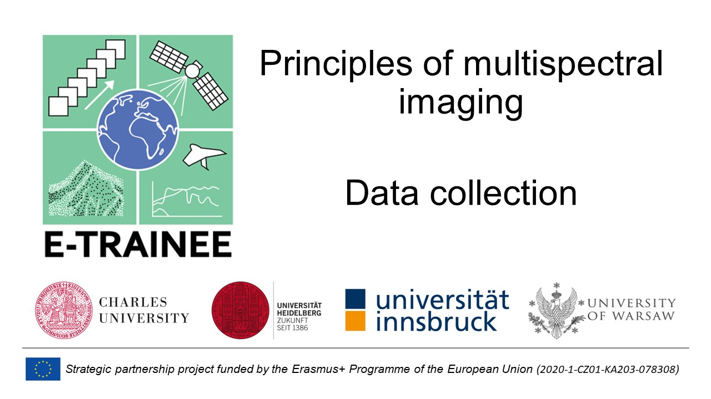
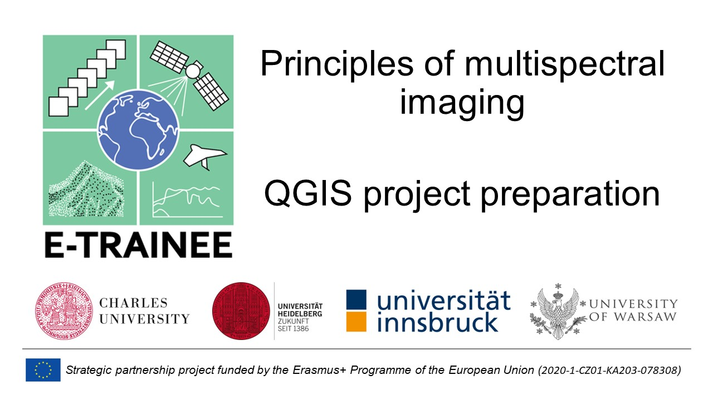

Principles of multispectral imaging - Exercise
================

## Exercise - Visual interpretation on different resolution data

In this exercise you will be able to complete several tasks: search, select and download imagery acquired by different sensors, visualize them in QGIS software in **natural and false color composites** and visually interpret to recognize variety of **land cover classes** and **effects of disturbance agents**. Data used in this exercise was acquired for Tatra Mountains region (southern Poland) which has varying land cover and its vegetation is affected by agents and events such as bark beetle outbreaks, strong winds or avalanches.

The aim of this exercise is to learn how spatial resolution affects the image interpretation possibility and how usage of true color (RGB) or color-infrared (CIR) composites change our ability to distinguish land cover classes from each other. The knowledge gathered in this exercise will be useful in exercises in **[Theme 2](../02_temporal_information/02_temporal_information_exercise.md)**, **[Theme 4](../04_multitemporal_classification/04_multitemporal_classification_exercise.md)** and **[Theme 5](../05_vegetation_monitoring/05_vegetation_monitoring_exercise.md)**. The exercise is divided into three parts with video tutorial for each one.

## Part 1: Data collection

This part will show how to collect image data from various sources. We will later use that data in Part 2 and 3 this exercise. We will use following data and sources:

|                     Data type                      | Date of acquisition |      Product level       | Spatial resolution |
|:--------------------------------------------------:|:-------------------:|:------------------------:|:------------------:|
|          Aerial orthoimagerya           |     26.06.2022      |       Orthoimagery       |       0.25 m       |
| PlanetScope (composition of 10 scenes)b |     26.08.2022      | Surface Reflectance (SR) |        3 m         |
|                    Sentinel-2B                     |     03.07.2022      |      Level 1C (SR)       |        10 m        |
|                    Landsat8 OLI                    |     22.06.2022      | L1TP (Collection 2, SR)  |        30 m        |
|                       MODIS                        |     21.06.2022      |        V6.1 (SR)         |       500 m        |

a orthoimagery is treated as easily interpretable base material due to very high spatial resolution

b video tutorial does not cover the process of searching and downloading PlanetScope data from Planet Explorer (submission for Planet’s Education and Research Program)

To collect the data we will use following databases:

- [Polish National Geoportal](https://mapy.geoportal.gov.pl/imap/Imgp_2.html) (aerial orthoimagery; registration is not needed)
- [Copernicus Data Space Ecosystem](https://dataspace.copernicus.eu/) (Sentinel-2 data; registration is needed)
- [Earth Explorer](https://earthexplorer.usgs.gov/) (Landsat and MODIS data; registration is needed)
- [Earth Data](https://urs.earthdata.nasa.gov/home) (registration is needed for MODIS data download)
- [Planet Education and Research Program](https://www.planet.com/markets/education-and-research/) (PlanetScope data, registration is needed)

By clicking on the **image below** you will be taken to the video on data collection on YouTube:

All data for parts 2 and 3 are provided through [Zenodo](https://zenodo.org/records/10003575) (module2_theme_1_exercise.zip).

## Part 2: Project preparation

This part is devoted to project preparation in QGIS software. In the beginning coordinate reference system will be set up. Universal Transverse Mercator zone 34 is chosen because of it is adequate for Tatra Mountains region and PlanetScope, Sentinel-2 and Landsat data are distributed in it (the aerial orhtoimagery will be reprojected on the fly properly, MODIS data needs to be reprojected). Each type of data will be visualised in two composites. We want to compare the possibility to recognize various objects using different types of visualisations.

By clicking on the **image below** you will be taken to the video on QGIS project preparation on YouTube:

## Part 3: Image interpretation

In the last part we will use QGIS project prepared in part 2. A point vector layer containing example locations of different land cover classes and effect of two disturbance agents will be added. The layer will be helpful in comparison of image data. In this part think about the utility of each type of data for land cover classification and detection of vegetation disturbance effects.

By clicking on the **image below** you will be taken to the video on image interpretation on YouTube:

<b><u>TASK</u></b>

After completing the exercise you should have the knowledge of how different land cover classes and the effects of disturbances look like on different types of satellite data.

To expand and consolidate the skills you’ve acquired, create a new point vector layer and try to independently indicate two new locations for each of the previously discussed examples. In the layer, create attributes with the name of each data source used in the exercise and mark if given land cover class or disturbance effect is identifiable on given image. Remember the relationship between the scale of phenomena/object and spatial resolution of data. Try using various RGB composites that may be more suitable for distinguishing different classes from one another.

Good luck !

## Data and software credits

### Data

Landsat 8 imagery courtesy of [the U.S. Geological Survey](https://www.usgs.gov/)/ [Terms of use](https://www.usgs.gov/information-policies-and-instructions/copyrights-and-credits)

Sentinel-2 [European Space Agency - ESA](https://dataspace.copernicus.eu/)/ [Terms of use](https://dataspace.copernicus.eu/terms-and-conditions),

PlanetScope [Image © 2022 Planet Labs PBC](https://www.planet.com)/[CC BY-NC 2.0](https://creativecommons.org/licenses/by-nc/2.0/)

MODIS [Vermote, E., Wolfe, R. (2021). MODIS/Aqua Surface Reflectance Daily L2G Global 1km and 500m SIN Grid V061 (Data set). NASA EOSDIS Land Processes Distributed Active Archive Center. Accessed 2023-09-01 from https://doi.org/10.5067/MODIS/MYD09GA.061](https://doi.org/10.5067/MODIS/MYD09GA.061)

Orthoimagery [Geoportal.gov.pl](https://www.geoportal.gov.pl)/ [Terms of use](https://www.geoportal.gov.pl/regulamin)

### Software

- QGIS Development Team (2022). *QGIS Geographic Information System. Open Source Geospatial Foundation Project*. <http://qgis.osgeo.org>
