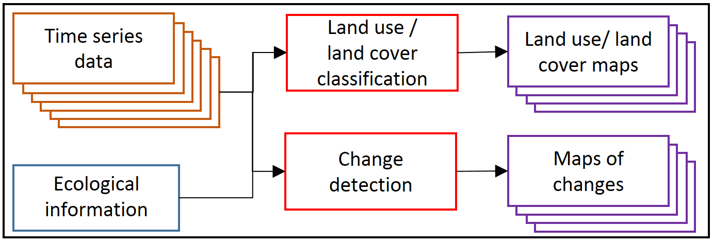
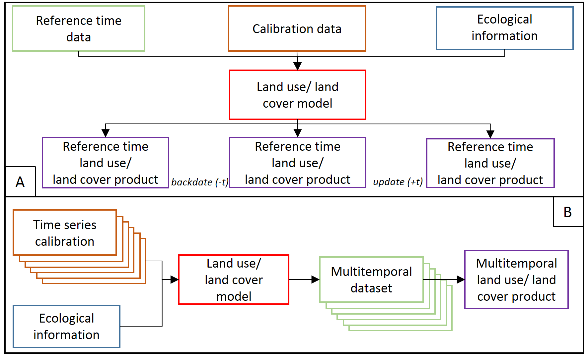

Temporal information in satellite data
================

As discussed in the previous theme, satellite-level data acquisition uniquely allows for analysis at regular intervals since the commencement of the instrument’s operation. This leads to the accumulation of massive datasets. For instance, since the onset of its mission, Landsat has amassed over **8 million** Earth scenes. The purpose of this part of the course is to showcase the potential of analyzing the multitemporal aspect of such voluminous data in Earth observation studies.

In this theme you will learn about:

- **[why satellite time series data are important](#the-need-of-satellite-time-series-data)**
- **[satellite sensors with high or low temporal resolution](#temporal-resolution-of-selected-sensors)**  
- **[temporal categories of time series data](#temporal-categories-of-time-series-data)**
- **[time series components and temporal dimension in environmental analysis](#time-series-components-and-temporal-dimensions-in-environmental-analysis)**
- **[types of multitemporal analysis](#types-of-temporal-analysis)**  
- **[time series variables](#time-series-variables)**
- **[key aspects of satellite time series data analysis](#aspects-of-satellite-time-series-data-analysis)**  
- **[selected tools and algorithms](#tools-and-algorithms)**  
- **[uncertainty in satellite time series data products](#uncertainty-of-satellite-time-series-data-products)**

This theme will conclude with:

- **[Self-evaluation quiz](#self-evaluation-quiz)**
- **[References](#references)**

To consolidate your knowledge and test it in more practical environment complete the **[Exercise](02_temporal_information_exercise.md)**.

After finishing this theme you will:

- understand the benefits of analyzing multitemporal satellite data in Earth observation studies
- recognize the imperfections of satellite images and the importance of image selection
- appreciate the ability of satellite data to capture temporal variations and detect changes on Earth’s surface over time
- comprehend the temporal resolution of different satellite sensors and their orbits
- be able to classify multitemporal analysis into intra-annual, inter-annual, and multi-year categories
- identify the components of long-term time series and their relevance in environmental analysis
- differentiate between multitemporal classification and change detection as types of temporal analysis
- understand the importance of selecting appropriate tools and algorithms for multitemporal analysis
- recognize the presence of uncertainty in satellite time series data products and factors influencing it and know the methods for reducing it

## The need of satellite time series data

There are numerous reasons why satellite data, acquired on a continuous basis, is highly beneficial. The first reason pertains to the **imperfections** that some images may exhibit. A significant challenge in projects utilizing remote sensing data isn’t always the processing of the data itself, but rather its **selection**. While planning such a project, we may have numerous ambitions, but the reality can sometimes surprise us. In an ideal world, we would have access to vivid, clear images, but we may instead encounter issues such as cloud cover, shadows, scanning errors, pixel noise, etc. The figure below, albeit slightly exaggerated, portrays our expectations versus the reality in this context. Nevertheless, the option to choose an image from a different date ensures that our project is not destined for failure.

<i>Expectations vs reality when searching satellite data (figure by course authors, sources of images from the upper left to the lower right: Sentinel-2 [European Space Agency - ESA](https://dataspace.copernicus.eu/)/ [Terms of use](https://dataspace.copernicus.eu/terms-and-conditions), [Image © 2022 Planet Labs PBC](https://www.planet.com)/[CC BY-NC 2.0](https://creativecommons.org/licenses/by-nc/2.0/), Landsat 5 courtesy of [the U.S. Geological Survey](https://www.usgs.gov/)/ [Terms of use](https://www.usgs.gov/information-policies-and-instructions/copyrights-and-credits)), Landsat 7 courtesy of [the U.S. Geological Survey](https://www.usgs.gov/)/ [Terms of use](https://www.usgs.gov/information-policies-and-instructions/copyrights-and-credits), Landsat 8 courtesy of [the U.S. Geological Survey](https://www.usgs.gov/)/ [Terms of use](https://www.usgs.gov/information-policies-and-instructions/copyrights-and-credits), Landsat 4 courtesy of [the U.S. Geological Survey](https://www.usgs.gov/)/ [Terms of use](https://www.usgs.gov/information-policies-and-instructions/copyrights-and-credits)).</i>

Another significant advantage of satellite data is that it captures the **temporal variation** of objects and landscapes. Objects may appear or disappear, or look entirely different across various seasons or years. This ability can help us detect such phenomena without the need for on-site exploration. For instance, how else but through satellite imagery could we identify a newly formed tiny island in a distant ocean? Or observe the decrease in the number of cars on the streets and parking lots after the 2020 lockdown announcement due to COVID-19? Satellite data provides a powerful tool for monitoring changes on Earth’s surface over time.

<i>Examples of satellite data usage. A: Landsat data help in new island detection in Tonga, figure by L. Dauphin ([NASA Earth Observatory](https://earthobservatory.nasa.gov/images/150368/home-reef-erupts)/ [Terms of use](https://earthobservatory.nasa.gov/image-use-policy), [Map data ©2023 Google](https://maps.google.com)/ [Terms of use](https://www.google.com/intl/en_pl/help/terms_maps/)), B: PlanetScope data in the views of Downtown Johannesburg, before (top image) and during (bottom image) lockdown ([Image © 2019/2020 Planet Labs PBC](https://www.planet.com/gallery/#!/post/downtown-johannesburg-on-lockdown)/[CC BY-NC 2.0](https://creativecommons.org/licenses/by-nc/2.0/)).</i>

These and many other examples underscore the undeniable benefits of satellite data. The processing and utilization of such data, which enables us to observe Earth’s changes, are covered in this module and its subsequent themes.

## Temporal resolution of selected sensors

The temporal resolution of satellite data from different sensors depends on the type of orbit on which the satellite is placed. **Geostationary** satellite systems continuously acquire images of the same part of the globe, so multiple data acquisitions can occur even on the same day or even within a few minutes. Examples of such systems are meteorological satellites such as Meteosat and NOAA. Another class of satellites includes systems orbiting in **polar** / **Sun-synchronous** orbits, like Landsat or SPOT missions. In their case, time resolution is defined as the time the satellite revisits the same part of a given area. Typically, it takes between one day and half a month for a satellite in polar orbit to make another acquisition. This time can be reduced by placing several satellites with twin sensor parameters, like in case of Sentinel-2A and 2B occupying the same orbit separated by 180 degrees.

Overview of temporal resolution of selected satellite sensors is presented below.

<i>Temporal resolution and lifetime of selected satellite missions (figure by course authors, information derived from [eoPortal](https://www.eoportal.org/satellite-missions) / [terms and conditions](https://www.eoportal.org/terms-and-conditions).</i>

## Temporal categories of time series data

Depending on the temporal resolution and time range of satellite data, multitemporal analysis can be classified into the following categories:

- **intra-annual** – analysis of data acquired within the same year, such as studying phenological changes in a single season,  
- **inter-annual (year-to-year)** – analysis of data acquired in two different years with any interval, for instance, analyzing the effects of a hurricane or flood,  
- **inter-annual (multi-year)** – analysis of data obtained over more than two different years with any interval. Examples might include studying the effects of pest infestations or climate change.

Based on these categories, satellite data can be characterized as either **long** (spanning many years) and/or **dense** (featuring numerous collections per year) time series data. These can be used either individually or in combination, depending on the purpose of the analysis.

<i>Long and dense time series data examples (figure by course authors, source of Sentinel-2 image: [European Space Agency - ESA](https://dataspace.copernicus.eu/)/ [Terms of use](https://dataspace.copernicus.eu/terms-and-conditions)).</i>

Another way to divide this data is into **online** and **offline** categories ([Zhu, 2017](https://doi.org/10.1016/j.isprsjprs.2017.06.013)). The online approach assumes that time series data are arriving at a specific rate, facilitating analyses in near real-time or on an ongoing basis. In contrast, the offline approach operates under the assumption that the time series data already exist.

For managing large collections of satellite images modeled as multidimensional structures to facilitate time series analysis, the concept of an **Earth Observation (EO) Data Cube** has been established ([Voidrot and Percivall, 2020](https://doi.org/10.1088/1755-1315/509/1/012058)). The primary features of an EO Data Cube include georeferenced spatial support, temporal continuity, and the absence of gaps in the spatiotemporal extent. The processing steps related to the EO Data Cube concept are explored further in **[Theme 3](../03_image_processing/03_image_processing.md)**. You can read more about this in **[Theme 2 of Module 1](../../module1/02_large_time_series_datasets_in_remote_sensing/02_large_time_series_datasets_in_remote_sensing.md#data-cubes)**.

<i>EO data cubes concept and the relation to time series (figure by [Simoes et al., 2021](https://doi.org/10.3390/rs13132428)/ [CC BY 4.0](https://creativecommons.org/licenses/by/4.0/)).</i>

## Time series components and temporal dimensions in environmental analysis

As introduced in **[Theme 1 of Module 1](../../module1/01_principles_of_remote_sensing_time_series/01_principles_of_remote_sensing_time_series.md)**, each long-term time series consists of three components:

- long-term, directional **trend**, showing trendline and determining linear fit,
- **seasonal** - systematic movements, presenting cyclical patterns,
- **residual** – irregular, short-term fluctuations, including noise.

<i>Three components of a time series: trend, seasonal and residual components, all jointly forming the original time series (figure by [Kuenzer et al., 2015](https://link.springer.com/book/10.1007/978-3-319-15967-6)/ [CC BY 4.0](https://creativecommons.org/licenses/by/4.0/)).</i>

Depending on the study aim, certain components will be of special interest. For instance, long-term trends may be crucial for climate analysis (e.g., snow cover duration, land surface temperature, etc.), while the seasonal component may be more relevant for phenological analysis of plants (such as determining the start and end of the growing season). For crisis management involving natural hazards, fires, etc., short-term fluctuations can be paramount.

An example of this kind of component extraction is the **Breaks For Additive Season and Trend** (BFAST) algorithm ([Verbesselt et al., 2010](https://doi.org/10.1016/j.rse.2009.08.014)). BFAST detects changes in addition to extracting the mentioned components (more details are included in **[Theme 5](../05_vegetation_monitoring/05_vegetation_monitoring.md)**).

To better understand the components of temporal changes, it’s useful to consider two temporal dimensions in environmental analysis ([Chuvieco, 2020](https://doi.org/10.1201/9780429506482)):

- **speed** of the phenomenon
- **persistence** of the resulting change.

While **speed** refers to the duration of the phenomenon, **persistence** affects the length at which the impact is still observed. Events can take a few hours (e.g., hurricanes, volcanic eruptions) or several years (like urban growth or desertification). Persistence is connected to the intensity of the transformation and can vary from a few days to several years or even centuries. It’s important to note that these two dimensions are not related: a quick event can have a long impact (e.g., a volcanic eruption). Understanding these factors can help to determine the frequency required for the analysis.

## Types of temporal analysis

Based on aforementioned time series categories, components and dimensions, temporal analysis can be divided into **multitemporal classification** and **change detection**. We provide more details and address the examples of such analyses in **[Theme 4](../04_multitemporal_classification/04_multitemporal_classification.md)** (multitemporal classification) and **[Theme 5](../05_vegetation_monitoring/05_vegetation_monitoring.md)** (vegetation monitoring) of this module.

<i>Temporal analysis on satellite time series data (figure by [Gómez et al., 2016](https://doi.org/10.1016/j.isprsjprs.2016.03.008), modified/ [CC BY 4.0](https://creativecommons.org/licenses/by/4.0/)).</i>

In case of the classification category we can consider two kinds of products obtained. First, a base map representing reference date conditions for a single term is created. Then, this base map can be updated or backdated with change information derived from the time series (see **part A** in the figure below). The use of a multitemporal dataset in one land cover model aims to improve the accuracy relative to results from a single term (see **part B**).

<i>Time series data based classification (figure by [Gómez et al., 2016](https://doi.org/10.1016/j.isprsjprs.2016.03.008), modified / [CC BY 4.0](https://creativecommons.org/licenses/by/4.0/)).</i>

A key step in change detection is the direct comparison of two or more images acquired at different dates. Images can be analysed using an algorithm based on selected remote sensing variables, such as single spectral bands, vegetation indices, the biophysical parameters of vegetation, etc., or based on a post-classification image. The result is a map of changes showing their direction or magnitude.

Both multitemporal classification and change detection can utilize intra- and inter-annual, online and offline data. However, it’s crucial to identify a checkpoint connected to the start of the satellite mission, which allows for retrospective analyses. In this context, the Landsat program plays a significant role as it offers the longest time series of civilian optical satellite data. Since opening its archives in 2008, all new and archived images have been made **freely available** over the internet to any user ([Wulder et al., 2012](https://doi.org/10.1016/j.rse.2012.01.010)).

However, nowadays, the Sentinel-2 program also plays a crucial role in multitemporal analysis. It’s noteworthy that in 2022, open databases like [Dynamic World](https://www.dynamicworld.app/), which presents land cover maps based on real-time (online) collected data every five days, were launched. These resources enable a wide range of environmental monitoring and change detection applications.

## Time series variables

Satellite data time series can comprise of spectral bands presented in raw digital numbers, percentage reflectance values or variables and derivatives calculated from original data. The selection of products used in the analysis depends on the objective, available data and the chosen algorithm. The figure below presents several groups of variables related to optical satellite data.

<i>Example variables used in satellite time series data analysis (figure by [Kuenzer et al., 2015](https://link.springer.com/book/10.1007/978-3-319-15967-6), modified / [CC BY 4.0](https://creativecommons.org/licenses/by/4.0/)).</i>

**Geophysical** variables can be defined by a physical unit, e.g. top-of-the-atmosphere reflectance (TOA), surface reflectance (SR) or Leaf Area Index (LAI). **Index** variables are unitless and include spectral indices or Tasseled Cap Transformation bands. Based on these variables, statistics such as minimum, maximum, mean, standard deviation, variability, anomalies, and trends can be calculated.

**Thematic** and **textural** variables represent features in themselves, e.g., forest/non-forest classes or neighborhood variance, respectively. All these variables can be used in long-term monitoring (daily, weekly, monthly, annual, or decadal), depending on the research objectives.

It’s crucial to note that each type of variable offers unique insights into the environmental conditions and changes over time. Therefore, the selection of the variables should align with the goals of the study, and often a combination of different variables will provide the most comprehensive understanding of the area being studied.

## Aspects of satellite time series data analysis

We have thus far examined various categories of data and explored the diverse variables that can be extracted from different types of input imagery. Leveraging this knowledge and aligning it with the **objectives of a specific analysis**, several crucial aspects worth considering each time emerge:

- **frequencies** - directly tied to temporal resolution of satellite data. For instance, the revisit time over the same area for Landsat 5-8 is 16 days, which allows for the acquisition of 22-23 images per year. For Sentinel-2, which collects data with a 5-day frequency, we can obtain up to 73 images per year.
- **preprocessing** - this encompasses several tasks including radiometric correction, cloud/shadow detection, compositing/fusion, metrics calculation, etc. (for more details, refer to **[Theme 3](../03_image_processing/03_image_processing.md)**).
- **applications** - wide array of potential applications for time series in environmental analyses. The examples of applied multitemporal classification can be found in **[Theme 4 exercise](../04_multitemporal_classification/04_multitemporal_classification_exercise.md)** and **[Case Study 1](../06_cs_tundra_grasslands/06_cs_tundra_grasslands.md)**. Change detection applications can be found in **[Theme 5 exercise](../05_vegetation_monitoring/05_vegetation_monitoring_exercise.md)** and **[Case study 3](../08_cs_disturbance_detection/08_cs_disturbance_detection.md)**.
- **methods** - the algorithms used for multitemporal classification or change detection (see the **[section below in this Theme](#tools-and-algorithms)**).

In each step, careful planning and execution are crucial to derive meaningful and accurate results from the satellite data time series. Furthermore, while we have specific steps outlined, remember that these may vary based on the specific objectives of your analysis. Therefore, always consider the project’s specific requirements when planning and conducting your analysis.

## Tools and algorithms

The temporal resolution and repeatability of satellite data acquisition enable the creation of specialized tools and algorithms for specific multitemporal analyses. Prior to using a particular algorithm, it’s essential to **characterize the quality of data** and **pinpoint the moment and agent of change** on the multitemporal dataset within the research area. In **[Theme 1 of Module 1](../../module1/01_principles_of_remote_sensing_time_series/T1_QGIS_GEE_TS_Explorer.md)**, the *GEE Time Series Explorer plugin* is presented, which allows you to explore satellite data time series. [Cohen et al., 2010](https://doi.org/10.1016/j.rse.2010.07.010) introduced [TimeSync](https://timesync.forestry.oregonstate.edu/), a Landsat time series visualization tool useful for collecting data and deriving plot-based estimates of change. You’ll learn about a similar solution in the **[Exercise at the end of this theme](02_temporal_information_exercise.md)**, which will be highly valuable for validating results obtained from any time series analysis.

In the context of multitemporal classification of satellite data, the algorithms can be independent of whether one, two, or hundreds of images are used. These can be common unsupervised clustering (such as **k-means** ([Hartigan and Wong, 1979](https://doi.org/10.2307/2346830)) and semi-, or supervised algorithms, for example **Artificial Neural Networks** (ANNs, [Krogh, 2008](https://doi.org/10.1038/nbt1386)) or **Support Vector Machines** (SVMs, [Vapnik, 1999](https://doi.org/10.1109/72.788640)).

Recently, there has been an observable rise of application of functional data in time series statistical analysis, which leads to a shift in the approach to time series modeling. This has resulted in methodologies such as **functional k-means** ([Martino et al., 2019](https://doi.org/10.1007/s10260-018-00446-6)) or **functional Random Forest** ([Fu et al., 2021](https://doi.org/10.1038/s41598-021-02265-4)). There are also other specific tools for incorporating temporal information into classifiers, such as **Time-Weighted Dynamic Time Warping** (TWDTW) based on logistic time weight ([Maus et al., 2019](https://doi.org/10.18637/jss.v088.i05)) or **Satellite Image Time Series** (SITS) based on deep learning techniques ([Simoes et al., 2021](https://doi.org/10.3390/rs13132428)). We refer to these methods in **[Theme 4](../04_multitemporal_classification/04_multitemporal_classification.md)**.

For change detection in satellite data time series, numerous specific algorithms and tools have also been proposed by various authors. They’re based on different approaches, which we describe in **[Theme 5](../05_vegetation_monitoring/05_vegetation_monitoring.md)**. Apart from the ability to detect specific types of changes, there are also algorithms dedicated to **particular issues**, such as forest disturbance detection, and **specific data** like Landsat (for example, [LandTrendr](https://doi.org/10.1016/j.rse.2010.07.008)).

## Uncertainty of satellite time series data products

With a high degree of probability one can assume that a time series data analysis product will consist of many pixels or segments, which would be changed from the starting point, whether on the original reflectance image or final product. Any detectable change can be further attributed. However, there are many factors which could influence whether the changes user will observe can actually be connected with real on the ground change and the probability of occurrence of such change. Uncertainty of change analysis describes **magnitude of errors**, their **spatial patterns** and can help the end user to better understand **strengths and limitations** of the data ([Povey, Grainger, 2015](https://doi.org/10.5194/amt-8-4699-2015)).

<i>Probability of pixels being correctly classified on multitemporal images (figure by [Koukoulas, 2010](http://www.tric.u-tokai.ac.jp/ISPRScom8/TC8/TC8_CD/headline/TS-11/W08L23_20100308050524.pdf), modified/ [CC BY 4.0](https://creativecommons.org/licenses/by/4.0/)).</i>

To start with, every analysis should be preceded by thorough **input data assessment** in terms of factors that could potentially influence the results. These factors may include sun and atmospheric effects on imagery, terrain topography and stage of the phenological cycle ([Song, Woodcock, 2003](https://doi.org/10.1109/tgrs.2003.818367)). Furthermore, errors and omissions on the processing stage (such as different types of corrections, harmonisation, transformations etc.) can also affect the degree of accuracy in detecting changes, their causes and therefore the final appearance of the post-processing image. Finally, attributing any given pixel with *Change* or *No Change* label is usually preceded by e.g. thresholding or trajectory classification (more on that topic can be found in **[Theme 5](../05_vegetation_monitoring/05_vegetation_monitoring.md#approaches-to-change-detection-on-optical-satellite-data)**). Such methods, however, are limited by their lack of robustness over different research areas and obliviousness to rate and severity of changes.

Post-results analysis should be preceded by thorough **accuracy and error assessment** of the change/classification image. Most common sample-based accuracy metrics used in remote sensing, such as overall accuracy, producer’s accuracy, user’s accuracy and Kappa coefficient (more on the accuracy assessment in **[Theme 6 of Module 1](../../module1/06_reference_data_validation_accuracy_assessment/06_reference_data_validation_accuracy_assessment.md#accuracy-metrics)** and **[Theme 4 of this Module](../04_multitemporal_classification/04_multitemporal_classification.md#results-validation-and-accuracy-assesment)**) can be used as a basis for determining the degree of uncertainty. The preceding step, together with visual image assessment, should allow the user to evaluate **spatial distribution of errors** and **magnitude** of their occurrence. Should one notice **spatial patterns in error distribution**, the results can either be modified by for example inclusion of samples from areas with higher error rates or, in case the former step is not possible or unsuccessful, attaching confidence interval or standard error to the result ([Koukoulas, 2010](http://www.tric.u-tokai.ac.jp/ISPRScom8/TC8/TC8_CD/headline/TS-11/W08L23_20100308050524.pdf)). In sample-based accuracy assessment such measures are in fact representing the level of uncertainty. Research shows that error-adjusted estimates may differ significantly from raw accuracy measures ([Olofsson et al., 2013](https://doi.org/10.1016/j.rse.2012.10.031)). The inclusion of a confidence interval allows the uncertainty to be quantified. Taking the steps above should allow the end user of the classification to make more informed decisions about further use of the results.

To reduce uncertainty related to errors in transition areas between classes or mixed pixels in multitemporal classification it is possible to smooth the result image, e.g. with Bayesian smoothing that uses information from a pixel’s neighbourhood ([Simoes et al., 2021](https://doi.org/10.3390/rs13132428)), which can incorporate spatial effects in the results of multitemporal classification. Another option to reduce uncertainty is the Majority Vote algorithm which can combine the results from all the classification configurations (see [Tarantino et al., 2020](https://doi.org/10.3390/rs13020277)).

## Self-evaluation quiz

After going through the theory in this theme you should now be ready to take on self-evaluation quiz. You should be able to find any answer you have trouble with in the contents above or in the additional [references](#references) below. Good luck!

<form name="quiz" action method="post" onsubmit="evaluate_quiz(); return false">
<!--Question 1-->
<label for="q_01"> <b>Question 1.</b> Match the temporal resolution with the satellite sensor: </label>  <!--1st table - contains select elements-->
<table>
<tr>
<td>
<select name="q_01"> <option></option> <!--default option--> <option>A</option> <option>B</option> <option>C</option> <option>D</option> </select> 16 days
</td>
<td>
<select name="q_01"> <option></option> <option>A</option> <option>B</option> <option>C</option> <option>D</option> </select> 26 days
</td>
<td>
<select name="q_01"> <option></option> <option>A</option> <option>B</option> <option>C</option> <option>D</option> </select> 5 days
</td>
<td>
<select name="q_01"> <option></option> <option>A</option> <option>B</option> <option>C</option> <option>D</option> </select> less than 1 day
</td>
</tr>
</table>
<!--2nd table - contains corresponding answers-->
<table>
<tr>
<td>
A. Advanced Very High Resolution Radiometer
</td>
<td>
B. MultiSpectral Instrument
</td>
<td>
C. Enhanced Thematic Mapper+
</td>
<td>
D. New AstroSat Optical Modular Instrument
</td>
</tr>
</table>
 

C D B A

<output id="output_q_01">
</output>

  

<!--Question 2-->
<label for="q_02"> <b>Question 2.</b> What type/types of land cover product/products can be obtained by satellite time series data classification? </label>  <input type="radio" name="q_02">single-date (reference time), from offline data only  <input type="radio" name="q_02">multitemporal, from both online and offline data  <input type="radio" name="q_02">single-date (reference time) and multitemporal, from offline data only  <input type="radio" name="q_02">single-date (reference time) and multitemporal, from both online and offline data 

single-date (reference time) and multitemporal, from both online and offline data

<output id="output_q_02">
</output>

  

<!--Question 3-->
<label for="q_03"> <b>Question 3.</b> Match the best data category with the application: </label>  <!--1st table - contains select elements-->
<table>
<tr>
<td>
<select name="q_03"> <option></option> <!--default option--> <option>A</option> <option>B</option> <option>C</option> </select> intra-annual (year-to-year)
</td>
<td>
<select name="q_03"> <option></option> <option>A</option> <option>B</option> <option>C</option> </select> inter-annual (multi-year)
</td>
<td>
<select name="q_03"> <option></option> <option>A</option> <option>B</option> <option>C</option> </select> inter-annual (year-to-year)
</td>
</tr>
</table>
<!--2nd table - contains corresponding answers-->
<table>
<tr>
<td>
A. hurricane effect
</td>
<td>
B. phenological stage of grasslands development
</td>
<td>
C. bark beetle outbreak
</td>
</tr>
</table>
 

B C A

<output id="output_q_03">
</output>

  

<!--Question 4-->
<label for="q_04"> <b>Question 4.</b> What variables from satellite multispectral data can be used to analyze changes: </label>  <input type="radio" name="q_04">homogeneity, water area class, tree height  <input type="radio" name="q_04">Normalized Burn Ratio, surface reflectance, urban class  <input type="radio" name="q_04">TC Wetness, aspect, object shape  <input type="radio" name="q_04">heterogeneity, Leaf Area Index, slope 

Normalized Burn Ratio, surface reflectance, urban class

<output id="output_q_04">
</output>

  

<!--Question 5-->
<label for="q_05"> <b>Question 5.</b> Seasonal component of time series contains: </label>  <input type="radio" name="q_05">long-term trendline  <input type="radio" name="q_05">cyclical movements  <input type="radio" name="q_05">irregular, noise fluctuations  <input type="radio" name="q_05">short-term trendline 

cyclical movements

<output id="output_q_05">
</output>

  

<!--Question 6-->
<label for="q_06"> <b>Question 6.</b> Which of these answers is related to uncertainty in remote sensing change detection analysis?</label>  <input type="radio" name="q_06">classification error matrix  <input type="radio" name="q_06">spatial distribution of errors  <input type="radio" name="q_06">unfinished, not satisfactory product of analysis  <input type="radio" name="q_06">errors in imagery metadata 

spatial distribution of errors

<output id="output_q_06">
</output>

  

<input type="submit" value="Submit" style="font-size:14pt">  

<output id="output_overall">
</output>
</form>

## Exercise

[Proceed with the exercise by going to the next page below or clicking this link](02_temporal_information_exercise.md)

## References

### Key references (recommended reading, looking up background details)

Kuenzer, C., Dech, S., & Wagner, W. (2015). *Remote sensing time series*. Remote Sensing and Digital Image Processing, 22, 225-245. [source](https://link.springer.com/book/10.1007/978-3-319-15967-6)

Zhu, Z. (2017). *Change detection using landsat time series: A review of frequencies, preprocessing, algorithms, and applications*. ISPRS Journal of Photogrammetry and Remote Sensing, 130, 370-384. <https://doi.org/10.1016/j.isprsjprs.2017.06.013>

### Additional references cited in this theme

Cai, S., & Liu, D. (2015). *Detecting change dates from dense satellite time series using a sub-annual change detection algorithm*. Remote Sensing, 7(7), 8705-8727. <https://doi.org/10.3390/rs70708705>

Chuvieco, E. (2020). F*undamentals of satellite remote sensing: An environmental approach*. CRC Press. <https://doi.org/10.1201/9780429506482>

Cohen, W. B., Yang, Z., & Kennedy, R. (2010). *Detecting trends in forest disturbance and recovery using yearly Landsat time series: 2. TimeSync—Tools for calibration and validation*. Remote Sensing of Environment, 114(12), 2911-2924. <https://doi.org/10.1016/j.rse.2010.07.010>

Fu, G., Dai, X., & Liang, Y. (2021). *Functional random forests for curve response*. Scientific Reports, 11(1), 24159. <https://doi.org/10.1038/s41598-021-02265-4>

Gómez, C., White, J. C., & Wulder, M. A. (2016). *Optical remotely sensed time series data for land cover classification: A review*. ISPRS Journal of Photogrammetry and Remote Sensing, 116, 55-72. <https://doi.org/10.1016/j.isprsjprs.2016.03.008>

Hartigan, J. A., & Wong, M. A. (1979). *Algorithm AS 136: A k-means clustering algorithm*. Journal of the Royal Statistical Society. series c (applied statistics), 28(1), 100-108. <https://doi.org/10.2307/2346830>

Koukoulas, S. (2010). *Change detection under uncertainty: Modeling the spatial variation of errors*. International Archives of the Photogrammetry, Remote Sensing and Spatial Information Science, Volume XXXVIII, Part 8, Kyoto Japan [SOURCE](http://www.tric.u-tokai.ac.jp/ISPRScom8/TC8/TC8_CD/headline/TS-11/W08L23_20100308050524.pdf)

Krogh, A. (2008). *What are artificial neural networks?*. Nature Biotechnology, 26(2), 195-197. <https://doi.org/10.1038/nbt1386>

Martino, A., Ghiglietti, A., Ieva, F., & Paganoni, A. M. (2019). *A k-means procedure based on a Mahalanobis type distance for clustering multivariate functional data*. Statistical Methods & Applications, 28(2), 301-322. <https://doi.org/10.1007/s10260-018-00446-6>

Maus, V., Câmara, G., Appel, M., & Pebesma, E. (2019). dtwsat: *Time-weighted dynamic time warping for satellite image time series analysis in R*. Journal of Statistical Software, 88, 1-31. <https://doi.org/10.18637/jss.v088.i05>

Ochtyra, A., Marcinkowska-Ochtyra, A., & Raczko, E. (2020). *Threshold-and trend-based vegetation change monitoring algorithm based on the inter-annual multi-temporal normalized difference moisture index series: A case study of the Tatra Mountains*. Remote Sensing of Environment, 249, 112026. <https://doi.org/10.1016/j.rse.2020.112026>

Olofsson, P., Foody, G. M., Stehman, S. V., & Woodcock, C. E. (2013). *Making better use of accuracy data in land change studies: Estimating accuracy and area and quantifying uncertainty using stratified estimation*. Remote Sensing of Environment, 129, 122-131. <https://doi.org/10.1016/j.rse.2012.10.031>

Povey, A. C., & Grainger, R. G. (2015). *Known and unknown unknowns: uncertainty estimation in satellite remote sensing*. Atmospheric Measurement Techniques, 8(11), 4699-4718. <https://doi.org/10.5194/amt-8-4699-2015>

Simoes, R., Camara, G., Queiroz, G., Souza, F., Andrade, P. R., Santos, L., … & Ferreira, K. (2021). *Satellite image time series analysis for big earth observation data*. Remote Sensing, 13(13), 2428. <https://doi.org/10.3390/rs13132428>

Song, C., & Woodcock, C. E. (2003). *Monitoring forest succession with multitemporal Landsat images: Factors of uncertainty*. IEEE Transactions on Geoscience and Remote Sensing, 41(11), 2557-2567. <https://doi.org/10.1109/tgrs.2003.818367>

Tarantino, C., Forte, L., Blonda, P., Vicario, S., Tomaselli, V., Beierkuhnlein, C., & Adamo, M. (2021). *Intra-annual sentinel-2 time-series supporting grassland habitat discrimination*. Remote Sensing, 13(2), 277. <https://doi.org/10.3390/rs13020277>

Vapnik, V. N. (1999). *An overview of statistical learning theory*. IEEE transactions on neural networks, 10(5), 988-999. <https://doi.org/10.1109/72.788640>

Verbesselt, J., Hyndman, R., Newnham, G., & Culvenor, D. (2010). *Detecting trend and seasonal changes in satellite image time series*. Remote sensing of Environment, 114(1), 106-115. <https://doi.org/10.1016/j.rse.2009.08.014>

Wulder, M. A., Masek, J. G., Cohen, W. B., Loveland, T. R., & Woodcock, C. E. (2012). *Opening the archive: How free data has enabled the science and monitoring promise of Landsat*. Remote Sensing of Environment, 122, 2-10. <https://doi.org/10.1016/j.rse.2012.01.010>

Voidrot, M. F., & Percivall, G. (2020, June). *OGC Geospatial Coverages Data Cube Community Practice*. In IOP Conference Series: Earth and Environmental Science (Vol. 509, No. 1, p. 012058). IOP Publishing. <https://doi.org/10.1088/1755-1315/509/1/012058>

## Next unit

Proceed with [Image processing workflow](../03_image_processing/03_image_processing.md)
