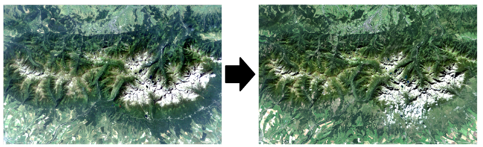
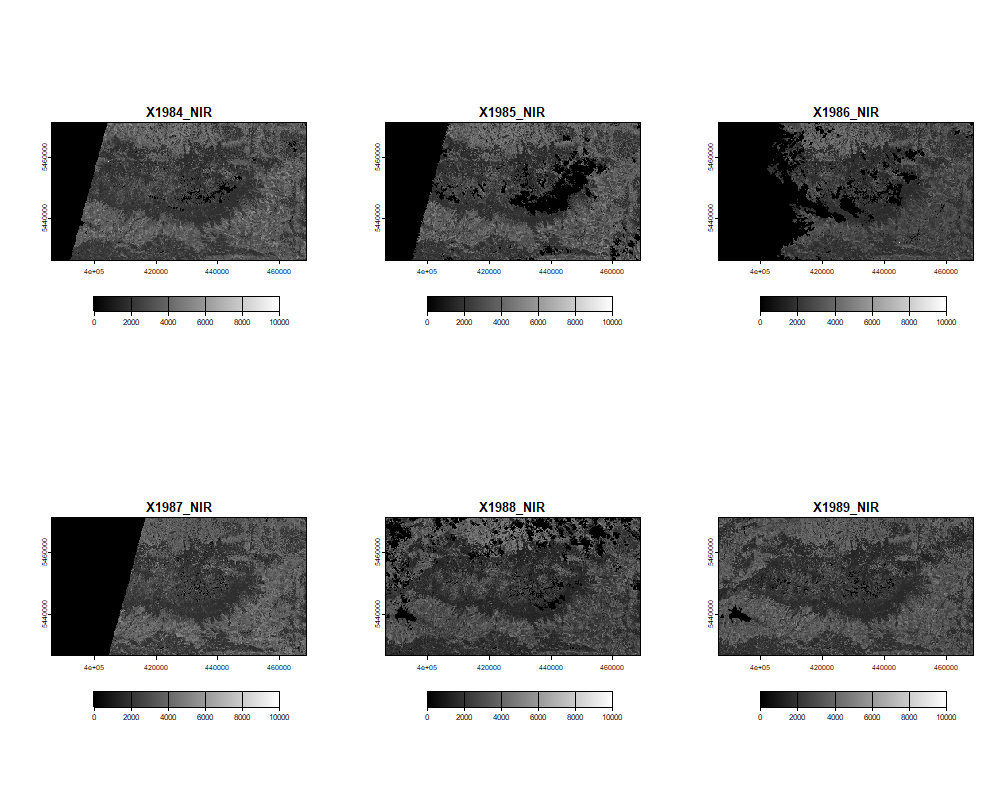
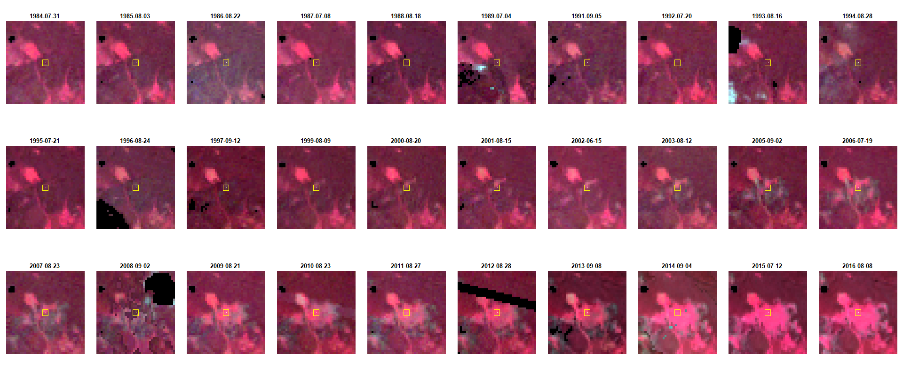
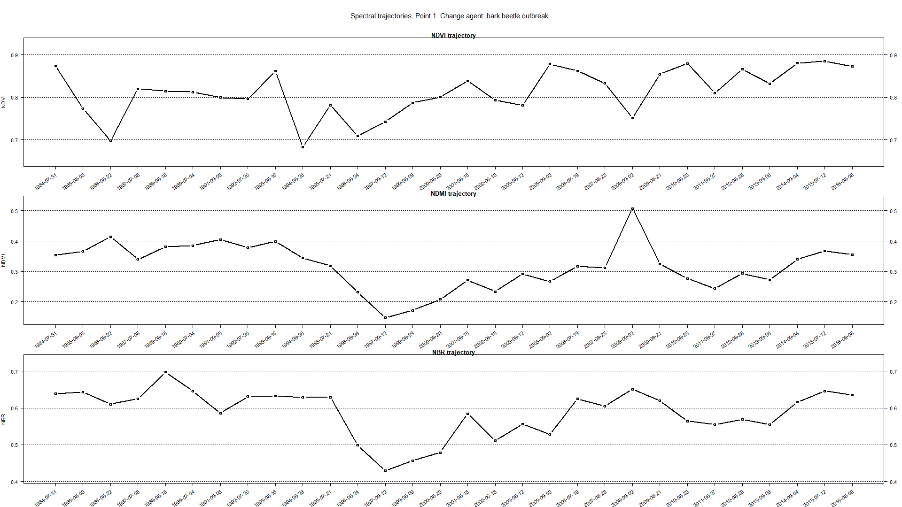
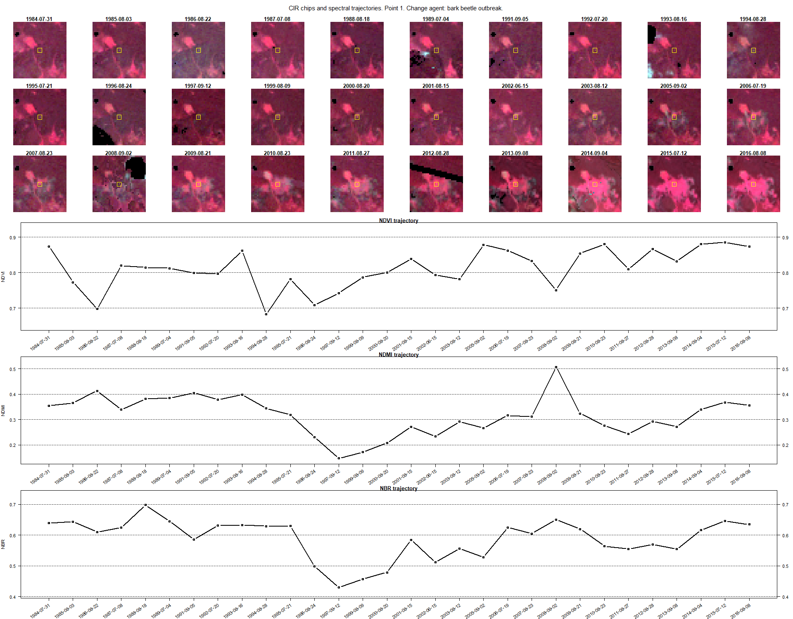
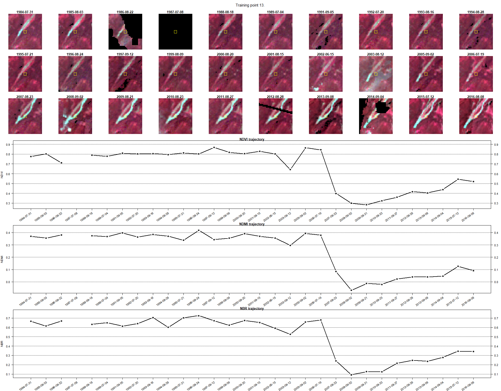

Temporal information in satellite data - Exercise
================

## Exercise - Change Events and Agents in Tatra Mountains

In this exercise, you will undertake a number of tasks associated with identifying **events of changes** visible in the imagery, and attributing **change agents** to these detected events based on the trajectories of selected spectral indices.

The main objective of this exercise is not only to illustrate various examples of change events and change agents, but also to equip you with the skills needed to prepare your own reference datasets. Photointerpretation of imagery chips and charts that present relationships between spectral indices values and ground-level changes are often the only viable sources of data for assessing analysis results, particularly when ground truth data is unavailable.

## Basic preparation

### Prerequisites

For this exercise you will need the following software, data and tools:

- **Software** - R and RStudio. You can access environment setup tutorial for the whole Module 2 here: [R environment setup tutorial](../../software/software_r_language.md). After following the setup guide you should have all the necessary packages installed.
- **Data** - downloaded data provided through [Zenodo](https://zenodo.org/records/10003575)

Follow the suggested working environment setup in order for the provided relative paths to work properly.

### Data

The imagery provided for this exercise comprises a time series of Landsat program satellites 5, 7, and 8 satellite images spanning from 1984 to 2016. This time series is composed of images from summer periods, defined as the timeframe between June 15 and September 15. Images for each available year (with the exceptions of 1990, 1998, and 2004 due to low-quality data - primarily due to high cloud cover) underwent atmospheric and topographic correction using the ATCOR 2/3 software. The outcomes of these corrections were validated using in-situ surface reflectance measurements. Furthermore, these images were harmonized to match the Landsat 8 surface reflectance values using a linear regression derived from the comparison of clear pixel values.

Please note that due to cloud cover during certain periods, selected images (14 out of 30) are composites of two different images. These composites were calculated by using the higher NDVI value between the two images.

<center>



<i>Left: Landsat 5 TM 31.07.1984, RGB 321; right: Landsat 8 OLI 8.09.2016, RGB 432. Landsat imagery courtesy of [the U.S. Geological Survey](https://www.usgs.gov/)/ [Terms of use](https://www.usgs.gov/information-policies-and-instructions/copyrights-and-credits)</i>
</center>

The preprocessing of images resulted in 30 multiband images, each containing six bands corresponding to Landsat 5 bands 1-5, and 7. These bands were subsequently used to calculate spectral indices. For this exercise, you will be utilizing 30-layer raster bricks of bands 4 (NIR), 3 (Red), and 2 (Green) for displaying image chips data, along with vector data with reference points. These points have assigned attributes denoting the year of detected change, change agent, and time series values of three spectral indices: NDVI, NDMI, and NBR.

More information about the data and processing can be found in [Ochtyra et. al, 2020](https://doi.org/10.1016/j.rse.2020.112026).

### Environment preparation

Let’s begin by loading the necessary libraries and datasets, and setting up some initial variables to use down the line.

Firstly, load required libraries into the environment: *terra*, *sf* and *dplyr*.

``` r
# raster I/O and processing
library(terra)

# vector and attribute handling
library(sf) 

# tabular data manipulation
library(dplyr)
```

### Reading data

With the libraries in place, we can now load the necessary data. We’ll begin with three multiband rasters corresponding to the green, red, and NIR bands respectively.

``` r
# multiband raster containing 30 green bands from 1984-2016 period
green <- rast("theme_2_exercise/data_exercise/T2_green_stack.tif") 

# multiband raster containing 30 red bands from 1984-2016 period
red <- rast("theme_2_exercise/data_exercise/T2_red_stack.tif") 

# multiband raster containing 30 NIR bands from 1984-2016 period
nir <- rast("theme_2_exercise/data_exercise/T2_nir_stack.tif") 
```

The bands in the raster bricks are chronologically ordered, with the first layer being the earliest acquired image from 1984 and the last from 2016. Note the missing years.

You can visualize the first couple of bands of one of rasters to get a sense of the overall data extent and band values.

``` r
e <- c(400000, 460000, 5410000, 5415000)
plot(nir, 1:6, 
     col = colorRampPalette(c("black", "white"))(255), 
     range = c(0, 10000), 
     mar = NA,
     plg = list(ext = e, loc = "bottom"))
```

<center>



<i>First six NIR bands.</i>
</center>

We can now create a vector of dates corresponding to each image. Remember that some images are composites, and their assigned date corresponds to the main image that contributes the majority of pixels to the final composite.

``` r
# vector of dates assigned to subsequent raster layers in each band brick
years <- as.Date(c("1984-07-31", "1985-08-03","1986-08-22", "1987-07-08", 
                   "1988-08-18", "1989-07-04", "1991-09-05", "1992-07-20", 
                   "1993-08-16", "1994-08-28", "1995-07-21", "1996-08-24", 
                   "1997-09-12", "1999-08-09", "2000-08-20", "2001-08-15", 
                   "2002-06-15", "2003-08-12", "2005-09-02", "2006-07-19", 
                   "2007-08-23", "2008-09-02", "2009-08-21", "2010-08-23", 
                   "2011-08-27", "2012-08-28", "2013-09-08","2014-09-04", 
                   "2015-07-12", "2016-08-08")) 
```

Finally, let’s load the reference point data into our workspace. Using the `st_read` function from the `sf` package, we can easily import and manipulate the data contained in the attribute table of the vector file.

``` r
# set of 13 reference points with attribute table
points <- st_read(
  "theme_2_exercise/data_exercise/T2_tatra_mountains_change_points.shp") 
```

The reference layer consists of 13 points. Nine of them have attributes regarding the year of change detection and change agent, while all of them have 90 spectral indices values (30 each for NDVI, NDMI, and NBR). The remaining four points, which have missing attribute values, will be used later in this exercise for self-training. For now, we’ll work with only the first nine points.

## Visualising imagery chips and spectral trajectories

### Imagery chips

Having loaded the required data, we can now prepare our plotting environment. The aim is to generate *image chips* — parts of the images surrounding reference points. As an example, we’ll use point number 1 for now, but we’ll later create a loop to process each point.

First, we need to select one of the points and delineate the range of the chip based on its coordinates. In this instance, we’ll use chips with an area of 39x39 pixels.

``` r
# indicate the index (row) of point as read into the environment
point_number <- 1 

# retrieve coordinates from point
point_cords <- st_coordinates(points)[point_number, ]

# retrieve image column, where the point lies
row <- colFromX(green, point_cords[1]) 

# rerieve image row, where the point lies
col <- rowFromY(green, point_cords[2]) 

# set up size of the image chip
window_size <- 39 

# half of the window size
half_widow_size <- floor(window_size / 2) 

# image columns, which will we used for image chip visualisation
col_cords <- (col - half_widow_size) : (col + half_widow_size) 

# image rows, which will we used for image chip visualisation
row_cords <- (row - half_widow_size) : (row + half_widow_size) 
```

Next, we’ll set up the output name for the chip mosaic, initialize the device and prepare plotting grid. Initializing new device is a step that prepares a new blank plotting area, which we will save to our disk after adding elements to it. Our aim is to display chips in a 3-row, 10-column grid, so we’ll set up an appropriate layout.

``` r
# set up output name of the file
output_name <- "theme_2_exercise/results/point_1_chips_example.png"  

# initialize device, plotting area 1920x1080 px, text size 16 points
png(filename = output_name, 
width = 1920, 
height = 800, 
pointsize = 16) 

# plotting area set up as a 3x10 matrix
layout(matrix(seq(1,30),3, 10, byrow = TRUE), heights = c(1,1,1)) 
```

Finally, we can start plotting our chips. In the loop below, we’ll use the 3 raster bricks with **NIR**, **red**, and **green bands** to create 30 NIR/RED/GREEN (color infrared band) composites—one for each year—for the selected point. To visualize each chip with similar parameters, we’ll also trim histogram stretches to preset values. Furthermore, we’ll display the date and location of the selected point for each chip.

``` r
# enable reading pixel values from multiband rasters
readStart(green)
readStart(red)
readStart(nir)

# loop 30 times - once for each raster layer in the brick
for (j in seq(30)){ 
  
  # prepare image slice from the appropriate green raster
  # using previously prepared rows/columns
  o_b1 <- rast(matrix(readValues(green[[j]], 
                                       col = row_cords[1], 
                                       nrows = window_size, 
                                       row = col_cords[1],
                                       ncols = window_size),
                        nrow = window_size, 
                        ncol = window_size, 
                        byrow = TRUE))  
  
  # prepare image slice from the appropriate red raster
  # using previously prepared rows/columns
  o_b2 <- rast(matrix(readValues(red[[j]], 
                                       col = row_cords[1], 
                                       nrows = window_size, 
                                       row = col_cords[1],
                                       ncols = window_size),
                        nrow = window_size, 
                        ncol = window_size, 
                        byrow = TRUE))
  
  # prepare image slice from the appropriate green raster
  # using previously prepared rows/columns
  o_b3 <- rast(matrix(readValues(nir[[j]], 
                                       col = row_cords[1], 
                                       nrows = window_size, 
                                       row = col_cords[1],
                                       ncols = window_size),
                        nrow = window_size, 
                        ncol = window_size, 
                        byrow = TRUE))
  
  # trim histogram of green band for harmonized viewing of the whole set
  b_min <- 10
  b_max <- 1000
  o_b1 <- (o_b1 - b_min) / (b_max - b_min) * 255 
  
  # trim histogram of red band for harmonized viewing of the whole set
  b_min <- 10
  b_max <- 1000
  o_b2 <- (o_b2 - b_min) / (b_max - b_min) * 255 
  
  # trim histogram of NIR band for harmonized viewing of the whole set
  b_min <- 10
  b_max <- 4000
  o_b3 <- (o_b3 - b_min) / (b_max - b_min) * 255 
  
  # convert any negative values to 0 for better viewing
  o_b1[o_b1 < 0] <- 0 
  o_b2[o_b2 < 0] <- 0 
  o_b3[o_b3 < 0] <- 0
  
  # convert any values above 255 to 0
  o_b1[o_b1 > 255] <- 255
  o_b2[o_b2 > 255] <- 255 
  o_b3[o_b3 > 255] <- 255
  
  # set up margins around each of 30 plotting blocks
  par(mar = c(0,1,1,1)) 
  
  # plot RGB chip in the appropriate place in the layout 
  plotRGB(c(o_b3, o_b2, o_b1), 
          r = 1, g = 2, b = 3,
          mar = 1) 
  
  # draw the location of reference point 
  points(20, 19.4, pch = ".", col = c("white"))
  symbols(x = 19.6, 
          y = 19.4, 
          squares = 3, 
          inches = F, 
          add = T, 
          fg = "yellow", 
          lwd = 0.01)
  
  # show date of the image acquisition above the RGB chip
  title(years[j], line = -2) 
 
}

# close files - we read necessary values
readStop(green)
readStop(red)
readStop(nir)

# turn off the device - save .png image to working directory
dev.off() 
```

This is the result after executing the preceding code.

<center>

</center>

You’ll observe that we successfully visualized the entire image time series in one comprehensive layout, facilitating an easier visual comparison between the images.

### Spectral trajectories

Next, we’ll present values for three distinct spectral indices. To accomplish this, we’ll adjust our plotting environment. Additionally, the data preparation phase involves extracting a series of 30 values for each spectral index from the attribute table.

``` r
# set up output name of the file
output_name = "theme_2_exercise/results/point_1_trajectory_example.png" 

png(filename = output_name, width = 1920, height = 1080, pointsize = 16)

# plotting area set up as a 4x1 matrix, 
# which will present as 3 long spanning over the whole plotting area
layout(matrix(seq(1, 4), 4, 1, byrow = TRUE), 
       heights = c(0.25, 1.25, 1.25, 1.25)) 

# the first element of the plot - title; 
# we begin by setting margins of part of the plot 
par(mar = c(0, 0, 0, 0)) 
# new element in the plot, in this case title
plot.new() 

# title will contain point number 
# and change agent retrieved from attribute table
text(0.5, 0.5, 
     paste0("Spectral trajectories. Point ", 
            point_number, 
            ". Change agent: ", 
            points$chng_agnt[point_number], "."), 
     cex = 1.4, 
     font = 1) 

# new margins to use for the rest of the plot
par(mar = c(4, 4, 1, 3)) 

# Add NDVI trajectory
# in this fragment we retrieve spectral index
# values from attribute table of vector file
ndvi_vals <- points[point_number, ] %>% 
  # we use pipe operator to perform several actions;
  # first we pick the desired point from the vector file
  st_drop_geometry() %>% 
  # then we extract just the attribute table 
  # and select only spectral index values
  select(NDVI_1984:NDVI_2016) %>% 
  # in the end we create a vector of values to plot 
  unlist(., use.names = FALSE)


# calculate minimum value - 5%
min_val <- min(ndvi_vals, na.rm = TRUE) - 0.05 * abs(min(ndvi_vals, na.rm = TRUE))
# calculate maximum value + 5%
max_val <- max(ndvi_vals, na.rm = TRUE) + 0.05 * abs(max(ndvi_vals, na.rm = TRUE))
dynamic_range <- c(min_val, max_val)
# calculate where to plot ablines
abline_seq <- seq(floor(min_val / 0.2) * 0.2, ceiling(max_val / 0.2) * 0.2, 
                  by = 0.1)

# we initiate a point-line plot of index values
plot(ndvi_vals, 
     type = "b",
     main = "NDVI trajectory",
     lwd = 2, 
     xlab = "", 
     ylab = "NDVI",
     ylim = dynamic_range, 
     xaxt = "n", 
     yaxt = "n") 

# add y-axis labels on the right side of the plot by 0.1
axis(2, at = seq(floor(min_val), ceiling(max_val), by = 0.1), las = 1)

# add y-axis labels on the left side of the plot
axis(4, at = seq(floor(min_val), ceiling(max_val), by = 0.1), las = 1)

# add tics on x-axis
axis(1, at = 1:30, labels = FALSE) 

# Determine the range of y values
y_range <- diff(dynamic_range)
# Choose a percentage of the range (e.g., 5%) as a buffer
buffer_percent <- 0.1
# Calculate the position for the text labels
text_y_position <- min_val - buffer_percent * y_range

# text with tilted x-axis labels
text(x = 1:30, 
     y = text_y_position, 
     labels = years, 
     srt = 35, 
     adj = 1, 
     xpd = TRUE, 
     cex = 1, 
     font = 1) 

# we can also add some lines in the plot to ease the reading
sapply(abline_seq, function(h) abline(h = h, lty = 3))


# now we repeat the above steps to plot the remaining two trajectories

# Add NDMI trajectory
ndmi_vals <- points[point_number, ] %>%
  st_drop_geometry() %>%
  select(NDMI_1984:NDMI_2016) %>%
  unlist(., use.names = FALSE)


min_val <- min(ndmi_vals, na.rm = TRUE) - 0.05 * abs(min(ndmi_vals, na.rm = TRUE))
max_val <- max(ndmi_vals, na.rm = TRUE) + 0.05 * abs(max(ndmi_vals, na.rm = TRUE))
dynamic_range <- c(min_val, max_val)
abline_seq <- seq(floor(min_val / 0.2) * 0.2, ceiling(max_val / 0.2) * 0.2, 
                  by = 0.1)

plot(ndmi_vals, 
     type = "b",
     main = "NDMI trajectory",
     lwd = 2, 
     xlab = "", 
     ylab = "NDMI",
     ylim = dynamic_range, 
     xaxt = "n", 
     yaxt = "n") 

axis(2, at = seq(floor(min_val), ceiling(max_val), by = 0.1), las = 1)
axis(4, at = seq(floor(min_val), ceiling(max_val), by = 0.1), las = 1)
axis(1, at = 1:30, labels = FALSE)

y_range <- diff(dynamic_range)
buffer_percent <- 0.1
text_y_position <- min_val - buffer_percent * y_range

text(x = 1:30, 
     y = text_y_position, 
     labels = years, 
     srt = 35, 
     adj = 1, 
     xpd = TRUE, 
     cex = 1, 
     font = 1) 

sapply(abline_seq, function(h) abline(h = h, lty = 3))


# Add NBR trajectory
nbr_vals <- points[point_number, ] %>%
  st_drop_geometry() %>%
  select(NBR_1984:NBR_2016) %>%
  unlist(., use.names = FALSE)

min_val <- min(nbr_vals, na.rm = TRUE) - 0.05 * abs(min(nbr_vals, na.rm = TRUE))
max_val <- max(nbr_vals, na.rm = TRUE) + 0.05 * abs(max(nbr_vals, na.rm = TRUE))
dynamic_range <- c(min_val, max_val)
abline_seq <- seq(floor(min_val / 0.2) * 0.2, ceiling(max_val / 0.2) * 0.2,
                  by = 0.1)

plot(nbr_vals, 
     type = "b",
     main = "NBR trajectory",
     lwd = 2, 
     xlab = "", 
     ylab = "NBR",
     ylim = dynamic_range, 
     xaxt = "n", 
     yaxt = "n") 
axis(2, at = seq(floor(min_val), ceiling(max_val), by = 0.1), las = 1)
axis(4, at = seq(floor(min_val), ceiling(max_val), by = 0.1), las = 1)
axis(1, at = 1:30, labels = FALSE) 
y_range <- diff(dynamic_range)
buffer_percent <- 0.1
text_y_position <- min_val - buffer_percent * y_range

text(x = 1:30, 
     y = text_y_position, 
     labels = years, 
     srt = 35, 
     adj = 1, 
     xpd = TRUE, 
     cex = 1, 
     font = 1) 


sapply(abline_seq, function(h) abline(h = h, lty = 3))

# turn off the device - save .png image to working directory
dev.off() 
```

The result of the above chunk of code should look like this.

<center>



</center>

### Merge chips with trajectories

To streamline the process, we’ll encapsulate the aforementioned functions within a loop. This loop will enable the repetitive execution of all the steps for every distinct point, eventually combining the two output images—both chips and trajectories—into a singular cohesive image. While much of the code remains consistent, there will be several modifications to ensure the loop’s smooth operation. These changes in the code will be clearly annotated within the code chunk for clarity.

``` r
# enable reading pixel values from multiband rasters
readStart(green)
readStart(red)
readStart(nir)

# set up window size for all elements which will come out of the loop
window_size <- 39 

# the loop will last till all of the first 9 points in the layer are used
for (i in seq(1, 9)){ 
  
  
  point_cords <- st_coordinates(points)[i, ] 
  row <- colFromX(green, point_cords[1])
  col <- rowFromY(green, point_cords[2])
  
  half_widow_size <- floor(window_size / 2)
  col_cords <- (col - half_widow_size) : (col + half_widow_size)
  row_cords <- (row - half_widow_size) : (row + half_widow_size)
  
  # name of the file will contain information about point 
  # number and change agent
  output_name <- paste0("theme_2_exercise/results/Point ", 
                        i, 
                        ". ", 
                        points$chng_agnt[i], ".png") 
  
  png(filename = output_name, width = 1920, height = 1500, pointsize = 16)
  
  # plot area divided into more parts to fit all of the components
  layout(matrix(c(rep(1, 10), seq(2, 31), rep(32, 10), rep(33, 10), rep(34, 10)),
                7, 10, byrow = TRUE), 
         heights = c(0.25, 1, 1, 1, 2, 2, 2)) 
  
  par(mar = c(0, 0, 0, 0))
  plot.new()
  text(0.5, 0.5, paste0("CIR chips and spectral trajectories. Point ", 
                        i, 
                        ". Change agent: ", 
                        points$chng_agnt[i], "."), 
       cex = 1.4, font = 1)
  
  par(mar = c(0,0,1,0))
  for (j in seq(30)){
    
    
    o_b1 <- rast(matrix(readValues(green[[j]], 
                                   col = row_cords[1], 
                                   nrows = window_size, 
                                   row = col_cords[1],
                                   ncols = window_size),
                        nrow = window_size, 
                        ncol = window_size, 
                        byrow = TRUE))  
    
    
    o_b2 <- rast(matrix(readValues(red[[j]], 
                                   col = row_cords[1], 
                                   nrows = window_size, 
                                   row = col_cords[1],
                                   ncols = window_size),
                        nrow = window_size, 
                        ncol = window_size, 
                        byrow = TRUE))
    
    
    o_b3 <- rast(matrix(readValues(nir[[j]], 
                                   col = row_cords[1], 
                                   nrows = window_size, 
                                   row = col_cords[1],
                                   ncols = window_size),
                        nrow = window_size, 
                        ncol = window_size, 
                        byrow = TRUE))
    
    
    b_min <- 10
    b_max <- 1000
    o_b1 <- (o_b1 - b_min) / (b_max - b_min) * 255 
    
    
    b_min <- 10
    b_max <- 1000
    o_b2 <- (o_b2 - b_min) / (b_max - b_min) * 255 
    
    
    b_min <- 10
    b_max <- 4000
    o_b3 <- (o_b3 - b_min) / (b_max - b_min) * 255 
    
    
    o_b1[o_b1 < 0] <- 0 
    o_b2[o_b2 < 0] <- 0 
    o_b3[o_b3 < 0] <- 0
    
    o_b1[o_b1 > 255] <- 255
    o_b2[o_b2 > 255] <- 255 
    o_b3[o_b3 > 255] <- 255
    
    
    par(mar = c(0,1,1,1)) 
    
    
    plotRGB(c(o_b3, o_b2, o_b1), 
            r = 1, g = 2, b = 3,
            mar = 1) 
    
    
    points(20, 19.4, pch = ".", col = c("white"))
    symbols(x = 19.6, y = 19.4, 
            squares = 3.2, 
            inches = F, 
            add = T, 
            fg = "yellow", 
            lwd = 0.01)
    
    # show date of the image acquisition above the RGB chip
    title(years[j], line = 0.2) 
    
  }
  
  
  par(mar = c(4, 4, 1, 3))
  
  ndvi_vals <- points[i, ] %>% 
    st_drop_geometry() %>% 
    select(NDVI_1984:NDVI_2016) %>% 
    unlist(., use.names = FALSE)
  
  # calculate minimum value - 5%
  min_val <- min(ndvi_vals, na.rm = TRUE) - 0.05 * abs(min(ndvi_vals, na.rm = TRUE))
  # calculate maximum value + 5%
  max_val <- max(ndvi_vals, na.rm = TRUE) + 0.05 * abs(max(ndvi_vals, na.rm = TRUE))
  dynamic_range <- c(min_val, max_val)
  # calculate where to plot ablines
  abline_seq <- seq(floor(min_val / 0.2) * 0.2, ceiling(max_val / 0.2) * 0.2, 
                    by = 0.1)
  
  plot(ndvi_vals, 
       type = "b",
       main = "NDVI trajectory",
       lwd = 2, 
       xlab = "", 
       ylab = "NDVI",
       ylim = dynamic_range, 
       xaxt = "n", 
       yaxt = "n") 
  
  axis(2, at = seq(floor(min_val), ceiling(max_val), by = 0.1), las = 1)
  axis(4, at = seq(floor(min_val), ceiling(max_val), by = 0.1), las = 1)
  axis(1, at = 1:30, labels = FALSE) 
  
  # Determine the range of y values
  y_range <- diff(dynamic_range)
  # Choose a percentage of the range (e.g., 5%) as a buffer
  buffer_percent <- 0.1
  # Calculate the position for the text labels
  text_y_position <- min_val - buffer_percent * y_range
  
  text(x = 1:30, 
       y = text_y_position, 
       labels = years, 
       srt = 35, 
       adj = 1, 
       xpd = TRUE, 
       cex = 1, 
       font = 1) 
  
  sapply(abline_seq, function(h) abline(h = h, lty = 3))
  
  
  ndmi_vals <- points[i, ] %>%
    st_drop_geometry() %>%
    select(NDMI_1984:NDMI_2016) %>%
    unlist(., use.names = FALSE)
  
  min_val <- min(ndmi_vals, na.rm = TRUE) - 0.05 * abs(min(ndmi_vals, na.rm = TRUE))
  max_val <- max(ndmi_vals, na.rm = TRUE) + 0.05 * abs(max(ndmi_vals, na.rm = TRUE))
  dynamic_range <- c(min_val, max_val)
  
  abline_seq <- seq(floor(min_val / 0.2) * 0.2, ceiling(max_val / 0.2) * 0.2,
                    by = 0.1)
  
  plot(ndmi_vals, 
       type = "b",
       main = "NDMI trajectory",
       lwd = 2, 
       xlab = "", 
       ylab = "NDMI",
       ylim = dynamic_range, 
       xaxt = "n", 
       yaxt = "n") 
  
  axis(2, at = seq(floor(min_val), ceiling(max_val), by = 0.1), las = 1)
  axis(4, at = seq(floor(min_val), ceiling(max_val), by = 0.1), las = 1)
  axis(1, at = 1:30, labels = FALSE) 
  y_range <- diff(dynamic_range)
  buffer_percent <- 0.1
  text_y_position <- min_val - buffer_percent * y_range
  text(x = 1:30, y = text_y_position, 
       labels = years, srt = 35, adj = 1, xpd = TRUE, cex = 1, font = 1) 
  sapply(abline_seq, function(h) abline(h = h, lty = 3))
  
  nbr_vals <- points[i, ] %>%
    st_drop_geometry() %>%
    select(NBR_1984:NBR_2016) %>%
    unlist(., use.names = FALSE)
  
  min_val <- min(nbr_vals, na.rm = TRUE) - 0.05 * abs(min(nbr_vals, na.rm = TRUE))
  max_val <- max(nbr_vals, na.rm = TRUE) + 0.05 * abs(max(nbr_vals, na.rm = TRUE))
  dynamic_range <- c(min_val, max_val)
  abline_seq <- seq(floor(min_val / 0.2) * 0.2, ceiling(max_val / 0.2) * 0.2,
                    by = 0.1)
  
  plot(nbr_vals, 
       type = "b",
       main = "NBR trajectory",
       lwd = 2, 
       xlab = "", 
       ylab = "NBR",
       ylim = dynamic_range, 
       xaxt = "n", 
       yaxt = "n") 
  
  axis(2, at = seq(floor(min_val), ceiling(max_val), by = 0.1), las = 1)
  axis(4, at = seq(floor(min_val), ceiling(max_val), by = 0.1), las = 1)
  axis(1, at = 1:30, labels = FALSE) 
  y_range <- diff(dynamic_range)
  buffer_percent <- 0.1
  text_y_position <- min_val - buffer_percent * y_range
  text(x = 1:30, y = text_y_position, 
       labels = years, srt = 35, adj = 1, xpd = TRUE, cex = 1, font = 1) 
  sapply(abline_seq, function(h) abline(h = h, lty = 3))
  
  dev.off() 
  
}

# close files - we read necessary values
readStop(green)
readStop(red)
readStop(nir)
```

The first resulting image should be looking like the example below.

<center>



</center>

### Assesment

Take a moment to thoroughly analyze the resultant nine images. Your primary focus should be on discerning the changes apparent within the chips. Attempt to identify the year of the change through visual interpretation, and cross-reference your findings with the date provided in the attribute table and the image’s title. Additionally, endeavor to associate a change agent with the spectral index that most prominently highlights the change moment. This exercise will prove invaluable for the concluding segment, wherein you’ll be tasked with discerning the date of the change and correlating the change agent autonomously.

## Self training

Having absorbed the insights from the previous segment, let’s now apply this knowledge to a new data set. This data set, however, lacks attributes that specify the year of change and the associated change agent. Your mission? Accurately identify these attributes.

<b><u>TASK</u></b>

- Execute the earlier steps for points 10-13 from `T2_tatra_mountains_change_points` (`points` variable)
- Set `window_size` to 39
- Within the loop, modify `output_name` to `paste0("Training point ", i, ". ", points$chng_agnt[[i]], ".png")`
- Also within the loop, change text displayed inside the image to `paste0("Training point ", i, ".")`
- Initiate the loop to produce chips images for `points[10:13, ]` layer.

------------------------------------------------------------------------

<details>
<summary>
<b>Click here to see the solution.</b><br> Try to solve the task yourself and use the solution if you get stuck or to check if you are on the right way to the solution.
</summary>

Code chunk

``` r
# enable reading pixel values from multiband rasters
readStart(green)
readStart(red)
readStart(nir)

# set up window size for all elements which will come out of the loop
window_size <- 39 

# the loop will last till all of the first 9 points in the layer are used
for (i in seq(10, 13)){ 
  
  
  point_cords <- st_coordinates(points)[i, ] 
  row <- colFromX(green, point_cords[1])
  col <- rowFromY(green, point_cords[2])
  
  half_widow_size <- floor(window_size / 2)
  col_cords <- (col - half_widow_size) : (col + half_widow_size)
  row_cords <- (row - half_widow_size) : (row + half_widow_size)
  
  # name of the file will contain information about point 
  # number and change agent
  output_name <- paste0("theme_2_exercise/results/Training point ", i, ".png") 
  
  png(filename = output_name, width = 1920, height = 1500, pointsize = 16)
  
  # plot area divided into more parts to fit all of the components
  layout(matrix(c(rep(1, 10), seq(2, 31), rep(32, 10), rep(33, 10), rep(34, 10)),
                7, 10, byrow = TRUE), 
         heights = c(0.25, 1, 1, 1, 2, 2, 2)) 
  
  par(mar = c(0, 0, 0, 0))
  plot.new()
  text(0.5, 0.5, paste0("Training point ", i, "."), cex = 1.4, font = 1)
  
  par(mar = c(0,0,1,0))
  for (j in seq(30)){
    
    
    o_b1 <- rast(matrix(readValues(green[[j]], 
                                   col = row_cords[1], 
                                   nrows = window_size, 
                                   row = col_cords[1],
                                   ncols = window_size),
                        nrow = window_size, 
                        ncol = window_size, 
                        byrow = TRUE))  
    
    
    o_b2 <- rast(matrix(readValues(red[[j]], 
                                   col = row_cords[1], 
                                   nrows = window_size, 
                                   row = col_cords[1],
                                   ncols = window_size),
                        nrow = window_size, 
                        ncol = window_size, 
                        byrow = TRUE))
    
    
    o_b3 <- rast(matrix(readValues(nir[[j]], 
                                   col = row_cords[1], 
                                   nrows = window_size, 
                                   row = col_cords[1],
                                   ncols = window_size),
                        nrow = window_size, 
                        ncol = window_size, 
                        byrow = TRUE))
    
    
    b_min <- 10
    b_max <- 1000
    o_b1 <- (o_b1 - b_min) / (b_max - b_min) * 255 
    
    
    b_min <- 10
    b_max <- 1000
    o_b2 <- (o_b2 - b_min) / (b_max - b_min) * 255 
    
    
    b_min <- 10
    b_max <- 4000
    o_b3 <- (o_b3 - b_min) / (b_max - b_min) * 255 
    
    
    o_b1[o_b1 < 0] <- 0 
    o_b2[o_b2 < 0] <- 0 
    o_b3[o_b3 < 0] <- 0
    
    o_b1[o_b1 > 255] <- 255
    o_b2[o_b2 > 255] <- 255 
    o_b3[o_b3 > 255] <- 255
    
    
    par(mar = c(0,1,1,1)) 
    
    
    plotRGB(c(o_b3, o_b2, o_b1), 
            r = 1, g = 2, b = 3,
            mar = 1) 
    
    
    points(20, 19.4, pch = ".", col = c("white"))
    symbols(x = 19.6, y = 19.4,  squares = 3.2, inches = F, add = T, fg = "yellow", lwd = 0.01)
    
    # show date of the image acquisition above the RGB chip
    title(years[j], line = 0.2) 
    
  }
  
  
  par(mar = c(4, 4, 1, 3))
  
  ndvi_vals <- points[i, ] %>% 
    st_drop_geometry() %>% 
    select(NDVI_1984:NDVI_2016) %>% 
    unlist(., use.names = FALSE)
  
  # calculate minimum value - 5%
  min_val <- min(ndvi_vals, na.rm = TRUE) - 0.05 * abs(min(ndvi_vals, na.rm = TRUE))
  # calculate maximum value + 5%
  max_val <- max(ndvi_vals, na.rm = TRUE) + 0.05 * abs(max(ndvi_vals, na.rm = TRUE))
  dynamic_range <- c(min_val, max_val)
  # calculate where to plot ablines
  abline_seq <- seq(floor(min_val / 0.2) * 0.2, ceiling(max_val / 0.2) * 0.2, by = 0.1)
  
  plot(ndvi_vals, 
       type = "b",
       main = "NDVI trajectory",
       lwd = 2, 
       xlab = "", 
       ylab = "NDVI",
       ylim = dynamic_range, 
       xaxt = "n", 
       yaxt = "n") 
  
  axis(2, at = seq(floor(min_val), ceiling(max_val), by = 0.1), las = 1)
  axis(4, at = seq(floor(min_val), ceiling(max_val), by = 0.1), las = 1)
  axis(1, at = 1:30, labels = FALSE) 
  
  # Determine the range of y values
  y_range <- diff(dynamic_range)
  # Choose a percentage of the range (e.g., 5%) as a buffer
  buffer_percent <- 0.1
  # Calculate the position for the text labels
  text_y_position <- min_val - buffer_percent * y_range
  
  text(x = 1:30, 
       y = text_y_position, 
       labels = years, 
       srt = 35, 
       adj = 1, 
       xpd = TRUE, 
       cex = 1, 
       font = 1) 
  
  sapply(abline_seq, function(h) abline(h = h, lty = 3))
  
  
  ndmi_vals <- points[i, ] %>%
    st_drop_geometry() %>%
    select(NDMI_1984:NDMI_2016) %>%
    unlist(., use.names = FALSE)
  
  min_val <- min(ndmi_vals, na.rm = TRUE) - 0.05 * abs(min(ndmi_vals, na.rm = TRUE))
  max_val <- max(ndmi_vals, na.rm = TRUE) + 0.05 * abs(max(ndmi_vals, na.rm = TRUE))
  dynamic_range <- c(min_val, max_val)
  
  abline_seq <- seq(floor(min_val / 0.2) * 0.2, ceiling(max_val / 0.2) * 0.2, by = 0.1)
  
  plot(ndmi_vals, 
       type = "b",
       main = "NDMI trajectory",
       lwd = 2, 
       xlab = "", 
       ylab = "NDMI",
       ylim = dynamic_range, 
       xaxt = "n", 
       yaxt = "n") 
  
  axis(2, at = seq(floor(min_val), ceiling(max_val), by = 0.1), las = 1)
  axis(4, at = seq(floor(min_val), ceiling(max_val), by = 0.1), las = 1)
  axis(1, at = 1:30, labels = FALSE) 
  y_range <- diff(dynamic_range)
  buffer_percent <- 0.1
  text_y_position <- min_val - buffer_percent * y_range
  text(x = 1:30, y = text_y_position, 
       labels = years, srt = 35, adj = 1, xpd = TRUE, cex = 1, font = 1) 
  sapply(abline_seq, function(h) abline(h = h, lty = 3))
  
  nbr_vals <- points[i, ] %>%
    st_drop_geometry() %>%
    select(NBR_1984:NBR_2016) %>%
    unlist(., use.names = FALSE)
  
  min_val <- min(nbr_vals, na.rm = TRUE) - 0.05 * abs(min(nbr_vals, na.rm = TRUE))
  max_val <- max(nbr_vals, na.rm = TRUE) + 0.05 * abs(max(nbr_vals, na.rm = TRUE))
  dynamic_range <- c(min_val, max_val)
  abline_seq <- seq(floor(min_val / 0.2) * 0.2, ceiling(max_val / 0.2) * 0.2, by = 0.1)
  
  plot(nbr_vals, 
       type = "b",
       main = "NBR trajectory",
       lwd = 2, 
       xlab = "", 
       ylab = "NBR",
       ylim = dynamic_range, 
       xaxt = "n", 
       yaxt = "n") 
  
  axis(2, at = seq(floor(min_val), ceiling(max_val), by = 0.1), las = 1)
  axis(4, at = seq(floor(min_val), ceiling(max_val), by = 0.1), las = 1) 
  axis(1, at = 1:30, labels = FALSE) 
  y_range <- diff(dynamic_range)
  buffer_percent <- 0.1
  text_y_position <- min_val - buffer_percent * y_range
  text(x = 1:30, y = text_y_position, 
       labels = years, srt = 35, adj = 1, xpd = TRUE, cex = 1, font = 1) 
  sapply(abline_seq, function(h) abline(h = h, lty = 3))
  
  dev.off() 
  
}

# close files - we read necessary values
readStop(green)
readStop(red)
readStop(nir)
```

</details>

<br>

------------------------------------------------------------------------

This should be the resulting image of the task above - image of point 13.

<div style="display: flex; flex-direction: column; align-items:center;">



</div>

Now try to answer these questions. When you are confident in your answer, expand text to see the correct answers.

<details>
<summary>
Question 1: In what year can we observe the change in Point 13?
</summary>
A1: 2007
</details>
<details>
<summary>
Question 2: What is the most probable cause of change in Point 13?
</summary>
A2: Construction of a ski slope.
</details>

<br>

------------------------------------------------------------------------

<b><u>TRAINING TASK</u></b>

Try to answer similar questions regarding rest of the points in the self training layer. When you are ready check the correct answers here.

<details>
<summary>
Answers
</summary>
Point 10: landslide<br> Point 11: bark beetle outbreak<br> Point 12: windthrow<br>
</details>

------------------------------------------------------------------------

## Data and software credits

### Data

Landsat 5, 7 and 8 imagery courtesy of [the U.S. Geological Survey](https://www.usgs.gov/)/ [Terms of use](https://www.usgs.gov/information-policies-and-instructions/copyrights-and-credits)

### Software

- R Core Team (2023). *R: A language and environment for statistical computing*. R Foundation for Statistical Computing, Vienna, Austria. <https://www.R-project.org/>.
- Hijmans R (2023). *terra: Spatial Data Analysis*. R package version 1.7-39, <https://CRAN.R-project.org/package=terra>
- Pebesma, E., & Bivand, R. (2023). *Spatial Data Science: With Applications in R*. Chapman and Hall/CRC. <https://doi.org/10.1201/9780429459016>
- Pebesma, E., 2018. *Simple Features for R: Standardized Support for Spatial Vector Data*. The R Journal 10 (1), 439-446, <https://doi.org/10.32614/RJ-2018-009>
- Wickham H, François R, Henry L, Müller K, Vaughan D (2023). *dplyr: A Grammar of Data Manipulation*. R package version 1.1.2, <https://CRAN.R-project.org/package=dplyr>

## Source code

<details>
<summary>
You can find the entire code used in this exercise here
</summary>

``` r
# raster processing
library(terra)

# vector and attributes handling
library(sf)

# tabular data manipulation
library(dplyr)


# Multiband raster containing 30 green bands from 1984-2016 period
green <- rast("theme_2_exercise/data_exercise/T2_green_stack.tif") 

# Multiband raster containing 30 red bands from 1984-2016 period
red <- rast("theme_2_exercise/data_exercise/T2_red_stack.tif") 

# Multiband raster containing 30 NIR bands from 1984-2016 period
nir <- rast("theme_2_exercise/data_exercise/T2_nir_stack.tif") 


e <- c(400000, 460000, 5410000, 5415000)
plot(nir, 1:6, 
     col = colorRampPalette(c("black", "white"))(255), 
     range = c(0, 10000), 
     mar = NA,
     plg = list(ext = e, loc = "bottom"))


# vector of dates assigned to subsequent raster layers in each band brick
years <- as.Date(c("1984-07-31", "1985-08-03","1986-08-22", "1987-07-08", "1988-08-18", "1989-07-04", "1991-09-05", "1992-07-20", 
                   "1993-08-16", "1994-08-28", "1995-07-21", "1996-08-24", "1997-09-12", "1999-08-09", "2000-08-20", "2001-08-15", "2002-06-15", 
                   "2003-08-12", "2005-09-02", "2006-07-19", "2007-08-23", "2008-09-02", "2009-08-21", "2010-08-23", "2011-08-27", 
                   "2012-08-28", "2013-09-08","2014-09-04", "2015-07-12", "2016-08-08")) 


# set of 13 reference points with attribute table
points <- st_read("theme_2_exercise/data_exercise/T2_tatra_mountains_change_points.shp") 


# indicate the index (row) of point as read into the environment
point_number <- 1 

# retrieve coordinates from point
point_cords <- st_coordinates(points)[point_number, ]

# retrieve image column, where the point lies
row <- colFromX(green, point_cords[1]) 

# rerieve image row, where the point lies
col <- rowFromY(green, point_cords[2]) 

# set up size of the image chip
window_size <- 39 

# half of the window size
half_widow_size <- floor(window_size / 2) 

# image columns, which will we used for image chip visualisation
col_cords <- (col - half_widow_size) : (col + half_widow_size) 

# image rows, which will we used for image chip visualisation
row_cords <- (row - half_widow_size) : (row + half_widow_size) 


# set up output name of the file
output_name <- "theme_2_exercise/results/point_1_chips_example.png" 

# initialize device, plotting area 1920x1080 px, text size 16 points
png(filename = output_name, 
    width = 1920, 
    height = 800, 
    pointsize = 16) 

# plotting area set up as a 3x10 matrix
layout(matrix(seq(1,30),3, 10, byrow = TRUE), heights = c(1,1,1)) 


# enable reading pixel values from multiband rasters
readStart(green)
readStart(red)
readStart(nir)

# loop 30 times - once for each raster layer in the brick
for (j in seq(30)){ 
  
  
  
  # prepare image slice from the appropriate green raster using previously prepared rows/columns
  o_b1 <- rast(matrix(readValues(green[[j]], 
                                 col = row_cords[1], 
                                 nrows = window_size, 
                                 row = col_cords[1],
                                 ncols = window_size),
                      nrow = window_size, 
                      ncol = window_size, 
                      byrow = TRUE)) 
  
  # prepare image slice from the appropriate red raster using previously prepared rows/columns
  o_b2 <- rast(matrix(readValues(red[[j]], 
                                 col = row_cords[1], 
                                 nrows = window_size, 
                                 row = col_cords[1],
                                 ncols = window_size),
                      nrow = window_size, 
                      ncol = window_size, 
                      byrow = TRUE))
  
  # prepare image slice from the appropriate green raster using previously prepared rows/columns
  o_b3 <- rast(matrix(readValues(nir[[j]], 
                                 col = row_cords[1], 
                                 nrows = window_size, 
                                 row = col_cords[1],
                                 ncols = window_size),
                      nrow = window_size, 
                      ncol = window_size, 
                      byrow = TRUE))
  
  
  
  # trim histogram of green band for harmonized viewing of the whole set
  b_min <- 10
  b_max <- 1000
  o_b1 <- (o_b1 - b_min) / (b_max - b_min) * 255 
  
  # trim histogram of red band for harmonized viewing of the whole set
  b_min <- 10
  b_max <- 1000
  o_b2 <- (o_b2 - b_min) / (b_max - b_min) * 255 
  
  # trim histogram of NIR band for harmonized viewing of the whole set
  b_min <- 10
  b_max <- 4000
  o_b3 <- (o_b3 - b_min) / (b_max - b_min) * 255 
  
  # convert any negative values to 0 for better viewing
  o_b1[o_b1 < 0] <- 0 
  o_b2[o_b2 < 0] <- 0 
  o_b3[o_b3 < 0] <- 0
  
  # convert any values above 255 to 0
  o_b1[o_b1 > 255] <- 255
  o_b2[o_b2 > 255] <- 255 
  o_b3[o_b3 > 255] <- 255
  
  # set up margins around each of 30 plotting blocks
  par(mar = c(0,1,1,1)) 
  
  # plot RGB chip in the appropriate place in the layout 
  plotRGB(c(o_b3, o_b2, o_b1), 
          r = 1, g = 2, b = 3,
          mar = 1) 
  
  # draw the location of reference point 
  points(20, 19.4, pch = ".", col = c("white"))
  symbols(x = 19.6, y = 19.4,  squares = 3, inches = F, add = T, fg = "yellow", lwd = 0.01)
  
  # show date of the image acquisition above the RGB chip
  title(years[j], line = -2) 
  
}

# close files - we read necessary values
readStop(green)
readStop(red)
readStop(nir)

# turn off the device - save .png image to working directory
dev.off() 


# set up output name of the file
output_name = "theme_2_exercise/results/point_1_trajectory_example.png" 

png(filename = output_name, width = 1920, height = 1080, pointsize = 16)

# plotting area set up as a 4x1 matrix, 
# which will present as 3 long spanning over the whole plotting area
layout(matrix(seq(1, 4), 4, 1, byrow = TRUE), 
       heights = c(0.25, 1.25, 1.25, 1.25)) 

# the first element of the plot - title; we begin by setting margins of part of the plot 
par(mar = c(0, 0, 0, 0)) 
# new element in the plot, in this case title
plot.new() 

# title will contain point number and change agent retrieved from attribute table
text(0.5, 0.5, 
     paste0("Spectral trajectories. Point ", point_number, ". Change agent: ", points$chng_agnt[point_number], "."), 
     cex = 1.4, 
     font = 1) 

# new margins to use for the rest of the plot
par(mar = c(4, 4, 1, 3)) 

# Add NDVI trajectory
# in this fragment we retrieve spectral index values from attribute table of vector file
ndvi_vals <- points[point_number, ] %>% 
  # we use pipe operator to perform several actions; first we pick the desired point from the vector file
  st_drop_geometry() %>% 
  # then we extract just the attribute table and select only spectral index values
  select(NDVI_1984:NDVI_2016) %>% 
  # in the end we create a vector of values to plot 
  unlist(., use.names = FALSE)


# calculate minimum value - 5%
min_val <- min(ndvi_vals, na.rm = TRUE) - 0.05 * abs(min(ndvi_vals, na.rm = TRUE))
# calculate maximum value + 5%
max_val <- max(ndvi_vals, na.rm = TRUE) + 0.05 * abs(max(ndvi_vals, na.rm = TRUE))
dynamic_range <- c(min_val, max_val)
# calculate where to plot ablines
abline_seq <- seq(floor(min_val / 0.2) * 0.2, ceiling(max_val / 0.2) * 0.2, by = 0.1)

# we initiate a point-line plot of index values
plot(ndvi_vals, 
     type = "b",
     main = "NDVI trajectory",
     lwd = 2, 
     xlab = "", 
     ylab = "NDVI",
     ylim = dynamic_range, 
     xaxt = "n", 
     yaxt = "n") 

# add y-axis labels on the right side of the plot by 0.1
axis(2, at = seq(floor(min_val), ceiling(max_val), by = 0.1), las = 1)

# add y-axis labels on the left side of the plot
axis(4, at = seq(floor(min_val), ceiling(max_val), by = 0.1), las = 1)

# add tics on x-axis
axis(1, at = 1:30, labels = FALSE) 

# Determine the range of y values
y_range <- diff(dynamic_range)
# Choose a percentage of the range (e.g., 5%) as a buffer
buffer_percent <- 0.1
# Calculate the position for the text labels
text_y_position <- min_val - buffer_percent * y_range

# text with tilted x-axis labels
text(x = 1:30, 
     y = text_y_position, 
     labels = years, 
     srt = 35, 
     adj = 1, 
     xpd = TRUE, 
     cex = 1, 
     font = 1) 

# we can also add some lines in the plot to ease the reading
sapply(abline_seq, function(h) abline(h = h, lty = 3))


# now we repeat the above steps to plot the remaining two trajectories

# Add NDMI trajectory
ndmi_vals <- points[point_number, ] %>%
  st_drop_geometry() %>%
  select(NDMI_1984:NDMI_2016) %>%
  unlist(., use.names = FALSE)


min_val <- min(ndmi_vals, na.rm = TRUE) - 0.05 * abs(min(ndmi_vals, na.rm = TRUE))
max_val <- max(ndmi_vals, na.rm = TRUE) + 0.05 * abs(max(ndmi_vals, na.rm = TRUE))
dynamic_range <- c(min_val, max_val)
abline_seq <- seq(floor(min_val / 0.2) * 0.2, ceiling(max_val / 0.2) * 0.2, by = 0.1)

plot(ndmi_vals, 
     type = "b",
     main = "NDMI trajectory",
     lwd = 2, 
     xlab = "", 
     ylab = "NDMI",
     ylim = dynamic_range, 
     xaxt = "n", 
     yaxt = "n") 

axis(2, at = seq(floor(min_val), ceiling(max_val), by = 0.1), las = 1)
axis(4, at = seq(floor(min_val), ceiling(max_val), by = 0.1), las = 1)
axis(1, at = 1:30, labels = FALSE)

y_range <- diff(dynamic_range)
buffer_percent <- 0.1
text_y_position <- min_val - buffer_percent * y_range

text(x = 1:30, 
     y = text_y_position, 
     labels = years, 
     srt = 35, 
     adj = 1, 
     xpd = TRUE, 
     cex = 1, 
     font = 1) 

sapply(abline_seq, function(h) abline(h = h, lty = 3))


# Add NBR trajectory
nbr_vals <- points[point_number, ] %>%
  st_drop_geometry() %>%
  select(NBR_1984:NBR_2016) %>%
  unlist(., use.names = FALSE)

min_val <- min(nbr_vals, na.rm = TRUE) - 0.05 * abs(min(nbr_vals, na.rm = TRUE))
max_val <- max(nbr_vals, na.rm = TRUE) + 0.05 * abs(max(nbr_vals, na.rm = TRUE))
dynamic_range <- c(min_val, max_val)
abline_seq <- seq(floor(min_val / 0.2) * 0.2, ceiling(max_val / 0.2) * 0.2, by = 0.1)

plot(nbr_vals, 
     type = "b",
     main = "NBR trajectory",
     lwd = 2, 
     xlab = "", 
     ylab = "NBR",
     ylim = dynamic_range, 
     xaxt = "n", 
     yaxt = "n") 
axis(2, at = seq(floor(min_val), ceiling(max_val), by = 0.1), las = 1)
axis(4, at = seq(floor(min_val), ceiling(max_val), by = 0.1), las = 1)
axis(1, at = 1:30, labels = FALSE) 
y_range <- diff(dynamic_range)
buffer_percent <- 0.1
text_y_position <- min_val - buffer_percent * y_range

text(x = 1:30, 
     y = text_y_position, 
     labels = years, 
     srt = 35, 
     adj = 1, 
     xpd = TRUE, 
     cex = 1, 
     font = 1) 


sapply(abline_seq, function(h) abline(h = h, lty = 3))

# turn off the device - save .png image to working directory
dev.off() 


# enable reading pixel values from multiband rasters
readStart(green)
readStart(red)
readStart(nir)

# set up window size for all elements which will come out of the loop
window_size <- 39 

# the loop will last till all of the first 9 points in the layer are used
for (i in seq(1, 9)){ 
  
  
  point_cords <- st_coordinates(points)[i, ] 
  row <- colFromX(green, point_cords[1])
  col <- rowFromY(green, point_cords[2])
  
  half_widow_size <- floor(window_size / 2)
  col_cords <- (col - half_widow_size) : (col + half_widow_size)
  row_cords <- (row - half_widow_size) : (row + half_widow_size)
  
  # name of the file will contain information about point 
  # number and change agent
  output_name <- paste0("theme_2_exercise/results/Point ", i, ". ", points$chng_agnt[i], ".png") 
  
  png(filename = output_name, width = 1920, height = 1500, pointsize = 16)
  
  layout(matrix(c(rep(1, 10), seq(2, 31), rep(32, 10), rep(33, 10), rep(34, 10)),
                7, 10, byrow = TRUE), 
         heights = c(0.25, 1, 1, 1, 2, 2, 2)) # plot area divided into more parts to fit all of the components
  
  par(mar = c(0, 0, 0, 0))
  plot.new()
  text(0.5, 0.5, paste0("CIR chips and spectral trajectories. Point ", i, ". Change agent: ", points$chng_agnt[i], "."), cex = 1.4, font = 1)
  
  par(mar = c(0,0,1,0))
  for (j in seq(30)){
    
    
    o_b1 <- rast(matrix(readValues(green[[j]], 
                                   col = row_cords[1], 
                                   nrows = window_size, 
                                   row = col_cords[1],
                                   ncols = window_size),
                        nrow = window_size, 
                        ncol = window_size, 
                        byrow = TRUE))  
    
    
    o_b2 <- rast(matrix(readValues(red[[j]], 
                                   col = row_cords[1], 
                                   nrows = window_size, 
                                   row = col_cords[1],
                                   ncols = window_size),
                        nrow = window_size, 
                        ncol = window_size, 
                        byrow = TRUE))
    
    
    o_b3 <- rast(matrix(readValues(nir[[j]], 
                                   col = row_cords[1], 
                                   nrows = window_size, 
                                   row = col_cords[1],
                                   ncols = window_size),
                        nrow = window_size, 
                        ncol = window_size, 
                        byrow = TRUE))
    
    
    b_min <- 10
    b_max <- 1000
    o_b1 <- (o_b1 - b_min) / (b_max - b_min) * 255 
    
    
    b_min <- 10
    b_max <- 1000
    o_b2 <- (o_b2 - b_min) / (b_max - b_min) * 255 
    
    
    b_min <- 10
    b_max <- 4000
    o_b3 <- (o_b3 - b_min) / (b_max - b_min) * 255 
    
    
    o_b1[o_b1 < 0] <- 0 
    o_b2[o_b2 < 0] <- 0 
    o_b3[o_b3 < 0] <- 0
    
    o_b1[o_b1 > 255] <- 255
    o_b2[o_b2 > 255] <- 255 
    o_b3[o_b3 > 255] <- 255
    
    
    par(mar = c(0,1,1,1)) 
    
    
    plotRGB(c(o_b3, o_b2, o_b1), 
            r = 1, g = 2, b = 3,
            mar = 1) 
    
    
    points(20, 19.4, pch = ".", col = c("white"))
    symbols(x = 19.6, y = 19.4,  squares = 3.2, inches = F, add = T, fg = "yellow", lwd = 0.01)
    
    # show date of the image acquisition above the RGB chip
    title(years[j], line = 0.2) 
    
  }
  
  
  par(mar = c(4, 4, 1, 3))
  
  ndvi_vals <- points[i, ] %>% 
    st_drop_geometry() %>% 
    select(NDVI_1984:NDVI_2016) %>% 
    unlist(., use.names = FALSE)
  
  # calculate minimum value - 5%
  min_val <- min(ndvi_vals, na.rm = TRUE) - 0.05 * abs(min(ndvi_vals, na.rm = TRUE))
  # calculate maximum value + 5%
  max_val <- max(ndvi_vals, na.rm = TRUE) + 0.05 * abs(max(ndvi_vals, na.rm = TRUE))
  dynamic_range <- c(min_val, max_val)
  # calculate where to plot ablines
  abline_seq <- seq(floor(min_val / 0.2) * 0.2, ceiling(max_val / 0.2) * 0.2, by = 0.1)
  
  plot(ndvi_vals, 
       type = "b",
       main = "NDVI trajectory",
       lwd = 2, 
       xlab = "", 
       ylab = "NDVI",
       ylim = dynamic_range, 
       xaxt = "n", 
       yaxt = "n") 
  
  axis(2, at = seq(floor(min_val), ceiling(max_val), by = 0.1), las = 1)
  axis(4, at = seq(floor(min_val), ceiling(max_val), by = 0.1), las = 1)
  axis(1, at = 1:30, labels = FALSE) 
  
  # Determine the range of y values
  y_range <- diff(dynamic_range)
  # Choose a percentage of the range (e.g., 5%) as a buffer
  buffer_percent <- 0.1
  # Calculate the position for the text labels
  text_y_position <- min_val - buffer_percent * y_range
  
  text(x = 1:30, 
       y = text_y_position, 
       labels = years, 
       srt = 35, 
       adj = 1, 
       xpd = TRUE, 
       cex = 1, 
       font = 1) 
  
  sapply(abline_seq, function(h) abline(h = h, lty = 3))
  
  
  ndmi_vals <- points[i, ] %>%
    st_drop_geometry() %>%
    select(NDMI_1984:NDMI_2016) %>%
    unlist(., use.names = FALSE)
  
  min_val <- min(ndmi_vals, na.rm = TRUE) - 0.05 * abs(min(ndmi_vals, na.rm = TRUE))
  max_val <- max(ndmi_vals, na.rm = TRUE) + 0.05 * abs(max(ndmi_vals, na.rm = TRUE))
  dynamic_range <- c(min_val, max_val)
  
  abline_seq <- seq(floor(min_val / 0.2) * 0.2, ceiling(max_val / 0.2) * 0.2, by = 0.1)
  
  plot(ndmi_vals, 
       type = "b",
       main = "NDMI trajectory",
       lwd = 2, 
       xlab = "", 
       ylab = "NDMI",
       ylim = dynamic_range, 
       xaxt = "n", 
       yaxt = "n") 
  
  axis(2, at = seq(floor(min_val), ceiling(max_val), by = 0.1), las = 1)
  axis(4, at = seq(floor(min_val), ceiling(max_val), by = 0.1), las = 1)
  axis(1, at = 1:30, labels = FALSE) 
  y_range <- diff(dynamic_range)
  buffer_percent <- 0.1
  text_y_position <- min_val - buffer_percent * y_range
  text(x = 1:30, y = text_y_position, 
       labels = years, srt = 35, adj = 1, xpd = TRUE, cex = 1, font = 1) 
  sapply(abline_seq, function(h) abline(h = h, lty = 3))
  
  nbr_vals <- points[i, ] %>%
    st_drop_geometry() %>%
    select(NBR_1984:NBR_2016) %>%
    unlist(., use.names = FALSE)
  
  min_val <- min(nbr_vals, na.rm = TRUE) - 0.05 * abs(min(nbr_vals, na.rm = TRUE))
  max_val <- max(nbr_vals, na.rm = TRUE) + 0.05 * abs(max(nbr_vals, na.rm = TRUE))
  dynamic_range <- c(min_val, max_val)
  abline_seq <- seq(floor(min_val / 0.2) * 0.2, ceiling(max_val / 0.2) * 0.2, by = 0.1)
  
  plot(nbr_vals, 
       type = "b",
       main = "NBR trajectory",
       lwd = 2, 
       xlab = "", 
       ylab = "NBR",
       ylim = dynamic_range, 
       xaxt = "n", 
       yaxt = "n") 
  
  axis(2, at = seq(floor(min_val), ceiling(max_val), by = 0.1), las = 1)
  axis(4, at = seq(floor(min_val), ceiling(max_val), by = 0.1), las = 1)
  axis(1, at = 1:30, labels = FALSE) 
  y_range <- diff(dynamic_range)
  buffer_percent <- 0.1
  text_y_position <- min_val - buffer_percent * y_range
  text(x = 1:30, y = text_y_position, 
       labels = years, srt = 35, adj = 1, xpd = TRUE, cex = 1, font = 1) 
  sapply(abline_seq, function(h) abline(h = h, lty = 3))
  
  dev.off() 
  
}

# close files - we read necessary values
readStop(green)
readStop(red)
readStop(nir)


# enable reading pixel values from multiband rasters
readStart(green)
readStart(red)
readStart(nir)

# set up window size for all elements which will come out of the loop
window_size <- 39 

# the loop will last till all of the first 9 points in the layer are used
for (i in seq(10, 13)){ 
  
  
  point_cords <- st_coordinates(points)[i, ] 
  row <- colFromX(green, point_cords[1])
  col <- rowFromY(green, point_cords[2])
  
  half_widow_size <- floor(window_size / 2)
  col_cords <- (col - half_widow_size) : (col + half_widow_size)
  row_cords <- (row - half_widow_size) : (row + half_widow_size)
  
  # name of the file will contain information about point 
  # number and change agent
  output_name <- paste0("theme_2_exercise/results/Training point ", i, ".png") 
  
  png(filename = output_name, width = 1920, height = 1500, pointsize = 16)
  
  layout(matrix(c(rep(1, 10), seq(2, 31), rep(32, 10), rep(33, 10), rep(34, 10)),
                7, 10, byrow = TRUE), 
         heights = c(0.25, 1, 1, 1, 2, 2, 2)) # plot area divided into more parts to fit all of the components
  
  par(mar = c(0, 0, 0, 0))
  plot.new()
  text(0.5, 0.5, paste0("Training point ", i, "."), cex = 1.4, font = 1)
  
  par(mar = c(0,0,1,0))
  for (j in seq(30)){
    
    
    o_b1 <- rast(matrix(readValues(green[[j]], 
                                   col = row_cords[1], 
                                   nrows = window_size, 
                                   row = col_cords[1],
                                   ncols = window_size),
                        nrow = window_size, 
                        ncol = window_size, 
                        byrow = TRUE))  
    
    
    o_b2 <- rast(matrix(readValues(red[[j]], 
                                   col = row_cords[1], 
                                   nrows = window_size, 
                                   row = col_cords[1],
                                   ncols = window_size),
                        nrow = window_size, 
                        ncol = window_size, 
                        byrow = TRUE))
    
    
    o_b3 <- rast(matrix(readValues(nir[[j]], 
                                   col = row_cords[1], 
                                   nrows = window_size, 
                                   row = col_cords[1],
                                   ncols = window_size),
                        nrow = window_size, 
                        ncol = window_size, 
                        byrow = TRUE))
    
    
    b_min <- 10
    b_max <- 1000
    o_b1 <- (o_b1 - b_min) / (b_max - b_min) * 255 
    
    
    b_min <- 10
    b_max <- 1000
    o_b2 <- (o_b2 - b_min) / (b_max - b_min) * 255 
    
    
    b_min <- 10
    b_max <- 4000
    o_b3 <- (o_b3 - b_min) / (b_max - b_min) * 255 
    
    
    o_b1[o_b1 < 0] <- 0 
    o_b2[o_b2 < 0] <- 0 
    o_b3[o_b3 < 0] <- 0
    
    o_b1[o_b1 > 255] <- 255
    o_b2[o_b2 > 255] <- 255 
    o_b3[o_b3 > 255] <- 255
    
    
    par(mar = c(0,1,1,1)) 
    
    
    plotRGB(c(o_b3, o_b2, o_b1), 
            r = 1, g = 2, b = 3,
            mar = 1) 
    
    
    points(20, 19.4, pch = ".", col = c("white"))
    symbols(x = 19.6, y = 19.4,  squares = 3.2, inches = F, add = T, fg = "yellow", lwd = 0.01)
    
    # show date of the image acquisition above the RGB chip
    title(years[j], line = 0.2) 
    
  }
  
  
  par(mar = c(4, 4, 1, 3))
  
  ndvi_vals <- points[i, ] %>% 
    st_drop_geometry() %>% 
    select(NDVI_1984:NDVI_2016) %>% 
    unlist(., use.names = FALSE)
  
  # calculate minimum value - 5%
  min_val <- min(ndvi_vals, na.rm = TRUE) - 0.05 * abs(min(ndvi_vals, na.rm = TRUE))
  # calculate maximum value + 5%
  max_val <- max(ndvi_vals, na.rm = TRUE) + 0.05 * abs(max(ndvi_vals, na.rm = TRUE))
  dynamic_range <- c(min_val, max_val)
  # calculate where to plot ablines
  abline_seq <- seq(floor(min_val / 0.2) * 0.2, ceiling(max_val / 0.2) * 0.2, by = 0.1)
  
  plot(ndvi_vals, 
       type = "b",
       main = "NDVI trajectory",
       lwd = 2, 
       xlab = "", 
       ylab = "NDVI",
       ylim = dynamic_range, 
       xaxt = "n", 
       yaxt = "n") 
  
  axis(2, at = seq(floor(min_val), ceiling(max_val), by = 0.1), las = 1)
  axis(4, at = seq(floor(min_val), ceiling(max_val), by = 0.1), las = 1)
  axis(1, at = 1:30, labels = FALSE) 
  
  # Determine the range of y values
  y_range <- diff(dynamic_range)
  # Choose a percentage of the range (e.g., 5%) as a buffer
  buffer_percent <- 0.1
  # Calculate the position for the text labels
  text_y_position <- min_val - buffer_percent * y_range
  
  text(x = 1:30, 
       y = text_y_position, 
       labels = years, 
       srt = 35, 
       adj = 1, 
       xpd = TRUE, 
       cex = 1, 
       font = 1) 
  
  sapply(abline_seq, function(h) abline(h = h, lty = 3))
  
  
  ndmi_vals <- points[i, ] %>%
    st_drop_geometry() %>%
    select(NDMI_1984:NDMI_2016) %>%
    unlist(., use.names = FALSE)
  
  min_val <- min(ndmi_vals, na.rm = TRUE) - 0.05 * abs(min(ndmi_vals, na.rm = TRUE))
  max_val <- max(ndmi_vals, na.rm = TRUE) + 0.05 * abs(max(ndmi_vals, na.rm = TRUE))
  dynamic_range <- c(min_val, max_val)
  
  abline_seq <- seq(floor(min_val / 0.2) * 0.2, ceiling(max_val / 0.2) * 0.2, by = 0.1)
  
  plot(ndmi_vals, 
       type = "b",
       main = "NDMI trajectory",
       lwd = 2, 
       xlab = "", 
       ylab = "NDMI",
       ylim = dynamic_range, 
       xaxt = "n", 
       yaxt = "n") 
  
  axis(2, at = seq(floor(min_val), ceiling(max_val), by = 0.1), las = 1)
  axis(4, at = seq(floor(min_val), ceiling(max_val), by = 0.1), las = 1)
  axis(1, at = 1:30, labels = FALSE) 
  y_range <- diff(dynamic_range)
  buffer_percent <- 0.1
  text_y_position <- min_val - buffer_percent * y_range
  text(x = 1:30, y = text_y_position, 
       labels = years, srt = 35, adj = 1, xpd = TRUE, cex = 1, font = 1) 
  sapply(abline_seq, function(h) abline(h = h, lty = 3))
  
  nbr_vals <- points[i, ] %>%
    st_drop_geometry() %>%
    select(NBR_1984:NBR_2016) %>%
    unlist(., use.names = FALSE)
  
  min_val <- min(nbr_vals, na.rm = TRUE) - 0.05 * abs(min(nbr_vals, na.rm = TRUE))
  max_val <- max(nbr_vals, na.rm = TRUE) + 0.05 * abs(max(nbr_vals, na.rm = TRUE))
  dynamic_range <- c(min_val, max_val)
  abline_seq <- seq(floor(min_val / 0.2) * 0.2, ceiling(max_val / 0.2) * 0.2, by = 0.1)
  
  plot(nbr_vals, 
       type = "b",
       main = "NBR trajectory",
       lwd = 2, 
       xlab = "", 
       ylab = "NBR",
       ylim = dynamic_range, 
       xaxt = "n", 
       yaxt = "n") 
  
  axis(2, at = seq(floor(min_val), ceiling(max_val), by = 0.1), las = 1)
  axis(4, at = seq(floor(min_val), ceiling(max_val), by = 0.1), las = 1) 
  axis(1, at = 1:30, labels = FALSE) 
  y_range <- diff(dynamic_range)
  buffer_percent <- 0.1
  text_y_position <- min_val - buffer_percent * y_range
  text(x = 1:30, y = text_y_position, 
       labels = years, srt = 35, adj = 1, xpd = TRUE, cex = 1, font = 1) 
  sapply(abline_seq, function(h) abline(h = h, lty = 3))
  
  dev.off() 
  
}

# close files - we read necessary values
readStop(green)
readStop(red)
readStop(nir)

```

</details>

### This is the end of this exercise. Proceed with other Themes and Exercises. Good luck!
