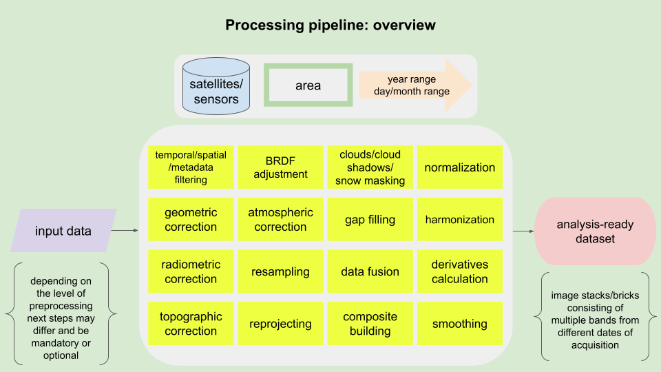
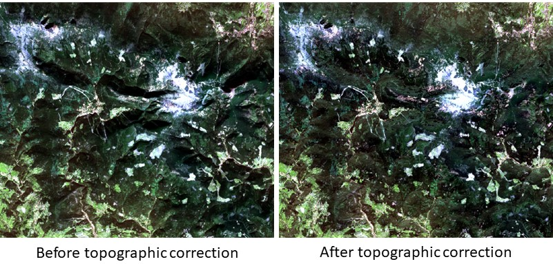
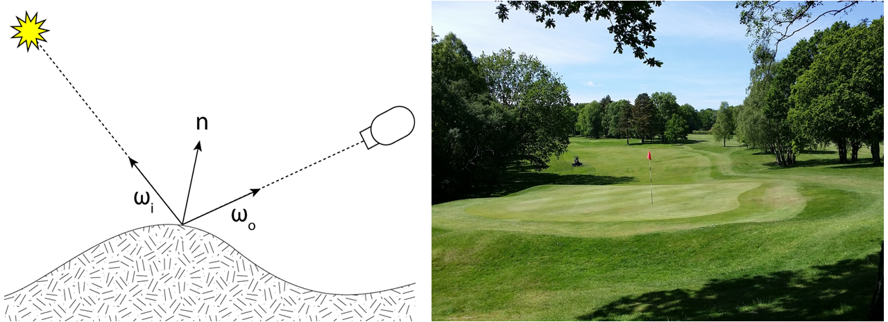
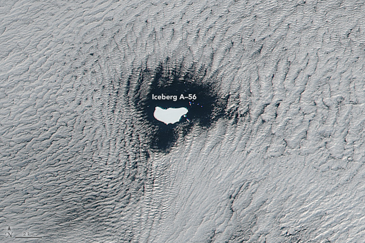
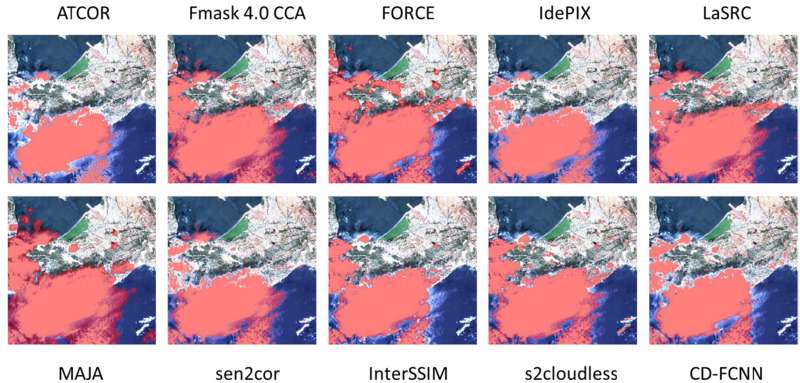
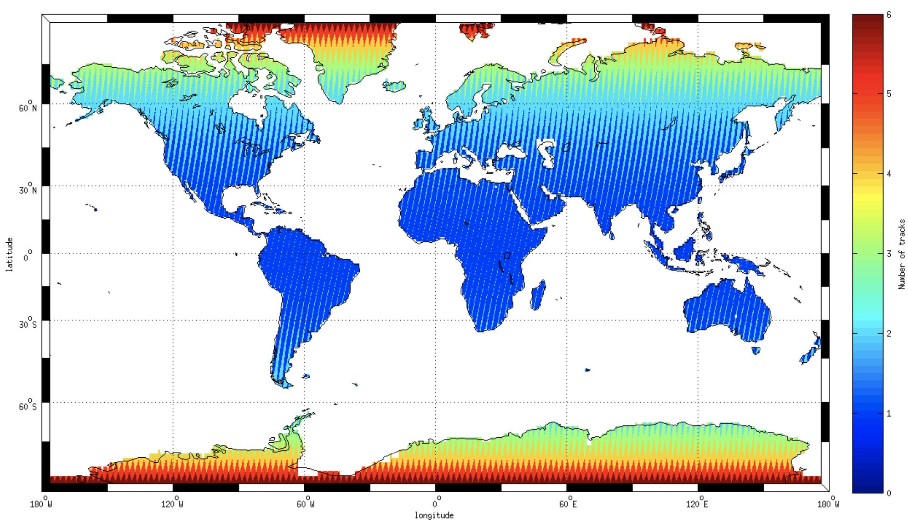
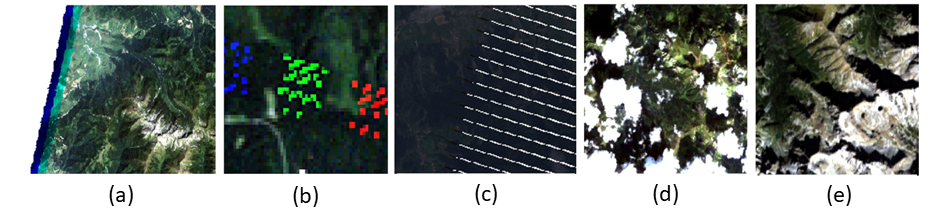
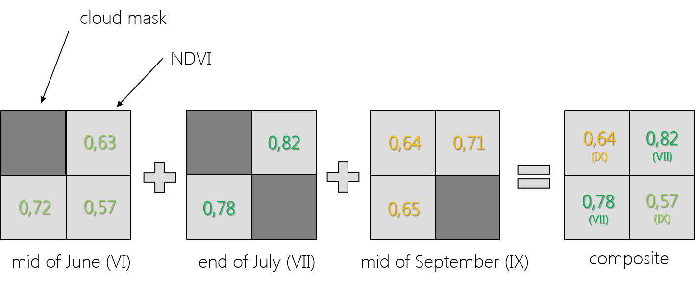
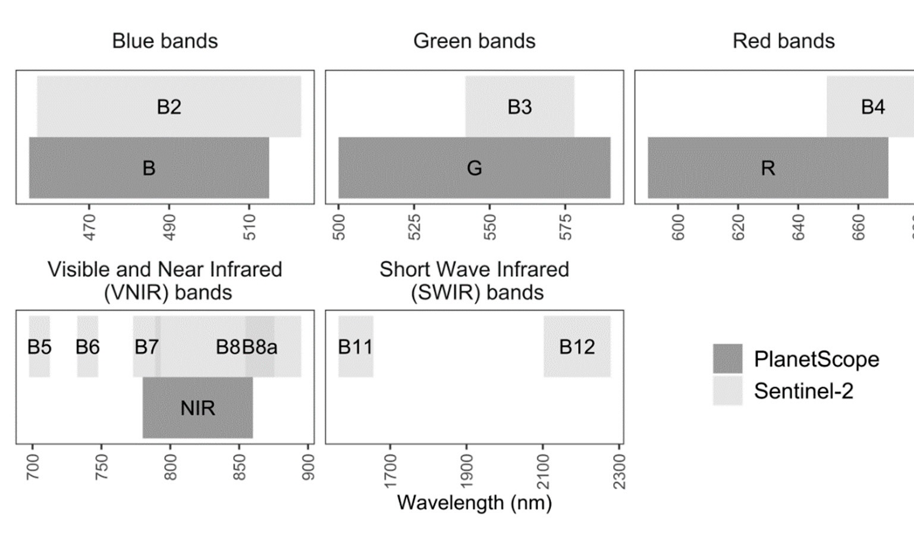
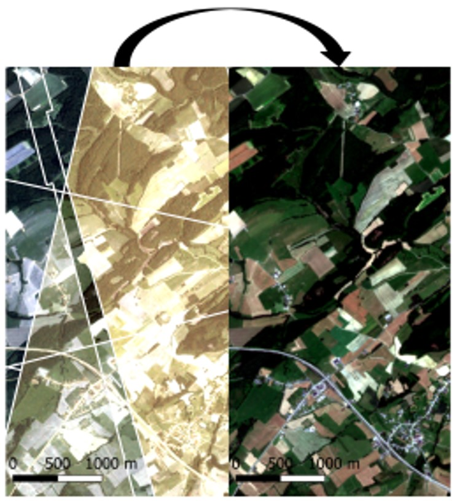

Image processing
================

Preprocessing of the images is a crucial step in remote sensing data analysis. Any defects of data will have an impact on the accuracy of results. Before using any dataset we recommend you to read the data manual which helps you select the proper **processing pipeline** for your certain purpose. Preparing images for analysis is often the most time consuming and computationally intensive part of dealing with remote sensing data, so it is essential to apply necessary tools and algorithms thoughtfully.

In this theme you will learn about:

- **[goals of automating processes](#goals-of-automating-processes)**
- **[radiometric and geometric correction](#radiometric-and-geometric-correction)**
- **[unwanted areas detection and masking](#unwanted-areas-detection-and-masking)**
- **[missing information reconstruction](#missing-information-reconstruction)**
- **[data fusion](#data-fusion)**
- **[data harmonization / normalization](#data-harmonization--normalization)**
- **[tools and algorithms used with satellite multispectral image/time series processing](#overview-of-tools-and-algorithms-used-with-satellite-multispectral-imagetime-series-processing)**

This theme will conclude with:

- **[Self-evaluation quiz](#self-evaluation-quiz)**
- **[References](#references)**

To consolidate your knowledge and test it in more practical environment complete the **[Exercise](03_image_processing_exercise.md)**.

After finishing this theme you will:

- understand the importance of preprocessing images in remote sensing data analysis
- recognize the impact of data defects on the accuracy of analysis results
- know the significance of reading the data manual to select the appropriate processing pipeline for your specific purpose
- be aware of the time-consuming nature of preparing images for analysis and the need for thoughtful application of tools and algorithms
- learn the steps involved in automating image processing to save time and ensure standardized data production
- understand the need for appropriate correction for quantitative and multitemporal analysis of satellite data
- understand the significance of cloud masking in optical data processing and the various methods used for detecting and masking clouds
- gain insights into missing information reconstruction techniques, such as gap filling and data fusion, to ensure complete and reliable time series analysis
- be introduced to data fusion
- familiarize yourself with various widely used tools, algorithms and packages

## Goals of automating processes

Before time series analysis we need to select proper data which covers the area of interest and time period. Then images should be calibrated radiometrically to convert Digital Numbers (DN; amount of registered energy) to physical quantity as radiance and in second step **reflectance**. Images in time series should be fitted geometrically so sometimes must be co-registered to improve their **geometric consistency**. Optical data processing is also related to **clouds masking**. If the images are acquired by two or more different sensors they need to be **harmonized** due to differences between their spatial, spectral and radiometric resolutions. We can use **all available images** for the analyzed period or **time composites** created based on images from sub-periods. All these steps are important but also laborious and time consuming, especially when we deal with dense time series and areas of large spatial extent (countries or continents). Hence, the main goal of using automation of image processing is **saving time** and producing the data in a **standardized** manner.

The exercise in this theme will show you how to prepare satellite image time series using different pipelines in mostly automatic way using code editor, so you can focus more on **results interpretation** and spend less time clicking the same buttons in graphical software whenever you process a new image.

<i>Processing pipeline overview (figure by course authors).</i>

## Radiometric and geometric correction

For quantitative, multitemporal analyzes on satellite data or on data from various sensors, geometric and radiometric correction is necessary. Pixel values on raw images are expressed in DN which depend on strength of the signal (amount of energy) arriving at the certain physical sensor pixel. Such images can be analysed and compared visually but when it will be used as part of a time series it should be **calibrated and corrected**. Calibration process converts DN to top of atmosphere (TOA) radiance (units: W m−2 sr−1 μm−1), then it can be converted to top of atmosphere reflectance. Such data are still affected by atmospheric effects like scattering, absorption or emission of radiation. To avoid atmosphere influence the images are atmospherically corrected (via absolute or relative atmospheric correction methods, utilizing time-dependent parameters and image-based information, respectively) and in result pixels present values of **surface reflectance (SR)**.

If we are processing images for rugged terrain we also need to perform **topographic correction** due to differences in illumination of areas located on various aspects and slopes. For example, the same cover type on slopes oriented away from and towards the sun will appear darker and brighter, respectively, if compared to a horizontal geometry ([Richter et al., 2009](https://doi.org/10.3390/rs1030184)). Those differences can cause errors in analysis results of even one image. Illumination conditions strictly depend on solar elevation and azimuth angles which obviously change between different dates of acquisition so in case of time series analysis is important to reduce its impact.

<i>Sentinel-2 data L1C product, before and after topographic correction (Karkonosze Mountains area, RGB composite from 10.10.2021. Figure by course authors, source of image: [European Space Agency - ESA](https://dataspace.copernicus.eu/)/ [Terms of use](https://dataspace.copernicus.eu/terms-and-conditions)).</i>

Another key factor which should be considered during satellite image processing is impact of direction of incident irradiance and sensor viewing angle. Both of these are expressed by azimuth and zenith angles and described by **Bidirectional Reflectance Distribution Function (BRDF)**.

<i>Left: Bidirectional Reflectance Distribution Function concept (figure by [Commons Wikimedia](https://commons.wikimedia.org/wiki/Category:Bidirectional_reflectance_distribution_function#/media/File:BRDF_Diagram.png)/ [CC BY-SA 3.0](https://creativecommons.org/licenses/by-sa/3.0/)), right: the example of BRDF as pattern seen on the grass of a golf course after mowing (figure by [Pixabay](https://pixabay.com/photos/golf-golf-course-green-grass-787473/)).</i>

**Geometric matching** of images is a key element of monitoring changes, its absence will result in the detection of false changes that do not result from changes in object features, but from image shifts. Imagery geometry errors can be systematic and random ([Lillesand et al., 2015](https://www.wiley.com/en-us/Remote+Sensing+and+Image+Interpretation,+7th+Edition-p-9781118343289)). The first results from the rotation of the Earth or distortion of the optical system and are relatively easy to correct using an appropriate mathematical model. Random errors result from changes in the height of the orbit and tilts of the optical axis from the vertical and rotation of the platform. They can be corrected on the basis of recorded data concerning the path of the platform’s movement (**parametric methods**) or with the use of ground control points (GCPs) and Digital Terrain Model (DTM, **non-parametric methods**).

## Unwanted areas detection and masking

Automatic process of unwanted areas such as clouds, shadows and seasonal snow masking on satellite images is the first step of time series data processing after corrections. In the data selection stage the information about the percentage coverage of the scene with clouds is crucial. If the whole image is 90% under clouds you have still a 10% chance that your area of interest is clear (see illustrative example in Figure below). This information becomes even more important when we consider multitemporal analysis, where in each of the multiple images this coverage will be different.

<i>Low stratus clouds framing iceberg A-56 drifted in the South Atlantic Ocean ([VIIRS NASA figure by J. Schmaltz, LANCE/EOSDIS Rapid Response](https://www.earthdata.nasa.gov/learn/find-data/near-real-time/rapid-response)/ [Terms of use](https://www.earthdata.nasa.gov/learn/use-data/data-use-policy), source: [NASA Earth Observatory](https://earthobservatory.nasa.gov/images/88136/clouds-frame-iceberg-a-56)/ [Terms of use](https://earthobservatory.nasa.gov/image-use-policy)).</i>

Using the information about the percentage coverage with clouds we can **filter** metadata or **mask** the images (we will show you both approaches in the **[Exercise](03_image_processing_exercise.md)**). The first one means that we can automatically choose the date that has the least cloud coverage within our specific area of interest and time range. The second one is oriented on excluding the areas covered by clouds by equalizing pixel values into binary flags (clouds occurrence and no-occurence). In this process the assumption is that clouds differ from the underlying Earth surface in terms of spectral characteristics and they are brighter and colder than these other areas. Commonly used approaches is the selection of cloud **probability threshold** for defining cloud/non-cloud masks. One of the most popular algorithms is [Fmask](https://github.com/GERSL/Fmask) ([Zhu, Woodcock, 2012](https://doi.org/10.1016/j.rse.2011.10.028)) which uses all spectral bands, NDVI and Normalized Difference Snow Index (NDSI), initially developed for Landsat TM and ETM+; with further improvements for next Landsat sensors or Sentinel-2 with additional Cirrus bands and the application to cloud shadow and snow detection ([Qiu et al., 2019](https://doi.org/10.1016/j.rse.2019.05.024)). **Machine and deep learning** are also the approaches to the unwanted areas detection, e.g. [s2cloudless](https://github.com/sentinel-hub/sentinel2-cloud-detector) algorithm uses gradient boosting classification method trained on global coverage training dataset. It can be used both for single-date and multitemporal data processing, however, there are also special algorithms dedicated to the latter. In general, in multitemporal data use, clouds can be considered ‘anomalies’ contrary to clear pixels in time series. Here we can find e.g. [multiTemporal mask (Tmask)](https://github.com/GERSL/Tmask) that firstly fits a time series model of each single pixel using remaining clear pixels from Fmask product, and then compares model estimates with time series observations to detect pixels of clouds and shadows omitted in Fmask ([Zhu, Woodcock, 2014](https://doi.org/10.1016/j.rse.2014.06.012)). Of course, there are still many other algorithms, dedicated to specific sensors as well as more universal, and the choice of the best one for our needs must fit the specificity of our area and data (you can see the comparative works, in e.g. [Foga et al., 2017](https://doi.org/10.1016/j.rse.2017.03.026), [Tarrio et al., 2020](https://doi.org/10.1016/j.srs.2020.100010), and [Skakun et al., 2022](https://doi.org/10.1016/j.rse.2022.112990)).

<i>Examples of cloud masking by various algorithms over the Sentinel-2 scene (figure by [Skakun et al., 2022](https://doi.org/10.1016/j.rse.2022.112990)/ [CC BY 4.0](https://creativecommons.org/licenses/by/4.0/)).</i>

In this work the performance of existing clouds masking methods was evaluated using independent datasets concerning clouds occurrence by assessing detection accuracy. Generally, today data providers develop layers regarding data quality including masks of clouds, shadows and snow/ice (e.g. for Sentinel-2 – **s2cloudless** and Landsat – **CFmask** algorithms were selected as one of the most reliable and suitable for application over the entire archives). You will use them in the **[Exercise in this theme](03_image_processing_exercise.md)**.

## Missing information reconstruction

The big advantage of satellite data is the global range of their acquisition. Depending on the location on the globe, in some areas more images will be acquired, in others less, and to some extent the imaging paths may overlap, resulting in an increase in the number of downloadable scenes (Figure below shows the example of Sentinel-2 coverage and the overlap between adjacent orbits).

<i>Example of Sentinel-2 satellite revisit frequency due to the overlap between adjacent orbits (figure by P. Lacroix, [European Space Agency - ESA](https://sentinels.copernicus.eu/web/sentinel/user-guides/sentinel-2-msi/revisit-coverage)/ [Terms of use](https://sentinels.copernicus.eu/web/sentinel/terms-conditions)).</i>

Coverage of some areas with satellite data can be reduced by sensor’s errors, seasonal snow or clouds and shadows mentioned above, etc., making interpretation difficult. Diverse algorithms for missing data reconstruction divided into spatial-, spectral-, temporal-based and hybrid methods groups are proposed in remote sensing literature ([Shen et al., 2015](https://doi.org/10.1109/mgrs.2015.2441912)). As we mainly focus on temporal aspects in this course, we will present more deeply those.

<i>Examples of missing information in satellite data: (a) partial cover, (b) random TM registration error, (c) permanent ETM+ SLC-off error, (d) clouds with shadows, (e) topographic shadows (figure by course authors, sources of images: (a), (b): Landsat 5 courtesy of [the U.S. Geological Survey](https://www.usgs.gov/)/ [Terms of use](https://www.usgs.gov/information-policies-and-instructions/copyrights-and-credits)), (c): Landsat 7 courtesy of [the U.S. Geological Survey](https://www.usgs.gov/)/ [Terms of use](https://www.usgs.gov/information-policies-and-instructions/copyrights-and-credits), (d), (e): Landsat 8 courtesy of [the U.S. Geological Survey](https://www.usgs.gov/)/ [Terms of use](https://www.usgs.gov/information-policies-and-instructions/copyrights-and-credits)).</i>

One of the solution of this uncompleted satellite data problem in multitemporal analysis is integration of data from different terms of data acquisition into **gap-free compositions**. Purely statistical approaches use mean, median or medoid (value closest to median from the actual observations) values of unmasked pixels to fill the missing pixel with numerical value. There are many other established approaches to perform this and majority of them follow ‘the best available pixel’ strategy ([Zhu, 2017](https://doi.org/10.1016/j.isprsjprs.2017.06.013)). One is the highest NDVI value presented below.

<i>Concept of creating time composites from three different dates images based on the highest NDVI value (figure by course authors).</i>

As you can see, the selection of pixels for composition consists of the highest possible value of NDVI, which can be helpful especially in vegetation analysis. It can also be a median value of another index or single band ([Potapov et al., 2011](https://doi.org/10.1016/j.rse.2010.10.001) found the median NIR band value better than NDVI on Landsat time series) or combination of index value with Brightness Temperature (as pixel’s temperature is a good indicator for cloud; [Roy et al., 2010](https://doi.org/10.1016/j.rse.2009.08.011)). There are also other possible conditions to apply for the composition, e.g. temporal distance to target **Day of the Year** (DOY) acquisition or **distance to the clouds** ([Griffiths et al., 2013](https://doi.org/10.1109/jstars.2012.2228167)). The comparison of 10 different compositing algorithms can be found in [Qiu et al., 2023](https://doi.org/10.1016/j.rse.2022.113375). The results of this work demonstrated that no single algorithm outperformed all others, but that performance depended on compositing intervals and cloud cover.

Another strategy to provide gap-free composites is generating synthetic images by model predictions (e.g. regression on all available 2001-2004 Landsat data provided by [Zhu et al., 2015](https://doi.org/10.1016/j.rse.2015.02.009)) which can mitigate the effect of seasonality visible in the best available pixel composites. When comparing these both strategies for further change detection, synthetic images can produce more omission errors like not noticing subtle, gradual changes in a time series, while composites can lead to more commission errors, detecting change when there are still some clouds, cloud shadow or missing values.

<i>Composite and synthetic time series data example (Landsat courtesy of [the U.S. Geological Survey](https://www.usgs.gov/media/images/composite-imagery-v-synthetic-imagery)/ [Terms of use](https://www.usgs.gov/information-policies-and-instructions/copyrights-and-credits)).</i>

Since we have dense time series data or we want to analyze seasonal variations an important step could be noise reduction by the use of **smoothing / filtering** methods (see **[Theme 1 in Module 1](../../module1/01_principles_of_remote_sensing_time_series/01_principles_of_remote_sensing_time_series.md)**). They are used for the single points of a time series, where the assumption is that these are chronological and display regular fluctuations ([Shen et al., 2015](https://doi.org/10.1109/mgrs.2015.2441912)). There are three approaches to perform such filtering, depending on the way they handle time series data:

<ul>
<li>
sliding window filter methods based on predefined criteria (e.g. adaptive Savitzky-Golay filter),
</li>
<li>
function-based methods (e.g. Asymmetric Gaussian and Double Logistic function),
</li>
<li>
frequency domain methods (e.g. Fourier transform).
</li>
</ul>

In most cases they are dealing with NDVI (you can read the examples in: [Roerink et al., 2000](https://doi.org/10.1080/014311600209814), [Song et al., 2012](https://doi.org/10.1109/igarss.2012.6351057), [Julien, Sobrino 2019](https://doi.org/10.1016/j.jag.2018.11.008)), which is a well-known metric for measuring vegetation condition/productivity and in time series presents strong seasonality.

## Data fusion

The above examples showed how to handle data completion based on data from the same sensor, taking advantage of their own resolutions (especially temporal). However, if the information from them is of a poor quality, the reconstruction effect will not be satisfied. In such a case, **multisource** data can bring additional valuable information from another sensor.

For example, freely available MODIS data provides daily global observations allowing to rapidly track changes and maximizing the chance to obtain cloud-free data. However, its spatial resolution (250-1000 m) is a limit in fine-scale environmental applications, for which Landsat would be better in terms of spatial resolution (30 m), but it’s revisit time is longer (16 days). Hence, MODIS and Landsat data are often combined to increase spatiotemporal potential. Image fusion methods to predict Landsat-like synthetic images from dense MODIS time series data were developed, e.g. **Spatial and Temporal Adaptive Reflectance Fusion Model** (STARFM, [Gao et al., 2006](https://doi.org/10.1109/tgrs.2006.872081)) or its enhanced version more useful in heterogeneous landscapes due to the use of observed reflectance trend between two points in time and spectral unmixing (**ESTARFM**, [Zhu et al., 2010](https://doi.org/10.1016/j.rse.2010.05.032)). For more detailed multitemporal analysis, Sentinel-2 and PlanetScope data fusion can be performed, combining the spatial, temporal and spectral advantages of both sensors. You can see the example of developing super-resolution (2.5 m) Sentinel-2 data based on PlanetScope pixel size in the work of [Latte, Lejeune (2020)](https://doi.org/10.3390/rs12152366). Here PlanetScope data were also normalized radiometrically (we refer to this below).

<i>Sentinel-2 and PlanetScope spectral resolution and wavelength range (figure by [Latte, Lejeune, 2020](https://doi.org/10.3390/rs12152366)/ [CC BY 4.0](https://creativecommons.org/licenses/by/4.0/)).</i>

In this module we focus only on optical data for whom the main ‘Achilles’ heel’ is cloud coverage. If you want to work in an area regularly covered with clouds or where you study rapid changes and there is no room for gaps or creating compositions, you may consider fusion of optical with **Synthetic Aperture Radar** (SAR) data where this inconvenience might be mitigated (several examples can be found [here](https://medium.com/sentinel-hub/data-fusion-combine-satellite-datasets-to-unlock-new-possibilities-26356c481169)).

## Data harmonization / normalization

As mentioned above it is possible to use data from several different sensors to build a time series of images. The advantage of such an approach is getting denser time series with more clear observations/pixels. But due to the differences in spectral, spatial and radiometric domains images from different sensors should be harmonized to avoid errors in analysis. Great example of potential harmonization data is a collection named **[Harmonized Landsat Sentinel-2 (HLS)](https://lpdaac.usgs.gov/data/get-started-data/collection-overview/missions/harmonized-landsat-sentinel-2-hls-overview/)** providing consistent, 30-meters surface reflectance data from Landsat 8 and 9 OLI and Sentinel-2 MSI from Sentinel-2 A and B satellites collected every 2-3 days (see more details in **[Theme 2 of Module 1](../../module1/02_large_time_series_datasets_in_remote_sensing/02_large_time_series_datasets_in_remote_sensing.md)**. For the same continued constellation of satellites with different sensors in the multitemporal analysis, it is necessary to assess whether the differences are significant and for what purpose of the analysis the data are to be used. You may find that your data collection already provides consistency (e.g. [Collection 2 of Landsat images](https://www.usgs.gov/landsat-missions/landsat-collection-2)).

In multitemporal analysis the absolute radiometric correction is more challenging than image-based methods (scene-to-scene normalization) which are more common. Normalization methods can be divided into direct application of **linear regression** or those using **pseudo-invariant features** (PIFs) which means targets whose spectral reflectance have not changed over time ([Schott et al., 1988](https://doi.org/10.1016/0034-4257(88)90116-2)). Examples of such targets are dark and bright places such as bare rocks or car park surfaces made from concrete or asphalt. They can be selected manually or automatically.

Radiometric normalization is necessary for e.g. PlanetScope data due to the differences in Dove microsatellites spectral response, which are sensor-specific. Other satellite constellation images such as MODIS, Landsat and Sentinel-2 data can be used for their normalization ([Latte, Lejeune, 2020](https://doi.org/10.3390/rs12152366)).

<i>PlanetScope data normalization effect (on the right) based on Sentinel-2 data (figure by [Latte, Lejeune, 2020](https://doi.org/10.3390/rs12152366)/ [CC BY 4.0](https://creativecommons.org/licenses/by/4.0/)).</i>

## Overview of tools and algorithms used with satellite multispectral image/time series processing

Most of the processing steps applied to the multitemporal imagery data are identical with those used in single image preparation workflow. Some - like composites or harmonization - are specific for datasets with temporal dimension. Different types of tools are present in many resources like closed software, open platforms or extensions, libraries and packages expanding the base capabilities of programming languages, software or platforms. Here is a sample of different tools and algorithms commonly used in processing of multispectral imagery. This selection contains only applications used during **data preparation**. Data analysis is a whole other collection, parts of which can be found in contents of **[Theme 4](../04_multitemporal_classification/04_multitemporal_classification.md)** and **[Theme 5](../05_vegetation_monitoring/05_vegetation_monitoring.md)**. Strictly code-based tools are extensions of Google Earth Engine JavaScript and R. More examples of Python based algorithms can be found in **[Theme 2 of Module 1](../../module1/02_large_time_series_datasets_in_remote_sensing/02_large_time_series_datasets_in_remote_sensing.md)**+.

### Satellite/sensor processors

<ul style="list-style: none;">
<li>
<h4>
<a href="https://www.usgs.gov/landsat-missions/landsat-project-documents">Landsat</a>
</h4>
<dl>
<dt>
Landsat Product Generation System (LPGS)
</dt>
<dd>
Used to produce Landsat Collections Level-1. It applies standard processing parameters. Level-1 scene-based products are created using the best processing level available for each scene.
</dd>
<dd>
<b>SOURCES</b>: <a href="https://www.usgs.gov/landsat-missions/landsat-level-1-processing-details">Landsat Level-1 Processing Details</a>
</dd>
<dt>
Landsat Ecosystem Disturbance Adaptive Processing System (LEDAPS)
</dt>
<dd>
Used to produce top-of-atmosphere reflectance from Landsat Thematic Mapper and Enhanced Thematic Mapper Plus Level 1 digital numbers and to apply atmospheric corrections to generate a surface-reflectance (SR Level 2) products.
</dd>
<dd>
<b>SOURCES</b>: <a href="https://pubs.usgs.gov/of/2013/1057/ofr13_1057.pdf">Technical description</a>, <a href="https://www.usgs.gov/media/files/landsat-4-7-collection-2-level-2-science-product-guide">Collection 2 product guide products with LEDAPS v3.4.0</a>, <a href="https://www.usgs.gov/media/files/landsat-4-7-ledaps-add">Detailed algorithm description</a>
</dd>
<dt>
Land Surface Reflectance Code (LaSRC)
</dt>
<dd>
Used to produce top-of-atmosphere reflectance from Operational Land Imagers Level 1 digital numbers and to apply atmospheric corrections to generate a surface-reflectance (SR Level 2) products.
</dd>
<dd>
<b>SOURCES</b>: <a href="https://ntrs.nasa.gov/api/citations/20190001670/downloads/20190001670.pdf">Technical description</a>, <a href="https://www.usgs.gov/media/files/landsat-8-9-collection-2-level-2-science-product-guide">Collection 2 product guide products with LaSRC v1.5.0 </a>, <a href="https://www.usgs.gov/media/files/landsat-8-9-calibration-validation-algorithm-description-document">Detailed algorithm description</a>
</dd>
</dl>
</li>
<li>
<h4>
<a href="https://sentinels.copernicus.eu/web/sentinel/technical-guides/sentinel-2-msi">Sentinel-2</a>
</h4>
<dl>
<dt>
Instrument Data Processing (IDP)
</dt>
<dd>
The processing from Level-0 up to Level-1C is performed by IDP functionality of the Copernicus Ground Segment. Level-0 and Level-1A products are Copernicus Ground Segment internal products not made available to users.
</dd>
<dd>
<b>SOURCES</b>: <a href="https://sentinels.copernicus.eu/web/sentinel/missions/sentinel-2/ground-segment/core-ground-segment/systematic-processing-and-reprocessing-services">Copernicus Ground Segment description</a>, <a href="https://sentinel.esa.int/documents/247904/685211/sentinel-2_user_handbook">Sentinel-2 User Handbook</a>, <a href="https://sentinels.copernicus.eu/web/sentinel/technical-guides/sentinel-2-msi/level-0-algorithms-products">Level-0 Processing Overview</a>, <a href="https://sentinels.copernicus.eu/web/sentinel/technical-guides/sentinel-2-msi/level-1a-algorithms-products">Level-1A Processing Overview</a>, <a href="https://sentinels.copernicus.eu/web/sentinel/technical-guides/sentinel-2-msi/level-1b/algorithm-overview">Level-1B Algorithm Overview</a>, <a href="https://sentinels.copernicus.eu/web/sentinel/technical-guides/sentinel-2-msi/level-1c/algorithm-overview">Level-1C Algorithm Overview</a>
</dd>
<dt>
Sen2Cor / Sentinel-2 Toolbox functionalities
</dt>
<dd>
Each observation from the Level-1C, is processed by the European Space Agency (ESA) through the Sen2Cor algorithm. The Level-2A operational processor generates, from algorithms of scene classification and atmospheric correction, BOA reflectance products.
</dd>
<dd>
<b>SOURCES</b>: <a href="https://sentinels.copernicus.eu/web/sentinel/technical-guides/sentinel-2-msi/level-2a/algorithm-overview">Level-2A Algorithm Overview</a>, <a href="http://step.esa.int/main/snap-supported-plugins/sen2cor/">Sen2Cor processor</a>, <a href="https://sentinel.esa.int/web/sentinel/toolboxes/sentinel-2">The Sentinel-2 Toolbox</a>, <a href="https://doi.org/10.3390/rs9060584">Paper with detailed processing description (Gascon et al., 2017)</a>
</dd>
</dl>
</li>
<li>
<h4>
<a href="https://lpdaac.usgs.gov/data/get-started-data/collection-overview/missions/modis-overview/">MODIS</a>
</h4>
<dl>
<dt>
MODIS Adaptive Processing System (MODAPS)
</dt>
<dd>
Algorithm is used to produce Level 1A, Level 1B, geolocation and cloud mask products and the Higher-level MODIS land and atmosphere products.
</dd>
<dd>
<b>SOURCES</b>: <a href="https://www.earthdata.nasa.gov/learn/find-data/near-real-time/lance/about-modaps">About MODAPS</a>, <a href="https://modaps.modaps.eosdis.nasa.gov/services/">MODAPS page (not updated)</a>
</dd>
</dl>
</li>
</ul>

### Platforms/frameworks/engines

<ul style="list-style: none;">
<li>
<h4>
<a href="https://developers.google.com/earth-engine/apidocs">Google Earth Engine</a>
</h4>
<dl>
<dt>
API with native data types, objects and methods
</dt>
<dd>
Built-in tools for cloud-based imagery processing, including filtering, reducing, loops/function mapping over image collections.
</dd>
<dd>
<b>SOURCES</b>: <a href="https://developers.google.com/earth-engine/guides/getstarted">GEE Get started article</a>, <a href="https://developers.google.com/earth-engine/apidocs">API Reference</a>, <a href="https://doi.org/10.1016/j.rse.2017.06.031">Gorelick et al., 2017 paper</a>
</dd>
</li>
<li>
<h4>
<a href="https://force-eo.readthedocs.io/en/latest/">Framework for Operational Radiometric Correction for Environmental monitoring (FORCE)</a>
</h4>
<dl>
<dt>
C-based satellite imagery processing engine
</dt>
<dd>
Data cubes processing to prepare analysis ready data.
</dd>
<dd>
<b>SOURCES</b>: <a href="https://force-eo.readthedocs.io/en/latest/howto/index.html">Tutorials</a>, <a href="https://force-eo.readthedocs.io/en/latest/components/comp_overview.html">Modules overview</a>, <a href="https://doi.org/10.3390/rs11091124">Frantz, 2017 paper</a>
</dd>
</li>
<li>
<h4>
<a href="https://artmotoolbox.com/plugins-standalone/91-plugins-standalone/34-datimes.html">Decomposition and Analysis of Time Series Software (DATimeS)</a>
</h4>
<dl>
<dt>
MATLAB-based stand-alone image processing GUI toolbox.
</dt>
<dd>
Focuses on generating spatially continuous (gap-filled) maps.
</dd>
<dd>
<b>SOURCES</b>: <a href="https://drive.google.com/file/d/1jGpClOzuFff20Y0ojuAGOf9PyHuB33AL/view">Tutorial video</a>, <a href="https://drive.google.com/file/d/10ajcWb5S2jweojFIflH0B7jfMaYDunHm/view">Promotional video</a>, <a href="https://doi.org/10.1016/j.envsoft.2020.104666">Belda et al., 2020 paper</a>
</dd>
</li>
<li>
<h4>
<a href="https://github.com/senbox-org/sen2like">Sen2Like</a>
</h4>
<dl>
<dt>
Python-based Sentinel-2 data processor.
</dt>
<dd>
Aims to produce harmonised/fused surface reflectance imagery with higher periodicity by integrating additional compatible optical mission sensors.
</dd>
<dd>
<b>SOURCES</b>: <a href="https://github.com/senbox-org/sen2like/blob/master/howto.md">User manual</a>, <a href="https://github.com/senbox-org/sen2like/tree/master/sen2like">Reference</a>, <a href="https://doi.org/10.1109/IGARSS.2019.8899213">Saunier et al., 2019 paper</a>, <a href="https://doi.org/10.3390/rs14163855">Saunier et al., 2022 paper</a>
</dd>
</li>
</ul>

### R packages/libraries

<dl>
<dt>
<a href="https://cran.r-project.org/web/packages/ASIP/index.html">ASIP: Automated Satellite Image Processing</a>
</dt>
<dd>
Primary applications: atmospheric corrections, derivatives calculation.
</dd>
<dt>
<a href="https://cran.r-project.org/web/packages/gdalcubes/index.html">gdalcubes: Earth Observation Data Cubes from Satellite Image Collections</a>
</dt>
<dd>
Filtering, reducing, aggregating and applying arithmetic expressions on data cubes.
</dd>
<dt>
<a href="https://cran.r-project.org/web/packages/geoTS/index.html">geoTS: Methods for Handling and Analyzing Time Series of Satellite Images</a>
</dt>
<dd>
Includes maximum gap (amount of consecutive missing values) calculation and fitting harmonic regression models to periodic time series.
</dd>
<dt>
<a href="https://cran.r-project.org/web/packages/landsat/index.html">landsat: Radiometric and Topographic Correction of Satellite Imagery</a>
</dt>
<dd>
Processing of Landsat or other multispectral satellite imagery. Includes relative normalization, image-based radiometric correction, and topographic correction options.
</dd>
<dt>
<a href="https://github.com/fdetsch/MODIS">MODIS: Acquisition and Processing of MODIS Products</a>
</dt>
<dd>
Basic MODIS download and processing functionalities.
</dd>
<dt>
<a href="https://cran.r-project.org/web/packages/MODIStsp/vignettes/MODIStsp.html">MODIStsp: Find, Download and Process MODIS Land Products Data</a>
</dt>
<dd>
Creation of time series of rasters derived from MODIS Land Products data.
</dd>
<dt>
<a href="https://cran.r-project.org/web/packages/rgee/index.html">rgee: Google Earth Engine for R</a>
</dt>
<dd>
Binding package for calling Google Earth Engine API from within R
</dd>
<dt>
<a href="https://docs.ropensci.org/rsat/">rsat: Dealing with Multiplatform Satellite Images</a>
</dt>
<dd>
Various functions, including gap filling, cloud masking and smoothing.
</dd>
<dt>
<a href="http://bleutner.github.io/RStoolbox/rstbx-docu/RStoolbox.html">RStoolbox: A Collection of Remote Sensing Tools</a>
</dt>
<dd>
Corrections, coregistering, derivatives calculation.
</dd>
<dt>
<a href="https://cran.r-project.org/web/packages/satellite/index.html">satellite: Handling and Manipulating Remote Sensing Data</a>
</dt>
<dd>
Contains functions which are useful for handling, manipulating, and visualizing satellite-based remote sensing data.
</dd>
<dt>
<a href="https://github.com/ranghetti/sen2r">sen2r: Find, Download and Process Sentinel-2 Data</a>
</dt>
<dd>
Contains Sen2cor processing algorithm, as well as functions to mask cloudy pixels and compute derivaties.
</dd>
</dl>

### Google Earth Engine JavaScript extensions

<dl>
<dt>
<a href="https://github.com/fitoprincipe/geetools-code-editor/wiki">A set of tools to use in Google Earth Engine Code Editor by Rodrigo E. Principe</a>
</dt>
<dd>
Modules include cloud masks, spectral indices, compositing, batch processing and various tools.
</dd>
<dt>
<a href="https://www.open-geocomputing.org/OpenEarthEngineLibrary/">Open Earth Engine Library (OEEL)</a>
</dt>
<dd>
‘Collection of code goodies for Google Earth Engine(GEE)’ (cloud masking, filtering, compositing etc.)
</dd>
<dt>
<a href="https://github.com/MarcYin/SIAC_GEE">Sensor Invariant Atmospheric Correction (SIAC)</a>
</dt>
<dd>
GUI application for atmospheric correction os Sentinel-2 data. <a href="https://doi.org/10.5194/gmd-15-7933-2022">Example paper</a>
</dd>
<dt>
<a href="https://github.com/ndminhhus/geeguide/blob/master/README.md">Harmonization of Landsat and Sentinel 2</a>
</dt>
<dd>
Documentation of technical part of Minh D. Nguyen’s masters thesis, including filtering, corrections, maskings, compositing etc. <a href="https://doi.org/10.3390/rs12020281">Paper</a>
</dd>
<dt>
Various sets of tools and scripts
</dt>
<dd>
<a href="https://github.com/kr-stn/EarthEngine_scripts">kr-stn/EarthEngine_scripts</a>  <a href="https://github.com/renelikestacos/Google-Earth-Engine-JavaScript-Examples">renelikestacos/Google-Earth-Engine-JavaScript-Examples</a>  <a href="https://github.com/aazuspan/geeTools">aazuspan/geeTools</a> 
</dd>
</dl>

## Self-evaluation quiz

After going through the theory in this theme you should now be ready to take on self-evaluation quiz. You should be able to find any answer you have trouble with in the contents above or in the additional [references](#references) below. Good luck!

<form name="quiz" action method="post" onsubmit="evaluate_quiz(); return false">
<!--Question 1-->
<label for="q_01"> <b>Question 1.</b> What causes user-independent gaps in time series data planned for use in land cover mapping? </label>  <input type="radio" name="q_01">cloudiness, sensor registration errors, seasonal accumulation of snow cover  <input type="radio" name="q_01">sensor registration errors, image spatial cropping, cloud shadows  <input type="radio" name="q_01">cloud cover, incomplete set of spectral bands, seasonal accumulation of snow cover  <input type="radio" name="q_01">cloud shadows, incomplete set of spectral bands, sensor registration errors 

cloudiness, sensor registration errors, seasonal accumulation of snow cover

<output id="output_q_01">
</output>

  

<!--Question 2-->
<label for="q_02"> <b>Question 2.</b> Which fusion of data would be most useful in monitoring crops on individual plots? </label>  <input type="radio" name="q_02">MODIS+Sentinel-2  <input type="radio" name="q_02">MODIS+Landsat  <input type="radio" name="q_02">Sentinel-2+Landsat  <input type="radio" name="q_02">Sentinel-2+PlanetScope 

Sentinel-2+PlanetScope

<output id="output_q_02">
</output>

  

<!--Question 3-->
<label for="q_03"> <b>Question 3.</b> Which parameters are not used for compositing gap-free images? </label>  <input type="radio" name="q_03">brightness temperature, distance to the clouds, median NDVI value  <input type="radio" name="q_03">mean NDVI value, acquisition Day of the Year, brightness temperature  <input type="radio" name="q_03">added subsequent NIR band values, distance to the clouds, acquisition Day of the Year  <input type="radio" name="q_03">distance to the clouds, median NIR band value, acquisition Day of the Year 

added subsequent NIR band values, distance to the clouds, acquisition Day of the Year

<output id="output_q_03">
</output>

  

<!--Question 4-->
<label for="q_04"> <b>Question 4.</b> Having in mind correctness and computational optimization, choose correct order of processing: </label>  <input type="radio" name="q_04">radiometric correction, derivatives calculation, gap filling  <input type="radio" name="q_04">radiometric correction, gap filling, metadata filtering  <input type="radio" name="q_04">composite building, cloud masking, derivatives calculation  <input type="radio" name="q_04">metadata filtering, cloud masking, composite building 

metadata filtering, cloud masking, composite building

<output id="output_q_04">
</output>

  

<!--Question 5-->
<label for="q_05"> <b>Question 5.</b> Which of the following processing steps would be redundant if you chose Sentinel-2 Level-2A (surface reflectance) products for phenological analysis in the Alps? </label>  <input type="radio" name="q_05">topographic correction  <input type="radio" name="q_05">smoothing  <input type="radio" name="q_05">clouds masking  <input type="radio" name="q_05">spatial filtering 

topographic correction

<output id="output_q_05">
</output>

  

<!--Question 6-->
<label for="q_06"> <b>Question 6.</b> Which raw data (from the same sensor) processing steps are always necessary for mountain terrain change analysis? </label>  <input type="radio" name="q_06">atmospheric correction, topographic correction, spectral smoothing  <input type="radio" name="q_06">geometric correction, atmospheric correction, topographic correction  <input type="radio" name="q_06">geometric correction, normalization, harmonization  <input type="radio" name="q_06">atmospheric correction, geometric correction, temporal composites creation 

geometric correction, atmospheric correction, topographic correction

<output id="output_q_06">
</output>

  

<!--Question 7-->
<label for="q_07"> <b>Question 7.</b> The value of percentage cover of clouds in images metadata allow to: </label>  <input type="radio" name="q_07">filter clouds with the least value  <input type="radio" name="q_07">filter images with the least value  <input type="radio" name="q_07">mask images based on this value  <input type="radio" name="q_07">classify clouds based on the highest value 

filter images with the least value

<output id="output_q_07">
</output>

  

<output id="output_overall">
</output>

<input type="submit" value="Submit" style="font-size:14pt">  

</form>

## Exercise

[Proceed with the exercise by going to the next page below or clicking this link](03_image_processing_exercise.md)

## References

### Key references (recommended reading, looking up background details)

Lillesand, T., Kiefer, R. W., & Chipman, J. (2015). *Remote sensing and image interpretation*. John Wiley & Sons. [SOURCE](https://www.wiley.com/en-us/Remote+Sensing+and+Image+Interpretation,+7th+Edition-p-9781118343289)

Qiu, S., Zhu, Z., Olofsson, P., Woodcock, C. E., & Jin, S. (2023). *Evaluation of Landsat image compositing algorithms*. Remote Sensing of Environment, 285, 113375. <https://doi.org/10.1016/j.rse.2022.113375>

Shen, H., Li, X., Cheng, Q., Zeng, C., Yang, G., Li, H., & Zhang, L. (2015). *Missing information reconstruction of remote sensing data: A technical review*. IEEE Geoscience and Remote Sensing Magazine, 3(3), 61-85. <https://doi.org/10.1109/mgrs.2015.2441912>

Zhu, Z. (2017). *Change detection using landsat time series: A review of frequencies, preprocessing, algorithms, and applications*. ISPRS Journal of Photogrammetry and Remote Sensing, 130, 370-384 <https://doi.org/10.1016/j.isprsjprs.2017.06.013>

### Additional references cited in this theme

Belda, S., Pipia, L., Morcillo-Pallarés, P., Rivera-Caicedo, J. P., Amin, E., De Grave, C., & Verrelst, J. (2020). *DATimeS: A machine learning time series GUI toolbox for gap-filling and vegetation phenology trends detection*. Environmental Modelling & Software, 127, 104666. <https://doi.org/10.1016/j.envsoft.2020.104666>

Foga, S., Scaramuzza, P. L., Guo, S., Zhu, Z., Dilley Jr, R. D., Beckmann, T., Dwyer, J. L., Hughes, J. H., Laue, B. (2017). *Cloud detection algorithm comparison and validation for operational Landsat data products*. Remote sensing of Environment, 194, 379-390. <https://doi.org/10.1016/j.rse.2017.03.026>

Frantz, D. (2019). *FORCE—Landsat + Sentinel-2 Analysis Ready Data and Beyond*. Remote Sensing, 11(9), 1124. <https://doi.org/10.3390/rs11091124>

Gao, F., Masek, J., Schwaller, M., & Hall, F. (2006). *On the blending of the Landsat and MODIS surface reflectance: Predicting daily Landsat surface reflectance*. IEEE Transactions on Geoscience and Remote sensing, 44(8), 2207-2218. <https://doi.org/10.1109/tgrs.2006.872081>

Gascon, F., Bouzinac, C., Thépaut, O., Jung, M., Francesconi, B., Louis, J., Lonjou, V., Lafrance, B., Massera, S., Gaudel-Vacaresse, A., Languille, F., Alhammoud, B., Viallefont, F., Pflug, B., Bieniarz, J., Clerc, S., Pessiot, L., Trémas, T., Cadau, E., … Fernandez, V. (2017). *Copernicus Sentinel-2A Calibration and Products Validation Status*. Remote Sensing, 9(6), 584. <https://doi.org/10.3390/rs9060584>

Griffiths, P., van der Linden, S., Kuemmerle, T., & Hostert, P. (2013). *A pixel-based Landsat compositing algorithm for large area land cover mapping*. IEEE Journal of Selected Topics in Applied Earth Observations and Remote Sensing, 6(5), 2088-2101. <https://doi.org/10.1109/jstars.2012.2228167>

Gorelick, N., Hancher, M., Dixon, M., Ilyushchenko, S., Thau, D., & Moore, R. (2017). *Google Earth Engine: Planetary-scale geospatial analysis for everyone*. Remote Sensing of Environment, 202, 18–27. <https://doi.org/10.1016/j.rse.2017.06.031>

Jensen, J. R. (2000). *Remote sensing of the environment: An earth resource perspective Prentice Hall*. Upper Saddle River (NJ), USA. [SOURCE](https://www.pearson.com/en-us/subject-catalog/p/remote-sensing-of-the-environment-an-earth-resource-perspective/P200000006978/9780131889507)

Julien, Y., & Sobrino, J. A. (2019). *Optimizing and comparing gap-filling techniques using simulated NDVI time series from remotely sensed global data*. International Journal of Applied Earth Observation and Geoinformation, 76, 93-111. <https://doi.org/10.1016/j.jag.2018.11.008>

Latte, N., & Lejeune, P. (2020).\* PlanetScope Radiometric Normalization and Sentinel-2 Super-Resolution (2.5 m): A Straightforward Spectral-Spatial Fusion of Multi-Satellite Multi-Sensor Images Using Residual Convolutional Neural Networks\*. Remote Sensing, 12(15), 2366. <https://doi.org/10.3390/rs12152366>

Potapov, P., Turubanova, S., & Hansen, M. C. (2011). *Regional-scale boreal forest cover and change mapping using Landsat data composites for European Russia*. Remote Sensing of Environment, 115(2), 548-561. <https://doi.org/10.1016/j.rse.2010.10.001>

Qiu, S., Zhu, Z., & He, B. (2019). *Fmask 4.0: Improved cloud and cloud shadow detection in Landsats 4–8 and Sentinel-2 imagery*. Remote Sensing of Environment, 231, 111205. <https://doi.org/10.1016/j.rse.2019.05.024>

Richter, R., Kellenberger, T., & Kaufmann, H. (2009). *Comparison of topographic correction methods*. Remote Sensing, 1(3), 184-196. <https://doi.org/10.3390/rs1030184>

Roerink, G. J., Menenti, M., & Verhoef, W. (2000). *Reconstructing cloudfree NDVI composites using Fourier analysis of time series*. International Journal of Remote Sensing, 21(9), 1911-1917. <https://doi.org/10.1080/014311600209814>

Roy, D. P., Ju, J., Kline, K., Scaramuzza, P. L., Kovalskyy, V., Hansen, M., Loveland, T. R., Vermote, E., & Zhang, C. (2010). *Web-enabled Landsat Data (WELD): Landsat ETM+ composited mosaics of the conterminous United States*. Remote Sensing of Environment, 114(1), 35-49. <https://doi.org/10.1016/j.rse.2009.08.011>

Saunier, S., Louis, J., Debaecker, V., Beaton, T., Cadau, E. G., Boccia, V., & Gascon, F. (2019). *Sen2like, A Tool To Generate Sentinel-2 Harmonised Surface Reflectance Products - First Results with Landsat-8*. IGARSS 2019 - 2019 IEEE International Geoscience and Remote Sensing Symposium. <https://doi.org/10.1109/igarss.2019.8899213>

Saunier, S., Pflug, B., Lobos, I. M., Franch, B., Louis, J., De Los Reyes, R., Debaecker, V., Cadau, E. G., Boccia, V., Gascon, F., & Kocaman, S. (2022). *Sen2Like: Paving the Way towards Harmonization and Fusion of Optical Data*. Remote Sensing, 14(16), 3855. <https://doi.org/10.3390/rs14163855>

Schill, S. R., Jensen, J. R., Raber, G. T., & Porter, D. E. (2004). *Temporal modeling of bidirectional reflection distribution function (BRDF) in coastal vegetation*. GIScience & Remote Sensing, 41(2), 116-135. <https://doi.org/10.2747/1548-1603.41.2.116>

Schmidt, G., Jenkerson, C. B., Masek, J., Vermote, E., & Gao, F. (2013). *Landsat ecosystem disturbance adaptive processing system (LEDAPS) algorithm description*. Open-File Report. <https://doi.org/10.3133/ofr20131057>

Schott, J. R., Salvaggio, C., & Volchok, W. J. (1988). *Radiometric scene normalization using pseudoinvariant features*. Remote Sensing of Environment, 26(1), 1-16. <https://doi.org/10.1016/0034-4257(88)90116-2>

Skakun, S., Wevers, J., Brockmann, C., Doxani, G., Aleksandrov, M., Batič, M., Frantz, D., Gascon, F., Gómez-Chova, L., Hagolle, O., López-Puigdollers, D., Louis, J., Lubej, M., Mateo-García, G., Osman, J., Peressutti, D., Pflug, B., Puc, J., Richter, R., … Žust, L. (2022). Cloud Mask Intercomparison eXercise (CMIX): *An evaluation of cloud masking algorithms for Landsat 8 and Sentinel-2*. Remote Sensing of Environment, 274, 112990. <https://doi.org/10.1016/j.rse.2022.112990>

Song, C., Huang, B., & You, S. (2012). C*omparison of three time-series NDVI reconstruction methods based on TIMESAT*. 2012 IEEE International Geoscience and Remote Sensing Symposium. <https://doi.org/10.1109/igarss.2012.6351057>

Tarrio, K., Tang, X., Masek, J. G., Claverie, M., Ju, J., Qiu, S., Zhu, Z., & Woodcock, C. E. (2020). *Comparison of cloud detection algorithms for Sentinel-2 imagery*. Science of Remote Sensing, 2, 100010. [https://doi.org/10.1016/j.srs.2020.100010](https://doi.org/10.1109/igarss.2012.6351057)

Vermote, E., Roger, J. C., Franch, B., & Skakun, S. (2018, July). *LaSRC (Land Surface Reflectance Code): Overview, application and validation using MODIS, VIIRS, LANDSAT and Sentinel 2 data’s*. In IGARSS 2018-2018 IEEE International Geoscience and Remote Sensing Symposium (pp. 8173-8176). IEEE. <https://doi.org/10.1109/igarss.2018.8517622>

Zhu, X., Chen, J., Gao, F., Chen, X., & Masek, J. G. (2010). *An enhanced spatial and temporal adaptive reflectance fusion model for complex heterogeneous regions*. Remote Sensing of Environment, 114(11), 2610–2623. <https://doi.org/10.1016/j.rse.2010.05.032>

Zhu, Z., Woodcock, C. E., Holden, C., & Yang, Z. (2015). G*enerating synthetic Landsat images based on all available Landsat data: Predicting Landsat surface reflectance at any given time*. Remote Sensing of Environment, 162, 67-83. <https://doi.org/10.1016/j.rse.2015.02.009>

Zhu, Z., & Woodcock, C. E. (2012). *Object-based cloud and cloud shadow detection in Landsat imagery*. Remote Sensing of Environment, 118 (15), 83-94. <https://doi.org/10.1016/j.rse.2011.10.028>

Zhu, Z., & Woodcock, C. E. (2014). A*utomated cloud, cloud shadow, and snow detection in multitemporal Landsat data: An algorithm designed specifically for monitoring land cover change*. Remote Sensing of Environment, 152, 217-234. <https://doi.org/10.1016/j.rse.2014.06.012>

*Data Fusion - combine satellite datasets to unlock new possibilities!* by Maxim Lamare. [Sentinel Hub Blog](https://medium.com/sentinel-hub). Access: 31.08.2023. <https://medium.com/sentinel-hub/data-fusion-combine-satellite-datasets-to-unlock-new-possibilities-26356c481169>

## Next unit

Proceed with [Multitemporal classification](../04_multitemporal_classification/04_multitemporal_classification.md)
