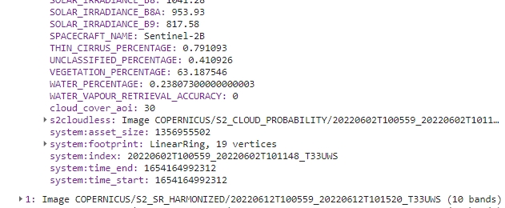
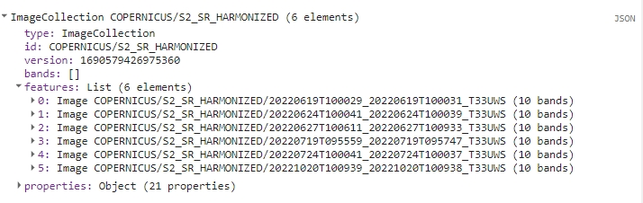
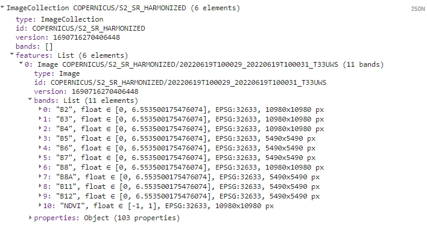
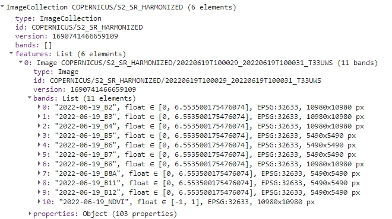
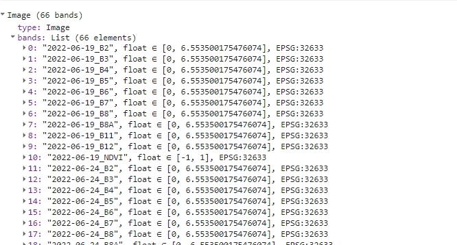
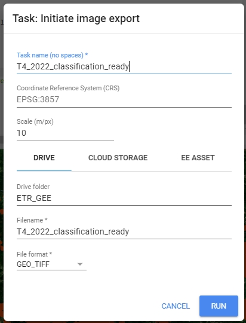

Image processing - Exercise
================

## Exercise - Image Processing Pipelines

In this exercise we will explore various examples of processing pipelines. The term **pipeline** in this case means a **series of processing steps**, which lead to preparation of analysis ready data. Each pipeline is used to prepare data for diverse purposes and applications that will be presented and demonstrated in practice in further themes and case studies.

The main objective of this exercise is to show several different processing steps, which are necessary in multitemporal data preparation. Bear in mind, the methods demonstrated here merely represent a fraction of all the available techniques. Based on the provided examples, you should be able to comprehend the principles behind each step and apply different methods to your own specific requirements and datasets.

## Getting started

All of the practical (coding) parts of this exercise will be conducted in the Google Earth Engine platform using JavaScript based Code Editor. If you are not familiar with this tool, we strongly recommend you review introductory tutorials, which are available and linked in [GEE software introduction in this Course](../../software/software_gee.md). Throughout this exercise, we’ll utilize a blend of built-in functions, custom functions and functions from external resources to complete various tasks. We will supply necessary links and explanations in the relevant sections. For general reference documentation see [GEE API reference website](https://developers.google.com/earth-engine/apidocs).

## Processing pipeline 1

The purpose of this pipeline is to obtain a multitemporal Sentinel-2 classification dataset for the Karkonosze area from 2022. The results of this processing pipeline will be utilized in the exercise in **[Theme 4](../04_multitemporal_classification/04_multitemporal_classification.md)**.

<center>


<i>Processing pipeline.</i>
</center>

### Area of Interest

We’ll commence by defining our Area of Interest (`AOI`). This area encompasses the Polish and Czech sectors of the Karkonosze National Parks, as well as the urban and rural regions situated south of the city of Jelenia Góra on the Polish side. This will form our classification area.

``` javascript
// Define AOI
var AOI = ee.FeatureCollection("projects/etrainee-module2/assets/aoi_karkonosze_sentinel");

// Pan to and display area of interest
Map.centerObject(AOI, 11);
Map.addLayer(AOI, {'color': 'darksalmon'}, 'Karkonosze');
```

<center>


<i>Karkonosze Area of Interest (AOI).</i>
</center>

### Imagery

For the purpose of this exercise we will use **Sentinel-2 Surface Reflectance (L2A)** data. Our objective is to utilize images from 2022 (June to October) that are either cloud-free or have cloud cover of less than 5% over our `AOI`. In order to do that we want to mask clouds and cloud shadows to calculate the fraction of masked pixels inside the Area of Interest.

To start with let’s subset the whole `S2_SR_HARMONIZED` collection to the images that contain `AOI`, were acquired between desired dates, and have `CLOUDY_PIXEL_PERCENTAGE` metadata value less than 90%. We want to discard unnecessary and low quality images to reduce computing time in further steps.

``` javascript
// Define date ranges for filtering image collection
var startDate = '2022-06-01';
var endDate = '2022-10-31';

// Define pre-filter percentage
var cloudFilter = 90;

// Import and filter Sentinel-2 Level 2A images
var s2SrCol = ee.ImageCollection('COPERNICUS/S2_SR_HARMONIZED')
    .filterBounds(AOI)
    .filterDate(startDate, endDate)
    .filter(ee.Filter.lte('CLOUDY_PIXEL_PERCENTAGE', cloudFilter));
```

To observe the results of this filtering, insert the following line into your script and rerun the code:

> print(s2SrCol);

Upon executing the script, you should see an `ImageCollection` with 42 elements in the console tab. Each image is itemized in the `features` list with its respective `bands` and `properties`. Inspect the `s2SrCol` object to familiarize yourself with how such objects are structured within the GEE framework.

<center>


<i>Filtering result.</i>
</center>

------------------------------------------------------------------------

*Note: you can print any variable to see the result of each step in the console. We recommend to do that after each step to see what each step does to the data we use.*

------------------------------------------------------------------------

To further process the images we will utilize another image collection available in Google Earth Engine - [*s2cloudless*](https://developers.google.com/earth-engine/datasets/catalog/COPERNICUS_S2_CLOUD_PROBABILITY). We will use the images from that collection to identify the presence of clouds and cloud shadows appear on the Surface Reflectance (SR) images. Armed with this information, we will proceed with masking these elements from each image.

------------------------------------------------------------------------

*Note: the part using `s2cloudless` collection is adapted from Python based [Sentinel-2 Cloud Masking with s2cloudless tutorial](https://developers.google.com/earth-engine/tutorials/community/sentinel-2-s2cloudless)*

------------------------------------------------------------------------

To proceed we want to filter the imagery from `s2cloudless` collection with the same criteria as before, with the exception of the `cloudFilter`.

``` javascript
// Import and filter s2cloudless
var s2CloudlessCol = ee.ImageCollection('COPERNICUS/S2_CLOUD_PROBABILITY')
    .filterBounds(AOI)
    .filterDate(startDate, endDate);
```

Now we want to join those two collections of images. Matching images can be identified by the `system:index` (e.g., *system:index: 20220602T100559_20220602T101148_T33UWS*) attribute contained in the image `properties`.

``` javascript
// Join the filtered s2cloudless collection to the SR collection
// by the 'system:index' property
var s2SrCloudlessCol =
// ee.Join.saveFirst means that new element will be added 
// to the primary image as a property
ee.ImageCollection(ee.Join.saveFirst('s2cloudless').apply({
    'primary': s2SrCol,
    'secondary': s2CloudlessCol,
    'condition': ee.Filter.equals({
        'leftField': 'system:index',
        'rightField': 'system:index'
    })
}));

print(s2SrCloudlessCol);
```

The resulting joined `ImageCollection` should consist of **42** images. You can find the attached *s2cloudless* `probability` band in the `properties`.

<center>


<i>Joined collection.</i>
</center>

### Cloud and shadow masking

In the following section, we’ll conduct cloud masking and cloud shadow masking, based on the `s2cloudless` `probability` images. The resulting masks should offer improved robustness and accuracy compared to standard cloud masking using `S2_SR_HARMONIZED` cloud bands and `SCL` classes. The specified values of variables below have been fine-tuned through empirical tests, delivering satisfactory results. However, they can be modified as per user preference.

``` javascript
// Cloud/shadow masking variables

//Cloud probability (%); based on `probability` image;
// values greater than are considered cloud
var CLD_PRB_THRESH = 20;

//Near-infrared reflectance (B8 band); values below that threshold
// are considered potential cloud shadow
var NIR_DRK_THRESH = 0.2;

// Maximum distance (km) to search for cloud shadows from cloud edges
var CLD_PRJ_DIST = 1;

// Distance (m) to dilate the edge of cloud-identified objects
var BUFFER = 50;
```

Now we can define functions for the actual masking. These functions are derived from [this tutorial](https://developers.google.com/earth-engine/tutorials/community/sentinel-2-s2cloudless).

The first function `addCloudBands` produces a cloud mask based on the provided `probability` layer and `CLD_PRB_TRESH` variable. The second function `addShadowBands` produces cloud shadows using `NIR (B8)` band values and the direction of cloud shadows bases on the image `MEAN_SOLAR_AZIMUTH_ANGLE` property. Finally, `addCldShdwMask` adds calculated masks to the image bands.

To apply each function to each image in `s2SrCloudlessCol` collection we will use the `.map()` function, which is a more efficient implementation of a regular `for` loop.

``` javascript
// CLOUD COMPONENTS
// Function to add the s2cloudless probability layer
// and derived cloud mask as bands to an S2_SR_HARMONIZED image input.
function addCloudBands(img){

  // Get s2cloudless image, subset the probability band.
    var cldPrb = ee.Image(img.get('s2cloudless')).select('probability');
    
    // Condition s2cloudless by the probability threshold value.
    // Creates new raster with cloud pixels
    var isCloud = cldPrb.gt(CLD_PRB_THRESH).rename('clouds');
    
    // Add the cloud probability layer and cloud mask as image bands.
    return img.addBands(ee.Image([cldPrb, isCloud]));
}

// SHADOW COMPONENTS
function addShadowBands(img){

  // Identify water pixels from the SCL band.
    var notWater = img.select('SCL').neq(6);
    
    // Identify dark NIR pixels that are not water (potential cloud shadow pixels).
    var SR_BAND_SCALE = 1e4;
    var darkPixels = img.select('B8')
    .lt(NIR_DRK_THRESH*SR_BAND_SCALE)
    .multiply(notWater)
    .rename('dark_pixels');
    
    // Determine the direction to project cloud shadow from clouds 
    // (assumes UTM projection).
    var shadowAzimuth = ee.Number(90)
                  .subtract(ee.Number(img.get('MEAN_SOLAR_AZIMUTH_ANGLE')));
    
    // Create a cloud projection based on calculated parameters
    var cldProj = (img.select('clouds')
        .directionalDistanceTransform(shadowAzimuth, CLD_PRJ_DIST*10)
        .reproject({'crs': img.select(0).projection(), 'scale': 100})
        .select('distance')
        .mask()
        .rename('cloud_transform'));
        
    // Identify the intersection of dark pixels with cloud shadow projection.    
    var shadows = cldProj.multiply(darkPixels).rename('shadows');
    
    // Add dark pixels, cloud projection, and identified shadows as image bands.
    return img.addBands(ee.Image([darkPixels, cldProj, shadows]));
}

// Add combined cloud and shadow mask to image bands.
function addCldShdwMask(img){

  // Add cloud component bands.
    var imgCloud = addCloudBands(img);
    
     // Add cloud shadow component bands.
    var imgCloudShadow = addShadowBands(imgCloud);
    
    // Combine cloud and shadow mask, set cloud and shadow as value 1, else 0.
    var isCldShdw = imgCloudShadow
              .select('clouds')
              .add(imgCloudShadow.select('shadows'))
              .gt(0);
    
    // Remove small cloud-shadow patches
    // and dilate remaining pixels by BUFFER input.
    // 20 m scale is for speed, and assumes clouds don't require 10 m precision.
    var isCldShdw2 = (isCldShdw.focalMin(2).focalMax(BUFFER*2/20)
        .reproject({'crs': img.select([0]).projection(), 'scale': 20})
        .rename('cloudmask'));
        
    // Add the final cloud-shadow mask to the image.
    return imgCloudShadow.addBands(isCldShdw2);
}
```

Now we can apply the functions to previously pre-filtered and merged collection `s2SrCloudlessCol`.

<b><u>TASK</u></b>

Apply the `addCldShdwMask` function to `s2SrCloudlessCol` collection using `.map()` function. Assign the result to `s2ColAddMask` variable and print the result to console.

<details>
<summary>
<b>Click here to see the solution.</b><br> Try to solve the task yourself and use the solution if you get stuck or to check if you are on the right way to the solution.
</summary>

``` javascript
// Add calculated cloud and shadow mask bands to each image in the collection.
var s2ColAddMask = s2SrCloudlessCol.map(addCldShdwMask);
print(s2ColAddMask);
```

</details>

<br>

Each image in the collection should now have additional six bands (`probability`, `clouds`, `dark_pixels`, `cloud_transform`, `shadows`, `cloudmask`).

<center>


<i>Mask bands.</i>
</center>

With the cloud and shadow masks computed, our next step is to apply them to each image within the collection. When masking is complete we will also subset each resulted image to include only 10 m and 20 m Sentinel-2 bands. We can exclude bands like `SCL` and others, because we will no longer use them in our processing steps. Bands with spatial resolution of 60 m are also not valuable for the classification task, which this dataset is being prepared for.

``` javascript
// Function to apply masks to spectral bands.
function applyCldShdwMask(img) {
  // Make a copy of input original image to preserve properties
  var orig = img;
  
  // Subset the cloudmask band and invert it so clouds/shadow are 0, else 1.
  var notCldShdw = img.select('cloudmask').not();
  
  // Subset reflectance bands and update their masks,
  // return the result as 0-1 SR bands.
  img =  img
        .select(['B2', 'B3', 'B4', 'B5', 'B6', 'B7', 'B8', 'B8A', 'B11', 'B12'])
        .updateMask(notCldShdw)
        .divide(10000);
  
  // Copy the original image properties
  return img.copyProperties(orig, orig.propertyNames());
}

// Apply masking function to the collection.
var s2ColMasked = s2ColAddMask.map(applyCldShdwMask);
print(s2ColMasked);
```

Each image in the resulting collection should now have **10** selected spectral bands.

<center>


<i>Masked S-2 10 m and 20 m bands.</i>
</center>

We can inspect the results of the masking process on the example image. In order to do that we will select the first image from both pre- and post-masking collections and display them along with selected mask bands.

``` javascript
// Extract first image from pre-masking and post-masking collections
// to show the results on map
var exampleImage = s2ColAddMask.first();
var maskedExampleImage = s2ColMasked.first();

// Subset layers and prepare them for display
var clouds = exampleImage.select('clouds').selfMask();
var shadows = exampleImage.select('shadows').selfMask();
var cloudMask = exampleImage.select('cloudmask').selfMask();

// ADD LAYERS TO THE MAP.

// Add original image layer
Map.addLayer(exampleImage, {bands: ['B4', 'B3', 'B2'], min: 200, max: 1300}, 'Image');
//Add clouds layer
Map.addLayer(clouds, {palette: '74fffc'}, 'CLOUDS');
//Add cloud shadows layer
Map.addLayer(shadows, {palette: '0a0cff'}, 'SHADOWS');
//Add cloud mask layer
Map.addLayer(cloudMask, {palette: 'ff550c'}, 'CLOUD/SHADOWS MASK');
//Add masked image layer
Map.addLayer(maskedExampleImage, {bands: ['B4', 'B3', 'B2'], min: 0.02, max: 0.13}, 'Masked Image');
```

Toggle different layers to see the extent of different masks and the final product.

<center>


<i>Masking results.</i>
</center>

------------------------------------------------------------------------

[Additional task: open this link, which leads to the results of cloud masking using default parameters acquired from Sentinel-2 Cloud Masking with s2cloudless tutorial. Compare different mask layers and try to assess which parameters affect the final image the most.](https://code.earthengine.google.com/d10218e7dfb31d2876b68c6f2eb8b78b?hideCode=true)

------------------------------------------------------------------------

### Cloud coverage over area of interest

After obtaining an `ImageCollection` with **42** masked images, we aim to further filter those images that are clear over our area of interest. To accomplish this, we’ll employ the applied mask to determine the percentage of cloud cover over the research area.

Below, we present a function that calculates the cloud cover percentage. We will then apply this function to the masked collection.

``` javascript
// Define the function to return the percentage of masked pixels
// in an image region as a property. 
function calculateMaskedPercent(image) {
  // Select one of the bands and count unmasked pixels within research area
   var unmaskedPixelCount = image.select('B2').reduceRegion({
    reducer: ee.Reducer.count(),
    geometry: AOI,
    scale: 10,
    maxPixels: 1e10
  }).get('B2');

  // Select one of the bands and count all pixels within research area
  var totalPixelCount  = image.select('B2').unmask().reduceRegion({
    reducer: ee.Reducer.count(),
    geometry: AOI,
    scale: 10,
    maxPixels: 1e10
  }).get('B2');
 
 // Calculate cloud cover percentage over AOI
  var cloudCoverAoi = ee.Number(1)
      .subtract(ee.Number(unmaskedPixelCount).divide(totalPixelCount))
      .multiply(100)
      .round();
      
  // Return the original image with new cloud_cover_aoi property
  return image.set('cloud_cover_aoi', cloudCoverAoi);
}

// Apply the function to the collection
var s2ColCloudCoverAoi =  s2ColMasked.map(calculateMaskedPercent);
print(s2ColCloudCoverAoi);
```

<center>



<i>Cloud/shadow cover AOI property.</i>
</center>

We are now able to filter image collection based on the recently added property to extract the least clouded images suitable for multitemporal classification. We will set a strict 5% cloud/shadow cover threshold.

<b><u>TASK</u></b>

Filter `s2ColCloudCoverAoi` collection by `cloud_cover_aoi` property. Exclude all images with value greater than 5%.

<details>
<summary>
<b>Click here to see the solution.</b><br> Try to solve the task yourself and use the solution if you get stuck or to check if you are on the right way to the solution.
</summary>

``` javascript
// Filter collection to only images with `cloud_cover_aoi` less than or equal 5%
var s2FilteredCol = s2ColCloudCoverAoi.filter(ee.Filter.lte('cloud_cover_aoi', 5));
print(s2FilteredCol);
```

</details>

<br>

The resulting collection consists of six images from June (x3), July (x2) and October (x1).

<center>



<i>Filtered collection.</i>
</center>

### NDVI calculation

The next step will be NDVI calculation. For the classification purposes in **[Theme 4](../04_multitemporal_classification/04_multitemporal_classification.md)**, we want to test the performance of the this most widely used index in differentiating land cover classes.

In the function below we will utilize our knowledge on how to calculate this index and `normalizedDifference` method from Google Earth Engine.

``` javascript
// B4 - RED band, B8 - NIR band
function addNDVI(img) {
  var ndvi = img.normalizedDifference(['B8', 'B4']).rename('NDVI');
  return img.addBands(ndvi);
}

var s2FilteredColNdvi = s2FilteredCol.map(addNDVI);
print(s2FilteredColNdvi);
```

Each image should now have additional `NDVI` band.

<center>



<i>Filtered collection with NDVI band.</i>
</center>

### Band renaming and export

The next part of this exercise entails transforming band names and exporting the entire collection as a single image, with spectral bands and NDVI tagged with the date of the source image. To execute this, we will require some additional functions.

First, we’ll add year, month and day to each band name. In example, `B2` from the first image will be renamed to `2022-06-19_B2`.

``` javascript
// Add dates to bands names
function renameBands(image) {
  
  // Get the date of the image
  var date = ee.Date(image.get('system:time_start'));
  var dateString = date.format('YYYY-MM-dd');

  // Get the list of band names in the image
  var bandNames = image.bandNames();

  // Map over the band names and rename them
  var renamedBands = bandNames.map(function(bandName){
    return dateString.cat('_').cat(bandName);
  });

  // Use .select() to rename the original band names
  var renamedImage = image.select(bandNames, renamedBands);

  return renamedImage;
}

// Add dates to bands names
var s2FilteredColNdviRenamed = s2FilteredColNdvi.map(renameBandsYear);
print(s2FilteredColNdviRenamed);
```

<center>



<i>Band names with dates.</i>
</center>

Now we’ll save all the new names to a variable. We’ll need that variable in the following step to recover changed band names after using `toBands()` function.

``` javascript
// Function to get all band names from the entire collection
function getAllBandNames(collection) {
  // Convert the ImageCollection into a list
  var bandNamesList = collection
    .toList(collection.size())
  
  // Map over each image in the list to get its band names
    .map(function(image) {
      // Convert each element in the list (image) into an ee.Image object
      var imageObject = ee.Image(image);
      
      // Get the band names of the current image using ee.Image.bandNames()
      return imageObject.bandNames();
    })
    
  // Flatten the list to obtain a single list containing all band names
    .flatten();
  
  // Return the list of all band names
  return bandNamesList;
}
```

Apply the function to `s2FilteredColNdviRenamed`.

``` javascript
var bandNames = getAllBandNames(s2FilteredColNdviRenamed);
print(bandNames);
```

<center>


<i>Names list.</i>
</center>

The last step is to convert the `s2FilteredColNdviRenamed` `ImageCollection` to a single multi-band image. `toBands()` function add image ID prefix to each band, so we’ll replace those band names with the ones stored in `bandNames` variable.

``` javascript
// Convert the collection to a single multi-band image
var s2ImageMultiband = s2FilteredColNdviRenamed.toBands();

// Replace temporary names with previously prepared date-marked names.
s2ImageMultiband = s2ImageMultiband.select(
  s2ImageMultiband.bandNames(), bandNames);

print(s2ImageMultiband);
```

<center>


<i>Single multi-band image.</i>
</center>

### Gap filling

Next, we’ll prepare and apply a function to fill any remaining gaps and prepare the data for export. Some parts of the images may contain masked areas (less than 5% of AOI). We’ll employ a filling algorithm to address these gaps. This algorithm operates as follows:

<ul>
<li>
replace missing values with the nearest preceding value (i.e., substitute July’s missing values with June’s values)
</li>
<li>
if the preceding values are all NA: substitute missing values with the nearest subsequent value
</li>
<li>
for the first image, if data is missing, it uses the nearest subsequent value
</li>
<li>
if the entire series lacks a valid value, leave it as ‘NA’
</li>
</ul>

``` javascript
function fillGaps (img) {
  // Get the image projection
  var proj = img.projection();
  
  // Get the band names of the image
  var bandNames = img.bandNames();
  
  // Make an Image object out of every element from a list of individual bands
  var colList = bandNames.map(function(n) { return img.select([n]) });

  // Define the mosaic function to fill gaps for each band
  var mosaicFunction = function(band) {
    // Get the index of the current band
    var bandIndex = colList.indexOf(band);
    
    // Get the index of the next band
    var bandIndexPlus1 = bandIndex.add(1);
    
    // Create two lists of bands before and after the current band
    var colLtIndex = colList.slice(0, bandIndex, 1);
    var colGtIndex = colList.slice(bandIndexPlus1).reverse();
    
    // Create a list containing the current band
    var colEqIndex = ee.List([]).add(colList.get(bandIndex));
    
    // Concatenate the lists to create a new list of bands arranged as follows:
    // [bands after current band, bands before current band, current band]
    var all = colGtIndex.cat(colLtIndex).cat(colEqIndex).flatten();
    
    // Convert the list of bands to an ImageCollection
    var cc = ee.ImageCollection.fromImages(all);
    
    // Map over the ImageCollection to rename bands to 'band'
    var ccBandnames = cc.map(function(img) {return img.select(['.*'], ['band'])});
    
    // Mosaic the ImageCollection to fill gaps for the current band
    // The pixel in the final mosaic is the latest valid (non-masked pixel)
    // That's why we put them in this order in `all` variable
    var mosaicked = ccBandnames.mosaic();
    
    return mosaicked;
  };

  // Map the mosaic function over the list of bands to fill gaps for each band
  var mosaicked = colList.map(mosaicFunction);
  
  // Create an ImageCollection from the mosaic result
  var tempCol = ee.ImageCollection.fromImages(mosaicked);
  
  //  Convert the ImageCollection to a single image using toBands()
  tempCol = tempCol.toBands();
  
  // Select the bands with original band names from the newly created image
  fixedBandNamesImg = tempCol.select(tempCol.bandNames(), bandNames);
  
  // Reproject the image to its original projection
  var filledGapsImg = fixedBandNamesImg.reproject(proj);
  
  // Return the image with gaps filled for all bands
  return filledGapsImg;
}


var b2Filled = fillGaps(s2ImageMultiband.select('.*B2'));
var b3Filled = fillGaps(s2ImageMultiband.select('.*B3'));
var b4Filled = fillGaps(s2ImageMultiband.select('.*B4'));
var b5Filled = fillGaps(s2ImageMultiband.select('.*B5'));
var b6Filled = fillGaps(s2ImageMultiband.select('.*B6'));
var b7Filled = fillGaps(s2ImageMultiband.select('.*B7'));
var b8Filled = fillGaps(s2ImageMultiband.select('.*B8'));
var b8aFilled = fillGaps(s2ImageMultiband.select('.*B8A'));
var b11Filled = fillGaps(s2ImageMultiband.select('.*B11'));
var b12Filled = fillGaps(s2ImageMultiband.select('.*B12'));
var ndviFilled = fillGaps(s2ImageMultiband.select('.*NDVI'));
```

The final step before exporting is arranging all the filled bands in the proper order once more. This operation consists of two steps. First we’ll create a single multi-band image from the filled images consisting of specific bands (`b2Filled`, `ndviFilled` etc.).

``` javascript
var s2ImageMultibandFilled = ee.Image.cat(b2Filled, b3Filled, b4Filled, b5Filled, 
 b6Filled, b7Filled, b8Filled, b8aFilled, b11Filled, b12Filled, ndviFilled);

print(s2ImageMultibandFilled);
```

<center>


<i>Filled multi-band image.</i>
</center>

And finally, we’ll rearrange the bands back to the same order as in `s2ImageMultiband`.

``` javascript
var properNames = s2ImageMultiband.bandNames();

function sortBands(image, properNames) {
  // Get the band names of the proper image.
  var properBandNames = properNames;
  
  // Get the band names of the wrong image.
  var wrongBandNames = image.bandNames();
  
  // Create a list of sorted band indices.
  var sortedBandIndices = properBandNames.map(
    function(bandName) { return wrongBandNames.indexOf(bandName) });
    
  // Create a new image with the bands sorted in the specified order.
  var sortedBands = image.select(sortedBandIndices);
  return sortedBands;
}


var s2ExportReady = sortBands(s2ImageMultibandFilled, bandNames);

print(s2ExportReady);
```

<center>



<i>Image ready to be exported.</i>
</center>

### Exporting data

All that’s left now is to export previously prepared data. We’ll rename it to `T4_image_data`, so we recognize it later, when we’ll need to use it in **[Theme 4 exercise](../04_multitemporal_classification/04_multitemporal_classification.md)**. Change the folder to the appropriate one in your Google Drive (by default it’ll create a new one if it doesn’t find existing folder with a matching name).

``` javascript

Export.image.toDrive({
  image: s2ExportReady,
  description: 'T4_image_data',
  // Change the folder to one in your Google Drive
  folder: 'ETR_GEE',
  region: AOI,
  maxPixels: 1e13,
  scale: 10
});
```

<center>

 

<i>Export image to your Google Drive.</i>
</center>

[Here you can find the link to the whole code presented in Pipeline 1](https://code.earthengine.google.com/9685877055f3c8230d17eb8142be1661)

## Processing pipeline 2

The goal of this processing pipeline is to generate yearly Landsat cloud-free composites for the period of 1984-2022, specifically for the Tatras area. Outputs of this processing pipeline will be used in the exercise in **[Theme 5](../05_vegetation_monitoring/05_vegetation_monitoring_exercise.md)** and in **[Case Study 3](../08_cs_disturbance_detection/08_cs_disturbance_detection.md)**.

<center>


<i>Processing pipeline.</i>
</center>

### Packages

We will begin by loading the necessary external packages. In this instance, we will be utilizing the [*spectral*](https://github.com/awesome-spectral-indices/spectral) package.

<b><u>TASK</u></b>

Attach `spectral` package as seen in the [GitHub README](https://github.com/awesome-spectral-indices/spectral).

``` javascript
// Load external spectral package
var spectral = require("users/dmlmont/spectral:spectral");
```

This package will be used later to calculate spectral indices for each composite. Now, let’s define the area of interest.

### Area of interest

``` javascript
// Define Area of Interest (AOI)
var AOI = ee.FeatureCollection("projects/etrainee-module2/assets/aoi_tatras");
```

Our area of interest includes both the Polish and Slovakian sides of the Tatra National Parks. In our forthcoming exercises that focus on change detection, this region will be our primary area of interest.

``` javascript
// Pan to and display area of interest
Map.centerObject(AOI, 10);
Map.addLayer(AOI, {'color': 'darksalmon'}, 'Tatras');
```

<center>


<i>Area of interest (Tatras).</i>
</center>

### Imagery

Moving on to imagery, this pipeline will utilize Landsat Collection 2 Level 2 Tier 1 data. Compared to Collection 1 data, the images from this collection have undergone preprocessing with improved algorithms. The Tier 1 data is deemed suitable for multi-temporal analysis. More information on Collection 2 and data tiers can be found [here](https://www.usgs.gov/landsat-missions/landsat-collection-2).

``` javascript
// Define collections for Landsat 4, 5, 7, 8, and 9
var collections = {
  lt4: ee.ImageCollection("LANDSAT/LT04/C02/T1_L2"),
  lt5: ee.ImageCollection("LANDSAT/LT05/C02/T1_L2"),
  lt7: ee.ImageCollection("LANDSAT/LE07/C02/T1_L2"),
  lt8: ee.ImageCollection("LANDSAT/LC08/C02/T1_L2"),
  lt9: ee.ImageCollection("LANDSAT/LC09/C02/T1_L2")
};
```

Next steps in the processing pipeline will filter and process each image in all collections to prepare homogeneous dataset.

### Filtering and processing data collections

Naturally, we do not require the entire collection of Landsat images from each satellite/sensor for the analysis specific for our AOI. To filter each collection, we will apply a spatial filter, a temporal filter (to retain only imagery captured between May 1st and September 30th), and a metadata filter (images from [WRS-2](https://landsat.gsfc.nasa.gov/about/the-worldwide-reference-system/) row 26 that contain the area of interest in whole or in part).

<b><u>TASK</u></b>

Declare a variable `collectionFilter` of type Filter that includes the following rules:

<details>
<summary>
<b>Click here to see the solution.</b><br> Try to solve the task yourself and use the solution if you get stuck or to check if you are on the right way to the solution.
</summary>

``` javascript
// Define a collection filter.
var collectionFilter = ee.Filter.and(
  ee.Filter.bounds(AOI),
  ee.Filter.calendarRange(1984, 2022, 'year'),
  ee.Filter.calendarRange(5, 9, 'month'),
  ee.Filter.eq('WRS_ROW', 26)
);
```

</details>

<br>

Next, we will need to define a set of functions to apply to each image. We will start with five different Landsat satellite collections. Landsats 4, 5, 7 and Landsats 8 and 9 have two distinct sets of band sets. For further processing, we want to extract only those bands that are common between the two groups and rename them to simplify later processing.

<b><u>TASK</u></b>

Prepare 2 functions: `renameBandsLandsat457` and `renameBandsLandsat89` renaming the appropriate bands to the following names: ‘Blue’, ‘Green’, ‘Red’, ‘NIR’, ‘SWIR1’, ‘SWIR2’.

<details>
<summary>
<b>Click here to see the solution.</b><br> Try to solve the task yourself and use the solution if you get stuck or to check if you are on the right way to the solution.
</summary>

``` javascript
// Define function to get and rename bands of interest from Landsat 4, 5 and 7.
// Define function to rename bands of interest from Landsat 4, 5 and 7.
var renameBandsLandsat457 = function(img) {
  return img.select(
    ['SR_B1', 'SR_B2', 'SR_B3', 'SR_B4', 'SR_B5', 'SR_B7'],
    ['Blue', 'Green', 'Red', 'NIR', 'SWIR1', 'SWIR2']
  );
};

// Define function to rename bands of interest from Landsat 8 and Landsat 9.
var renameBandsLandsat89 = function(img) {
  return img.select(
    ['SR_B2', 'SR_B3', 'SR_B4', 'SR_B5', 'SR_B6', 'SR_B7'],
    ['Blue', 'Green', 'Red', 'NIR', 'SWIR1', 'SWIR2']
  );
};
```

</details>

<br>

To check how the function works add the two following lines to the code and Run it again. It compares the image before and after using the `renameBandsLandsat457` function.

``` javascript
print(collections.lt5.first());
print(renameBandsLandsat457(collections.lt5.first()));
```

The result in the console should look like this:

<center>


</center>

To develop cloud-free composites, a method must be chosen that selects a clear pixel, captured within a specified timeframe, for inclusion in the final composite. We’ll use proximity to a **target day-of-year (doy, DOY)** as the deciding criterion in this scenario.

We’ll introduce a new property that reflects the absolute difference between the DOY when the image was captured and the target DOY, which is the 213th day of the year (or 212 in JavaScript, as it starts counting from 0), corresponding to August 1st. This property is important for enabling us to apply mosaicking to collections sorted based on this property. Clear pixels captured closer to the target DOY will supersede those taken further away from August 1st.

``` javascript
// Define function to add absolute difference between target
// day of year (213, August 1st) and image acquisition doy.
var addDoyAbsProperty = function(img) {
  var doy = ee.Date(img.get('system:time_start')).getRelative('day', 'year');
  var doyAbs = ee.Number(212).subtract(doy).abs();
  return img.set('doy_abs', doyAbs);
};
```

The next step is to define a function to mask clouds and cloud shadows. The `QA_PIXEL` band, present in all Level 2 Landsat images, will be used for this purpose. Based on the values in this raster, clouded and shadowed pixels can be identified and masked. For improved masking performance, we’ll run a morphological filter through the masked image to extend the masked parts around the edges. This enhancement will result in more potentially viable pixels being masked, but will also help eliminate more cloud edges, which are often not classified as clouds in the ‘QA_PIXEL’ band.

``` javascript
// Define function to mask clouds and clouds shadows with additional pixels
// masked around these areas.
var cloudMaskKernel = function(img) {
  var dilatedCloudBitMask = 1 << 1;
  var cloudShadowBitMask = 1 << 3;
  var cloudsBitMask = 1 << 4;
  var snowBitMask = 1 << 5;
  var qa = img.select('QA_PIXEL');
  var mask = qa.bitwiseAnd(cloudShadowBitMask)
    .or(qa.bitwiseAnd(cloudsBitMask))
    .or(qa.bitwiseAnd(dilatedCloudBitMask))
    .or(qa.bitwiseAnd(snowBitMask));
  mask = mask.focalMax(7, "square");
  return qa.updateMask(mask.not());
};
```

By default, the values in Landsat Collection 2 Level 2 surface reflectance (SR) products are stored as integers to conserve storage. To calculate SR values, we need to apply a [scaling factor](https://www.usgs.gov/faqs/how-do-i-use-scale-factor-landsat-level-2-science-products). After scaling, it’s crucial to ensure the data falls within the range \[0, 1\], so any artifacts with values below 0 and above 1 should be masked, as we cannot discern the true surface reflectance value of these areas.

<b><u>TASK</u></b>

Declare function `applyScalingFactor` to multiply it by coefficients and mask outliers.

<details>
<summary>
<b>Click here to see the solution.</b><br> Try to solve the task yourself and use the solution if you get stuck or to check if you are on the right way to the solution.
</summary>

``` javascript
// Define function to calculate surface reflection values from DN.
var applyScalingFactor = function(img) {
  var scaledImage = img.multiply(0.0000275).add(-0.2);
  return scaledImage.updateMask(scaledImage.gte(0).and(scaledImage.lte(1)));
};
```

</details>

<br>

With all the necessary functions defined, we can wrap them within a single function for applying to each collection. The two functions below are differentiated by their renaming function, which varies between two Landsat satellite groups. Each function performs the following steps:

<ul>
<li>
copies the original image to a new variable to retain necessary properties
</li>
<li>
calculates a mask for clouds and cloud shadows
</li>
<li>
extracts six bands and renames them as ‘Blue’, ‘Green’, etc.
</li>
<li>
scales pixel values in each band to SR values.
</li>
<li>
copies the ‘system:time_start’ property to the new image.
</li>
<li>
adds a property containing absolute DOY
</li>
<li>
applies the clouds/cloud shadows mask to the image
</li>
</ul>

<b><u>TASK</u></b>

Wrap the steps above with `prepLandsat457` and `prepLandsat89` functions above using the functions we wrote previously.

<details>
<summary>
<b>Click here to see the solution.</b><br> Try to solve the task yourself and use the solution if you get stuck or to check if you are on the right way to the solution.
</summary>

``` javascript
// Define functions to apply all other functions needed to create time series composites.
var prepLandsat457 = function(img) {
  var originalImage = img;
  var cloudMask = cloudMaskKernel(img);
  var outputImage = renameBandsLandsat457(img);
  outputImage = applyScalingFactor(outputImage);
  outputImage = ee.Image(outputImage.copyProperties(originalImage, ['system:time_start']));
  outputImage = addDoyAbsProperty(outputImage);
  return outputImage.updateMask(cloudMask);
};

var prepLandsat89 = function(img) {
  var originalImage = img;
  var cloudMask = cloudMaskKernel(img);
  var outputImage = renameBandsLandsat89(img);
  outputImage = applyScalingFactor(outputImage);
  outputImage = ee.Image(outputImage.copyProperties(originalImage, ['system:time_start']));
  outputImage = addDoyAbsProperty(outputImage);
  return outputImage.updateMask(cloudMask);
};
```

</details>

<br>

With all the filtering and processing functions defined, we can now apply them to each Landsat collection. After the filtering process, each image in the collection will be processed using the functions described. The remaining processed images can then be merged into one collection.

<b><u>TASK</u></b>

Filter each Landsat collection and apply appropriate wrapper functions. Then merge all the collections into `tatrasCol` variable.

<details>
<summary>
<b>Click here to see the solution.</b><br> Try to solve the task yourself and use the solution if you get stuck or to check if you are on the right way to the solution.
</summary>

``` javascript
// Filter and process collections according to the parameters.
var lt4Col = collections.lt4.filter(collectionFilter).map(prepLandsat457);
var lt5Col = collections.lt5.filter(collectionFilter).map(prepLandsat457);
var lt7Col = collections.lt7.filter(collectionFilter).map(prepLandsat457);
var lt8Col = collections.lt8.filter(collectionFilter).map(prepLandsat89);
var lt9Col = collections.lt9.filter(collectionFilter).map(prepLandsat89);

// Merge all collections into one.
var tatrasCol = lt4Col
  .merge(lt5Col)
  .merge(lt7Col)
  .merge(lt8Col)
  .merge(lt9Col);

print(tatrasCol);
```

</details>

<br>

<center>


<i>Merged collection.</i>
</center>

### Yearly cloud-free composite creation

After we’ve filter and processed initial `ImageCollections` we can now proceed with a function to create composite images. It is based on the `mosaic` function, which in a nutshell stacks bands on one another, so as the pixel values from the layer ‘on top’ are visible in the mosaicked image (except the NA pixels, which are filled by the layers below the top one).

First, we want the images closest to the target DOY to be ‘on top’, so we need to sort them before mosaicking.

``` javascript
// Function to create mosaic based on day-of-year. 
// Non-clouded pixels with lowest temporal distance from 
// 213 day-of-year (August 1) will be present in the final composite
var compositeDoy = function(col) {
  var colSort = col.sort('doy_abs', false);
  return colSort.mosaic();
};
```

The actual function needs to involve filtering the entire collection to extract images captured within a single year. These images will then be sorted by their `doy_abs` value (in descending order) and subsequently mosaicked (`compositeDoy` function).

To iterate through each year between 1984-2022 collection we shall prepare a list containing a sequence.

``` javascript
var startYear = 1984;
var endYear = 2022;
var yearList = ee.List.sequence(startYear, endYear);
```

For each year, we’ll extract the appropriate images, create a composite, reproject the image, and add two properties. The resulting list will contain 39 images, each with six bands.

``` javascript
var yearCompList = yearList.map(function(year) {

  // Get only the images that are collected during one year
  var yearCol = tatrasCol.filter(ee.Filter.calendarRange(year, year, 'year'));
  
  // Create a composite using previously defined function
  var yearComp = compositeDoy(yearCol);
  
  // Return a reprojected image with two additional properties
  yearComp = yearComp.reproject({crs: 'EPSG:32634', scale: 30}); 
  return yearComp.set({
    'year': ee.Number(year).int(),
    'save': ee.String(year)
  });
});

print(yearCompList);
```

<center>


<i>Yearly composite images list.</i>
</center>

Finally, transform a `List` of `Images` into `ImageCollection`.

<b><u>TASK</u></b>

<details>
<summary>
<b>Click here to see the solution.</b><br> Try to solve the task yourself and use the solution if you get stuck or to check if you are on the right way to the solution.
</summary>

``` javascript
// Convert the annual composite image List to an ImageCollection
var yearCompCol = ee.ImageCollection.fromImages(yearCompList);
print(yearCompCol);
```

</details>

<br>

<center>


<i>Yearly composite image collection.</i>
</center>

Display the first (1984) image from the collection to see the results.

``` javascript
var ex = yearCompCol.first();

var rgbVis = {
  bands: ['Red', 'Green', 'Blue'],
  min: 0,
  max: 0.2
};

Map.addLayer(ex, rgbVis, "Example Cloud Free Composite");
```

<center>


<i>Example of cloud free image.</i>
</center>

### Tassed Cap bands and spectral indices

With our yearly composites prepared, we can now calculate and add Tasseled Cap bands and spectral indices. We’ll calculate Tasseled Cap components using code and coefficients adapted from the [LandTrendr GEE implementation](https://emapr.github.io/LT-GEE/). The external package [*spectral*](https://github.com/awesome-spectral-indices/spectral) will be utilized for spectral indices. This package simplifies the process of defining necessary bands and calculating any index in the database using the `computeIndex` function. For the purpose of the exercise in **[Theme 5](../05_vegetation_monitoring/05_vegetation_monitoring_exercise.md)** and **[Case Study 3](../08_cs_disturbance_detection/08_cs_disturbance_detection.md)** we will calculate the following 8 bands:

<ul>
<li>
<i>Tasseled Cap Brightness</i> (TCB)
</li>
<li>
<i>Tasseled Cap Greenness</i> (TCG)
</li>
<li>
<i>Tasseled Cap Wetness</i> (TCW)
</li>
<li>
<i>Normalized Difference Vegetation Index</i> (NDVI)
</li>
<li>
<i>Normalized Burn Ratio</i> (NBR)
</li>
<li>
<i>Normalized Burn Ratio 2</i> (NBR2)
</li>
<li>
<i>Normalized Difference Moisture Index</i> (NDMI)
</li>
<li>
<i>Normalized Difference Water Index</i> (NDWI)
</li>
</ul>

``` javascript
// Function to add Tasseled Cap transformation bands
var tasseledCap = function(img){ 
  // brightness coefficients
  var brtCoeffs = ee.Image
                  .constant([0.2043, 0.4158, 0.5524, 0.5741, 0.3124, 0.2303]);
  // greenness coefficients
  var grnCoeffs = ee.Image
                  .constant([-0.1603, -0.2819, -0.4934, 0.7940, -0.0002, -0.1446]); 
  // wetness coefficients
  var wetCoeffs = ee.Image
                  .constant([0.0315, 0.2021, 0.3102, 0.1594, -0.6806, -0.6109]); 
  
  // Sum reducer - sum band values after multiplying them by coefficients
  var sumReducer = ee.Reducer.sum(); 
  var brightness = img.multiply(brtCoeffs).reduce(sumReducer);
  var greenness = img.multiply(grnCoeffs).reduce(sumReducer); 
  var wetness = img.multiply(wetCoeffs).reduce(sumReducer); 
  var tc = brightness.addBands(greenness)
                     .addBands(wetness)
                     // Rename the bands
                     .select([0,1,2], ['TCB','TCG','TCW']); 
  return img.addBands(tc);
};


var yearCompColTC = yearCompCol.map(tasseledCap);


// Function to calculate selected indices
function addIndices(img) {
  // REQUIRED PARAMETERS ACCORDING TO THE REQUIRED BANDS
  var parameters = {
    "B": img.select("Blue"),
    "G": img.select("Green"),
    "R": img.select("Red"),
    "N": img.select("NIR"),
    "S1": img.select("SWIR1"),
    "S2": img.select("SWIR2")
  };
  //NDVI, NBR, NBR2, NDMI, NDWI
  return spectral
          .computeIndex(img,["NDVI", "NBR", "NBR2", "NDMI", "NDWI"], parameters);
}

// Calculate indices
var colIndices = yearCompColTC.map(addIndices);

print(colIndices);
```

<center>


<i>Calculated TC bands and spectral indices added to the yearly image.</i>
</center>

### Band renaming

We now have all the data we need for export. Before proceeding, we need to reorganize this data into yearly stacks of each individual band/spectral index. Each band should also include the year of acquisition in its name, so it can be easily identified and utilized for plotting, among other tasks.

``` javascript
// Function to add years to bands names  
function renameBandsYear(img) {
    // Get the year property
    var year = ee.String(img.get('year'));

    // Get the band names and map over them to add the year
    var bands = img.bandNames();
    var newBands = bands.map(function(name) {
        return ee.String(year).cat('_').cat(ee.String(name));
    });

    // Rename the bands and return the image
    return img.rename(newBands);
}

// Rename bands
colIndices = colIndices.map(renameBandsYear);

print(colIndices);
```

<center>


<i>Renamed bands.</i>
</center>
The next chunk of code will execute the following tasks:
<ul>
<li>
flatten the entire <code>ImageCollection</code> into one image containing every band from that <code>colIndices</code>
</li>
<li>
retrieve the band names following the flattening
</li>
<li>
generate a list of band names with the prefix removed (ID of image from <code>colIndices</code>) from each band.
</li>
<li>
replace modified band names with the correct band names, which include the year of acquisition and spectral band/index
</li>
</ul>

``` javascript

// Transform image collection to one image
var oneImage = colIndices.toBands();

// Get band names
var bandNames = oneImage.bandNames();

// Map over band names to remove prefix
var newBandNames = bandNames.map(function(name) {
    return ee.String(name).split('_').slice(1).join('_');
});

// Rename the bands
oneImage = oneImage.rename(newBandNames);
print(oneImage);
```

<center>


<i>Renamed bands in one image.</i>
</center>

### Gap fill and export preparation

Next, we’ll prepare and apply a function to fill any remaining gaps and prepare the data for export. Gaps may still appear following composite creation due to insufficient data within images from each year. We’ll employ a filling algorithm to address these gaps. This algorithm operates as follows:

<ul>
<li>
replace missing values with the nearest preceding value (i.e., substitute 1985’s missing values with 1984’s values)
</li>
<li>
if the preceeding values are all NA: substitute missing values with the nearest subsequent value
</li>
<li>
for the first image, if data is missing, it uses the nearest subsequent value
</li>
<li>
if the entire series lacks a valid value, leave it as ‘NA’
</li>
</ul>

``` javascript
// Function to fill gaps
// It substitutes missing values with the nearest preceding value. 
// For the first image, if data is missing, it uses the nearest subsequent value.
function fillGaps (img) {
  // Get the image projection
  var proj = img.projection();
  
  // Get the band names of the image
  var bandNames = img.bandNames();
  
  // Make an Image object out of every element from a list of individual bands
  var colList = bandNames.map(function(n) { return img.select([n]) });

  // Define the mosaic function to fill gaps for each band
  var mosaicFunction = function(band) {
    // Get the index of the current band
    var bandIndex = colList.indexOf(band);
    
    // Get the index of the next band
    var bandIndexPlus1 = bandIndex.add(1);
    
    // Create two lists of bands before and after the current band
    var colLtIndex = colList.slice(0, bandIndex, 1);
    var colGtIndex = colList.slice(bandIndexPlus1).reverse();
    
    // Create a list containing the current band
    var colEqIndex = ee.List([]).add(colList.get(bandIndex));
    
    // Concatenate the lists to create a new list of bands arranged as follows:
    // [bands after current band, bands before current band, current band]
    var all = colGtIndex.cat(colLtIndex).cat(colEqIndex).flatten();
    
    // Convert the list of bands to an ImageCollection
    var cc = ee.ImageCollection.fromImages(all);
    
    // Map over the ImageCollection to rename bands to 'band'
    var ccBandnames = cc.map(function(img) {return img.select(['.*'], ['band'])});
    
    // Mosaic the ImageCollection to fill gaps for the current band
    // The pixel in the final mosaic is the latest valid (non-masked pixel)
    // That's why we put them in this order in `all` variable
    var mosaicked = ccBandnames.mosaic();
    
    return mosaicked;
  };

  // Map the mosaic function over the list of bands to fill gaps for each band
  var mosaicked = colList.map(mosaicFunction);
  
  // Create an ImageCollection from the mosaic result
  var tempCol = ee.ImageCollection.fromImages(mosaicked);
  
  //  Convert the ImageCollection to a single image using toBands()
  tempCol = tempCol.toBands();
  
  // Select the bands with original band names from the newly created image
  var fixedBandNamesImg = tempCol.select(tempCol.bandNames(), bandNames);
  
  // Reproject the image to its original projection
  var filledGapsImg = fixedBandNamesImg.reproject(proj);
  
  // Return the image with gaps filled for all bands
  return filledGapsImg;
}
```

The save name should be set as the year, and the data type should be changed to float. To perform all three tasks for each time series, we’ll write the following function.

``` javascript
// Create bands/indices stacks images.
var fillAndConvert = function(bandName, oneImg) {
  var img = oneImg.select('.*' + bandName);
  img = img.set({'save': ee.String(bandName)});
  img = img.float();
  return fillGaps(img);
};
```

From `oneImage` we can filter each band subsequently and apply the filling algorithm with preparing the data for export.

``` javascript
var blue = fillAndConvert('Blue', oneImage);
var green = fillAndConvert('Green', oneImage);
var red = fillAndConvert('Red', oneImage);
var nir = fillAndConvert('NIR', oneImage);
var swir1 = fillAndConvert('SWIR1', oneImage);
var swir2 = fillAndConvert('SWIR2', oneImage);
var tcb = fillAndConvert('TCB', oneImage);
var tcg = fillAndConvert('TCG', oneImage);
var tcw = fillAndConvert('TCW', oneImage);
var ndvi = fillAndConvert('NDVI', oneImage);
var nbr = fillAndConvert('NBR', oneImage);
var nbr2 = fillAndConvert('NBR2', oneImage);
var ndmi = fillAndConvert('NDMI', oneImage);
var ndwi = fillAndConvert('NDWI', oneImage);
```

Each image should contain 39 bands.

``` javascript
print(blue);
```

<center>


<i>Blue bands.</i>
</center>

### Export image stacks

We’ll show two ways to export the data, so that it can be then used in different exercises further in this Module.

#### Google Assets (Theme 5 exercise)

The function below can be used to export any of the stacks to your Google Assets folder. Remember to adjust the parameters for each stack you wish to export. Change the `assetID` for your path i.e. `projects/ee-yourname/assets/` and add the name of the image at the end.

``` javascript
Export.image.toAsset({
  // Name of the stack
  image: ndvi,
  // Location and name of the asset
  assetId:'projects/etrainee-module2/assets/ndvi',
  // Save/task name
  description: 'NDVI',
  // Clip export to AOI region, use Landsat 30 m scale;
  // no need to change these parameters
  region: AOI,
  scale: 30,
  maxPixels: 1e13
});
```

<center>

 

<i>Export image to your Google Assets.</i>
</center>

<b><u>TASK</u></b> Export the other bands and indices to Assets.

#### Google Drive (Case Study 3)

The function below can be used to export any of the stacks to your Google Drive folder. Remember to adjust the parameters for each stack you wish to export. You can then download the images to your hard drive.

``` javascript
Export.image.toDrive({
  // Name of the stack
  image: ndvi,
  // Save name
  description: 'NDVI',
  // Change the folder to one in your Google Drive
  folder: 'etrainee_gee',
  // Clip export to AOI region, use Landsat 30 m scale;
  // no need to change these parameters
  region: AOI,
  scale: 30,
  maxPixels: 1e13
});
```

<center>

 

<i>Export image to your Google Drive.</i>
</center>

<b><u>TASK</u></b> Export the other bands and indices to Drive.

### Appendix

There are other options for creating a yearly composite. If you want to test different methods you can modify the code provided above. Here we present 3 alternative methods.

<b><u>Median composite</u></b>

<details>
<summary>
<b>Click here to see the solution.</b><br>
</summary>

``` javascript
var yearCompList = yearList.map(function(year) {
  var yearCol = tatryCol.filter(ee.Filter.calendarRange(year, year, 'year'));
  
  // Switch method here
  var yearComp = median(yearCol);
  
  yearComp = yearComp.reproject({crs: 'EPSG:32634', scale: 30}); 
  return yearComp.set({
    'year': ee.Number(year).int(),
    'save': ee.String(year)
  });
});

print(yearCompList);
```

</details>

<br>

<b><u>Medoid composite</u></b>

<details>
<summary>
<b>Click here to see the solution.</b><br>
</summary>

``` javascript
// Function to create mosaic based on medoid value
// Copied from Landtrendr / modified
var medoidMosaic = function(inCollection) {
  
 var finalCollection = inCollection;
  // calculate median across images in collection per band
 var median = finalCollection.median();                                                                       
  // calculate the difference between the median and the observation per image per band
 var difFromMedian = finalCollection.map(function(img) {
    var diff = ee.Image(img).subtract(median).pow(ee.Image.constant(2));                                       // get the difference between each image/band and the corresponding band median and take to power of 2 to make negatives positive and make greater differences weight more
    return diff.reduce('sum').addBands(img);                                                                   // per image in collection, sum the powered difference across the bands - set this as the first band add the SR bands to it - now a 6 band image collection
  });
  
  // get the medoid by selecting the image pixel with the smallest difference between median and observation per band 
  return ee.ImageCollection(difFromMedian).reduce(ee.Reducer.min(7)).select([1,2,3,4,5,6], ['Blue', 'Green', 'Red', 'NIR', 'SWIR1', 'SWIR2']); // find the powered difference that is the least - what image object is the closest to the median of teh collection - and then subset the SR bands and name them - leave behind the powered difference band
};


var yearCompList = yearList.map(function(year) {
  var yearCol = tatryCol.filter(ee.Filter.calendarRange(year, year, 'year'));
  
  // Switch method here
  var yearComp = medoidMosaic(year_col);
  
  yearComp = yearComp.reproject({crs: 'EPSG:32634', scale: 30}); 
  return yearComp.set({
    'year': ee.Number(year).int(),
    'save': ee.String(year)
  });
});

print(yearCompList);
```

</details>

<br>

<b><u>Quality/highest NDVI composite</u></b>

<details>
<summary>
<b>Click here to see the solution.</b><br>
</summary>

``` javascript
// Before applying the functions to the whole collection
var addNDVI = function(image) {
  var ndvi = image.normalizedDifference(['NIR', 'Red']).rename('NDVI');
  return image.addBands(ndvi);
};

var prepLandsat457 = function(img) {
  var originalImage = img;
  var cloudMask = cloudMaskKernel(img);
  var outputImage = renameBandsLandsat457(img);
  outputImage = applyScalingFactor(outputImage);
  outputImage = ee.Image(outputImage.copyProperties(originalImage, ['system:time_start']));
  outputImage = addNDVI(outputImage);
  return outputImage.updateMask(cloudMask);
};


var prepLandsat89 = function(img) {
  var originalImage = img;
  var cloudMask = cloudMaskKernel(img);
  var outputImage = renameBandsLandsat89(img);
  outputImage = applyScalingFactor(outputImage);
  outputImage = ee.Image(outputImage.copyProperties(originalImage, ['system:time_start']));
  outputImage = addNDVI(outputImage);
  return outputImage.updateMask(cloudMask);
};

// ... 

// continue with the script


var yearCompList = yearList.map(function(year) {
  var yearCol = tatryCol.filter(ee.Filter.calendarRange(year, year, 'year'));
  
  // Switch method here
  var yearComp= yearCol.qualityMosaic('NDVI');
  
  yearComp = yearComp.reproject({crs: 'EPSG:32634', scale: 30}); 
  return yearComp.set({
    'year': ee.Number(year).int(),
    'save': ee.String(year)
  });
});

print(yearCompList);

// ... 

// continue with the script

// Function to add Tasseled Cap transformation bands
var tasseledCap = function(img){ 

  var img2 = img.select([0, 1, 2, 3, 4, 5]);
  // brightness coefficients
  var brtCoeffs = ee.Image.constant([0.2043, 0.4158, 0.5524, 0.5741, 0.3124, 0.2303]);
  // greenness coefficients
  var grnCoeffs = ee.Image.constant([-0.1603, -0.2819, -0.4934, 0.7940, -0.0002, -0.1446]); 
  // wetness coefficients
  var wetCoeffs = ee.Image.constant([0.0315, 0.2021, 0.3102, 0.1594, -0.6806, -0.6109]); 
  
  // Sum reducer - sum band values after multiplying them by coefficients
  var sumReducer = ee.Reducer.sum(); 
  var brightness = img2.multiply(brtCoeffs).reduce(sumReducer);
  var greenness = img2.multiply(grnCoeffs).reduce(sumReducer); 
  var wetness = img2.multiply(wetCoeffs).reduce(sumReducer); 
  var tc = brightness.addBands(greenness)
                     .addBands(wetness)
                     // Rename the bands
                     .select([0,1,2], ['TCB','TCG','TCW']); 
  return img.addBands(tc);
};

var yearCompColTC = yearCompCol.map(tasseledCap);

// Calculate selected indices
function add_indices(img) {
  // REQUIRED PARAMETERS ACCORDING TO THE REQUIRED BANDS
  var parameters = {
    "B": img.select("Blue"),
    "G": img.select("Green"),
    "R": img.select("Red"),
    "N": img.select("NIR"),
    "S1": img.select("SWIR1"),
    "S2": img.select("SWIR2")
  };
  //NDVI, NBR, NBR2, NDMI, NDWI
  return spectral.computeIndex(img,["NBR", "NBR2", "NDMI", "NDWI"], parameters);
}

var colIndices = yearCompColTC.map(addIndices);

print(colIndices);

// ... 

// continue with the script

```

</details>

<br>

[Here you can find the link to the whole code presented in Pipeline 2](https://code.earthengine.google.com/090540597dffcc49341ad467611aeddd)

## Processing pipeline 3

The purpose of this pipeline is to obtain a multitemporal Sentinel-2 classification dataset for the selected region of Karkonosze Mountains (above 1200 m) from vegetative period in 2018 and 2019. The results of this processing pipeline will be utilized in the **[Case Study 1](../06_cs_tundra_grasslands/06_cs_tundra_grasslands.md)**.

<center>


<i>Processing pipeline.</i>
</center>

### Area of Interest

Area of Interest (`AOI`) encompasses the part of Karkonosze Mountains above 1200 m. More on that area in the [data usecase description here](../../data_usecases/usecase_tundra_karkonosze.md).

``` javascript
// Define AOI
var AOI = ee.FeatureCollection("projects/ee-kgryguc/assets/cs1_1200m");

// Pan to and display area of interest
Map.centerObject(AOI, 11);
Map.addLayer(AOI, {'color': 'darksalmon'}, 'Karkonosze (above 1200m)');
```

<center>


<i>Area of Interest (AOI).</i>
</center>

### Imagery

Similarly to the Pipeline 1 we will use **Sentinel-2 Surface Reflectance (L2A)** data. In this pipeline we want to use images from 2018 and 2019 (from 10th May to 20th September) that are either cloud-free or have cloud cover of less than 5% over our `AOI`. In order to do that we want to mask clouds and cloud shadows to calculate the fraction of masked pixels inside the Area of Interest.

The first part will be similar to that in Pipeline 1. This time to filter the imagery to contain only images between desired dates from both years we’ll use slightly different filters.

``` javascript
// Define pre-filter percentage
var cloudFilter = 90;

// Filter for images between 15th May and 15th September 2018
var filter2018 = ee.Filter.date('2018-05-10', '2018-09-20');

// Filter for images between 15th May and 15th September 2019
var filter2019 = ee.Filter.date('2019-05-10', '2019-09-20');

// Combine the two filters
var combinedFilter = ee.Filter.or(filter2018, filter2019);


// Import and filter Sentinel-2 Level 2A images
var s2SrCol = ee.ImageCollection('COPERNICUS/S2_SR_HARMONIZED')
    .filterBounds(AOI)
    .filter(ee.Filter.lte('CLOUDY_PIXEL_PERCENTAGE', cloudFilter))
    .filter(combinedFilter);
```

To observe the results of this filtering, insert the following line into your script and rerun the code:

> print(s2SrCol);

You should see an `ImageCollection` with 90 elements in the console tab.

Then we’ll utilize `s2cloudless` data again.

``` javascript
// Import and filter s2cloudless
var s2CloudlessCol = ee.ImageCollection('COPERNICUS/S2_CLOUD_PROBABILITY')
    .filterBounds(AOI)
    .filter(combinedFilter);
    
// Join the filtered s2cloudless collection to the SR collection
// by the 'system:index' property
var s2SrCloudlessCol =
// ee.Join.saveFirst means that new element will be added 
// to the primary image as a property
ee.ImageCollection(ee.Join.saveFirst('s2cloudless').apply({
    'primary': s2SrCol,
    'secondary': s2CloudlessCol,
    'condition': ee.Filter.equals({
        'leftField': 'system:index',
        'rightField': 'system:index'
    })
}));
```

### Cloud and shadow masking / cloud coverage over area of interest

This part is the same as in Pipeline 1 and was discussed there in more detail. Refer to that part if you need help.

``` javascript
// Cloud/shadow masking variables

//Cloud probability (%); based on `probability` image;
// values greater than are considered cloud
var CLD_PRB_THRESH = 20;

//Near-infrared reflectance (B8 band);
// values below that threshold are considered potential cloud shadow
var NIR_DRK_THRESH = 0.2;

// Maximum distance (km) to search for cloud shadows from cloud edges
var CLD_PRJ_DIST = 1;

// Distance (m) to dilate the edge of cloud-identified objects
var BUFFER = 50;

// CLOUD COMPONENTS
// Function to add the s2cloudless probability layer and derived cloud mask
// as bands to an S2_SR_HARMONIZED image input.
function addCloudBands(img){

  // Get s2cloudless image, subset the probability band.
    var cldPrb = ee.Image(img.get('s2cloudless')).select('probability');
    
    // Condition s2cloudless by the probability threshold value.
    // Creates new raster with cloud pixels
    var isCloud = cldPrb.gt(CLD_PRB_THRESH).rename('clouds');
    
    // Add the cloud probability layer and cloud mask as image bands.
    return img.addBands(ee.Image([cldPrb, isCloud]));
}

// SHADOW COMPONENTS
function addShadowBands(img){

  // Identify water pixels from the SCL band.
    var notWater = img.select('SCL').neq(6);
    
    // Identify dark NIR pixels that are not water 
    // (potential cloud shadow pixels).
    var SR_BAND_SCALE = 1e4;
    var darkPixels = img.select('B8')
    .lt(NIR_DRK_THRESH*SR_BAND_SCALE)
    .multiply(notWater)
    .rename('dark_pixels');
    
    // Determine the direction to project cloud shadow from clouds
    // (assumes UTM projection).
    var shadowAzimuth = ee.Number(90).subtract(ee.Number(img.get('MEAN_SOLAR_AZIMUTH_ANGLE')));
    
    // Create a cloud projection based on calculated parameters
    var cldProj = (img
        .select('clouds')
        .directionalDistanceTransform(shadowAzimuth, CLD_PRJ_DIST*10)
        .reproject({'crs': img.select(0).projection(), 'scale': 100})
        .select('distance')
        .mask()
        .rename('cloud_transform'));
        
    // Identify the intersection of dark pixels with cloud shadow projection.    
    var shadows = cldProj.multiply(darkPixels).rename('shadows');
    
    // Add dark pixels, cloud projection, and identified shadows as image bands.
    return img.addBands(ee.Image([darkPixels, cldProj, shadows]));
}

// Add combined cloud and shadow mask to image bands.
function addCldShdwMask(img){

  // Add cloud component bands.
    var imgCloud = addCloudBands(img);
    
     // Add cloud shadow component bands.
    var imgCloudShadow = addShadowBands(imgCloud);
    
    // Combine cloud and shadow mask, set cloud and shadow as value 1, else 0.
    var isCldShdw = imgCloudShadow
                .select('clouds')
                .add(imgCloudShadow.select('shadows')).gt(0);
    
    // Remove small cloud-shadow patches; dilate remaining pixels by BUFFER input.
    // 20 m scale is for speed, and assumes clouds don't require 10 m precision.
    var isCldShdw2 = (isCldShdw.focalMin(2).focalMax(BUFFER*2/20)
        .reproject({'crs': img.select([0]).projection(), 'scale': 20})
        .rename('cloudmask'));
        
    // Add the final cloud-shadow mask to the image.
    return imgCloudShadow.addBands(isCldShdw2);
}

// Add calculated cloud and shadow mask bands to each image in the collection.
var s2ColAddMask = s2SrCloudlessCol.map(addCldShdwMask);


// Function to apply masks to spectral bands.
function applyCldShdwMask(img) {
  // Make a copy of input original image to preserve properties
  var orig = img;
  
  // Subset the cloudmask band and invert it so clouds/shadow are 0, else 1.
  var notCldShdw = img.select('cloudmask').not();
  
  // Subset reflectance bands and update their masks,
  // return the result as 0-1 SR bands.
  img =  img.select(['B2', 'B3', 'B4', 'B5', 'B6', 'B7', 'B8', 'B8A', 'B11', 'B12'])
  .updateMask(notCldShdw)
  .divide(10000);
  
  // Copy the original image properties
  return img.copyProperties(orig, orig.propertyNames());
}

// Apply masking function to the collection.
var s2ColMasked = s2ColAddMask.map(applyCldShdwMask);


// Define the function to return the percentage of masked pixels in an image region as a property. 
function calculateMaskedPercent(image) {
  // Select one of the bands and count unmasked pixels within research area
  var unmaskedPixelCount = image.select('B2').reduceRegion({
    reducer: ee.Reducer.count(),
    geometry: AOI,
    scale: 10,
    maxPixels: 1e13
  }).get('B2');

  // Select one of the bands and count all pixels within research area
  var totalPixelCount  = image.select('B2').unmask().reduceRegion({
    reducer: ee.Reducer.count(),
    geometry: AOI,
    scale: 10,
    maxPixels: 1e13
  }).get('B2');
 
// Calculate cloud cover percentage over AOI
  var cloudCoverAoi = ee.Number(1)
      .subtract(ee.Number(unmaskedPixelCount)
      .divide(totalPixelCount))
      .multiply(100)
      .round();
      
  // Return the original image with new cloud_cover_aoi property
  return image.set('cloud_cover_aoi', cloudCoverAoi);
}

// Apply the function to the collection
var s2ColCloudCoverAoi =  s2ColMasked.map(calculateMaskedPercent);

// Filter collection to only images with `cloud_cover_aoi` less than or equal 5%
var s2FilteredCol = s2ColCloudCoverAoi.filter(ee.Filter.lte('cloud_cover_aoi', 5));
```

### Image clip and masking/topographic shadow masking

In the end we want to end up with AOI clipped to the exact extent of the shapefile. We’ll clip the image now to speed up the remaining processes and shrink the size of the exported image.

``` javascript
// Clip the image to contain only pixels from AOI
s2FilteredCol = s2FilteredCol.map(function(image){return image.clip(AOI)});
```

New part in this Pipeline is masking water and topographic shadows. We’ll use simple NIR band thresholding, which may not be a perfect solution, but for this purpose should work fine. The thresholds for each term were set by empirical tests.

``` javascript
// Mask water and topographic shadows
var maskBelowNIRThreshold = function(image) {
  // Get image date in yyyy-mm-dd format
  var date = image.date().format('yyyy-MM-dd');
  
  // Select NIR band
  var nir = image.select('B8');
  
  // Empirically derived threshold for each term of acquisition
  var thresholds = {
    '2018-05-14': 0.11,
    '2018-05-31': 0.16,
    '2018-08-07': 0.11,
    '2018-08-27': 0.11,
    '2018-09-18': 0.10,
    '2019-06-25': 0.16,
    '2019-06-30': 0.16
    };

  // From the thresholds make a ee.Dictionary
  var thresholdDict = ee.Dictionary(thresholds);
  
  // Choose the matching threshold
  var threshold = thresholdDict.get(date, null);
  
  // If no threshold is found for that date, return the original image
  // If there's a threshold prepare a mask,
  // with NIR values below threshold being masked
  var mask = ee.Algorithms.If(ee.Algorithms.IsEqual(threshold, null), 
                              1, 
                              nir.gte(ee.Number(threshold)));
  // Return masked image
  return image.updateMask(mask);
};


// Map the function over the collection
var maskedCollection = s2FilteredCol.map(maskBelowNIRThreshold);
```

### Band renaming and export

The final part is also the same as in Pipeline 1.

``` javascript

function renameBands(image) {
  
  // Get the date of the image
  var date = ee.Date(image.get('system:time_start'));
  var dateString = date.format('YYYY-MM-dd');

  // Get the list of band names in the image
  var bandNames = image.bandNames();

  // Map over the band names and rename them
  var renamedBands = bandNames.map(function(bandName){
    return dateString.cat('_').cat(bandName);
  });

  // Use .select() to rename the original band names
  var renamedImage = image.select(bandNames, renamedBands);

  return renamedImage;
}

var s2FilteredColRenamed = maskedCollection.map(renameBands);


// Function to get all band names from the entire collection
function getAllBandNames(collection) {
  // Convert the ImageCollection into a list
  var bandNamesList = collection
    .toList(collection.size())
  
  // Map over each image in the list to get its band names
    .map(function(image) {
      // Convert each element in the list (image) into an ee.Image object
      var imageObject = ee.Image(image);
      
      // Get the band names of the current image using ee.Image.bandNames()
      return imageObject.bandNames();
    })
    
  // Flatten the list to obtain a single list containing all band names
    .flatten();
  
  // Return the list of all band names
  return bandNamesList;
}

// Get all unique band names from the entire renamed ImageCollection
var bandNames = getAllBandNames(s2FilteredColRenamed);


// Convert the collection to a single multi-band image
var s2ImageMultiband = s2FilteredColRenamed.toBands();

// Replace temporary names with previously prepared date-marked names.
s2ImageMultiband = s2ImageMultiband.select(
  s2ImageMultiband.bandNames(), bandNames);
```

Export the image to finalize this pipeline.

    Export.image.toDrive({
      image: s2ImageMultiband,
      description: 'CS1_image_data',
      // Change the folder to one in your Google Drive
      folder: 'ETR_GEE',
      region: AOI,
      maxPixels: 1e13,
      scale: 10
    });

[Here you can find the link to the whole code presented in Pipeline 3](https://code.earthengine.google.com/07caee668f553b9403be0b352418b97c)

### This is the end of this exercise. Proceed with other Themes and Exercises. Good luck!
