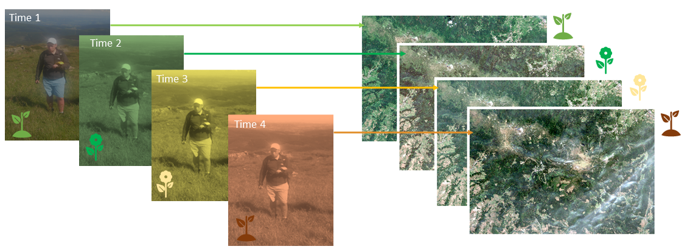
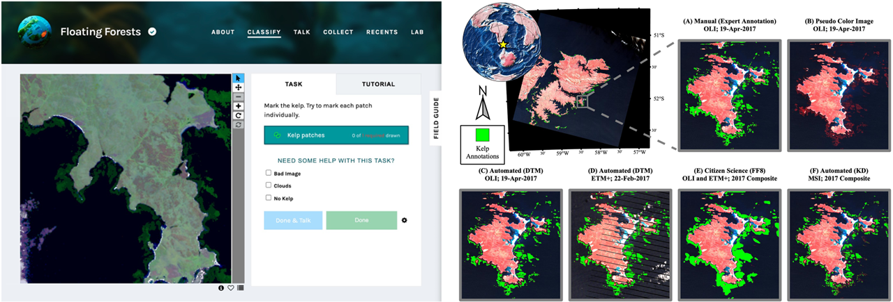
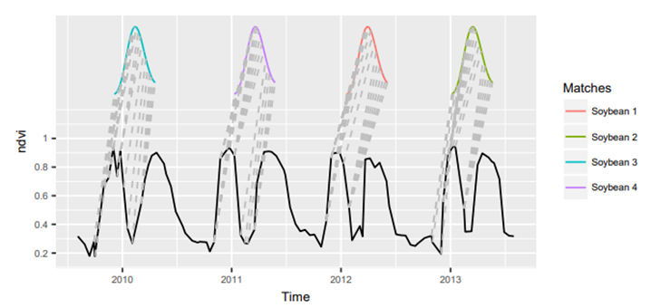
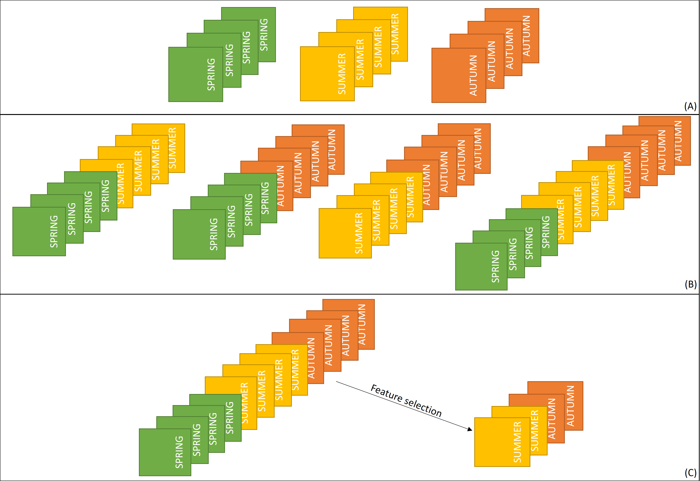
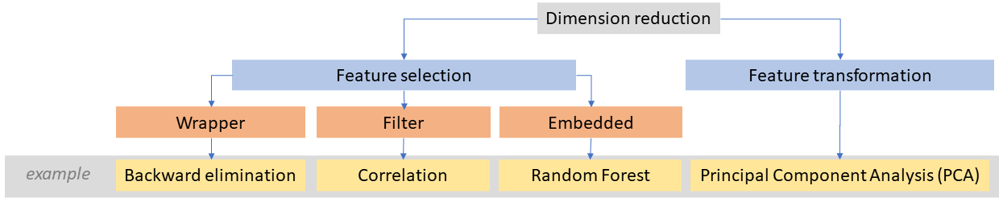
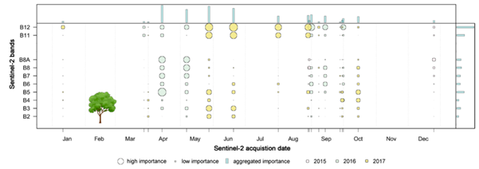
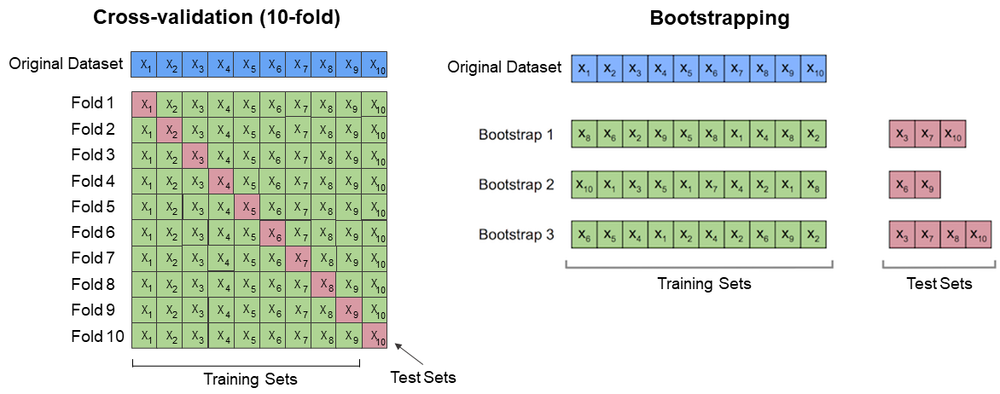
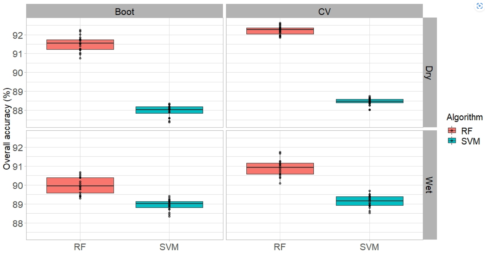
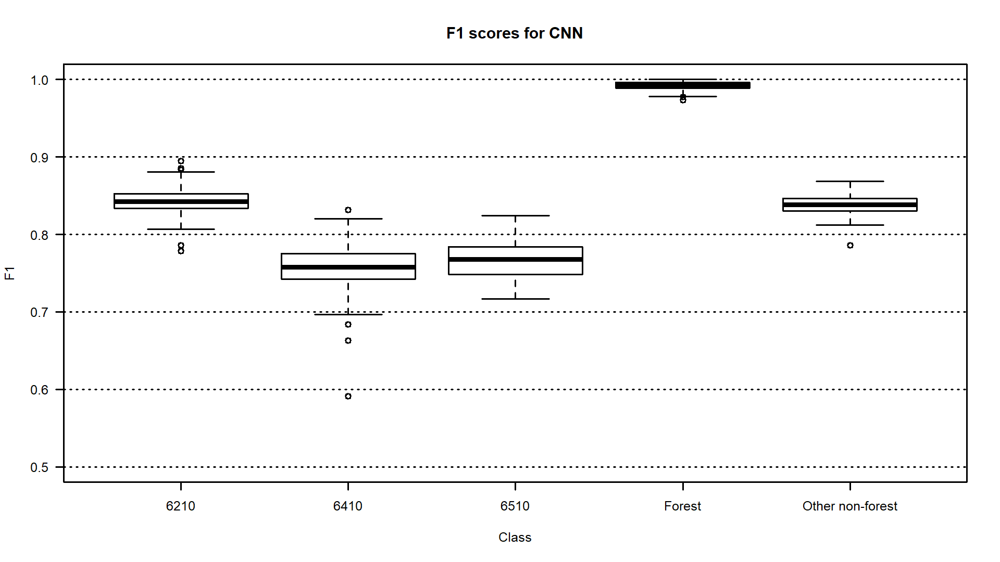

Multitemporal classification
================

Semi-automatic supervised classification based on multitemporal datasets has the potential to improve mapping performance in comparison to single-date collected data, especially for naturally changing vegetation classes. Phenological characteristics and time-related spectral behaviour are key to an improved potential of input data consisting of images acquired over a period of time.

In this theme, you will learn about:

- **[Multitemporal reference dataset](#multitemporal-reference-dataset)**
- **[Machine learning algorithms](#machine-learning-algorithms)**
- **[Selection of the best terms of data acquisition](#selection-of-the-best-terms-of-data-acquisition)**
- **[Results validation and accuracy assesment](#results-validation-and-accuracy-assesment)**

This theme will conclude with:

- **[Self-evaluation quiz](#self-evaluation-quiz)**
- **[References](#references)**

To consolidate your knowledge and test it in more practical environment complete the **[Exercise](04_multitemporal_classification_exercise.md)**.

After completing this theme, you will:

- understand the potential of satellite multitemporal datasets for improving mapping performance
- be familiar with the challenges of collecting reference data for multitemporal classification
- know the availability of publicly available multitemporal land cover datasets and alternative data sources for reference data collection, such as citizen science projects
- be familiar with machine learning algorithms commonly used for multitemporal classification, and be introduced to modifications of algorithms that consider spatio-temporal dependencies for improved classification
- understand the role of feature selection in optimizing multitemporal classification by reducing dimensionality
- be aware of R packages that include machine/statistical learning algorithms for classification
- understand the strategies for validation and accuracy assessment of multitemporal classification results, including methods like k-fold cross-validation and bootstrapping

## Multitemporal reference dataset

Reference data for the classification of satellite images can be collected in the field or sourced from developed (reliable!) products. Below, we will discuss a few issues related to the data itself and the temporal aspect.

**Reference data sampling** for time series data classification in general is a challenging task. Ideally, the reference data should come from field campaigns performed near the satellite data acquisition dates.

<i>The concept of synchronized GPS field measurements with the dates of acquiring satellite data (alpine grasslands in Karkonosze Mts., figure by course authors).</i>

However, this scenario is rather impossible to fulfill when dealing with time series composed of regularly and frequently collected images (such as Sentinel-2 every 5 days), especially in terrains like mountains.

In such cases, when the classes are relatively easy to recognize, it might be helpful to use additional daily acquired high-resolution data (for instance PlanetScope) to enrich the image interpretation needed to make the reference dataset denser. Another data source can be Google Earth, where high-resolution imagery from aerial platforms is available. However, we should deeply analyze the areas where the known objects of interest are located (spatial surroundings and/or spectral characteristics) to check the consistency between available data in different terms.

If we are unable to collect reference data in the field, we can use various **publicly available datasets** developed at the global, continental, regional, or local scale. Some of these datasets are only available for one date or year, but many consist of time series (see Table 1, and note that only classes excluding presented changes are listed there). These are mainly related to land use/land cover, but there are also more detailed databases for specific classes, such as agricultural areas, forests, grasslands, etc. (see more in [García-Álvarez et al., 2022](https://doi.org/10.1007/978-3-030-90998-7)).

<b>Table 1. Selected multitemporal land cover datasets with global/continental extent developed on satellite data.</b>

| Extent        | Product name                                                     | Dates                        | Pixel size | Source data                                         | Maximum no of. classes | Source                                                                                                                |
|---------------|------------------------------------------------------------------|------------------------------|------------|-----------------------------------------------------|------------------------|-----------------------------------------------------------------------------------------------------------------------|
| global        | World Cover                                                      | 2020, 2021                   | 10 m       | Sentinel-2                                          | 11                     | 2020: <https://doi.org/10.5281/zenodo.5571936> 2021: <https://doi.org/10.5281/zenodo.7254221>                         |
| global        | Esri Land Cover                                                  | 2017-2022                    | 10 m       | Sentinel-2                                          | 9                      | <https://livingatlas.arcgis.com/landcoverexplorer>                                                                    |
| global        | Dynamic World                                                    | 2015-present                 | 10 m       | Sentinel-2                                          | 9                      | <https://dynamicworld.app/>                                                                                           |
| global        | TimeSpec4LULC                                                    | 2002-2021                    | 500 km     | MODIS                                               | 29                     | <https://zenodo.org/record/5020024#.Y9mruz3MKUk>                                                                      |
| global        | CGLS-LC100—Copernicus Global Land Service Dynamic Land Cover Map | 2015-2019                    | 100 m      | PROBA-V, Sentinel-2, MODIS                          | 24                     | <https://land.copernicus.eu/global/products/lc>                                                                       |
| european      | CLC—CORINE Land Cover                                            | 1990, 2000, 2006, 2012, 2018 | 100 m      | Landsat, SPOT; ITS P6, RapidEye, LISS III, Sentinel | 44                     | <https://land.copernicus.eu/pan-european/corine-land-cover>                                                           |
| european      | Annual Land Cover Product                                        | 2000-2019                    | 30 m       | Landsat, VIIRS/SUOMI NPP                            | 33                     | <https://medium.com/swlh/europe-from-above-space-time-machine-learning-reveals-our-changing-environment-1b05cb7be520> |
| Africa        | West Africa Land Use Land Cover                                  | 1975, 2000, 2013             | 2 km       | Landsat                                             | 30                     | <https://eros.usgs.gov/westafrica/>                                                                                   |
| South America | LBA-ECO LC-08—Land Cover Map of South America                    | 1987, 1991                   | 1 km       | AVHRR                                               | 42                     | <https://daac.ornl.gov/LBA/guides/LC08_EOS_Maps.html>                                                                 |
| North America | NALCMS—North American Land Change Monitoring System              | 2005, 2010, 2015             | 30, 250 m  | Landsat, MODIS                                      | 19                     | <http://www.cec.org/north-american-land-change-monitoring-system/>                                                    |

At the top of the table there are multitemporal databases based of 10 m Sentinel-2 data updated annually: **World Cover** and **Esri Land Cover**, as well as in almost real time: **Dynamic World** (see interesting comparison of these three in [Venter et al., 2022](https://doi.org/10.3390/rs14164101)). Unlike the CORINE database developed as a result of images visual interpretation, these are the results of automatic classifications using machine/deep learning, and possible errors and lower accuracy in unverified areas should be taken into account. It’s also important to note that based on maps, we know there are transition zones between classes.

In general, you should not take the boundaries of all classes from such products literally. They are supposed to be reference materials that will help you determine the classes of the legend and make it easier for you to interpret the objects. Which parts of such a set you consider reliable is up to you.

A unique way to have data from the field for local scale analysis, without being able to collect it on our own, is to use samples collected within **citizen science** projects. In these projects, geolocated and labeled field observations are acquired by volunteers, e.g. with their smartphones. There are also some tutorials how to interpret the objects of interest making the dataset as much reliable as possible. We refer you to read about some projects and platforms in **[Theme 6 of Module 1](../../module1/06_reference_data_validation_accuracy_assessment/06_reference_data_validation_accuracy_assessment.md)**. Example publication where citizen science collected data were used for classification was elaborated by [Houskeeper et al., 2022](https://doi.org/10.1371/journal.pone.0257933).

<i>The example of utilization of citizen science data. Left: The [Zooniverse](https://Zooniverse.org) platform in which citizen scientists indicate kelp canopy locations for the [Floating Forests](https://www.zooniverse.org/projects/zooniverse/floating-forests) project, right: giant kelp classification result based on Landsat data (figure by [Houskeeper et al., 2022](https://doi.org/10.1371/journal.pone.0257933)/ [CC BY 4.0](https://creativecommons.org/licenses/by/4.0/)).</i>

Regardless of whether we use field data or existing maps/databases, it is useful to apply **simple change detection** to exclude possible changes between analysed dates, especially when using data from several years. This can be achieved by calculating difference between spectral index values of the actual and previous years (for instance pixels with absolute differences of NDVI ≤0.05 flagged as ‘change’; [Immitzer et al., 2019](https://doi.org/10.3390/rs11222599)) or to apply some disturbance detection related algorithm like e.g. [LandTrendr](https://geotrendr.ceoas.oregonstate.edu/landtrendr/), see **[Theme 5](../05_vegetation_monitoring/05_vegetation_monitoring.md)**. Such information can be important in developing a reference set for classification that is to point to the same constant objects. For the construction of multitemporal reference dataset, especially when using a wider time range for classification, a **time series visualisation tool** such as [TimeSync](https://www.fs.usda.gov/pnw/tools/timesync-landsat-time-series-visualization-and-data-collection-tool) or the one you learned in an exercise in **[Theme 2](../02_temporal_information/02_temporal_information.md)** may be also useful (you will use it to develop your own reference data set in the exercise at the end).

## Machine learning algorithms

When classifying multitemporal data, a large number of predictor variables can be involved. Therefore, it’s important to select the optimal algorithm in terms of computational cost, accuracy, and so on. Literature on multitemporal classification often confirms the suitability of supervised learning. The most frequently used machine learning algorithms are **Random Forest** (RF, [Breiman, 2001](https://doi.org/10.1023/A:1010933404324)), **Support Vector Machines** (SVMs, [Vapnik, 1999](https://doi.org/10.1109/72.788640)) and **Artificial Neural Networks** (ANNs) including deep learning algorithms, such as **Convolutional Neural Networks** (CNNs, [LeCun, 1998](https://doi.org/10.1109/5.726791)). Below are the examples of their use with satellite data in mapping of e.g.:

- grasslands ([Rapinel et al., 2019](https://doi.org/10.1016/j.rse.2019.01.018), [Tarantino et al., 2021](https://doi.org/10.3390/rs13020277), [Marcinkowska-Ochtyra et al., 2023](https://doi.org/10.3390/rs15051388)),
- tree species ([Immitzer et al., 2019](https://doi.org/10.3390/rs11222599), [Hościło and Lewandowska, 2019](https://doi.org/10.3390/rs11080929)),
- mountain vegetation, including forests ([Kollert et al., 2021](https://doi.org/10.1016/j.jag.2020.102208)), non-forests ([Wakulińska and Marcinkowska-Ochtyra et al., 2020](https://doi.org/10.3390/rs12172696)) and both ([Kluczek et al., 2022](https://doi.org/10.3390/rs14051209)),
- crops ([Gadiraju et al., 2020](https://doi.org/10.1145/3394486.3403375), [Ashourloo et al., 2022](https://doi.org/10.1016/j.rse.2022.113206)),
- coastal areas ([Marzialetti et al., 2019](https://doi.org/10.3390/rs11121506), [Munizaga et al., 2022](https://doi.org/10.3390/su14095700)), etc.

Recently, increasing amounts of multitemporal satellite data has led to modifications of some known algorithms. These modifications take into account **spatio-temporal dependencies** into classification, particularly for deep learning, e.g. **Temporal Convolutional Network** (TCN, [Bai et al., 2018](https://doi.org/10.48550/arXiv.1803.01271)), **Temporal Convolutional Neural Networks** (TempCNNs, [Pelletier et al., 2019](https://doi.org/10.3390/rs11050523)), **A DUal view Point deep Learning architecture for time series classificatiOn** (DuPLO, [Interdonato et al., 2019](https://doi.org/10.1016/j.isprsjprs.2019.01.011)).

Other modifications are the algorithms that **that break time series into segments and then classify them**, e.g. **Continuous Change Detection and Classification** (CCDC, [Zhu and Woodcock, 2014](https://doi.org/10.1016/j.rse.2014.01.011)), which links two types of analyses: detecting land cover changes and providing land cover maps using Random Forest for any given time. We refer to this in **[Theme 5](../05_vegetation_monitoring/05_vegetation_monitoring.md)**.

Another approach is presented in **Time-Weighted Dynamic Time Warping** algorithm (TWDTW, [Maus et al., 2019](https://doi.org/10.18637/jss.v088.i05)), modified version of **dynamic time warping** (DTW) method to match time series data segments into predefined temporal patterns. In general, the standard DTW compares a temporal signature of a known event with an unknown time series by finding all possible alignments between two time series and providing a **dissimilarity measure** (values close to zero show the highest similarity between the time series). TWDTW is additionally sensitive to various vegetation (natural and cultivated) seasonal dynamics.

<i>The matches of the ‘soybean’ class pattern in time series using TWDTW on MODIS data (solid black line - long-term time series, the colored lines - temporal patterns; gray dashed lines - the respective matching points (figure by [Maus et al., 2019](https://doi.org/10.18637/jss.v088.i05)/ [CC BY 3.0](https://creativecommons.org/licenses/by/3.0/)).</i>

*Note: Since this module mainly focuses on data with medium spatial resolution, we present the described algorithms in a pixel-based, not object-based approach. The latter would be more justified using high-resolution data, however you can find also examples on its use with e.g. Sentinel-2 (article about the use of different segmentation methods for delineation of field boundaries by [Watkins and Van Niekerk, 2019](https://doi.org/10.1016/j.compag.2019.02.009)).*

### R packages including Machine/Statistical Learning algorithms

Since different modules and themes of this course use different classification tools, we will focus on the R packages available for this purpose. Most of the packages mentioned below are used to train, tune, develop and apply the statistical classification models. Application to the numerical and categorical data results in accuracy metrics and confusion matrices. Models can also be applied to produce classification images with e.g. `predict` function from the `raster` package or grid CSV files.

The following table focuses on the tools, which enable obtaining and analyzing both accuracy metrics and classification image.

<b>Table 2. Selected R packages used in classification of satellite imagery.</b>

| Package name                                                          | Title                                                                                               | Description                                                                                                                                                                                                                                                                                                                                                                                                                                                                                                                                                                                                                                                      | Classification algorithms                                                                                                 | Key functions                                                                                                                                          | Authors                                                                                                                                                                                                                                                         |
|-----------------------------------------------------------------------|-----------------------------------------------------------------------------------------------------|------------------------------------------------------------------------------------------------------------------------------------------------------------------------------------------------------------------------------------------------------------------------------------------------------------------------------------------------------------------------------------------------------------------------------------------------------------------------------------------------------------------------------------------------------------------------------------------------------------------------------------------------------------------|---------------------------------------------------------------------------------------------------------------------------|--------------------------------------------------------------------------------------------------------------------------------------------------------|-----------------------------------------------------------------------------------------------------------------------------------------------------------------------------------------------------------------------------------------------------------------|
| [C50](https://CRAN.R-project.org/package=C50)                         | C5.0 Decision Trees and Rule-Based Models                                                           | C5.0 decision trees and rule-based models for pattern recognition that extend the work of Quinlan (1993, <ISBN:1-55860-238-0>).                                                                                                                                                                                                                                                                                                                                                                                                                                                                                                                                  | C5.0 Decision Trees and Rule-Based Models                                                                                 | `C5.0`, `plot.C5.0` [Reference manual](https://cran.r-project.org/web/packages/C50/C50.pdf)                                                            | Max Kuhn, Steve Weston, Mark Culp, Nathan Coulter, Ross Quinlan (Author of imported C code), RuleQuest Research (Copyright holder of imported C code), Rulequest Research Pty Ltd. (Copyright holder of imported C code)                                        |
| [caTools](https://CRAN.R-project.org/package=caTools)                 | Tools: Moving Window Statistics, GIF, Base64, ROC AUC, etc                                          | Contains several basic utility functions including: moving (rolling, running) window statistic functions, read/write for GIF and ENVI binary files, fast calculation of AUC, LogitBoost classifier, base64 encoder/decoder, round-off-error-free sum and cumsum, etc.                                                                                                                                                                                                                                                                                                                                                                                            | LogitBoost                                                                                                                | `LogitBoost` [Reference manual](https://cran.r-project.org/web/packages/caTools/caTools.pdf)                                                           | Jarek Tuszynski                                                                                                                                                                                                                                                 |
| [e1071](https://CRAN.R-project.org/package=e1071)                     | Misc Functions of the Department of Statistics, Probability Theory Group (Formerly: E1071), TU Wien | Functions for latent class analysis, short time Fourier transform, fuzzy clustering, support vector machines, shortest path computation, bagged clustering, naive Bayes classifier, generalized k-nearest neighbour.                                                                                                                                                                                                                                                                                                                                                                                                                                             | Support Vector Machines, Fuzzy C-Means Clustering, Generalized k-Nearest Neighbors Classification, Naive Bayes Classifier | `svm`, `cmeans`, `gknn`, `naiveBayes`, `tune` [Reference manual](https://cran.r-project.org/web/packages/e1071/e1071.pdf)                              | David Meyer, Evgenia Dimitriadou, Kurt Hornik, Andreas Weingessel, Friedrich Leisch, Chih-Chung Chang, Chih-Chen Lin                                                                                                                                            |
| [ipred](https://CRAN.R-project.org/package=ipred)                     | Improved Predictors                                                                                 | Improved predictive models by indirect classification and bagging for classification, regression and survival problems as well as resampling based estimators of prediction error.                                                                                                                                                                                                                                                                                                                                                                                                                                                                               | Bagging Classification Trees, k-Nearest Neighbour Classification                                                          | `bagging`, `ipredknn` [Reference manual](https://cran.r-project.org/web/packages/ipred/ipred.pdf)                                                      | Andrea Peters, Torsten Hothorn, Brian D. Ripley, Terry Therneau, Beth Atkinson                                                                                                                                                                                  |
| [kernlab](https://CRAN.R-project.org/package=kernlab)                 | Kernel-Based Machine Learning Lab                                                                   | Kernel-based machine learning methods for classification, regression, clustering, novelty detection, quantile regression and dimensionality reduction. Among other methods ‘kernlab’ includes Support Vector Machines, Spectral Clustering, Kernel PCA, Gaussian Processes and a QP solver.                                                                                                                                                                                                                                                                                                                                                                      | Support Vector Machines, Least Squares Support Vector Machine, Gaussian processes for classification                      | `ksvm`, `lssvm`, `gausspr`, `sigest` [Reference manual](https://cran.r-project.org/web/packages/kernlab/kernlab.pdf)                                   | Alexandros Karatzoglou, Alex Smola, Kurt Hornik, National ICT Australia (NICTA)\] Michael A. Maniscalco, Choon Hui Teo                                                                                                                                          |
| [nnet](https://CRAN.R-project.org/package=nnet)                       | Feed-Forward Neural Networks and Multinomial Log-Linear Models                                      | Software for feed-forward neural networks with a single hidden layer, and for multinomial log-linear models.                                                                                                                                                                                                                                                                                                                                                                                                                                                                                                                                                     | Single-Hidden-Layer Neural Network                                                                                        | `nnet` [Reference manual](https://cran.r-project.org/web/packages/nnet/nnet.pdf)                                                                       | Brian Ripley, William Venables                                                                                                                                                                                                                                  |
| [randomForest](https://CRAN.R-project.org/package=randomForest)       | Breiman and Cutler’s Random Forests for Classification and Regression                               | Classification and regression based on a forest of trees using random inputs, based on [Breiman (2001)](doi:10.1023/A:1010933404324) .                                                                                                                                                                                                                                                                                                                                                                                                                                                                                                                           | Random Forest                                                                                                             | `randomForest`, `tuneRF`, `rfcv`, `importance`, `varImpPlot` [Reference manual](https://cran.r-project.org/web/packages/randomForest/randomForest.pdf) | Fortran original by Leo Breiman and Adele Cutler, R port by Andy Liaw and Matthew Wiener.                                                                                                                                                                       |
| [randomForestSRC](https://CRAN.R-project.org/package=randomForestSRC) | Fast Unified Random Forests for Survival, Regression, and Classification (RF-SRC)                   | Fast OpenMP parallel computing of Breiman’s random forests for univariate, multivariate, unsupervised, survival, competing risks, class imbalanced classification and quantile regression. New Mahalanobis splitting for correlated outcomes. Extreme random forests and randomized splitting. Suite of imputation methods for missing data. Fast random forests using subsampling. Confidence regions and standard errors for variable importance. New improved holdout importance. Case-specific importance. Minimal depth variable importance. Visualize trees on your Safari or Google Chrome browser. Anonymous random forests for data privacy.            | Random Forest                                                                                                             | `rfsrc`, `tune`, `vimp` [Reference manual](https://cran.r-project.org/web/packages/randomForestSRC/randomForestSRC.pdf)                                | Hemant Ishwaran, Udaya B. Kogalur                                                                                                                                                                                                                               |
| [rpart](https://CRAN.R-project.org/package=rpart)                     | Recursive Partitioning and Regression Trees                                                         | Recursive partitioning for classification, regression and survival trees. An implementation of most of the functionality of the 1984 book by Breiman, Friedman, Olshen and Stone.                                                                                                                                                                                                                                                                                                                                                                                                                                                                                | Recursive Partitioning and Regression Trees                                                                               | `rpart`, `plot.rpart` [Reference manual](https://cran.r-project.org/web/packages/xgboost/xgboost.pdf)                                                  | Terry Therneau, Beth Atkinson, Brian Ripley (producer of the initial R port, maintainer 1999-2017)                                                                                                                                                              |
| [xgboost](https://CRAN.R-project.org/package=xgboost)                 | Extreme Gradient Boosting                                                                           | Extreme Gradient Boosting, which is an efficient implementation of the gradient boosting framework from [Chen & Guestrin (2016)](https://doi.org/10.1145/2939672.2939785). This package is its R interface. The package includes efficient linear model solver and tree learning algorithms. The package can automatically do parallel computation on a single machine which could be more than 10 times faster than existing gradient boosting packages. It supports various objective functions, including regression, classification and ranking. The package is made to be extensible, so that users are also allowed to define their own objectives easily. | Extreme Gradient Boosting                                                                                                 | `xgboost` [Reference manual](https://cran.r-project.org/web/packages/xgboost/xgboost.pdf)                                                              | Tianqi Chen, Tong He, Michael Benesty, Vadim Khotilovich, Yuan Tang, Hyunsu Cho, Kailong Chen , Rory Mitchell, Ignacio Cano, Tianyi Zhou, Mu Li, Junyuan Xie, Min Lin, Yifeng Geng, Yutian Li, Jiaming Yuan, XGBoost contributors (base XGBoost implementation) |

Packages that combine different utilities like pre-processing, tuning, multi-method fitting, importance estimations, visualizations etc.:

- [caret](https://CRAN.R-project.org/package=caret)
- [caretEnsemble](https://CRAN.R-project.org/package=caretEnsemble)
- [CORElearn](https://CRAN.R-project.org/package=CORElearn)
- [DALEX](https://CRAN.R-project.org/package=DALEX)
- [h2o](https://CRAN.R-project.org/package=h2o)
- [mltools](https://CRAN.R-project.org/package=mltools)
- [mlr3](https://CRAN.R-project.org/package=mlr3)
- [rminer](https://CRAN.R-project.org/package=rminer)
- [sits](https://CRAN.R-project.org/package=sits)
- [SuperLearner](https://CRAN.R-project.org/package=SuperLearner)
- [tidymodels](https://CRAN.R-project.org/package=tidymodels)

## Selection of the best terms of data acquisition

Depending on the classified object, the date of data acquisition will be key in the most accurate identification. For vegetation classes, phases of its development are particularly significant. For example, for grasslands in the Karkonosze Mountains that begin to discolor in autumn, September would be a more appropriate time to distinguish them from their surroundings than other months like August, when they are spectrally similar to subalpine tall forbs.

Creating the optimal spectro-temporal dataset for specific purpose can be done in three ways:

1.  **classifying each image** for each term separately and assessing the accuracy of each result,

2.  **classification of multitemporal data**, where particular or all terms are combined into one dataset to increase the potential of the data by allowing more temporal variability to be used,

3.  **classification of multitemporal data** and **selection** of the **most important variables** in the classification and using the model with only those variables.

<i>Time-series datasets used for selection of the best term of data acquisition for classification (A - three single-date datasets, B - multitemporal dataset in each possible terms combination, C - the best variables selected from multitemporal dataset, figure by course authors).</i>

The first two do not require the use of additional tools, while the last one uses **feature selection (FS)** methods (see the next section).

### Feature selection as potential to optimise multitemporal classification

Multitemporal classification involves **many variables**. For instance, five Sentinel-2 scenes with selected 10 spectral bands each will result in 50 variables.

This can lead to longer data processing times and may also lead to the inclusion of correlated bands, which carry similar information. Including **additional** bands, such as spectral or textural indices may be useful, but it also increases the dataset. Hence, selecting the most important ones and including them in the development of the final product can significantly improve the accuracy of the obtained result. Apart from the obtained accuracies, the data **storage, processing time**, and **simplicity** of classification models are also important, especially in large scale analysis. Therefore, the reduction of the number of variables to the most influential ones makes this multitemporal classification process more robust.

Generally, to reduce dimensionality in data we can apply transformation (such as PCA transformation described in **[Theme 1](../01_multispectral_principles/01_multispectral_principles.md#transformations)**) or feature selection methods.

<i>Dimensionality reduction methods with examples (figure by course authors).</i>

Feature selection approaches can be distinguished into three groups ([Li et al., 2017](https://dl.acm.org/doi/pdf/10.1145/3136625)):

- **Filter** - where bands selection is independent of the classifier. An example is a statistic measuring Pearson’s correlation between two variables.
- **Wrapper** - where a specific classification model is applied for training and testing. An example is the backward elimination method, which starts with all features included in the model and then removes the least relevant features.
- **Embedded** - where band selection is performed within classifier construction. The advantage of some machine learning algorithms is the ability to identify the most influential bands thanks to the **variable importance metric** calculation mechanism. For example, in Random Forest, it is based on an average decrease in accuracy or an average decrease in the Gini coefficient (the higher the value of the measure, the greater the usefulness of a given variable).

<i>Aggregated feature importance derived from tree species Sentinel-2 classification result from 2015-2017 by the use of variable importance in Random Forest (figure by [Immitzer et al., 2019](https://doi.org/10.3390/rs11222599), modified/ [CC BY 4.0](https://creativecommons.org/licenses/by/4.0/)).</i>

Feature selection methods can be divided into **unsupervised** and **supervised**. The first one select representative bands based on the original image characteristics, while the second one use label information to assess the quality of particular bands.

The choice of the final variables is user-dependent. It will affect both the accuracy of the classification and its duration so the compromise between high accuracy and time-effectiveness of data acquisition and processing is needed. [Georganos et al., 2017](https://doi.org/10.1080/15481603.2017.1408892) proposed a metric called **classification optimization score** (COS) that rewards model simplicity and penalises increasing computational time using a given number of features in the classification model.

## Results validation and accuracy assesment

Validation of multitemporal classification results is often not very straightforward, and different strategies can be implemented to validate it qualitatively and quantitatively (see more on this in **[Theme 6 of Module 1](../../module1/06_reference_data_validation_accuracy_assessment/06_reference_data_validation_accuracy_assessment.md)**). It can be performed as follows:

- visual images interpretation (where pixel size plays a key role in distinguishing objects)
- the use of existing maps or databases from inventories (where the key is information whether the data are up-to-date)
- splitting the whole reference dataset - classification - and then, assessing the accuracy of obtained result.

While the first two points can be independent of the data used for classification, the third defines the entire classification and validation procedure simultaneously. Different strategies can be adopted for the **split of the whole data set**: equal division (50%/50%), the greater part intended for training and the smaller part for validation (e.g. 63.2%/36.8%), or the greater part intended for validation (e.g. 30%/70%).

When we have a reference sample set, we can split it in various proportions **iteratively** which will lead to obtain multiple results, allowing them to be considered more objective than those obtained once, due to less randomness. This can be performed via methods like **k-fold cross-validation** or **bootstrapping** ([Kohavi 1995](https://www.researchgate.net/profile/Ron-Kohavi/publication/2352264_A_Study_of_Cross-Validation_and_Bootstrap_for_Accuracy_Estimation_and_Model_Selection/links/02e7e51bcc14c5e91c000000/A-Study-of-Cross-Validation-and-Bootstrap-for-Accuracy-Estimation-and-Model-Selection.pdf)). In the first technique, the **k** parameter refers to the different number of dataset subsets divided randomly. This number is used for the model training while the rest is used for validation. In each training and evaluation step, the prediction error is calculated and after repeating it k-times, the overall measure is provided. In bootstrapping ([Efron and Tibshirani, 1997](https://doi.org/10.1080/01621459.1997.10474007)), the training dataset is randomly selected with replacement and remaining samples are used for validation n-times. Contrary to k-fold cross-validation, they can change from fold to fold. The prediction error is also averaged from each iteration. These both approaches differ in terms of results variance.

<i>10-fold cross-validation vs bootstrapping illustration (figure by S. Rashchka [bootstrap_point632_score](https://rasbt.github.io/mlxtend/user_guide/evaluate/bootstrap_point632_score/), modified/ [CC BY 4.0](https://creativecommons.org/licenses/by/4.0/)).</i>

If you are interested in details on differences within such iterative methods, you can read the article of [Lyons et al., 2018](https://doi.org/10.1016/j.rse.2018.02.026) and test their [code in R](https://github.com/mitchest/rs-accuracy-variance) where three methods were compared (each of them proved that a single split into training/validation data often gives inaccurate or misleading results).

The example of comparison of bootstrapping and cross-validation on PlanetScope data classification performance was described by [Phinzi et al., 2021](https://doi.org/10.3390/rs13152980).

<i>Overall accuracies obtained for two classifiers (SVM and RF) using cross-validation and bootstrapping in mapping complex gully systems in wet and dry seasons (figure by [Phinzi et al., 2021](https://doi.org/10.3390/rs13152980)/ [CC BY 4.0](https://creativecommons.org/licenses/by/4.0/)).</i>

When using such methods we have the information about the distribution of the obtained classification accuracies so that we can calculate mean, median, standard deviation, minimum, maximum value etc. What’s more, you can compare which of the distinguished classes are more or less stable in terms of the accuracy obtained, which proves that they are easier or more difficult to identify. This shows a lot about the variability of classified objects, in multitemporal classification - over time (see the example below where F1 accuracies for grassland Natura 2000 habitats were calculated 100 times).

<i>Boxplots presenting F1 accuracies obtained 100 times with CNNs for Natura 2000 habitats classification on Sentinel-2 time series data (6210 code - semi-natural dry grasslands and scrubland facies on calcareous substrates, 6410 code - Molinia meadows on calcareous, peaty, or clay silt-laden soils, 6510 code - lowland hay meadows, figure by [Marcinkowska-Ochtyra et al., 2023](https://doi.org/10.3390/rs15051388)/ [CC BY 4.0](https://creativecommons.org/licenses/by/4.0/)).</i>

As you can see above, commonly used measures in accuracy assessment are ([Congalton, 1991](https://doi.org/10.1016/0034-4257(91)90048-B), [Van Rijsbergen, 1977](https://doi.org/10.1108/eb026637)):

- **Overall accuracy (OA)** calculated for whole classified image result,
- **Producer (PA)** and **User (UA)** accuracies and **F1 measure** being harmonic mean of these both, calculated for individual classes.

They are calculated based on **error matrix**. You can find more on this in **[Theme 6 of Module 1](../../module1/06_reference_data_validation_accuracy_assessment/06_reference_data_validation_accuracy_assessment.md#classification)**.

## Self-evaluation quiz

You have now completed this theme content. Now you can evaluate yourself by answering the questions in quiz. Good luck !

<form name="quiz" action method="post" onsubmit="evaluate_quiz(); return false">
<!--Question 1-->
<label for="q_01"> <b>Question 1.</b> Multitemporal classification requires: </label>  <input type="radio" name="q_01">applying variable importance tool  <input type="radio" name="q_01">ensuring radiometric consistency  <input type="radio" name="q_01">subtraction of classified images  <input type="radio" name="q_01">the use of field collected data 

ensuring radiometric consistency

<output id="output_q_01">
</output>

  

<!--Question 2-->
<label for="q_02"> <b>Question 2.</b> The most optimal spectro-temporal dataset for classification can not be indicated by: </label>  <input type="radio" name="q_02">classification of each term separately and the assessment of accuracy of each result  <input type="radio" name="q_02">classification of each term separately and calculating the accuracy measure for only the best one assessed visually  <input type="radio" name="q_02">classification of multitemporal dataset and then selection of the most important features via variable importance tool  <input type="radio" name="q_02">classification of multitemporal datasets with different dates combinations and then assessing their accuracies 

classification of each term separately and calculating the accuracy measure for only the best one assessed visually

<output id="output_q_02">
</output>

  

<!--Question 3-->
<label for="q_03"> <b>Question 3.</b> Why the use of iterative methods of accuracy assesment are important in multitemporal classification result analysis? </label> 
<textarea rows = "5" cols = "50" name = "q_03"></textarea>

 

We have the information about the distribution of the obtained classification accuracies and we can calculate statistics (mean, median, standard deviation, minimum, maximum value etc.), we can compare which of the classes are more or less stable in terms of the accuracy obtained, it presents variability of classified objects over time, single split is more prone to randomness.

<output id="output_q_03">
</output>

  

<!--Question 4-->
<label for="q_04"> <b>Question 4.</b> Which characteristic can be related the most to multitemporal classification algorithm? </label>  <input type="radio" name="q_04">detecting changes and classification of first date image data  <input type="radio" name="q_04">matching time series data into predefined temporal patterns  <input type="radio" name="q_04">including spatio-spectral dependencies into classification  <input type="radio" name="q_04">assessing quality and calculation of errors on pre-processed image data 

matching time series data into predefined temporal patterns

<output id="output_q_04">
</output>

  

<!--Question 5-->
<label for="q_05"> <b>Question 5.</b> Which feature selection method will allow to assess final classification model performance itself? </label>  <input type="radio" name="q_05">Principal Component Analysis  <input type="radio" name="q_05">Pearson’s correlation  <input type="radio" name="q_05">Backward elimination  <input type="radio" name="q_05">Random Forest 

Random Forest

<output id="output_q_05">
</output>

  

<!--Question 6-->
<label for="q_06"> <b>Question 6.</b> How to assess which class is easy to recognize on multitemporal dataset via classification? </label>  <input type="radio" name="q_06">I can identify pixels classified such as this class by error matrix analysis  <input type="radio" name="q_06">Overall accuracy for classified image is very high  <input type="radio" name="q_06">F1 measure calculated iteratively gave me similarly high minimum and maximum values obtained  <input type="radio" name="q_06">Variable importance tool provided me the list of the most influential bands for classification of this class 

F1 measure calculated iteratively gave me similarly high minimum and maximum values obtained

<output id="output_q_06">
</output>

  

<!--Question 7-->
<label for="q_07"> <b>Question 7.</b> What does the reduction of the spectral dimension allow in the classification of multitemporal data? Name at least three effects. </label> 
<textarea rows = "5" cols = "50" name = "q_07"></textarea>

 

To select only the most informative bands, to increase the accuracy of classification, to select the most important terms for identifying a given class, to reduce the volume of data, to optimize/shorten the classification process…

<output id="output_q_07">
</output>

  

<output id="output_overall">
</output>

<input type="submit" value="Submit" style="font-size:14pt">  

</form>

## Exercise

[Proceed with the exercise by going to the next page below or clicking this link](04_multitemporal_classification.md)

## References

### Key references (recommended reading, looking up background details)

Gómez, C., White, J. C., & Wulder, M. A. (2016). *Optical remotely sensed time series data for land cover classification: A review*. ISPRS Journal of Photogrammetry and Remote Sensing, 116, 55-72. <https://doi.org/10.1016/j.isprsjprs.2016.03.008>

### Additional references cited in this theme

Ashourloo, D., Nematollahi, H., Huete, A., Aghighi, H., Azadbakht, M., Shahrabi, H. S., & Goodarzdashti, S. (2022). *A new phenology-based method for mapping wheat and barley using time-series of Sentinel-2 images*. Remote Sensing of Environment, 280, 113206. <https://doi.org/10.1016/j.rse.2022.113206>

Bai, S., Kolter, J. Z., & Koltun, V. (2018). *An empirical evaluation of generic convolutional and recurrent networks for sequence modeling*. arXiv preprint arXiv:1803.01271. <https://doi.org/10.48550/arXiv.1803.01271>

Breiman, L. (2001). *Random forests*. Machine learning, 45, 5-32. <https://doi.org/10.1023/A:1010933404324>

Congalton, R. G. (1991). *A review of assessing the accuracy of classifications of remotely sensed data*. Remote Sensing of Environment, 37(1), 35-46. <https://doi.org/10.1016/0034-4257(91)90048-B>

Efron, B., & Tibshirani, R. (1997). *Improvements on cross-validation: the 632+ bootstrap method*. Journal of the American Statistical Association, 92(438), 548-560. <https://doi.org/10.1080/01621459.1997.10474007>

Gadiraju, K. K., Ramachandra, B., Chen, Z., & Vatsavai, R. R. (2020, August). *Multimodal deep learning based crop classification using multispectral and multitemporal satellite imagery*. In Proceedings of the 26th ACM SIGKDD International Conference on Knowledge Discovery & Data Mining (pp. 3234-3242). <https://doi.org/10.1145/3394486.3403375>

García-Álvarez, D., Camacho Olmedo, M. T., Paegelow, M., & Mas, J. F. (2022). *Land Use Cover Datasets and Validation Tools: Validation Practices with QGIS*, Springer International Publishing. <https://doi.org/10.1007/978-3-030-90998-7>

Georganos, S., Grippa, T., Vanhuysse, S., Lennert, M., Shimoni, M., Kalogirou, S., & Wolff, E. (2018). *Less is more: Optimizing classification performance through feature selection in a very-high-resolution remote sensing object-based urban application*. GIScience & remote sensing, 55(2), 221-242. <https://doi.org/10.1080/15481603.2017.1408892>

Hościło, A., & Lewandowska, A. (2019). *Mapping forest type and tree species on a regional scale using multi-temporal Sentinel-2 data*. Remote Sensing, 11(8), 929. <https://doi.org/10.3390/rs11080929>

Houskeeper, H. F., Rosenthal, I. S., Cavanaugh, K. C., Pawlak, C., Trouille, L., Byrnes, J. E., … & Cavanaugh, K. C. (2022). *Automated satellite remote sensing of giant kelp at the Falkland Islands (Islas Malvinas)*. Plos One, 17(1), e0257933. <https://doi.org/10.1371/journal.pone.0257933>

Immitzer, M., Neuwirth, M., Böck, S., Brenner, H., Vuolo, F., & Atzberger, C. (2019). O*ptimal input features for tree species classification in Central Europe based on multi-temporal Sentinel-2 data*. Remote Sensing, 11(22), 2599. <https://doi.org/10.3390/rs11222599>

Interdonato, R., Ienco, D., Gaetano, R., & Ose, K. (2019). DuPLO: A DUal view Point deep Learning architecture for time series classificatiOn. ISPRS Journal of Photogrammetry and Remote Sensing, 149, 91-104. <https://doi.org/10.1016/j.isprsjprs.2019.01.011>

Kluczek, M., Zagajewski, B., & Kycko, M. (2022). *Airborne HySpex hyperspectral versus multitemporal Sentinel-2 images for mountain plant communities mapping*. Remote Sensing, 14(5), 1209. <https://doi.org/10.3390/rs14051209>

Kohavi, R. (1995, August). *A study of cross-validation and bootstrap for accuracy estimation and model selection*. In Ijcai (Vol. 14, No. 2, pp. 1137-1145).

Kollert, A., Bremer, M., Löw, M., & Rutzinger, M. (2021). *Exploring the potential of land surface phenology and seasonal cloud free composites of one year of Sentinel-2 imagery for tree species mapping in a mountainous region*. International Journal of Applied Earth Observation and Geoinformation, 94, 102208. <https://doi.org/10.1016/j.jag.2020.102208>

Li, J., Tang, J., & Liu, H. (2017, August). *Reconstruction-based Unsupervised Feature Selection: An Embedded Approach*. In IJCAI (pp. 2159-2165). <https://doi.org/10.24963/ijcai.2017/300>

LeCun, Y., Bottou, L., Bengio, Y., & Haffner, P. (1998). *Gradient-based learning applied to document recognition*. Proceedings of the IEEE, 86(11), 2278-2324. <https://doi.org/10.1109/5.726791>

Lyons, M. B., Keith, D. A., Phinn, S. R., Mason, T. J., & Elith, J. (2018). *A comparison of resampling methods for remote sensing classification and accuracy assessment*. Remote Sensing of Environment, 208, 145-153. <https://doi.org/10.1016/j.rse.2018.02.026>

Maus, V., Câmara, G., Appel, M., & Pebesma, E. (2019). d*twsat: Time-weighted dynamic time warping for satellite image time series analysis in R*. Journal of Statistical Software, 88, 1-31. <https://doi.org/10.18637/jss.v088.i05>

Marcinkowska-Ochtyra, A., Ochtyra, A., Raczko, E., & Kopeć, D. (2023). *Natura 2000 Grassland Habitats Mapping Based on Spectro-Temporal Dimension of Sentinel-2 Images with Machine Learning*. Remote Sensing, 15(5), 1388. <https://doi.org/10.3390/rs15051388>

Marzialetti, F., Giulio, S., Malavasi, M., Sperandii, M. G., Acosta, A. T. R., & Carranza, M. L. (2019). *Capturing coastal dune natural vegetation types using a phenology-based mapping approach: The potential of Sentinel-2*. Remote Sensing, 11(12), 1506. <https://doi.org/10.3390/rs11121506>

Munizaga, J., García, M., Ureta, F., Novoa, V., Rojas, O., & Rojas, C. (2022). *Mapping Coastal Wetlands Using Satellite Imagery and Machine Learning in a Highly Urbanized Landscape*. Sustainability, 14(9), 5700. <https://doi.org/10.3390/su14095700>

Phinzi, K., Abriha, D., & Szabó, S. (2021). *Classification efficacy using k-fold cross-validation and bootstrapping resampling techniques on the example of mapping complex gully systems*. Remote Sensing, 13(15), 2980. <https://doi.org/10.3390/rs13152980>

Pelletier, C., Webb, G. I., & Petitjean, F. (2019). *Temporal convolutional neural network for the classification of satellite image time series*. Remote Sensing, 11(5), 523. [https://doi.org/10.3390/rs11050523](https://doi.org/10.3390/rs13152980)

Rapinel, S., Mony, C., Lecoq, L., Clement, B., Thomas, A., & Hubert-Moy, L. (2019). *Evaluation of Sentinel-2 time-series for mapping floodplain grassland plant communities*. Remote Sensing of Environment, 223, 115-129. <https://doi.org/10.1016/j.rse.2019.01.018>

Simoes, R., Camara, G., Queiroz, G., Souza, F., Andrade, P. R., Santos, L., … & Ferreira, K. (2021). *Satellite image time series analysis for big earth observation data*. Remote Sensing, 13(13), 2428. <https://doi.org/10.3390/rs13132428>

Tarantino, C., Forte, L., Blonda, P., Vicario, S., Tomaselli, V., Beierkuhnlein, C., & Adamo, M. (2021). *Intra-annual sentinel-2 time-series supporting grassland habitat discrimination*. Remote Sensing, 13(2), 277. <https://doi.org/10.3390/rs13020277>

Van Rijsbergen, C. J. (1977). *A theoretical basis for the use of co‐occurrence data in information retrieva*l. Journal of documentation. <https://doi.org/10.1108/eb026637>

Vapnik, V. N. (1999). *An overview of statistical learning theory*. IEEE Transactions on Neural Networks, 10(5), 988-999. <https://doi.org/10.1109/72.788640>

Venter, Z. S., Barton, D. N., Chakraborty, T., Simensen, T., & Singh, G. (2022). *Global 10 m Land Use Land Cover Datasets: A Comparison of Dynamic World, World Cover and Esri Land Cover*. Remote Sensing, 14(16), 4101. <https://doi.org/10.3390/rs14164101>

Wakulińska, M., & Marcinkowska-Ochtyra, A. (2020). *Multi-temporal sentinel-2 data in classification of mountain vegetation*. Remote Sensing, 12(17), 2696. <https://doi.org/10.3390/rs12172696>

Watkins, B., & Van Niekerk, A. (2019). *A comparison of object-based image analysis approaches for field boundary delineation using multi-temporal Sentinel-2 imagery*. Computers and Electronics in Agriculture, 158, 294-302. <https://doi.org/10.1016/j.compag.2019.02.009>

Zhu, Z., & Woodcock, C. E. (2014). *Continuous change detection and classification of land cover using all available Landsat data*. Remote sensing of Environment, 144, 152-171. <https://doi.org/10.1016/j.rse.2014.01.011>

## Next unit

Proceed with [Vegetation monitoring and disturbance detection](../05_vegetation_monitoring/05_vegetation_monitoring.md)
