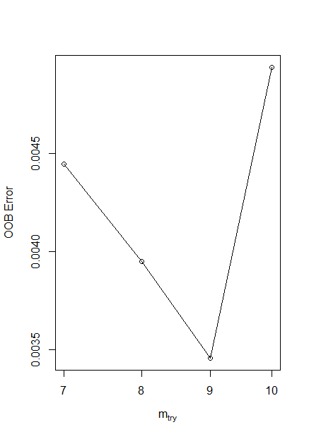
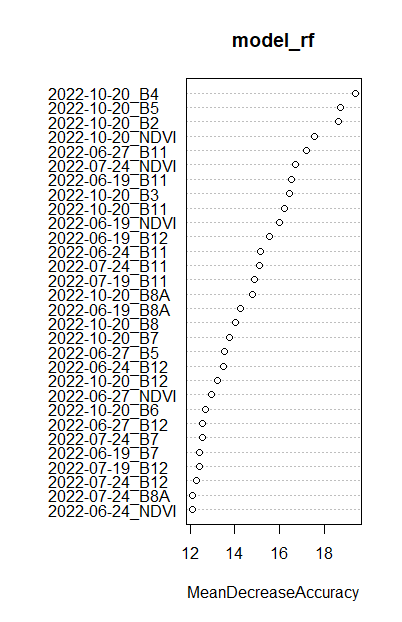
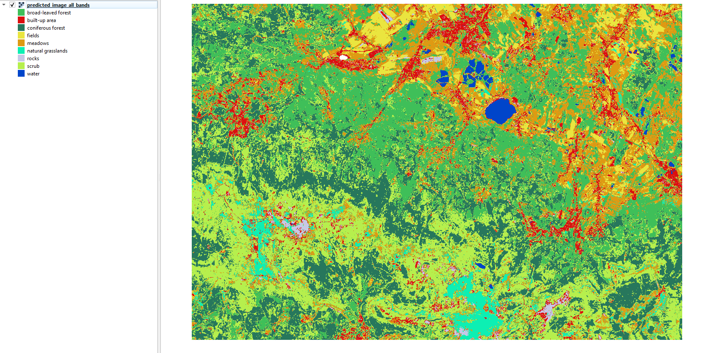

E-TRAINEE Module 2 Theme 4: Multitemporal classification - Exercise
================

# Exercise - Multitemporal classification of land cover in Karkonosze Mountains region

In this exercise you will be able to test the competences acquired in the Theme 4 theoretical part regarding the multitemporal classification. You will use a multitemporal Sentinel-2 dataset to perform Random Forest classification. After completing the necessary steps you will be able to compare the results acquired with different sets of input data and assess accuraccy achieved for different classes.

The main objective of this exercise is to show one of many approaches you can take when performing multitemporal satellite image classification. Based on the processes learned here, you will be able to apply the methods you have learned to different types of input data, algorithms, and accuracy evaluation methods.

## Basic preparation

### Prerequisites

For this exercise you will need the following software, data and tools:

- Software
  - R with RStudio (additional libraries required: `terra`, `dplyr`, `caret`, `randomForest`). You can access environment setup tutorial for the whole Module 2 here: [R environment setup tutorial](../../software/software_r_language.md)
- Data
  - Downloaded data provided in the [folder here](https://drive.google.com/drive/folders/1bQaeyBwvViIyE7MzRDGxSFjx3VLYzsSK).

### Data

#### Imagery data

The imagery provided for this exercise consists of Sentinel-2 satellite imagery. The process of data preparation is described in the [Module 2 Theme 3 exercise Pipeline 1](../03_image_processing/03_image_processing_exercise.md#processing-pipeline-1).

#### Reference data

**UNDER CONSTRUCTION. COMING SOON**

## Environment preparation

To start with, we want to load necessary libraries and data and set up some initial variables, which we will use further down the line.

Firstly, load required libraries into the environment: *terra*, *dplyr*, *caret* and *randomForest*.

``` r
library(terra) # raster and vector I/O and processing
library(dplyr) # tabular data manipulation
library(caret) # training/test layers preparation
library(randomForest) # RF model preparation
```

## Loading data

Now we can load required data into the RStudio environment. We will start with loading image data and vector reference layer.

``` r
reference_data <- vect("theme_4_exercise/data_exercise/T4_reference_data.gpkg") # reference vector data
image_data <- rast("theme_4_exercise/data_exercise/T4_image_data.tif") # multiband raster with all the available bands
```

The bands in the raster bricks are ordered by date: first 11 bands (10 spectral bands + NDVI) are from the first term of acquisition (2022-06-19) and then the other terms follow.

The reference data consist of 450 polygons, 50 per each of 9 classes. You can see the overview of both image and reference data with these commands.

``` r
image_data
reference_data
```

    class       : SpatRaster 
    dimensions  : 1687, 2459, 66  (nrow, ncol, nlyr)
    resolution  : 10, 10  (x, y)
    extent      : 534440, 559030, 5619440, 5636310  (xmin, xmax, ymin, ymax)
    coord. ref. : WGS 84 / UTM zone 33N (EPSG:32633) 
    source      : T4_image_data.tif 
    names       : 2022-~19_B2, 2022-~19_B3, 2022-~19_B4, 2022-~19_B5, 2022-~19_B6, 2022-~19_B7, ...

     class       : SpatVector 
     geometry    : polygons 
     dimensions  : 450, 3  (geometries, attributes)
     extent      : 534690.7, 558829.3, 5619701, 5635629  (xmin, xmax, ymin, ymax)
     source      : T4_reference_data.gpkg
     coord. ref. : WGS 84 / UTM zone 33N (EPSG:32633) 
     names       :    id Code_18             class
     type        : <int>   <chr>             <chr>
     values      :     1     312 coniferous forest
                       2     312 coniferous forest
                       3     312 coniferous forest

## Pixel values extraction

Now that we have the data loaded we want to extract all the image values for each of the reference polygons. Each one of them covers 9 10x10 m pixels. In summary there will be 4050 samples to be used in training and validation data after the extraction.

We will provide 3 arguments to the `terra::extract` function:

- `x` - variable containing image data
- `y` - variable containing vector reference polygons
- `exact` - if `TRUE` additional coverage fraction of each cell is added as column

Extraction results will be assigned to `pixel_reference` variable. This function may take a few minutes to finish.

``` r
pixel_reference <- extract(image_data, reference_data, exact = TRUE) 
```

Inspect the produced extraction results.

``` r
nrow(pixel_reference)
colnames(pixel_reference)
```


    [1] 4066

     [1] "ID"              "2022-06-19_B2"   "2022-06-19_B3"   "2022-06-19_B4"  
     [5] "2022-06-19_B5"   "2022-06-19_B6"   "2022-06-19_B7"   "2022-06-19_B8"  
     [9] "2022-06-19_B8A"  "2022-06-19_B11"  "2022-06-19_B12"  "2022-06-19_NDVI"
    [13] "2022-06-24_B2"   "2022-06-24_B3"   "2022-06-24_B4"   "2022-06-24_B5"  
    [17] "2022-06-24_B6"   "2022-06-24_B7"   "2022-06-24_B8"   "2022-06-24_B8A" 
    [21] "2022-06-24_B11"  "2022-06-24_B12"  "2022-06-24_NDVI" "2022-06-27_B2"  
    [25] "2022-06-27_B3"   "2022-06-27_B4"   "2022-06-27_B5"   "2022-06-27_B6"  
    [29] "2022-06-27_B7"   "2022-06-27_B8"   "2022-06-27_B8A"  "2022-06-27_B11" 
    [33] "2022-06-27_B12"  "2022-06-27_NDVI" "2022-07-19_B2"   "2022-07-19_B3"  
    [37] "2022-07-19_B4"   "2022-07-19_B5"   "2022-07-19_B6"   "2022-07-19_B7"  
    [41] "2022-07-19_B8"   "2022-07-19_B8A"  "2022-07-19_B11"  "2022-07-19_B12" 
    [45] "2022-07-19_NDVI" "2022-07-24_B2"   "2022-07-24_B3"   "2022-07-24_B4"  
    [49] "2022-07-24_B5"   "2022-07-24_B6"   "2022-07-24_B7"   "2022-07-24_B8"  
    [53] "2022-07-24_B8A"  "2022-07-24_B11"  "2022-07-24_B12"  "2022-07-24_NDVI"
    [57] "2022-10-20_B2"   "2022-10-20_B3"   "2022-10-20_B4"   "2022-10-20_B5"  
    [61] "2022-10-20_B6"   "2022-10-20_B7"   "2022-10-20_B8"   "2022-10-20_B8A" 
    [65] "2022-10-20_B11"  "2022-10-20_B12"  "2022-10-20_NDVI" "fraction" 

There should be 4066 rows. We want to filter out those with fraction of \<0.5. Then we can get rid of the column containing fraction information.

``` r
pixel_reference <- filter(pixel_reference, fraction > 0.5) %>%
  select(1:ncol(pixel_reference) - 1)
```

Inspect the filtered result.

``` r
nrow(pixel_reference)
colnames(pixel_reference)
```


    [1] 4050

     [1] "ID"              "2022-06-19_B2"   "2022-06-19_B3"   "2022-06-19_B4"  
     [5] "2022-06-19_B5"   "2022-06-19_B6"   "2022-06-19_B7"   "2022-06-19_B8"  
     [9] "2022-06-19_B8A"  "2022-06-19_B11"  "2022-06-19_B12"  "2022-06-19_NDVI"
    [13] "2022-06-24_B2"   "2022-06-24_B3"   "2022-06-24_B4"   "2022-06-24_B5"  
    [17] "2022-06-24_B6"   "2022-06-24_B7"   "2022-06-24_B8"   "2022-06-24_B8A" 
    [21] "2022-06-24_B11"  "2022-06-24_B12"  "2022-06-24_NDVI" "2022-06-27_B2"  
    [25] "2022-06-27_B3"   "2022-06-27_B4"   "2022-06-27_B5"   "2022-06-27_B6"  
    [29] "2022-06-27_B7"   "2022-06-27_B8"   "2022-06-27_B8A"  "2022-06-27_B11" 
    [33] "2022-06-27_B12"  "2022-06-27_NDVI" "2022-07-19_B2"   "2022-07-19_B3"  
    [37] "2022-07-19_B4"   "2022-07-19_B5"   "2022-07-19_B6"   "2022-07-19_B7"  
    [41] "2022-07-19_B8"   "2022-07-19_B8A"  "2022-07-19_B11"  "2022-07-19_B12" 
    [45] "2022-07-19_NDVI" "2022-07-24_B2"   "2022-07-24_B3"   "2022-07-24_B4"  
    [49] "2022-07-24_B5"   "2022-07-24_B6"   "2022-07-24_B7"   "2022-07-24_B8"  
    [53] "2022-07-24_B8A"  "2022-07-24_B11"  "2022-07-24_B12"  "2022-07-24_NDVI"
    [57] "2022-10-20_B2"   "2022-10-20_B3"   "2022-10-20_B4"   "2022-10-20_B5"  
    [61] "2022-10-20_B6"   "2022-10-20_B7"   "2022-10-20_B8"   "2022-10-20_B8A" 
    [65] "2022-10-20_B11"  "2022-10-20_B12"  "2022-10-20_NDVI" 

One additional step is returning the `class` information from the original reference data to now extracted values. We can merge information two data frames based on identifying values from `ID` and `id` columns. In order to to that we will prepare another data frame based on original `reference_data` containing only `id` and `class` columns.

``` r
reference_class <- as.data.frame(reference_data[1:nrow(reference_data),  c("id", "class")])

pixel_reference <- merge(pixel_reference, reference_class, 
                         by.x = "ID", 
                         by.y = "id", 
                         all = TRUE)
```

Now there should be an additional column added to the data frame. Finally, we want to rearrange the columns so they start from `ID` and `class` followed by names of bands from which the data was extracted.

``` r
pixel_reference <- relocate(pixel_reference, ID, class)
colnames(pixel_reference)
```

    [1] "ID"              "class"           "2022-06-19_B2"   "2022-06-19_B3"   "2022-06-19_B4"   "2022-06-19_B5"   "2022-06-19_B6"   "2022-06-19_B7"   "2022-06-19_B8"  
    [10] "2022-06-19_B8A"  "2022-06-19_B11"  "2022-06-19_B12"  "2022-06-19_NDVI" "2022-06-24_B2"   "2022-06-24_B3"   "2022-06-24_B4"   "2022-06-24_B5"   "2022-06-24_B6"  
    [19] "2022-06-24_B7"   "2022-06-24_B8"   "2022-06-24_B8A"  "2022-06-24_B11"  "2022-06-24_B12"  "2022-06-24_NDVI" "2022-06-27_B2"   "2022-06-27_B3"   "2022-06-27_B4"  
    [28] "2022-06-27_B5"   "2022-06-27_B6"   "2022-06-27_B7"   "2022-06-27_B8"   "2022-06-27_B8A"  "2022-06-27_B11"  "2022-06-27_B12"  "2022-06-27_NDVI" "2022-07-19_B2"  
    [37] "2022-07-19_B3"   "2022-07-19_B4"   "2022-07-19_B5"   "2022-07-19_B6"   "2022-07-19_B7"   "2022-07-19_B8"   "2022-07-19_B8A"  "2022-07-19_B11"  "2022-07-19_B12" 
    [46] "2022-07-19_NDVI" "2022-07-24_B2"   "2022-07-24_B3"   "2022-07-24_B4"   "2022-07-24_B5"   "2022-07-24_B6"   "2022-07-24_B7"   "2022-07-24_B8"   "2022-07-24_B8A" 
    [55] "2022-07-24_B11"  "2022-07-24_B12"  "2022-07-24_NDVI" "2022-10-20_B2"   "2022-10-20_B3"   "2022-10-20_B4"   "2022-10-20_B5"   "2022-10-20_B6"   "2022-10-20_B7"  
    [64] "2022-10-20_B8"   "2022-10-20_B8A"  "2022-10-20_B11"  "2022-10-20_B12"  "2022-10-20_NDVI"

Save the extracted data frame to the external file in case you need to reload it, so you don’t have to wait for the extraction process to complete.

``` r
saveRDS(pixel_reference, file = "theme_4_exercise/data_exercise/pixel_reference.RDS")

# in case you need to load it use the command below
# pixel_reference <- readRDS("theme_4_exercise/data_exercise/pixel_reference.RDS")
```

## Classification scenario 1: the whole dataset

### Training/validation data preparation

Now that we have the reference dataset ready we can begin the classification scenario. First of all we want to divide the whole dataset into training and validation dataset. By running the commands below we can check how many samples of each class we have and how many reference polygons there are for each class.

``` r
table(pixel_reference$class)
table(reference_data$class)
```

    > table(pixel_reference$class)

    broad-leaved forest       built-up area   coniferous forest              fields             meadows  natural grasslands               rocks 
                    450                 450                 450                 450                 450                 450                 450 
                  scrub               water 
                    450                 450 


    > table(reference_data$class)

    broad-leaved forest       built-up area   coniferous forest              fields             meadows  natural grasslands               rocks 
                     50                  50                  50                  50                  50                  50                  50 
                  scrub               water 
                     50                  50 
    > 

To ensure reproducibility of partitioning we will set seed.

``` r
set.seed(14)
```

The partitioning will consist of two steps. First of all we will randomly choose 50% of polygons from each class and save their position number to `trainIndex` variable. Then this variable will be used to extract corresponding values by `poly_ind` column from `pixel_reference` table.

``` r
trainIndex <- createDataPartition(reference_data$class, p = 0.5, list = FALSE)

trainData <- pixel_reference[ pixel_reference$poly_ind %in% trainIndex, ]
valData <- pixel_reference[ !(pixel_reference$poly_ind %in% trainIndex), ]
```

Now we should have two sets of equal number of reference values for each class.

``` r
table(trainData$class)
table(valData$class)
```

    > table(trainData$class)

    broad-leaved forest       built-up area   coniferous forest              fields             meadows  natural grasslands               rocks 
                    225                 225                 225                 225                 225                 225                 225 
                  scrub               water 
                    225                 225 
                    
    > table(valData$class)

    broad-leaved forest       built-up area   coniferous forest              fields             meadows  natural grasslands               rocks 
                    225                 225                 225                 225                 225                 225                 225 
                  scrub               water 
                    225                 225 

### Parameters tuning

In order to achieve a satisfying result we want to tune the model parameters. One of the Random Forest algorithm parameter is ***mtry***, which is the number of random variables used in each tree. To find the number, which should yield the highest accuracy numbers we will use `tuneRF` function from the `randomForest` package.

The function takes several arguments:

- `x` (first argument) - matrix or data frame of predictor variables;
- `y` (second argument) - response vector (factor for classification);
- `ntreeTry` - number of trees used at the tuning step;
- `improve` - the (relative) improvement in OOB error must be by this much for the search to continue;
- `stepFactor` - at each iteration, mtry is inflated (or deflated) by this value.

We will again set seed and save the results of the fucntion to `tune` variable.

``` r
set.seed(14)

tune <- tuneRF(trainData[, 3:length(trainData)], 
               as.factor(trainData$class),
               ntreeTry = 500,
               improve = 0.001,
               stepFactor = 1.2)

tune
```

    > tune
           mtry    OOBError
    7.OOB     7 0.004444444
    8.OOB     8 0.003950617
    9.OOB     9 0.003456790
    10.OOB   10 0.004938272

<center>



<i>mtry parameter tuning.</i>
</center>

The lowest OOBError values were achieved `mtry` value of 9. In theory the higher the value the stronger the model, although high `mtry` values can also increase the correlation among the variables chosen for the split. In this case we will not test different values and set `mtry` parameter in the model as 9 given it’s lowest error.

### Model

The next step after tuning the parameters is a classification model development. There is a `randomForest` function inside the package of the same name, which is the implementation of the original RF algorithm. These are the arguments, which the function accepts used in the following code snippet:

- `x` (first argument) - a data frame or a matrix of predictors (from `trainData` variable);
- `y` (second argument) - response vector (factor for classification);
- `ntree` - number of trees used to produce the final model; 500 is empirically tested to usually yield satisfactory results;
- `mtry` - number of variables randomly sampled as candidates at each split (tuned in the previous step);
- `importance` - boolean, whether the model should store variable importance (needed to produce the plots);
- `do.trace` - helps to keep track of the modelling progress.

``` r
model_rf <- randomForest(trainData[ , 3:length(trainData)], as.factor(trainData$class), 
                         ntree = 500,
                         mtry = 9, 
                         importance = TRUE,
                         do.trace = 50)
```

To be able to access the model later it is recommended to save it locally.

    save(model_rf, file = "theme_4_exercise/results/model_rf")

### Accuracy assessment

If we access the variable `model_rf` we will see the basic model information and confusion matrix calculated for the training data.

    > model_rf

    Call:
     randomForest(x = trainData[, 3:length(trainData)], y = as.factor(trainData$class),      ntree = 500, mtry = 9, importance = TRUE, do.trace = 50) 
                   Type of random forest: classification
                         Number of trees: 500
    No. of variables tried at each split: 9

            OOB estimate of  error rate: 0.4%
    Confusion matrix:
                        broad-leaved forest built-up area
    broad-leaved forest                 225             0
    built-up area                         0           224
    coniferous forest                     0             0
    fields                                0             0
    meadows                               0             0
    natural grasslands                    0             0
    rocks                                 0             4
    scrub                                 0             0
    water                                 0             0
                        coniferous forest fields meadows
    broad-leaved forest                 0      0       0
    built-up area                       0      0       0
    coniferous forest                 224      0       0
    fields                              0    224       1
    meadows                             0      0     225
    natural grasslands                  0      0       0
    rocks                               0      1       0
    scrub                               0      0       0
    water                               0      0       0
                        natural grasslands rocks scrub
    broad-leaved forest                  0     0     0
    built-up area                        0     1     0
    coniferous forest                    0     0     1
    fields                               0     0     0
    meadows                              0     0     0
    natural grasslands                 225     0     0
    rocks                                0   220     0
    scrub                                0     0   225
    water                                0     0     0
                        water class.error
    broad-leaved forest     0 0.000000000
    built-up area           0 0.004444444
    coniferous forest       0 0.004444444
    fields                  0 0.004444444
    meadows                 0 0.000000000
    natural grasslands      0 0.000000000
    rocks                   0 0.022222222
    scrub                   0 0.000000000
    water                 225 0.000000000

The confusion matrix What we really want to do is to measure the model performance against the data it hasn’t been trained on. To do that we will use `valData` prepared earlier. We will then compare the predicted classes with actual one in the test layer.

``` r
predicted_rf <- predict(model_rf, valData[ , 3:length(valData)])


confusion_matrix_predicted_rf <- confusionMatrix(predicted_rf, as.factor(valData$class), mode = "everything")

confusion_matrix_predicted_rf
```

    Confusion Matrix and Statistics

                         Reference
    Prediction            broad-leaved forest built-up area
      broad-leaved forest                 217             0
      built-up area                         0           200
      coniferous forest                     3             0
      fields                                0             6
      meadows                               0             2
      natural grasslands                    0             0
      rocks                                 0            11
      scrub                                 5             0
      water                                 0             6
                         Reference
    Prediction            coniferous forest fields meadows
      broad-leaved forest                 9      0       0
      built-up area                       0      0       0
      coniferous forest                 208      0       0
      fields                              0    194      51
      meadows                             0     31     165
      natural grasslands                  0      0       9
      rocks                               0      0       0
      scrub                               8      0       0
      water                               0      0       0
                         Reference
    Prediction            natural grasslands rocks scrub
      broad-leaved forest                  0     0     0
      built-up area                        0    25     4
      coniferous forest                    0     0     9
      fields                               0     0     0
      meadows                             20     0     2
      natural grasslands                 205     0     0
      rocks                                0   200     5
      scrub                                0     0   205
      water                                0     0     0
                         Reference
    Prediction            water
      broad-leaved forest     0
      built-up area           0
      coniferous forest       0
      fields                  0
      meadows                 0
      natural grasslands      0
      rocks                   0
      scrub                   0
      water                 225

    Overall Statistics
                                              
                   Accuracy : 0.8983          
                     95% CI : (0.8843, 0.9111)
        No Information Rate : 0.1111          
        P-Value [Acc > NIR] : < 2.2e-16       
                                              
                      Kappa : 0.8856          
                                              
     Mcnemar's Test P-Value : NA              

    Statistics by Class:

                         Class: broad-leaved forest
    Sensitivity                              0.9644
    Specificity                              0.9950
    Pos Pred Value                           0.9602
    Neg Pred Value                           0.9956
    Precision                                0.9602
    Recall                                   0.9644
    F1                                       0.9623
    Prevalence                               0.1111
    Detection Rate                           0.1072
    Detection Prevalence                     0.1116
    Balanced Accuracy                        0.9797
                         Class: built-up area
    Sensitivity                       0.88889
    Specificity                       0.98389
    Pos Pred Value                    0.87336
    Neg Pred Value                    0.98608
    Precision                         0.87336
    Recall                            0.88889
    F1                                0.88106
    Prevalence                        0.11111
    Detection Rate                    0.09877
    Detection Prevalence              0.11309
    Balanced Accuracy                 0.93639
                         Class: coniferous forest
    Sensitivity                            0.9244
    Specificity                            0.9933
    Pos Pred Value                         0.9455
    Neg Pred Value                         0.9906
    Precision                              0.9455
    Recall                                 0.9244
    F1                                     0.9348
    Prevalence                             0.1111
    Detection Rate                         0.1027
    Detection Prevalence                   0.1086
    Balanced Accuracy                      0.9589
                         Class: fields Class: meadows
    Sensitivity                 0.8622        0.73333
    Specificity                 0.9683        0.96944
    Pos Pred Value              0.7729        0.75000
    Neg Pred Value              0.9825        0.96676
    Precision                   0.7729        0.75000
    Recall                      0.8622        0.73333
    F1                          0.8151        0.74157
    Prevalence                  0.1111        0.11111
    Detection Rate              0.0958        0.08148
    Detection Prevalence        0.1240        0.10864
    Balanced Accuracy           0.9153        0.85139
                         Class: natural grasslands
    Sensitivity                             0.9111
    Specificity                             0.9950
    Pos Pred Value                          0.9579
    Neg Pred Value                          0.9890
    Precision                               0.9579
    Recall                                  0.9111
    F1                                      0.9339
    Prevalence                              0.1111
    Detection Rate                          0.1012
    Detection Prevalence                    0.1057
    Balanced Accuracy                       0.9531
                         Class: rocks Class: scrub
    Sensitivity               0.88889       0.9111
    Specificity               0.99111       0.9928
    Pos Pred Value            0.92593       0.9404
    Neg Pred Value            0.98618       0.9889
    Precision                 0.92593       0.9404
    Recall                    0.88889       0.9111
    F1                        0.90703       0.9255
    Prevalence                0.11111       0.1111
    Detection Rate            0.09877       0.1012
    Detection Prevalence      0.10667       0.1077
    Balanced Accuracy         0.94000       0.9519
                         Class: water
    Sensitivity                1.0000
    Specificity                0.9967
    Pos Pred Value             0.9740
    Neg Pred Value             1.0000
    Precision                  0.9740
    Recall                     1.0000
    F1                         0.9868
    Prevalence                 0.1111
    Detection Rate             0.1111
    Detection Prevalence       0.1141
    Balanced Accuracy          0.9983

<b><u>TASK</u></b>

Identify classes with highest and lowest accuracy metrics.

### Variable importance

Based on the model we can also identify best performing predictors (bands). We saved the `importance` values inside the model stored in `model_rf` variable. To display them as plot we can use `varImpPlot` function from `randomForest` package.

``` r
varImpPlot(model_rf, type = 1)
```

<center>



<i>Variable importance plot.</i>
</center>

<b><u>TASK</u></b>

Identify bands with the most significant impact on the classification.

### Image prediction

Finally, we can apply the acquired model to the image data we have to produce classification image. We wil provide the following arguments to `predict` function from the `terra` package:

- `object` - image data
- `model` - fitted statistical model
- `datatype` - for the classification result `INT1U` (0-255) will suffice
- `na.rm` - ignore cells with na values
- `overwrite` - save over existing file of the same name

``` r
terra::predict(image_data, model_rf, 
               filename = "theme_4_exercise/results/predicted_image_all_bands.tif", 
               datatype = "INT1U", 
               na.rm = TRUE, 
               overwrite = TRUE)
```

<b><u>TASK</u></b>

Display the resulting image in QGIS using the attached **symbology.clr** file to apply class names and colors.

<center>



<i>Predicted image (all variables).</i>
</center>

## Classification scenario 2 (only spectral bands) and scenario 3 (only NDVI bands)

The goal of the first scenario was to guide you through the simple classification process from start to finish. Now that you acknowledged yourself with the method you will go through scenarios 2 and 3 by your own.

The workflow stays the same, although you need to truncate the reference data to include only values from specific bands.

<details>
<summary>
Reference for classification scenario 2
</summary>

``` r
reference_scenario2 <- pixel_reference[, c(1:2, 3:12, 14:23, 25:34, 36:45, 47:56, 58:67)]
```

</details>
<details>
<summary>
Reference for classification scenario 3
</summary>

``` r
reference_scenario3 <- pixel_reference[, c(1:2, 13, 24, 35, 46, 57, 68)]
```

</details>

<b><u>TASK</u></b>

- Divide reference datasets into training and validation.
- Tune `mtry` parameter.
- Create and save Random Forest classification model.
- Apply the model to test data and image.
- Compare the accuracy results and visual images.

## Results comparison & discussion

Points to test by the students: extract single term and perform classification, extract only best performing bands based on variable importance and repeat classification, test different mtry values etc.
