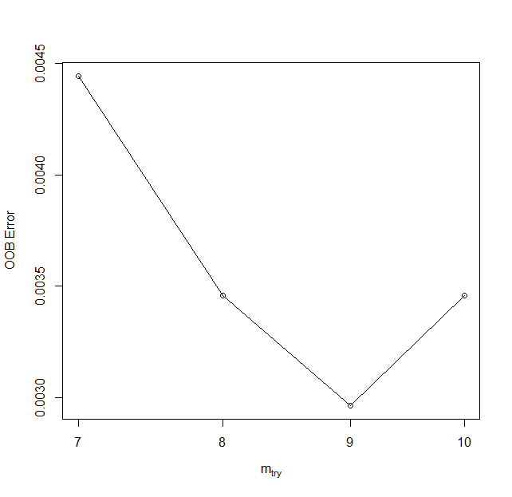

Multitemporal classification - Exercise
================

## Exercise - Multitemporal classification of land cover in Karkonosze Mountains region

In this exercise, you will gain practical experience with the topic of **multitemporal classification**, which is presented in *[Theme 4 theoretical part](04_multitemporal_classification.md)*. You will employ a multitemporal Sentinel-2 dataset to carry out a Random Forest classification. Upon completing the necessary steps, you’ll have the ability to compare results obtained from different sets of input data, as well as evaluate the accuracy attained for various classes.

The primary aim of this exercise is to demonstrate one of the many approaches you can employ in performing multitemporal satellite image classification. Based on the techniques learned here, you’ll be equipped to apply these methods to a range of input data types, algorithms, and accuracy assessment procedures.

## Basic preparation

### Prerequisites

For this exercise you will need the following software, data and tools:

- **Software** - R and RStudio. You can access environment setup tutorial for the whole Module 2 here: [R environment setup tutorial](../../software/software_r_language.md). After following the setup guide you should have all the necessary packages installed.
- **Data** - downloaded data provided through [Zenodo](https://zenodo.org/records/10003575). If you went through **[Module 2 Theme 3 exercise Pipeline 1](../03_image_processing/03_image_processing_exercise.md#processing-pipeline-1)** you can download image the data from your Google Drive.

Follow the suggested working environment setup in order for the provided relative paths to work properly.

### Data

#### Imagery data

The imagery provided for this exercise consists of Sentinel-2 satellite imagery. The process of data preparation is described in the **[Module 2 Theme 3 exercise Pipeline 1](../03_image_processing/03_image_processing_exercise.md#processing-pipeline-1)**.

#### Reference data

The process of reference data preparation is describe in this document. Click here to open in in a new tab.

<a href="media_exercise/T4_Reference_data_preparation.pdf" target="_blank"><b>Reference data preparation tutorial</b></a>

### Loading libraries and reading data

Initiate a new R script in RStudio within your working directory (new file icon is in top left corner) and name it, for instance, `theme_4_exercise_script.R`.

In this newly created script, we aim to load the necessary libraries and data, as well as set up some initial variables, which we will utilize later.

Begin by loading libraries that contain the functions essential for completing this exercise (`terra`, `dplyr`, `caret`, and `randomForest`) into your environment.

``` r
# raster and vector I/O and processing
library(terra)

# tabular data manipulation
library(dplyr) 

# training/test layers preparation
library(caret) 

# RF model preparation
library(randomForest) 
```

At this point, we can import the necessary data into the RStudio environment. We require a reference vector layer and multiband image data. These can be found in the dedicated folder for Theme 4.

``` r
# object representing reference vector data
reference_data <- vect("theme_4_exercise/data_exercise/T4_reference_data.shp")

# object representing multiband raster with all the available bands
image_data <- rast("theme_4_exercise/data_exercise/T4_image_data.tif")
```

The bands in the multiband raster are arranged by date: the first 11 bands (10 spectral bands + NDVI) correspond to the first acquisition period (2022-06-19), with subsequent periods following in order.

The reference data comprises 450 polygons, with 50 each for nine classes. You can get an overview of both the image and reference data by executing the following commands in the R console.

``` r
image_data
reference_data
```

    class       : SpatRaster 
    dimensions  : 1687, 2459, 66  (nrow, ncol, nlyr)
    resolution  : 10, 10  (x, y)
    extent      : 534440, 559030, 5619440, 5636310  (xmin, xmax, ymin, ymax)
    coord. ref. : WGS 84 / UTM zone 33N (EPSG:32633) 
    source      : T4_image_data.tif 
    names       : 2022-~19_B2, 2022-~19_B3, 2022-~19_B4, 2022-~19_B5, 2022-~19_B6, ...

    class       : SpatVector 
    geometry    : polygons 
    dimensions  : 450, 2  (geometries, attributes)
    extent      : 534690.7, 558829.3, 5619701, 5635629  (xmin, xmax, ymin, ymax)
    source      : T4_reference_data.shp
    coord. ref. : WGS 84 / UTM zone 33N (EPSG:32633) 
    names       :   ID             class
    type        : <int>             <chr>
    values      :   1         coniferous forest
                    2         coniferous forest
                    3         coniferous forest

## Pixel values extraction

With the data now loaded, our next step is to extract all the image values corresponding to each of the reference polygons. Each reference polygon encompasses nine 10x10 m pixels. Consequently, after extraction, we’ll have a total of 4050 samples (450 x 9) to utilize in our training and validation data.

The extract function from the `terra` package, also denoted as `terra::extract`, is employed to read pixel values based on the vector layer’s location. This vector layer could either be a point layer (yielding one pixel value) or a polygon layer (yielding multiple pixel values).

We’ll feed three arguments into the `terra::extract` function:

- `x` - a variable containing the image data
- `y` - a variable containing the vector reference polygons
- `exact` - if set to `TRUE`, an additional coverage fraction for each cell is added as a column

The extraction results will be stored in the `pixel_reference` variable as a *data frame*. This function may take a few minutes to execute.

``` r
pixel_reference <- extract(image_data, reference_data, exact = TRUE) 
```

Inspect the produced extraction results.

``` r
nrow(pixel_reference)
colnames(pixel_reference)
```


    [1] 4066

     [1] "ID"              "2022-06-19_B2"   "2022-06-19_B3"   "2022-06-19_B4"  
     [5] "2022-06-19_B5"   "2022-06-19_B6"   "2022-06-19_B7"   "2022-06-19_B8"  
     [9] "2022-06-19_B8A"  "2022-06-19_B11"  "2022-06-19_B12"  "2022-06-19_NDVI"
    [13] "2022-06-24_B2"   "2022-06-24_B3"   "2022-06-24_B4"   "2022-06-24_B5"  
    [17] "2022-06-24_B6"   "2022-06-24_B7"   "2022-06-24_B8"   "2022-06-24_B8A" 
    [21] "2022-06-24_B11"  "2022-06-24_B12"  "2022-06-24_NDVI" "2022-06-27_B2"  
    [25] "2022-06-27_B3"   "2022-06-27_B4"   "2022-06-27_B5"   "2022-06-27_B6"  
    [29] "2022-06-27_B7"   "2022-06-27_B8"   "2022-06-27_B8A"  "2022-06-27_B11" 
    [33] "2022-06-27_B12"  "2022-06-27_NDVI" "2022-07-19_B2"   "2022-07-19_B3"  
    [37] "2022-07-19_B4"   "2022-07-19_B5"   "2022-07-19_B6"   "2022-07-19_B7"  
    [41] "2022-07-19_B8"   "2022-07-19_B8A"  "2022-07-19_B11"  "2022-07-19_B12" 
    [45] "2022-07-19_NDVI" "2022-07-24_B2"   "2022-07-24_B3"   "2022-07-24_B4"  
    [49] "2022-07-24_B5"   "2022-07-24_B6"   "2022-07-24_B7"   "2022-07-24_B8"  
    [53] "2022-07-24_B8A"  "2022-07-24_B11"  "2022-07-24_B12"  "2022-07-24_NDVI"
    [57] "2022-10-20_B2"   "2022-10-20_B3"   "2022-10-20_B4"   "2022-10-20_B5"  
    [61] "2022-10-20_B6"   "2022-10-20_B7"   "2022-10-20_B8"   "2022-10-20_B8A" 
    [65] "2022-10-20_B11"  "2022-10-20_B12"  "2022-10-20_NDVI" "fraction" 

------------------------------------------------------------------------

*Note: The ID column is not drawn from the original data source but is generated by the `extract` function as the index of the record from which values are extracted. In the case of the data prepared for this exercise, the ID column of the reference data matches the ID in the data frame with extracted values. If you wish to replicate this part of the exercise with your own input reference data, we suggest adding a column/attribute with row index numbers. For example:*

    ref <- vect("source.shp")
    ref_df <- as.data.frame(ref)
    ref_id <- cbind(ref_df, ID = seq(1, nrow(ref_df)))

------------------------------------------------------------------------

If everything proceeded as expected, there should be 4066 rows in the resulting data frame. Earlier, we noted that, given each reference polygon is 30x30 meters in size, we would anticipate a total of 4050 pixel values. A higher number suggests some polygons are misaligned, intersecting parts of additional polygons. To rectify this, we aim to filter out those pixels with minimal coverage by applying a data frame filter to rows with a coverage fraction of less than 0.5.

<center>


<i>Polygon id == 2 visible misalignment in relation to image pixel mesh.</i>
</center>

``` r
pixel_reference <- filter(pixel_reference, fraction > 0.5)
```

Inspect the filtered result.

``` r
nrow(pixel_reference)
colnames(pixel_reference)
```


    [1] 4050

     [1] "ID"              "2022-06-19_B2"   "2022-06-19_B3"   "2022-06-19_B4"  
     [5] "2022-06-19_B5"   "2022-06-19_B6"   "2022-06-19_B7"   "2022-06-19_B8"  
     [9] "2022-06-19_B8A"  "2022-06-19_B11"  "2022-06-19_B12"  "2022-06-19_NDVI"
    [13] "2022-06-24_B2"   "2022-06-24_B3"   "2022-06-24_B4"   "2022-06-24_B5"  
    [17] "2022-06-24_B6"   "2022-06-24_B7"   "2022-06-24_B8"   "2022-06-24_B8A" 
    [21] "2022-06-24_B11"  "2022-06-24_B12"  "2022-06-24_NDVI" "2022-06-27_B2"  
    [25] "2022-06-27_B3"   "2022-06-27_B4"   "2022-06-27_B5"   "2022-06-27_B6"  
    [29] "2022-06-27_B7"   "2022-06-27_B8"   "2022-06-27_B8A"  "2022-06-27_B11" 
    [33] "2022-06-27_B12"  "2022-06-27_NDVI" "2022-07-19_B2"   "2022-07-19_B3"  
    [37] "2022-07-19_B4"   "2022-07-19_B5"   "2022-07-19_B6"   "2022-07-19_B7"  
    [41] "2022-07-19_B8"   "2022-07-19_B8A"  "2022-07-19_B11"  "2022-07-19_B12" 
    [45] "2022-07-19_NDVI" "2022-07-24_B2"   "2022-07-24_B3"   "2022-07-24_B4"  
    [49] "2022-07-24_B5"   "2022-07-24_B6"   "2022-07-24_B7"   "2022-07-24_B8"  
    [53] "2022-07-24_B8A"  "2022-07-24_B11"  "2022-07-24_B12"  "2022-07-24_NDVI"
    [57] "2022-10-20_B2"   "2022-10-20_B3"   "2022-10-20_B4"   "2022-10-20_B5"  
    [61] "2022-10-20_B6"   "2022-10-20_B7"   "2022-10-20_B8"   "2022-10-20_B8A" 
    [65] "2022-10-20_B11"  "2022-10-20_B12"  "2022-10-20_NDVI" 

An additional step is to reintegrate the `class` information from the original `reference_data` into the extracted values. To accomplish this, we’ll create another data frame based on the original attributes of the `reference_data` vector file. We can then merge information from the two data frames using the identifying values from the `ID` columns.

``` r
reference_class <- as.data.frame(reference_data)

pixel_reference <- merge(pixel_reference, reference_class, 
                         by = "ID", 
                         all = TRUE)
```

After this step, there should be an additional column in the data frame. Lastly, we aim to rearrange the columns so that they start with `ID` and `class`, followed by the names of the bands from which data was extracted. Since we’ve already filtered the data, we can discard the `fraction` column. To achieve this, we’ll use `dplyr` functions `select` and `relocate`: `select` to remove the `fraction` column and `relocate` to move the `ID` and `class` columns to the beginning of the data frame. The `%>%` operator, also known as a pipe-line operator from the `magrittr` package, is used to *send* the value from the previous function to the next.

``` r
pixel_reference <- select(pixel_reference, -fraction) %>%
  relocate(ID, class)

colnames(pixel_reference)
```

     [1] "ID"              "class"           "2022-06-19_B2"   "2022-06-19_B3"  
     [5] "2022-06-19_B4"   "2022-06-19_B5"   "2022-06-19_B6"   "2022-06-19_B7"  
     [9] "2022-06-19_B8"   "2022-06-19_B8A"  "2022-06-19_B11"  "2022-06-19_B12" 
    [13] "2022-06-19_NDVI" "2022-06-24_B2"   "2022-06-24_B3"   "2022-06-24_B4"  
    [17] "2022-06-24_B5"   "2022-06-24_B6"   "2022-06-24_B7"   "2022-06-24_B8"  
    [21] "2022-06-24_B8A"  "2022-06-24_B11"  "2022-06-24_B12"  "2022-06-24_NDVI"
    [25] "2022-06-27_B2"   "2022-06-27_B3"   "2022-06-27_B4"   "2022-06-27_B5"  
    [29] "2022-06-27_B6"   "2022-06-27_B7"   "2022-06-27_B8"   "2022-06-27_B8A" 
    [33] "2022-06-27_B11"  "2022-06-27_B12"  "2022-06-27_NDVI" "2022-07-19_B2"  
    [37] "2022-07-19_B3"   "2022-07-19_B4"   "2022-07-19_B5"   "2022-07-19_B6"  
    [41] "2022-07-19_B7"   "2022-07-19_B8"   "2022-07-19_B8A"  "2022-07-19_B11" 
    [45] "2022-07-19_B12"  "2022-07-19_NDVI" "2022-07-24_B2"   "2022-07-24_B3"  
    [49] "2022-07-24_B4"   "2022-07-24_B5"   "2022-07-24_B6"   "2022-07-24_B7"  
    [53] "2022-07-24_B8"   "2022-07-24_B8A"  "2022-07-24_B11"  "2022-07-24_B12" 
    [57] "2022-07-24_NDVI" "2022-10-20_B2"   "2022-10-20_B3"   "2022-10-20_B4"  
    [61] "2022-10-20_B5"   "2022-10-20_B6"   "2022-10-20_B7"   "2022-10-20_B8"  
    [65] "2022-10-20_B8A"  "2022-10-20_B11"  "2022-10-20_B12"  "2022-10-20_NDVI"

Save the extracted data frame to the external file in case you need to reload it, so you don’t have to wait for the extraction process to complete. By saving to `.RDS` file you can then read that file into custom variable name.

``` r
saveRDS(pixel_reference, 
        file = "theme_4_exercise/data_exercise/pixel_reference.RDS")

# in case you need to load it use the command below
# pixel_reference <- readRDS("theme_4_exercise/data_exercise/pixel_reference.RDS")
```

## Classification scenario 1: the entire dataset

### Training/validation data preparation

Now that we have the reference dataset prepared, we can commence the classification scenario. Initially, we’ll divide the complete dataset into a training set and a validation set. By executing the commands below, we can check the number of samples for each class we have, as well as the number of reference polygons per class.

``` r
table(pixel_reference$class)
table(reference_data$class)
```

    > table(pixel_reference$class)

    broad-leaved forest       built-up area   coniferous forest 
                    450                 450                 450 
                 fields             meadows  natural grasslands 
                    450                 450                 450 
                  rocks               scrub               water 
                    450                 450                 450 


    > table(reference_data$class)

    broad-leaved forest       built-up area   coniferous forest 
                     50                  50                  50 
                 fields             meadows  natural grasslands 
                     50                  50                  50 
                  rocks               scrub               water 
                     50                  50                  50 

To ensure reproducibility of partitioning we will set seed.

``` r
set.seed(14)
```

The partitioning process consists of two steps. The first step involves randomly selecting 50% of polygons from each class and storing their position number in the `train_index` variable. This approach ensures that pixels from a single polygon are used exclusively in either the training or validation set, preventing overlap. Given that each polygon contains the same number of pixels, we will have an equal number of training and validation samples. This balanced division of the reference dataset into training and validation sets aims to enhance model performance and reduce any bias towards specific classes.

In the second step, we’ll filter the entire `pixel_reference` set into `train_data` and `val_data`. This is done using the `train_index` variable to extract corresponding values by the `ID` column from the `pixel_reference` table.

``` r
train_index <- createDataPartition(reference_data$class, p = 0.5, list = FALSE)

train_data <- pixel_reference[ pixel_reference$ID %in% train_index, ]
val_data <- pixel_reference[ !(pixel_reference$ID %in% train_index), ]
```

Now we should have two sets of equal number of reference pixels for each class.

``` r
table(train_data$class)
table(val_data$class)
```

    > table(train_data$class)

    broad-leaved forest       built-up area   coniferous forest 
                    225                 225                 225 
                 fields             meadows  natural grasslands 
                    225                 225                 225 
                  rocks               scrub               water 
                    225                 225                 225 
    > table(val_data$class)

    broad-leaved forest       built-up area   coniferous forest 
                    225                 225                 225 
                 fields             meadows  natural grasslands 
                    225                 225                 225 
                  rocks               scrub               water 
                    225                 225                 225 

### Parameters tuning

In order to achieve a satisfying result we want to tune the model parameters. One of the Random Forest algorithm parameter is ***mtry***, which is the number of random variables used in each tree. To find the value, which should yield the highest accuracy numbers we will use `tuneRF` function from the `randomForest` package.

The function takes several arguments:

- `x` (first argument) - matrix or data frame of predictor variables;
- `y` (second argument) - response vector (factor for classification);
- `ntreeTry` - number of trees used during the tuning step;
- `improve` - the (relative) improvement in out-of-bag (OOB) error must be at least this much for the search to continue;
- `stepFactor` - at each iteration, `mtry` value is inflated (or deflated) by this value.

We will again set seed and assign the function’s results to `tune` variable.

``` r
set.seed(141)

tune <- tuneRF(train_data[, 3:length(train_data)], 
               as.factor(train_data$class),
               ntreeTry = 500,
               improve = 0.001,
               stepFactor = 1.2)

tune
```

    > tune
           mtry    OOBError
    7.OOB     7 0.004444444
    8.OOB     8 0.003456790
    9.OOB     9 0.002962963
    10.OOB   10 0.003456790

<center>



<i>mtry parameter tuning.</i>
</center>

The lowest Out-Of-Bag (OOB) error values were achieved with an `mtry` value of 9. Theoretically, a higher `mtry` value results in a more robust model, but it can also increase the correlation among the variables chosen for the split. In this case, we will not test different values and will set the `mtry` parameter in the model to 9 due to its lowest error.

### Model

The next step after tuning the parameters is training the classification model. The `randomForest` function from the package of the same name is an implementation of the original Random Forest algorithm. The following code snippet uses this function with the following arguments:

- `x` (first argument) - a data frame or a matrix of predictors (from `train_data` variable);
- `y` (second argument) - a response vector (a factor for classification);
- `ntree` - the number of trees used to produce the final model; 500 is a number that has been empirically tested to usually yield satisfactory results;
- `mtry` - number of variables randomly sampled as candidates at each split (tuned in the previous step);
- `importance` - a boolean (TRUE/FALSE) indicating whether the model should store variable importance (required for producing the plots);
- `do.trace` - useful for keeping track of the modelling progress.

``` r
model_rf <- randomForest(train_data[ , 3:length(train_data)],
                         as.factor(train_data$class), 
                         ntree = 500,
                         mtry = 9, 
                         importance = TRUE,
                         do.trace = 50)
```

To be able to access the model later it is recommended to save it locally. Create new `results` folder to store files produced in this script.

    saveRDS(model_rf, file = "theme_4_exercise/results/model_rf.RDS")

### Accuracy assessment

If we access the variable `model_rf` (by running this variable in console) we will see the basic model information and confusion matrix calculated for the training data.

    > model_rf

    Call:
     randomForest(x = train_data[, 3:length(train_data)], 
     y = as.factor(train_data$class), 
     ntree = 500, 
     mtry = 9, 
     importance = TRUE, 
     do.trace = 50) 
     
     
                   Type of random forest: classification
                   Number of trees: 500
                   No. of variables tried at each split: 9

            OOB estimate of  error rate: 0.4%
            

Confusion matrix

    Confusion matrix:
                        broad-leaved forest built-up area coniferous forest
    broad-leaved forest                 225             0                 0
    built-up area                         0           223                 0
    coniferous forest                     0             0               225
    fields                                0             0                 0
    meadows                               0             0                 0
    natural grasslands                    0             0                 0
    rocks                                 0             5                 0
    scrub                                 0             0                 0
    water                                 0             0                 0

                        fields meadows natural grasslands rocks scrub water
    broad-leaved forest      0       0                  0     0     0     0
    built-up area            0       0                  0     2     0     0
    coniferous forest        0       0                  0     0     0     0
    fields                 224       1                  0     0     0     0
    meadows                  0     225                  0     0     0     0
    natural grasslands       0       0                225     0     0     0
    rocks                    0       0                  0   220     0     0
    scrub                    0       0                  0     0   225     0
    water                    0       0                  0     0     0   225

                        class.error
    broad-leaved forest 0.000000000
    built-up area       0.008888889
    coniferous forest   0.000000000
    fields              0.004444444
    meadows             0.000000000
    natural grasslands  0.000000000
    rocks               0.022222222
    scrub               0.000000000
    water               0.000000000

Our primary objective is to evaluate the performance of the model using the reference data. To obtain an accurate measure of the model’s effectiveness, it’s crucial to test it against data it hasn’t seen during the training process. This subset of the data is known as the validation set. To achieve this, we’ll make use of the `val_data` we prepared earlier. After prediction, we’ll contrast the model’s predicted classes against the true classes in the validation dataset.

``` r
predicted_rf <- predict(model_rf, val_data[ , 3:length(val_data)])

confusion_matrix_predicted_rf <- confusionMatrix(predicted_rf, 
                                                 as.factor(val_data$class), 
                                                 mode = "everything")
confusion_matrix_predicted_rf
```

    Confusion Matrix and Statistics

                         Reference
    Prediction            broad-leaved forest built-up area coniferous forest
      broad-leaved forest                 217             0                 9
      built-up area                         0           200                 0
      coniferous forest                     3             0               209
      fields                                0             5                 0
      meadows                               0             3                 0
      natural grasslands                    0             0                 0
      rocks                                 0            10                 0
      scrub                                 5             1                 7
      water                                 0             6                 0
      
                         Reference
    Prediction            fields meadows natural grasslands rocks scrub water
      broad-leaved forest      0       0                  0     0     0     0
      built-up area            2       0                  0    25     4     0
      coniferous forest        0       0                  0     0     9     0
      fields                 194      50                  0     0     0     0
      meadows                 29     166                 19     0     2     0
      natural grasslands       0       9                206     0     0     0
      rocks                    0       0                  0   200     5     0
      scrub                    0       0                  0     0   205     0
      water                    0       0                  0     0     0   225

    Overall Statistics
                                              
                   Accuracy : 0.8998          
                     95% CI : (0.8858, 0.9125)
        No Information Rate : 0.1111          
        P-Value [Acc > NIR] : < 2.2e-16       
                                              
                      Kappa : 0.8872          
                                              
     Mcnemar's Test P-Value : NA              

    Statistics by Class:

                         Class: broad-leaved forest Class: built-up area
    Sensitivity                              0.9644              0.88889
    Specificity                              0.9950              0.98278
    Pos Pred Value                           0.9602              0.86580
    Neg Pred Value                           0.9956              0.98606
    Precision                                0.9602              0.86580
    Recall                                   0.9644              0.88889
    F1                                       0.9623              0.87719
    Prevalence                               0.1111              0.11111
    Detection Rate                           0.1072              0.09877
    Detection Prevalence                     0.1116              0.11407
    Balanced Accuracy                        0.9797              0.93583

                         Class: coniferous forest Class: fields Class: meadows
    Sensitivity                            0.9289        0.8622        0.73778
    Specificity                            0.9933        0.9694        0.97056
    Pos Pred Value                         0.9457        0.7791        0.75799
    Neg Pred Value                         0.9911        0.9825        0.96733
    Precision                              0.9457        0.7791        0.75799
    Recall                                 0.9289        0.8622        0.73778
    F1                                     0.9372        0.8186        0.74775
    Prevalence                             0.1111        0.1111        0.11111
    Detection Rate                         0.1032        0.0958        0.08198
    Detection Prevalence                   0.1091        0.1230        0.10815
    Balanced Accuracy                      0.9611        0.9158        0.85417

                         Class: natural grasslands Class: rocks Class: scrub
    Sensitivity                             0.9156      0.88889       0.9111
    Specificity                             0.9950      0.99167       0.9928
    Pos Pred Value                          0.9581      0.93023       0.9404
    Neg Pred Value                          0.9895      0.98619       0.9889
    Precision                               0.9581      0.93023       0.9404
    Recall                                  0.9156      0.88889       0.9111
    F1                                      0.9364      0.90909       0.9255
    Prevalence                              0.1111      0.11111       0.1111
    Detection Rate                          0.1017      0.09877       0.1012
    Detection Prevalence                    0.1062      0.10617       0.1077
    Balanced Accuracy                       0.9553      0.94028       0.9519

                         Class: water
    Sensitivity                1.0000
    Specificity                0.9967
    Pos Pred Value             0.9740
    Neg Pred Value             1.0000
    Precision                  0.9740
    Recall                     1.0000
    F1                         0.9868
    Prevalence                 0.1111
    Detection Rate             0.1111
    Detection Prevalence       0.1141
    Balanced Accuracy          0.9983

<b><u>TASK</u></b>

Identify classes with highest and lowest accuracy metrics. Start with `F1`.

### Variable importance

One of the major advantages of models generated by the `randomForest` package is the wealth of information they provide, which can be further utilized to assess the model’s performance. The `varImpPlot` function from the `randomForest` package leverages the stored **OOB errors** to identify the best-performing predictors (bands). The `importance` values used to generate the plots are stored inside the model, which should be accessible via the `model_rf` variable. Setting `type = 1` results in the production of a plot showing the mean decrease in accuracy measure. To learn more about this type of plot and `type = 2` plots, type and run `?randomForest::importance()` into the R console.

``` r
varImpPlot(model_rf, type = 1, n.var = 30)
```

<center>


<i>Variable importance plot.</i>
</center>

<b><u>TASK</u></b>

Identify terms and bands with the highest Mean Decrease Accuracy values. Modify `n.var` parameter to see more or less variables.

### Image classification using trained RF model

With our trained model, we can now classify the image data we have to produce a classification image. To do this, we will use the `predict` function from the `terra` package and provide the following arguments:

- `object` - the image data
- `model` - the fitted statistical model
- `filename` - path to the result and file name with extension
- `datatype` - for the classification result `INT1U` (0-255) will suffice
- `na.rm` - ignore cells with NA values
- `overwrite` - save over existing file of the same name

The classification process should take approximately 2-4 minutes.

``` r
terra::predict(image_data, model_rf, 
               filename = "theme_4_exercise/results/predicted_image_all_bands.tif", 
               datatype = "INT1U", 
               na.rm = TRUE, 
               overwrite = TRUE)
```

<b><u>TASK</u></b>

Display the resulting image in QGIS. Use the attached **symbology.clr** file to assign class names and colors.

<center>


<i>Predicted image (all variables).</i>
</center>

## Classification scenarios 2 and 3

Now that you have experienced the classification process, the next step is to apply this knowledge to scenarios 2 and 3.

- Scenario 2: Only spectral bands
- Scenario 3: Only NDVI bands

The workflow remains the same, but you need to modify the reference data to include only values from specific bands.

<details>
<summary>
Reference for classification scenario 2
</summary>

``` r
reference_scenario2 <- select(pixel_reference, -contains("NDVI"))
```

</details>
<details>
<summary>
Reference for classification scenario 3
</summary>

``` r
reference_scenario3 <- select(pixel_reference, ID, class, ends_with("NDVI"))
```

</details>

<b><u>TASK</u></b>

- Divide the reference datasets into training and validation subsets.
- Tune `mtry` parameter.
- Create and save Random Forest classification model.
- Apply the model to test (validation) data and image.
- Compare the accuracy results and visual images.

## Optional additional tasks

After completing all the scenarios, consider comparing the results. You could create a table with the F1 accuracies for the class of interest in each scenario. Additionally, consider performing the following tests:

- Extract a single term and perform classification.
- Extract only the best-performing bands based on variable importance from a selected scenario and repeat the classification
- Test different `mtry` values and compare the results.

If you want to further explore the vast topic of classification consider reading the `randomForest` and `caret` packages documentation and experiment with different model tuning and classification parameters.

## Data and software credits

### Data

Sentinel-2 imagery [European Space Agency - ESA](https://dataspace.copernicus.eu/)/ [Terms of use](https://dataspace.copernicus.eu/terms-and-conditions) processed in and downloaded from [Google Earth Engine by Gorelick et al., 2017](https://doi.org/10.1016/j.rse.2017.06.031)

### Software

- R Core Team (2023). *R: A language and environment for statistical computing*. R Foundation for Statistical Computing, Vienna, Austria. <https://www.R-project.org/>.
- A. Liaw and M. Wiener (2002). *Classification and Regression by randomForest*. R News 2(3), 18–22.<https://CRAN.R-project.org/package=randomForest>
- Hijmans R (2023). *terra: Spatial Data Analysis*. R package version 1.7-39, <https://CRAN.R-project.org/package=terra>
- Kuhn, M. (2008). *Building Predictive Models in R Using the caret Package*. Journal of Statistical Software, 28(5), 1–26. <https://doi.org/10.18637/jss.v028.i05> <https://CRAN.R-project.org/package=caret>
- Wickham H, François R, Henry L, Müller K, Vaughan D (2023). *dplyr: A Grammar of Data Manipulation*. R package version 1.1.2, <https://CRAN.R-project.org/package=dplyr>

## Source code

<details>
<summary>
You can find the entire code used in this exercise here
</summary>

``` r
# raster and vector I/O and processing
library(terra)

# tabular data manipulation
library(dplyr) 

# training/test layers preparation
library(caret) 

# RF model preparation
library(randomForest) 

# object representing reference vector data
reference_data <- vect("theme_4_exercise/data_exercise/T4_reference_data.shp")

# object representing multiband raster with all the available bands
image_data <- rast("theme_4_exercise/data_exercise/T4_image_data.tif")


image_data
reference_data

pixel_reference <- extract(image_data, reference_data, exact = TRUE) 


nrow(pixel_reference)
colnames(pixel_reference)

pixel_reference <- filter(pixel_reference, fraction > 0.5)

nrow(pixel_reference)
colnames(pixel_reference)

reference_class <- as.data.frame(reference_data)

pixel_reference <- merge(pixel_reference, reference_class, 
                         by = "ID", 
                         all = TRUE)

pixel_reference <- select(pixel_reference, -fraction) %>%
  relocate(ID, class)

colnames(pixel_reference)


set.seed(14)

train_index <- createDataPartition(reference_data$class, p = 0.5, list = FALSE)

train_data <- pixel_reference[ pixel_reference$ID %in% train_index, ]
val_data <- pixel_reference[ !(pixel_reference$ID %in% train_index), ]


table(train_data$class)
table(val_data$class)

set.seed(141)

tune <- tuneRF(train_data[, 3:length(train_data)], 
               as.factor(train_data$class),
               ntreeTry = 500,
               improve = 0.001,
               stepFactor = 1.2)

tune


model_rf <- randomForest(train_data[ , 3:length(train_data)], as.factor(train_data$class), 
                         ntree = 500,
                         mtry = 9, 
                         importance = TRUE,
                         do.trace = 50)


model_rf


predicted_rf <- predict(model_rf, val_data[ , 3:length(val_data)])

confusion_matrix_predicted_rf <- confusionMatrix(predicted_rf, as.factor(val_data$class), mode = "everything")
confusion_matrix_predicted_rf

varImpPlot(model_rf, type = 1, n.var = 30)


terra::predict(image_data, model_rf, 
               filename = "theme_4_exercise/results/predicted_image_all_bands.tif", 
               datatype = "INT1U", 
               na.rm = TRUE, 
               overwrite = TRUE)
```

</details>

### This is the end of this exercise. Proceed with other Themes and Exercises. Good luck!
