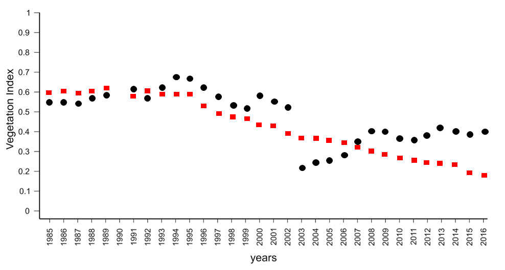
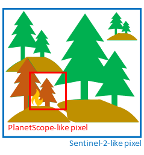
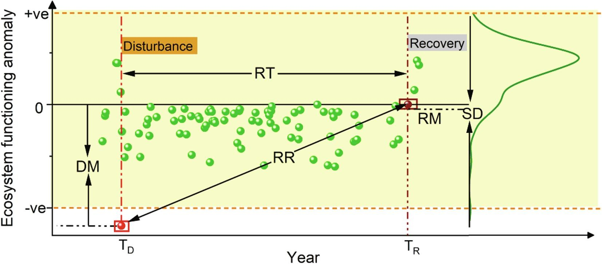
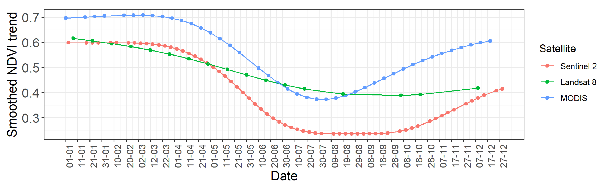
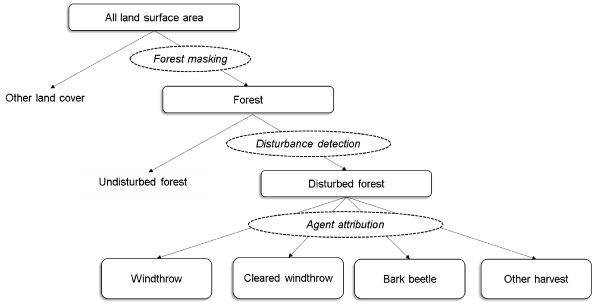
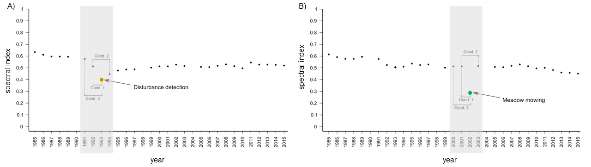
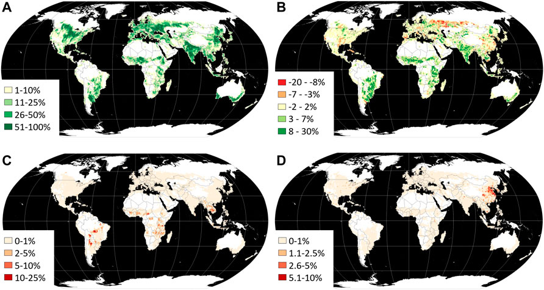

Vegetation change and disturbance detection
================

In **[Theme 2](../02_temporal_information/02_temporal_information.md)**, we introduced various types of multitemporal data analysis. In this Module we put most emphasis on classification and **change detection**. Content of this Theme we’ll delve deeper into the latter. We will focus on different definitions of change types, explore various approaches and algorithms for detecting changes (such as disturbances or recovery) in vegetation, as well as on assessing the accuracy of the results.

In this theme, you will learn about:

- **[approaches to change detection on optical satellite data](#approaches-to-change-detection-on-optical-satellite-data)**
- **[different types of changes](#types-of-changes)**
- **[vegetation disturbance and recovery](#vegetation-disturbance-and-recovery)**
- **[time series variables as predictors of vegetation disturbance](#time-series-variables-as-predictors-of-vegetation-disturbance)**
- **[monitoring of changes: spectral trajectory in different time series data](#monitoring-of-changes-spectral-trajectory-in-different-time-series-data)**
- **[algorithms](#algorithms)**
- **[results validation and accuracy assessment](#results-validation-and-accuracy-assessment)**
- **[global vegetation change detection products](#global-vegetation-change-detection-products)**

This theme will conclude with:

- **[Self-evaluation quiz](#self-evaluation-quiz)**
- **[References](#references)**

To consolidate your knowledge and test it in more practical environment complete the **[Exercise](05_vegetation_monitoring_exercise.md)**.

After finishing this theme you will:

- gain knowledge of multitemporal data analysis techniques, particularly in classification and change detection.
- understand various methods for change detection in optical satellite data.
- distinguish different types of changes (abrupt, gradual, seasonal) and their corresponding detection algorithms.
- grasp mathematical aspects of change detection,
- appreciate the role of time intervals and density in change detection studies.
- discover the use of time series variables in predicting vegetation disturbance and recovery patterns.
- learn how to use different satellite data sources for varied cases and fuse data from different sensors to enhance resolutions.
- understand the process of validating results and assessing accuracy in change detection studies.
- overview global vegetation change detection products and understand their strengths and limitations.

## Approaches to change detection on optical satellite data

The basic categorization of automatic change detection methods includes two approaches: **comparative analysis of two images** ($t_1$ - $t_2$) and **simultaneous analysis of multitemporal images** ($t_1$ $t_2$ … $t_n$, [Singh, 1989](https://doi.org/10.1080/01431168908903939)).

The simplest methods, initially used in the analysis of changes belonging to the first group, are:

- **signal difference** – subtracting or dividing the reflectance or index values from two images,
- **regression analysis** - pixels from time $t_1$ are assumed to be a linear function of the time $t_2$ pixels,
- using a **second PCA component** from transformation performed on the two images bands,
- **comparison of classification results** and **simultaneous classification of two images**,
- **Change Vector Analysis**, which involves finding the size and direction of the change vector for each pixel between two images,
- **subtracting the background**, where a reference image of the background is determined as having low values of difference, and a binary mask representing pixels of changes is created based on this,
- **hybrid methods**, combining different approaches into a single change detection procedure, or combining results obtained from different methods leading to a new result.

From mathematical point of view, the change can be extracted from the second group via ([Zhu, 2017](https://doi.org/10.1016/j.isprsjprs.2017.06.013)):

- **differencing** - indicating large differences in comparing images from different terms,
- **temporal segmentation** - segmenting the time series into a series of straight line segments based on the residual-error and angle criterions,  
- **trajectory classification** - from hypothesised trajectories representing signatures specific to different kinds of changes or from multitemporal supervised classification,  
- **statistical boundary** - indicating significant departure from the statistical boundary followed by time series,  
- **regression** - estimating the long-term movements or trends in time series.

In both approaches **thresholding** indicating significant deviation from the predefined threshold is also listed. It is a special method which can be used after performing e.g. differencing or regression analysis. As you can see some other methods are also the same for both $t_1$ - $t_2$ and $t_1$ $t_2$ … $t_n$ analysis.

<i>Temporal segmentation of TC Wetness calculated on Landsat data (A - on all clear observations, B - annual compositions, figure by [Pasquarella et al., 2021](https://doi.org/10.1016/j.jag.2022.102806), modified/ [CC BY 4.0](https://creativecommons.org/licenses/by/4.0/)).</i>

Historically, change studies were based mainly on less frequent time intervals, e.g. one image every 3 years (e.g. [Miller and Yool, 2002](https://doi.org/10.1016/S0034-4257(02)00071-8)). In the case of **vegetation**, regeneration after disturbance may take several years, so significant changes may be omitted in the analysis of images obtained at too distant dates. Nowadays, the second group of analyzes based on denser time series is commonly used, providing more detailed information for environmental monitoring. Having such a data set spanning a broad time period, there is no need to sequence pairs of images and search for single events that occurred between two dates, which would lead to the omission of valuable information ([Huang et al., 2010](https://doi.org/10.1016/j.rse.2009.08.017)). It is more effective to search for characteristic spectral features in the entire set of spectral values of multitemporal data.

## Types of changes

The possibility to detect changes based on satellite data depends on the system capacity to account for variability at different temporal scales mentioned in **[Theme 2](../02_temporal_information/02_temporal_information.md)**. Consequently,, three types of changes can be differentiated from time series data: **abrupt, gradual and seasonal**. Each type is detailed below.

### Abrupt and gradual changes

**Abrupt** refer to short-term, large magnitude changes ([Zhu, 2017](https://doi.org/10.1016/j.isprsjprs.2017.06.013)) and can be instigated by agents such as fires, floods, hurricanes, deforestation etc. In contrast, **gradual** refer to long-term, small magnitude date-to-date changes. These ones can be caused by e.g. climate changes, land management or pests outbreaks.

<i>Example pixels representing gradual (red squares) and abrupt (black dots) changes occurrence (abrupt change detected in 2003, figure by course authors).</i>

### Seasonal changes

There are also **seasonal** changes, driven by annual temperature and rainfall interactions that impact plant phenology or proportional cover of land cover types with different phenology of vegetation ([Verbesselt et al., 2010](https://doi.org/10.1016/j.rse.2009.08.014)). Analysis concerning these types of changes use differences between images as consideration for detecting seasonal metric/parameter connected to the plants phase of growth in a given time, e.g. start, peak or end of the growing season.

<i>Seasonality parameters: (a) beginning of season, (b) end of season, (c) length of season, (d) base value, (e) time of middle of season, (f) maximum value, (g) amplitude, (h) small integrated value, (h+i) large integrated value (the red and blue lines are filtered and original data, respectively, figure by [Eklundh, 2023](https://web.nateko.lu.se/timesat/timesat.asp)/ [CC BY-NC-ND 2.5 SE](https://creativecommons.org/licenses/by-nc-nd/2.5/se/)).</i>

## Vegetation disturbance and recovery

The word **change** can encompass both positive and negative shifts from an object’s stable state. **Disturbance** in the context of vegetation refers to a negative phenomenon that disrupts the steady state.

When discussing disturbances it is also important to indicate the **scale** of analysis. At global or regional scales disturbances are generally defined as processes that lead to the significant removal of canopy leaf area and live biomass ([McDowell et al., 2015](https://doi.org/10.1016/j.tplants.2014.10.008)). According to this definition, it isn’t necessary for entire individuals to die offf, which is a crucial point of consideration in a local scale analysis, such as a minor fire impacting individual trees. Scale is then directly related to **spatial resolution** of remote sensing data.

<i>Dependence of spatial resolution on the extent of disturbance (figure by course authors).</i>

The **frequency of data collection** also plays a critical role in quantifying terrestrial disturbances. This is particularly relevant when accounting for the speed of a disturbance event and potential **recovery** - a positive change in the context of such studies. For example, a wildfire signifies a fast, abrupt disturbance, whereas drought or insect infestations might represent slower disturbances.

<i>Dependence of temporal resolution on the frequency of observed disturbances/recovery (figure by course authors).</i>

The third vital resolution in disturbance detection is the **spectral** resolution to which we refer in the [next section](#time-series-variables-as-predictors-of-vegetation-disturbance) of this Theme.

These three metrics are typically used for ecosystems stability assessment in relation to disturbance and recovery:

- **resistance** - the ecosystem’s ability to resist disturbances,
- **resilience** - the ecosystem’s ability to recover to the original state after a disturbance,
- **variability** - the total variation of a system in response to environmental analysis.

These metrics can be measured by the use of spectral index anomaly time series. You can see the example in the article of [Huang et al., 2021](https://doi.org/10.1016/j.jag.2021.102575), where authors use Landsat data.

<i>Detection of the disturbance-recovery process and measures of ecosystem stability based on spectral index anomaly time series (DM - disturbance magnitude, RT - recovery time, RR - recovery rate, RM - recovery magnitude, SD - overall temporal variability, TD and TR - time point of disturbance and recovery, respectively, figure by [Huang et al., 2021](https://doi.org/10.1016/j.jag.2021.102575)/ [CC BY-NC-ND 4.0.](https://creativecommons.org/licenses/by-nc-nd/4.0/)).</i>

*Note: we will further use the more general term* ***change*** *to represent general methodological issues related to detecting disturbance or changes. However, with an understanding of the distinctions between these terms, you will be able to apply them correctly in specific cases.*

## Time series variables as predictors of vegetation disturbance

Each spectral band of satellite data carries unique information. In the case of vegetation, specific bands can help determine whether the plant is healthy or damaged. Combination of these bands, such as vegetation indices, are commonly employed to monitor vegetation disturbances and recovery. Here we can find **NDVI** (examples of use in: [Vogelmann et al., 2012](https://doi.org/10.1016/j.rse.2011.06.027) or [Brooks et al., 2014](https://doi.org/10.1109/TGRS.2013.2272545)), burned areas detection with **NBR** ([Huang et al., 2010](https://doi.org/10.1016/j.rse.2009.08.017), [Kennedy et al., 2010](https://doi.org/10.1016/j.rse.2010.07.008)), and vegetation water content analyses with **NDMI** ([DeVries et al., 2015](https://doi.org/10.1016/j.rse.2015.02.012), [Ochtyra et al., 2020](https://doi.org/10.1016/j.rse.2020.112026)) or **TC Wetness** ([Griffiths et al., 2014](https://doi.org/10.1016/j.rse.2013.04.022), [Oeser et al., 2017](https://doi.org/10.3390/f8070251)). The selection of the most appropriate variable is essential for the accurate detection of the disturbance signal.

There are various options to select the most relevant one. The majority of studies used an a priori selected index/band based on information found in the literature. [Cohen et al., 2018](https://doi.org/10.1016/j.rse.2017.11.015) presented comprehensive comparison of different variables and they developed **Disturbance Signal to Noise Ratio** to assess their performance. Such selection can be also preceded by **statistical evaluation of differences** between used variables (example of such evaluation in [Ochtyra et al., 2020](https://doi.org/10.1016/j.rse.2020.112026)).

Landsat-based Tasseled Cap transformation bands were used to develop **Disturbance Index (DI**, [Healey et al., 2005](https://doi.org/10.1016/j.rse.2005.05.009)). This specific derivative was designed to highlight the non-vegetated areas spectral signatures associated with stand-replacing disturbance and separate them from other forest signatures.

DI is calculated by rescaled values of Brightness, Greenness, and Wetness values in a following equation:

DI = B$r$-(G$r$+W$r$),

where B$r$, G$r$, W$r$ represent rescaled Brightness, Greenness, and Wetness values, which are calculated as the difference between image transformation bands and their standard deviations divided by mean values for forested pixels (extracted e.g. from land cover map), as below:

B$r$ = (B$-$B$\mu$)/B$\sigma$

G$r$ = (G$-$G$\mu$)/G$\sigma$

W$r$ = (W$-$W$\mu$)/W$\sigma$

where:

B$\mu$, G$\mu$, W$\mu$ denote mean forest Brightness, Greenness, and Wetness,

B$\sigma$, G$\sigma$, W$\sigma$ represent standard deviation of forest Brightness, Greenness, and Wetness.

Disturbed areas generally high positive B$r$ values and low negative G$r$ and W$r$.

Another index related to disturbance detection is [Moderate Resolution Imaging Spectrometer (MODIS) Global Disturbance Index (MGDI)](https://www.umt.edu/numerical-terradynamic-simulation-group/project/modis/mgdi.php). Due to the low spatial resolution of MODIS it is used at more generalized (even global) scale. This index incorporates vegetation greenness and surface temperature data.

## Monitoring of changes: spectral trajectory in different time series data

Extracting change from time series satellite data can be complex, as it involves all sorts of changes including seasonal, gradual, and abrupt shifts. The process is further complicated by factors such as clouds, haze, aerosols, lighting differences, and geometric inconsistency. In order to detect changes as accurately as possible, it is crucial to select data with **resolutions that best investigate the phenomenon under study**. Then these additional factors need to be eliminated (as shown in **[Theme 3](../03_image_processing/03_image_processing.md)**). Based on pixel values in the time series we can analyse the trend over time and the relationship between the variables. This type of analysis is referred to as **spectral trajectory** analysis (you can read about this more in **[Theme 4 of Module 1](../../module1/04_trajectory-based_analysis/04_trajectory_based_analysis.md)**.

To capture the stages of plant development in **phenological changes** detection, the highest possible temporal resolution of the inter-annual data, at most every few days, is most desirable. The spatial resolution is important here, as meteorological image data are collected for the same area even several times a day, but their pixel size (greater than 1 km) limits the extraction of vegetation alone. The spectral ranges most frequently used are visible light, near and shortwave infrared. Apart from using the original reflectance values, information from more than one band is often combined to enhance the plant properties visible in the image (commonly used index is NDVI, being a good indicator for vegetation phenology).

MODIS data can outperform Landsat in phenology analysis, highlighting the importance of higher temporal resolution needed to phenological change detection, even if the spatial resolution is lower. The Sentinel-2 constellation is noteworthy here as well. It provides a relatively small pixel size, useful spectral bands as well as a quite fast revisit time thanks to double data acquisition from Sentinel-2A and Sentinel-2B twin satellites. The only limitation may be cloudiness. To improve the temporal and spatial resolution of single sensors alone they are harmonised or fused together (see **[Theme 3 of this Module](../03_image_processing/03_image_processing.md#data-fusion)** and **[Theme 5 of Module 1](../../module1/05_spatio_temporal_data_fusion/05_spatio-temporal_data_fusion.md)**).

Very high temporal resolution is not necessary in **abrupt changes** detection in the long-term perspective (intra-annual). These changes can be caused by e.g. deforestation, so their sudden nature will appear as a rapid drop/increase in the reflectance or index value. High spectral resolution is then also not a crucial requirement for abrupt events detection. More important factor is that the sensor is operating on spectral bands that best show the phenomenon under study. Landsat data 16-day revisit time can be enough to indicate such drastic change.

Abrupt changes often concern larger areas than gradual changes (e.g. pest gradations). Therefore very high spatial resolution is also not required. For **gradual changes** the measured differences between data from subsequent dates will be less pronounced so the key factors affecting the accuracy of change detection are the details in the spectral and spatial domain. A dense time series of data also allows a more detailed analysis of the trend (with a lower frequency it could be a problematic to pinpoint the actual time of change).

<i>NDVI trends derived from different sensors: Sentinel-2, Landsat 8 and MODIS (note that the study area is located in the southern hemisphere, figure by [Kavats et al., 2020](https://doi.org/10.3390/rs12244080)/ [CC BY 4.0](https://creativecommons.org/licenses/by/4.0/)).</i>

## Algorithms

Freely available long time series of satellite data, such as Landsat, have opened the way to the development of various change/ disturbance detection algorithms. The literature presents different approaches, highlighting their capability to detect particular change (abrupt, gradual, seasonal).

**Table 1** lists selected algorithms developed for change/disturbance detection with the information about change type possible to capture.

<b>Table 1. Selected algorithms for change/ disturbance detection on satellite data.</b>

| Algorithm                                                                  | Change type               | Reference                                                                                          |
|----------------------------------------------------------------------------|---------------------------|----------------------------------------------------------------------------------------------------|
| Breaks For Additive Seasonal and Trend (BFAST)                             | abrupt, gradual, seasonal | [Verbesselt et al., 2010](https://doi.org/10.1016/j.rse.2009.08.014)                               |
| Continuous Change Detection and Classification (CCDC)                      | abrupt, gradual, seasonal | [Zhu, Woodcock, 2014](https://doi.org/10.1016/j.rse.2014.01.011)                                   |
| COntinuous monitoring of Land Disturbance (COLD)                           | abrupt, gradual           | [Zhu et al., 2020](https://doi.org/10.1016/j.rse.2019.03.009)                                      |
| Detecting Breakpoints and Estimating Segments in Trend (DBEST)             | abrupt, gradual, seasonal | [Jamali et al., 2015](https://doi.org/10.1016/j.rse.2014.09.010)                                   |
| Exponentially Weighted Moving Average Change Detection (EWMACD)            | abrupt                    | [Brooks et al., 2014](https://ui.adsabs.harvard.edu/abs/2014AGUFM.B51L..01B/abstract)              |
| Harmonic Analyses of NDVI Time-Series (HANTS)                              | seasonal                  | [Zhou et al., 2015](https://doi.org/10.1016/j.rse.2015.03.018)                                     |
| Image Trends from Regression Analysis (ITRA)                               | gradual                   | [Vogelmann et al., 2012](https://doi.org/10.1016/j.rse.2011.06.027)                                |
| Jumps Upon Spectrum and Trend (JUST)                                       | abrupt, gradual, seasonal | [Ghaderpour, Vujadinovic, 2020](https://doi.org/10.3390/rs12234001)                                |
| Landsat-based detection of Trends in Disturbance and Recovery (LandTrendr) | abrupt, gradual           | [Kennedy et al., 2010](https://doi.org/10.1016/j.rse.2010.07.008)                                  |
| MIICA (Multi-index Integrated Change Analysis)                             | abrupt                    | [Jin et al., 2013](https://doi.org/10.1016/j.rse.2013.01.012)                                      |
| Phenological parameters estimation tool (PPET)                             | seasonal                  | [McKellip et al., 2010](https://ntrs.nasa.gov/api/citations/20100033570/downloads/20100033570.pdf) |
| Seasonal trend decomposition Loess (STL)                                   | seasonal                  | [Cleveland et al., 1990](http://www.nniiem.ru/file/news/2016/stl-statistical-model.pdf)            |
| Sub-annual change detection algorithm (SCD)                                | abrupt                    | [Cai, Liu, 2015](https://doi.org/10.3390/rs70708705)                                               |
| Threshold- and trend-based vegetation change monitoring algorithm (TVCMA)  | abrupt, gradual           | [Ochtyra et al., 2020](https://doi.org/10.1016/j.rse.2020.112026)                                  |
| TimeStats                                                                  | seasonal                  | [Udelhoven, 2011](https://doi.org/10.1109/jstars.2010.2051942)                                     |
| Time-Series Classification approach based on Change Detection (TSCCD)      | abrupt, gradual           | [Yan et al. 2019](https://doi.org/10.1016/j.isprsjprs.2019.10.003)                                 |
| Vegetation Change Tracker (VCT)                                            | abrupt                    | [Huang et al., 2010](https://doi.org/10.1016/j.rse.2009.08.017)                                    |
| Vegetation Regeneration and Disturbance Estimates Through Time (VeRDET)    | abrupt, gradual           | [Hughes et al., 2017](https://doi.org/10.3390/f8050166)                                            |

The algorithms can be used as independent tools implemented in environments such as R, IDL, MATLAB, Python or Google Earth Engine. There are also programs dedicated to multitemporal analyses that use the algorithms, such as STL in [TIMESAT software](https://web.nateko.lu.se/timesat/timesat.asp).

As you can see, most of the algorithms are able to detect abrupt changes, and some detect gradual changes, although the authors point out that this is a more challenging task. There are also robust phenological change detection algorithms, like the aforementioned BFAST dealing with all types of changes.

*Note: bearing in mind that each of them works in a different way and works better for different applications, it is valuable to* ***compare their performance,*** *such as in collective work of [Cohen et al. (2017)](https://doi.org/10.3390/f8040098)) or to* ***combine several algorithms*** *into one polyalgorithm (as proposed by [Saxena et al., (2018)](https://doi.org/10.1016/j.isprsjprs.2018.07.002).*

The algorithms dealing with abrupt/gradual changes have been developed to use mainly data from the Landsat mission, though most are also being adapted to Sentinel-2. In some cases a longer time series may be required for the algorithm to work properly. Phenological changes related algorithms are typically intended for use with MODIS data, although data from the above sensors can also be used (e.g. BFAST). With the recent increase in availability of Planet data, algorithms like **Thresholding Rewards and Penances algorithm** (TRP, [Francini et al., 2020](https://doi.org/10.1080/22797254.2020.1806734)) have been developed to assess forest loss in **near real-time**.

After applying the algorithm to a time series of data, the changes detected by it can be assigned to specific phenomena (e.g. disturbance agents). It can be done by e.g. supervised classification.

<i>Forests disturbance detection with agents attribution workflow (figure by [Oeser et al., 2017](https://doi.org/10.3390/f8070251)/ [CC BY 4.0](https://creativecommons.org/licenses/by/4.0/)).</i>

In order to familiarize you with how these algorithms work (some of which you will use in the **[Exercise](05_vegetation_monitoring_exercise.md)** and **[Case study 3](../08_cs_disturbance_detection/08_cs_disturbance_detection.md)**, below we provide more detailed descriptions on selected ones.

### The Landsat-based detection of Trends in Disturbance and Recovery (LandTrendr)

LandTrendr ([Kennedy et al., 2010)](https://doi.org/10.1016/j.rse.2010.07.008)) algorithm uses the segmentation method to detect abrupt changes such as forest disturbance, and, between them, gradual ones are captured thanks to the slope fitting for each segment.

<i>LandTrendr concept (figure by [Mugiraneza et al., 2020](https://doi.org/10.3390/rs12182883)/ [CC BY 4.0](https://creativecommons.org/licenses/by/4.0/)).</i>

As the results, the year of detection with number of changes, magnitude of spectral change calculated as spectral distance between vertices, RMSE of fitted temporal segments (FTV) are provided.

### Vegetation Change Tracker (VCT)

VCT ([Huang et al., 2010](https://doi.org/10.1016/j.rse.2009.08.017)) normalizes each image into a forest likelihood measures described below, and uses the thresholding approach to detect disturbances.

In the first part, **forest *z*-score** is calculated as follows:

$FZ_i$ = $\frac{bp_i-\bar{b_i}}{SD_i}$

where $b_i$ and $SD_i$ are mean and standard deviation of the band $i$ spectral values of known forest pixels, and $bp_i$ is any pixel value in the image.

Then, for multispectral satellite data, an **integrated forest *z*-score (IFZ)** value calculation is based on integration $IFZ$ over the spectral bands as:

$IFZ$ = $\sqrt{\frac{1}{N}\displaystyle\sum_{i=1}^N(FZ_i)^2}$

where *N* is the number of bands. Bands from green and shortwave infrared ranges are used (in case of Landsat use the authors of VCT proved that NIR range is not used, because it is less sensitivity to non-fire disturbances than the other bands). To improve detection of fire disturbance events VCT also calculates **NBR** index described in more detail in **[Theme 1](../01_multispectral_principles/01_multispectral_principles.md#spectral-indices)**.

As the results, the year of disturbance, VCT land cover mask and magnitude of disturbance in spectral bands and calculated indices are provided.

### Threshold- and trend-based vegetation change monitoring algorithm (TVCMA)

TVCMA ([Ochtyra et al., 2020](https://doi.org/10.1016/j.rse.2020.112026)) uses two separate approaches: **thresholding**, indicating where and when the disturbances occurred, and a **regression** analysis, presenting the general trend in the time series for each pixel. This allows for monitoring both the abrupt and gradual changes.

Contrary to simple thresholding sensitive to outlier detections (which may be the result of weather anomalies or data processing inaccuracies), three **logical conditions** have been included to reduce the number of outliers.

<i>Example of algorithm performance using predefined conditions: a) disturbance detection and b) short-term change omission (figure by course authors).</i>

As the results, the number of detected disturbances, the Spearman’s correlation coefficient between the modeled trend line and satellite observations, and p-values are provided.

### The Breaks for Additive Season and Trend (BFAST)

BFAST ([Verbesselt et al., 2010](https://doi.org/10.1016/j.rse.2009.08.014)) algorithm uses **breakpoints** to detect breaks on each individual time series component: trend, seasonal and remainders.

<i>Original data (Yt) and fitted seasonal (St), trend (Tt) and remainder (et) components for MODIS time series of a Longre Co lake in the Tibetan Plateau (figure by [Che et al., 2017](https://doi.org/10.3390/rs9010082), modified/ [CC BY 4.0](https://creativecommons.org/licenses/by/4.0/)).</i>

BFAST belongs to the statistical boundary methods, as it is based on the ordinary least squares (OLS) residuals-based MOving SUM (MOSUM) procedures for monitoring structural changes derived from both econometry and statistics ([Zelleis, 2005](https://doi.org/10.1080/07474930500406053)). On this basis it is possible to test whether one or more breakpoints in the trend or seasonal component are occurring.

BFAST *family* has nowadays extended. **BFAST Monitor** ([DeVries et al., 2015](https://doi.org/10.1016/j.rse.2015.02.012)) provides additional functionality for monitoring disturbances at the end of time series, in near real-time) and **BFAST Lite** ([Masiliūnas et al., 2021](https://doi.org/10.3390/rs13163308)) in comparison to regular BFAST is faster, more flexible and handles missing values in time series.

The time and magnitude of change are provided as results by these algorithms.

To see how to practically use BFAST in R in deforestation analysis follow this [video](https://www.youtube.com/watch?v=GVvrHQ15q5U) by Geografif.

## Results validation and accuracy assessment

Creation of reliable validation dataset is a time-consuming procedure but it plays a key role in assessment of time series analysis results. In **[Theme 2 exercise](../02_temporal_information/02_temporal_information_exercise.md)** we practically demonstrated how to create a validation dataset for 33-year Landsat data series using only image compositions and indices values.

Comprehensive review on accuracy evaluation you can find in **[Theme 6 of Module 1](../../module1/06_reference_data_validation_accuracy_assessment/06_reference_data_validation_accuracy_assessment.md)**. In this section we provide some metrics that will be used in the **[exercise](05_vegetation_monitoring_exercise.md)** and **[Case study 3](../08_cs_disturbance_detection/08_cs_disturbance_detection.md)**.

These include measures for binary results (change/no change): **True Positive (TP)** and **True Negative (TN)** rates, which refers to the number of correctly detected as changed and unachanged pixels, respectively ([Olson and Delen, 2008](https://books.google.pl/books?hl=pl&lr=&id=2vb-LZEn8uUC&oi=fnd&pg=PA8&dq=Advanced+Data+Mining+Techniques+OLSON+DELEN&ots=zX90Zb2IsS&sig=4qKHq1_3tzfRahw-QJlp9YgLmRo&redir_esc=y#v=onepage&q=Advanced%20Data%20Mining%20Techniques%20OLSON%20DELEN&f=false)). On the other hand, **False Positives (FP)** and **False Negatives (FN)** indicates the number of pixels wrongly detected as changed or unchanged, respectively. Based on them, **Producer (PA)** and **User (UA)** accuracies for both changes and no-changes are calculated, as follows:

$PA_C = \frac{TP}{TP+FN}$ and $PA_N = \frac{TN}{TN+FP}$

$UA_C = \frac{TP}{TN+FP}$ and $UA_N = \frac{TN}{TN+FN}$

where $PA_C$ and $UA_C$ means producer and user accuracy for change, respectively, and $PA_N$ and $UA_N$ means the same for no-change.

Accuracies of detected change and no-change classes are also related to the error rates, such as **ommission** and **commission**, calculated by following: $1-PA$ and $1-UA$, respectively.

For the entire analyzed result (both changes and no-changes) the **Overall Accuracy (OA)** is calculated to indicate the prediction’s accuracy:

$OA = \frac{TP+TN}{TP+TN+FP+FN}$

However, OA is less robust in such analyses, because, despite the detected changes, it also depends on the number of true negatives. Even with low efficiency of actual change detection, the OA value will be high, making this measure less useful than e.g. comission rate.

To assess the performance of different algorithms, you can utilize these measures calculated on the same reference datasets. For a detailed analysis of how the results of different forest disturbance detection algorithms, refer to the article of [Cohen et al., 2017](https://doi.org/10.3390/f8040098).

<i>Omission and commission rates for seven map product sets (figure by [Cohen et al., 2017](https://doi.org/10.3390/f8040098)/ [CC BY 4.0](https://creativecommons.org/licenses/by/4.0/)).</i>

Once we deem the result satisfactory, we can calculate the area of changes (e.g. disturbances and recovery) that occurred in specific years, as well as *change rate* in units like e.g. km2 per year (more information you in [Liu et al., 2017](https://doi.org/10.3390/rs9050479)).

## Global vegetation change detection products

Several global products derived from satellite-based change detection are available.

[**Global Forest Watch**](https://www.globalforestwatch.org/) is an online platform that provides data and tools for monitoring forests. The info about forest loss and gain is based on [**Global Forest Change (GFC)** 2000-2020](https://glad.earthengine.app/view/global-forest-change#bl=off;old=off;dl=1;lon=20;lat=10;zoom=3;) produced by the team of [Hansen et al., 2013](https://doi.org/10.1126/science.1244693), as well as on land cover based on [**The Global 2000-2020 Land Cover and Land Use Change**](https://glad.umd.edu/dataset/GLCLUC2020), developed by [Potapov et al., 2022](https://doi.org/10.3389/frsen.2022.856903). Except forests, the second one contains also built-up lands, croplands, water, perennial snow and ice layers.

<i>The example of GLCLUC2020 cropland extent and dynamics for each 1 × 1° grid cell. (A) Cropland area 2019, % cell area. (B) Net cropland area change, 2000–2019, % cell area. (C) Cropland gain 2000–2019 within forest loss 2000–2020 area, % cropland gain area within a cell. (D). Cropland loss 2000–2019 within the year 2020 built-up lands, % cropland loss area within a cell, figure by [Potapov et al., 2022](https://doi.org/10.3389/frsen.2022.856903)/ [CC BY 4.0](https://creativecommons.org/licenses/by/4.0/)).</i>

There are also products that present observed phenomenas or classes in different dates, from which you can indirectly obtain the information about the changes (e.g. vegetation condition or chlorophyll content from [MODIS](https://earthobservatory.nasa.gov/global-maps/MOD_NDVI_M) data).

Remember that we have listed such multitemporal land cover products in **Table 1 in [Theme 4](../04_multitemporal_classification/04_multitemporal_classification.md#multitemporal-reference-dataset)**, e.g. [Dynamic World](https://www.dynamicworld.app/). Therefore, you can capture changes in environmental components based on the maps from specific dates.

However, when utilizing such data, it is important to note that it is compiled on a global scale. You can find many examples in the literature outlining the limitations and errors for specific areas analysis. For regional or local application a very thorough and accurate approach is recommended to achieve satisfactory results.

## Self-evaluation quiz

You are now at the end of the lesson and should have a knowledge about the use of satellite data for vegetation change / disturbance detection. Use the questions below to assess your learning success:

<form name="quiz" action method="post" onsubmit="evaluate_quiz(); return false">
<!--Question 1-->
<label for="q_01"> <b>Question 1.</b> For detection of which change types will be the most appropriate time-series consisting of one image per year?  
</label>  <input type="radio" name="q_01">gradual and seasonal <input type="radio" name="q_01">abrupt and gradual <input type="radio" name="q_01">seasonal and abrupt <input type="radio" name="q_01">all of the above

abrupt and gradual

<output id="output_q_01">
</output>

  

<!--Question 2-->
<label for="q_02"> <b>Question 2.</b> Which type of image data analysis method is not used in multitemporal change detection algorithms? </label>  <input type="radio" name="q_02">thresholding  <input type="radio" name="q_02">image enhancement  <input type="radio" name="q_02">segmentation  <input type="radio" name="q_02">differencing 

image enhancement

<output id="output_q_02">
</output>

  

<!--Question 3-->
<label for="q_03"> <b>Question 3.</b> Commonly used vegetation disturbance detection variables are related to: </label>  <input type="radio" name="q_03">water content  <input type="radio" name="q_03">nitrogen content  <input type="radio" name="q_03">burn severity  <input type="radio" name="q_03">soil salinity 

water content

<output id="output_q_03">
</output>

  

<!--Question 4-->
<label for="q_04"> <b>Question 4.</b> What data is best to detect seasonal changes in the Amazon forests between 2005 and 2023? </label>  <input type="radio" name="q_04">Planet  <input type="radio" name="q_04">Landsat  <input type="radio" name="q_04">Sentinel-2  <input type="radio" name="q_04">MODIS 

MODIS

<output id="output_q_04">
</output>

  

<!--Question 5-->
<label for="q_05"> <b>Question 5.</b> Gradual changes in time series are: </label>  <input type="radio" name="q_05">short-term, small magnitude year-to-year  <input type="radio" name="q_05">short-term, large magnitude year-to-year  <input type="radio" name="q_05">long-term, small magnitude year-to-year  <input type="radio" name="q_05">long-term, large magnitude year-to-year 

long-term, small magnitude year-to-year

<output id="output_q_05">
</output>

  

<!--Question 6-->
<label for="q_06"> <b>Question 6.</b> Which of the following algorithms will detect a pest infestation and why? </label>  <input type="radio" name="q_06">VCT thanks to the IFt index calculation  <input type="radio" name="q_06">BFAST thanks to the trend component  <input type="radio" name="q_06">TVCMA thanks to simple thresholding  <input type="radio" name="q_06">LandTrendr thanks to remainder component 

BFAST thanks to the trend component

<output id="output_q_06">
</output>

  

<!--Question 7-->
<label for="q_07"> <b>Question 7.</b> Change / disturbance detection algorithm result cannot be: </label>  <input type="radio" name="q_07">the number and magnitude of changes  <input type="radio" name="q_07">the year of detection and error of temporal composition creation  <input type="radio" name="q_07">error of fitted temporal segment and calculated index  <input type="radio" name="q_07">correlation coefficient between the trend line and satellite data and the magnitude of spectral changes 

the year of detection and error of temporal composition creation

<output id="output_q_07">
</output>

  

<output id="output_overall">
</output>

<input type="submit" value="Submit" style="font-size:14pt">  

</form>

## Exercise

[Proceed with the exercise by going to the next page below or clicking this link](05_vegetation_monitoring_exercise.md)

## References

### Key references (recommended reading, looking up background details)

Cohen, W. B., Healey, S. P., Yang, Z., Stehman, S. V., Brewer, C. K., Brooks, E. B., Gorelick, N., Huang, C., Hughes, M.J., Kennedy, R.E., Loveland, T.R., Moisen, G.G., Schroeder, T.A., Vogelmann, J.E., Woodcock, C.E., Yang, L., & Zhu, Z. (2017). *How similar are forest disturbance maps derived from different Landsat time series algorithms?*. Forests, 8(4), 98. <https://doi.org/10.3390/f8040098>

Huang, C., Goward, S. N., Masek, J. G., Thomas, N., Zhu, Z., & Vogelmann, J. E. (2010). *An automated approach for reconstructing recent forest disturbance history using dense Landsat time series stacks*. Remote Sensing of Environment, 114(1), 183-198. <https://doi.org/10.1016/j.rse.2009.08.017>

Kennedy, R. E., Yang, Z., & Cohen, W. B. (2010). D*etecting trends in forest disturbance and recovery using yearly Landsat time series: 1. LandTrendr—Temporal segmentation algorithms*. Remote Sensing of Environment, 114(12), 2897-2910. <https://doi.org/10.1016/j.rse.2010.07.008>

Liu, S., Wei, X., Li, D., & Lu, D. (2017). *Examining forest disturbance and recovery in the subtropical forest region of zhejiang province using landsat time-series data*. Remote Sensing, 9(5), 479. <https://doi.org/10.3390/rs9050479>

McDowell, N. G., Coops, N. C., Beck, P. S., Chambers, J. Q., Gangodagamage, C., Hicke, J. A., … & Allen, C. D. (2015). *Global satellite monitoring of climate-induced vegetation disturbances*. Trends in plant science, 20(2), 114-123. <https://doi.org/10.1016/j.tplants.2014.10.008>

Ochtyra, A., Marcinkowska-Ochtyra, A., & Raczko, E. (2020). T*hreshold-and trend-based vegetation change monitoring algorithm based on the inter-annual multi-temporal normalized difference moisture index series: A case study of the Tatra Mountains*. Remote Sensing of Environment, 249, 112026. <https://doi.org/10.1016/j.rse.2020.112026>

Zhu, Z. (2017). *Change detection using landsat time series: A review of frequencies, preprocessing, algorithms, and applications*. ISPRS Journal of Photogrammetry and Remote Sensing, 130, 370-384. <https://doi.org/10.1016/j.isprsjprs.2017.06.013>

### Additional references cited in this theme

Brooks, E., Wynne, R. H., Thomas, V. A., Blinn, C. E., & Coulston, J. (2014). *Exponentially Weighted Moving Average Change Detection Around the Country (and the World)*. In AGU Fall Meeting Abstracts (Vol. 2014, pp. B51L-01). [SOURCE](https://ui.adsabs.harvard.edu/abs/2014AGUFM.B51L..01B/abstract)

Cleveland, R. B., Cleveland, W. S., McRae, J. E., & Terpenning, I. (1990). *STL: A seasonal-trend decomposition*. Journal of Official Statistics, 6(1), 3-73. [SOURCE](http://www.nniiem.ru/file/news/2016/stl-statistical-model.pdf)

Cohen, W. B., Yang, Z., Healey, S. P., Kennedy, R. E., & Gorelick, N. (2018). *A LandTrendr multispectral ensemble for forest disturbance detection*. Remote Sensing of Environment, 205, 131-140.<https://doi.org/10.1016/j.rse.2017.11.015>

Che, X., Yang, Y., Feng, M., Xiao, T., Huang, S., Xiang, Y., & Chen, Z. (2017). *Mapping extent dynamics of small lakes using downscaling MODIS surface reflectance*. Remote Sensing, 9(1), 82. <https://doi.org/10.3390/rs9010082>

DeVries, B., Verbesselt, J., Kooistra, L., & Herold, M. (2015). *Robust monitoring of small-scale forest disturbances in a tropical montane forest using Landsat time series*. Remote Sensing of Environment, 161, 107-121. <https://doi.org/10.1016/j.rse.2015.02.012>

Francini, S., McRoberts, R. E., Giannetti, F., Mencucci, M., Marchetti, M., Scarascia Mugnozza, G., & Chirici, G. (2020).\* Near-real time forest change detection using PlanetScope imagery\*. European Journal of Remote Sensing, 53(1), 233-244. <https://doi.org/10.1080/22797254.2020.1806734>

Ghaderpour, E., & Vujadinovic, T. (2020). *Change detection within remotely sensed satellite image time series via spectral analysis*. Remote Sensing, 12(23), 4001. <https://doi.org/10.3390/rs12234001>

Griffiths, P., Kuemmerle, T., Baumann, M., Radeloff, V. C., Abrudan, I. V., Lieskovsky, J., … & Hostert, P. (2014). *Forest disturbances, forest recovery, and changes in forest types across the Carpathian ecoregion from 1985 to 2010 based on Landsat image composites*. Remote Sensing of Environment, 151, 72-88. <https://doi.org/10.1016/j.rse.2013.04.022>

Hansen, M. C., Potapov, P. V., Moore, R., Hancher, M., Turubanova, S. A., Tyukavina, A., … & Townshend, J. (2013). *High-resolution global maps of 21st-century forest cover change*. Science, 342(6160), 850-853. <https://doi.org/10.1126/science.1244693>

Healey, S. P., Cohen, W. B., Zhiqiang, Y., & Krankina, O. N. (2005). *Comparison of Tasseled Cap-based Landsat data structures for use in forest disturbance detection*. Remote Sensing of Environment, 97(3), 301-310. <https://doi.org/10.1016/j.rse.2005.05.009>

Huang, Z., Liu, X., Yang, Q., Meng, Y., Zhu, L., & Zou, X. (2021). *Quantifying the spatiotemporal characteristics of multi-dimensional karst ecosystem stability with Landsat time series in southwest China*. International Journal of Applied Earth Observation and Geoinformation, 104, 102575. <https://doi.org/10.1016/j.jag.2021.102575>

Hughes, M. J., Kaylor, S. D., & Hayes, D. J. (2017). *Patch-based forest change detection from Landsat time series*. Forests, 8(5), 166. <https://doi.org/10.3390/f8050166>

Jamali, S., Jönsson, P., Eklundh, L., Ardö, J., & Seaquist, J. (2015). D*etecting changes in vegetation trends using time series segmentation*. Remote Sensing of Environment, 156, 182-195. <https://doi.org/10.1016/j.rse.2014.09.010>

Jin, S., Yang, L., Danielson, P., Homer, C., Fry, J., & Xian, G. (2013). *A comprehensive change detection method for updating the National Land Cover Database to circa 2011*. Remote Sensing of Environment, 132, 159-175. <https://doi.org/10.1016/j.rse.2013.01.012>

Jönsson, P., & Eklundh, L. (2004). *TIMESAT—a program for analyzing time-series of satellite sensor data*. Computers & geosciences, 30(8), 833-845. <https://doi.org/10.1016/j.cageo.2004.05.006>

Kavats, O., Khramov, D., Sergieieva, K., & Vasyliev, V. (2020). *Monitoring of sugarcane harvest in Brazil based on Optical and SAR data*. Remote Sensing, 12(24), 4080. <https://doi.org/10.3390/rs12244080>

Kuenzer, C., Dech, S., & Wagner, W. (2015). *Remote sensing time series*. Remote Sensing and Digital Image Processing, 22, 225-245. [source](https://link.springer.com/book/10.1007/978-3-319-15967-6)

Masiliūnas, D., Tsendbazar, N. E., Herold, M., & Verbesselt, J. (2021). *BFAST Lite: A lightweight break detection method for time series analysis*. Remote Sensing, 13(16), 3308. <https://doi.org/10.3390/rs13163308>

McKellip, R.D., Ross, K.W., Spruce, J.P., Smoot, J.C., Ryan, R.E., Gasser, G.E., Prados, D.L., Vaughan, R.D., (2010). *Phenological Parameters Estimation Tool*. NASA Tech. Briefs, New York. [SOURCE](https://ntrs.nasa.gov/api/citations/20100033570/downloads/20100033570.pdf)

Miller, J. D., & Yool, S. R. (2002). *Mapping forest post-fire canopy consumption in several overstory types using multi-temporal Landsat TM and ETM data*. Remote Sensing of Environment, 82(2-3), 481-496. <https://doi.org/10.1016/S0034-4257(02)00071-8>

Mugiraneza, T., Nascetti, A., & Ban, Y. (2020). *Continuous monitoring of urban land cover change trajectories with landsat time series and landtrendr-google earth engine cloud computing*. Remote Sensing, 12(18), 2883. <https://doi.org/10.3390/rs12182883>

Oeser, J., Pflugmacher, D., Senf, C., Heurich, M., & Hostert, P. (2017). *Using intra-annual Landsat time series for attributing forest disturbance agents in Central Europe*. Forests, 8(7), 251. <https://doi.org/10.3390/f8070251>

Olson, D. L., & Delen, D. (2008). *Advanced data mining techniques*. Springer Science & Business Media.[source](https://link.springer.com/book/10.1007/978-3-540-76917-0)

Pasquarella, V. J., Arévalo, P., Bratley, K. H., Bullock, E. L., Gorelick, N., Yang, Z., & Kennedy, R. E. (2022). *Demystifying LandTrendr and CCDC temporal segmentation*. International Journal of Applied Earth Observation and Geoinformation, 110, 102806. <https://doi.org/10.1016/j.jag.2022.102806>

Saxena, R., Watson, L. T., Wynne, R. H., Brooks, E. B., Thomas, V. A., Zhiqiang, Y., & Kennedy, R. E. (2018). *Towards a polyalgorithm for land use change detection*. ISPRS Journal of Photogrammetry and Remote Sensing, 144, 217-234. <https://doi.org/10.1016/j.isprsjprs.2018.07.002>

Singh, A. (1989). *Review article digital change detection techniques using remotely-sensed data*. International Journal of Remote Sensing, 10(6), 989-1003. <https://doi.org/10.1080/01431168908903939>

Udelhoven, T. (2010). *TimeStats: A software tool for the retrieval of temporal patterns from global satellite archives*. IEEE Journal of Selected Topics in Applied Earth Observations and Remote Sensing, 4(2), 310-317. <https://doi.org/10.1109/jstars.2010.2051942>

Verbesselt, J., Hyndman, R., Newnham, G., & Culvenor, D. (2010). *Detecting trend and seasonal changes in satellite image time series*. Remote sensing of Environment, 114(1), 106-115. <https://doi.org/10.1016/j.rse.2009.08.014>

Vogelmann, J. E., Xian, G., Homer, C., & Tolk, B. (2012). *Monitoring gradual ecosystem change using Landsat time series analyses: Case studies in selected forest and rangeland ecosystems*. Remote Sensing of Environment, 122, 92-105. <https://doi.org/10.1016/j.rse.2011.06.027>

Yan, J., Wang, L., Song, W., Chen, Y., Chen, X., & Deng, Z. (2019). *A time-series classification approach based on change detection for rapid land cover mapping*. ISPRS Journal of Photogrammetry and Remote Sensing, 158, 249-262. <https://doi.org/10.1016/j.isprsjprs.2019.10.003>

Zhou, J., Jia, L., & Menenti, M. (2015). *Reconstruction of global MODIS NDVI time series: Performance of Harmonic ANalysis of Time Series (HANTS)*. Remote Sensing of Environment, 163, 217-228. <https://doi.org/10.1016/j.rse.2015.03.018>

Zhu, Z., & Woodcock, C. E. (2014). *Continuous change detection and classification of land cover using all available Landsat data*. Remote sensing of Environment, 144, 152-171. <https://doi.org/10.1016/j.rse.2014.01.011>

Zhu, Z., Zhang, J., Yang, Z., Aljaddani, A. H., Cohen, W. B., Qiu, S., & Zhou, C. (2020). *Continuous monitoring of land disturbance based on Landsat time series*. Remote Sensing of Environment, 238, 111116. <https://doi.org/10.1016/j.rse.2019.03.009>

Zeileis, A. (2005). *A unified approach to structural change tests based on ML scores, F statistics, and OLS residuals*. Econometric Reviews, 24(4), 445-466. <https://doi.org/10.1080/07474930500406053>

## Next unit

You have finished all of themes in this module. You can now proceed with case studies:

- [Monitoring tundra grasslands (Karkonosze)](../06_cs_tundra_grasslands/06_cs_tundra_grasslands.md)
- [Effects of pollution in Ore Mountains](../07_cs_forest_changes/07_cs_forest_changes.md)
- [Forest disturbance detection (Tatras)](../08_cs_disturbance_detection/08_cs_disturbance_detection.md)
