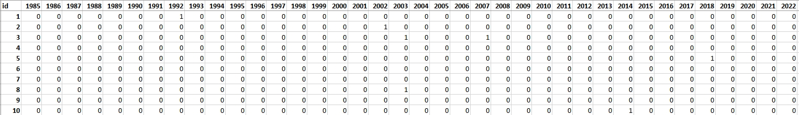
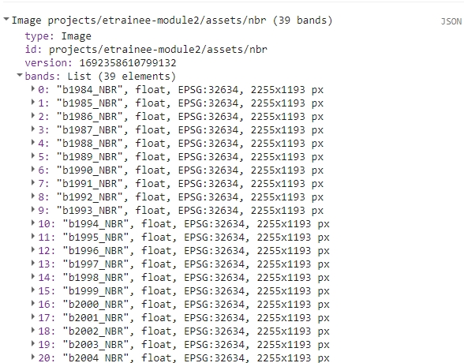
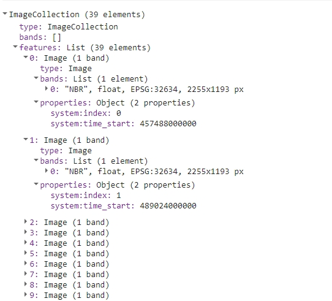
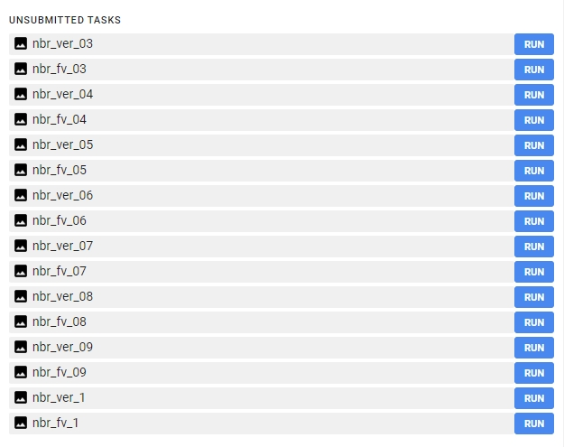
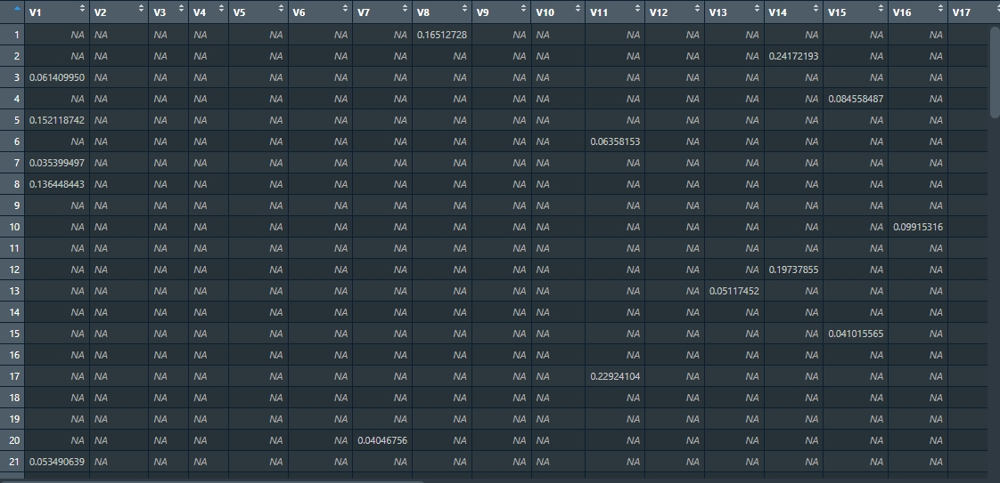
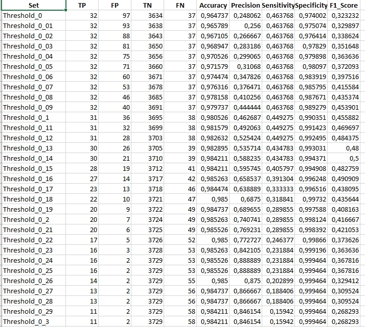
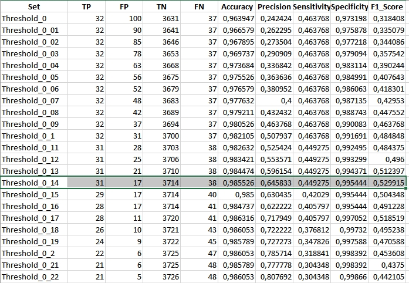
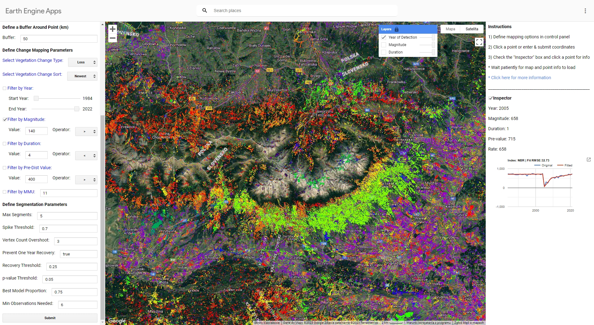

Vegetation change and disturbance detection - Exercise
================

## Exercise - Forest disturbance mapping in Tatras using LandTrendr

In this exercise, you’ll delve into **vegetation disturbance** detection using [LandTrendr algorithm](https://doi.org/10.1016/j.rse.2010.07.008) and its products. Employing the [Google Earth Engine implementation](https://emapr.github.io/LT-GEE/index.html) of this tool, along with the R programming language, you’ll extract valuable data about the vegetation status in the Tatra Mountains from Landsat imagery.

It’s important to understand that vegetation monitoring boasts a wide range of tools and algorithms for its implementation. The method showcased here is just one of many possibilities. Building upon the techniques and insights you gain here, we hope you’ll be equipped to extend your research, adapting to various input data, algorithms, and tools.

## Basic preparation

### Prerequisites

This exercise will consist of two parts. The first part will be conducted in the Google Earth Engine platform using JavaScript based Code Editor. If you are unfamiliar with this tool, we strongly recommend acquainting yourself with introductory tutorials, which are available and linked in [GEE software introduction in this Course](../../software/software_gee.md). Throughout this exercise, we’ll utilize a blend of built-in functions, custom functions and functions from external resources to complete various tasks. We will supply necessary links and explanations in the relevant sections. For general reference documentation see [GEE API reference website](https://developers.google.com/earth-engine/apidocs).

The second part will use R and RStudio. You can access environment setup tutorial for the whole Module 2 here: [R environment setup tutorial](../../software/software_r_language.md). After following the setup guide you should have all the necessary packages installed.

### Data

Download data provided through [Zenodo](https://zenodo.org/records/10003575).

#### Imagery data

The imagery supplied for this exercise consists of Landsat satellite imagery time series. The data preparation process is described in the **[Module 2 Theme 3 exercise Pipeline 2](../03_image_processing/03_image_processing_exercise.md#processing-pipeline-2)**. We’ll use indices time series that you can access through Google Assets.

#### Reference data

For this exercise, 100 reference points have been earmarked to validate the outcomes derived using LandTrendr. These points were randomly spread out across the research area. Each point was assessed based on chips (method of producing chips is presented in **[Theme 2 exercise](../02_temporal_information/02_temporal_information_exercise.md)**). The attribute table from the point layer was extracted and will be used in the second part of the exercise as a validation dataset. In table rows there are consecutive reference points recorded and in columns there are subsequent years from 1985 (the first possible disturbance observation) to 2022. In cases where no disturbance was identified, the corresponding cell was marked with a “0”. Conversely, if a disturbance was evident, the cell was marked with a “1”.

To validate our results, we’ll extract values from LandTrendr’s outputs for each point. Subsequently, we’ll juxtapose this extracted data against the validation table to ensure accuracy and reliability.

<center>



<i>Validation table.</i>
</center>

## Part 1 - LandTrendr in Google Earth Engine

In this part of the exercise we’ll use the Google Earth Engine implementation of the LandTrendr algorithm. You can read about this tool on this website <https://emapr.github.io/LT-GEE/index.html> and in this article:

- Kennedy RE, Yang Z, Gorelick N, Braaten J, Cavalcante L, Cohen WB, Healey S. Implementation of the LandTrendr Algorithm on Google Earth Engine. Remote Sensing. 2018; 10(5):691.<https://doi.org/10.3390/rs10050691>

To start with, let’s load the data. For the purpose of this exercise we’ll use two spectral indices time series images we prepared in **[Module 2 Theme 3 exercise Pipeline 2](../03_image_processing/03_image_processing_exercise.md#processing-pipeline-2)**: **NBR** and **NDMI**. If you exported them to your own Google Earth Engine assets you can change the path in the script below to match your output folder. Otherwise, you can access data stored in `etrainee-module2` project.

``` javascript
// Import image data
var nbr = ee.Image("projects/etrainee-module2/assets/nbr");
var ndmi = ee.Image("projects/etrainee-module2/assets/ndmi");

print(nbr);
```

You should be able to see a multiband NBR image in the console.

<center>



</center>

We’ll also add two vector files: Tatras **Area of Interest** and **forest mask** based on 1984 and 2022 spatial extent of forests.

``` javascript
// Define Area of Interest (AOI)
var AOI = ee.FeatureCollection("projects/etrainee-module2/assets/aoi_tatras");
// Define forest mask
var forestMask = ee.FeatureCollection("projects/etrainee-module2/assets/tatras_forest_mask");
```

For the first part we’ll produce LandTrendr algorithm results using **NBR** index. To proceed we need to prepare the multiband image in accordance with LandTrendr requirements. The input data to the LandTrendr algorithm should be an `ImageCollection`. Each subsequent image should contain one band with that year’s spectral index and be named the same (i.e. `NBR`). Each image should also have time property assigned.

Most spectral indices must also be multiplied by ***-1*** before submitting it to the LandTrendr algorithm. Explanation can be found [here](https://emapr.github.io/LT-GEE/lt-gee-requirements.html#image-collection):

> Two really important steps in image collection building include 1) masking cloud and cloud shadow pixels during annual image compositing and to **2) ensure that the spectral band or index that is to be segmented is oriented so that vegetation loss is represented by a positive delta. For instance, NBR in its native orientation results in a negative delta when vegetation is lost from one observation to the next. In this case, NBR must be multiplied by -1 before being segmented. Conversely, if Landsat TM band 5 (SWIR) is selected for segmentation, inversion of the spectral values is not required, since natively, vegetation loss is represented by a positive delta.**

``` javascript
var image = nbr;
var imageName = 'nbr';


image = image.multiply(-1);

// Extract band names from image
var bands = image.bandNames();
print(bands);

// Make a list of bands from Image
var list = bands.map(function(n) { return image.select([n]) });

// Create ImageCollection from list
var collection = ee.ImageCollection.fromImages(list);

// Define a function to rename each band to the same name and add time property
var renameAndSetTime = function(img) {
  // Get the band names from the image
  var bandNames = img.bandNames();

  // Extract the year from the band name 'bYYYY_NBR'.
  // This will give "YYYY" as a string.
  var yearString = ee.String(bandNames.get(0)).slice(1, 5); 

  // Convert the year string to a number
  var year = ee.Number.parse(yearString);

  // Rename the band to 'NBR'
  // 0 represents the first (and only) band of the image
  var renamedImg = img.select([0]).rename('NBR');  

  // Set the system:time_start property
  var date = ee.Date.fromYMD(year, 7, 1);
  return renamedImg.set('system:time_start', date.millis());
};

// Map the function over your ImageCollection
var processedCollection = collection.map(renameAndSetTime);

print(processedCollection);
```

The resulting collection should look like this in the console.

<center>



</center>

We are now ready for another step, which is running LandTrendr algorithm. In the following code sections we’ll be orchestrating a sequence of operations that will allow us to yield results as exportable imagery. We’ll then move to RStudio, where we’ll assess the results.

Initiating our process, it’s imperative to lay out a list of parameters we aim to evaluate. LandTrendr has several parameters, which can influence the output of the algorithm. For the purpose of this exercise we’ll set arbitrary values for seven of them and we’ll test the results with a range of values for *spikeThreshold* parameter, which is defined as *threshold for dampening the spikes (1.0 means no dampening)*. This, in essence, acts as a filter to control the sensitivity of detecting sudden, short-lived changes in the data series.

``` javascript
// List of  thresholds to test
var spikeThreshold = [0.3, 0.4, 0.5, 0.6, 0.7, 0.8, 0.9, 1];

// List of  thresholds as strings (to be used in exporting part)
var spikeThresholdStr = ["03", "04", "05", "06", "07", "08", "09", "1"];
```

Let’s unpack the upcoming code block step by step to ensure comprehension:

- We’ll iterate in a loop for each element of `spikeThreshold` list
- In each loop we’ll set LandTrendr parameters, updating `spikeThreshold` each time
- We’ll run the LandTrendr algorithm and extract the outputs needed for further steps
- Levereging the structure of LandTrendr outputs we’ll extract vertex images and fitted values images. We’ll end up with two multiband images per iteration.
- We’ll mask the resulting images with forest mask
- Finally, each iteration will yield two export ready multiband images

The number of iterations, and consequently, the exported images depends on the number of values present in the `spikeThreshold` list. This framework allows for a rigorous evaluation of how varying the `spikeThreshold` value impacts the final results.

``` javascript
for (var i=0 ; i<spikeThreshold.length; i++){
  
  // Set LandTrendr parameters
  var runParams = { 
    timeSeries: processedCollection,
    maxSegments:            5,
    spikeThreshold:         spikeThreshold[i],
    vertexCountOvershoot:   3,
    preventOneYearRecovery: true,
    recoveryThreshold:      0.25,
    pvalThreshold:          0.05,
    bestModelProportion:    0.75,
    minObservationsNeeded:  6
  };
  
  // Add processedCollection to parameters
  runParams.timeSeries = processedCollection;
  
  // Run LandTrendr algorithm
  var LTresult = ee.Algorithms.TemporalSegmentation.LandTrendr(runParams);
  
  // Select the results
  var lt = LTresult.select("LandTrendr");

  // Set start and end year
  var startYear = 1984;
  var endYear = 2022;
  
  // Function to extract vertex images
  var isVertex = ee.Image(
    ee.List.sequence(startYear, endYear)
      .iterate(
        function (year, acc) {
          year = ee.Number(year);
          var years = lt.arraySlice(0, 0, 1);
          var isVertex = lt
            .arrayMask(years.eq(year));
          isVertex = isVertex
            .updateMask(isVertex.arrayLength(1)) 
            .arraySlice(0, 3, 4)
            .arrayGet([0, 0])
            .unmask(0)
            .byte()
            .rename(year.format('%d'));
          return ee.Image(acc).addBands(isVertex);
        },
        ee.Image([])
      )
  );
  

  isVertex = isVertex.reproject({crs: 'EPSG:32634', scale: 30});
  isVertex = isVertex.clip(forestMask).unmask(0).short();

  
  Export.image.toDrive({
    image: isVertex, 
    description: imageName+"_ver_"+spikeThresholdStr[i], 
    region: AOI, 
    folder: 'theme5_landtrendr',
    scale: 30, 
    crs: 'EPSG:32634', 
    maxPixels: 1e13
  });
  
  
  // Function to extract fitted values images
  var fittedValues = ee.Image(
    ee.List.sequence(startYear, endYear)
      .iterate(
        function (year, acc) {
          year = ee.Number(year);
          var years = lt.arraySlice(0, 0, 1);
          var isVertex = lt
            .arrayMask(years.eq(year));
          isVertex = isVertex
            .updateMask(isVertex.arrayLength(1)) // Mask if no matching year
            .arraySlice(0, 2, 3)
            .arrayGet([0, 0])
            .unmask(0) // Assum no vertex when no data for year
            .rename(year.format('%d'));
          return ee.Image(acc).addBands(isVertex);
        },
        ee.Image([])
      )
  );
  
  fittedValues = fittedValues.reproject({crs: 'EPSG:32634', scale: 30});
  fittedValues = fittedValues.clip(forestMask).unmask(0).float();
  
  
  Export.image.toDrive({
    image: fittedValues, 
    description: imageName+"_fv_"+spikeThresholdStr[i], 
    region: AOI, 
    folder: 'theme5_landtrendr',
    scale: 30, 
    crs: 'EPSG:32634', 
    maxPixels: 1e13
  });
  

}
```

After successfully running this part of the script you should be able to see 16 images waiting to be exported.

<center>



</center>

Export each image to your Google Drive. You can change the folder to which the results will be exported. From your Google Drive folder download the images to your local hard drive.

**After you queued images for download you can repeat the steps above to prepare LandTrendr outputs usng NDMI as input. For the next part of the exercise we’ll want to have additional 16 NDMI products exported to local hard drive.**

**Change these lines and rerun the whole script to proceed with NDMI part:**

``` javascript
var image = ndmi;
var imageName = 'ndmi';

 ...

  // Rename the band to 'NDMI'
  var renamedImg = img.select([0]).rename('NDMI'); 
```

## Part 2 - Processing LandTrendr results in RStudio

After successfully downloading all the necessary results move them to `theme_5_exercise/data_exercise` folder. We supplied them in our Zenodo data package just in case something went wrong during part 1. You can replace them if you managed to successfully complete part 1.

Create a new script inside `theme_5_exercise` folder. You can name it `theme_5_exercise.R`. Start with loading required packages.

``` r
# raster I/o
library(terra) 

# vector I/0
library(sf) 

# reading .xlsx files
library(readxl) 

# writing.xlsx files
library(writexl) 

# tabular data manipulation
library(dplyr) 
```

Next let’s read input data for this exercise. We’ll start with NBR rasters.

``` r
# List vertices raster paths
verts_rasters <- list.files(path="theme_5_exercise/data_exercise", 
                            pattern='nbr_ver', 
                            full.names = TRUE)
# List fitted values raster paths
fv_rasters <- list.files(path="theme_5_exercise/data_exercise", 
                         pattern='nbr_fv', 
                         full.names = TRUE)

# Get names of rasters 
verts_names <- list.files(path="theme_5_exercise/data_exercise", 
                          pattern='nbr_ver')
fv_names <- list.files(path="theme_5_exercise/data_exercise", 
                       pattern='nbr_ver')

# Read vertices and fitted values rasters to lists
verts_rasters_list <- lapply(verts_rasters, rast)
fv_rasters_list <- lapply(fv_rasters, rast)

# Rename lists elements
names(verts_rasters_list) <- verts_names
names(fv_rasters_list) <- fv_names
```

Now read validation points dataset.

``` r
# Read validation points
val_points <- st_read("theme_5_exercise/data_exercise/T5_points.shp")
```

The outputs you’ve gotten from LandTrendr consist of raw **vertices** and their corresponding **fitted values**. Vertices in LandTrendr represent breakpoints in the time series of a given pixel, indicating significant changes in its trajectory, while fitted values are smoother curves representing predicted values based on the observed data. We are interested in only those breakpoints (vertices) which point towards a decrease or disturbance in vegetation. To isolate these, it’s imperative to measure the **magnitude of change** between each segment’s start and end points. This magnitude is essentially the difference (delta) between the end vertex’s fitted value and the start vertex’s fitted value for a given segment. For indices such as NBR and NDMI (multiplied by -1 before submitting them to LandTrendr), a significant positive delta is a strong indicator of vegetation disturbance or stress. Through a loop mechanism, for every pair of vertex-fitted values images we’ve exported, the code calculates the magnitudes of change. The results will be structured as matrices, with each cell indicating the magnitude of vegetation change at the start vertex’s position.

``` r
# Empty list for storing the results
magnitudes_list <- list()

# For each par of vertices-fitted values images
for (r in seq(1:length(verts_rasters_list))) {
  
  # Read appropriate rasters
  vertices <- verts_rasters_list[[r]]
  fitted_values <- fv_rasters_list[[r]]
  
  # Extract values for 100 validation points
  vert_pts <- extract(vertices, val_points) %>%
    select(2:40)
  vals_pts <- extract(fitted_values, val_points) %>%
    select(2:40)
  
  # Prepare empty output matrix
  output <- matrix(data = NA, nrow = 100, ncol = 39)
  
  # For each row(point)
  for (row in 1:nrow(vert_pts)) {
    
    # Get only pixel values for that row(point)
    vertices_pixel <- vert_pts[row, ]
    fitted_values_pixel <- vals_pts[row, ]
    
    # Check for the occurence of vertices
    vertex_indices <- which(vertices_pixel == 1)
    
    # Prepare empty vector for magnitude calculation results
    magnitude_of_change <- rep(NA, length(vertices_pixel))
    
    # Calculate magnitudes
    for (i in 1:(length(vertex_indices) - 1)) {
      
      start_index <- vertex_indices[i]
      end_index <- vertex_indices[i + 1]
      
      difference <- fitted_values_pixel[1, end_index] - fitted_values_pixel[1, start_index]
      magnitude_of_change[end_index] <- difference
    }
    
    # Insert magnitude values to the matching row in empty output matrix
    output[row,] <- magnitude_of_change
    # Insert temporary 0 value to the first column
    output[row, 1] <- 0
    
    # Check the occurrences of magnitude 
    mag_indices <- which(!is.na(output[row, ]))
    
    # Prepare empty vector for the moved values
    moved_row <- rep(NA, 39)
    
    # Move magnitude values one vertex position backwards
    for (i in 2:length(mag_indices)) {
      
      val <- output[row, mag_indices[i]]
      moved_row[mag_indices[i-1]] <- val
      
    }
    
    # Replace the row in output with a moved row
    output[row,] <- moved_row
    
    
  }
  
  # Copy output values
  output_mask_loss <- output
  
  # Retain only positive magnitudes indicating vegetation loss
  output_mask_loss[output_mask_loss < 0] <- NA
  
  # Add the magnitude matrix to list storing the results
  magnitudes_list[[r]] <- output_mask_loss
  
}
```

Run `View(magnitude_list[[1]])` in the console so you can visually inspect an example matrix from the list of matrices derived from the LandTrendr results. Each matrix contains the magnitudes of vegetation loss/disturbance across the validation points.

<center>



</center>

So far we’ve acquired a matrix with magnitudes of loss/disturbance events for each of the eight NBR LandTrendr results we downloaded. We now want to test the impact of different magnitude thresholds on the final accuracy of the algorithm. You’ll be testing 80 thresholds, ranging from 0 (no change) to 0.8 (significant change). For each threshold value, you’ll mask (or filter out) all vertices with magnitude below the given threshold. The reason for masking these vertices is to exclude potential “false positives” from the analysis. After applying the threshold, the filtered result is then compared to a validation table. This table contains manually verified data against which the LandTrendr results are compared to determine accuracy. In order to construct a table corresponding to the validation one we will need to shift vertices one year forwards. This is necessary, because the year of detection of disturbance event is the first year after end vertex of segment with positive delta.

To streamline this process, it’s recommended to prepare a vector containing all the threshold values to test. Furthermore, a function can be created to systematically apply each threshold to the matrices, mask out irrelevant vertices, and then compare the results against the validation table.

``` r
# Magnitude thresholds
thresholds <- seq(0, 0.8, by = 0.01)

# Function to apply magnitude threshold
apply_magnitude_threshold <- function(mag_mat, threshold) {
  
  output_mask_loss_th <- mag_mat
  
  # mask vertices below threshold
  output_mask_loss_th[output_mask_loss_th < threshold] <- NA
  
  # no change  - NAs to 0
  output_mask_loss_th[is.na(output_mask_loss_th)] <- 0
  
  # change/vertex - above 0 to 1
  output_mask_loss_th[output_mask_loss_th > 0] <- 1
  
  # Shift vertices so that they represent year of detection
  output_mask_loss_shift <- output_mask_loss_th[, 1:38]
  colnames(output_mask_loss_shift) <- c(1985:2022)
  
  return(output_mask_loss_shift)
  
}
```

Prepare a list of names to be able to differentiate results of each test.

``` r
# Prepare list of threshold scenario names
# replace "." with "_"
names_list <- paste0("Threshold_", 
                     gsub("\\.", "_", abs(thresholds))) 
```

We want to calculate statistics for each iteration. The function below calculates several basic statistics derived from confusion matrix.

``` r
# Prepare a function to calculate statistics
calculate_confusion_matrix_stats <- function(matrix, validation_matrix, set_name) {
  
  # Calculate TP, FP, TN, FN
  TP <- sum(matrix == 1 & validation_matrix == 1)
  FP <- sum(matrix == 1 & validation_matrix == 0)
  TN <- sum(matrix == 0 & validation_matrix == 0)
  FN <- sum(matrix == 0 & validation_matrix == 1)
  
  # Calculate the metrics
  Accuracy <- (TP + TN) / (TP + FP + FN + TN)
  Precision <- TP / (TP + FP)
  Sensitivity <- TP / (TP + FN)
  Specificity <- TN / (TN + FP)
  F1_Score <- 2 * (Sensitivity * Precision) / (Sensitivity  + Precision)
  
  # Create a data frame with the confusion matrix stats
  stats <- data.frame(Set = set_name, TP, FP, TN, FN, Accuracy, Precision, 
                      Sensitivity, Specificity, F1_Score)
  
  return(stats)
}
```

We are now ready to read validation table and prepare the results. We’ll save each result to a separate `.xlsx` file.

``` r
# Read validation table
val_table <- read_xlsx("theme_5_exercise/data_exercise/T5_validation_table.xlsx") %>%
  select(2:39)

# Prepare  a storage for results
results_list <- list()

# For each matrix in magnitudes_list
for (l in seq(1, length(magnitudes_list))) {
  
  # Calculate matrices with each threshold applied
  thresholds_results <- lapply(thresholds, apply_magnitude_threshold, 
                               mag_mat = magnitudes_list[[l]])
  thresholds_results <- setNames(thresholds_results, names_list)
  
  # Calculate accuracy statistics
  stats_list <- lapply(seq_along(thresholds_results), 
                function(i) calculate_confusion_matrix_stats(thresholds_results[[i]],
                            val_table, names(thresholds_results)[i]))
  
  # construct one data frame with accuracy statistics
  stats_df <- do.call(rbind, stats_list)
  
  # add the constructed data frame to the list of results
  results_list[[l]] <- stats_df
  
  # save the data frame with results to .xlsx file
  write_xlsx(stats_df, paste0("theme_5_exercise/results/", 
                               verts_names[l], 
                               ".xlsx"))
  
}
```

Inspect the results.

<center>



</center>

In the showcased results, we observe data specific to a scenario where the `spikeThreshold` was set to **0.7**. Notably, the maximum **F1** statistic achieved was **0.5** for a magnitude threshold of **0.14**. Analyzing this further, the LandTrendr algorithm aligned with our validation dataset on **30** occasions, denoting True Positives. However, it also flagged **21** vertices not found in our validation data, indicating False Positives. Additionally, the algorithm missed detecting **39** disturbance events that were indeed present in our validation dataset, resulting in False Negatives. To get a comprehensive understanding, it’s crucial to juxtapose these findings with outcomes from other `spikeThreshold` and magnitude change threshold combinations.

Once you’ve made your comparisons and drawn your conclusions, you can delve into the subsequent task: applying the aforementioned methodologies to NDMI.

------------------------------------------------------------------------

*TASK: Compare the results of LandTrendr results thresholding for NBR and NDMI indices. Repeat the steps shown above for NDMI. Start with replacing the input data rasters. Then follow the rest of the workflow to produce a set of accuracy tables*

``` r
# List vertices raster paths
verts_rasters <- list.files(path="theme_5_exercise/data_exercise", 
                            pattern='ndmi_ver', 
                            full.names = TRUE)
# List fitted values raster paths
fv_rasters <- list.files(path="theme_5_exercise/data_exercise", 
                         pattern='ndmi_fv', 
                         full.names = TRUE)

# Get names of rasters 
verts_names <- list.files(path="theme_5_exercise/data_exercise", 
                          pattern='ndmi_ver')
fv_names <- list.files(path="theme_5_exercise/data_exercise", 
                       pattern='ndmi_ver')
```

------------------------------------------------------------------------

The comparable result (`spikeThreshold` equal to **0.7**) for NDMI should look like this:

<center>



</center>

Inspect other results and compare them to NBR achieved statistics.

## Optional additional tasks

### Multiple parameter testing

As mentioned before you can test multiple LandTrendr parameter values to compare the results. This code below shows an example on how to implement more loops in the beggining of the Google Earth Engine code.

``` javascript

var maxSegments=[6, 7, 8];
var spikeThreshold=[0.75, 0.8, 0.85];
var vertexCountOvershoot=[3, 4, 5];
var recoveryThreshold=[0.75, 0.8];
var pValueTreshold=[0.05, 0.1];
var bestModelProportion=[0.75, 0.8];
var minObservationsNeeded=[6];

for(var x = 0 ; x<maxSegments.length; x++){
    for (var y = 0 ;y<spikeThreshold.length; y++){
        for (var z = 0;z<vertexCountOvershoot.length; z++){
            for (var a = 0 ;a<recoveryThreshold.length;a++){
                for (var b = 0; b<pValueTreshold.length;b++){
                    for (var c = 0; c<bestModelProportion.length;c++){
                        for (var d = 0; d<minObservationsNeeded.length;d++){
                        
                          var runParams = {
                            timeSeries: processedCollection,
                            maxSegments:            maxSegments[x],
                            spikeThreshold:         spikeThreshold[y],
                            vertexCountOvershoot:   vertexCountOvershoot[z],
                            preventOneYearRecovery: true,
                            recoveryThreshold:      recoveryThreshold[a],
                            pvalThreshold:          pValueTreshold[b],
                            bestModelProportion:    bestModelProportion[c],
                            minObservationsNeeded:  minObservationsNeeded[d],
                          };
                          
                          // ...
                          // ... the rest of the code
                          // ...
                        
```

### LandTrendr UI web application

You can check how the application and algorithm works using [UI LandTrendr Change Mapper](https://emapr.github.io/LT-GEE/ui-applications.html#ui-landtrendr-change-mapper) (direct link to the GEEapp here: <https://emaprlab.users.earthengine.app/view/lt-gee-change-mapper>).

Play around with different settings and parameters. This app uses LandTrendr based method of preparing multitemporal input datasets (medoid compositing). Indices values are also multiplied by 1000, so equivalent of magnitude filter 0.14 in our case would be 140 in the GEE app.

This is the result you should see when running the app in Tatra Mountains using parameters we used in our exercise. The map presents the newest disturbance vertex with magnitude of over 140.

<center>



</center>

## Data and software credits

### Data

Landsat 4, 5, 7, 8 and 9 imagery courtesy of [the U.S. Geological Survey](https://www.usgs.gov/)/ [Terms of use](https://www.usgs.gov/information-policies-and-instructions/copyrights-and-credits) processed in and downloaded from [Google Earth Engine by Gorelick et al., 2017](https://doi.org/10.1016/j.rse.2017.06.031)

### Software

- QGIS Development Team (2022). *QGIS Geographic Information System. Open Source Geospatial Foundation Project*. <http://qgis.osgeo.org>
- R Core Team (2023). *R: A language and environment for statistical computing*. R Foundation for Statistical Computing, Vienna, Austria. <https://www.R-project.org/>.
- Hijmans R (2023). *terra: Spatial Data Analysis*. R package version 1.7-39, <https://CRAN.R-project.org/package=terra>
- Kennedy, R.E., Yang, Z., Gorelick, N., Braaten, J., Cavalcante, L., Cohen, W.B., Healey, S. (2018). Implementation of the LandTrendr Algorithm on Google Earth Engine. Remote Sensing. 10, 691.<https://doi.org/10.3390/rs10050691>
- Ooms J (2023). *writexl: Export Data Frames to Excel ‘xlsx’ Format*. R package version 1.4.2, <https://CRAN.R-project.org/package=writexl>.
- Pebesma, E., & Bivand, R. (2023). *Spatial Data Science: With Applications in R*. Chapman and Hall/CRC. <https://doi.org/10.1201/9780429459016>
- Pebesma, E., 2018. *Simple Features for R: Standardized Support for Spatial Vector Data*. The R Journal 10 (1), 439-446, <https://doi.org/10.32614/RJ-2018-009>
- Wickham H, François R, Henry L, Müller K, Vaughan D (2023). *dplyr: A Grammar of Data Manipulation*. R package version 1.1.2, <https://CRAN.R-project.org/package=dplyr>
- Wickham H, Bryan J (2023). *readxl: Read Excel Files*. <https://readxl.tidyverse.org>, <https://github.com/tidyverse/readxl>.

## Source code

<details>
<summary>
You can find the entire code used in this exercise here
</summary>

**[Google Earth Engine code](https://code.earthengine.google.com/c26bdc73c893b317e24f2158e66602a2?noload=true)**

**R code**

``` r

library(terra) # raster I/o
library(sf) # vector I/0
library(readxl) # reading .xlsx files
library(writexl) # writing.xlsx files
library(dplyr) # tabular data manipulation


# List vertices raster paths
verts_rasters <- list.files(path="theme_5_exercise/data_exercise", pattern='nbr_ver', full.names = TRUE)
# List fitted values raster paths
fv_rasters <- list.files(path="theme_5_exercise/data_exercise", pattern='nbr_fv', full.names = TRUE)

# Get names of rasters 
verts_names <- list.files(path="theme_5_exercise/data_exercise", pattern='nbr_ver')
fv_names <- list.files(path="theme_5_exercise/data_exercise", pattern='nbr_ver')

# Read vertices and fitted values rasters to lists
verts_rasters_list <- lapply(verts_rasters, rast)
fv_rasters_list <- lapply(fv_rasters, rast)

# Rename lists elements
names(verts_rasters_list) <- verts_names
names(fv_rasters_list) <- fv_names


# Read validation points
val_points <- st_read("theme_5_exercise/data_exercise/T5_points.shp")

# Empty list for storing the results
magnitudes_list <- list()

# Empty list for storing the results
magnitudes_list <- list()

# For each par of vertices-fitted values images
for (r in seq(1:length(verts_rasters_list))) {
  
  # Read appropriate rasters
  vertices <- verts_rasters_list[[r]]
  fitted_values <- fv_rasters_list[[r]]
  
  
  # Extract values for 100 validation points
  vert_pts <- extract(vertices, val_points) %>%
    select(2:40)
  vals_pts <- extract(fitted_values, val_points) %>%
    select(2:40)
  
  
  # Prepare empty output matrix
  output <- matrix(data = NA, nrow = 100, ncol = 39)
  
  # For each row(point)
  for (row in 1:nrow(vert_pts)) {
    
    # Get only pixel values for that row(point)
    vertices_pixel <- vert_pts[row, ]
    fitted_values_pixel <- vals_pts[row, ]
    
    # Check for the occurence of vertices
    vertex_indices <- which(vertices_pixel == 1)
    
    # Prepare empty vector for magnitude calculation results
    magnitude_of_change <- rep(NA, length(vertices_pixel))
    
    # Calculate magnitudes
    for (i in 1:(length(vertex_indices) - 1)) {
      
      start_index <- vertex_indices[i]
      end_index <- vertex_indices[i + 1]
      
      difference <- fitted_values_pixel[1, end_index] - fitted_values_pixel[1, start_index]
      magnitude_of_change[end_index] <- difference
    }
    
    # Insert magnitude values to the matching row in empty output matrix
    output[row,] <- magnitude_of_change
    # Insert temporary 0 value to the first column
    output[row, 1] <- 0
    
    
    # Check the occurrences of magnitude 
    mag_indices <- which(!is.na(output[row, ]))
    
    # Prepare empty vector for the moved values
    moved_row <- rep(NA, 39)
    
    # Move magnitude values one vertex position backwards
    for (i in 2:length(mag_indices)) {
      
      val <- output[row, mag_indices[i]]
      moved_row[mag_indices[i-1]] <- val
      
    }
    
    # Replace the row in output with a moved row
    output[row,] <- moved_row
    
    
  }
  
  # Copy output values
  output_mask_loss <- output
  
  # Retain only positive magnitudes indicating vegetation loss
  output_mask_loss[output_mask_loss < 0] <- NA
  
  # Add the magnitude matrix to list storing the results
  magnitudes_list[[r]] <- output_mask_loss
  
}


# Magnitude thresholds
thresholds <- seq(0, 0.8, by = 0.01)


# Function to apply magnitude threshold
apply_magnitude_threshold <- function(mag_mat, threshold) {
  
  output_mask_loss_th <- mag_mat
  
  # mask vertices below threshold
  output_mask_loss_th[output_mask_loss_th < threshold] <- NA
  
  # no change  - NAs to 0
  output_mask_loss_th[is.na(output_mask_loss_th)] <- 0
  
  # change/vertex - above 0 to 1
  output_mask_loss_th[output_mask_loss_th > 0] <- 1
  
  # Shift vertices so that they represent year of detection
  output_mask_loss_shift <- output_mask_loss_th[, 1:38]
  colnames(output_mask_loss_shift) <- c(1985:2022)
  
  return(output_mask_loss_shift)
  
}

# Prepare list of threshold scenario names
names_list <- paste0("Threshold_", gsub("\\.", "_", abs(thresholds))) # replace "." with "_"

# Prepare a function to calculate statistics
calculate_confusion_matrix_stats <- function(matrix, validation_matrix, set_name) {
  
  # Calculate TP, FP, TN, FN
  TP <- sum(matrix == 1 & validation_matrix == 1)
  FP <- sum(matrix == 1 & validation_matrix == 0)
  TN <- sum(matrix == 0 & validation_matrix == 0)
  FN <- sum(matrix == 0 & validation_matrix == 1)
  
  # Calculate the metrics
  Accuracy <- (TP + TN) / (TP + FP + FN + TN)
  Precision <- TP / (TP + FP)
  Sensitivity <- TP / (TP + FN)
  Specificity <- TN / (TN + FP)
  F1_Score <- 2 * (Sensitivity * Precision) / (Sensitivity  + Precision)
  
  # Create a data frame with the confusion matrix stats
  stats <- data.frame(Set = set_name, TP, FP, TN, FN, Accuracy, Precision, Sensitivity, Specificity, F1_Score)
  
  return(stats)
}

# Read validation table
val_table <- read_xlsx("theme_5_exercise/data_exercise/T5_validation_table.xlsx") %>%
  select(2:39)

# Prepare  a storage for results
results_list <- list()

# For each matrix in magnitudes_list
for (l in seq(1, length(magnitudes_list))) {
  
  # Calculate matrices with each threshold applied
  thresholds_results <- lapply(thresholds, apply_magnitude_threshold, mag_mat = magnitudes_list[[l]])
  thresholds_results <- setNames(thresholds_results, names_list)
  
  # Calculate
  stats_list <- lapply(seq_along(thresholds_results), function(i) calculate_confusion_matrix_stats(thresholds_results[[i]], val_table, names(thresholds_results)[i]))
  
  # one table with confusion results
  stats_df <- do.call(rbind, stats_list)
  
  results_list[[l]] <- stats_df
  
  write_xlsx(stats_df, paste0("theme_5_exercise/results/", verts_names[l], ".xlsx"))
  
}


### NDMI

# List vertices raster paths
verts_rasters <- list.files(path="theme_5_exercise/data_exercise", pattern='ndmi_ver', full.names = TRUE)
# List fitted values raster paths
fv_rasters <- list.files(path="theme_5_exercise/data_exercise", pattern='ndmi_fv', full.names = TRUE)

# Get names of rasters 
verts_names <- list.files(path="theme_5_exercise/data_exercise", pattern='ndmi_ver')
fv_names <- list.files(path="theme_5_exercise/data_exercise", pattern='ndmi_ver')


# Read vertices and fitted values rasters to lists
verts_rasters_list <- lapply(verts_rasters, rast)
fv_rasters_list <- lapply(fv_rasters, rast)

# Rename lists elements
names(verts_rasters_list) <- verts_names
names(fv_rasters_list) <- fv_names


# Empty list for storing the results
magnitudes_list <- list()

# For each par of vertices-fitted values images
for (r in seq(1:length(verts_rasters_list))) {
  
  # Read appropriate rasters
  vertices <- verts_rasters_list[[r]]
  fitted_values <- fv_rasters_list[[r]]
  
  
  # Extract values for 100 validation points
  vert_pts <- extract(vertices, val_points) %>%
    select(2:40)
  vals_pts <- extract(fitted_values, val_points) %>%
    select(2:40)
  
  
  # Prepare empty output matrix
  output <- matrix(data = NA, nrow = 100, ncol = 39)
  
  # For each row(point)
  for (row in 1:nrow(vert_pts)) {
    
    # Get only pixel values for that row(point)
    vertices_pixel <- vert_pts[row, ]
    fitted_values_pixel <- vals_pts[row, ]
    
    # Check for the occurence of vertices
    vertex_indices <- which(vertices_pixel == 1)
    
    # Prepare empty vector for magnitude calculation results
    magnitude_of_change <- rep(NA, length(vertices_pixel))
    
    # Calculate magnitudes
    for (i in 1:(length(vertex_indices) - 1)) {
      
      start_index <- vertex_indices[i]
      end_index <- vertex_indices[i + 1]
      
      difference <- fitted_values_pixel[1, end_index] - fitted_values_pixel[1, start_index]
      magnitude_of_change[end_index] <- difference
    }
    
    # Insert magnitude values to the matching row in empty output matrix
    output[row,] <- magnitude_of_change
    # Insert temporary 0 value to the first column
    output[row, 1] <- 0
    
    
    # Check the occurrences of magnitude 
    mag_indices <- which(!is.na(output[row, ]))
    
    # Prepare empty vector for the moved values
    moved_row <- rep(NA, 39)
    
    # Move magnitude values one vertex position backwards
    for (i in 2:length(mag_indices)) {
      
      val <- output[row, mag_indices[i]]
      moved_row[mag_indices[i-1]] <- val
      
    }
    
    # Replace the row in output with a moved row
    output[row,] <- moved_row
    
    
  }
  
  # Copy output values
  output_mask_loss <- output
  
  # Retain only positive magnitudes indicating vegetation loss
  output_mask_loss[output_mask_loss < 0] <- NA
  
  # Add the magnitude matrix to list storing the results
  magnitudes_list[[r]] <- output_mask_loss
  
}


# Prepare  a storage for results
results_list <- list()

# For each matrix in magnitudes_list
for (l in seq(1, length(magnitudes_list))) {
  
  # Calculate matrices with each threshold applied
  thresholds_results <- lapply(thresholds, apply_magnitude_threshold, mag_mat = magnitudes_list[[l]])
  thresholds_results <- setNames(thresholds_results, names_list)
  
  # Calculate
  stats_list <- lapply(seq_along(thresholds_results), function(i) calculate_confusion_matrix_stats(thresholds_results[[i]], val_table, names(thresholds_results)[i]))
  
  # one table with confusion results
  stats_df <- do.call(rbind, stats_list)
  
  results_list[[l]] <- stats_df
  
  write_xlsx(stats_df, paste0("theme_5_exercise/results/", verts_names[l], ".xlsx"))
  
}
```

</details>
