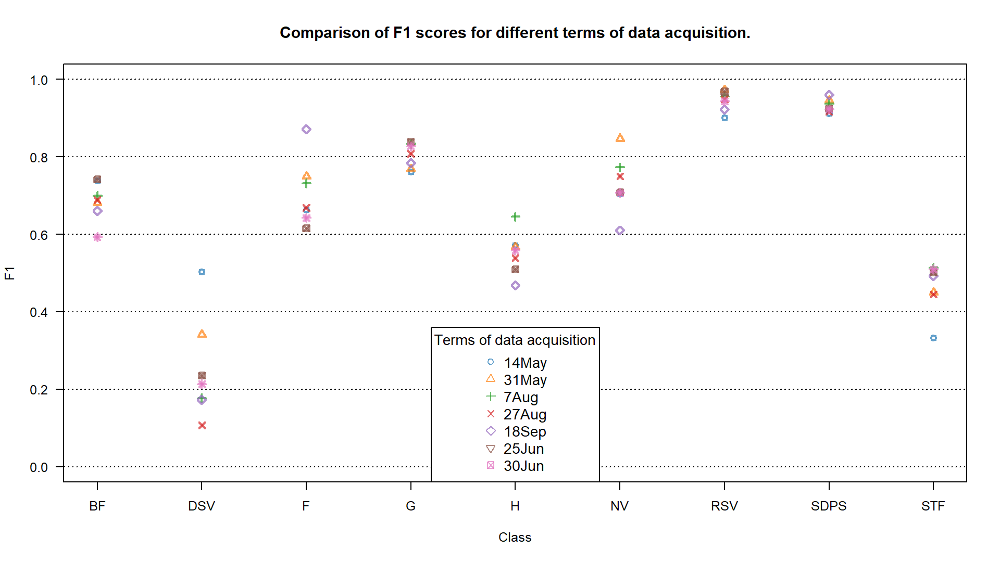
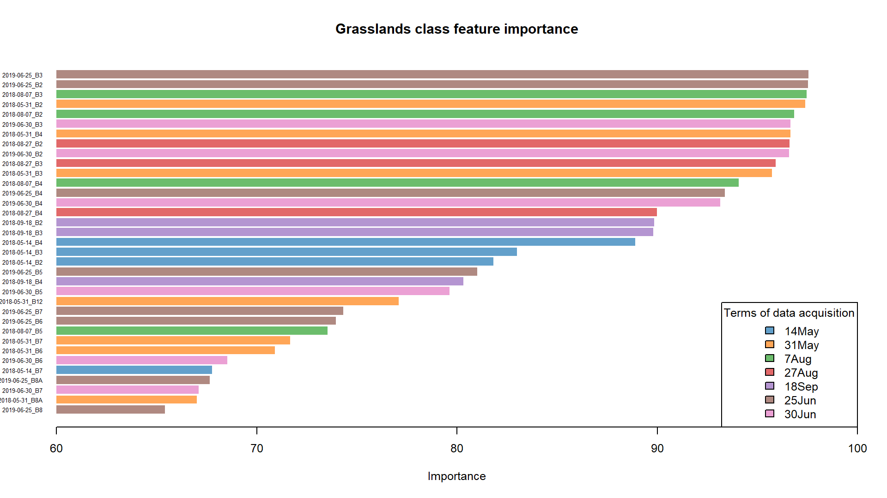

Case study: Monitoring tundra grasslands (Karkonosze/Krkonoše)
================

In this case study we will focus on classifying non-forest tundra vegetation in higher parts of Karkonosze/Krkonoše Mountains, laying on the Polish-Czech border. The process will consist of extracting reference data based on field inventory from multitemporal Sentinel-2 imagery and classifying it with the Support Vector Machine algorithm. Additional analysis will consist of feature importance assessment performed for grasslands class as the main object of this case study.

## Study area and data

Before you continue, get familiar with the use case: **[Land cover monitoring in Karkonosze/Krkonoše Mountains (Poland/Czechia)](../../data_usecases/usecase_tundra_karkonosze.md)**.

… and read the paper accompanying the use case and case study:

Wakulińska, M., & Marcinkowska-Ochtyra, A. (2020). Multi-temporal sentinel-2 data in classification of mountain vegetation. Remote Sensing, 12(17), 2696.https://doi.org/10.3390/rs12172696

In the case study Sentinel‐2 satellite images with no/minimal cloud coverage from 4 terms of 2018 will be used. The dates were chosen to take into account the variability of alpine and subalpine grasslands during one growing season. The limitation was the high occurrence of clouds during the chosen period. The data with 2A processing level were selected.

The reference data came mainly from the field, as these are not simple land cover classes but more complex ones, botanical information was required. The designated classes included: grasslands (**G**; of special importance), deciduous shrubs vegetation (**DSV**), bogs and fens (**BF**), subalpine tall-forbs (**STF**), rocks and scree vegetation (**RSV**), heathlands (**H**), subalpine dwarf pine scrubs (**SDPS**) and forests (**F**).

## Getting started

### Environment preparation: loading required libraries and data

To start with, we want to load necessary libraries and data and set up some initial variables, which we will use further down the line.

Firstly, load required libraries into the environment: rgdal, raster, caret, and kernlab. Functions included in these packages will be used further in this case study.

``` r
library(rgdal) # spatial data processing
library(raster) # raster processing
library(caret) # model tuning and training
library(kernlab) # applying model
library(ggsci) # visualization colour palettes
```

Now we can start with loading up the required data. We shall start with the raster data. The imagery used in this case study are Sentinel-2 images collected in 2018 within the growing season (exact dates are 31 May, 7 August, 27 August and 18 September; June and July images were unfortunately covered by clouds). In case of raster data there are two ways you can approach this case study: use the attached preprocessed data or go to ***–THIS TUTORIAL–*** to download raw data and preprocess it to the desired state yourself. In any case load the data to the variable *image_data*.

Note: we have already combined the set of all four scenes into one to select data from it for each of the 3 scenarios (the order of the bands of the multitemporal set is ranked from May to September). Of course, when you classify individual scenes, you do not have to do it, but you can classify separate, pre-prepared images.

``` r
image_data <- brick("CS1_image_data.bsq") # load .bsq image of stacked 40 bands (10 bands per 4 acquisition dates)
```

#### TO BE COMPLETED (to be decided: description of data preprocessing steps: masking clouds, shadows and water here, or in the tutorial)

Now add the vector reference data to our workspace. It consists of field collected polygons with appropriate classes (including grasslands, which are the most interesting from this case study point of view) assigned, which will be used to classify multitemporal Sentinel-2 images from 2018. Load .shp file to the *reference_data* variable.

``` r
reference_data <- readOGR("CS1_reference_data.shp", "CS1_reference_data") # load reference .shp dataset containing reference polygons with class names and acronyms
```

### Reference values extraction

The two main required data sources are now loaded into the workspace, so we can proceed with preparing data for classification. First of all, we need to extract pixel values from loaded images of areas covered by the reference data. In order to do that we will use our own function, which will assign each pixel in each polygon values from spectral bands of Sentinel-2 imagery.

``` r
extract_pixel_values <- function(image, vector_reference, class_field_name){
  
  counter <- 1 # number of polygon used to extract
  print("Number of polygons done:") # information about progress printed in the console
  
  number_of_polygons <- nrow(vector_reference@data) # number of polygons in the reference dataset
  extracted_values <- data.frame() # empty data frame to store the results of extraction
  
  class_column_index <- which(names(vector_reference@data) == class_field_name) # which columns stores the class names
  
  for (polygon_index in seq(number_of_polygons)) { # loop to go over the entire reference dataset
    selected_polygon <- vector_reference@polygons[polygon_index] 
    class_name <- vector_reference@data[polygon_index, class_column_index]
    selected_polygon_sp <- SpatialPolygons(selected_polygon) # transform selected polygon to SpatialPolygon class
    polygon_pixel_values <- extract(image, selected_polygon_sp, df = TRUE) # extract pixel values from selected polygon
    polygon_pixel_values <- cbind(polygon_pixel_values[ ,2: ncol(polygon_pixel_values)], class_name, polygon_index) # add class name and polygon index to extracted values
    extracted_values <- rbind(extracted_values, polygon_pixel_values) # add the extracted values with additional information to the results data frame
    
    print(paste0(counter, "/", number_of_polygons)) # information about progress printed in the console
    counter <- counter + 1 # go to the next polygon
  }
  return(extracted_values) # function results - data frame with extracted values
}
```

Now we shall use the above function to extract the values with the data from the reference dataset we loaded earlier.

``` r
pixel_reference <- extract_pixel_values(image_data, reference_data, "class") # use the above function to extract pixel values from the reference dataset, set class_field_name as "class" (the name of the field containing desired information in the .shp loaded to reference_data variable)
```

We need to fix the column names in order to use them later.

``` r
fixed_names <- unlist(strsplit(names(pixel_reference)[1:40], "\\..")) 
names(pixel_reference)[1:40] <- fixed_names[seq(1, length(fixed_names), by = 4)] # rename pixel_reference, field names to band numbers and dates of acquisition

# --- OPTIONAL STEP ---
saveRDS(pixel_reference, file = "pixel_reference.RDS") # save pixel reference
# in case you want to load it use base R function readRDS to load the data into *pixel reference* variable
```

We now have all the data we need to proceed. We will start with classifying single scenes, then multitemporal classification and end with best features selected. Each classification will be performed using the Support Vector Machine algorithm and radial as the kernel function, which was preceded by tuning its parameters (see below). The scheme of the procedure in the entire case study is presented in the figure below.

<center>


<i>Case study 1 scheme of procedure.</i>
</center>

### Classification scenario 1: single scene

We will start the single scene classification process with extracting only Sentinel-2 bands values from the single scene. In case of the earliest acquired image (31 May) these will be the first 10 columns of the *pixel_reference* data frame, as well two last columns including class names and polygon indices.

``` r
pixel_reference_31May <- pixel_reference[c(1:10, 41, 42)] # select first ten columns with pixel values from image A plus class names and indices
```

In order to make our work reproducible we shall set a common seed number.

``` r
set.seed(1410)
```

We can now assess how many **pixel samples** for every class we acquired during values extraction.

``` r
table(pixel_reference_31May$class_name) # show in the console the amount of pixel samples for every class
```

In comparison we can see how many **polygons** for each class.

``` r
table(reference_data@data$class) # show in the console the amount of polygons for every class
```

In this part we will divide our reference dataset into training and validation parts. We will divide the whole set into 2 parts of equal number of polygons in each of 2 parts. Notice that the number of pixels may be different in both sets due to differences in polygon sizes.

``` r
train_index <- createDataPartition(reference_data@data$class, p = 0.5, list = FALSE) # randomly pick half of observations based on class field
training_data <- pixel_reference_31May[pixel_reference_31May$polygon_index %in% train_index, ] # select training pixel observations using polygon indexes
validation_data <- pixel_reference_31May[!(pixel_reference_31May$polygon_index %in% train_index), ] # select validation pixel observations using polygon indexes

table(training_data$class_name) # show in the console the amount of pixel samples in training data
table(validation_data$class_name) # show in the console the amount of pixel samples in validation data
```

Now that we established the training and validation datasets we can perform a step called tuning classification parameters. For determining best parameters we will use tenfold cross validation of results achieved with different sets of predetermined parameters.

``` r
control <- trainControl(method = "cv", number = 10) # set 10-fold cross validation to find the best model

tune_parameters <- data.frame(C = c(10, 100, 100), sigma = c(0.1, 0.5, 0.95)) # test these parameters to find the best combination

model <- train(training_data[, 1:10], training_data$class_name, method = "svmRadial", trControl = control, tuneGrid = tune_parameters) # train the model using SVM with radial kernel using selected parameters
```

We can plot the variable importance. Features are sorted descending from the most useful in classification (importance summed for all the classes). For now, we will not dig deeper into this subject. We will return to feature selection and importance analysis in classification scenario 3.

``` r
varImp(model) # show predictors apparent importance
plot(varImp(model)) # plot predictors apparent importance
```

</center>


<i>Variable importance.</i>
</center>

We will now assess the accuracy of the model by applying it to the validation dataset.

``` r
predictions <- predict(model, validation_data[, 1:10]) # use the chosen model to predict classes in the validation dataset
confusion_matrix <- confusionMatrix(predictions, as.factor(validation_data$class_name), mode = "everything") # show confusion matrix based on validation results
print(confusion_matrix$overall) # show accuracy metrics in the console
saveRDS(confusion_matrix, file = "31May_confusion_matrix.RDS") # save confusion matrix
```

In this part of the exercise we will use the model to classify the image. In order to do that we no need to extract the bands from the multitemporal data brick, which were acquired on 31 May.

``` r
bands_31May <- subset(image_data, c(1:10))
names(bands_31May) <- names(training_data)[1:10]
```

And now we can apply the model to the appropriate 10 bands. This will classify the image into the classes provided earlier with the reference dataset.

We will first classify only the spatial subset of the whole image to use it in results comparison.

``` r
bands_31May_crop <- crop(bands_31May, extent(bands_31May, 500, 800, 1450, 1750)) # crop the whole image to the interesting polygon

try(raster:predict(bands_31May_crop, model, filename = "31May_sample_classification_result.tif", progress = "text", format = "GTiff"), silent = TRUE)
```

You have successfully classified 1 of the 4 images contained in the case study data repository. Your task is now to go over necessary steps to classify the remaining 3 images. In order to speed things up we will provide a looped function of the steps above to automatically produce the results for 3 remaining dates.

First prepare two variables to be used inside the loop. The first one indicates bands of different sets (which are numbers of fields in the *pixel_reference* variable). The second one will be used to name the results.

``` r
scene_list <- list(c(11:20), c(21:30), c(31:40))
scene_scenario_name <- c("7Aug", "27Aug", "18Sep")
```

The steps presented earlier are repeated with small adjustments to be able to work inside the loop.

``` r
for (i in seq(length(scene_scenario_name))) {
  
  scene_index <- scene_list[[i]]
  scenario_name <- scene_scenario_name[i]
  
  print(scenario_name)
  
  scenario_pixel_reference <- pixel_reference[c(scene_index, 41,42)]
  
  set.seed(1410)
  
  table(pixel_reference$class_name)
  
  table(reference_data@data$class)
  train_index <- createDataPartition(reference_data@data$class, p = 0.5, list = FALSE)
  
  training_data <- scenario_pixel_reference[scenario_pixel_reference$polygon_index %in% train_index, ]
  validation_data <- scenario_pixel_reference[!(scenario_pixel_reference$polygon_index %in% train_index), ]
  
  control <- trainControl(method = "cv", number = 10)
  
  tune_parameters <- data.frame(C = c(10, 100, 100), sigma = c(0.1, 0.5, 0.95))

  model <- train(training_data[, 1:10], training_data$class_name, method = "svmRadial", trControl = control,
                 tuneGrid = tune_parameters)  
  
  predictions <- predict(model, validation_data[, 1:10])
  confusion_matrix <- confusionMatrix(predictions, as.factor(validation_data$class_name), mode = "everything")

  print(confusion_matrix$overall)
  
  saveRDS(confusion_matrix, file = paste(scenario_name, "confusion_matrix.RDS", sep = "_"))
  
  scenario_bands <- subset(image_data, c(scene_index))
  names(scenario_bands) <- names(training_data)[scene_index]
  
  scenario_bands_crop <- crop(scenario_bands, extent(scenario_bands, 500, 800, 1450, 1750))

  try(raster:predict(scenario_bands_crop, model, filename = paste(scenario_name, "sample_classification_result.tiff", sep = "_"), progress = "text", format = "GTiff"), silent = TRUE)


}
```

After the loop has completed you should be able to see 4 resulting images and confusion matrices inside your working directory. Let’s compare the results.

First, let’s load all the saved confusion matrices.

``` r
cm_31May <- readRDS("31May_confusion_matrix.RDS")
cm_7Aug <- readRDS("7Aug_confusion_matrix.RDS")
cm_27Aug <- readRDS("27Aug_confusion_matrix.RDS")
cm_18Sep <- readRDS("18Sep_confusion_matrix.RDS")
```

We will set the labels for easier plotting. You can relate acronyms to the full class names by looking at the reference dataset attributes table.

``` r
labels <- c("BF", "DSV", "F", "G", "H", "NV", "RSV", "SDPS", "STF")
```

From the confusion matrices variables we want to pull F1 metric to compare the results to one another. In order to do this we shall access one of the numbers stored inside the variable (we chose F1 because it combines producer and user accuracies, making the comparison more general, of course you can select and compare other available measures in the confusion matrix).

``` r
f1_31May <- cm_31May$byClass[, 7]
f1_7Aug <- cm_7Aug$byClass[, 7]
f1_27Aug <- cm_27Aug$byClass[, 7]
f1_18Sep <- cm_18Sep$byClass[, 7]
```

With that we are able to plot the results. We will show them in 2 ways: by points and bars.

``` r
colour_palette <- pal_d3("category10", alpha = 0.7)(6) # set colour palette for alle the remaining plots
# point plot
png(filename = "comp_points.png", width = 1920, height = 1080, res = 200, pointsize = 9)

plot(f1_31May, xaxt = "n", xlab = "Class", ylab = "F1",
     ylim = c(0,1), pch = 1, col = colour_palette[1], lwd = 2, las = 2,
     main = "Comparison of F1 scores for different terms of data acquisition.")
abline(h = c(0,0.2,0.4,0.6,0.8,1), lty = 3)
points(f1_7Aug, pch = 6, col = colour_palette[2], lwd = 2)
points(f1_27Aug, pch = 2, col = colour_palette[3], lwd = 2)
points(f1_18Sep, pch = 5, col = colour_palette[4], lwd = 2)
axis(1, at = 1:9, labels = labels)
legend("bottom", legend = c("31May", "7Aug", "27Aug", "18Sep"),
       col = colour_palette[1:4], pch = c(1, 6, 2, 5), cex = 1.1,
       title = "Terms of data acquisition")
dev.off()
```

</center>



<i>F1 accuracy for different terms of data acquisition.</i>
</center>

``` r
# barplot
f1_matrix <- matrix(data = c(f1_31May, f1_7Aug, f1_27Aug, f1_18Sep),
                    ncol = 9, nrow = 4, byrow = TRUE)

png(filename = "comp_barplot.png", width = 1920, height = 1080, res = 200, pointsize = 9)

barplot(f1_matrix, beside = TRUE, xaxt = "n", xlab = "Class", ylab = "F1",
        ylim = c(0, 1), las = 2, col = colour_palette[1:4],
        main = "Comparison of F1 scores for different terms of data acquisition.")

abline(h = c(0, 0.2, 0.4, 0.6, 0.8, 1), lty = 3)
axis(1, at=c(3, 8, 13, 18, 23, 28, 33, 38, 43), labels = labels)
legend("topleft", legend = c("31May", "7Aug", "27Aug", "18Sep"),
       fill = colour_palette[1:4],  title = "Terms of data acquisition")
dev.off()
```

</center>


<i>F1 accuracy for different terms of data acquisition.</i>
</center>

TASK: Assess the results using F1 values shown on the plots. Focus on the grasslands (G) class.

### Classification scenario 2: multitemporal set

After we classified each individual term we now want to classify the multitemporal set. The steps will be very similar to what we have done previously with single term classification. The main difference will be that we now want to use all 40 bands in model building and classification.

TASK: Perform classification scenario consisting of all the available bands. Try to recreate the steps learned in the single term classification. Save the results: confusion matrix as *All_terms_confusion_matrix.RDS* and image as *All_terms_sample_classification_result.tif*. In case of any problems you can look below at the solution.

<details>
<summary>
Solution with code.
</summary>

``` r
set.seed(1410)
train_index <- createDataPartition(reference_data@data$class, p = 0.5, list = FALSE) # randomly pick half of observations based on class field

training_data <- pixel_reference[pixel_reference$polygon_index %in% train_index, ] # select training pixel observations using polygon indexes
validation_data <- pixel_reference[!(pixel_reference$polygon_index %in% train_index), ] # select validation pixel observations using polygon indexes

control <- trainControl(method = "cv", number = 10) # set 10-fold cross validation to find the best model

tune_parameters <- data.frame(C = c(10, 100, 100), sigma = c(0.1, 0.5, 0.95)) # test these parameters to find the best combination

model <- train(training_data[, 1:40], training_data$class_name, method = "svmRadial", trControl = control, tuneGrid = tune_parameters) # train the model using SVM with radial kernel using selected parameters

predictions <- predict(model, validation_data[, 1:40]) # use the chosen model to predict classes in the validation dataset
confusion_matrix <- confusionMatrix(predictions, as.factor(validation_data$class_name), mode = "everything") # show confusion matrix based on validation results
print(confusion_matrix$overall) # show confusion metrics in the console
saveRDS(confusion_matrix, file = "All_terms_confusion_matrix.RDS") # save confusion matrix

image_data_crop <- crop(image_data, extent(image_data, 500, 800, 1450, 1750))

try(raster:predict(image_data_crop, model, filename = "All_terms_sample_classification_result.tif", progress = "text", format = "GTiff"), silent = TRUE)
```

</details>

Now also compare the results of the multitemporal classification to the single term classification. Add one more result from the confusion matrix to the plots we produced earlier. We will only present the barplot version (but point plots are a valid presentation option as well).

``` r
cm_all_terms <- readRDS("All_terms_confusion_matrix.RDS")
f1_all_terms <- cm_all_terms$byClass[, 7]

# barplot
f1_matrix <- matrix(data = c(f1_31May, f1_7Aug, f1_27Aug, f1_18Sep, f1_all_terms),
                    ncol = 9, nrow = 5, byrow = TRUE)

png(filename = "comp2_barplot.png", width = 1920, height = 1080, res = 200, pointsize = 9)

barplot(f1_matrix, beside = TRUE, xaxt = "n", xlab = "Class", ylab = "F1",
        ylim = c(0, 1), las = 2, col = colour_palette[1:5],
        main = "Comparison of F1 scores for different classification input datasets.")

abline(h = c(0, 0.2, 0.4, 0.6, 0.8, 1), lty = 3)
axis(1, at = c(3.5, 9.5, 15.5, 21.5, 27.5, 33.5, 39.5, 45.5, 51.5), labels = labels)
legend(35, 1, legend = c("31May", "7Aug", "27Aug", "18Sep", "All_terms"),
       fill = colour_palette[1:5],  title = "Classification input datasets", bty = "n", xjust = 1)
dev.off()
```

</center>


<i>F1 accuracy for different classification input datasets.</i>
</center>

TASK: Assess the results using F1 values shown on the plots. Focus on the grasslands (G) class.

### Classification scenario 3: selected features

In this case study we use the area under **ROC (Receiver Operator Characteristic)** curves to measure the importance of every input feature. ROC curve is graphical plotting of true positive and false positive rates at different thresholds for binary classification results. See more details about it on classification problems in [Serrano et al., 2010](https://doi.org/10.1109/ijcnn.2010.5596692). Since we are focused on grasslands we want to discover the best variables for this class, not for the whole classified image (for the second one you can use e.g. statistical variable importance analysis in Random Forests classifier).

</center>


<i>ROC curve generated for grasslands class.</i>
</center>

Most of the classification scenarios will be similar to what we previously showed. One additional step now is best feature selection for classification. We will assess this by looking at the graphs and numbers showing apparent importance. This will allow us to choose which predictors (bands) to use in the final model. For now, let’s go through the necessary steps.

``` r
set.seed(1410)
train_index <- createDataPartition(reference_data@data$class, p = 0.5, list = FALSE) # randomly pick half of observations based on class field

training_data <- pixel_reference[pixel_reference$polygon_index %in% train_index, ] # select training pixel observations using polygon indexes
validation_data <- pixel_reference[!(pixel_reference$polygon_index %in% train_index), ] # select validation pixel observations using polygon indexes

control <- trainControl(method = "cv", number = 10) # set 10-fold cross validation to find the best model

tune_parameters <- data.frame(C = c(10, 100, 100), sigma = c(0.1, 0.5, 0.95)) # test these parameters to find the best combination

model <- train(training_data[, 1:40], training_data$class_name, method = "svmRadial", trControl = control, tuneGrid = tune_parameters) # train the model using SVM with radial kernel
```

Now we can see the variable importance values for all the classes.

``` r
feature_selection <- varImp(model) # show predictor apparent importance
plot(feature_selection) # plot predictor apparent importance
```

Plotting this many variables for a few classes causes the plot to be almost unreadable. We can fortunately pull the necessary values from the model. This information will now be used to sort the variable importance in descending order using previously mentioned ROC scores for the grasslands class. Predictor names with the highest apparent importance for grasslands classification can be then identified and chosen for the final classification model. In our case we will choose 10 best performing predictors.

``` r
ROC_scores_grasslands <- feature_selection$importance$grasslands # values of apparent importance for grasslands class
names(ROC_scores_grasslands) <- rownames(feature_selection$importance) # predictor names for best performing predictors
ROC_scores_grasslands <- sort(ROC_scores_grasslands, decreasing = TRUE) # arrange predictors from best to least performing
```

The values could be plotted in many readable ways. For this case study we supply the horizontal barplot, with colours of the bars corresponding to the dates of data acquisition.

</center>



<i>The most important features for grasslands class.</i>
</center>

Based on the plot and the values we can assess which predictors would work best in classifying grasslands with the highest accuracy.Now from the *pixel_reference* variable we are able to pull values of the best 10 performing predictors and use it to classify the image. The overall procedure is similar to the previous steps.

``` r
first_10 <- names(ROC_scores_grasslands)[1:10] # pull 10 best performing predictors names
best_10_predictors <- pixel_reference[, c(which(names(pixel_reference) %in% first_10), 41, 42)] # get first most informative predictors
```

TASK: Use *best_10_predictors* to perform classification. Divide the dataset into training and validation data, train and apply model, and save confusion matrix as *FS_confusion_matrix.RDS* and image as *FS_sample_classification_result.tif* (FS meaning *Feature Selection*).

<details>
<summary>
Solution with code.
</summary>

``` r
set.seed(1410)
train_index <- createDataPartition(reference_data@data$class, p = 0.5, list = FALSE) # randomly pick half of observations based on class field

training_data <- best_10_predictors[best_10_predictors$polygon_index %in% train_index, ] # select training pixel observations using polygon indexes
validation_data <- best_10_predictors[!(best_10_predictors$polygon_index %in% train_index), ] # select validation pixel observations using polygon indexes

control <- trainControl(method = "cv", number = 10) # set 10-fold cross validation to find the best model

tune_parameters <- data.frame(C = c(10, 100, 100), sigma = c(0.1, 0.5, 0.95)) # test these parameters to find the best combination

model <- train(training_data[, 1:10], training_data$class_name, method = "svmRadial", trControl = control, tuneGrid = tune_parameters) # train the model using SVM with radial kernel using selected parameters

predictions <- predict(model, validation_data[, 1:10]) # use the chosen model to predict classes in the validation dataset
confusion_matrix <- confusionMatrix(predictions, as.factor(validation_data$class_name), mode = "everything") # show confusion matrix based on validation results
print(confusion_matrix$overall) # show confusion metrics in the console
saveRDS(confusion_matrix, file = "FS_confusion_matrix.RDS") # save confusion matrix

image_data_crop <- crop(image_data, extent(image_data, 500, 800, 1450, 1750))

try(raster:predict(image_data_crop, model, filename = "FS_terms_sample_classification_result.tif", progress = "text", format = "GTiff"), silent = TRUE)
```

</details>

Finally we can compare all the results in one plot.

``` r
cm_fs <- readRDS("FS_confusion_matrix.RDS")
f1_fs <- cm_fs$byClass[, 7]

f1_matrix <- matrix(data = c(f1_31May, f1_7Aug, f1_27Aug, f1_18Sep, f1_all_terms, f1_fs),
                    ncol = 9, nrow = 6, byrow = TRUE)

png(filename = "comp3_barplot.png", width = 1920, height = 1080, res = 200, pointsize = 9)

barplot(f1_matrix, beside = TRUE, xaxt = "n", xlab = "Class", ylab = "F1",
        ylim = c(0, 1), las = 2, col = colour_palette[1:6],
        main = "Comparison of F1 scores for different classification input datasets.")

abline(h = c(0, 0.2, 0.4, 0.6, 0.8, 1), lty = 3)
axis(1, at = c(4, 11, 18, 25, 32, 39, 46, 53, 60), labels = labels)
legend(38, 1, legend = c("31May", "7Aug", "27Aug", "18Sep", "All_terms", "FS"),
       fill = colour_palette[1:6],  title = "Classification input datasets", bty = "n", xjust = 1)
dev.off()
```

</center>


<i>F1 accuracy for different classification input datasets./i\>
</center>

## Discussion

Points to discuss:  
- comparison of F1 results for grasslands class between single term classifications  
- comparison of F1 results for grasslands class between single term and multitemporal classifications  
- feature selection analysis: which variables had the most impact on multitemporal classification  
- time spent on classification vs. accuracy (plot)

</center>


<i>Accuracy / time relationship.</i>
</center>

## References

Serrano, A. J., Soria, E., Martin, J. D., Magdalena, R., & Gomez, J. (2010, July). Feature selection using roc curves on classification problems. In The 2010 International Joint Conference on Neural Networks (IJCNN) (pp. 1-6). IEEE. <https://doi.org/10.1109/ijcnn.2010.5596692>

Wakulińska, M., & Marcinkowska-Ochtyra, A. (2020). Multi-temporal sentinel-2 data in classification of mountain vegetation. Remote Sensing, 12(17), 2696. <https://doi.org/10.3390/rs12172696>

### Other case studies

- [Forest disturbance detection (Tatras)](../08_cs_disturbance_detection/08_cs_disturbance_detection.md)
- [Effects of pollution (Ore Mountains)](07_cs_forest_changes/07_cs_forest_changes.md)

### Module themes

- [Principles of multispectral imaging](../01_multispectral_principles/01_multispectral_principles.md)
- [Temporal information in satellite data](../02_temporal_information/02_temporal_information.md)
- [Image processing workflow](../03_image_processing/03_image_processing.md)
- [Multitemporal classification](../04_multitemporal_classification/04_multitemporal_classification.md)
- [Vegetation change and disturbance detection](../05_vegetation_monitoring/05_vegetation_monitoring.md)
