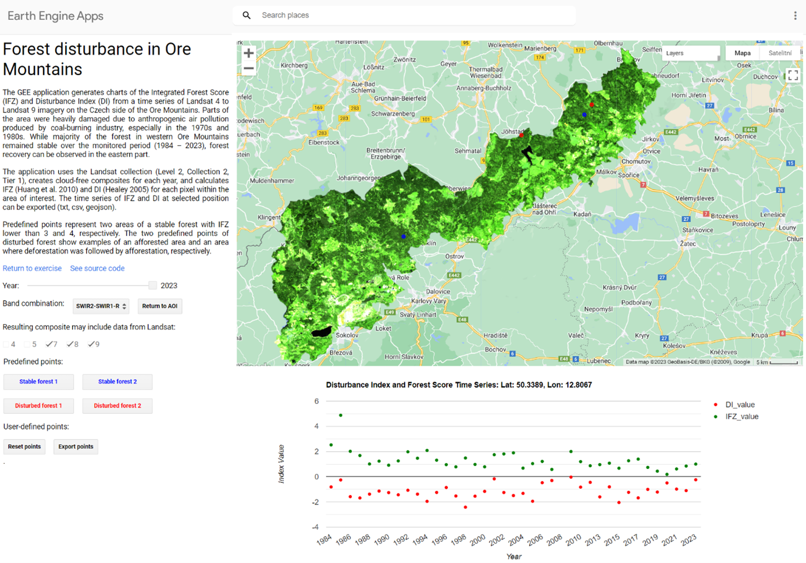
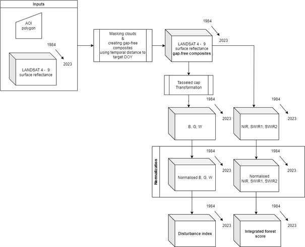
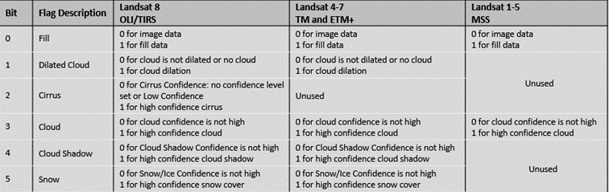
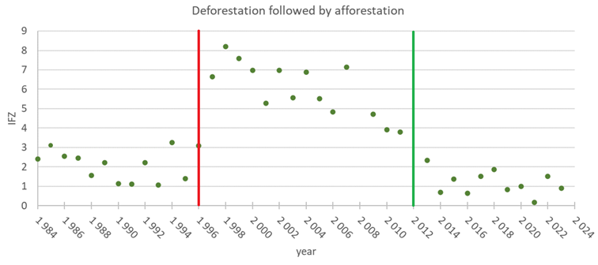

Case study: Effects of air pollution: forest disturbance and recovery in the Ore Mountains (Czechia)
================

The aim of this case study is to present a methodology for analysing forest changes based on 40-year time series of Landsat imagery using two spectral indices – Integrated Forest Score (IFZ, Huang et al., 2010) and Disturbance Index (DI, Healey et al., 2005, Griffiths et al., 2014). The methodology is implemented as an online Google Earth Engine (GEE) application. The area of interest (AOI) was set to the Ore Mountains (Czechia). Both indices were also explained in [Theme 5](../05_vegetation_monitoring/05_vegetation_monitoring.md) of this Module.

## Study site and data
First, get familiar with the use case [Forest disturbances in Ore Mountains](../../data_usecases/usecase_ore_mts_disturbance.md) and read the paper accompanying the use case and case study:

*Kupková, L., Potůčková, M., Lhotáková, Z., Albrechtová, J. (2018). Forest cover and disturbance changes, and their driving forces: A case study in the Ore Mountains, Czechia, heavily affected by anthropogenic acidic pollution in the second half of the 20th century. Environmental Research Letters, 13(9), 095008. [https://iopscience.iop.org/article/10.1088/1748-9326/aadd2c](https://iopscience.iop.org/article/10.1088/1748-9326/aadd2cs)*

## Implementation workflow

The application is implemented in GEE and can be accessed from [this link](https://dvorakjakub.users.earthengine.app/view/etrainee-oremts-dev).

<center>


<i>The GEE application Forest disturbance in Ore Mountains. Figure by course authors.</i>
</center>

The methodology consists of several steps depicted in the chart below and commented in the following text. The developed [GEE script](https://code.earthengine.google.com/a50c21c9513e7202f22a025b82d8adff) can be used for other areas with similar land cover and forest composition. The respective parts of the script that need to be altered for another AOI are marked in the following text.

<center>


<i>General workflow applied in the GEE application [Forest disturbance in Ore Mountains](https://dvorakjakub.users.earthengine.app/view/etrainee-oremts-dev). Figure by course authors.</i>
</center>

### Data selection
The AOI is defined as a polygon and it is saved in the respective cloud repository (and shall be obviously changed if the analysis shall be carried out over another area). In our case study, the time span goes from 1984 to 2023 which corresponds to Landsat missions 4 – 9. Notice, that the year 2012 is omitted. The only images available are from Landsat 7. Due to failure of the Scan Line Corrector (SLC) compensating for the forward motion of the satellite (more information is available on the [USGS homepage](https://www.usgs.gov/landsat-missions/landsat-7?qt-science_support_page_related_con=0#qt-science_support_page_related_con)), the images contain high amount of erroneous pixels and introduce outliers to the analysed time series. 

``` js
// Create list of years
var startYear = 1984;
var endYear = 2023;
var yearList = ee.List.sequence(startYear, endYear)
  .remove(2012); // Removing 2012 to remove Landsat 7, as only L7 images were available in 2012
```

[Landsat Collection 2 Surface Reflectance](https://www.usgs.gov/landsat-missions/landsat-collection-2-surface-reflectance) (Level 2 Scientific Product) is used for processing.

``` js
// Define collections for Landsat 4, 5, 7, 8, and 9
var collections = {
  lt4: ee.ImageCollection("LANDSAT/LT04/C02/T1_L2"),
  lt5: ee.ImageCollection("LANDSAT/LT05/C02/T1_L2"),
  lt7: ee.ImageCollection("LANDSAT/LE07/C02/T1_L2"),
  lt8: ee.ImageCollection("LANDSAT/LC08/C02/T1_L2"),
  lt9: ee.ImageCollection("LANDSAT/LC09/C02/T1_L2")
};
```

To compare only images from the vegetation season, only images from May to September were selected by defining a filter `ee.Filter.calendarRange(5, 9, 'month')`.

In addition, a new layer doy_abs defining the “time distance” from the target Day Of the Year (DOY) was created in each image. After masking out the pixels contaminated with clouds and shadows, a gap-free composite will be created from pixels in the defined season span (in our case May to September) with the shortest time distance from DOY, in our case DOY = 212 (August 1st).

### Cloud mask

The Landsat Collection 2 images contain a [Surface Reflectance Cloud Quality Assessment Band](https://www.usgs.gov/landsat-missions/landsat-collection-2-quality-assessment-bands) (SR_Cloud_QA) carrying among others information on contamination of the pixels with clouds and cloud shadows. 

<center>


<i>Landsat Collection 2 Pixel Quality Assessment Bit Index. Source:  [U.S. Geological Survey](https://www.usgs.gov/media/images/landsat-collection-2-pixel-quality-assessment-bit-index) / [Terms of use](https://www.usgs.gov/information-policies-and-instructions/copyrights-and-credits)</i>
</center>

In the applied workflow this information is used and pixels with value 1 in the respective SR_Cloud_QA bits (1, 3, 4) are added to the cloud mask. Notice that the mask was extended of pixels containing snow that might remain at the top of the Ore mountains at the end of spring.

``` js
// Define function to mask clouds and clouds shadows with additional pixels masked around these areas.
var cloudMaskKernel = function(img) {
  var dilatedCloudBitMask = 1 << 1;
  var cloudShadowBitMask = 1 << 3;
  var cloudsBitMask = 1 << 4;
  var snowBitMask = 1 << 5;
  var qa = img.select('QA_PIXEL');
  var mask = qa.bitwiseAnd(cloudShadowBitMask)
    .or(qa.bitwiseAnd(cloudsBitMask))
    .or(qa.bitwiseAnd(dilatedCloudBitMask))
    .or(qa.bitwiseAnd(snowBitMask));
  mask = mask.focalMax(7, "square");
  return qa.updateMask(mask.not());
};
```

### Gap-free composites
For each acquisition year, the pixels outside the mask are sorted according to the time distance to DOY. The final composite for the given year is composed from cloud and snow free pixels with the shortest time distance to DOY. The final image is reprojected to the WGS 84 / UTM zone 34N (EPSG:32634) with GSD of 30m. 

``` js
// Function to create mosaic based on day-of-year. 
// Non-clouded pixels with lowest temporal distance from 213 day-of-year (August 1) will be present in the final composite
var compositeDoy = function(col) {
  var colSort = col.sort('doy_abs', false);
  return colSort.mosaic();
};

// Create a composite for each year
var yearCompList = yearList.map(function(year) {
  var yearCol = oreCol.filter(ee.Filter.calendarRange(year, year, 'year'));
  var yearComp = compositeDoy(yearCol);
  yearComp = yearComp.reproject({crs: 'EPSG:32634', scale: 30}); 
  return yearComp.set({
    'year': ee.Number(year).int(),
    'save': ee.String(year)
  });
});
```

### Disturbance index
For the calculation of DI, the Tasselled Cap Transformation (TCT, Kauth and Thomas, 1976, Crist and Kauth, 1986) has to be carried out first. In the present implementation, the transformation coefficients from Crist and Cicone (1984) are applied for all imagery. It has two drawbacks. First, the coefficients slightly alter among Landsat sensors. Second, they differ if applied on DN or surface reflectance values (c.f., Zhai et al., 2022). Thus, in this part there is a space for further improvements and experiments.

``` js
// Coefficients after Crist and Cicone (1984) 
  var brtCoeffs = ee.Image.constant([0.3037, 0.2793, 0.4743, 0.5585, 0.5082, 0.1863]);
  var grnCoeffs = ee.Image.constant([-0.2848, -0.2435, -0.5436, 0.7243, 0.0840, -0.1800]); 
  var wetCoeffs = ee.Image.constant([0.1509, 0.1973, 0.3279, 0.3406, -0.7112, -0.4572]); 
  
  // Sum reducer - sum band values after multiplying them by coefficients
  var sumReducer = ee.Reducer.sum();
  var brightness = img.multiply(brtCoeffs).reduce(sumReducer);
  var greenness = img.multiply(grnCoeffs).reduce(sumReducer); 
  var wetness = img.multiply(wetCoeffs).reduce(sumReducer); 
  var tc = brightness.addBands(greenness)
                     .addBands(wetness)
                     // Rename the bands
                     .select([0,1,2], ['TCB','TCG','TCW']); 
  return img.addBands(tc);
};
```

The Brightness (B), Greenness (G), and Wetness (W) components are further normalised to the mean m and standard deviation σ over forest areas. In our implementation, these were calculated from pixels labelled as “stable forest” based on IFZ in the study Kupková et al., 2018. Due to outliers present in the data, a median value and an estimated standard deviation σ based on the mean absolute difference (MAD, σ = 1.4826*MAD) were used. Differences in the m and σ values are highly possible for other areas and species and shall be check before applying elsewhere. The final value of DI is given by subtraction of the normalised G and W values from the normalised B valies.

``` js
// function for computing disturbance index
var disturbanceIndex = function(img) {
  // Values based on Kupková et al. (2018)
  var brtMedian = ee.Image.constant(0.1972);
  var brtStd = ee.Image.constant(0.05575);
  
  var grnMedian = ee.Image.constant(0.108);
  var grnStd = ee.Image.constant(0.03113);
  
  var wetMedian = ee.Image.constant(0.0068);
  var wetStd = ee.Image.constant(0.01438);
    
  var br = img.select('TCB').subtract(brtMedian).divide(brtStd);
  var gr = img.select('TCG').subtract(grnMedian).divide(grnStd);
  var wr = img.select('TCW').subtract(wetMedian).divide(wetStd);
  
  var di = br.subtract(gr).subtract(wr).rename('DI');
  
  return img.addBands(di);
};
```

### Integrated forest score
The calculation IFZ requires normalization of NIR, SWIR1 and SWIR2 bands using mean m and standard deviation σ of the pixels corresponding to the forest areas. The applied coefficients originate in the study Kupková et al., 2018 where forest pixels were discriminated by unsupervised ISODATA classification.

``` js
//Function for computing Forest Score
var forestScore = function(img) {
  // Values are based on based on Kupková et al. (2018)
  var grnMedian = ee.Image.constant(0.02411);
  var grnStd = ee.Image.constant(0.00437);
  
  var swir1Median = ee.Image.constant(0.06677);
  var swir1Std = ee.Image.constant(0.01147);
  
  var swir2Median = ee.Image.constant(0.02907);
  var swir2Std = ee.Image.constant(0.00750);

  var grnFZ = img.select('Green').subtract(grnMedian).divide(grnStd).pow(2);
  var swir1FZ = img.select('SWIR1').subtract(swir1Median).divide(swir1Std).pow(2);
  var swir2FZ = img.select('SWIR2').subtract(swir2Median).divide(swir2Std).pow(2);

  var ifz = grnFZ.add(swir1FZ).add(swir2FZ)
    .divide(ee.Image.constant(3))
    .sqrt()
    .rename('IFZ');
```

## Analysis
The application provides tools for displaying IFZ and DI in a selected year over AOI. Moreover, true colour RGB and false colour SWIR1/SWRI2/R composites as well as Normalised Differential Vegetation Index (NDVI) can be visualised. You might add a function for exporting selected image layers.

There is a possibility to display a chart of IFZ and Di values over the whole time span (1984 – 2023) for preselected points or points defined by a user in a map. The preselected points correspond to areas with a stable forest and areas with forest disturbances. The charts can be enlarged and saved in svg or png formats and IFZ and DI values can be exported as csv files and processed further in R, Python, Excel or similar software tools.

Following Kupková et al., 2018, based on analysis of the IFZ time series areas of stable forest, areas of deforestation, afforestation, and combination of both can be defined. The stable forest is defined for pixels with IFZ < T<sub>IFZ</sub>. Huang et al. (2010) set the T<sub>IFZ</sub> = 3. In our AOI, stands of mainly mature conifers using this threshold. Based on IFZ values from 1990, 2000, and 2006 under the forest mask derived from corresponding Corine Land Cover (CLC) databases using deciduous (code 311), coniferous (312), mixed (313) and transitional (324) forest areas, setting a higher threshold T<sub>IFZ</sub> = 5 is justifiable to discriminate all forest classes. In Kupková et al., 2018 even a higher value T<sub>IFZ</sub> = 8 by adding a standard deviation σ<sub>IFZ</sub> = 3. The T<sub>IFZ</sub> values shall be checked and adjusted according to the forest characteristics at the AOI.

<center>



<i>Application of IFZ for evaluation of forest change. The upper charts show area of a stable forest with IFZ < 3 in the whole time span; notice an outlier value in the year 1985. The lower chart depicts forest changes from stable forest between 1984 and 1995 with IFZ<3, through its disturbance between 1996 to 2012 with IFZ > 3, to forest recovery starting from 2013. The change is considered if IFZ goes over the threshold (in this case TIFZ = 3) for a period longer than 3 years to avoid variations in surface reflectance time series due to imperfections in atmospheric correction. Figure by course authors.</i>
</center>

The DI reacts on the fact that that recently cleared or declining forest exhibits high brightness and low greenness and wetness values in relation to undisturbed or recovering forest. A linear trend (TDI) can be calculated from the DI time series to discriminate areas where minimal change happened (TDI close to 0), where the forest condition improved in general (TDI < 0), and where it got worse (TDI > 0). 

<center>


<i>Example of area of a minimal change (stable forest) and improved forest condition (afforestation). Figure by course authors.</i>
</center>

## Conclusions
The forest changes can be evaluated based on the present methodology. The developed GEE script includes creating a time series of Landsat cloud free image composites using the shortest time distance to the selected DOY. Calculation of IFZ and DI adjusted for the area of the Ore Mountains is included. For use in other areas, the values of mean and standard deviation tasselled cap components and surface reflectance in the infrared bands, respectively, over forest areas shall be checked and possibly altered. Also, adjustment of parameters for the tasselled cap transformation to respect the surface reflectance and various sensors shall be considered. Despite to some simplifications, the method proved to have valuable results for assessment of forest condition and its development in time as showed in the study Kupková et al., 2018. In the mentioned study, all calculations were done in the desktop solutions, Landsat images were downloaded from the USGS archive. Thus, only one image with the lowest cloud cover was used per each year. Due to cloud cover, some years were excluded in the study. The provided cloud solution overcomes this problem, it is much more flexible and prepares datasets for further automated processing (image layers with IFZ and DI, csv files for selected pixels). The derived dates of forest changes can be correlated with other datasets on air pollution, windstorms, clearcuts, new planting etc. to develop scenarios for sustainable forest management and future forest development. 

## References
Crist, E. P., Cicone, R. C. (1984). A physically-based transformation of Thematic Mapper data---The TM Tasseled Cap. IEEE Transactions on Geoscience and Remote sensing, (3), 256-263.Tasseled Cap.” IEEE Transactions on Geoscience and Remote Sensing GE-22: 256-263. [https://ieeexplore.ieee.org/document/4157507](https://ieeexplore.ieee.org/document/4157507)

Crist, E. P.,  Kauth, R. J. (1986). The tasseled cap de-mystified. Photogrammetric engineering and remote sensing, 52. [https://www.asprs.org/wp-content/uploads/pers/1986journal/jan/1986_jan_81-86.pdf](https://www.asprs.org/wp-content/uploads/pers/1986journal/jan/1986_jan_81-86.pdf)

Griffiths, P., Kuemmerle, T., Baumann, M., Radeloff, V. C., Abrudan, I. V., Lieskovsky, J., … Hostert, P. (2014). Forest disturbances, forest recovery, and changes in forest types across the Carpathian ecoregion from 1985 to 2010 based on Landsat image composites. Remote Sensing of Environment, 151, 72-88. [https://doi.org/10.1016/j.rse.2013.04.022](https://doi.org/10.1016/j.rse.2013.04.022)

Healey, S. P., Cohen, W. B., Zhiqiang, Y., Krankina, O. N. (2005). Comparison of Tasseled Cap-based Landsat data structures for use in forest disturbance detection. Remote sensing of environment, 97(3), 301-310. [https://doi.org/10.1016/j.rse.2005.05.009](https://doi.org/10.1016/j.rse.2005.05.009)

Huang, C., Goward, S. N., Masek, J. G., Thomas, N., Zhu, Z., Vogelmann, J. E. (2010). An automated approach for reconstructing recent forest disturbance history using dense Landsat time series stacks. Remote Sensing of Environment, 114(1), 183-198. [https://doi.org/10.1016/j.rse.2009.08.017](https://doi.org/10.1016/j.rse.2009.08.017)

Kauth, R. J., & Thomas, G. S. (1976). The Tasseled Cap—A Graphic Description of the Spectral-Temporal Development of Agricultural Crops as Seen by Landsat. LARS: Proceedings of the Symposium on Machine Processing of Remotely Sensed Data, West Lafayette, IN: Purdue University, pp. West Lafayette, IN: Purdue University: 4B-41-4B-51.

Kupková, L., Potůčková, M., Lhotáková, Z., Albrechtová, J. (2018). Forest cover and disturbance changes, and their driving forces: A case study in the Ore Mountains, Czechia, heavily affected by anthropogenic acidic pollution in the second half of the 20th century. Environmental Research Letters, 13(9), 095008. [https://iopscience.iop.org/article/10.1088/1748-9326/aadd2c](https://iopscience.iop.org/article/10.1088/1748-9326/aadd2c)

Zhai, Y., Roy, D. P., Martins, V. S., Zhang, H. K., Yan, L., Li, Z. (2022). Conterminous United States Landsat-8 top of atmosphere and surface reflectance tasseled cap transformation coefficients. Remote Sensing of Environment, 274, 112992. [https://doi.org/10.1016/j.rse.2022.112992](https://doi.org/10.1016/j.rse.2022.112992)

### Other case studies

- [Monitoring tundra grasslands (Karkonosze)](../06_cs_tundra_grasslands/06_cs_tundra_grasslands.md)
- [Forest disturbance detection (Tatras)](../08_cs_disturbance_detection/08_cs_disturbance_detection.md)

### Module themes

- [Principles of multispectral imaging](../01_multispectral_principles/01_multispectral_principles.md)
- [Temporal information in satellite data](../02_temporal_information/02_temporal_information.md)
- [Image processing workflow](../03_image_processing/03_image_processing.md)
- [Multitemporal classification of vegetation types](../04_multitemporal_classification/04_multitemporal_classification.md)
- [Vegetation monitoring and disturbance detection](../05_vegetation_monitoring/05_vegetation_monitoring.md)
