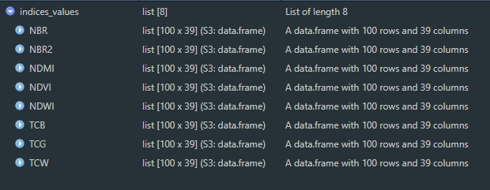
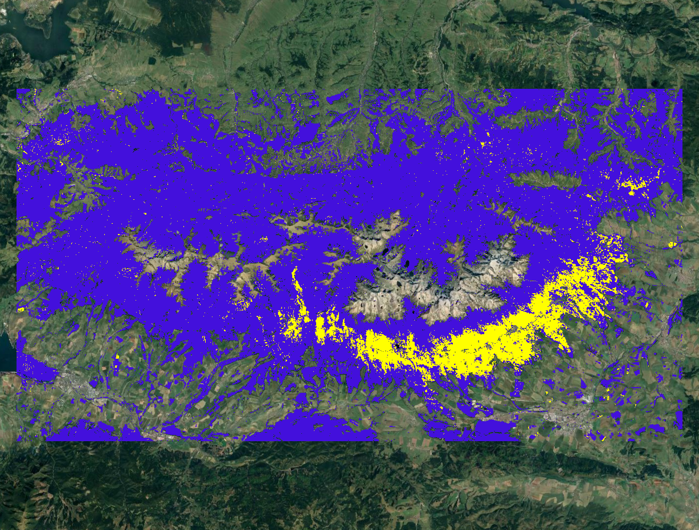
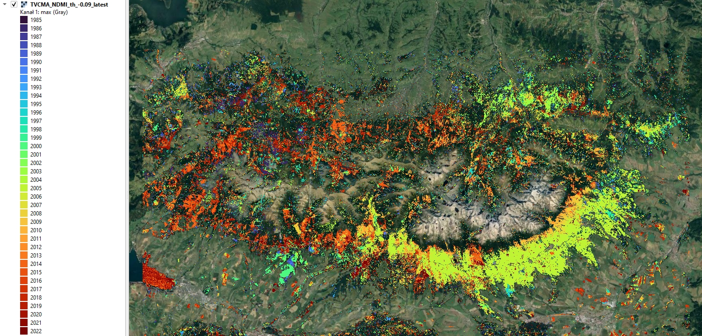

Case study: Forest disturbance detection (Tatra Mountains)
================

The Tatra Mountains are a unique and ecologically significant area. Monitoring forest changes there is critical to understanding environmental shifts and potential threats. The aim of this case study is to assess **vegetation (forests) changes** in Tatra Mountains area. If you’ve gone through **[Theme 5 exercise](../05_vegetation_monitoring/05_vegetation_monitoring_exercise.md)** you’ll notice the similarit in topics.

However, in this case study we’re adopting a different approach. This time we we’ll use **Threshold and trend-based vegetation change monitoring algorithm (TVCMA)** instead of the LandTrendr. TVCMA was developed in R language. Our work will be conducted in RStudio environment. If you haven’t already done this, refer to this tutorial regarding the environment setup: [R environment setup tutorial](../../software/software_r_language.md). We will use the image datasets and validation table prepared and described earlier in **[Theme 3 exercise](../03_image_processing/03_image_processing_exercise.md#processing-pipeline-2)** and **[Theme 5 exercies](../05_vegetation_monitoring/05_vegetation_monitoring_exercise.md)**. We’ll use essential features of TVCMA, which are related to detection of time and location of forest disturbance events based on thresholding and logical rules.

Our workflow is divided into the following key steps:

1.  **Extraction of spectral indices values using reference data points**: this initial step involves extracting spectral values from our image datasets, forming the foundation for the subsequent stages of our analysis.
2.  **Applying the TVCMA algorithm to various variables (indices) and threshold values**: the core analysis part.
3.  **Accuracy assessment and best model selection**: after acquiring the results we’ll be able to assess and select best performing combination of spectral index & threshold.
4.  **Calculation of forest disturbance maps presenting detected events in the Tatra Mountains**: in this part, we’ll create spatial visual representations of the detected forest disturbances.

<center>


<i>Case Study 3 scheme of procedure.</i>
</center>

## Study area and data

Before you continue, get familiar with the use case (if you did it before in Theme 5 you can skip this step): **[Use case: Vegetation disturbance detection in Polish-Slovak Tatra Mountains](../../data_usecases/usecase_forest_tatras.md)**.

… and read the paper accompanying the use case:

Ochtyra, A., Marcinkowska-Ochtyra, A., & Raczko, E. (2020). *Threshold and trend-based vegetation change monitoring algorithm based on the inter-annual multi-temporal normalized difference moisture index series: A case study of the Tatra Mountains*. Remote Sensing of Environment, 249, 112026. <https://doi.org/10.1016/j.rse.2020.112026>

Download data provided through [Zenodo](https://zenodo.org/records/10003575).

### Imagery data

The image data supplied for this exercise consist of Landsat satellite imagery time series. The data preparation process is described in the **[Module 2 Theme 3 exercise Pipeline 2](../03_image_processing/03_image_processing_exercise.md#processing-pipeline-2)**. We’ll use indices time series that you can access in the `case_study_3/data_exercise` folder.

### Reference data

For this exercise, 100 reference points have been chosen to perform the assessment of TVCMA. These points were randomly spread out across the research area. Each point was assessed based on chips (method of producing chips is presented in **[Theme 2 exercise](../02_temporal_information/02_temporal_information_exercise.md)**). The attribute table from the point layer was extracted and will be used in the second part of the exercise as a validation dataset. In table rows there are consecutive reference points recorded and in columns there are subsequent years from 1985 (the first possible disturbance observation) to 2022. In cases where no disturbance was identified, the corresponding cell was marked with a “0”. Conversely, if a disturbance was evident, the cell was marked with a “1”.

<center>


<i>Validation table.</i>
</center>

The validation process will involve overlaying the extracted TVCMA disturbance points on validation disturbance events and calculating confusion matrix statistics.

## Getting started

### Environment preparation: loading required libraries and data

To start with, we want to load necessary libraries and data and set up some initial variables, which we will use further down the line. Firstly, load required libraries into the environment: `terra`, `sf`, `dplyr`, `readxl`, `writexl` and `tools`. Functions included in these packages will be used further in this case study.

``` r
# raster I/o and processing
library(terra) 

# vector I/O and processing
library(sf) 

# tabular data manipulation
library(dplyr) 

# reading .xlsx files
library(readxl) 

# writing .xlsx files
library(writexl) 

# miscellaneous tools
library(tools)
```

We can move to loading up the required data. We will start with the raster data which are time series of vegetation indices and products of Tasseled Cap transformation calculated on Landsat cloud-free composites from 1984 to 2022 prepared in **[Theme 3 exercise, pipeline 2](../03_image_processing/03_image_processing_exercise.md#processing-pipeline-2)**. Data can be found in a package provided through [Zenodo](https://zenodo.org/record/8402925). We’ll load 8 multiband rasters to a list and name them appropriately.

``` r
# load relative paths to .tif files
# the first file is forest mask, which we want to load separately
indices_list <- list.files("case_study_3/data_exercise/", 
                           pattern = "*.tif", 
                           full.names = TRUE)[2:9]

# load images as terra rast objects
indices_imgs <- lapply(indices_list, terra::rast)

# get indices names
indices_names <- file_path_sans_ext(list.files("case_study_3/data_exercise/", 
                                               pattern = "*.tif")[2:9])

# rename loaded images
names(indices_imgs) <- indices_names
```

After we’ve loaded image data, we can now can also read in 100 reference/validation points.

``` r
# read reference points
points <- st_read("case_study_3/data_exercise/CS3_points.shp")
```

To have all the data needed later we’ll also load validation table at this moment. We’ll get rid of the redundant `id` column.

``` r
# read validation table
val_table <- read_xlsx("case_study_3/data_exercise/CS3_validation_table.xlsx") %>%
  select(2:39)
```

Finally, we’ll use forest mask in the final parts of the exercise. Our focus is detection disturbances in the forested areas, so this mask will reduce visual changes in, for example, crops in the disturbance maps.

``` r
# read forest mask raster
forest_mask <- rast("case_study_3/data_exercise/CS3_forest_mask.tif")
```

### Reference values extraction

TVCMA algorithm needs spectral indices values to apply sets of rules to them to indicate the disturbance events. We want to extract these values for all time series rasters we loaded. We’ll use `terra::extract` function and apply it to the `points` layer to produce a list containing extracted values for each index.

``` r
# extract indices values to points
indices_values <- lapply(indices_imgs, terra::extract, y = points, ID = FALSE)
```

This is the result of that function. Each data frame contains 100 rows (one per point) with 39 columns (one per year from 1984 to 2022).

<center>



</center>

We can create a single spatial points file, with attribute table populated with extracted values. In order to do that we’ll bind the columns from all extracted data frames and then bind these columns to the attribute table of `points` shapefile.

``` r
# bind columns to point layer
points_all_values <- bind_cols(points, do.call(bind_cols, indices_values))
```

We can save the results to shapefile.

    # save shapefile with extracted values
    st_write(points_all_values, "case_study_3/results/CS3_points_indices_values.shp")

You may see this warning.

``` r
# Warning message:
#   In CPL_write_ogr(obj, dsn, layer, driver, as.character(dataset_options),  :
#                      GDAL Message 1: Creating a 256th field, but some DBF readers might only support 255 fields
```

To make sure the data is saved correctly, save the points to geopackage.

``` r
# save geopackage with extracted values
st_write(points_all_values, "case_study_3/results/CS3_points_indices_values.gpkg")
```

## Analysis

We are now ready to advance to the analysis part of this Case Study. We’ve acquired a dataset on which we can apply TVCMA conditions to indicate disturbance events. In short, TVCMA checks three conditions in order to classify a point as a disturbance event. **[You can see a visualised example in Theme 5 Lesson](../05_vegetation_monitoring/05_vegetation_monitoring.md#threshold--and-trend-based-vegetation-change-monitoring-algorithm-tvcma)**.

### TVCMA conditions function

We’ll prepare a function which will take two inputs. The first one `ind` is a data frame with 100 rows and 39 columns representing extracted values for one index. The second argument `threshold` is the numerical value which is used to assess whether the conditions are met (resulting in a `TRUE` value) or not (`FALSE` value).

``` r
# function to check TVCMA conditions on values in a data frame
apply_tvcma_conditions_points <- function(ind, threshold) {
  
  # prepare a result matrix with dimensions matching input data frame
  res <- matrix(data = FALSE, nrow = nrow(ind), ncol = ncol(ind))
  
  # loop to check TVCMA conditions for years from third (in this case 1986)
  # to second to last (2021)
  for (i in 1:nrow(ind)) {
    for (j in 3:(ncol(ind) - 1)) {
      if (threshold >= 0) {
        cond_1 <- (ind[i, j] - ind[i, j - 1]) > threshold
        cond_2 <- (ind[i, j + 1] - ind[i, j - 1]) > threshold
        cond_3 <- (ind[i, j] - ind[i, j - 2]) > threshold
      } else {
        cond_1 <- (ind[i, j] - ind[i, j - 1]) < threshold
        cond_2 <- (ind[i, j + 1] - ind[i, j - 1]) < threshold
        cond_3 <- (ind[i, j] - ind[i, j - 2]) < threshold
      }
      res[i, j] <- cond_1 & cond_2 & cond_3
    }
    
    # for the second observation (1985), check conditions 1 and 2
    if (threshold >= 0) {
      cond_1_second <- (ind[i, 2] - ind[i, 1]) > threshold
      cond_2_second <- (ind[i, 3] - ind[i, 1]) > threshold
    } else {
      cond_1_second <- (ind[i, 2] - ind[i, 1]) < threshold
      cond_2_second <- (ind[i, 3] - ind[i, 1]) < threshold
    }
    res[i, 2] <- cond_1_second & cond_2_second
    
    # For the last observation (2022), check conditions 1 and 3
    if (threshold >= 0) {
      cond_1_last <- (ind[i, ncol(ind)] - ind[i, ncol(ind) - 1]) > threshold
      cond_3_last <- (ind[i, ncol(ind)] - ind[i, ncol(ind) - 2]) > threshold
    } else {
      cond_1_last <- (ind[i, ncol(ind)] - ind[i, ncol(ind) - 1]) < threshold
      cond_3_last <- (ind[i, ncol(ind)] - ind[i, ncol(ind) - 2]) < threshold
    }
    res[i, ncol(ind)] <- cond_1_last & cond_3_last
  }
  
  
  # Remove the first column (1984) from resulting matrix 
  # because no conditions can be applied to the first year in time series
  res <- res[,2:ncol(res)]
  
  # return the resulting 1/0 data frame
  return(res)
}
```

### Accuracy statistics function

We want to test two main variables to assess the performance of TVCMA: input spectral index and threshold. To calculate statistics for each pair we can prepare a function (similar to that in **[Theme 5 exercise](../05_vegetation_monitoring/05_vegetation_monitoring_exercise.md)** where we assessed LandTrendr results.)

``` r
# prepare a function to calculate statistics
calculate_confusion_matrix_stats <- function(matrix, validation_matrix, set_name) {
  
  # Calculate TP, FP, TN, FN
  TP <- sum(matrix == 1 & validation_matrix == 1)
  FP <- sum(matrix == 1 & validation_matrix == 0)
  TN <- sum(matrix == 0 & validation_matrix == 0)
  FN <- sum(matrix == 0 & validation_matrix == 1)
  
  # Calculate the metrics
  Accuracy <- (TP + TN) / (TP + FP + FN + TN)
  Precision <- TP / (TP + FP)
  Sensitivity <- TP / (TP + FN)
  Specificity <- TN / (TN + FP)
  F1_Score <- 2 * (Sensitivity * Precision) / (Sensitivity  + Precision)
  
  # Create a data frame with the confusion matrix stats
  stats <- data.frame(Set = set_name, TP, FP, TN, FN, Accuracy, Precision, Sensitivity, Specificity, F1_Score)
  
  return(stats)
}
```

### Applying functions to data

We have prepared necessary data and functions to progress the analysis.

One additional issue we haven’t considered so far is the direction of change indicating disturbances. In order to detect a disturbance with spectral index values we need to know what is the sign (positive or negative) of delta if the disturbance occurs. Let’s consider as an example NDVI. If NDVI pixel value in 1985 is `0.8` and in 1986 is `0.3` then delta is equal to `-0.5`. That means that disturbances can be detected when delta is negative. On the other hand, indices like NDWI or TCB behave the other way round - positive delta indicates disturbance. In our case these are the lists of positive and negative delta indices.

``` r
# direction of index delta when considering disturbances
pos_indices <- c("NDWI", "TCB")
neg_indices <- c("NBR", "NBR2", "NDMI", "NDVI", "TCG", "TCW")
```

For these two groups we also want to prepare a set of thresholds we’ll test. Each time we’ll consider 50 thresholds with increments of 0.01 each time.

``` r
pos_thresholds <- seq(0.01, 0.5, by = 0.01)
neg_thresholds <- seq(-0.01, -0.5, by = -0.01)
```

We are finally ready to run TVCMA algorithm and calculate the accuracy results. In the code below we’ll prepare an empty list to store the results separately per index. Each loop will produce an element - accuracy table with 50 rows (one per each threshold) - that will be added to `results_list`. Each accuracy table will also be separately exported to `.xlsx` file.

    # prepare empty results list
    results_list <- list()

    # loop through indices_values 
    for (i in seq(1, length(indices_values))) {
      
      # select values for one index
      ind = indices_values[[i]]
      
      # get the name of the index
      ind_name <- names(indices_values)[i]
      
      # check whether to apply positive or negative thresholds
      if ((ind_name %in% pos_indices) == TRUE) {
        
        thresholds <- pos_thresholds
        
      } else {
        
        thresholds <- neg_thresholds
      }
       
      # prepare a names list for each row in the resulting table containing threshold
      # value with "." replaced by "_"
      names_list <- paste0("Threshold_", gsub("\\.", "_", thresholds)) 
      
      # apply the functions where conditions are checked for each threshold value
      # in other words: take index values and for each threshold value in the 
      # thresholds list check the conditions in apply_tvcma_conditions_points
      thresholds_results <- lapply(thresholds, 
                                   apply_tvcma_conditions_points, 
                                   ind = ind)
      
      # set names for each separate result
      thresholds_results <- setNames(thresholds_results, names_list)
      
      # apply calculate_confusion_matrix_stats for each result
      # each time take separate result (one result for one threshold tested)
      # calculate the statistics by comparing the result to validation table
      stats_list <- lapply(seq_along(thresholds_results), 
                           function(i) calculate_confusion_matrix_stats(
                             matrix = thresholds_results[[i]],
                             validation_matrix = val_table,
                             set_name = names(thresholds_results)[i]))
      
      # bind all the results for one index together
      # 50 rows, one per threshold, containing calculated statistics
      stats_df <- do.call(rbind, stats_list)
      
      # save the results to .xlsx file
      write_xlsx(stats_df, paste0("case_study_3/results/", ind_name, "_th_min_", min(thresholds), "_max_", max(thresholds), ".xlsx"))
      
      # add the table for one index to a list
      results_list[[i]] <- stats_df
      
    }

### Accuracy assessment

In your `results` folder you should now be able to see 8 `.xlsx` files. Each file should contain 50 rows with data (+ 1 heading row). See the example below.

<center>


</center>

The goal of our Case Study is to indicate the best spectral index and threshold combination to detect disturbance events with the highest accuracy. We can do that based on the achieved accuracy metrics. For the purpose of our Case Study we’ll choose *F1* as a measure to choose the best combination. Take a couple of minutes to assess the results and come back to the contents to see if your assessment is in line with our findings.

<details>
<summary>
The highest F1 was measured for…
</summary>

NDMI with threshold `0.09`. With F1 value equal to `0.65` this combination allowed us to correctly identify **42** cases of disturbances (True Positive, TP). Our results falsely indicate **17** disturbance events (False Positive, FP). There were also **27** disturbances events omitted in the TVCMA results, which were present in our validation dataset (False Negative, FN).

</details>

If you’ve evaluated the results you can proceed to the next part of the Case Study.

## Disturbance mapping

With the best performing index and threshold identified we can calculate disturbance maps for each year in the analysed time series.

First, we want to set the threshold and choose index to apply the calculations to.

<details>
<summary>
Set the best performing threshold to <b><i>threshold</b></i> variable and best performing image (index) data to <b><i>multiband_raster</b></i> variable.
</summary>

``` r
# best index image data
multiband_raster <- indices_imgs$NDMI

# best threshold
threshold <- -0.09
```

</details>

Next up we’ll prepare an array to store the results. We’ll set the dimensions of the array to be equal to input images, except number of layers, which needs to be shorter by one, since we cannot indicate disturbances for the first year in the series. We’ll produce disturbance maps from 1985 to 2022. At the start the 1193x2255x38 array will be populated with zeroes.

``` r
# empty array to store the results
result_array <- array(0, dim = c(nrow(multiband_raster), 
                                 ncol(multiband_raster), 
                                 nlyr(multiband_raster) - 1))
```

We are now ready to start calculating maps of disturbances based on TVCMA algorithm using NDMI and 0.09 threshold value as inputs. The input raster must be open for reading in order for us to be able to extract values from it. In a loop we’ll apply TVCMA conditions for each row of the input image. Results for each row (value 1 for detected disturbance, value 0 for no disturbance) will be pasted into `results_array`.

This process may take a couple minutes to finish. Observe the progress printing in the console.

``` r
# open a file for reading
readStart(multiband_raster)

# for each row in input image
for (i in 1:nrow(multiband_raster)) {
  
  # extract raster values from the image row 
  # each row contains 2255 x 39 values
  row_values <- readValues(multiband_raster, 
                           row = i, 
                           nrows = 1, 
                           col = 1, 
                           ncols = ncol(multiband_raster), 
                           mat = TRUE)
                           
  # prepare empty vector to store the TVCMA result for one row
  results <- rep(NA, ncol(multiband_raster) * (nlyr(multiband_raster) - 1))
  
  # apply TVCMA conditions to extracted raster values
  for (k in 1:nrow(row_values)) {
    
    values <- row_values[k, ]
    val_len <- length(values)
    
    if (threshold >= 0) {
      
      cond_1 <- (values[3:((val_len) - 1)] - values[2:(val_len - 2)]) > threshold
      cond_2 <- (values[4:(val_len)] - values[2:(val_len - 2)]) > threshold
      cond_3 <- (values[3:((val_len) - 1)] - values[1:(val_len - 3)]) > threshold
      
      r1 <- cond_1 & cond_2 & cond_3
      r2 <- (values[2] - values[1]) > threshold & (values[3] - values[1]) > threshold
      r3 <- (values[val_len] - values[val_len - 1]) > threshold & (values[val_len] - values[val_len - 2]) > threshold
      
    } else {
      
      cond_1 <- (values[3:((val_len) - 1)] - values[2:(val_len - 2)]) < threshold
      cond_2 <- (values[4:(val_len)] - values[2:(val_len - 2)]) < threshold
      cond_3 <- (values[3:((val_len) - 1)] - values[1:(val_len - 3)]) < threshold
      
      r1 <- cond_1 & cond_2 & cond_3
      r2 <- (values[2] - values[1]) < threshold & (values[3] - values[1]) < threshold
      r3 <- (values[val_len] - values[val_len - 1]) < threshold & (values[val_len] - values[val_len - 2]) < threshold
    }
    
    result <- c(r2, r1, r3)
    results[(((k - 1) * (val_len - 1)) + 1):(k * (val_len - 1))] <- result
    
  }
  
  # number of output layers (38)
  n_layers_minus_one <- nlyr(multiband_raster) - 1
  
  # insert TVCMA results to result array
  for (j in 1:ncol(multiband_raster)) {
    
    index_start <- (j - 1) * n_layers_minus_one + 1
    index_end <- j * n_layers_minus_one
    result_array[i, j, ] <- results[index_start:index_end]
  }
  
  # print progress
  print(paste0("Row: ", i, "/", nrow(multiband_raster)))
  
}
# close a file from reading
readStop(multiband_raster)
```

The result of this loop is an array populated with values 0 (no disturbance) and 1 (disturbance). Our goal is to create a multiband raster to indicate the spatial distribution of detected disturbances. We can achieve that by transforming an array into raster with coordinate reference system. We will also rename the bands to match years of detection of disturbances.

``` r
# transform array into raster with coordinate reference system
results_img <- rast(result_array,
                    extent = ext(multiband_raster),
                    crs = crs(multiband_raster))
                    
                    
# name the bands
names(results_img) <- as.character(paste0("TVCMA_", seq(1985, 2022)))
```

Once that’s done we can also mask the resulting image with forest mask. This will limit the area of analysis to mainly forests with some patches of other land cover classes also present (mainly to show that they are volatile and sensitive to TVCMA algorithm, i.e. lake in the SW part of the image).

``` r
# mask the results with forest mask
results_img <- mask(results_img, forest_mask)
```

To conclude the Case Study we can export the multiband image in a couple variants.

First, let’s export the image ‘as is’, so the disturbances are marked with pixel value 1 and no disturbances are 0. The masked areas have ‘NA’ pixel values.

``` r
# write 1/0 TVCMA image
writeRaster(results_img, 
            filename = "case_study_3/results/TVCMA_NDMI_th_-0.09_1_0.tif",
            datatype = "INT1U")
```

This is the result after loading it to QGIS. This image shows disturbances in yellow detected in 2005 and no disturbances in purple.

<center>



</center>

We can change the 0 values to NA for pixels where no disturbances were detected to get a clearer view of areas where some negative change occurred.

``` r
# write 1/NA TVCMA image
results_img_1_na <- subst(results_img, from = 0, to = NA,
                         filename = "case_study_3/results/TVCMA_NDMI_th_-0.09_1_NA.tif",
                         datatype = "INT1U")
```

<center>


</center>

Finally, we can prepare two single band images presenting the earliest and latest detected disturbance for each pixel. In order to do that we’ll reclassify values indicating disturbance - **1** - in each band to year of detection value. This will allow us to use `min` and `max` functions to extract minimum (earliest) and maximum (latest) disturbance year for each pixel.

``` r
# get year of detection 
yod <- seq(1985, 2022)

# iterate over each band and replace values of 1 with the year of detection value
results_yod <- lapply(1:length(yod), function(i) {
  band <- results_img_1_na[[i]]
  band <- band * yod[i]
  return(band)
})

# make a raster out of year of detection list
results_yod_rast <- rast(results_yod)


# create a raster showing the earliest detected disturbance
results_earliest <- min(results_yod_rast, na.rm = TRUE)

writeRaster(results_earliest, 
            filename = "case_study_3/results/TVCMA_NDMI_th_-0.09_earliest.tif",
            datatype = "INT2U")


# create a raster showing the latest detected disturbance 
results_latest <- max(results_yod_rast, na.rm = TRUE)


writeRaster(results_latest, 
            filename = "case_study_3/results/TVCMA_NDMI_th_-0.09_latest.tif",
            datatype = "INT2U")
```

<center>


<i>Year of earliest detected disturbance</i>
</center>
<center>



<i>Year of earliest latest disturbance</i>
</center>

## Discussion

Points to discuss:

- comparison of usefulness of each variable/index in disturbance detection based on accuracy metrics
- finer best threshold tuning after establishing the overall valid range of thresholds
- what is the possible reason of False Negatives occurrence
- what is the possible reason of False Positives occurrence
- compare disturbance maps with image composites for corresponding years and think about its correctness

## References

Ochtyra, A., Marcinkowska-Ochtyra, A., & Raczko, E. (2020). Threshold and trend-based vegetation change monitoring algorithm based on the inter-annual multi-temporal normalized difference moisture index series: A case study of the Tatra Mountains. Remote Sensing of Environment, 249, 112026. <https://doi.org/10.1016/j.rse.2020.112026>

### Other case studies

- [Monitoring tundra grasslands (Karkonosze)](../06_cs_tundra_grasslands/06_cs_tundra_grasslands.md)
- [Effects of pollution (Ore Mountains)](07_cs_forest_changes/07_cs_forest_changes.md)

### Module themes

- [Principles of multispectral imaging](../01_multispectral_principles/01_multispectral_principles.md)
- [Temporal information in satellite data](../02_temporal_information/02_temporal_information.md)
- [Image processing workflow](../03_image_processing/03_image_processing.md)
- [Multitemporal classification of vegetation types](../04_multitemporal_classification/04_multitemporal_classification.md)
- [Vegetation monitoring and disturbance detection](../05_vegetation_monitoring/05_vegetation_monitoring.md)

### Data

Landsat 4, 5, 7, 8 and 9 imagery courtesy of [the U.S. Geological Survey](https://www.usgs.gov/)/ [Terms of use](https://www.usgs.gov/information-policies-and-instructions/copyrights-and-credits) processed in and downloaded from [Google Earth Engine by Gorelick et al., 2017](https://doi.org/10.1016/j.rse.2017.06.031)

### Software

- QGIS Development Team (2022). *QGIS Geographic Information System. Open Source Geospatial Foundation Project*. <http://qgis.osgeo.org>
- R Core Team (2023). *R: A language and environment for statistical computing*. R Foundation for Statistical Computing, Vienna, Austria. <https://www.R-project.org/>.
- Hijmans R (2023). *terra: Spatial Data Analysis*. R package version 1.7-39, <https://CRAN.R-project.org/package=terra>
- Ooms J (2023). *writexl: Export Data Frames to Excel ‘xlsx’ Format*. R package version 1.4.2, <https://CRAN.R-project.org/package=writexl>.
- Pebesma, E., & Bivand, R. (2023). *Spatial Data Science: With Applications in R*. Chapman and Hall/CRC. <https://doi.org/10.1201/9780429459016>
- Pebesma, E., 2018. *Simple Features for R: Standardized Support for Spatial Vector Data*. The R Journal 10 (1), 439-446, <https://doi.org/10.32614/RJ-2018-009>
- Wickham H, François R, Henry L, Müller K, Vaughan D (2023). *dplyr: A Grammar of Data Manipulation*. R package version 1.1.2, <https://CRAN.R-project.org/package=dplyr>
- Wickham H, Bryan J (2023). *readxl: Read Excel Files*. <https://readxl.tidyverse.org>, <https://github.com/tidyverse/readxl>.

## Source code

<details>
<summary>
You can find the entire code used in this exercise here
</summary>

``` r
# raster I/o and processing
library(terra) 

# vector I/O and processing
library(sf) 

# tabular data manipulation
library(dplyr) 

# reading .xlsx files
library(readxl) 

# writing .xlsx files
library(writexl) 

# miscellaneous tools
library(tools)

# load relative paths to .tif files
indices_list <- list.files("case_study_3/data_exercise/", 
                           pattern = "*.tif", 
                           full.names = TRUE)[2:9]

# load images as terra rast objects
indices_imgs <- lapply(indices_list, terra::rast)

# get indices names
indices_names <- file_path_sans_ext(list.files("case_study_3/data_exercise/", 
                                               pattern = "*.tif")[2:9])

# rename loaded images
names(indices_imgs) <- indices_names

# read validation points
points <- st_read("case_study_3/data_exercise/CS3_points.shp")

# read validation table
val_table <- read_xlsx("case_study_3/data_exercise/CS3_validation_table.xlsx") %>%
  select(2:39)

# read fprest mask raster
forest_mask <- rast("case_study_3/data_exercise/CS3_forest_mask.tif")


# extract indices values to points
indices_values <- lapply(indices_imgs, terra::extract, y = points, ID = FALSE)

# bind columns to point layer
points_all_values <- bind_cols(points, do.call(bind_cols, indices_values))

# save shapefile with extracted values
st_write(points_all_values, "case_study_3/results/CS3_points_indices_values.shp")

# Warning message:
#   In CPL_write_ogr(obj, dsn, layer, driver, as.character(dataset_options),  :
#                      GDAL Message 1: Creating a 256th field, but some DBF readers might only support 255 fields

# save geopackage with extracted values
st_write(points_all_values, "case_study_3/results/CS3_points_indices_values.gpkg")


# function to check TVCMA conditions on values in a data frame
apply_tvcma_conditions_points <- function(ind, threshold) {
  
  # prepare a result matrix with dimensions matching input data frame
  res <- matrix(data = FALSE, nrow = nrow(ind), ncol = ncol(ind))
  
  # loop to check TVCMA conditions for years from third (in this case 1986)
  # to second to last (2021)
  for (i in 1:nrow(ind)) {
    for (j in 3:(ncol(ind) - 1)) {
      if (threshold >= 0) {
        cond_1 <- (ind[i, j] - ind[i, j - 1]) > threshold
        cond_2 <- (ind[i, j + 1] - ind[i, j - 1]) > threshold
        cond_3 <- (ind[i, j] - ind[i, j - 2]) > threshold
      } else {
        cond_1 <- (ind[i, j] - ind[i, j - 1]) < threshold
        cond_2 <- (ind[i, j + 1] - ind[i, j - 1]) < threshold
        cond_3 <- (ind[i, j] - ind[i, j - 2]) < threshold
      }
      res[i, j] <- cond_1 & cond_2 & cond_3
    }
    
    # for the second observation (1985), check conditions 1 and 2
    if (threshold >= 0) {
      cond_1_second <- (ind[i, 2] - ind[i, 1]) > threshold
      cond_2_second <- (ind[i, 3] - ind[i, 1]) > threshold
    } else {
      cond_1_second <- (ind[i, 2] - ind[i, 1]) < threshold
      cond_2_second <- (ind[i, 3] - ind[i, 1]) < threshold
    }
    res[i, 2] <- cond_1_second & cond_2_second
    
    # For the last observation (2022), check conditions 1 and 3
    if (threshold >= 0) {
      cond_1_last <- (ind[i, ncol(ind)] - ind[i, ncol(ind) - 1]) > threshold
      cond_3_last <- (ind[i, ncol(ind)] - ind[i, ncol(ind) - 2]) > threshold
    } else {
      cond_1_last <- (ind[i, ncol(ind)] - ind[i, ncol(ind) - 1]) < threshold
      cond_3_last <- (ind[i, ncol(ind)] - ind[i, ncol(ind) - 2]) < threshold
    }
    res[i, ncol(ind)] <- cond_1_last & cond_3_last
  }
  
  
  # Remove the first column (1984 for which it is not possible to check any
  # conditions) from resulting matrix
  res <- res[,2:ncol(res)]
  
  # return the resulting 0/1 data frame
  return(res)
}


# prepare a function to calculate statistics
calculate_confusion_matrix_stats <- function(matrix, validation_matrix, set_name) {
  
  # Calculate TP, FP, TN, FN
  TP <- sum(matrix == 1 & validation_matrix == 1)
  FP <- sum(matrix == 1 & validation_matrix == 0)
  TN <- sum(matrix == 0 & validation_matrix == 0)
  FN <- sum(matrix == 0 & validation_matrix == 1)
  
  # Calculate the metrics
  Accuracy <- (TP + TN) / (TP + FP + FN + TN)
  Precision <- TP / (TP + FP)
  Sensitivity <- TP / (TP + FN)
  Specificity <- TN / (TN + FP)
  F1_Score <- 2 * (Sensitivity * Precision) / (Sensitivity  + Precision)
  
  # Create a data frame with the confusion matrix stats
  stats <- data.frame(Set = set_name, TP, FP, TN, FN, Accuracy, Precision, Sensitivity, Specificity, F1_Score)
  
  return(stats)
}


# direction of index delta when considering disturbances
pos_indices <- c("NDWI", "TCB")
neg_indices <- c("NBR", "NBR2", "NDMI", "NDVI", "TCG", "TCW")


pos_thresholds <- seq(0.01, 0.5, by = 0.01)
neg_thresholds <- seq(-0.01, -0.5, by = -0.01)


# prepare empty results list
results_list <- list()

# loop through indices_values 
for (i in seq(1, length(indices_values))) {
  
  # select values for one index
  ind = indices_values[[i]]
  
  # get the name of the index
  ind_name <- names(indices_values)[i]
  
  # check whether to apply positive or negative thresholds
  if ((ind_name %in% pos_indices) == TRUE) {
    
    thresholds <- pos_thresholds
    
  } else {
    
    thresholds <- neg_thresholds
  }
  
  # prepare a names list to be applied for each result 
  # name is containing threshold value with "." replaced by "_"
  names_list <- paste0("Threshold_", gsub("\\.", "_", thresholds)) 
  
  # apply the functions where conditions are checked for each threshold value
  # in other words: take index values and for each threshold value in the 
  # thresholds list check the conditions in apply_tvcma_conditions_points
  thresholds_results <- lapply(thresholds, 
                               apply_tvcma_conditions_points, 
                               ind = ind)
  
  # set names for each separate result
  thresholds_results <- setNames(thresholds_results, names_list)
  
  # apply calculate_confusion_matrix_stats for each result
  # each time take separate result (one result for one threshold tested)
  # calculate the statistics by comparing the result to validation table
  stats_list <- lapply(seq_along(thresholds_results), 
                       function(i) calculate_confusion_matrix_stats(
                         matrix = thresholds_results[[i]],
                         validation_matrix = val_table,
                         set_name = names(thresholds_results)[i]))
  
  # bind all the results for one index together
  # 50 rows, one per threshold, containing calculated statistics
  stats_df <- do.call(rbind, stats_list)
  
  # save the results to .xlsx file
  write_xlsx(stats_df, paste0("case_study_3/results/", ind_name, "_th_min_", min(thresholds), "_max_", max(thresholds), ".xlsx"))
  
  # add the table for one index to a list
  results_list[[i]] <- stats_df
  
}


multiband_raster <- indices_imgs$NDMI
threshold <- -0.09

# empty array to store the results
result_array <- array(0, dim = c(nrow(multiband_raster), ncol(multiband_raster), nlyr(multiband_raster) - 1))

# open a file for reading
readStart(multiband_raster)
# for each row in input image
for (i in 1:nrow(multiband_raster)) {
  
  # extract raster values from the image row 
  # each row contains 2255 x 39 values
  row_values <- readValues(multiband_raster, row = i, nrows = 1, col = 1, ncols = ncol(multiband_raster), mat = TRUE)
  
  # prepare empty vector to store the TVCMA result
  results <- rep(NA, ncol(multiband_raster) * (nlyr(multiband_raster) - 1))
  
  # apply TVCMA conditions to extracted raster values
  for (k in 1:nrow(row_values)) {
    
    values <- row_values[k, ]
    val_len <- length(values)
    
    if (threshold >= 0) {
      
      cond_1 <- (values[3:((val_len) - 1)] - values[2:(val_len - 2)]) > threshold
      cond_2 <- (values[4:(val_len)] - values[2:(val_len - 2)]) > threshold
      cond_3 <- (values[3:((val_len) - 1)] - values[1:(val_len - 3)]) > threshold
      
      r1 <- cond_1 & cond_2 & cond_3
      r2 <- (values[2] - values[1]) > threshold & (values[3] - values[1]) > threshold
      r3 <- (values[val_len] - values[val_len - 1]) > threshold & (values[val_len] - values[val_len - 2]) > threshold
      
    } else {
      
      cond_1 <- (values[3:((val_len) - 1)] - values[2:(val_len - 2)]) < threshold
      cond_2 <- (values[4:(val_len)] - values[2:(val_len - 2)]) < threshold
      cond_3 <- (values[3:((val_len) - 1)] - values[1:(val_len - 3)]) < threshold
      
      r1 <- cond_1 & cond_2 & cond_3
      r2 <- (values[2] - values[1]) < threshold & (values[3] - values[1]) < threshold
      r3 <- (values[val_len] - values[val_len - 1]) < threshold & (values[val_len] - values[val_len - 2]) < threshold
    }
    
    result <- c(r2, r1, r3)
    results[(((k - 1) * (val_len - 1)) + 1):(k * (val_len - 1))] <- result
    
  }
  
  # number of output layers (38)
  n_layers_minus_one <- nlyr(multiband_raster) - 1
  
  # insert TVCMA results to result array
  for (j in 1:ncol(multiband_raster)) {
    
    index_start <- (j - 1) * n_layers_minus_one + 1
    index_end <- j * n_layers_minus_one
    result_array[i, j, ] <- results[index_start:index_end]
  }
  
  # print progress
  print(paste0("Row: ", i, "/", nrow(multiband_raster)))
  
}
# close a file from reading
readStop(multiband_raster)


# transform array into raster with coordinate reference system
results_img <- rast(result_array,
                    extent = ext(multiband_raster),
                    crs = crs(multiband_raster))

# name the bands
names(results_img) <- as.character(paste0("TVCMA_", seq(1985, 2022)))

# mask the results with forest mask
results_img <- mask(results_img, forest_mask)

# write 1/0 TVCMA image
writeRaster(results_img, 
            filename = "case_study_3/results/TVCMA_NDMI_th_-0.09_1_0.tif",
            datatype = "INT1U")

# write 1/NA TVCMA image
results_img_1_na <- subst(results_img, from = 0, to = NA,
                         filename = "case_study_3/results/TVCMA_NDMI_th_-0.09_1_NA.tif",
                         datatype = "INT1U")

# get year of detection 
yod <- seq(1985, 2022)

# iterate over each band and replace values of 1 with the year of detection value
results_yod <- lapply(1:length(yod), function(i) {
  band <- results_img_1_na[[i]]
  band <- band * yod[i]
  return(band)
})

# make a raster out of year of detection list
results_yod_rast <- rast(results_yod)

# create a raster showing the latest detected disturbance 
results_latest <- max(results_yod_rast, na.rm = TRUE)


writeRaster(results_latest, 
            filename = "case_study_3/results/TVCMA_NDMI_th_-0.09_latest.tif",
            datatype = "INT2U")

# create a raster showing the earliest detected disturbance
results_earliest <- min(results_yod_rast, na.rm = TRUE)

writeRaster(results_earliest, 
            filename = "case_study_3/results/TVCMA_NDMI_th_-0.09_earliest.tif",
            datatype = "INT2U")

```

</details>
