# Principles of 3D/4D geographic point clouds

In this theme, you will learn about 3D/4D point cloud data, fundamental point cloud operations and concepts of change analysis:

* [Introduction to Geographic 3D/4D Point Clouds](#introduction-to-geographic-3d4d-point-clouds)
* [Point Cloud Model and Fundamental Operations](#point-cloud-model-and-fundamental-operations)
* [Data Management of 4D Point Clouds](#data-management-of-4d-point-clouds)

The theme will conclude with:

* [Self-evaluation quiz](#self-evaluation-quiz)
* [Exercise](#exercise)
* [References](#references)

Afterwards, you will understand a broad set of topics required for analyzing topographic change in point cloud time series. You will apply this knowledge in the exercise, and require it for all subsequent themes.

## Introduction to Geographic 3D/4D Point Clouds

### Importance of 3D/4D Point Clouds in Geography

The third dimension of geospatial data is essential for a multitude of research and applications fields. **3D geodata** contains information about the geometry and structure of the surface, and dynamics therein. This information is useful for **researching the physical environment or impacts of climate change**. For example, changes to a glacier or the coast indicate effects of environmental processes and can ultimately be linked to climate change. Processes of vegetation growth and disturbance are inherently dynamic and benefit from observation at different temporal scales (e.g., regarding processes with day-night patterns, seasonal variations, and developments over multiple years) ([Guo et al., 2020](#references)). 3D geodata can further be useful in **natural hazard monitoring and disaster management**, e.g. for the observation of areas that are affected by rockfalls, avalanches or landslides. For a broad variety of applications, 3D point clouds together with temporal information help us to observe landscape evolution and to understand and monitor spatiotemporal dynamics of Earth surface phenomena ([Eitel et al., 2016](#references))

Analysis of surface or structural dynamics in 3D/4D geodata provides information in different domains:

* **Mapping** of objects or landforms. With regards to monitoring, mapping can regard certain landscape processes which are characterized by specific spatiotemporal properties. An example is visualized with avalanches in a snow-covered scene in the figure below (left). The process, e.g. an avalanche, can be mapped based on the change information, rather than on geometric or spectral properties of the scene ([Anders et al., 2022](#references)).

* **Characterization** of surface dynamics can describe their properties, i.e. how the surface or an object changed. The figure below (middle) illustrates changes related to sand transport at the surface of a mega dune form ([Herzog et al., 2022](#references)). The volume and direction of change allow an interpretation on drivers of sand transport and mechanisms of dune evolution.

* **Modelling** of Earth surface processes can make use of information on surface or structural dynamics (as model input or for improved parametrization). Tree structure dynamics (see figure below on the right) can be important, for example, for assessing forest biomass and its dynamics ([Wang et al., 2022](#references)).

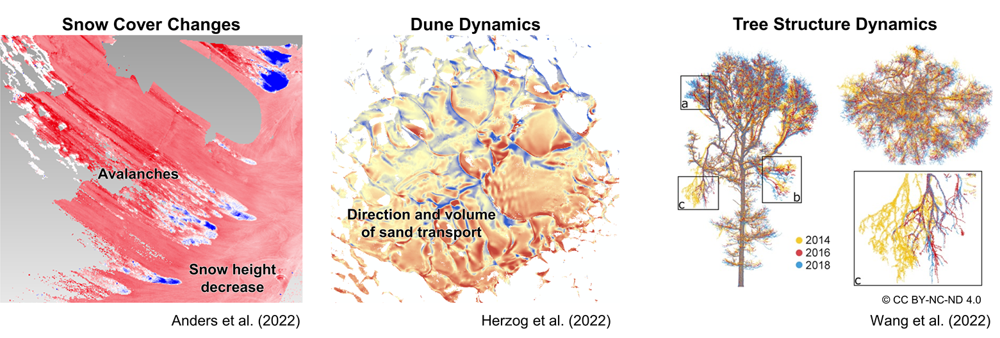

<i>Examples of different domains supported by change analysis of surface or structure dynamics in 3D/4D point clouds. Figures by K. Anders (left, middle) and [Wang et al. (2022)](https://doi.org/10.1016/j.jag.2022.102781) / [CC BY-NC-ND 4.0](https://creativecommons.org/licenses/by-nc-nd/4.0/) (right).</i>

### Multitemporal and 4D Point Clouds
For capturing and analyzing dynamics in the topography, the **temporal dimension** can be added to 3D point cloud data through repeat acquisition. Each point cloud acquired at one point in time represents a so-called **epoch**. Such repeat measurements provide **multitemporal point clouds** and changes can be assessed between epochs. We refer to **time series of point clouds**, if the acquisition is repeated to obtain a sequence of data. These time series are often acquired at more or less regular intervals, e.g., hourly, monthly, or annually (there is no strict definition). 

Multitemporal or time series of point clouds are widely available through repeat surveying at the national level, for example. Airborne laser scanning (ALS) point clouds of several years are openly available, e.g., for The Netherlands ([https://www.ahn.nl/](https://www.ahn.nl/)) or Norway ([https://kartverket.no/en](https://kartverket.no/en)). Further open data is made available on geographic data repositories such as [Open Topography](https://www.opentopography.org/) or [PANGAEA](https://pangaea.de/), often by research projects.

When point clouds are acquired at higher frequencies, the data may represent surface dynamics in their evolution rather than at single points in time (e.g., before and after an event or surface process). For such near-continuous temporal sampling, we speak of **4D point clouds**, as they contain a full temporal domain in addition to the 3D spatial domain (3D space + 1D time).

The figure below illustrates the additional information that can be obtained from 4D point clouds, where **surface processes are represented near-continuously**. The example is taken from the [use case of beach monitoring](../../data_usecases/usecase_beach_kijkduin.md). The map visualizes surface changes due to sand transport over three weeks. In this timespan, a sand bar formed which becomes apparent in the elongated shape of sand volume increase. As hourly point cloud data is available at this site, we can inspect the time series of topographic measurements, for example, at one location on the sand bar. From this, we can identify when the sand bar started forming via the onset of surface increase, and when it disappears at a later point (after Feb-27). We can derive further temporal properties, such as the change rate and also determine the highest magnitude of the sand bar during its existence. Overall, the example demonstrates how surface dynamics can be characterized in their spatiotemporal properties using 4D point clouds, compared to more limited information with sparse time series or multitemporal point clouds of few epochs. 

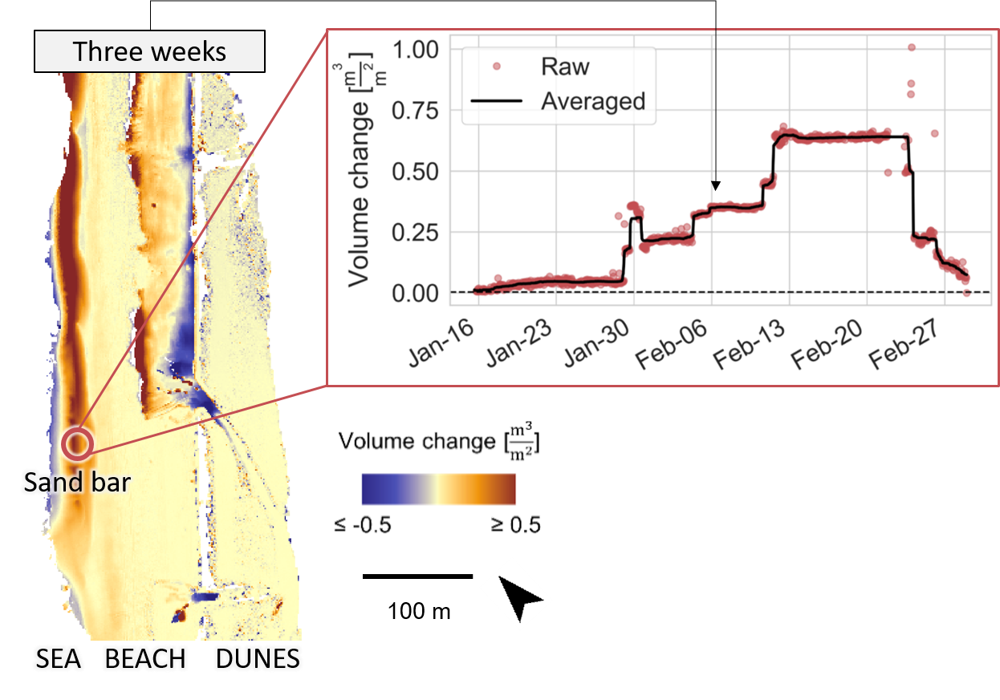

<i>Temporal surface information in bitemporal change representation (map on the left) and as near-continuous time series at a location in 4D point clouds (right). Figure by K. Anders, modified after [Anders et al. (2019)](https://doi.org/10.5194/isprs-annals-IV-2-W5-317-2019).</i>

### Concepts of Change in 3D/4D Point Clouds

This section gives a brief overview on concepts of change in multitemporal and 4D point clouds and on a typical change analysis workflow. Details on principles and methods of 3D/4D change analysis are part of [Theme 3](../03_3d_change_analysis/03_3d_change_analysis.ipynb).

Using topographic 3D point clouds, we are typically looking for changes in the geometry of the surface or objects. In general, a change analysis requires the following typical series of steps:

1. **Data acquisition**: Acquiring 3D/4D point clouds for the observation of surface dynamics includes considerations of typical aspects such as the geometric accuracy, spatial resolution and coverage (choice of sensors, platforms, and survey strategy). Regarding monitoring applications, an additional important consideration is the temporal resolution, i.e. acquisition frequency, with respect to the observed phenomena. An overview of different modes of point cloud acquisition will be given [in the following section](#point-cloud-acquisition).
2. **Co-registration**: Epochs in multitemporal 3D/4D datasets need to be aligned in a common coordinate reference frame to enable change measurements. This can be solved by accurate georeferencing of acquired data, but often additional fine alignment is applied to further increase the detectability of 'real' change, opposed to small offsets between surface positions in the point cloud. 
3. **Change detection and quantification**: This step is the core of any change analysis. Depending on the geographic setting and types of input data, there are various approaches to change analysis, and different methods using point clouds and rasterized data. Specific approaches and algorithms will be introduced in [Theme 3](../03_3d_change_analysis/03_3d_change_analysis.ipynb). 
4. **Uncertainty assessment**: Assessment of uncertainties associated to change detection and quantification is essential to interpret and communicate results. Different components contributing to uncertainty in change analysis and how to quantify them are part of [Theme 3](../03_3d_change_analysis/03_3d_change_analysis.ipynb).
5. **Change representation**: The final step in change analysis is the representation of changes, which is closely linked to the characteristics of observed surface dynamics and the analysis objective. Depending on the objective, the representation of uncertainties can even be essential to decision making, for example in the case of natural hazard monitoring.

[//]: <> (Natural hazard monitoring could be explicitly introduced as an example above, important case of topographic monitoring in the context of human-environment interaction)

To further familiarize yourself with approaches and applications of 3D change analysis, look into the review article by [Qin et al. (2016)](#references). For a first interactive experience of topographic change analysis from point cloud data, check out this [on-demand tool by OpenTopography](https://portal.opentopography.org/differencing?opentopoID=OTLAS.012013.26913.2), coming with an informative [tutorial video](https://youtu.be/BlDx66AQ3G0) ([Scott et al., 2021](#references)). It will perform simple vertical differencing of the elevation, and nicely visualize topographic change, in this example, due to dune migration:

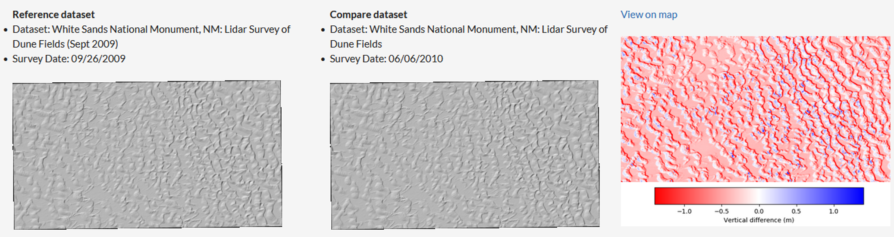

<i>Result of on-demand topographic differencing in OpenTopography showing the hillshades of terrain elevation for each LiDAR survey (left and middle), and resulting vertical differences (right). Data: White Sands National Monument, NM: LiDAR Survey of Dune Fields (Sept 2009). Lidar data acquisition and processing completed by the National Center for Airborne Laser Mapping ([NCALM](http://www.ncalm.org)). NCALM funding provided by NSF's Division of Earth Sciences, Instrumentation and Facilities Program (EAR-1043051). Distributed by [OpenTopography](https://doi.org/10.5069/G9ZK5DMD) / [CC BY 4.0](https://creativecommons.org/licenses/by/4.0/).</i>

The remainder of this theme will focus on basic principles of point clouds acquisition and processing for change analysis or monitoring in general.

## Point Cloud Model and Fundamental Operations

This section introduces sources and characteristics of point clouds, the corresponding data model, and fundamental point cloud operations as a basis to processing steps in 3D/4D point cloud analysis.

### Point Cloud Acquisition 

3D point clouds can be acquired with different sensing techniques and survey strategies. The most common source of point cloud data is laser scanning ([Otepka et al., 2013; Telling et al., 2017](#references)) and photogrammetry (via dense image matching techniques; [Passalacqua et al., 2015](#references)). A broad overview of Earth observation sensors, platforms, and their properties is given in [Theme 1 of Module 1](../../module1/01_principles_of_remote_sensing_time_series/01_principles_of_remote_sensing_time_series.md#remote-sensing-systems-platforms-and-sensors). Regarding 3D/4D point clouds, the acquisition mode spans terrestrial, UAV-borne, and airborne (i.e. aircraft-based) platforms. The acquisition platform is decisive for the spatial and temporal scales at which data can be captured.

<!--

<i>Sources of laser scanning data covering different ranges of typical spatial and temporal resolutions. Figure by course authors. Image sources: [Pixabay](https://pixabay.com/de/service/terms/) by [AlexandrVe](https://pixabay.com/de/illustrations/machen-modell-3-d-reaktive-ebene-1447942/) and [AlanLiu](https://pixabay.com/de/photos/uav-industrial-design-design-1204473/), and [Riegl LMS GmbH]() / ???. </i>

-->

Airborne acquisition is usually not performed more than once a year, due to the high cost and effort. UAV-based acquisition can be repeated more frequently, but still requires operators to be on site, which also poses a cost factor for each repetition of a survey. The repetition interval of terrestrial laser scanning (TLS), at the moment, is limited only by the duration of individual scans themselves. A scan can be repeated as soon as the acquisition of a current scan is finished, if the instrument remains at one, fixed position. 

Automatic TLS has become possible with the availability of programmable laser scanning instruments. By setting up TLS instruments in fixed positions for several days to years, **permanent 3D observation systems** have been developed, which acquire the surrounding scene at scheduled intervals from minutes to days ([Eitel et al., 2016](#references)). An alternative to laser scanning are fixed installations of time-lapse 3D photogrammetry. A collection of selected examples for both are given with the figures below:

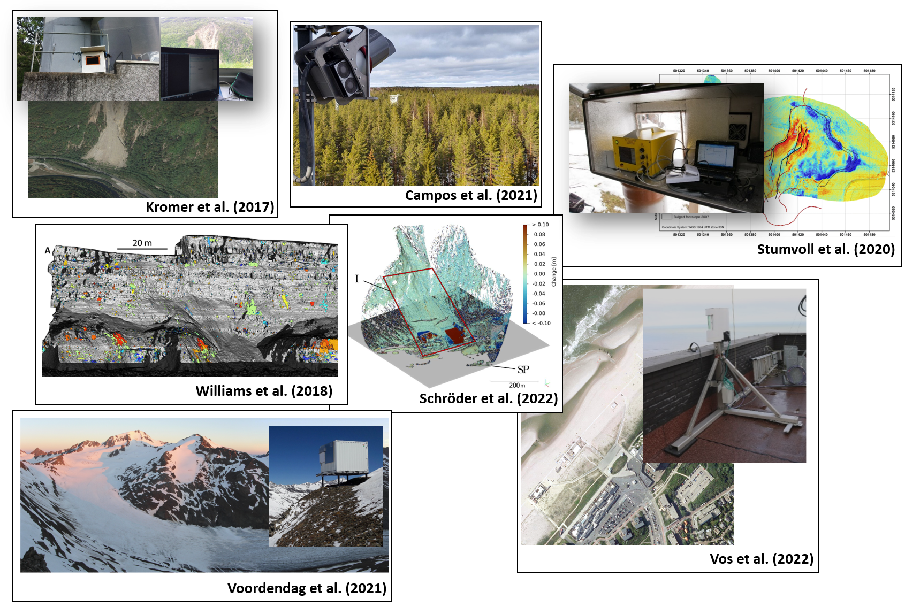

<i>Selected examples of automatic TLS for 4D point cloud acquisition in different geographic settings. Figures by [Kromer et al. (2017)](https://doi.org/10.5194/esurf-5-293-2017) / [CC BY 3.0](https://creativecommons.org/licenses/by/3.0/), [Campos et al. (2021)](https://doi.org/10.3389/fpls.2020.606752) / [CC BY 4.0](https://creativecommons.org/licenses/by/4.0/), [Stumvoll et al. (2020)](https://doi.org/10.1007/s10064-019-01632-w) / [CC BY 4.0](https://creativecommons.org/licenses/by/4.0/), [Williams et al. (2018)](https://doi.org/10.5194/esurf-6-101-2018) / [CC BY 4.0](https://creativecommons.org/licenses/by/4.0/), [Winiwarter et al. (2022a)](https://doi.org/10.5194/esurf-2021-103) / [CC BY 4.0](https://creativecommons.org/licenses/by/4.0/), [Vos et al. (2022)](https://doi.org/10.1038/s41597-022-01291-9) / [CC BY 4.0](https://creativecommons.org/licenses/by/4.0/), and [Voordendag et al. (2021)](https://doi.org/10.5194/isprs-annals-V-2-2021-153-2021) / [CC BY 4.0](https://creativecommons.org/licenses/by/4.0/). </i>

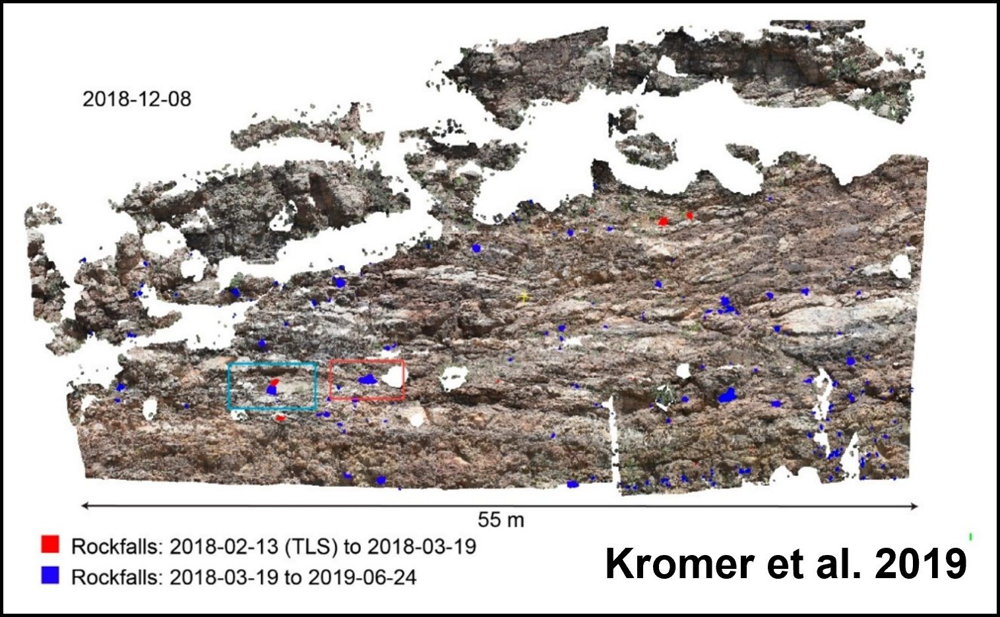

<i>Example of automatic time-lapse photogrammetry for 4D point cloud acquisition for rockfall monitoring. Figure by [Kromer et al. (2019)](https://doi.org/10.3390/rs11161890) / [CC BY 4.0](https://creativecommons.org/licenses/by/4.0/).</i>

Accordingly, permanent TLS and 3D photogrammetry has been used to observe vegetation dynamics ([Campos et al., 2021](#references)), landslides ([Kromer et al., 2017; Stumvoll et al., 2020](#references)), rockfalls ([Kromer et al., 2019; Williams et al., 2018](#references)), glaciers ([Voordendag et al., 2021](#references)), beach environments ([O'Dea et al., 2019; Vos et al., 2022](#references)), and soil erosion ([Eltner et al., 2017](#references)), among others. More information on the requirements and special characteristics of permanent 3D acquisition is given in [Theme 4 of this module](../04_3d_timeseries_analysis/04_3d_timeseries_analysis.ipynb).

An alternative strategy for generating point clouds is **virtual laser scanning (VLS)**, which has gained increasing importance in recent years. VLS simulates the acquisition of LiDAR point clouds by scanning virtual 3D scenes by any combination of input 3D models, platforms, and sensors. The suitability of simulated laser scanning data mostly depends on the application, and simulations that are more realistic come with stricter requirements on input data quality and higher computational costs ([Winiwarter et al., 2022b](#references)). VLS can be useful in different use cases: survey planning, method development, and generation of training data for machine learning.

* **Survey planning**: The objective of data acquisition is typically to minimize cost and effort while obtaining data that is fit for the purpose of the planned analysis, e.g. characterization of specific surface processes. With VLS, a 3D point cloud can be generated and tested for its usability in the planned application, by applying the planned analysis method. 
* **Method development**: In 3D/4D point cloud analysis, we are often developing methods to extract certain features describing our objects or surface processes of interest. Real point cloud data to calibrate algorithms and validate results are costly to acquire and not error free. Here, VLS can be used to generate data with perfectly know reference values, e.g., if synthetic changes are applied to a virtual scene in case of 4D applications.
* **Generation of training data for machine learning algorithms**: Recently, several methods for deep learning on point clouds have been presented. However, such methods require immense amounts of training data to achieve acceptable performance. We present how VLS can be used to generate training data in machine learning classifiers, and how different sensor settings influence the classification results.

A pioneer study using **4D VLS point cloud** for change detection is presented by [Winiwarter et al. (2022a)](#references). In this study, VLS point clouds of different ALS acquisition settings are generated to evaluate at which flight altitude a specific target change can be detected using an available analysis method. This consideration has high practical relevance, since it supports decision making of stakeholders, for example, in the context of natural hazard management. 

 VLS data can be acquired using the scientific open source software HELIOS++ ([Winiwarter et al., 2022b](#references)). HELIOS++ is implemented in C++ for optimized runtimes, and provides bindings in Python to allow integration into scripting environments (e.g., GIS plugins, Jupyter Notebooks). A variety of model types to represent 3D scenes are supported: terrain models, voxel models, and mesh models. As platforms, four options are currently supported: airplane, multicopter, ground vehicle and static tripod. In the figure below, a schematic diverging laser beam and its corresponding waveform (magenta) is shown being emitted from the airplane and interacting with a mesh model tree and the rasterized ground surface.

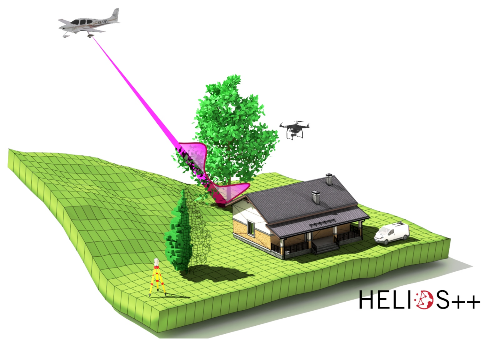

<i>Schematic concept of virtual laser scanning with HELIOS++, showcasing platforms (tripod, car, UAV, airplane) and 3D object models (mesh, point cloud, voxels, raster) composing a scene. Figure by [Winiwarter et al. (2022b)](https://doi.org/10.1016/j.rse.2021.112772) / [CC BY 4.0](https://creativecommons.org/licenses/by/4.0/).</i>

In this module, you will learn to create VLS point clouds with HELIOS++ for your own analyses ([exercise in Theme 2](../02_pointcloud_programming_python/exercise/m3_theme2_exercise1.ipynb)). For alternative implementations of LiDAR simulation and their specific purposes and differences, see the detailed literature review in [Winiwarter et al. (2022b)](#references)

### Point Cloud Data Model

In this section, we have a closer look at the data model of point clouds and their characteristics depending on the data source and acquisition mode. Aspects beyond the point cloud itself, such as metadata and supplementary data, will be considered in a later section on [data management of 4D point clouds](#data-management-of-4d-point-clouds).

A point cloud is an unorganized set of **points in three-dimensional cartesian space** ([Otepka et al., 2013](#references)). Each point has three coordinates X, Y, and Z, and can have an arbitrary number of attributes (or none). The composition of a point cloud is illustrated in the figure below, with the corresponding data entries in tabular format. Therein, one point is stored in each row with attributes in columns in addition to the xyz coordinate.

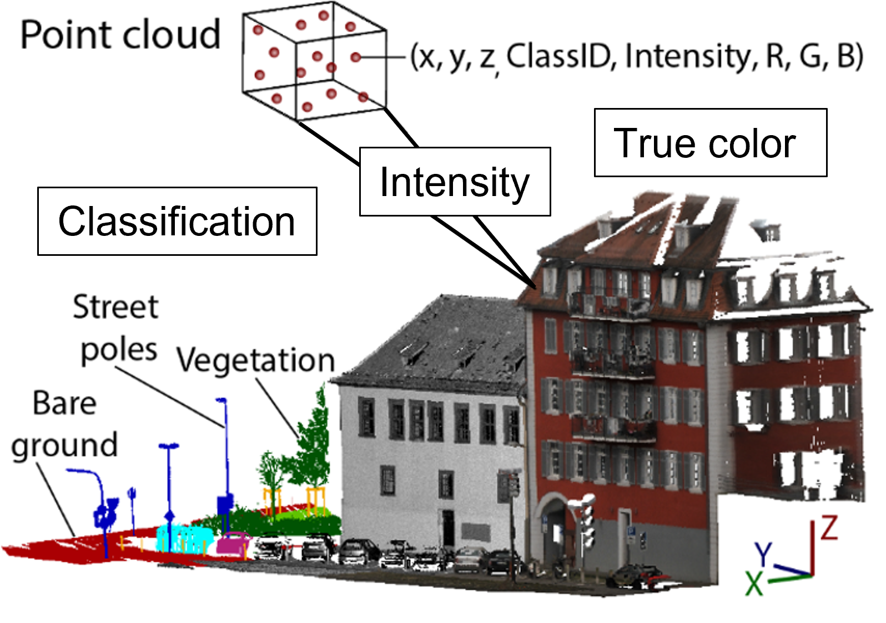

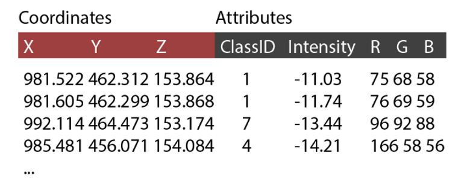

<i>Visual and tabular representation of a 3D point cloud with three coordinates (XYZ) and attributes classification (ID), LiDAR backscatter (Intensity), and true color (RGB). Figure by K. Anders, modified after [Ghamisi et al. (2019)](https://doi.org/10.1109/MGRS.2018.2890023).</i>

Typical **attributes** for LiDAR point clouds (i.e. acquired via laser scanning) are the LiDAR intensity and information on multiple returns. LiDAR measurements do not include color information, but RGB information can be added from images that are taken in addition to scanning ([Ghamisi et al., 2019](#references)). This step belongs to the concept of [data fusion](#multisource-and-multitemporal-data-fusion). Point clouds which are acquired with photogrammetric techniques directly contain RGB as attribute from the original photographs, which are used for 3D reconstruction through dense image matching ([Westoby et al., 2012](#references)).

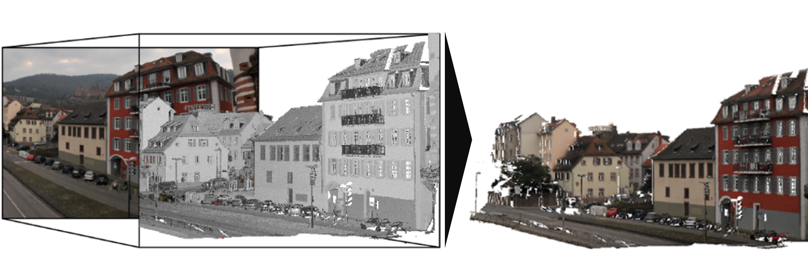

<i>Fusion of photographic data with a LiDAR point cloud by assigning color values as RGB attributes to the point cloud. Figure by K. Anders, modified after [Ghamisi et al. (2019)](https://doi.org/10.1109/MGRS.2018.2890023).</i>

Point clouds can be used to derive other data models or GIS layers as result of analysis. The most common derivative of point clouds are **rasters**. They can be 2D projections of any attribute information onto raster cells. Also the geometric information can be gridded to represent the topography. Deriving, for example, a Digital Terrain Model (DTM) from point clouds results in a 2.5D represenation of the topography: 2D raster locations with elevation values. This typically entails decisions for a fixed resolution and interpolation of data, e.g. when gridding the terrain in a DTM ([Pfeifer & Mandlburger, 2008](#references)). The unorganized nature of the point cloud allows to have different point spacing within a scene, i.e. a denser representation of the terrain by 3D points in some parts than in others. In contrast, a rasterized terrain representation either has exactly one value or no value (NoData) per cell:

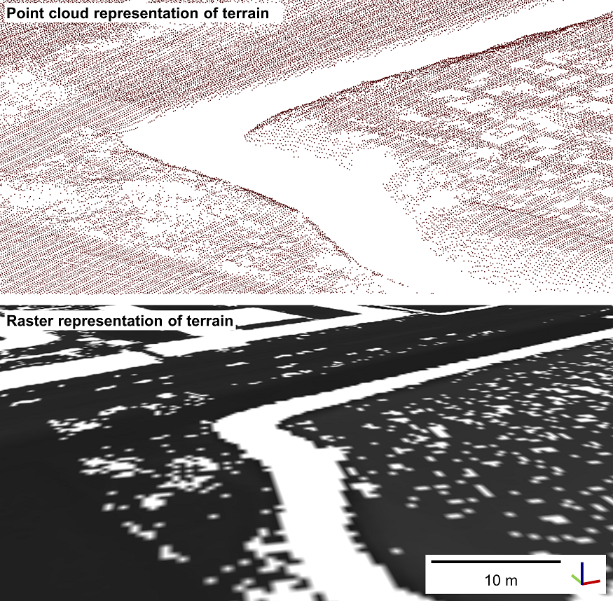

<i>Comparison of terrain representation as point cloud and raster. Figure by course authors.</i>

The geometry of full 3D objects, such as trees, cannot be represented in rasters. Especially when analyzing complex geometries or surface dynamics, conducting **analyses in full 3D** has the important advantage of avoiding information loss compared to raster-based analysis. 

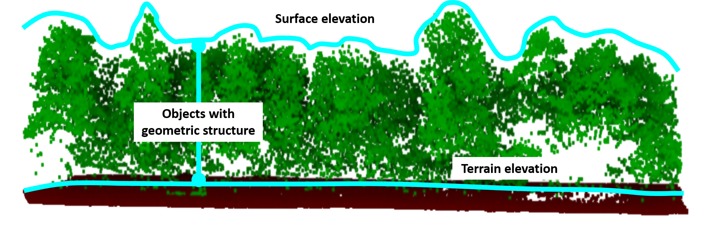

<i>Representation of terrain, surface and object structure in 3D point clouds. Figure by course authors.</i>

In this module, you will learn about change analysis methods using the full 3D data provided by point clouds, as well as raster-based methods when deriving rasterized terrain models from point cloud data (especially in [Themes 2](../02_pointcloud_programming_python/02_pointcloud_programming_python.ipynb) and [3](../03_3d_change_analysis/03_3d_change_analysis.ipynb)). If you would like to get deeper into concepts of terrain interpolation from 3D point clouds, take a look at [Pfeifer & Mandlburger (2008)](#references).

### Multisource and Multitemporal Data Fusion 

3D point clouds of a scene are often available from multiple sources. Particularly in case of multitemporal data, point clouds may have been acquired from various sensors and platforms throughout a full observation period of a site throughout many years. For change analysis, it is often desirable to use as many point cloud epochs as possible, to assess the state of the topography at many points in time. Combining data from multiple sources and/or multiple points in time is referred to as data fusion ([Ghamisi et al., 2019](#references)).

[//]: <> ([TODO] Check with other modules where this is mentioned and in what depth. Add links and harmonize. module 1?)

For point clouds, an example of **multisensor fusion** is the combination of laser scanning and photogrammetric point cloud. This can regard attributes, which are assigned from one point cloud to the other based on spatial proximity of points (we will have a look at neighborhood operations in the [next section](#neighborhood-operations-and-neighborhood-based-attributes)). Apart from an increase in attributes, fusion can yield an increase in coverage. For example, terrestrially acquired point clouds which suffer from occlusion can be complemented by UAV-borne point clouds with higher completeness in certain areas of the scene. Multitemporal fusion regards the combination of measurements which were acquired at different points in time.

Temporally, point clouds can be fused to obtain one multitemporal point cloud dataset or time series to perform change analysis on ([Ghamisi et al., 2019](#references)).
With respect to the data model, **temporal fusion** can yield a time series where each epoch is a separate point cloud. Accordingly, the spatial sampling between epochs can differ. This applies even for repeat acquisitions from a single, fixed TLS position, as no point in a scene is ever measured twice by 3D surveys. Alternatively, temporal fusion can add measurements per epoch as attribute to one single point cloud, thereby storing the change in a feature (incl. geometric features) for the same set of 3D points. Assigning multitemporal measurements, possibly from different data sources, to the same 3D points, requires spatial neighborhood operations - a fundamental step in any 3D data analysis - which are introduced in the following section.

### Neighborhood Operations and Neighborhood-Based Attributes

Calculations based on the neighborhood are among the most important operations when working with point cloud data, besides standard geospatial operations, such as attribute-based calculations, coordinate transformations and distribution measures. They are required for almost any filtering, smoothing or interpolation step, and for (surface) modeling and information extraction.
Neighborhoods mainly regard the spatial neighborhood of 3D points, but can also include the temporal neighborhood.

#### Spatial Neighborhood

Spatial neighborhoods in a point cloud are subsets of all points in a point cloud defined either by a fixed distance or by a fixed number of nearest neighbors ([Weinmann et al., 2015](#references)). 
The **fixed distance** can be in 2D. It is then called a **cylindrical neighborhood**. This means that all 3D points belong to a local neighborhood whose 2D projection on a plane are within a circle of given radius.
For a horizontal plane, this means that all points whose XY coordinate is within the radius around the search point belong to the neighborhood of that point - irrespective of their height (Z value). Fixed-distance neighborhoods can also be 3D. In this case they are **spherical neighborhoods**, as the neighborhood radius is considered in all three dimensions.

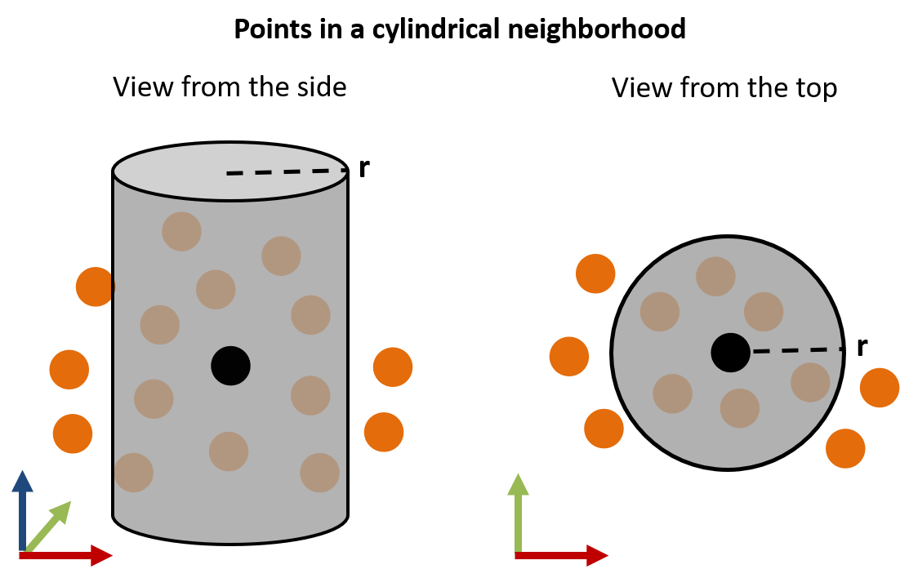

<i>Cylindrical point cloud neighborhood of a 3D point (black) with a fixed 2D distance of radius r in a schematic view from the side (left) and above (right). Figure by course authors.</i>

Besides radius-based distances, one can also use **box neighborhoods** in either 2D or 3D. In 2D, a neighborhood is then similar to points lying within a raster cell. In 3D, the 2D cell becomes a box and the vertical point position is considered.

In contrast to a fixed distance, a point cloud neighborhood can be defined by a **fixed number of neighbors**. The number of neighbors is conventionally specified as *k*, so that the concept is known as k nearest neighbors (**kNN**). The search of kNN around a point can, again, be performed in 2D or in 3D Euclidian distances.
The size of kNN neighborhoods can be highly different within a neighborhood, depending on the local point density. In the same way, the number of neighbors in the fixed-distance neighborhood varies depending on the point density.

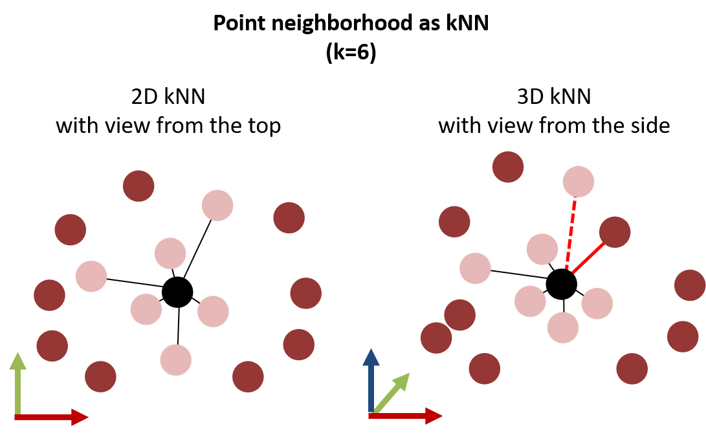

<i>Point cloud neighborhood around a 3D search point (black) with a fixed number of k nearest neighbors in 2D (left) and 3D (right). When considering the 3D Euclidian distance, the point neighborhood may change, because a point may have a vertically large distance compared to another point which is horizontally further away (indicated by the red connection lines). Figure by course authors.</i>

We generally need to consider two aspects when deciding on the definition of the spatial neighborhood in a point cloud:

1. **Neighborhoods may be empty** when using a fixed distance, if there is no other point in the point cloud at the specified distance around a search point.
2. **Neighborhoods may not be unique** when using a fixed number of neighbors, for example if a group of 3D points is spatially isolated so that each of the points shares the same neighborhood including each other (i.e., same set of kNN).

 For some applications, it may be helpful to combine a fixed distance neighborhood with a fixed number of kNN to overcome drawbacks of each. Accordingly, one may avoid empty neighborhoods by setting a large distance radius, but restricting the number of neighbors to the k nearest points. Depending on the purpose of the operation, there are even more advanced methods for neighborhood selection, such as quadrant- or octant-based kNN. If you would like to learn more about this, you may look into [Pfeifer et al. (2014)](#references).

**So what can the neighborhood of a point tell us?**
A basic attribute to be derived from the spatial neighborhood is the **point density** within a point cloud. The 3D point density, for example, can be derived as the number of points (kNN) within the radius of a local sphere:

$$ 
D = {k+1 \over {4 \over 3} \pi r{^3}_{kNN}} 
$$

By calculating the point density like this for every point in a point cloud, we can tell for the entire point cloud how many points are contained within a radius of, e.g., 1.0 m, in a certain area of the scene. This information can also be used to identify isolated points and removing outliers. A common method for this is the *statistical outlier removal* (SOR; [Rusu & Cousins, 2011](#references)). A selection of further useful point cloud features to be derived from the spatial neighborhood are:
* **normal vectors**
* **principal components on local point distribution**
* **the local surface roughness**

We will have a look at these in the remainder of this theme. But first, since we are dealing with time series, let's have a look at the concept of temporal neighbors.

#### Temporal Neighborhood
The temporal neighborhood regards measurements of a variable at the same spatial location prior or successively to a certain point in time. For time series, the neighborhood is typically defined as a temporal window of a certain timespan.
For 3D/4D point clouds, most times a combination of spatial and temporal neighborhoods is used. In the same way that spatial neighbors are searched among the 3D points within one point cloud, they may be searched in another, separate point cloud. **You may note:** looking for spatially close points in the temporal neighborhood (i.e., another point cloud epoch), yields information on how properties of these neighboring points change over time, e.g. through attribute differences or height differences. Being aware of possible neighborhood operations in multitemporal point clouds, gives you already one point cloud-based approach of change analysis (with more to come in [Theme 3 of this module](../03_3d_change_analysis/03_3d_change_analysis.ipynb)).

The spatial-temporal neighborhood is used in an approach for 4D point cloud processing by [Kromer et al. (2015)](#references) to filter noise from the data. The concept uses the redundancy of frequent and spatially dense measurements in 4D point clouds and averages each point to the median of points which are neighboring in space and time:

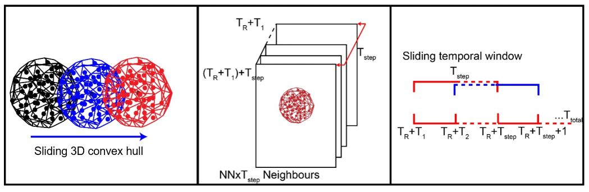

<i>Spherical spatial neighborhoods (left) and temporal window neighborhood (right) are combined to a spatiotemporal neighborhood (middle) to perform noise filtering in 4D point clouds, with number of neighbors NN, reference point cloud Tref and temporal window Tstep. Figure modified from [Kromer et al. (2015)](https://doi.org/10.3390/rs71013029) / [CC BY 4.0](https://creativecommons.org/licenses/by/4.0/).</i>

#### Normal vector and 3D structure tensor 

Coming back to the spatial neighborhood, this section introduces the concept of the normal vector in 3D point clouds. The normal vector is the surface normal of a tangent plane. Fitting a plane to a set of points therefore allows us to **characterize point neighborhoods as local surfaces**, even though each 3D point itself has no dimensionality.

So if you think of a surface in a scene which is sampled by a 3D point cloud and fit a tangent plane to these measurements, the normal vector is perpendicular to the plane and reflects the direction into which the plane is oriented:

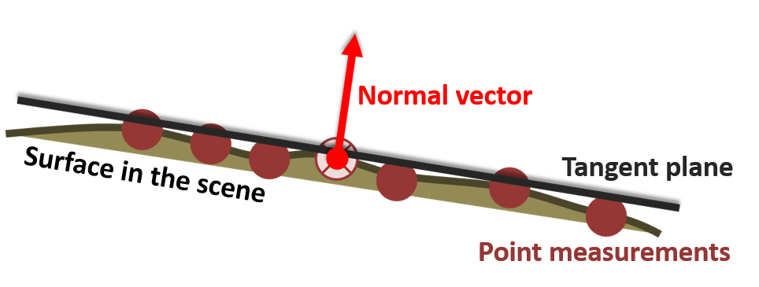

<i>Normal vector of a tangent plane fit to a set of 3D points, which are sampled on a surface in the scene. Figure by course authors.</i>

The normal vector of a plane in 3D has three direction components $n_x$, $n_y$, and $n_z$, which describe the direction in three-dimensional space.

The normal vector of a point in a point cloud is estimated by adjusting a plane to all points in its local neighborhood. A plane can be adjusted to a set of point using least-squares regression. In 3D space, this means minimizing the orthogonal distances of points to the (unknown plane), i.e. finding the best set of plane parameters. The result of this plane adjustment are the plane parameters (see below) and the residual distance of the adjustment based on point distances to the fitted plane ([Dorninger & Nothegger, 2007](#references)).

The plane parameters derived with a plane fit in 3D cartesian space are based on the *Hessian* normal form with the following equation:

$$ 
0 = d + n_x + n_x + n_z 
$$

with $n_x$, $n_y$, $n_z$ representing the normal vector, and $d$ representing the normal distance of the plane to the origin of the Cartesian coordinate system. 

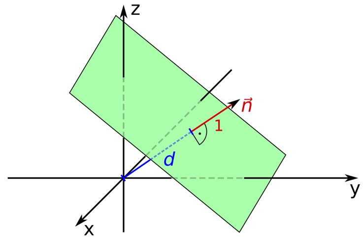

<i>Definition of a plane with parameters according to the Hessian normal form. Figure by [Quartl](https://commons.wikimedia.org/w/index.php?curid=31080804) / [CC BY-SA 3.0](https://creativecommons.org/licenses/by-sa/3.0/deed.en).</i>

As surfaces in point clouds scenes are rarely perfectly planar, a simple least-squares plane fit is not robust to outliers or edges, where part of the neighboring points strongly deviate from the actual planar surface. Robust local regression planes can be derived by considering outliers using weighting of points based on their residual distances, and excluding outliers from the final plane adjustment ([Dorninger & Nothegger, 2007](#references)).

In the context of the local regression plane, there is more information to be obtained about local spatial point cloud characteristics to describe the scene. **Principal component analysis (PCA)** allows us to assess how points are dispersed around their center (search point or centroid). By spanning the covariance matrix, we can derive the **3D structure tensor** formed by eigenvalues and eigenvectors. These describe the principal components of directions into which 3D points are dispersed. If you are not familiar with the concept of PCA and eigenvalue decomposition, you may have a look at [this tutorial](https://jakevdp.github.io/PythonDataScienceHandbook/05.09-principal-component-analysis.html) ([VanderPlas, 2016](#references)).

[//]: <> (harmonization: is PCA explained in another module? And is there a more suitable tutorial on point clouds or in general?)

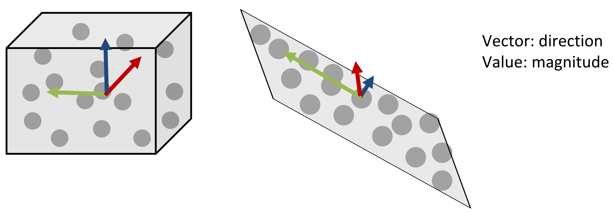

<i>Schematic of principal components for two sets of 3D point. Figure by course authors.</i>

If we look at the box in the figure above, the points are dispersed into all three directions. Accordingly, the eigenvectors are pointing into all directions with similar magnitude, i.e. the eigenvalues have the same scale. The example of a plane (right figure above) demonstrates how the components of the eigenvector on the plane are very large (red and green arrows), whereas the component perpendicular to the plane is small (blue arrow). Thereby, PCA provides information about the planarity of a point neighborhood: if you take the smallest eigenvalue, denoted by $\lambda$, this represents the direction where there is least dispersion of points. The corresponding eigenvector represents the surface normal of the plane. If you'd like to go further into normal estimation using PCA, look into [this tutorial by the Point Cloud Library (PCL)](https://pcl.readthedocs.io/projects/tutorials/en/pcl-1.12.0/normal_estimation.html).

Further information on the 3D structure of points can be expressed based on the eigenvalues. For example, the ratio to the sum of eigenvalues describes the change in curvature, which corresponds to local surface variation:

$$
\lambda_3 \over {\lambda_1 + \lambda_2 + \lambda_3}
$$

with $$ \lambda_3 < \lambda_2 < \lambda_1 $$

Find out more about geometric interpretations of the 3D structure tensor and **shape features based on eigenvalues** in [Weinmann et al. (2015)](#references).

Another point feature to be exploited from the local plane adjustment is the **roughness**. The surface roughness as point feature expresses the discrepancy between an ideal surface (i.e. plane fit) and the actual surface (point distribution). This roughness can therefore be derived as the standard deviation of residual distances of the plane fit, or via the smallest eigenvalue of the 3D structure tensor (as described for the figure above).

For all geometric operations and features, it is important to bear in mind that they are **scale-dependent**, i.e. always depending on the size of the spatial neighborhood. Consider a plane fit to point neighborhoods in the following figure, with a large radius on the left and smaller radius on the right - resulting in different orientations of the local surfaces. This must be considered when parametrizing any analysis and should be determined regarding the respective objective.

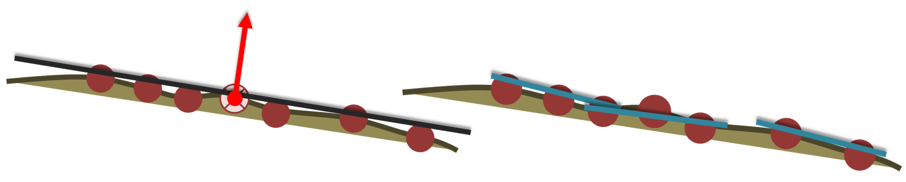

<i>Scale-dependent roughness where the local plane fit depends on the size of the spatial neighborhood. Figure by course authors.</i>

The following figure shows how different radii affect the derived roughness of a surface. Here you can see the roughness derived for three different radii on a small extent of a laser scanning point cloud of a rock glacier (you will use this [use case](../../data_usecases/usecase_rockglacier_ahk.md) in the exercise and throughout the module).

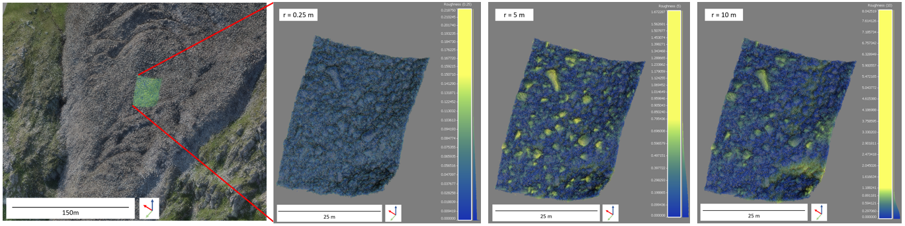 

<i>Roughness derived for radii r of 0.25 m, 5 m and 10 m (left to right) for an area of a rock glacier point cloud, derived as standard deviation of residual distances of points to a local plane fit. Figure by course authors.</i>

A smaller radius (0.25 m) yields lower roughness values here, as the planes can be well fit to the local surfaces of boulder faces composing the rock glacier surface. Larger radii yield higher roughness values, as the surface is composed of multiple boulders at these scales, and plane fits represent the overall topography of the rock glacier tongue.

### Transformation of 3D point cloud data

Transformation of point cloud data is another fundamental task in many analysis. 3D coordinates of points need to be transformed, for example, to register the data in coordinate reference systems (i.e., georeferencing). Transformation is further used to improve the co-registration between datasets, particularly multitemporal point clouds. There is a dedicated section on [alignment for 3D change analysis](../03_3d_change_analysis/03_3d_change_analysis.ipynb) in the corresponding theme on principles of 3D change analysis. Here, we get familiar with some principles:

In general, transformation can be split into three components: **translation, rotation, and scaling**. Translation regards the shift of the coordinates in X, Y, and/or Z direction. Rotation is conducted around the X-, Y-, and/or Z-axis respectively. applying a rotation, it is crucial to know what the rotation center of the point cloud is. Without any prior translation, the rotation center is at the origin (0, 0, 0) of the Cartesian coordinate system. Translation and rotation represent a **rigid transformation**, whereas additional scaling would represent **affine transformation**. Scaling is usually not applied LiDAR measurements, which are accurate in (relative) metric space. Scaling may be required for photogrammetric data, which inherently contain no information on absolute measures in the scene. 

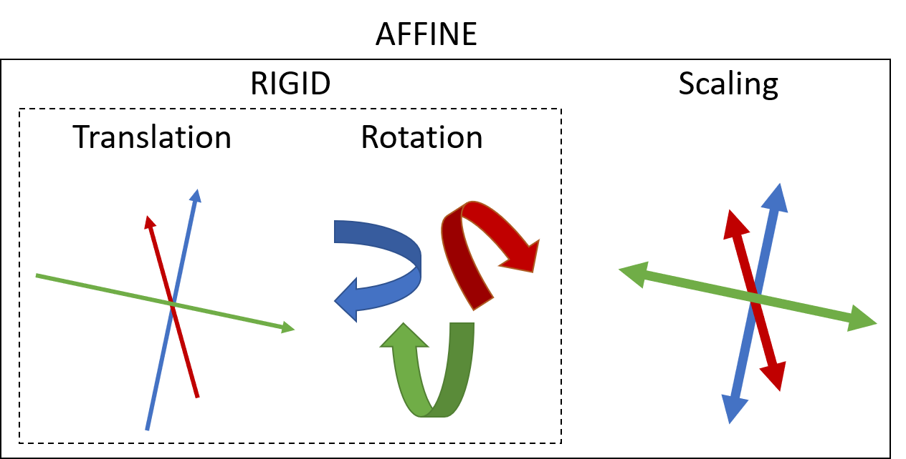

<i>Components of transformation representing rigid and affine transformation. Figure by course authors.</i>

## Data Management of 4D Point Clouds 

### Data formats
Point cloud data can be stored in many formats, including tabular representations of plain-text ascii. The best practice is to adhere to the open binary **LAS format**, which is the de-facto standard following the [specification of the American Society for Photogrammetry and Remote Sensing (ASPRS)](https://www.asprs.org/divisions-committees/lidar-division/laser-las-file-format-exchange-activities). With the [LAZ format](https://laszip.org/), there is a losslessly compressed version LAS, which strongly reduces file sizes.
For repeat acquisitions, or 4D point clouds, data is usually available as one point cloud file per epoch, i.e. point in time of acquisition. 

In practice, 4D data is often made accessible by appending the observed variables or change attributes to a set of *core points* (more on that in [Themes 3](../03_3d_change_analysis/03_3d_change_analysis.ipynb) and [4](../04_3d_timeseries_analysis/04_3d_timeseries_analysis.ipynb) of this module). By this, for each location in a 3D scene, the full temporal information on each variable is available (corresponding to a 1D time series).

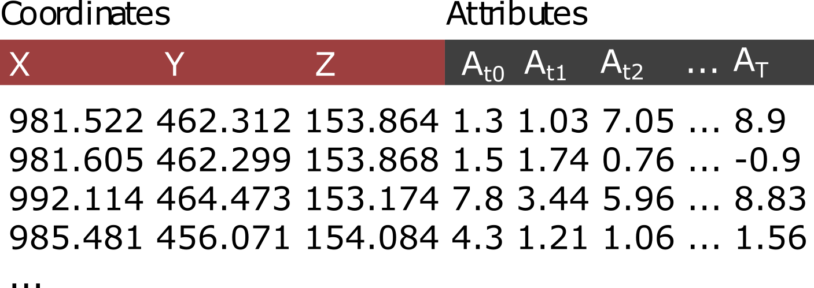

<i>Point cloud model with XYZ coordinates and attributes of a variable A for each point in time t of T epochs in the point cloud time series. Figure by K. Anders, modified after [Ghamisi et al. (2019)](https://doi.org/10.1109/MGRS.2018.2890023).</i>

### Metadata and Supplementary Datasets
As with any type of geodata, metadata on 3D/4D point clouds are essential for their analysis and determining the fitness of purpose for certain tasks. When working with point cloud data, it should always be documented by which **instrument** the data was acquired (including the sensor, model, platform, measurement accuracy and other specifications). Further metadata regards **survey information**, so for example the trajectory of aerial/mobile acquisitions or scan positiopns of terrestrial laser scanning, which provides insight into the survey geometry (e.g., measurement range and incidence angle, if not available as point cloud attributes).
Other metadata that is required is the **coordinate reference system (CRS)** of the 3D points in the point clouds. Since [LAS format version 1.4](https://www.asprs.org/divisions-committees/lidar-division/laser-las-file-format-exchange-activities) it is required to define the coordinate system in the LAS file. But up to now, CRS information is often not contained in the point cloud file itself and must be separately documented.

When point clouds are provided at a certain processing level (cf. [Otepka et al., 2013](#key-literature)), a full documentation of this processing must be provided and wherever useful, also the files or scripts used to apply the processing. In the context of 4D point clouds, this shall specifically mention registration information. Multitemporal point clouds are often registered to fit some reference point cloud, improving single-epoch georeferencing for change analysis. Any of these [point cloud transformations](#transformation-of-3d-point-cloud-data) should be provided with additional files containing the matrices. The rationale of this is to always allow reverting modifications of the data. This is relevant, for example, if improved methods become available in the future.

And the most important when working with temporal information is to always provide timestamps corresponding to the acquisition of each epoch. Only this time information allows any inference about, for example, change rates or other process properties observed in the data.

## Self-evaluation quiz
You have now completed the theme contents. Use the following quiz to evaluate yourself - do you remember the important aspects, did you learn about *Principles of 3D/4D geographic point clouds*? If you are struggling with the following questions, revisit some of the topics or consider looking into additional resources (e.g., linked in the theme contents).

<form name="quiz" action="" method="post" onsubmit="evaluate_quiz(); return false">
<!--Question 1-->
<label for="q_01">
What is the standard data format to store point cloud files?
</label> 
<textarea rows = "5" cols = "50" name = "q_01"></textarea> 

LAS
  

<output id="output_q_01">
</output>
    
     

<!--Question 2-->    
<label for="q_02">
Which of the following attributes is not contained in laser scanning point clouds without performing fusion operations?
</label> 
<input type="radio" name="q_02"> XYZ (coordinate) 
<input type="radio" name="q_02"> Intensity (LIDAR backscatter) 
<input type="radio" name="q_02"> RGB (color) 

RGB (color)
  

<output id="output_q_02">
</output>
    
         

<!--Question 3-->    
<label for="q_03">
Check the correct answer: Virtual laser scanning provides a means to
</label> 
<input type="radio" name="q_03"> operate a laser scanner in an augmented reality, but no data is generated of the surrounding scene 
<input type="radio" name="q_03"> simulate laser scanning acquisitions of virtual 3D scenes, for example, to test acquisition strategies or new methods 
<input type="radio" name="q_03"> increase the spatial detail of point clouds acquired in real-world scenes by adding virtual point measurements 

simulate laser scanning acquisitions of virtual 3D scenes, for example, to test acquisition strategies or new methods
  

<output id="output_q_03">
</output>
    
        

<!--Question 4--> 
<label for="q_04">
Sort the following typical steps of 3D change analysis by their order. If you do not know what a step means, revisit the contents: 
Co-registration, Change detection and quantification, Data acquisition, Change representation, Uncertainty assessment
</label> 
<textarea rows = "5" cols = "50" name = "q_04"></textarea> 

Data acquisition > Co-registration > Change detection and quantification > Uncertainty assessment > Change representation
  

<output id="output_q_04">
</output>
    
    

<!--Question 5--> 
<label for="q_05">
What useful metadate or supplementary files should be provided with 4D point clouds? Name at least 3.
</label> 
<textarea rows = "5" cols = "50" name = "q_05"></textarea> 

Instrument used for acquisition, sensor settings, acquisition platform, timestamp of each point cloud epoch, transformation matrices for co-registration, details about applied processing,...
  

<output id="output_q_05">
</output>
    
    

<!--Question 6--> 
<label for="q_06">
What are the two possibilities to define a spatial neighborhood in 3D point clouds?
</label> 
<textarea rows = "5" cols = "50" name = "q_06"></textarea> 

Spatial neighborhoods in 3D point clouds can be defined via a fixed distance or a fixed number of neighbors.
  

<output id="output_q_06">
</output>
    
   

<!--Question 7--> 
<label for="q_07">
Which one of these local point cloud properties cannot be described with the normal vector?
</label> 
<input type="radio" name="q_07"> surface orientation 
<input type="radio" name="q_07"> surface roughness 
<input type="radio" name="q_07"> surface density 

surface density
  

<output id="output_q_07">
</output>
    
  

<!--Question 8-->
<label for="q_08">
Which transformation type is included in affine transformation and not in rigid transformation?
</label> 
<input type="radio" name="q_08"> scaling 
<input type="radio" name="q_08"> translation 
<input type="radio" name="q_08"> rotation 

scaling
  

<output id="output_q_08">
</output>
    
  

<!--Question 9-->
<label for="q_09">
Sort the following 3D acquisitions strategies by time interval, at which acquisitions can be repeated (with reasonable effort and cost):  
UAV photogrammetry, Airborne laser scanning, Time-lapse photogrammetry, Terrestrial laser scanning
</label> 
<textarea rows = "5" cols = "50" name = "q_09"></textarea> 

Time-lapse photogrammetry (seconds to minutes from static cameras) > Terrestrial laser scanning (minutes to hours from static scan position) > UAV photogrammetry (daily to monthly, piloted) > Airborne laser scanning (seasonally to annually, piloted and high cost)

<output id="output_q_09">
</output>
    
   

<!--Question 10-->
<label for="q_10">
What is the special property of 4D point clouds compared to multitemporal point clouds in general?
</label> 
<textarea rows = "5" cols = "50" name = "q_10"></textarea> 

With 4D point clouds, the observed variable is represented near-continuously. the acquisition interval is so high that the change process in itself can be described from the data, not only the before and after state as with standard multitemporal point clouds of two or few epochs

<output id="output_q_10">
</output>
    
   

<input type="submit" value="Submit" style="font-size:14pt">  

<output id="output_overall">
</output>
</form>

## Exercise

Made it through the quiz? Then you are ready for the exercise, where you will be getting your hands on multisource, multitemporal point cloud data of an active rock glacier.

[Exercise](exercise/m3_theme1_exercise1.md){ .md-button .md-button--primary }

## References

### Key literature

1. Otepka, J., Ghuffar, S., Waldhauser, C., Hochreiter, R., & Pfeifer, N. (2013). Georeferenced Point Clouds: A Survey of Features and Point Cloud Management. ISPRS International Journal of Geo-Information, 2 (4), pp. 1038-1065. doi: [10.3390/ijgi2041038](https://doi.org/10.3390/ijgi2041038).
2. Eitel, J. U. H., Höfle, B., Vierling, L. A., Abellán, A., Asner, G. P., Deems, J. S., Glennie, C. L., Joerg, P. C., LeWinter, A. L., Magney, T. S., Mandlburger, G., Morton, D. C., Müller, J., & Vierling, K. T. (2016). Beyond 3-D: The new spectrum of lidar applications for earth and ecological sciences. Remote Sensing of Environment, 186, pp. 372-392. doi: [10.1016/j.rse.2016.08.018](https://doi.org/10.1016/j.rse.2016.08.018).

### Further articles and referenced literature

* Anders, K., Winiwarter, L., & Höfle, B. (2022). Improving Change Analysis From Near-Continuous 3D Time Series by Considering Full Temporal Information. IEEE Geoscience and Remote Sensing Letters, 19, pp. 1-5. doi: [10.1109/LGRS.2022.3148920](https://doi.org/10.1109/LGRS.2022.3148920).
* Campos, M. B. , Litkey, P. , Wang, Y. , Chen, Y. , Hyyti, H. , Hyyppä, J. & Puttonen, E. (2021). A long-Term Terrestrial Laser Scanning Measurement Station to Continuously Monitor Structural and Phenological Dynamics of Boreal Forest Canopy. Frontiers in Plant Science, 11: 606752. doi: [10.3389/fpls.2020.606752](https://doi.org/10.3389/fpls.2020.606752).
* Czerwonka-Schröder, D., Anders, K., Winiwarter L. & Wujanz, D.(2022):Permanent terrestrial LiDAR monitoring in mining, natural hazard prevention and infrastructure protection – Chances, risks, and challenges: A case study of a rockfall in Tyrol, Austria. 5th Joint International Symposium on Deformation Monitoring (JISDM). doi: [10.4995/JISDM2022.2022.13649](http://dx.doi.org/10.4995/JISDM2022.2022.13649).
* Dorninger, P. & Nothegger, C. (2007). 3D segmentation of unstructured point clouds for building modelling. International Archives of the Photogrammetry, Remote Sensing and Spatial Information Sciences, 35(3/W49A), pp. 191-196. 
* Eitel, J. U. H., Höfle, B., Vierling, L. A., Abellán, A., Asner, G. P., Deems, J. S., Glennie, C. L., Joerg, P. C., LeWinter, A. L., Magney, T. S., Mandlburger, G., Morton, D. C., Müller, J., & Vierling, K. T. (2016). Beyond 3-D: The new spectrum of lidar applications for earth and ecological sciences. Remote Sensing of Environment, 186, pp. 372-392. doi: [10.1016/j.rse.2016.08.018](https://doi.org/10.1016/j.rse.2016.08.018).
* Eltner, A., Baumgart, P., Domula, A. R., Barkleit, A. & Faust, D. (2017): Scale dependent soil erosion dynamics in a fragile loess landscape. Zeitschrift für Geomorphologie Supplementary Issues, 61(3), pp. 191-206. doi: [10.1127/zfg/2017/0409](https://doi.org/10.1127/zfg/2017/0409).
* Ghamisi, P., Rasti, B., Yokoya, N., Wang, Q., Höfle, B., Bruzzone, L., Bovolo, F., Chi, M., Anders, K., Gloaguen, R., Atkinson, P. M., & Benediktsson, J. A. (2019). Multisource and Multitemporal Data Fusion in Remote Sensing: A Comprehensive Review of the State of the Art. IEEE Geoscience and Remote Sensing Magazine, 7 (1), pp. 6-39. doi: [10.1109/MGRS.2018.2890023](https://doi.org/10.1109/MGRS.2018.2890023).
* Guo, Q., Su, Y., Hu, T., Guan, H., Jin, S., Zhang, J., Zhao, X., Xu, K., Wei, D., Kelly, M., & Coops, N. C. (2020). Lidar boosts 3d ecological observations and modelings: A review and perspective. IEEE Geoscience and Remote Sensing Magazine, 9(1), pp. 232-257. doi: [10.1109/MGRS.2020.3032713](https://doi.org/10.1109/MGRS.2020.3032713).
* Herzog, M., Anders, K., Höfle, B., Bubenzer, O. (2022). Capturing complex star dune dynamics ‐ Repeated highly accurate surveys combining multitemporal 3D topographic measurements and local wind data. Earth Surface Processes and Landforms, 47(11), pp. 2726-2739. doi: [10.1002/esp.5420](https://doi.org/10.1002/esp.5420).
* Kromer, R., Abellán, A., Hutchinson, D., Lato, M., Edwards, T., & Jaboyedoff, M. (2015). A 4D Filtering and Calibration Technique for Small-Scale Point Cloud Change Detection with a Terrestrial Laser Scanner. Remote Sensing, 7 (10), pp. 13029-13052. doi: [10.3390/rs71013029](https://doi.org/10.3390/rs71013029)
* Kromer, R. A., Abellán, A., Hutchinson, D. J., Lato, M., Chanut, M.-A., Dubois, L. & Jaboyedoff, M. (2017). Automated terrestrial laser scanning with near-real-time change detection – monitoring of the Séchilienne landslide. Earth Surface Dynamics, 5, pp. 293–310. doi: [10.5194/esurf-5-293-2017](https://doi.org/10.5194/esurf-5-293-2017).
* Kromer, R., Walton, G., Gray, B., Lato, M. & Group, R. (2019): Development and Optimization of an Automated Fixed-Location Time Lapse Photogrammetric Rock Slope Monitoring System. Remote Sensing, 11(16). doi: [10.3390/rs11161890](https://doi.org/10.3390/rs11161890).
* O'Dea, A., Brodie, K. L. & Hartzell, P. (2019). Continuous Coastal Monitoring with an Automated Terrestrial Lidar Scanner. Journal of Marine Science and Engineering, 7(2):37. doi: [10.3390/jmse7020037](https://doi.org/10.3390/jmse7020037).
* Otepka, J., Ghuffar, S., Waldhauser, C., Hochreiter, R., & Pfeifer, N. (2013). Georeferenced Point Clouds: A Survey of Features and Point Cloud Management. ISPRS International Journal of Geo-Information, 2 (4), pp. 1038-1065. doi: [10.3390/ijgi2041038](https://doi.org/10.3390/ijgi2041038).
* Passalacqua, P., Belmont, P., Staley, D. M., Simley, J. D., Arrowsmith, J. R., Bode, C. A., Crosby, C., DeLong, S. B., Glenn, N. F., Kelly, S. A., Lague, D., Sangireddy, H., Schaffrath, K., Tarboton, D. G., Wasklewicz, T., & Wheaton, J. M. (2015). Analyzing high resolution topography for advancing the understanding of mass and energy transfer through landscapes: A review. Earth-Science Reviews, 148, pp. 174-193. doi: [10.1016/j.earscirev.2015.05.012](https://doi.org/10.1016/j.earscirev.2015.05.012).
* Pfeifer & Mandlburger (2008). LiDAR Data Filtering and DTM Generation. In: Shan & Toth (Edts): Topographic Laser Ranging and Scanning: Principles and Processing. Chapter 11. 
* Pfeifer, N., Mandlburger, G., Otepka, J., & Karel, W. (2014). OPALS - A framework for Airborne Laser Scanning data analysis. Computers, Environment and Urban Systems, 45, pp. 125-136. [doi: 10.1016/j.compenvurbsys.2013.11.002](https://doi.org/10.1016/j.compenvurbsys.2013.11.002).
* Qin, R., Tian, J., & Reinartz, P. (2016). 3D change detection – Approaches and applications. ISPRS Journal of Photogrammetry and Remote Sensing, 122, pp. 41-56. doi: [10.1016/j.isprsjprs.2016.09.013](https://doi.org/10.1016/j.isprsjprs.2016.09.013).
* Riegl LMS GmbH: Retrieved from: http://www.riegl.com/.
* Rusu, R. B. & Cousins, S. (2011). 3D is here: Point Cloud Library (PCL). 2011 IEEE International Conference on Robotics and Automation, pp. 1-4. doi: [10.1109/ICRA.2011.5980567](https://doi.org/10.1109/ICRA.2011.5980567).
* Schröder, D., Anders, K., Winiwarter, L., & Wujanz, D. (2022). Permanent terrestrial LiDAR monitoring in mining, natural hazard prevention and infrastructure protection – Chances, risks, and challenges: A case study of a rockfall in Tyrol, Austria. 5th Joint International Symposium on Deformation Monitoring (JISDM 2022), doi: [10.4995/JISDM2022.2022.13649](https://doi.org/10.4995/JISDM2022.2022.13649).
* Scott, C., Phan, M., Nandigam, V., Crosby, C. & Arrowsmith, R. (2021). Measuring change at Earth’s surface: On-demand vertical and three- dimensional topographic differencing implemented in OpenTopography. Geosphere, 17 (4), pp. 1318-1332. doi: [10.1130/GES02259.1](https://doi.org/10.1130/GES02259.1).
* Stumvoll, M. J., Canli, E., Engels, A., Thiebes, B., Groiss, B., Glade, T., Schweigl, J. & Bertagnoli, M. (2020): The “Salcher” landslide observatory—experimental long-term monitoring in the Flysch Zone of Lower Austria. Bulletin of Engineering Geology and the Environment, 79, pp. 1831-1848. doi: [10.1007/s10064-019-01632-w](https://doi.org/10.1007/s10064-019-01632-w).
* Telling, J., Lyda, A., Hartzell, P., & Glennie, C. (2017): Review of Earth science research using terrestrial laser scanning. Earth-Science Reviews, 169, pp. 35-68. doi: [10.1016/j.earscirev.2017.04.007](https://doi.org/10.1016/j.earscirev.2017.04.007).
* VanderPlas, J. (2016). Python Data Science Handbook. O'Reilly Media, Inc.
* Voordendag, A. B., Goger, B., Klug, C., Prinz, R., Rutzinger, M. & Kaser, G. (2021). Automated and permanent long-range terrestrial laser scanning in a high mountain environment: Setup and first results. ISPRS Annals of the Photogrammetry, Remote Sensing and Spatial Information Sciences, V-2-2021, pp. 153-160. doi: [10.5194/isprs-annals-V-2-2021-153-2021](https://doi.org/10.5194/isprs-annals-V-2-2021-153-2021).
* Vos, S., Anders, K., Kuschnerus, M., Lindenberg, R., Höfle, B., Aarnikhof, S. & Vries, S. (2022). A high-resolution 4D terrestrial laser scan dataset of the Kijkduin beach-dune system, The Netherlands.  Scientific Data, 9:191. doi: [10.1038/s41597-022-01291-9](https://doi.org/10.1038/s41597-022-01291-9).
* Wang, D., Puttonen, E., & Casella, E. (2022). PlantMove: A tool for quantifying motion fields of plant movements from point cloud time series. International Journal of Applied Earth Observation and Geoinformation, 110, pp. 102781. doi: [10.1016/j.jag.2022.102781](https://doi.org/10.1016/j.jag.2022.102781).
* Weinmann, M., Jutzi, B., Hinz, S., & Mallet, C. (2015). Semantic point cloud interpretation based on optimal neighborhoods, relevant features and efficient classifiers. ISPRS Journal of Photogrammetry and Remote Sensing, 105, pp. 286-304. doi: [10.1016/j.isprsjprs.2015.01.016](https://doi.org/10.1016/j.isprsjprs.2015.01.016).
* Westoby, M. J., Brasington, J., Glasser, N. F., Hambrey, M. J., & Reynolds, J. M. (2012). ‘Structure-from-Motion’ photogrammetry: A low-cost, effective tool for geoscience applications. Geomorphology, 179, pp. 300-314. doi: 10.1016/j.geomorph.2012.08.021.
* Williams, J. G., Rosser, N. J., Hardy, R. J., Brain, M. J. & Afana, A. A. (2018). Optimising 4-D surface change detection: an approach for capturing rockfall magnitude–frequency. Earth Surface Dynamics, 6, pp. 101–119. doi: [10.5194/esurf-6-101-2018](https://doi.org/10.5194/esurf-6-101-2018).
* Winiwarter, L., Anders, K., Schröder, D. & Höfle, B. (2022a). Full 4D Change Analysis of Topographic Point Cloud Time Series using Kalman Filtering. Earth Surface Dynamics, Discussion (preprint). doi: [10.5194/esurf-2021-103](https://doi.org/10.5194/esurf-2021-103).
* Winiwarter, L., Pena, A. M. E., Weiser, H., Anders, K., Sanchez, J. M., Searle, M. & Höfle, B. (2022b). Virtual laser scanning with HELIOS++: A novel take on ray tracing-based simulation of topographic full-waveform 3D laser scanning. Remote Sensing of Environment, 269. doi: [10.1016/j.rse.2021.112772](https://doi.org/10.1016/j.rse.2021.112772).

