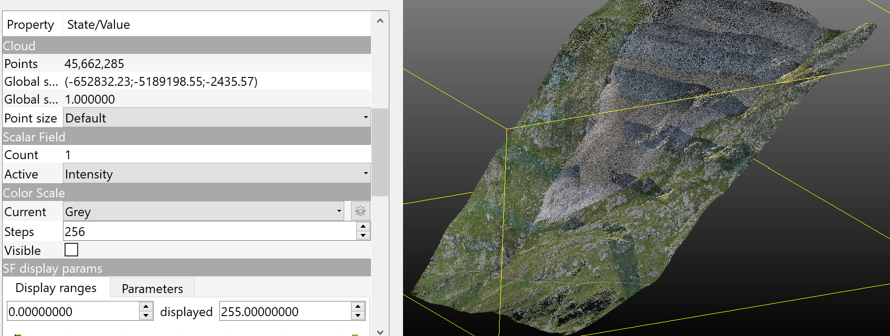
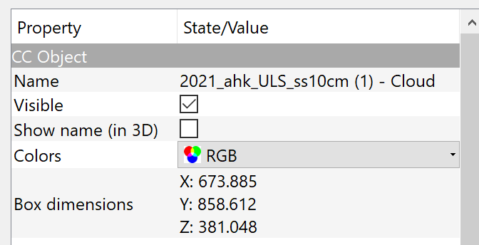
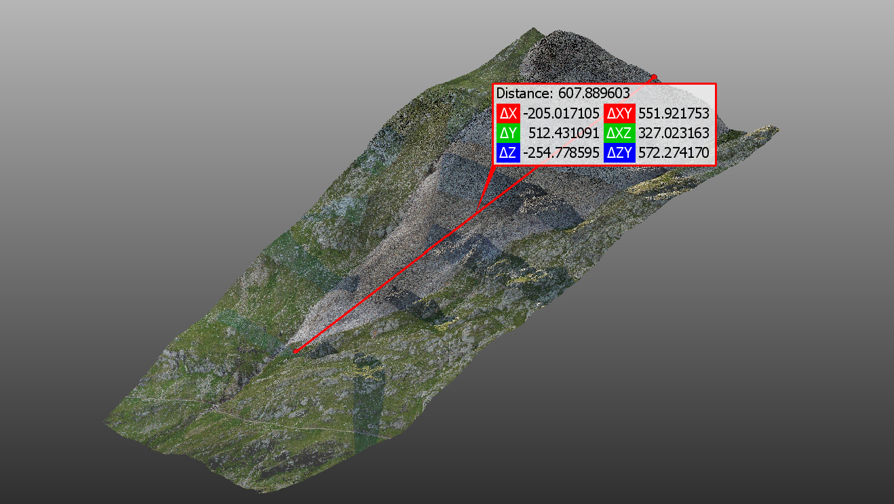
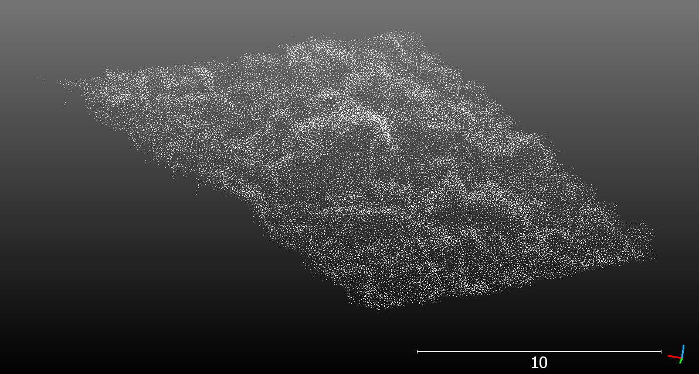
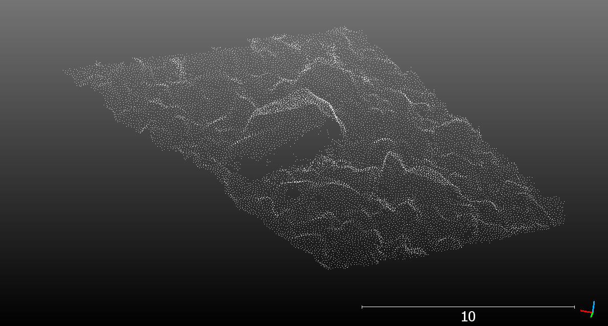
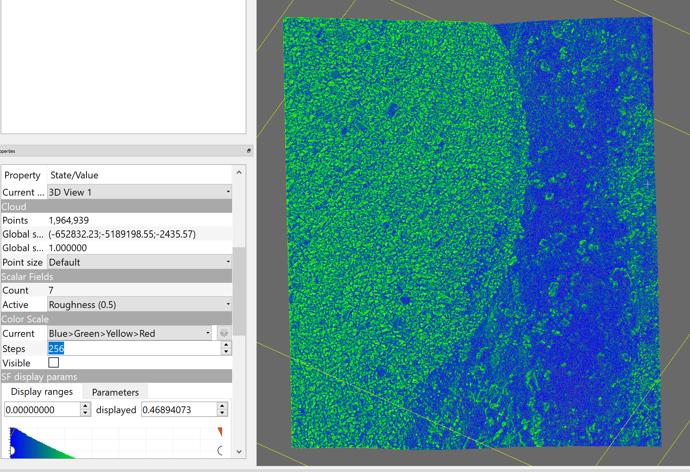
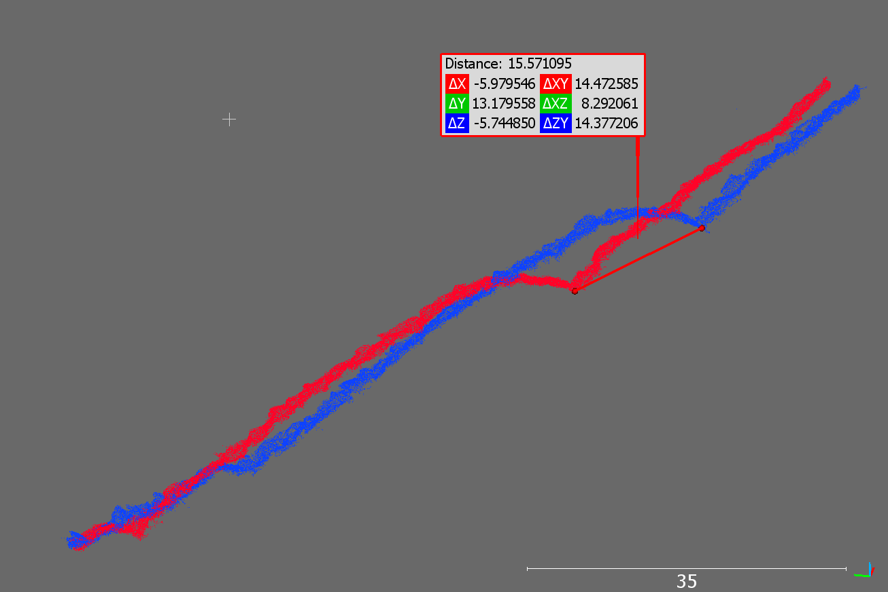

# Exercise: Principles of 3D/4D geographic point clouds

In this exercise, you will get familiar with 3D point clouds in open, graphical software. You will further visually explore multitemporal point clouds and assess changes using visual tools and manual measurements.

## Software and data

Use the software [CloudCompare](../../../software/software_cloudcompare.md) for this exercise. For help with the basic usage of CloudCompare, you may refer to the tutorial videos on the [CloudCompare](https://cloudcompare.org/) website or on this [workshop-website](http://cloudcompare.org/tutorials.html). For those needing further assistance with CloudCompare, there is a detailed solution video at the end.

The dataset will be point clouds of a rock glacier acquired by UAV photogrammetry and laser scanning. See the introduction to the use case and dataset [here](../../../data_usecases/usecase_rockglacier_ahk.md).

Use the data from the directory `ahk` in the course data repository.

## Explore the point clouds

Load the UAV laser scanning point cloud of 2021 into CloudCompare (`ahk_2021_uls.laz`). Get familiar with the point cloud:

* How many points does the point cloud have? 

 45,662,285 points

* What are the measures of the point cloud area (width and length of the bounding box)?

The info can be found in the point cloud properties via the table of contents.

* What is the approximate length of the acquired part of the rock glacier tongue (manual measurement)?

The approximate length is 608 m.

* How many attributes (_scalar field_ in CloudCompare) and which does the point cloud have? Note that attributes were removed to reduce the data volume of the course, so you may miss some typical LiDAR attributes.

Only one attribute is available: intensity.

Load the photogrammetric point cloud (`ahk_2021_photo.laz`) and compare:

* What are the different available attributes?

The photogrammetric point cloud only contains RGB values (true color).

* How do the point clouds differ visually regarding point density and coverage?

The photogrammetric point cloud has a lower point density than the ULS point cloud (note: both are subsampled to reduce data volumes in the course, this relation does not necessarily reflect the original acquisitions and depends on the survey settings). Even though the point density is lower, the photogrammetric point cloud is easier to interpret visually, due to the photo-realistic effect of the coloring.

* How does the representation of individual boulders on the rock glacier differ visually?

The photogrammetric point cloud looks more "realistic", the coloring and shadows provides texture that is easier to interpret than the ULS point cloud colored by intensity. Further, the points in the ULS point cloud seem more scattered, which may suggest a higher quality of the photogrammetric point cloud to represent the local surface.

Prepare a visualization comparing both point clouds at the same close-up view of few boulders - either as two images or as an animation. Do not forget to add the basic elements of scale bar and axes orientation.

In order to be able to see the structure of the point cloud better on the same background, both point clouds are visualized without color (_None_ in the Colors tab of CloudCompare).

<i>Laser scanning point cloud</i>

<i>Photogrammetric point cloud</i>

## Manual editing of the point cloud

Use the [`Segment`](https://cloudcompare.org/doc/wiki/index.php?title=Interactive_Segmentation_Tool) tool in CloudCompare to cut out individual boulders from the rock glacier point cloud. Then merge the individual boulders and have CloudCompare "add indexes of the original point clouds". This provides you (a part of) the point cloud with a point attribute of individual boulder indices - a manual boulder segmentation.

Load the file ULS point cloud from 2020 into your CloudCompare project (`ahk_2020_uls.laz`). Check the extract of your boulders, can you see any changes from 2020 to 2021? 

* What challenges do you face when cutting out a boulder manually?

It is often not easy to distinguish single boulders, depending on their size and geometry, and how they are set relative to one another. Furthermore, manual segmenting in 3D is laborious, since the object needs to be cut from multiple perspectives, given the cmoplex 3D geometry of the objects. 

* Do you have an idea how boulder segmentation could be done automatically? Think of the features and decisions you would implement in an algorithm.

Approaches for automatic segmentation could make use of knowledge about the object geometry. For example, an algorithm may search for planes which represent the faces of a boulder, and then compose the object from the primitive. Another approach could be looking for local maxima, i.e. the _tip_ of a boulder, and then grow the object by adding points downward from the starting point (seed).

Share your result visually – make a nice image of your segmented boulders using some tricks CloudCompare’s visualization options. 
Some suggestions:

* Adjust the color of the background (e.g., white and no shading). Don’t forget to adjust the colors of the bounding box, labels, etc. then, too. 
* Color the boulders by single colors to make the segmentation nicely visible. 
* Use the GL Shader to make the geometry better visible and have a “plastic touch”. 
* Can you think of more?

Render the view to an image or animation.

## Derivation of roughness
For the derivation of surface roughness, use the 2021 ULS point cloud. Cut out a subset of a small area covering part of the rock glacier and part of the adjacent area.

Calculate the surface roughness. As you know, roughness is scale-dependent. Can you find a suitable radius to distinguish the rock glacier (composed of boulders) from the grass and rock areas next to the rock glacier tongue?

Roughness values derived for r=0.5 m show low roughness on the grass and rock area outside the rock glacier tongue (right part in the image above), and higher values on the rock glacier surface, composed of individual, large boulders.

## Inspection of topographic change

Methods of change detection and quantification are covered by subsequent themes. However, you may already visually identify movement and deformation of the rock glacier body. Compare the 2020 and 2021 ULS point clouds of the rock glacier. 

Check changes of the rock glacier in the point clouds with the following approaches:
 
* Color each point cloud by single, distinct colors (e.g., blue and red).
* Examine a profile through both point clouds along the rock glacier tongue.
* Measure the distance from one point cloud to the corresponding surface of the other.

Is the change measurement straight-forward, can you be sure to measure the same surfaces, e.g., of corresponding boulders everywhere?

In which direction(s) do you measure change: vertically, horizontally, surface orientation, ...?

The red profile shows the 2021 pointcloud and the blue one the 2020 pointcloud. In these profiles, a distinct structure that can be matched between epochs is recognizable and shows the movement of the rock glacier. In the visualized area, the rock glacier moved approximately 15.57 m from 2020 to 2021 according to the manual measurement.

## Solution Video

<iframe width="500" height="360" src="https://www.youtube.com/embed/2i4j2W6SfOE"></iframe>

## Wrap up

You are now familiar with point cloud editing and analysis in a graphical user interface. Next, you should try to process point clouds using programming, e.g., with Python.

Further, you should now get into 3D change analysis of this complex natural phenomenon with the available multitemporal point cloud data!

Proceed with the next theme on ["Programming for Point Cloud Analysis with Python"](../../02_pointcloud_programming_python/02_pointcloud_programming_python.ipynb).
