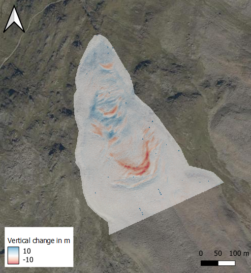

# Exercise: 3D Change Analysis at an Active Rock Glacier using Multitemporal Point Clouds

## Solution using CloudCompare

<iframe width="500" height="360" src="https://www.youtube.com/embed/QS5YKR6uFSk"></iframe>

## Change analysis via DEM differencing

<iframe width="500" height="360" src="https://www.youtube.com/embed/6TTyI-SuDlw"></iframe>

Tip: In the video we use `pdal` but in the new version of QGIS you can also rasterize point clouds directly.

At the end you can visualize the DEM in OGIS, which should look something like this: 

<i>Change analysis via DEM differencing: Vertical change between 2020 and 2021. The basemap is provided by the Web Map Service of Tyrol (https://gis.tirol.gv.at/arcgis/services/Service_Public/orthofoto/MapServer/WMSServer). </i>

