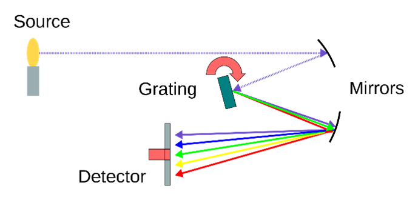
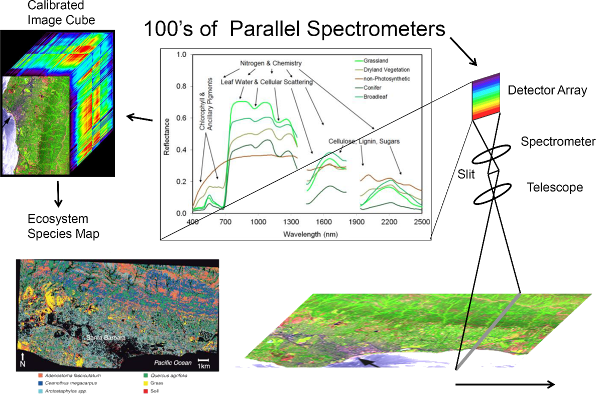
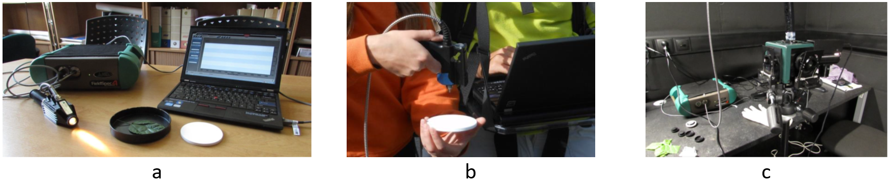
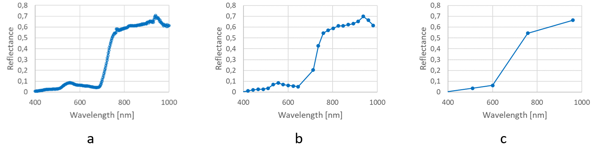
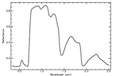
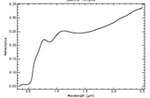

# Principles of imaging and laboratory spectroscopy

Imaging and laboratory spectroscopy is a dynamic discipline that allows monitoring the properties of the Earth's surface (and the surfaces of other bodies in the Solar System) in high detail. It has a wide range of applications e.g., in geology and paedology (e.g., rock and soil composition), plant biology and ecology (e.g., physiological status and stress of vegetation), hydrology, or waste management.

## Objectives

In this theme, you will learn about

* fundamentals of imaging and laboratory spectroscopy,

* hyperspectral (HS) cameras and spectroradiometers,

* interpretation of a hyperspectral data cube,

* spectral libraries,

* examples of imaging and laboratory spectroscopy applications in environmental monitoring.

The theme ends with a **[self-evaluation quiz](#self-evaluation-quiz)**, an **[exercise](#exercise)**, and a list of **[references](#references)**.

In the practical exercise you will explore spectra of selected land cover classes collected with an RPAS hyperspectral camera in the EnMapBox software.

After finishing this theme, you will be able to assess advantages and drawbacks of using hyperspectral imaging in comparison to multispectral observations and how field and laboratory spectroscopy supports the aerial/RPAS campaigns.

##Imaging and laboratory spectroscopy

Spectroscopy is the study of forming and looking at spectra using spectrometers, spectroscopes, etc. (Oxford Learner’s Dictionaries, 2023). It has variety of applications in chemistry and physics. In the scope of our course, the focus is on spectra of light reflected from matters forming Earth’s surface or optionally spectra of light transmitted through a thin layer of matter. It is important to remember that both reflectance and transmittance depend on the matter properties and are the function of wavelengths. It worth mentioning that the origin of spectroscopy goes back to the turn of the 17th and 18th century when Isac Newton investigated refraction of light and introduced the word “spectrum” to describe the split of white light into component colours on prism (Wikipedia, 2023). 

An optical spectrometer is an instrument used for measurement of properties of light over a defined range of wavelengths. Figure 1 shows a schema of a spectrometer. The incoming electromagnetic radiation is dispersed on a diffraction grating and collected on a detector. The spectrometer is characterised with a spectral range (min/max wavelength), spectral bandwidth, spectral sampling, and signal-to-noise ratio (SNR). Due to narrow spectral ranges collected with a detector, SNR is among parameters that should not be neglected when choosing the instrument. 

*Figure 1. Schema of a spectrometer. Figure by [Jooja/Wikipedia](https://en.wikipedia.org/wiki/Optical_spectrometer#/media/File:Spectrometer.svg), [CC BY-SA 4.0](https://creativecommons.org/licenses/by-sa/4.0)*

In general, spectroradiometers measure the radiance in multiple spectral bands (Liang and Wang, 2019). While multispectral spectroradiometers introduced in the [Theme 1 of Module 2](../../module2/01_multispectral_principles/01_multispectral_principles.md) of this course collect the measurements over several rather broad, and not continuous spectral bands, hyperspectral spectroradiometers divide the observed part of the spectrum into many (40 - > 200) narrow (5 – 20 nm) adjacent bands with fine spectral resolution. 

[Whiskbroom](https://en.wikipedia.org/wiki/Whisk_broom_scanner) or [pushbroom](https://en.wikipedia.org/wiki/push_broom_scanner) scanners are used in airborne (i.e., aerial or remotely piloted aircraft systems – RPAS) or spaceborne hyperspectral imaging. The incident light passes through the optical system and a slit, is dispersed and an array of CCD detectors collect radiance in respective spectral bands (Figure 2). The CCD detectors are fabricated from different materials depending on their spectral sensitivity (e.g., silicon detectors for the visible range, indium gallium arsenide for the NIR, and indium-antimonide detectors for the SWIR parts of the spectrum in the AVIRIS sensor, AVIRIS 2023).

*Figure 2. Scheme of data acquisition and processing output from the Airborne Visible InfraRed Imaging Spectrometer - Next Generation. AVIRIS-NG. Figure by [JPL](https://avirisng.jpl.nasa.gov/aviris-ng.html)/Courtesy NASA/JPL-Caltech/[Terms of Use](https://www.jpl.nasa.gov/jpl-image-use-policy)*

The raw spectral measurements have to be radiometrically corrected (see [Theme 2](../02_aerial_acquisition_preprocessing/02_aerial_acquisition_preprocessing.md) of this Module). A **continuous reflectance spectral curve** of each pixel within the instrument’s spectral range is obtained and can be used to identify the surface materials and their properties. The whole set of overlaying geometrically coregistered images acquired in continuous spectral bands is called a **hyperspectral image cube**. It can be used for visualisation (combination of 3 selected spectral bands to create a true/false colour composite) and for depicting pixels which spectral curves are of interest.

**Laboratory and portable spectroradiometers** are used for collecting reference an in-situ data. They provide **point measurements** (i.e., one spectral curve per measurement) using an optical cable connected to a pistol grip, contact probe, or an integrating sphere (Figure 3). While the first two devices are designed for measurement of reflectance, the integrating sphere can be used for measurement of both reflectance and transmittance of a sample mounted on its holder. Some of so-called leaf clips connected to the spectroradiometer can be used for in situ measurements of both reflectance and transmittance of leaves. 

*Figure 3. Spectroradiometer ADS FieldSpec 4 Hi-Res connected to a contact probe (a), a pistol grip during filed measurements (b), and to a integrating sphere (c).*

Similar to hyperspectral images, the spectra collected with the laboratory spectroradiometers have to be calibrated to obtain the reflectance of the matter comparable in time and with other measurements. Laboratory spectroscopy is a topic of the [Theme 3](../03_relating_imagery_lab_vegetation/03_navig.md) of this Module.

### Spectral libraries
Some research institutions provide laboratory or imaging measurements of reflectance spectra in a form of **spectral libraries**. They can be used

* as a reference for other measurements with imaging or laboratory spectroradiometers (e.g., when new instruments are tested and calibrated),

* for deriving spectral composition of materials measured with spectroradiometers,

* for studies on spectral properties of materials (i.e., absorption bands) for designing new instruments.

There are spectral libraries with open access, such as:

[USGS spectral library](https://www.usgs.gov/labs/spectroscopy-lab/science/spectral-library)

[NASA JPL ECOSTRESS spectral library](https://speclib.jpl.nasa.gov/)

[KLUM: Karlsruhe Library of Urban Materials](https://github.com/rebeccailehag/KLUM_library)

**TASK (OPTIONAL):** Open the [USGS spectral library](https://www.usgs.gov/labs/spectroscopy-lab/science/spectral-library), select and compare spectra representing soil, fresh and dry vegetation, water (clear, with higher mineral content, etc.). You can sort the items according to the category or use the search by key words.

### Examples of hyperspectral cameras and spectroradiometers

There are numerous operational hyperspectral sensors, especially for airborne platform. They differ in their spectral and spatial resolution. Table 1 gives some examples of current and passed hyperspectral sensors carried by spaceborne and airborne platforms. They operate from visible (VIS) to near infrared (NIR) or short-wave infrared (SWIR) part of the spectrum. Notice an increase of spectral resolution from VIS/NIR to SWIR bands.

*Table 1. Selected HS sensors and platforms.*

<table><tbody>
	<tr>
		<td colspan="2" width="204">
			
<strong>&nbsp;</strong>

		</td>
		<td width="129">
			
<strong>Spectral range </strong><strong>[nm]</strong>

		</td>
		<td width="142">
			
<strong>Spectral sampling interval </strong><strong>[nm]</strong>

		</td>
		<td colspan="2" width="129">
			
<strong>GSD [m]</strong>

		</td>
	</tr>
	<tr>
		<td rowspan="4" width="79">
			
Spaceborne

			
&nbsp;

		</td>
		<td width="125">
			
<a href="https://www.usgs.gov/centers/eros/science/usgs-eros-archive-earth-observing-one-eo-1-hyperion">EO-1/Hyperion</a>

		</td>
		<td width="129">
			
357 &ndash; 2 576

		</td>
		<td width="142">
			
10

		</td>
		<td colspan="2" width="129">
			
30

		</td>
	</tr>
	<tr>
		<td width="125">
			
<a href="https://earth.esa.int/eogateway/instruments/chris">Proba/CHRIS</a>

		</td>
		<td width="129">
			
400 &ndash; 1050

		</td>
		<td width="142">
			
11

		</td>
		<td colspan="2" width="129">
			
34

		</td>
	</tr>
	<tr>
		<td width="125">
			
<a href="https://www.eoportal.org/satellite-missions/prisma-hyperspectral#space-and-hardware-components">PRISMA</a>

		</td>
		<td width="129">
			
400 &ndash; 1010  920 &ndash; 2505

		</td>
		<td width="142">
			
9

		</td>
		<td colspan="2" width="129">
			
30

		</td>
	</tr>
	<tr>
		<td width="125">
			
<a href="https://www.enmap.org/">EnMAP</a>

		</td>
		<td width="129">
			
420 &ndash; 1000   900 &ndash; 2450

		</td>
		<td width="142">
			
6.5  10

		</td>
		<td colspan="2" width="129">
			
30

		</td>
	</tr>
	<tr>
		<td rowspan="5" width="79">
			
Aerial

		</td>
		<td width="125">
			
<a href="https://avirisng.jpl.nasa.gov/aviris-ng.html">AVIRIS</a>-NG

		</td>
		<td width="129">
			
380 &ndash; 2510

		</td>
		<td width="142">
			
5

		</td>
		<td rowspan="5" width="84">
			
0.2 &ndash; 10

			
&nbsp;

		</td>
		<td rowspan="7" width="45">
			
depending on the flying height and focal length

		</td>
	</tr>
	<tr>
		<td width="125">
			
<a href="https://apex-esa.org/en">APEX</a>

		</td>
		<td width="129">
			
380.5 &ndash; 971.7 941.2 &ndash; 2501.5

		</td>
		<td width="142">
			
0.45 &ndash; 7.5   5 &ndash; 10

		</td>
	</tr>
	<tr>
		<td width="125">
			
<a href="https://itres.com/sensor-line-1-high-fidelity-hyperspectral-sensor-system/">CASI-1500</a>

		</td>
		<td width="129">
			
380 &ndash; 1050

		</td>
		<td width="142">
			
3.2

		</td>
	</tr>
	<tr>
		<td width="125">
			
<a href="https://itres.com/sensor-line-1-high-fidelity-hyperspectral-sensor-system/">SASI-600</a>

		</td>
<td width="129">

950 &ndash; 2450

</td>
<td width="142">

15

</td>
</tr>
<tr>
<td width="125">

<a href="https://itres.com/sensor-line-1-high-fidelity-hyperspectral-sensor-system/">TASI-600</a>

</td>
<td width="129">

8 000 &ndash; 11 500

</td>
<td width="142">

110

</td>
</tr>
<tr>
<td rowspan="2" width="79">

RPAS

</td>
<td width="125">

<a href="https://www.headwallphotonics.com/products/vnir-400-1000nm">Nano-Hyperspec</a>

</td>
<td width="129">

400 &ndash; 1 000

</td>
<td width="142">

6

</td>
<td rowspan="2" width="84">

0.02 &ndash; 0.5

</td>
</tr>
<tr>
<td width="125">

<a href="https://www.cubert-hyperspectral.com/products/firefleye-185">FIREFLEYE 185</a>

</td>
<td width="129">

450 - 950

</td>
<td width="142">

4

</td>
</tr>
<tr>
<td rowspan="2" width="79">

In-situ/lab.

</td>
<td width="125">

<a href="https://www.malvernpanalytical.com/en/products/product-range/asd-range/fieldspec-range/fieldspec4-hi-res-high-resolution-spectroradiometer">ASD</a>

<a href="https://www.malvernpanalytical.com/en/products/product-range/asd-range/fieldspec-range/fieldspec4-hi-res-high-resolution-spectroradiometer">FieldSpec 4 HiRES</a>

</td>
<td width="129">

350 &ndash; 2500  1000 &ndash; 2500

</td>
<td width="142">

3  8

</td>
<td colspan="2" rowspan="2" width="129">

point measurement

&nbsp;

</td>
</tr>
<tr>
<td width="125">

<a href="https://spectralevolution.com/remote-sensing/">Spectral evolution PSR+</a>

</td>
<td width="129">

350 &ndash; 2500

</td>
<td width="142">

2.8nm@700nm 8nm@1500nm

6nm@2100nm

</td>
</tr>
</tbody>
</table>

## Exercise

To explore reflectance spectra acquired with a RPAS hyperspectral sensor using the EnMapBox software package, proceed to the [exercise](01_spectroscopy_principles_exercise.md) of this theme.

## Self-evaluation quiz

<form name="quiz" action="" method="post" onsubmit="evaluate_quiz(); return false">

<!--Question 1-->
<label for="q_01">
Which characteristics are typical for a HS sensor:
</label> 
<input type="radio" name="q_01">a few, narrow, no adjacent bands. 
<input type="radio" name="q_01">many, narrow, adjacent bands. 
<input type="radio" name="q_01">many, wide, overlapping bands. 

many, narrow, adjacent bands.

<output id="output_q_01"></output>  

<!--Question 2-->
<label for="q_02">
There are three spectral measurements in the figure. Which of them were possibly acquired with a hyperspectral sensor?

</label> 
<input type="radio" name="q_02">a, b 
<input type="radio" name="q_02">a, c 
<input type="radio" name="q_02">b, c 

a, b

<output id="output_q_02"></output>  

<!--Question 3-->
<label for="q_03">
You have an oak leaf as a sample. Using laboratory spectroscopy, you can determine its
</label> 
<input type="radio" name="q_03">transmittance 
<input type="radio" name="q_03">reflectance 
<input type="radio" name="q_03">transmittance and reflectance 

transmittance and reflectance

<output id="output_q_03"></output>  

<!--Question 4-->
<label for="q_04">
Signal-to-noise ratio is a more critical issue for
</label> 
<input type="radio" name="q_04">hyperspectral sensors 
<input type="radio" name="q_04">multispectral sensors 

hyperspectral sensors

<output id="output_q_04"></output>  

<!--Question 5-->
<label for="q_05">
Spectral libraries can be used for
</label> 
<input type="checkbox" name="q_05">finding spectral bands suitable for discrimination between selected materials. 
<input type="checkbox" name="q_05">determination of mineral composition of rocks from spectrometric measurements. 
<input type="checkbox" name="q_05">finding technical documentation about spectroradiometers. 

finding spectral bands suitable for discrimination between selected materials.&determination of mineral composition of rocks from spectrometric measurements.

<output id="output_q_05"></output>  

<!--Question 6-->
<label for="q_06">
Match the spectra with the material (Source: Kokaly, R.F., Clark, R.N., Swayze, G.A., Livo, K.E., Hoefen, T.M., Pearson, N.C., Wise, R.A., Benzel, W.M., Lowers, H.A., Driscoll, R.L., and Klein, A.J., 2017, USGS Spectral Library Version 7: U.S. Geological Survey Data Series 1035, 61 p., [https://doi.org/10.3133/ds1035](https://doi.org/10.3133/ds1035))
</label> 
<!--1st table - contains select elements-->
<table>
<tr>
	<td><select name="q_06"> 
		<option></option>	<!--default option-->
		<option>A</option>
		<option>B</option>
		<option>C</option>
	</select>
	1. English Oak leaf - fresh</td>
	<td><select name="q_06"> 
		<option></option>
		<option>A</option>
		<option>B</option>
		<option>C</option>
	</select>
	2. Red building brick</td>
	<td><select name="q_06"> 
		<option></option>
		<option>A</option>
		<option>B</option>
		<option>C</option>
	</select>
	3. English Oak leaf - dry</td>
</tr>
</table>
<!--2nd table - contains corresponding answers-->
<table>
<tr>
	<td></td>
	<td></td>
	<td></td>
</tr>
</table> 

B C A

<output id="output_q_06"></output>  

<input type="submit" value="Submit" style="font-size:14pt">  

<output id="output_overall">
</output>
</form>

### Next unit

Proceed with [Airborne hyperspectral data acquisition and pre-processing](../02_aerial_acquisition_preprocessing/02_aerial_acquisition_preprocessing.md)

## References

### Key literature

Rast, M., Painter, T. H. (2019). Earth observation imaging spectroscopy for terrestrial systems: An overview of its history, techniques, and applications of its missions. Surveys in Geophysics, 40(3), 303-331. [https://doi.org/10.1007/s10712-019-09517-z](https://doi.org/10.1007/s10712-019-09517-z)

### Further articles, referenced literature and resources
AVIRIS (2023). Airborne Visible InfraRed Imaging Spectrometer, NASA Jet Propulsion Laboratory. [https://aviris.jpl.nasa.gov/aviris/index.html](https://aviris.jpl.nasa.gov/aviris/index.html)

Kokaly, R.F., Clark, R.N., Swayze, G.A., Livo, K.E., Hoefen, T.M., Pearson, N.C., Wise, R.A., Benzel, W.M., Lowers, H.A., Driscoll, R.L., and Klein, A.J., 2017, USGS Spectral Library Version 7: U.S. Geological Survey Data Series 1035, 61 p., [https://doi.org/10.3133/ds1035](https://doi.org/10.3133/ds1035).

Liang, S., Wang, J. (Eds.). (2019). Advanced remote sensing: terrestrial information extraction and applications. Academic Press.

