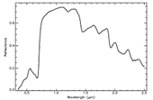

# Principles of imaging and laboratory spectroscopy

Imaging and laboratory spectroscopy is a dynamic discipline that allows monitoring the properties of the Earth's surface (and the surfaces of other bodies in the Solar System) in high detail. It has a wide range of applications e.g., in geology and paedology (e.g., rock and soil composition), plant biology and ecology (e.g., physiological status and stress of vegetation), hydrology, or waste management.

## Objectives

In this theme, you will learn about

* fundamentals of imaging and laboratory spectroscopy,

* hyperspectral (HS) cameras and spectroradiometers,

* interpretation of a hyperspectral data cube,

* spectral libraries,

* examples of imaging and laboratory spectroscopy applications in environmental monitoring.

The theme ends with a **[self-evaluation quiz](#self-evaluation-quiz)**, an **[exercise](#exercise)**, and a list of **[references](#references)**.

In the practical exercise you will explore spectra of selected land cover classes collected with an RPAS hyperspectral camera in the EnMapBox software.

After finishing this theme, you will be able to assess advantages and drawbacks of using hyperspectral imaging in comparison to multispectral observations and how field and laboratory spectroscopy supports the aerial/RPAS campaigns.

The content of the lesson is curently available as a [pdf file]().

## Self-evaluation quiz

<form name="quiz" action="" method="post" onsubmit="evaluate_quiz(); return false">

<!--Question 1-->
<label for="q_01">
Which characteristics are typical for a HS sensor:
</label> 
<input type="radio" name="q_01">a few, narrow, no adjacent bands. 
<input type="radio" name="q_01">many, narrow, adjacent bands. 
<input type="radio" name="q_01">many, wide, overlapping bands. 

many, narrow, adjacent bands.

<output id="output_q_01"></output>  

<!--Question 2-->
<label for="q_02">
There are three spectral measurements in the figure. Which of them were possibly acquired with a hyperspectral sensor?

</label> 
<input type="radio" name="q_02">a, b 
<input type="radio" name="q_02">a, c 
<input type="radio" name="q_02">b, c 

a, b

<output id="output_q_02"></output>  

<!--Question 3-->
<label for="q_03">
You have an oak leaf as a sample. Using laboratory spectroscopy, you can determine its
</label> 
<input type="radio" name="q_03">transmittance 
<input type="radio" name="q_03">reflectance 
<input type="radio" name="q_03">transmittance and reflectance 

transmittance and reflectance

<output id="output_q_03"></output>  

<!--Question 4-->
<label for="q_04">
Signal-to-noise ratio is a more critical issue for
</label> 
<input type="radio" name="q_04">hyperspectral sensors 
<input type="radio" name="q_04">multispectral sensors 

hyperspectral sensors

<output id="output_q_04"></output>  

<!--Question 5-->
<label for="q_05">
Spectral libraries can be used for
</label> 
<input type="checkbox" name="q_05">finding spectral bands suitable for discrimination between selected materials. 
<input type="checkbox" name="q_05">determination of mineral composition of rocks from spectrometric measurements. 
<input type="checkbox" name="q_05">finding technical documentation about spectroradiometers. 

finding spectral bands suitable for discrimination between selected materials.&determination of mineral composition of rocks from spectrometric measurements.

<output id="output_q_05"></output>  

<!--Question 6-->
<label for="q_06">
Match the spectra with the material (Source: Kokaly, R.F., Clark, R.N., Swayze, G.A., Livo, K.E., Hoefen, T.M., Pearson, N.C., Wise, R.A., Benzel, W.M., Lowers, H.A., Driscoll, R.L., and Klein, A.J., 2017, USGS Spectral Library Version 7: U.S. Geological Survey Data Series 1035, 61 p., [https://doi.org/10.3133/ds1035](https://doi.org/10.3133/ds1035))
</label> 
<!--1st table - contains select elements-->
<table>
<tr>
	<td><select name="q_06"> 
		<option></option>	<!--default option-->
		<option>A</option>
		<option>B</option>
		<option>C</option>
	</select>
	1. English Oak leaf - fresh</td>
	<td><select name="q_06"> 
		<option></option>
		<option>A</option>
		<option>B</option>
		<option>C</option>
	</select>
	2. Red building brick</td>
	<td><select name="q_06"> 
		<option></option>
		<option>A</option>
		<option>B</option>
		<option>C</option>
	</select>
	3. English Oak leaf - dry</td>
</tr>
</table>
<!--2nd table - contains corresponding answers-->
<table>
<tr>
	<td></td>
	<td></td>
	<td></td>
</tr>
</table> 

B C A

<output id="output_q_06"></output>  

<input type="submit" value="Submit" style="font-size:14pt">  

<output id="output_overall">
</output>
</form>

## Exercise

### Exploration of hyperspectral data using EnMAP-Box

The aim of this exercise is to get acquainted with data in the EnMAP-Box environment, to understand the possibilities
of visualization, the concept of hyperspectral data, and to compare spectral properties of selected vegetation classes.

Please proceed to the exercise: [Exploration of hyperspectral data using EnMAP-Box](01_spectroscopy_principles_exercise.md).

### Next unit

Proceed with [Airborne hyperspectral data acquisition and pre-processing](../02_aerial_acquisition_preprocessing/02_aerial_acquisition_preprocessing.md)

## References

### Key literature

### Further articles and referenced literature
