# Exploration of hyperspectral data using EnMAP-Box

The aim of this exercise is to get acquainted with data in the EnMAP-Box environment, to understand the possibilities
of visualization, the concept of hyperspectral data, and to compare spectral properties of selected vegetation classes.

- *Prerequisites*
    - Installed EnMAP-Box plugin for QGIS ([manual](../../software/software_enmap_box.md))  
    - Downloaded data ([module4/theme1_exercise_hyperspectral_data](https://doi.org/10.5281/zenodo.10003574))   
- *Tasks*
    - First encounter with data  
    - Comparison of spectral characteristics  
    - Exploration of changes in spectral characteristics in time  

## 1. First encounter with data
Details about the origin of the data, equipment used for acquisition, and scanned areas can be found [here](../../data_usecases/usecase_grasses_krkonose.md).

Multiple regions of interest (ROIs) have been selected from the exemplary area - Luční hora mountain (LH).
In this exercise you will be working with four types of land cover:

- scree  
- mountain pine  
- grass  
    - _Deschampsia cespitosa_ ([tufted hairgrass](https://en.wikipedia.org/wiki/Deschampsia_cespitosa))  
    - _Nardus stricta_ ([matgrass](https://en.wikipedia.org/wiki/Nardus))  
- shrub  
    - _Vaccinium myrtillus_ ([european blueberry](https://en.wikipedia.org/wiki/Vaccinium_myrtillus))  
    - _Calluna vulgaris_ ([common heather](https://en.wikipedia.org/wiki/Calluna))  

<center>


<i>Map of the area with numbered ROIs</i>
</center>

Names of files in the data folder mostly follow a pattern:
`area_class_subclass_number_year_month`,
e.g. `LH_wetland_2_2020_08` shows the image cutout of the second wetland ROI of Luční hora mountain captured
in August 2020. The subclass tag is only used in the case of grasses and shrubs.

### Load and visualize image

For the first task, select a ROI of your choice from the folder with classified images (`classified`).
Do not forget to mention the name of the file in your report. Visualize it using the EnMAP-Box plugin for QGIS. You can follow the
steps in the [manual - Getting Started](https://enmap-box.readthedocs.io/en/latest/usr_section/usr_gettingstarted.html#)
or work with the provided screenshots:

- Open EnMAP-Box in QGIS. 

<center>
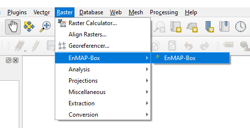
</center>

- Open an empty map window. 

<center>
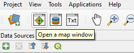
</center>

- Through the dialog in "Add Data Source" open the chosen image. Point at a file with the `dat` extension. 

<center>
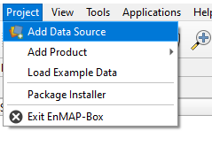
</center>

- Drag and drop the raster image from "Data Sources" to the open empty map window. 

<center>
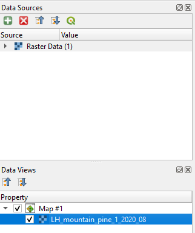
</center>

- Edit the "Symbology" of the image, located in "Layer Properties". The screenshot shows RGB mapping, which should correspond to true color visualization.
Minimum and maximum values are dependent on the specific image. 

<center>
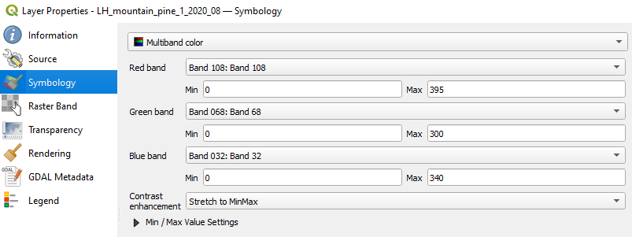
</center>

- Due to a short range of wavelengths captured in each band and a significant amount of noise, the image visualization differs from multispectral imagery in true colors.  

<center>
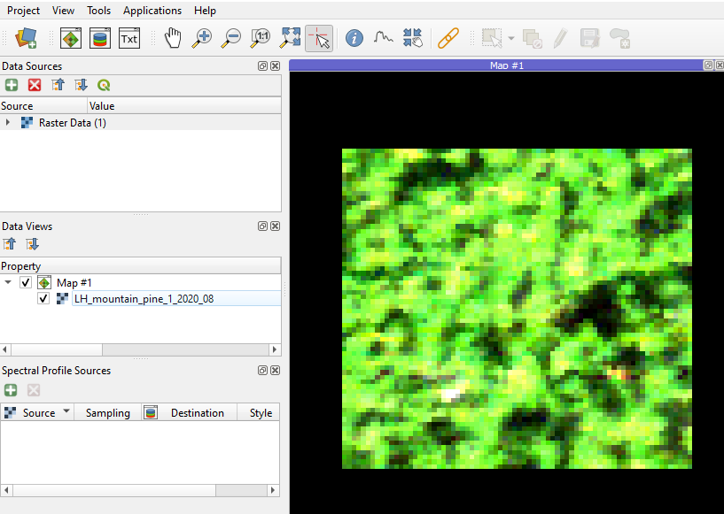
</center>

### EnMAP-Box capabilities

Now you are ready to explore EnMAP-Box capabilities. Add screenshots of the following steps to your report.

- The images are only cutouts and cover a relatively small area.
To inspect the surroundings, load some of the available WMS layers. 
When compared to, for example, Google Satellite Maps, the provided images you are working with in this exercise
are of much higher spatial resolution.

<center>
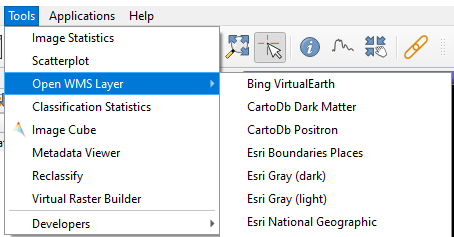 

<i>Add WMS layer</i>
</center>

- Right-click on the raster layer in the map and choose "Image Statistics" or click on the same option in the menu "Tools". Select your
image, and feel free to also choose the actual accuracy as the image is very small, and the computation of statistics
will be fast.  Write down in your report the number of available bands, range of captured wavelengths, and enclose a few
screenshots of the histograms. Similar information can be found in the "Metadata Viewer" in the "Tools" menu. 

<center>
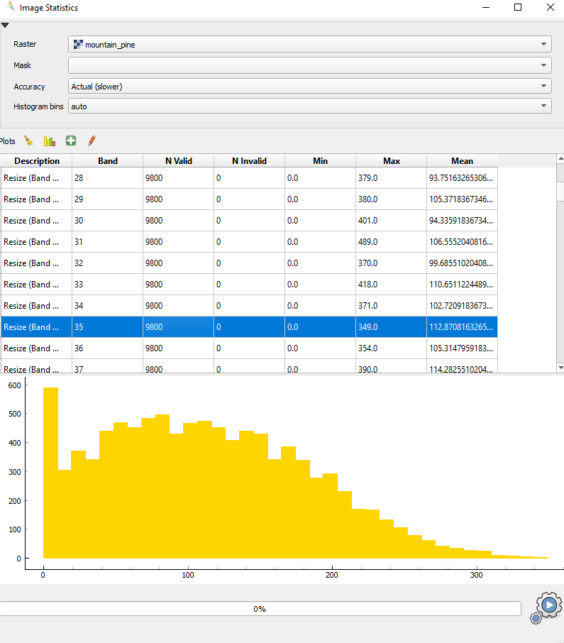 

<i>Image statistics</i>
</center>

### Spectral curves

As the last step of the first task, let's visualize a wavelength spectrum of individual pixels.

- Click on "Open a spectral library window" next to the map window opening option, and activate the buttons with a cursor logo
("Identify a cursor location and collect pixels values, spectral profiles and or vector feature attributes.")
and one with a spectral curve logo ("Identify pixel profiles and show them in a Spectral Library.").
 
<center>
 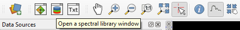
</center>

- Then just click anywhere in the image, and the spectral curve should appear in the spectral library window. Spend time
observing the curves of various pixels, play around with the settings for axis "x" (wavelength in nanometers, band index), and
sampling in the spectral profile sources panel. 

<center>
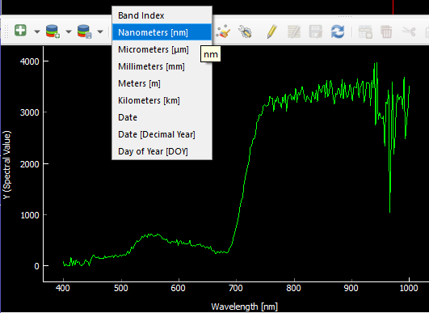 
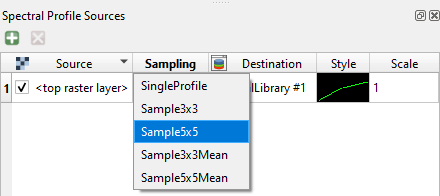
</center>

- It is possible to visualize more curves at once. Choose option "Add profiles" or "Add profiles
automatically", and curves will remain in the plot. If you want to remove the curves, activate "Toggle editing mode" and
delete selected rows in the table. In the editing mode, profiles can be renamed, others can be added, etc. 

<center>
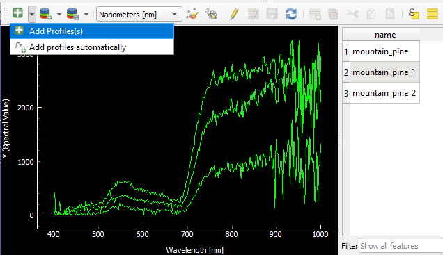 

<i>Add profiles</i>
</center>


- It is also possible to change the colors of the plot, export raw data to CSV, or export the plot as a raster image.

Enclose three screenshots of the whole EnMAP-Box window with different settings for spectral curve visualization in your report.

## 2. Comparison of spectral characteristics
There are three examples for each class and subclass of land cover from August 2020 in the folder with classified images (`classified`).
Open them one by one (or more at once) in multiple map windows
in EnMAP-Box and visualize the spectral curves of particular pixels. It is recommended to use "Sample5x5Mean" sampling,
due to its ability to reduce noise in the signal by averaging signals from neighbouring pixels.

### Spectral curves for classes and subclasses
Choose a representative curve for each class and subclass, enclose the plots to your report, and
describe typical spectral behaviour of each class, highlighting the differences. Focus on the values of pixels
in the wavelength ranges of the visible and near infrared parts of the spectrum, as well as on the shape of the curve. Try to answer
the following questions:
```
Which part of the spectrum can be used for distinguishing between the classes?

Which wavelength ranges are similar for two or more classes and can cause insufficient results of classification?

Is it possible to distinguish between subclasses? Which wavelength ranges might help you?
```

<center>
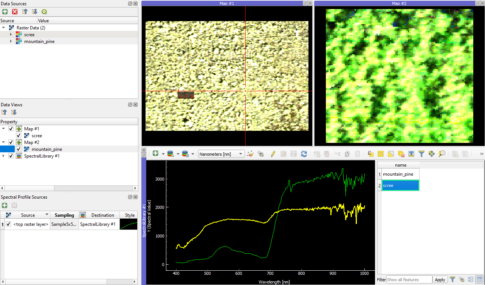

<i>Spectral curves for scree and mountain pine</i>
</center>

### Differences in spectral curves within classes
During the previous task, you may have noticed differences in spectral curves between pixels of one class.
Select suitable pixels and plot multiple different spectral curves of pixels from one class and image in a one graph. In your
report, answer these questions:
```
Are these differences significant from the classification point of view?

Can the differences cause misclassification of some of the pixels?
If so, what are some methods used for removing noise in the classification results?
```

### Classification of additional images
There are six images in the folder with images of unknown class (`unknown_1-6`).
Go through the
images and try to assign them to one of the classes (and subclasses, if possible). State your arguments for the
classification and include spectral curves that may have aided you.

## 3. Exploration of changes in spectral characteristics in time
The folder for task 3 (`task_3`) contains one ROI of each class and its corresponding multitemporal images from June, July, August, and September 2020.
Open images of one ROI in  all four time periods and explore differences in spectral curves.
In your report, describe the differences for individual classes. Try to answer the following questions:
```  
For which classes are the changes in spectral curves most significant?  

If the spectral curves differ, which month is the most suitable for the separation of the classes? 
In which month are the spectral curves of one class most similar to the others?
```  
<center>
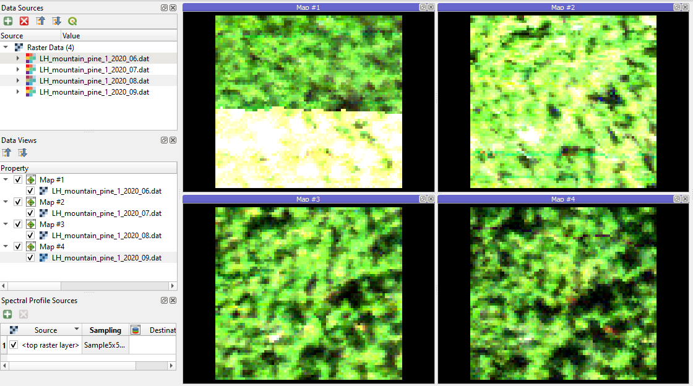

<i>Mountain pine in June, July, August, and September</i>
</center>

### Exercise solution 
Proceed to example solution [Exploration of hyperspectral data - report](solution/spetroscopy_principles_exercise_solution.md)

### Back to theme
Proceed by returning to [Principles of imaging and laboratory spectroscopy](01_spectroscopy_principles.md)
