## Report

#### 1. First encounter with data

##### Load and visualize image
In the first part of the exercise, I've been working with an image of a mountain pine with the tag `LH_mountain_pine_1_2020_08`.

##### EnMAP-Box capabilities

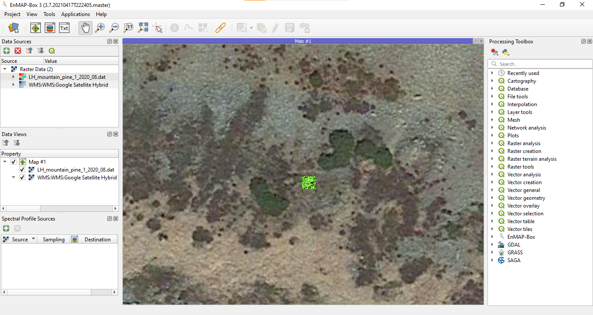
 
<i>Added WMS layer of Google Satellite Maps</i>

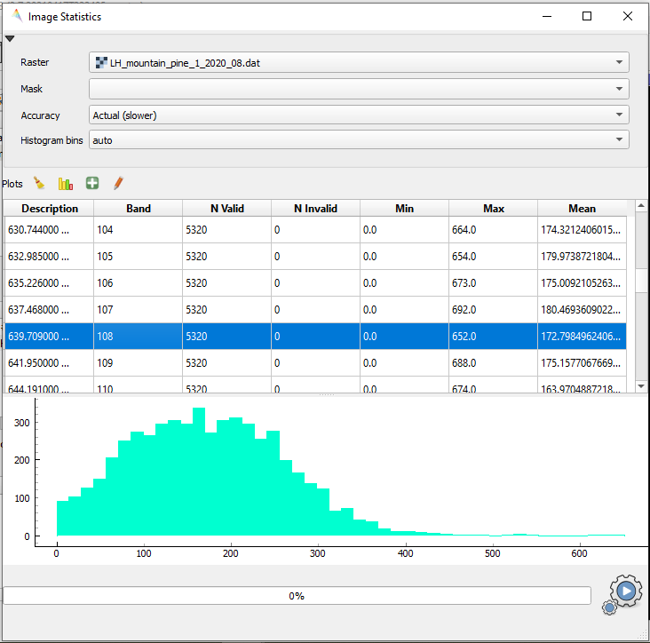
 
<i>Histogram and statistics of band 108</i>

##### Spectral curves

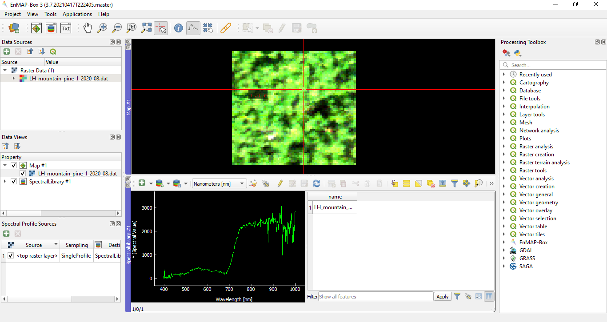
 
<i>Spectral curve of a light pixel</i>

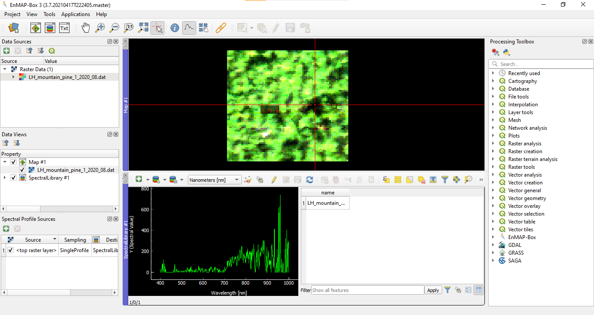

<i>Spectral curve of a shadowed pixel </i>

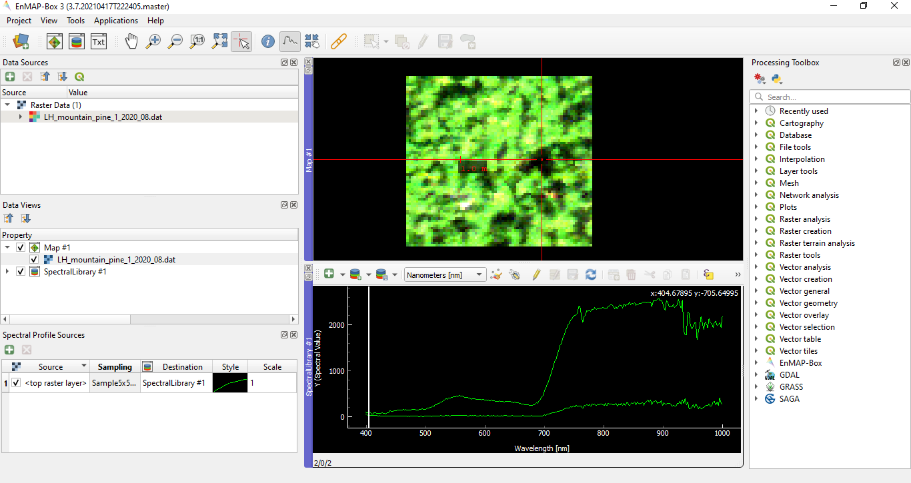

<i>Multiple spectral curves with 5x5 mean sampling</i>

#### 2. Comparison of spectral characteristics

##### Spectral curves for classes and subclasses

| Class | Subclass | Spectral curve |
| :-- | :-- | :--: |
| mountain pine | | 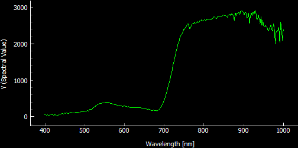 |
| scree | | 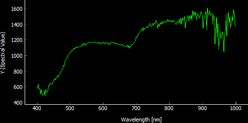 |
| grass | Deschampsia cespitosa | 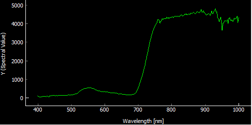 |
| grass | Nardus stricta | 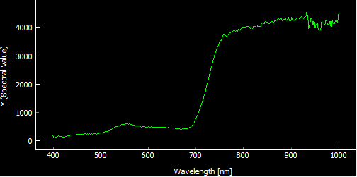 |
| shrub | Vaccinium myrtillus | 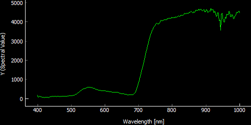 |
| shrub | Calluna vulgaris | 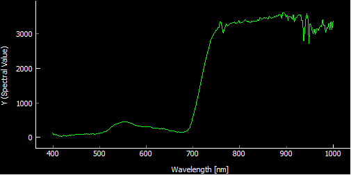 |

The most significant difference can be seen between the spectral curve of class scree and all the other classes representing vegetation. The spectral curve of class scree gently increases with wavelength, in contrast to spectral curves of vegetation. 
Vegetation classes reach lower values until the break around 700 nm, where the curves turn to even higher values than scree.
In general, for the identification of scree, one can use a threshold value of wavelength lower than 700 nm or a ratio of values of wavelength higher and lower than 700 nm.
A low ratio indicates scree, a high ratio is typical for vegetation.

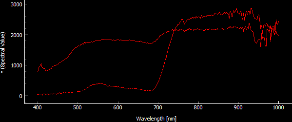

<i>Comparison of spectral curves of mountain pine (jump in values) and scree (gentle increase)</i>

Description of the differences between vegetation classes is much more complicated because the spectral curves are very similar. 
Some of them reach lower values in the near infrared part of the spectrum, e.g. mountain pine and shrub Calluna vulgaris. 
Comparing the two subclasses of grass, there are less significant differences in the highest values.

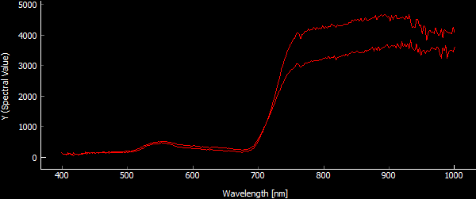

<i>Comparison of spectral curves of grass Deschampsia cespitosa (higher values) and Nardus stricta (lower values)</i>

##### Differences in spectral curves within classes
In this part of the exercise, I've been working with an image of Deschampsia cespitosa with the tag `LH_grass_deschampsia_cespitosa_1_2020_08`. 
As mentioned in the previous task, Deschampsia cespitosa seems to be distinguishable from Nardus stricta due to its higher reflectance values. Although the values are highly dependent on the chosen pixel.

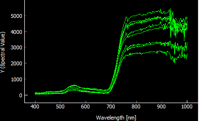

<i>Spectral curves for various pixels of grass Deschampsia cespitosa</i>

##### Classification of additional images
| Name of image | Class |
| :-- | :-- |
| `unknown_1` | scree |
| `unknown_2` | mountain pine |
| `unknown_3` | shrub Calluna vulgaris |
| `unknown_4` | grass Nardus stricta |
| `unknown_5` | grass Deschampsia cespitosa |
| `unknown_6` | shrub Vaccinium myrtillus |

#### 3. Exploration of changes in spectral characteristics in time
| Class | Spectral curves | Comments |
| :-- | :--: | :-- |
| mountain pine | 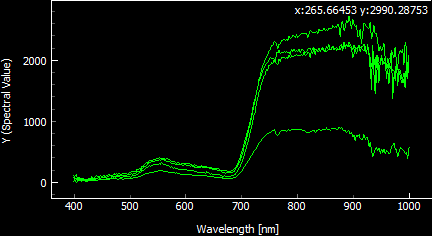 | The highest values are from August, the lowest from June. In July and September, the reflectance is comparable. Shapes of the spectral curves are similar. |
| scree | 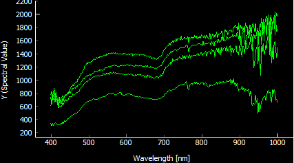 | Even though seasonal changes should not affect reflectance of scree, there are visible differences. The lowest values are from June. Shapes of the spectral curves are similar. |
| grass Deschampsia cespitosa | 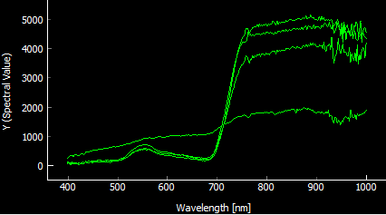 | When compared to other vegetation classes, there is no rise in the spectral curve in June (lowest one) at 700 nm. The other curves are very similar, lower values are from September. |
| grass Nardus stricta | 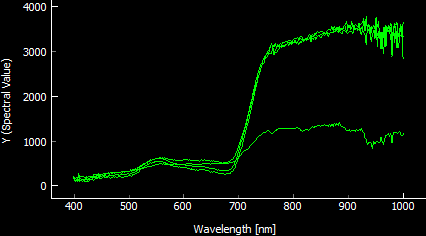 | Again, the spectral curve from June (lowest one) is suspicious, but the others are almost identical, there are no differences between months. |
| shrub Calluna vulgaris | 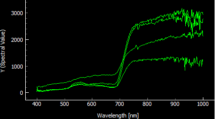 | In this case, the spectral curve from June is in the middle, but it differs from the others in that it rises slowly at 700 nm. The lowest one is from July. |
| shrub Vaccinium myrtillus | 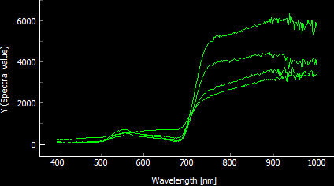 | The highest reflectance of the shrub in the near-infrared wavelengths is in July and the lowest in June. It seems as though the shrub has a shorter growing season than Calluna vulgaris. |

In general, images from June seem to have odd values of reflectance, which is evident from the spectral curves as well as visualization. For distinguishing between the classes, images from July or August are the most suitable.

### Back to theme
Proceed by returning to [Principles of imaging and laboratory spectroscopy](../01_spectroscopy_principles.md)