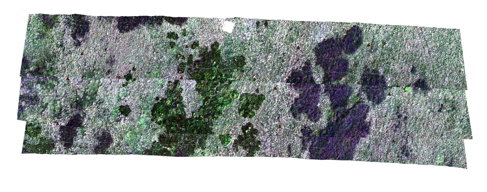
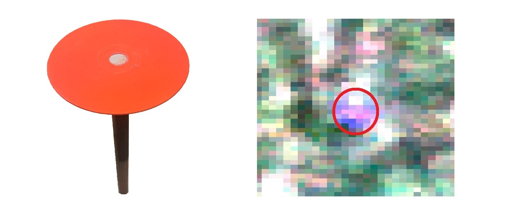
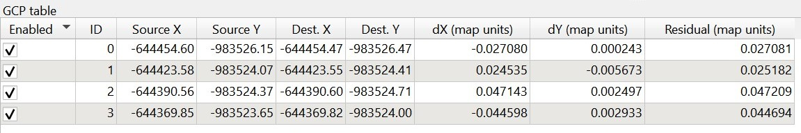
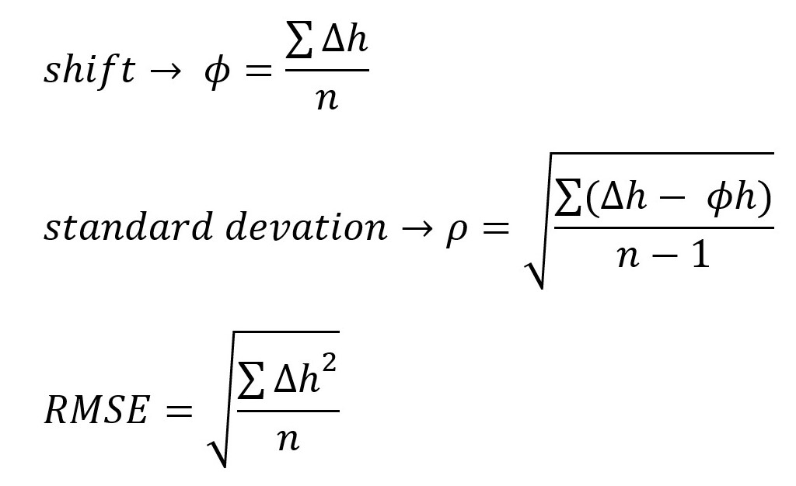
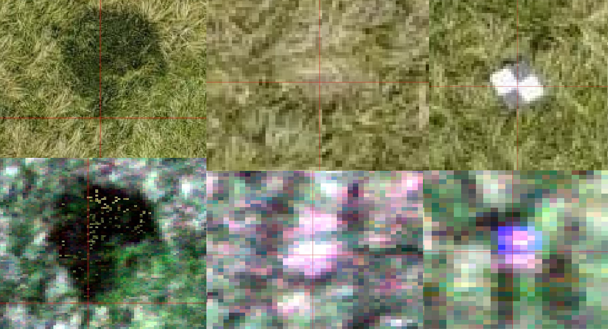
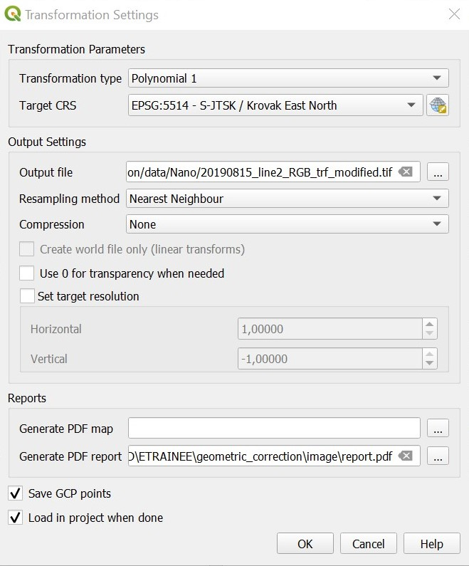

# Geometric correction

The aim of this exercise is to perform geometric correction of hyperspectral image data acquired by an UAV pushbroom scanner. 
The insufficient accuracy of IMU/GNSS measurements of low-cost equipment and height differences in terrain can cause shifts and deformations of overlapping strips. 
Orthorectified RGB images collected during the same or different flights can be used for coregistration and orthorectification of the UAV hyperspectral images. 

- *Prerequisites*
    - Installed QGIS    
    - Downloaded data ([module4/theme2_exercise_geometric_correction](https://doi.org/10.5281/zenodo.10003574))   
    The dataset consists of:
        + preprocessed hyperspectral image strips with and without a CRS: 20190815_lineX_RGB_trf.tif (image file) and 20190815_lineX_RGB_trf.tfw (georeference file). 
        + check points: CP_GNSS.shp (shapefile) 
        + orthorectified RGB image: 20190814_Ortho_RGB.jpg (image file) and 20190814_Ortho_RGB.jgw (georeference file).  
         
- *Tasks*
    - Evaluate relative and absolute accuracy of “raw” image strips 
    - Collect identical points; register scanned image strips to the orthoimage 
    - Accuracy assessment of geometrically corrected image data 


## 1. Data preparation, relative and absolute accuracy 
Start with visualizing the deformed hyperspectral image strips `20190815_lineX_RGB_trf.tif` of Bílá louka meadow alpine grasslands (50.729N, 15.683E, Krkonoše mountains) in QGIS. To allow for a smaller image size, the data comprises only a spectral and spatial subset of the original hyperspectral imagery. Mapping the available bands to Red, Green, and Blue and using the min/max cumulative count cut settings should result in an image resembling true colors. To remove the black background, go into the image “Properties -> Transparency” and add a 0 into the empty “Additional no data value” column. The image strips have a defined coordinate reference system, S-JTSK / Krovak East North (EPSG: 5514), do not use any transformations, and work with the provided CRS.  
<p align="center">

</p>

<div align="center">

<i>Bílá louka meadow hyperspectral image strips</i>

</div>

Load the shapefile `CP_GNSS.shp` containing the positions of the check points. Twelve bright orange round discs were placed evenly throughout the area to signal their location (Figure 2). Have a look at the corresponding check points in the images
<p align="center">

</p>

<div align="center">

<i>Illustrational image of the check point; check point appearance in the hyperspectral imagery</i>

</div>

Evaluate the relative and absolute accuracy of the hyperspectral image strips. All the necessary tools can be found in the georeferencing app in QGIS “Layer -> Georeferencer”. If you are not familiar with the working environment or need help, have a look at the [documentation](https://docs.qgis.org/3.4/en/docs/user_manual/plugins/core_plugins/plugins_georeferencer.html).  

To compute the absolute accuracy, determine the residuals on the check points, preferably in map units (m). Load the hyperspectral image strips for quality assessment in the app, find the checkpoints in the hyperspectral image, and compare their coordinates to the ones defined in the provided shapefile. Each check point is located in at least one image strip. For relative accuracy, determine the geometrical distortions between overlaying image strips. Find a minimum of four identical points (distinct edge/corner of grass stand, visible hollow or mound, check point) for each strip pair and compute the difference between their coordinates in the first and second image of the pair. Use the columns **Source XY** and **Destination XY** to compute all the differences. Do not use the **Residual** values in the GCP table from the "Georeferencer" app, as they refer to residuals after the transformation!  
<p align="center">

</p>

<div align="center">

<i>Example of generated GCP table with source and destination coordinates</i>

</div>

Apart from the individual residual values obtained, compute commonly used statistics such as horizontal shift, standard deviation, and Root Mean Square Error (RMSE) for each strip (for both relative and absolute accuracy assessment).  

<p align="center">

</p>

```  
Evaluate geometrical distortion between the deformed scanned strips (relative accuracy).  
Evaluate residuals on the check points (absolute accuracy).
```

## 2. Image registration
Open the orthorectified RGB image `20190814_Ortho_RGB.jpg` covering the whole extent of the hyperspectral image strips. In the georeferencing app in QGIS “Layer -> Georeferencer” load the first image strip without a CRS (coordinate reference system). Collect identical points evenly throughout the area, the minimum required number of points is dependent on the selected transformation. Examples of usable identical points can be found in the figure below. Do not use the check points for the image registration, as the accuracy assessment needs to be unbiased. 
<p align="center">

</p>

<div align="center">

<i>Examples of identical points in the RGB image (top) and hyperspectral image (bottom)</i>

</div>

After the identical points have been added to the hyperspectral image strip, the “Transformation settings” need to be defined. Select the **Transformation type**; the 1st order polynomial (affine) requires at least three identical points, preserves collinearity, and allows scaling, translation, and rotation only. The second transformation type we are going to use is Thin plate spline, which requires at least 10 identical points and is able to introduce local deformations to the data. Choose the **Target CRS** (EPSG:5514), **Output file location**, and **Resampling method** Nearest Neighbour. You can optionally **Generate a PDF report or map** with the results of the transformation. It is recommended to check the **Save GCP points** options; the remaining values can be left at their defaults. 
Now you are ready to register the image strip by running “Start georeferencing”. 
<p align="center">

</p>

<div align="center">

<i>Transformation settings</i>

</div>

Repeat the steps above for the remaining image strips. When searching for identical points, also add some from the previously registered image strip to ensure the correct attachment/connection of the image strips.    

```  
Register the hyperspectral image strips one after another to the existing RGB orthoimage. 
Try out different types of transformations: polynomial, spline.
```

## 3. Accuracy assessment
Compute the relative and absolute accuracy of the now orthorectified outputs, follow the steps from the first task. 
Include a screenshot of the GCP table from the "Georeferencer" app with residual values on the identical points after the transformation.
```  
Evaluate geometrical distortion between the orthorectified scanned strips (relative accuracy).
Evaluate residuals on the check points (absolute accuracy).
```

**Bonus task:** Explore QGIS functions and try to create an orthomosaic from the image strips. 

**Examine the results and try to answer the following questions:** 
```  
Evaluate the absolute and relative accuracy after geometric correction. 
What is the maximum error? Is the resulting accuracy sufficient?  
 
Compare the “raw” image strips with the geometrically corrected (orthorectified) image strips in terms of computed accuracy and visual inspection.  

Are there any differences between the results of the spline and polynomial transformations?  

Comment on the used resampling method: what does “Nearest neighbour” ensure? 
Would using a different resampling type affect the image, and if yes, then how? 

```

## References
QGIS Project (2023): QGIS Documentation. [docs.qgis.org/3.28/en/docs](https://docs.qgis.org/3.28/en/docs/index.html).


### Exercise solution 
Proceed to example solution [Geometric correction - report](solution/02_aerial_acquisition_preprocessing_exercise_geometric_solution.md)

### Back to theme 
Proceed by returning to [Aerial/RPAS hyperspectral data acquisition and pre-processing](02_aerial_acquisition_preprocessing.md)
