# Airborne hyperspectral data acquisition and pre-processing

Acquisition of airborne hyperspectral images requires careful flight planning supported by field campaigns. 
The following preprocessing of data comprises necessary radiometric and geometric corrections. 
In addition, spectra transformations and filtering can be carried out to reduce data volume and suppress the noise present in the data.

## Objectives

In this theme, you will learn about: 

* [flight planning and in-situ measurements](#planning-airborne-flight-missions) for radiometric and geometric correction of images,
* methods of [radiometric correction](#radiometric-correction) of HS images,
* [geometric correction](#geometric-correction),
* selected [spectra transformations](#spectra-transformations) (e.g., minimum noise fraction, continuum removal, spectral indices), and spectra smoothening and denoising.

The theme includes an [exercise](#excercise), a [self-evaluation quiz](#self-evaluation-quiz), and a list of [references](#references).

In the practical exercise you will carry out a geometric correction of images acquired with a Nano-Hyperspec® camera mounted on the DJI Matrice 600 Pro platform.

After finishing this theme, you will be aware of flight parameters settings and in-situ measurements to be considered for a successful HS flight mission, you will understand principles of radiometric and geometric corrections, and you will be familiar with noise and data volume reduction methods.

## Planning airborne flight missions

Radiometric and geometric quality of acquired images is one of the key factors influencing success of any application in imaging spectroscopy. 
Once the decision on the area of interest, required spectral and spatial resolutions is made, it is necessary to choose a suitable sensor and platform – spaceborne, airborne, or remotely piloted aircraft system (RPAS)/uncrewed aerial vehicle (UAV). 
While the orbits and instruments of the spaceborne systems are fixed by their providers, planning of airborne missions is an important part of each use case. 
The main sensor and platform parameters to be considered for airborne flight mission are summarised in Table 1. 
Details on sensor parameters, so called parameters of interior orientation (focal length, lens distortion, position of the principal point), and parameters of exterior orientation (position of the projection centre and rotations of the sensor in space) can be found in photogrammetric literature (e.g., [Kraus, 2007, Förstner and Wrobel, 2016](#references)).

*Table 1. Selected sensors and airborne platform parameters to be considered for flight mission planning. For explanation of sensor types and platforms visit [Theme 1](../01_spectroscopy_principles/01_spectroscopy_principles.md).*

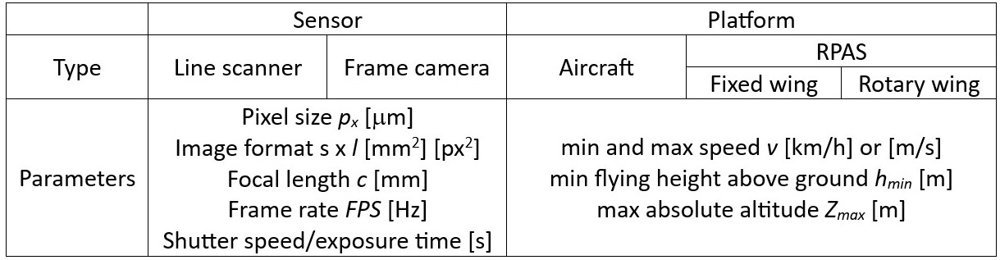

Given the sensor pixel size *px*, focal length *c*, and the required ground sampling distance *GSD*, 
the platform flying height above the terrain h can be calculated as $h={{GSD}\over{p_x}} \ c$ 
and the absolute flying height above the see level $Z = h + Z_GL$, where *ZGL* corresponds to the height of the terrain modelled e.g., from a digital terrain model (DMT). 
The size of the swath *S* covered with a line scanner is given by the formula $Z =  {{h}\over{c}}  \  s$ and the area covered with a frame camera can be expressed as $S\times L \  {\begin{bmatrix}m^{2}\end{bmatrix}}$ , where $S =  {{h}\over{c}}  \  s$ and $L =  {{h}\over{c}}  \  l$. 
The relation between above mentioned parameters is shown in *Figure 1*.

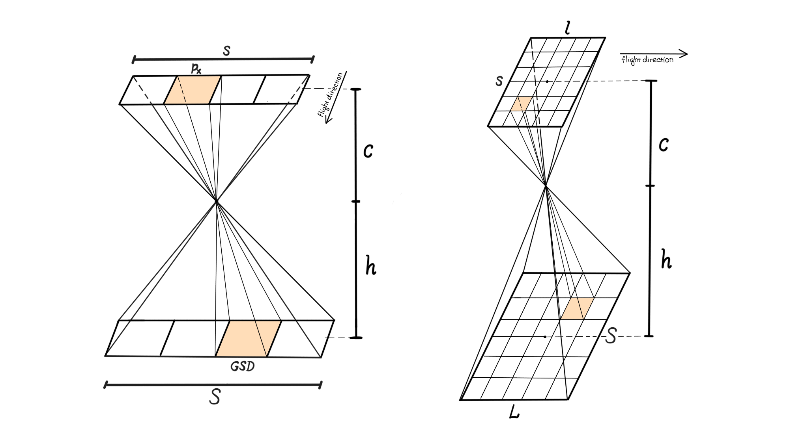

*Figure 1. Relation between ground sampling distance (GSD), focal length c, flying height above the terrain h, and the area covered on the ground with a linear scanner (left) and a frame camera (right). Figure by course authors.*

Other important parameters are exposure time and frame rate (*FPS*), i.e., the number of scanned lines or frame images acquired per second. 
They are related – the exposure time must not exceed the frame period *FP=1/FPS* [s]. 
Table 2 gives an example of calculating image acquisition parameters.

*Table 2. Example of calculating selected parameters for image acquisition with a Nano-Hyperspec® line sensor*

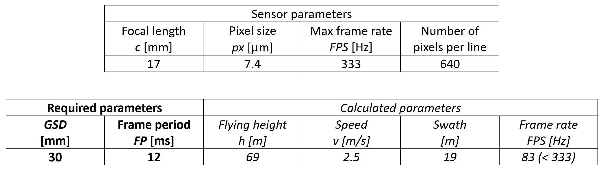

To cover the whole area of interest with no gaps, the neighbouring strips are flown with a side overlap *q* of at least 20%-30% of swath *S*. 
In the case of frame cameras, a forward overlap p must be also considered (*Figure 2*). 
If a photogrammetric processing is included, i.e., image orientation based on aerotriangulation and bundle adjustment ([Kraus, 2007](#references)), and utilising image matching ([Remondino et al., 2014](#references)) for derivation of a digital surface model (DSM), overlap values of *p* = 60% – 80% and *q* = 30% - 80% are applied. 
Smaller values hold for aerial acquisitions with a more stable flight control while larger overlaps are used for RPAS missions.

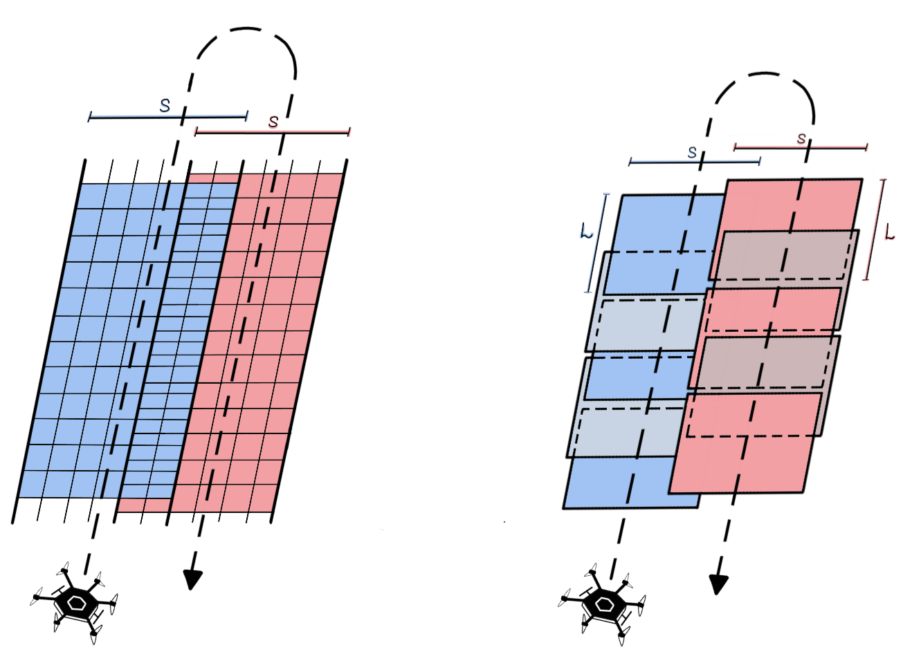

*Figure 2. Side overlap between neighbouring image strips collected with a linear scanner (left); forward overlap and side overlap of images acquired with a frame camera (right). Figure by course authors.*

Both open source and proprietary software tools for flight planning are available. 
Their usability is to a certain extent limited to the used platform (drone manufacturer in the case of RPAS). 
Due to dynamic development in this field, a list of the existing software tools is not provided here but you can make your own search based on the key words “drone mission planning software” or “drone flight planner app”. 
*Figure 3*  gives a general workflow of airborne HS flight planning.

*Figure 3. A general workflow of flight mission planning. Figure by course authors.*

The parameters of the platforms and sensors that are provided in the respective technical data sheets and are either pre-defined by a software provider or they can be set up by a user. 
The flight mission planning applications contain graphic tools for drawing an area of interest. Importing a **.kmz* file is usually also possible. 
Further settings comprise flight-specific parameters such as altitude above the mean sea level and above the ground, GSD, image overlaps, the platform velocity, etc. (cf. *Figure 4*). 
Mutually dependent parameters (e.g., GSD and the flying height above the ground) are automatically adjusted after one of them is set up. 
Based on the setup parameters, a flight route is automatically planned and visualised. 
The created flight plan can be further optimised regarding e.g., the starting and landing points, the flight line azimuth, overlap etc. 
The final flight plan is then exported and can be uploaded to the flight control system. 

A possibility of following the terrain during the flight is an important feature of the flight control system to be considered for the RPAS. 
It allows for a constant GSD in the sloped terrain. 
On the other hand, it requires a reliable DTM (and information about the height of vegetation and buildings if they are present) to avoid any collisions of a drone. 

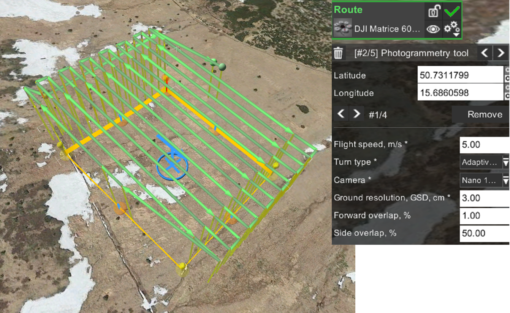

*Figure 4. Flight route created in the UgCS drone mission planning software for a Nano-Hyperspec® line camera mounted on the DJI Matrice 600 Pro. 100 m x 100 m plot at the Bílá louka meadow, Krkonoše mountains. Figure by course authors.*

It is worth mentioning that the radiometric quality of the HS images is of high importance. 
With respect to the radiometric corrections discussed later in this theme, it is recommended to set the azimuth of the flight lines very close to the current azimuth of the sun. 
Moreover, the images shall be acquired on stable illumination conditions, i.e., either clear sky or homogeneous cloud cover (enabling to perform the flight). 

For more details on planning airborne image data acquisition missions read the paper [Pepe et al. (2018)](#references).

### Field campaigns

The goal of field campaigns is to collect data necessary for a proper geometric and radiometric correction of the acquired images.

The ground control points (GCPs) are used for indirect or integrated sensor orientation (for explanation see the section [Geometric correction](#geometric-correction)). 
Moreover, check points (CPs) are used for an independent check of horizontal accuracy of a final image product (orthoimage). 
Both kind of points are represented by signalised or natural distinct points (see *Figure 5*) and their position is usually determined using a Global Navigation Satellite System (GNSS) receiver enabling Real-Time Kinematic (RTK) measurements (horizontal accuracy of 1 – 2 cm, vertical accuracy of 3 – 5 cm).

To improve the atmospheric correction of the collected data, in-situ spectra of calibration tarps and over selected materials are collected with portable spectroradiometers in the field (*Figure 5*). 
Moreover, the solar irradiation can be measured with sunphotometers. How to use these measurements is explained in the section [Radiometric correction](#radiometric-correction).

*Figure 5. Field campaigns supporting the HS image acquisition - signalised ground control points (left), tarp for radiometric calibration (upper right), measurement of reflectance of selected materials with a portable spectroradiometer for atmospheric correction. Photos by course authors.*

## Radiometric correction

A raw HS data cube consists of layers of pixels which digital numbers (DNs) are related to the intensity of electromagnetic energy within the given narrow interval of wavelengths incident on respective cells of a charge-coupled device (CCD). 
DNs do not have any physical unit and the values are dependent on processing of recorded signal in each sensor. 
In the first step called *sensor calibration*, the DNs are converted to spectral (at-sensor) radiance *Ls* [Wm-2sr-1μm-1]. 
The relation between *L* and DN is expressed for each sensor’s spectral band *b* with a linear function $L_b^s=G_b DN_b+O_b$, where *Gb* and *Ob* is the slope (gain) and offset, respectively. 
If the spectral values shall be compered over time, with in-situ or laboratory values, further corrections due to variable solar illumination, atmospheric effects, and topography must be considered, as it was discussed in the theme on satellite image processing workflow in [Module 3](../../module2/03_image_processing/03_image_processing.md#radiometric-and-geometric-correction). 
The output of the radiometric correction is an image whose pixel values represent spectral reflectance at the surface (*Figure 6*). 

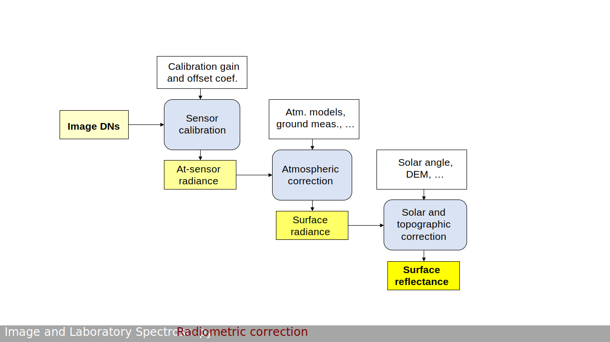

*Figure 6. General workflow of radiometric correction. Figure by course authors.*

Before application of the sensor calibration, the dark current must be subtracted from the raw data. 
The dark current measurement, i.e., collecting data with covered objectives lens, is performed prior to the flight. 
Corrections for scattered light, frame shift smear, bad/erroneous pixels are introduced as described e.g., in de [Miguel et al. (2015)](#references) for the CASI sensor. 
The sensor calibration follows. The gain and offset parameters for each spectral band are determined in the laboratory and shall be regularly recalibrated (consequence of sensor ageing). 

The water vapour content and the composition and content of aerosols in the atmosphere affect the amount of incident solar radiation and surface reflected radiation captured by the sensor. They can change in time and across larger locations which can cause problems in image processing especially in the case of aerial campaigns. Thus, it is always an advantage to perform flights on days when the atmospheric conditions are stable over the area of interest.

Absorption and scattering are the atmospheric effects we deal with. Molecules in the atmosphere (e.g., water vapor, ozone, and carbon dioxide) absorb incident solar radiation at various wavelengths as shown in *Figure 7*. 
The fraction of the electromagnetic radiation incident on the Earth’s surface to solar irradiation at the top of the atmosphere is referred as transmittance of the atmosphere. 
Particles or large gas molecules cause redirecting the electromagnetic radiation from its original path. The result of this interaction is called scattering. 
Details on the absorption and scattering mechanisms can be found e.g., in [CCRS Remote Sensing Tutorial](https://natural-resources.canada.ca/maps-tools-publications/satellite-imagery-air-photos/remote-sensing-tutorials/introduction/interactions-atmosphere/14635) and [Stull (2023)](#references).

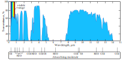

*Figure 7. Transmittance of the atmosphere from visible to far infrared spectrum. Figure by [Even 2021/Wikipedia](https://commons.wikimedia.org/wiki/File:Atmosfaerisk_spredning-en.svg), [CC0 1.0 Universal](https://creativecommons.org/publicdomain/zero/1.0/deed.en).*

The radiance in the solar region (0.4 - 2.5 um) collected from a flat terrain in the sensor Ls basically consists of following components ([ATCOR- 4](), [Schowengerdt, 2006)(); see also *Figure 8*):

$$L^s=L_1^s+L_2^s+L_3^s$$

$L_1^s$: surface reflected radiation  
$L_2^s$: up-scattered path radiance  
$L_3^s$: adjacency radiance (radiation reflected from objects adjacent to the measured surface)

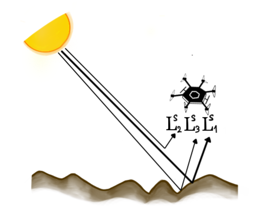

*Figure 8. Components of the measured at-sensor radiance. Figure by course authors.*

Depending on the in-situ measurements and available software tools, the atmospheric correction can be carried out in the following ways:

#### 1. Application of radiative transfer models

Radiative Transfer Models (RTM) provide an estimate of atmospheric effects of absorption and scattering on measured (at-sensor) radiance. 
There are several algorithms available for atmospheric correction of HS data acquired during airborne missions:

* [MODTRAN®](http://modtran.spectral.com/) - MODerate resolution atmospheric TRANsmission (Spectral Sciences Int.)  
* 6S - Second Simulation of the Satellite Signal in the Solar Spectrum ([Vermote et al., 1997](#references))  
* [Airborne ATCOR®](https://www.rese-apps.com/software/atcor-4-airborne/) - ATCOR4 (ATmospheric and topographic CORrection)( ReSe Applications GmbH)  
  
The amount and composition of atmospheric constituents (aerosols, water vapor) are estimated from in-situ measurements (photometers) or directly from collected data (water vapor bands, aerosol optical thickness retrieval using e.g., the dark dense vegetation algorithm). Based on the parameters of the atmosphere and the flying height, the transmittance of the atmosphere can be modelled for each wavelength (based on look-up tables generated by the radiative transfer model). 
Under the assumption of flat terrain, cloud free conditions, and neglecting the adjacency radiance, 
the surface reflectance can be estimated from the formula Ls=L2s+Eg/, where Ls is measured at-sensor radiance,  - reflectance of the surface,  - transmittance, and Eg – solar irradiance at the surface (sum of direct and scattered solar irradiance). 
In the final model, the correction to the adjacency radiance must be added.

If the in-situ spectrometric measurements (surface reflectance) are available, inflight radiometric calibration (gain and offset for each spectral band) or at-sensor radiance validation can be carried out.

If a flat terrain cannot be assumed, a DTM is a required input in order to correct for topographic effects (Richter, 1997). Moreover, the Bidirectional Reflectance Distribution Function (BRDF) correction is applied (Richter and Schläpfer, 2002). In addition, corrections for cirrus cloud or shadows removal can be applied (Schläpfer et al., 2009).
A comprehensive evaluation of RTMs for deriving surface reflectance from HS imagery can be found in Zhou et al. (2023).

#### 2. Empirical line correction

The Empirical Line Correction is based on a linear regression model relating in-situ and image observations (Figure 9). Its use was justified by several authors (e.g., Baugh and Groeneveld, 2008, Oritz et al., 2017), nevertheless, the combination with RTM models gives better results (Hadley et al., 2008). In case that in-situ the dark target measurements are not available, the empirical line passes through the origin (which limits the method in correcting for the effect of transmitted radiation). 

Figure 10 shows an example of corrected spectra using the empirical line method.

*Figure 9. Principle of empirical line correction. Figure by course authors.*

#### 3. Dark object subtraction

This simplest atmospheric correction method is built on a model that the at-sensor radiance Lshas just two components - surface radiance L1s and path radiance L2s: Ls=L1s+L2s. 
To model the path radiance, regions of the scene with expected zero surface reflectance (the very darkest objects in the scene), are found. 
The radiance of pixels corresponding to dark objects is removed from the whole scene. The method is easy to implement and requires no further data. 
The results may not be reliable as the assumption does not hold for real scenarios (Shi et al., 2016). Zhen et al. (2022) propose this methos for haze removal from HS imagery.

There are other empirical methods applicable on HS imagery such as Flat Filed correction, or Internal Average Relative Reflectance (for comparison of the methods see Merzah and Jaber, 2020). Optionally, experience with methods for a radiometric correction of hyperspectral imagery acquired from RPAS systems were tested, e.g., Suomalainen et al. (2021), Schläpfer et al. (2020), Hakala et al. (2018). 

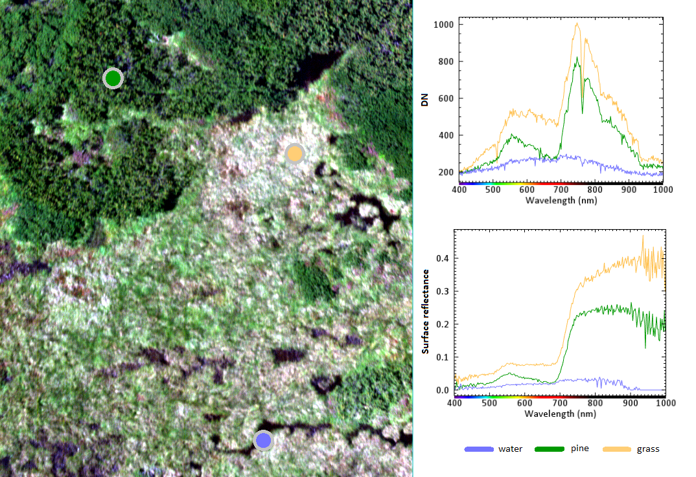

*Figure 10. Example of spectra before (up right) and after (down right) atmospheric correction. The image was acquired with a Nano-Hyperspec® line camera mounted on the DJI Matrice 600 Pro with GSD of 3 cm. The empirical line calibration was carried out based on measurements of a pre-calibrated calibration tarp. Figure by course authors.*

## Geometric correction

The goal of the geometric correction is to compensate for geometric distortions due to perspective projection, changes in the platform altitude, velocity, and rotations and due to uneven terrain. It results in an orthorectified image georeferenced in the required reference coordinate system. 

The airborne systems for HS data acquisition are equipped with a GNSS receiver and an inertial measurement unit – IMU (or an inertial navigation system – INS) to determine the platform position and rotation with respect to the reference coordinate system (e.g., WGS84). Such equipment is necessary in the case of line scanner when each image line has its own parameters of exterior orientation (Pepe et al., 2018). The method of obtaining the image orientation only from the GNSS/INS measurements is called direct georeferencing (e.g., Toth and Józków, 2016; see also Figure 11). It can be realised using the RTK or post-processing kinematic (PPK) measurements. Its use requires high accuracy of the INS which makes the whole system costly. To carry out quality assessment, a number of CPs is needed.

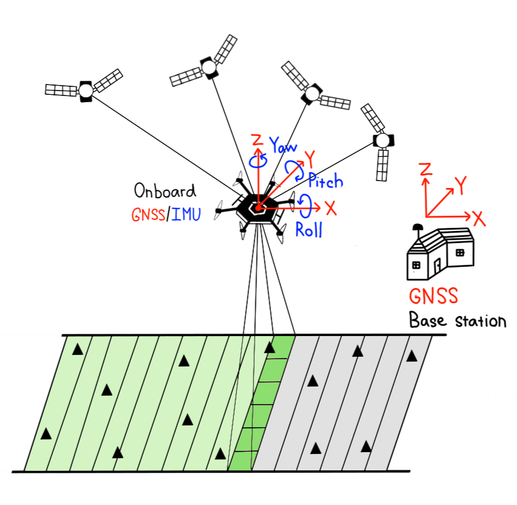

*Figure 11. Direct georeferencing of HS images acquired with a line sensor. The triangles correspond to check points. Figure by course authors.*

In case of a lower quality of the GNSS/INS equipment, GCPs are used to improve the georeferencing. 
Such approach is called an integrated system orientation (ISO, e.g., Toth and Józków, 2016). An indirect georeferencing is then an approach when the GNSS/INS measurements are not used at all, and the image orientation relies only on GCPs – it used to be a case of frame cameras. All three methods of image orientation (direct, integrated, and indirect) are described in photogrammetric literature (e.g., Colomina and Molina, 2014, Kraus 2007). 

If the accuracy of the GNSS/INS is low, remaining distortions after direct georeferencing and orthorectification in images collected with a line scanner can be in the level of decimetres or meters (Hruska et al., 2012). Thus, overlapping images do not also fit, as shown in the Figure 12. 

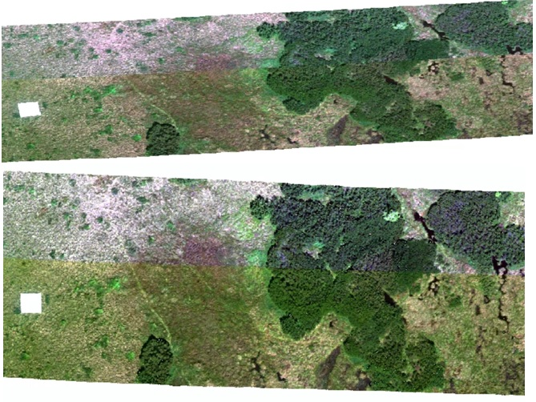

*Figure 12. Geometric correction of an image acquired with a Nano-Hyperspec® line camera mounted on the DJI Matrice 600 Pro. The two overlapping image strips after directs georeferencing and orthorectification (top) and after their rectification into RGB orthoimages acquired with a frame camera Sony A7 ILCE-7 from the same platform (bottom). The correction includes a transformation from the WGS84 (EPSG 4326) coordinate system to the national coordinate system S-JTSK (EPSG 5514). Figure by course authors.*

A possible solution is in registration of distort images into another geographical layer of higher accuracy. Orthoimages acquired with a RGB frame camera during the same flight or another flight within a short time interval (a few days) are often used for this purpose (Suomalainen et al. 2014, Turner et al. 2017, Habib et al. 2016, Angel et al., 2020, Červená et al. 2020). Figure 13 depicts a processing workflow of orientation of images acquired with a line sensor based on fusion with a simultaneously acquired images with a frame camera. The images from the frame camera were georeferenced using GCPs and a standard photogrammetric workflow using structure from motion (Jiang et al., 2020). Table 3 shows that a combined approach brings a considerable improvement to first step orientation based only on GNSS/INS.

## Self-evaluation quiz

<form name="quiz" action="" method="post" onsubmit="evaluate_quiz(); return false">

<!--Question 1-->
<label for="q_01">
When planning a flight mission,
</label> 
<input type="checkbox" name="q_01">no overlap between image lines/strips is necessary. 
<input type="checkbox" name="q_01">overlap is necessary only in the hilly terrain. 
<input type="checkbox" name="q_01">a higher value of overlap is better in hilly terrain than in flat terrain. 

a higher value of overlap is better in hilly terrain than in flat terrain.

<output id="output_q_01"></output>  

<!--Question 2-->
<label for="q_02">
If possible, how would you choose the flight azimuth?
</label> 
<input type="checkbox" name="q_02">Perpendicular to the current sun azimuth. 
<input type="checkbox" name="q_02">Close to the current sun azimuth. 
<input type="checkbox" name="q_02">Arbitrary. The relations between the azimuths does not influence the image radiometry. 

Close to the current sun azimuth.

<output id="output_q_02"></output>  

<!--Question 3-->
<label for="q_03">
You have a camera with a focal length of 15 mm and a pixel size of 7.5 μm. What flying height above the terrain do you need to plan to achieve the GSD of 5 cm?
</label> 
<input type="checkbox" name="q_03">70 m 
<input type="checkbox" name="q_03">85 m 
<input type="checkbox" name="q_03">100 m 

100 m

<output id="output_q_03"></output>  

<!--Question 4-->
<label for="q_04">
Radiometric correction includes:
</label> 
<input type="checkbox" name="q_04">sensor calibration and atmospheric correction. 
<input type="checkbox" name="q_04">sensor calibration. 
<input type="checkbox" name="q_04">atmospheric correction. 

sensor calibration and atmospheric correction.

<output id="output_q_04"></output>  

<!--Question 5-->
<label for="q_05">
Which are empirical methods for atmospheric correction?
</label> 
<input type="checkbox" name="q_05">Empirical line and radiative transfer model. 
<input type="checkbox" name="q_05">Empirical line and dark object subtraction. 
<input type="checkbox" name="q_05">Dark object subtraction and radiative transfer model. 

Empirical line and dark object subtraction.

<output id="output_q_05"></output>  

<!--Question 6-->
<label for="q_06">
The platform is equipped with a GNSS/INS. At the same time 2 GCPs were measured. What kind of georeferencing can you carry out?
</label> 
<input type="checkbox" name="q_06">Direct georeferencing 
<input type="checkbox" name="q_06">Integrated sensor orientation 
<input type="checkbox" name="q_06">Indirect georeferencing 

Direct georeferencing&Integrated sensor orientation

<output id="output_q_06"></output>  

<input type="submit" value="Submit" style="font-size:14pt">  

<output id="output_overall">
</output>
</form>

## Excercise

### Geometric correction

The aim of this exercise is to perform geometric correction of hyperspectral image data acquired with an UAV pushbroom scanner.  

Please proceed to the exercise: [Geometric correction](02_aerial_acquisition_preprocessing_exercise_geometric.md).

### Spectra smoothening and denoising 

Please proceed to the tutorial: [Spectra smoothening and denoising](filtering_spectral_curve.ipynb).

### Next unit
Proceed with [In situ and laboratory spectroscopy of vegetation](../03_relating_imagery_lab_vegetation/03_01_optical_parameters_of_foliage.md)

## References
### Key literature

Pepe, M., Fregonese, L., Scaioni, M. (2018). Planning airborne photogrammetry and remote-sensing missions with modern platforms and sensors. European Journal of Remote Sensing, 51(1), 412-436. https://doi.org/10.1080/22797254.2018.1444945

Schläpfer, D., Richter, R., Hueni, A. (2009). Recent developments in operational atmospheric and radiometric correction of hyperspectral imagery. In Proc. 6th EARSeL SIG IS Workshop (pp. 16-19). https://www.researchgate.net/publication/279261110_Recent_developments_in_operational_atmospheric_and_radiometric_correction_of_hyperspectral_imagery

Habib, A., Han, Y., Xiong, W., He, F., Zhang, Z., Crawford, M. (2016). Automated ortho-rectification of UAV-based hyperspectral data over an agricultural field using frame RGB imagery. Remote Sensing, 8(10), 796. https://doi.org/10.3390/rs8100796  

### Further articles, referenced literature and resources
Angel, Y., Turner, D., Parkes, S., Malbeteau, Y., Lucieer, A., McCabe, M. F. (2019). Automated georectification and mosaicking of UAV-based hyperspectral imagery from push-broom sensors. Remote Sensing, 12(1), 34. https://doi.org/10.3390/rs12010034 

ATCOR-4 (2023): ATCOR 4 - for Airborne Remote Sensing Systems. https://www.rese-apps.com/software/atcor-4-airborne/index.html 

Baugh, W. M., Groeneveld, D. P. (2008). Empirical proof of the empirical line. International Journal of Remote Sensing, 29(3), 665-672. https://doi.org/10.1080/01431160701352162

Broge, N. H., & Mortensen, J. V. (2002). Deriving green crop area index and canopy chlorophyll density of winter wheat from spectral reflectance data. Remote sensing of environment, 81(1), 45-57. https://doi.org/10.1016/S0034-4257(01)00332-7 

Canada Centre for Mapping and Earth Observation – Remote Sensing Tutorial. https://natural-resources.canada.ca/maps-tools-and-publications/satellite-imagery-and-air-photos/tutorial-fundamentals-remote-sensing/9309

Albrechtová, J., Kupková, L., Campbell, P. K. (2017). Metody hodnocení fyziologického stavu smrkových porostů: případové studie sledování vývoje stavu smrkových porostů v Krušných horách v letech 1998-2013. Česká geografická společnost. 

Červená, L., Lysák, J., Potůčková, M., Kupková, L. (2020). Zkušenosti se zpracováním hyperspektrálních dat pořízených UAV. GIS Ostrava. https://doi.org/10.31490/9788024843988-4 

Colomina, I., Molina, P. (2014). Unmanned aerial systems for photogrammetry and remote sensing: a review. ISPRS J. Photogramm. Remote Sens. 92, 79–97 https://doi.org/10.1016/j.isprsjprs.2014.02.013 

ENVI (2023). Vegetation Indices Background. https://www.nv5geospatialsoftware.com/docs/backgroundvegetationindices.html 

Förstner, W., Wrobel, B. P. (2016). Photogrammetric computer vision. Springer International Publishing Switzerland.

Green, A. A., Berman, M., Switzer, P., & Craig, M. D. (1988). A transformation for ordering multispectral data in terms of image quality with implications for noise removal. IEEE Transactions on geoscience and remote sensing, 26(1), 65-74. DOI: 10.1109/36.3001

Hadley, B. C., Garcia-Quijano, M., Jensen, J. R., Tullis, J. A. (2005). Empirical versus model‐based atmospheric correction of digital airborne imaging spectrometer hyperspectral data. Geocarto International, 20(4), 21-28. https://doi.org/10.1080/10106040508542360

Hakala, T. et al. (2018). Direct reflectance measurements from drones: Sensor absolute radiometric calibration and system tests for forest reflectance characterization. Sensors, 18(5), 1417. https://doi.org/10.3390/s18051417 

Hanuš, J., Fabiánek, T., Fajmon, L. (2016). Potential of airborne imaging spectroscopy at CzechGlobe. The International Archives of the Photogrammetry, Remote Sensing and Spatial Information Sciences, 41, 15-17. https://doi.org/10.5194/isprs-archives-XLI-B1-15-2016 

Hruska, R., Mitchell, J., Anderson, M., Glenn, N. F. (2012): Radiometric and Geometric Analysis of Hyperspectral Imagery Acquired from an Unmanned Aerial Vehicle. Remote Sensing. 9, 4, 2736–2752. https://doi.org/10.3390/rs4092736 

Jiang, S., Jiang, C., Jiang, W. (2020). Efficient structure from motion for large-scale UAV images: A review and a comparison of SfM tools. ISPRS Journal of Photogrammetry and Remote Sensing, 167, 230-251. https://doi.org/10.1016/j.isprsjprs.2020.04.016 

Kokaly, R. F., Clark, R. N. (1999). Spectroscopic determination of leaf biochemistry using band-depth analysis of absorption features and stepwise multiple linear regression. Remote sensing of environment, 67(3), 267-287. https://doi.org/10.1016/S0034-4257(98)00084-4 

Kraus, K. (2007).  Photogrammetry: Geometry from Images and Laser Scans. de Gryter, 2nd edition.

Malenovsky, Z., Ufer, C., Lhotáková, Z., Clevers, J. G., Schaepman, M. E., Albrechtová, J., & Cudlín, P. (2006). A new hyperspectral index for chlorophyll estimation of a forest canopy: Area under curve normalised to maximal band depth between 650-725 nm. EARSeL eProceedings, 5(2), 161-172. https://library.wur.nl/WebQuery/wurpubs/346566 

Merzah, Z. F.,  Jaber, H. S. (2020). Assessment of Atmospheric Correction Methods for Hyperspectral Remote Sensing Imagery Using Geospatial Techniques. In IOP Conference Series: Materials Science and Engineering (Vol. 745, No. 1, p. 012123). IOP Publishing. https://iopscience.iop.org/article/10.1088/1757-899X/745/1/012123

de Miguel, E., Jiménez, M., Pérez, I., de la CÁMARA, Ó. G., Muñoz, F., Gómez-Sánchez, J. A. (2015). AHS and CASI processing for the REFLEX remote sensing campaign: methods and results. Acta Geophysica, 63, 1485-1498. https://doi.org/10.1515/acgeo-2015-0031 

Ortiz, J. D., Avouris, D., Schiller, S., Luvall, J. C., Lekki, J. D., Tokars, R. P., Becker, R. (2017). Intercomparison of approaches to the empirical line method for vicarious hyperspectral reflectance calibration. Frontiers in Marine Science, 4, 296. https://doi.org/10.3389/fmars.2017.00296 

Remondino, F., Spera, M. G., Nocerino, E., Menna, F., Nex, F. (2014). State of the art in high density image matching. The photogrammetric record, 29(146), 144-166. https://doi.org/10.1111/phor.12063

Richter, R. (1997). Correction of atmospheric and topographic effects for high spatial resolution satellite imagery. International journal of remote sensing, 18(5), 1099-1111. https://doi.org/10.1080/014311697218593

Richter, R., Schläpfer, D. (2002). Geo-atmospheric processing of airborne imaging spectrometry data. Part 2: Atmospheric/topographic correction. International Journal of Remote Sensing, 23(13), 2631-2649. https://doi.org/10.1080/01431160110115834 

Roberts, D. A., Roth, K. L., Wetherley, E. B., Meerdink, S. K., Perroy, R. L. (2018). Hyperspectral vegetation indices. In Hyperspectral indices and image classifications for agriculture and vegetation (pp. 3-26). CRC press. 

Schläpfer, D., Popp, C., Richter, R. (2020). Drone data atmospheric correction concept for multi-and hyperspectral imagery–the DROACOR model. Int. Arch. Photogramm. Remote Sens. Spatial Inf. Sci., XLIII-B3-2020, 473–478. https://doi.org/10.5194/isprs-archives-XLIII-B3-2020-473-2020 

Schowengerdt, R. A. (2006). Remote sensing: models and methods for image processing. Elsevier, 3rd edition.

Stull, R. (2023): Scattering. LibreTexts, Geosciences. 22.4 Scattering. https://geo.libretexts.org/Bookshelves/Meteorology_and_Climate_Science/Practical_Meteorology_%28Stull%29/22%3A_Atmospheric_Optics/22.03%3A_New_Page

Suomalainen, J., Anders, N., Iqbal, S., Roerink, G., Franke, J., Wenting, P., ... , Kooistra, L. (2014). A lightweight hyperspectral mapping system and photogrammetric processing chain for unmanned aerial vehicles. Remote Sensing, 6(11), 11013-11030. https://doi.org/10.3390/rs61111013 

Suomalainen, J., Oliveira, R. A., Hakala, T., Koivumäki, N., Markelin, L., Näsi, R., Honkavaara, E. (2021). Direct reflectance transformation methodology for drone-based hyperspectral imaging. Remote Sensing of Environment, 266, 112691. https://doi.org/10.1016/j.rse.2021.112691 

Toth, C., Józków, G. (2016). Remote sensing platforms and sensors: A survey. ISPRS Journal of Photogrammetry and Remote Sensing, 115 (2016) 22–36. doi: https://doi.org/10.1016/j.isprsjprs.2015.10.004

Turner, D., Lucieer, A., McCabe, M., Parkes, S., Clarke, I. (2017). Pushbroom hyperspectral imaging from an unmanned aircraft system (uas)–geometric processing workflow and accuracy assessment. The International Archives of the Photogrammetry. Remote Sensing and Spatial Information Sciences. XLII-2/W6. 379–384. http://dx.doi.org/10.5194/isprs-archives-xlii-2-w6-379-2017 

Vaiphasa, C. (2006). Consideration of smoothing techniques for hyperspectral remote sensing. ISPRS journal of photogrammetry and remote sensing, 60(2), 91-99. https://doi.org/10.1016/j.isprsjprs.2005.11.002 

Vermote, E. F., Tanré, D., Deuze, J. L., Herman, M., Morcette, J. J. (1997). Second simulation of the satellite signal in the solar spectrum, 6S: An overview. IEEE transactions on geoscience and remote sensing, 35(3), 675-686. DOI: 10.1109/36.581987 

Zhou, Q., Wang, S., Liu, N., Townsend, P. A., Jiang, C., Peng, B., Verhoef, W., Guan, K. (2023). Towards operational atmospheric correction of airborne hyperspectral imaging spectroscopy: Algorithm evaluation, key parameter analysis, and machine learning emulators. ISPRS Journal of Photogrammetry and Remote Sensing, 196, 386-401. https://doi.org/10.1016/j.isprsjprs.2022.11.016 
