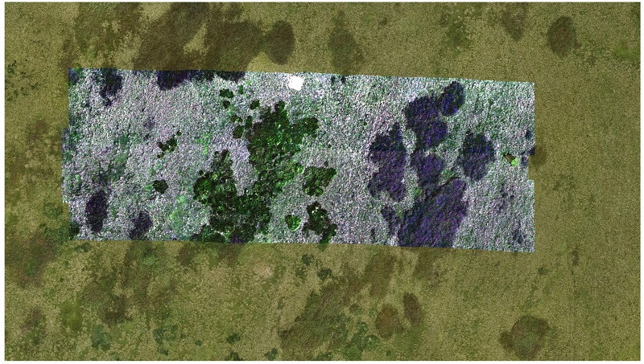
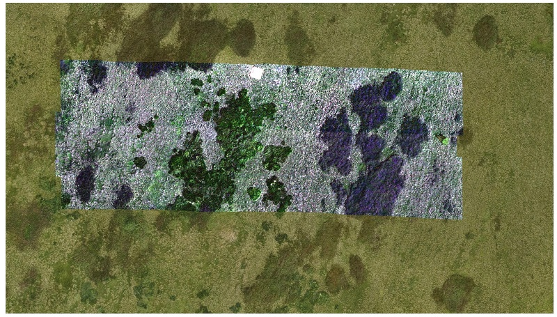

## Report 

##### Data preparation, relative and absolute accuracy

The provided hyperspectral image strips were loaded and visualized in the QGIS environment, along with the positions of the checkpoints.
The difference between the XY coordinates of the checkpoints in the image strips and in the shapefile was determined. 
In addition, four identical points were found in strip (line) pairs 2 and 3, 3 and 4, and the difference between their XY coordinates was analyzed.
The horizontal shift, standard deviation, and Root Mean Square Error (RMSE) from both relative and absolute residuals were computed (see table below).

<i>"Raw" image data</i>

|  |           |                        |          |   |                      |           |                        |          |
|:-----------------:|:---------:|:----------------------:|:--------:|:---:|:--------------------:|:---------:|:----------------------:|:--------:|
| **Absolute accuracy** | shift [m] | standard deviation [m] | RMSE [m] |   | **Relative accuracy**    | shift [m] | standard deviation [m] | RMSE [m] |
| strip (line) 2    | 0.35      | 0.04                   | 0.35     |   | strip (line) 2 and 3 | 2.01      | 0.32                   | 2.03     |
| strip (line) 3    | 1.28      | 0.51                   | 1.71     |   | strip (line) 3 and 4 | 1.50      | 0.12                   | 1.50     |
| strip (line) 4    | 0.39      | 0.08                   | 0.40     |

##### Image registration

The orthorectified RGB image with a defined CRS (EPSG:5514) was loaded and used as a base for coregistration and orthorectification of the hyperspectral image strips. 
In the "Georeferencer" app, at least five identical points were evenly collected throughout the area. The "Transformation type" Polynomial 1 (1st order polynomial) and Thin plate spline was tested. 
As for the "Resampling method", Nearest neighbour was used. The procedure was repeated for each image strip (line). 

<i>Geometrically corrected hyperspectral image strips - affine transfromation</i>

      

<i>Geometrically corrected hyperspectral image strips - spline transfromation</i>

 

The residuals on the GCPs after the transformation were found in the generated PDF report, their mean was computed (see table below).

<i>GCP residuals</i>

|   |                               |   |                       |
|:--------------:|:-----------------------------:|:---:|:---------------------:|
| **mean [m]**       | 1st polynomial transformation |   | spline transformation |
| strip (line) 2 | 0.04                          |   | 0.00                  |
| strip (line) 3 | 0.03                          |   | 0.00                  |
| strip (line) 4 | 0.01                          |   | 0.00                  |

##### Accuracy assessment

The relative and absolute accuracy of the orthorectified hyperspectral image strips was assessed using the same procedure as before. 

<i>1st polynomial transformation</i>

|                   |           |                        |          |   |                      |           |                        |          |
|:-----------------:|:---------:|:----------------------:|:--------:|:---:|:--------------------:|:---------:|:----------------------:|:--------:|
| **Absolute accuracy** | shift [m] | standard deviation [m] | RMSE [m] |   | **Relative accuracy**   | shift [m] | standard deviation [m] | RMSE [m] |
| strip (line) 2    | 0.08      | 0.05                   | 0.09     |   | strip (line) 2 and 3 | 0.13      | 0.08                   | 0.14     |
| strip (line) 3    | 0.06      | 0.03                   | 0.07     |   | strip (line) 3 and 4 | 0.12      | 0.08                   | 0.14     |
| strip (line) 4    | 0.04      | 0.02                   | 0.04     |

<i>Affine transformation</i>

|                   |           |                        |          |   |                      |           |                        |          |
|:-----------------:|:---------:|:----------------------:|:--------:|:---:|:--------------------:|:---------:|:----------------------:|:--------:|
| **Absolute accuracy** | shift [m] | standard deviation [m] | RMSE [m] |   | **Relative accuracy**    | shift [m] | standard deviation [m] | RMSE [m] |
| strip (line) 2    | 0.09      | 0.05                   | 0.11     |   | strip (line) 2 and 3 | 0.13      | 0.04                   | 0.14     |
| strip (line) 3    | 0.07      | 0.04                   | 0.08     |   | strip (line) 3 and 4 | 0.12      | 0.07                   | 0.13     |
| strip (line) 4    | 0.05      | 0.01                   | 0.06     |

##### Q&A 

* Evaluate the absolute and relative accuracy after geometric correction. What is the maximum error? Is the resulting accuracy sufficient?  
    + 
* Compare the “raw” image strips with the geometrically corrected (orthorectified) image strips in terms of computed accuracy and visual inspection.  
    + 
* Are there any differences between the results of the spline and polynomial transformations?  
    + 
* Comment on the used resampling method: what does “Nearest neighbour” ensure? Would using a different resampling type affect the image, and if yes, then how?  
    + 
    
### Back to theme 
Proceed by returning to [Aerial/RPAS hyperspectral data acquisition and pre-processing](../02_aerial_acquisition_preprocessing.md)
