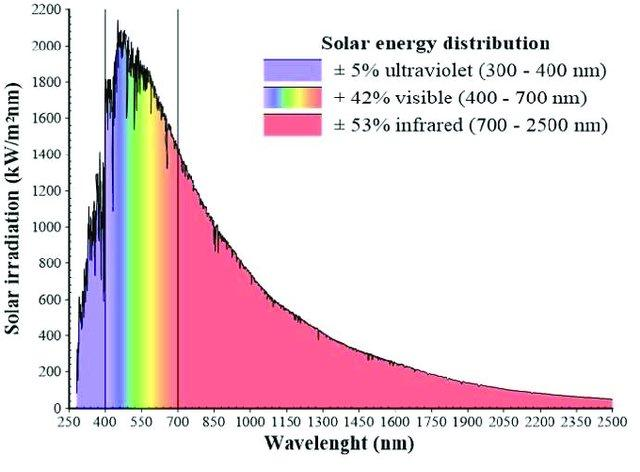

# Principles of laboratory spectroscopy

## Objectives

In this theme, you will learn about:

* the basic principles of laboratory spectroscopy
* acquisition of optical properties of leaf samples

After finishing this theme you will be able to:

* understand examples of using spectroradiometer with two different measurement setups – the contact probe (CP) and the integrating sphere (IS)
* discuss the pros and cons of each measurement type

## Spectral reflectance acquisition – general introduction

The optical property used for interpretation in field and laboratory spectroscopy is **reflectance**. Reflectance is defined as the fraction of total radiant flux incident upon the surface of a sample that is reflected, which varies according to the wavelength distribution of the incident radiation (*Figure 1* ). In laboratory and field spectroscopy, the total incident radiance is usually measured as radiance reflected from very high (99%) diffuse material over the spectral interval recorded by the spectroradiometer. Various polymers are used to manufacture reference panels with high and spectrally constant diffuse reflectance. The most common are Spectralon® and Zenith Polymer®.

*Figure 1. Definition of leaf spectral reflectance as the ratio of measured radiance reflected from a white reference panel and an object (leaf) – upper part. Solar energy distribution in spectral range between 250 and 2500 nm – lower part. The interval between 300-2500 nm corresponds to the spectral range of maximal Solar energy and therefore is covered by the most of field and laboratory spectroradiometers. (Figure by [Ramos et al. 2020](http://doi.org/10.1051/e3sconf/202017221003) / [CC BY 4.0](https://creativecommons.org/licenses/by/4.0/))*

Spectroradiometers used for field and laboratory spectroscopy of vegetation usually operate in a spectral interval of 300-2500 nm that coincides with the spectral range of maximal solar energy distribution (*Figure 1* ). We use the ASD FieldSpec 4 spectroradiometer (*Figure 2* ) as an example to demonstrate spectral reflectance measurement with the main focus on vegetation at various hierarchical levels (leaf and canopy) and in three different measurement setups (*Figure 2 A-C* ). 

*Figure 2. Three most used vegetation optical properties measurement setups with a field and laboratory spectroradiometer. A) Field measurement of grassland canopy reflectance using an optical cable held by a pistol grip. B) Laboratory measurement of leaf level reflectance using a contact probe. C) Laboratory measurement of leaf level reflectance and transmittance using an integrating sphere.*

Field spectroradiometers measure reflectance at various hierarchical levels depending on the device connected to the optical cable. Field measurements with bare optical cable fixed in a “pistol” grip are typical for canopy measurements of grasslands, cereal crops with narrow leaves, or data collection from reference surfaces (sand, concrete etc.) used for radiometric correction of airborne data (*Figure 2A* ). At the leaf level, there are two common attachments that connect to the spectroradiometer to measure vegetative reflectance: the contact probe (CP) (*Figure 2B* ) and the integrating sphere (IS) (*Figure 2C* ). Laboratory measurements at the leaf level can serve as input to radiative transfer models and be used for upscaling to the canopy level or for leaf trait retrieval at the leaf level. 
However, the reflectance measurements with CP or IS are not interchangeable. The main reason is the difference between geometry of the light source and the sensor, providing specific advantages regarding speed, laboriousness, and field operability of the spectra collection. The radiation quantity measured by the CP is usually termed in the literature as bidirectional reflectance factor (BRF) as the light source and sensor geometry is fixed in stable directional position to each other (*Figure 3A* ). The radiation quantity acquired by the IS is called directional-hemispherical reflectance factor (DHRF) for having the directional light source and having the reflected or transmitted radiation integrated from the whole hemisphere (*Figure 3B* ). There are several studies focused on the comparison of those two types of spectral quantities [Potůčková et al., 2016a](#references)), or between DHRF acquired by two types of integrating spheres ([Hovi et al., 2020](#references)).

*Figure 3. Two most commonly measured reflectance quantities A) Bidirectional Reflectance Factor by the contact probe or leaf clip and B) Directional-Hemispherical reflectance factor by the integrating sphere. (Figure by the authors).*

## Spectral reflectance acquisition with the spectroradiometer ASD FieldSpec®
After assembling the spectroradiometer with a CP, IS, or “pistol” grip and an operating computer (could be via Wifi or Ethernet cable), the spectroradiometer should warmup for at least 30 minutes. While warming up, some preparatory procedures for data acquisition and saving can be done. One of the operating software for ASD FieldSpec is RS3. We will use RS3 to demonstrate how to set measurement settings.

### Setting Spectrum Save
A folder should be created where the measured spectra will be automatically saved in your favourite file manager. Next, the spectra should be set to be saved here in RS3 (*Figure 4* ). The instrument scans the incoming radiance continually and saves the measurement after pressing the space bar (will be shown later). The saved files share the “base name” that you set in the Spectrum save settings and with each saved spectrum the number in the file name increases. It is recommended to record sample IDs with spectra numbers to an additional protocol. For more details check the RS3 User Guide (can be found on the internet). 

*Figure 4. The screen of Spectrum save menu in RS3 software. Explanation of spectrum save settings is provided in the right box. For more details check the RS3 User Guide.*

### Adjust configuration 
The bane of all electrical data analysis is noise. Noise, in all of its forms, manifests itself in detection equipment of any kind as uncertainty in the measurement. Noise is random. This means it can usually be reduced in the desired spectral signal by a technique called spectrum averaging. The number of scans to average should be a good compromise between noise reduction and time spent on measuring one sample (*Figure 5* ). When measuring vegetation, you should consider that the light source heats the leaf. An average of 25 scans should be sufficient. Averaging can be reduced to 15 when dealing with thin, delicate, or young leaves. While measuring in the integrating sphere, the averaging for a sample and white reference should be higher to get a sufficient signal (e.g., 50 for a leaf sample and 100 for white reference - WR), the leaf is not in direct contact with the light source, so the overheating of leaf is less probable. When measuring in the field (*Figure 2A* ) and using the sunlight as the illumination source, you can use the settings as for the CP. The vegetation won’t overheat, but sometimes you have to deal with the changing illumination caused by clouds, so you have to be fast to get the measurements.

*Figure 5. The screen of Instrument Configuration menu in RS3. Comparison of preferred configuration for CP (left) and IS (right) spectra acquisition.*

## Contact probe laboratory spectra acquisition
A contact probe is a device mainly designed for contact measurements of solid raw materials, such as minerals and grains, but also used for vegetation samples (*Figure 6* ). A probe has its own light source (typically a krypton halogen bulb) integrated within its body. A CP maintains a constant distance from the probe lens to the sample. A CP allows only reflectance measurements, not transmittance. The CP has some advantages, like avoiding problems with stray light, operating flexibility, and speed. Also, by its design, it allows for repetitive and non-destructive in-situ measurements of samples if used with a leaf clip. The CP is connected to the spectroradiometer by an optical cable for data acquisition and a power cable as an energy source for the light bulb (in the case of laboratory measurement). It is possible to measure in the field as well, however, this setup requires an additional battery for the contact probe light source.

*Figure 6. The ASD FieldSpec 4 spectroradiometer with operating PC, contact probe, white reference panel and leaf sample on a spectrally black background.*

### Optimization
Spectroradiometer measurements are recorded as a dimensionless integer value called digital numbers (DN). Their relationship to the actual radiometric quantity measured, spectral radiance [ $W/m^2/µm/sr$ ], is given by the instrument's calibration curve. The spectroradiometer must be optimized before any data is collected (Figure 7). During the optimization process, the contact probe is placed on the Spectralon white reference panel. Optimization sets the proper settings for the light source being used to collect spectra. If the light source does not change substantially and the instrument is warmed up, there should be no reason to re-optimize. After optimization, a graph will display measurements in raw digital numbers (DN) plotted against wavelength in nm.

*Figure 7. The main RS3 screen during instrument optimization. Three spectral ranges corresponding to three sensors of ASD Fieldspec4 are indicated. Red arrow shows the optimization button or key shortcuts to optimize. The spectral curve on the display is the DN spectrum of a white reference panel after optimization.*

### Recording white reference 
After optimizing the instrument, record the radiance reflected by the calibration panel (*Figure 8* ). The white reference is required because the spectroradiometer only measures the intensity of a light field through a given point in space. With the WR available and known, RS3 can compute the reflectance for the material being sampled by the spectroradiometer. This enables the machine to record and display all future measurements as reflectance. The white reference should be done as often as possible, minimally every ten to fifteen minutes when using solar illumination and every thirty minutes when using artificial illumination sources. 

*Figure 8. Taking the spectra of the white reference panel – instrument calibration. Left – holding still the contact probe on a reference panel. Right - main RS3 screen after taking white reference spectra.*

<iframe width="560" height="315" src="https://www.youtube.com/embed/KCbcaG5zrgc?cc_load_policy=1" frameborder="0" allowfullscreen>
</iframe>

<iframe width="560" height="315" src="https://www.youtube.com/embed/LgqzQM9g7kY?cc_load_policy=1" frameborder="0" allowfullscreen>
</iframe>

### Recording sample reflectance at the leaf level by CP

To record spectral measurements of detached leaf samples, place them on a dark background with high absorption along the whole spectral range of the spectroradiometer (*Figure 9* ). A remarkable portion of incoming radiation is transmitted by the vegetation samples, particularly in green, NIR, and SWIR wavelengths. The low reflectance background absorbs this transmitted radiation and avoids a bias by additional reflection and transmission from the lower part of the sample. The spectrally black background could be any surface painted with a special low reflectance black coating. Always attach the contact probe in the same orientation to the leaf, the measurement taken by the contact probe is directional.

*Figure 9. Taking the spectra of the leaf samples. Left – holding still the contact probe on a leaf sample, beech leaf. Right – taking the spectra of silver fir needles attached to the shoots – note the same orientation of shoots with twigs.*

### Saving the spectra

After placing the contact probe on a leaf or shoot sample, save the spectrum by pressing the spacebar. Once the spectrum is saved the RS3 gives a sound signal. It is important to hold the probe still until the given number of scans for averaging is completed by the instrument (*Figure 10* ). The instrument measures continually. Saving the spectrum before the given number of scans is acquired for averaging results in underestimated sample reflectance. Check the Spectrum Avg bar in the lower left part of the RS3 screen.

*Figure 10. Sequence of main RS3 screen shots when: A) the contact probe places on a black background. B) during replacement of the contact probe from the black background to the leaf sample but with still insufficient number of scans; C) the contact probe placed on the leaf sample with 100% of leaf scans.*

<iframe width="560" height="315" src="https://www.youtube.com/embed/fU4GWA2Ylq4?cc_load_policy=1" frameborder="0" allowfullscreen>
</iframe>

<iframe width="560" height="315" src="https://www.youtube.com/embed/rdldjdcbMNM?cc_load_policy=1" frameborder="0" allowfullscreen>
</iframe>

### Visualizing measurements in ViewSpecPro and spectra
After spectra acquisition, the data could be visualized in ViewSpecPro software as digital numbers (*Figure 11A* ) or relative reflectance (*Figure 11B* ). Not much can be inferred from DN visualization. In contrast, with some basic knowledge about leaf biophysical and structural properties determining its optical properties, you can be sure that you deal with vegetation spectra if visualized as reflectance (*Figure 11B* ). The radiance reflected from the sample is related to the last measured white reference.

*Figure 11. The screen of ViewSpecPro software Graph visualization. A) white reference and leaf sample spectra in digital numbers, DN. B) white reference and leaf sample spectra expressed as reflectance. A typical spectral reflectance curve of foliage is displayed.*

## Integrating sphere laboratory spectra acquisition

An integrating sphere (IS) is a piece of equipment for measuring leaf optical properties: reflectance and transmittance. The hollow sphere is coated with highly reflecting material in required spectral interval. Usually, the integrating sphere has several ports for light source, detector cable and object samples. Integrating spheres collect reflected light from samples over a full hemisphere. The sphere, by nature of its internal diffuse (Lambertian) reflection and integration of the energy, is insensitive to directional reflectance features coming from the sample, and therefore, gives a very repeatable “averaged” response to the reflectance of the sample placed in the beam at the sphere port. 
The basic principle of measuring leaf directional-hemispherical reflectance (*Figure 3B* ) and transmittance is given by the position of the light source, leaf sample and detector (*Figure 12* ). For practical demonstration of measuring leaf sample spectra in the integrating sphere we will show some examples with the ASD RTS-3ZC integrating sphere (Malvern Panalytical, USA). This type of IS has six ports, to which can be attached light source, detector optical cable, samples, light trap or some of the ports can be plugged. For orientation of IS ports see *Figure 13*.

*Figure 12. The general scheme of measurement of the directional-hemispherical reflectance (left) and transmittance (right) in the integrating sphere.*

*Figure 13. The ASD RTS-3ZC integrating sphere. Left: Schema of the ASD integrating sphere and its ports: (A) Reflectance input; (B) Reflectance comparison; (C) Reflectance sample; (D) Transmission input; (E) Specular Exclusion Light Trap; (F) Fibre Adapter Port; (G) Collimated Light Source Assembly. The picture shows the setup of sample‘s reflectance measurement. For the white reference measurement content of the ports (B) and (C) are changed as described in Table 1, explained below. Right: Integrating sphere with attached sample or reference panel holders in ports (B) and (C) and optic fibre from the spectroradiometer in port (F).*

### The ASD RTS-3ZC Integrating sphere components.
The light source assembly (*Figure 14A, B, C* ) provides a collimated beam which illuminates the sample, or the reference panel attached to the IS ports. It can be mounted to the port (A) for reflectance measurements or to the port (D) for transmittance measurements, as will be shown later. The light source has a high and low power setting (*Figure 14C* ). Mind that LOW is equivalent to one solar unit and suitable for leaf level measurements, while the HIGH setting is greater than one solar unit, which may affect vegetation by overheating or drying during the measurements. The reference standard panels (99% reflectance) are necessary for routine reflectance and transmittance measurements, particularly for optimization process and white reference spectra acquisition (*Figure 14A* ). The use of light trap is important for sample reflectance measurement – it prevents the ambient light entering the sphere from the back side of the sample. After mounting the light source assembly to the (A) port it is recommended to check that the light beam illuminates the central part of the port (use a paper sheet to see the beam position; see *Figure 14E* ).

*Figure 14. The ASD RTS-3ZC integrating sphere components. A) Components that can be mounted to the sample holders and ports of the IS: Collimated light source assembly, reference standard panels (99% reflectance), light trap. B) Collimated light source assembly – front view, facing the sphere ports. C) Light source assembly power settings – LOW power is suitable for measuring optical properties of vegetation. D) Light source assembly (red arrow) mounted to the port (A) for instrument optimization and reflectance measurements. E) The central position of the light beam in the reflectance port (C), viewed through a sheet of paper.*

### Optimization
Similarly, as for measurements with the contact probe, the spectroradiometer must be optimized before any data from integrating sphere are collected. Optimization sets the proper settings for the light source being used to collect spectra. If the light source does not change substantially and the instrument is warmed up, there should be no reason to re-optimize. During the optimization process, the light source is attached to the port (A) and all other IS ports should be plugged with reference white material (Figure 15). It is recommended to place the uncalibrated reference to the port (B) and the calibrated one to the port (C). After optimization, a graph will display measurements in raw digital numbers (DN) plotted against wavelength in nm (see *Figure 6* ).

### Saturation 
If the spectroradiometer receives a higher radiation flux than it is optimized for, it saturates with signal. It can happen while rearranging reference panels, sample, or light source among the ports. RS3 provides a saturation alarm: when saturation occurs, an audible beep will sound, and the Spectrum Avg progress control will display “Saturation”. If this happens, the instrument must be optimized. When measuring in the field, saturation may occur when sunlight conditions change significantly from diffuse to direct sunlight. Saturation is rare when measuring with a contact probe.

*Figure 15. The ASD RTS-3ZC integrating sphere components port setup for spectroradiometer optimization. The light source assembly is attached to the port (A), the (B) and the (C) ports are plugged with white reference panels (red arrows), the (D) and (E) ports are plugged also (not seen) with their respective white plugs.*

### Stray light
The beam of light illuminating the sample or reference is not perfectly collimated. This means that some “stray” radiation is directly getting to the sphere walls without first striking the sample or reference. This background or stray light level may have to be accounted for. Sometimes it is not also possible to absolutely prevent the noise caused by the radiation entering the detector from external environment. The good practice with laboratory spectroscopy is to use dark black painted room (*Figure 2C* ), however it is not always available. In some vegetation studies, the leaf optical properties are acquired directly in the field (*Figure 16* ). Therefore, it is necessary to measure the level of stray light spectra for later correction of collected reflectance and/or transmittance spectra (*Figure 17* ). The stray light spectra should be measured in both, reflectance, and transmittance mode (with port configuration as listed in *Table 1* ). It is not necessary to measure stray light for each sample, the good practice is to measure stray light at the start and finish of each measurement session. Large numbers of scans should be averaged when performing these measurements (200 or more) to minimize the introduction of noise during subsequent calculations. 

*Figure 16. Using the ASD RTS-3ZC integrating sphere (yellow arrows) in the field for vegetation studies. A) Open-air field laboratory. B) Mobile spectroscopic laboratory located in a tent for cases of rain risk or abundant insects. C) Mobile spectroscopic laboratory from inside. Experimental station in beech forest, Štítná nad Vláří, Czechia.*

*Figure 17. The main RS3 screen during the reflectance measurement of stray light in ASD RTS-3ZC integrating sphere. Mind that the stray light reflectance is very low (up to 5 % within VIS and NIR), peaking with higher values at the longer SWIR wavelengths (above 2300 nm).*

### Measurement of the reflectance and transmittance of the leaf samples

#### Integrating sphere port configurations
As previously mentioned, the configuration of IS ports enables to measure reflectance and transmittance of the sample. In both modes it is necessary to acquire spectra of the white reference material, and as well as stray light. Specific IS port configurations for spectra acquisition of reference, stray light, and sample, are indicated in *Table 1*. Ttwo methods for reflectance and transmittance measurements are presented – the first one ignores the substitution error, the second one (and the recommended one) corrects for the substitution error. What is the substitution error? The presence of the reference, then of the sample, in the sphere ports modifies the throughput (the portion of reflected radiation that is seen by the detector). This phenomenon is known as substitution error and can be corrected for. The recommended method of IS spectra acquisition is to use the configuration that corrects for the substitution error. While measuring the white reference, a “dummy sample”, which has nearly the same reflectance as the sample (within 20 % is close enough) is put to the side port (in ASD sphere port (B) for reflectance measurement – *Figure 13* ). This will correct for substitution error with only one reference scan for use with several similar samples.
Similarly, as with contact probe measurements, after setting the desired IS port configuration, the reference or sample reflectance or transmittance could be recorded withing RS3 environment by pressing the spacebar. Once the spectrum is saved, the RS3 gives a sound signal. 
While measuring leaf optical properties, one should keep in mind that the work with biological samples in general and leaves in particular requires to avoid their degradation by long manipulation, drying and heating. Thus, it is recommended to measure the reflectance and transmittance of the leaf with the minimal time lag. This requirement results in frequent changing of the sphere configuration and recording the white reference for each sample. The order of measured quantities (e.g., reflectance of WR and sample) should be designed as a trade-off between excessive IS reconfiguration and minimal time-lag between reflectance (R) and transmittance (T) measurements of the same sample. Due to measurement of two different quantities (R and T) the automatic export of reflectance or transmittance (in the ViewSpecPro software) could not be used in contrast to the contact probe measurements. Recording of WR spectra is necessary for further calculations of reflectance and transmittance from measured DN values.

*Table 1. Port configurations for measurement of optical quantities in reflectance and transmittance mode. DS – dummy sample (specimen with not more than 20 % reflectance difference from a real sample); LT – light trap; P – plug; S – sample; white reference standard – W; Calibrated – cal; Uncalibrated – uncal.*

 

For some examples of IS ports configurations and manipulation, watch the following short movies:

<iframe width="560" height="315" src="https://www.youtube.com/embed/PStfNrYv7YA?cc_load_policy=1" frameborder="0" allowfullscreen>
</iframe>

<iframe width="560" height="315" src="https://www.youtube.com/embed/nF-Va4tGIzI?cc_load_policy=1" frameborder="0" allowfullscreen>
</iframe>

<iframe width="560" height="315" src="https://www.youtube.com/embed/zuFI22-glFc?cc_load_policy=1" frameborder="0" allowfullscreen>
</iframe>

<iframe width="560" height="315" src="https://www.youtube.com/embed/Uu_gIvviL20?cc_load_policy=1" frameborder="0" allowfullscreen>
</iframe>

<iframe width="560" height="315" src="https://www.youtube.com/embed/Yscy8Fm1uy4?cc_load_policy=1" frameborder="0" allowfullscreen>
</iframe>

### Measuring optical properties of needles – challenge no. 1
Flat leaves with sufficient area to cover the entire port of the IS are relatively easy for optical properties measurements. In contrast, the measurement of optical properties of narrow, irregular leaves of conifers – coniferous needles - is challenging as the narrow needles do not fully cover the sample port in integrating spheres and the most common practice is to fix needles in a special carrier (*Figure 18* ) with gaps between them ([Daughtry et al., 1989; Mesarch et al., 1999; Yáñez-Rausell et al., 2014](#references)). The proportion of the gaps within a field of view of the IS (gap fraction, GF) must be evaluated from scans of needles within the carrier (usually using Image analysis tools). The GF is later used for signal correction while calculating final values of needle reflectance and transmittance ([Lhotáková et al., 2021](#references)), (*Figure 21* ). 
In particular, needle transmittance measurements are influenced by the additional signal transmitted through gaps, radiation multiple scattering at the edge of needles and light interaction with a carrier, which often results in erroneous negative transmittance values mainly in the VIS range (as shown, e.g., by ([Olascoaga et al., 2016](#references))) for Norway spruce and Scots pine. Therefore, results based on spectral transmittance of needles should be interpreted with care. The downside of thin leaves measurement using the IS with special carriers is the laboriousness of the sample preparation. 

*Figure 18. Measuring optical properties of coniferous needles using special metal carriers (with spectrally black coating). A) Norway spruce needles fixed in the carrier, prepared for scanning with double-lamp scanner for gap fraction assessment. B) Preparing the needle samples into the carriers; patient and skilled personnel is the necessity. C) Scan of the needles in the carrier used for gap fraction calculation by image analysis.*

### Measuring specular reflectance – challenge no. 2
Some proportion of the radiation is reflected from the leaf surface. The proportion of radiation, which is reflected under the equal angle as the one of incidence is called specular (mirror-like) reflection ([Vanderbilt et al., 1985](#references)) (for more details see the part [Optical parameters of foliage](../03_relating_imagery_lab_vegetation/03_01_optical_parameters_of_foliage.md) of this course). There were many efforts to measure leaf specular reflectance based on the assumption that it is polarized. It has been shown that the nature of the leaf surface (presence of waxes, hairs, etc.) determines the degree of linearly polarized reflectance ([Grant et al., 1993, 1987](#references)). Measuring the degree of light polarization ([Grant et al., 1993; Li et al., 2019; Maxwell et al., 2017; Vanderbilt and Grant, 1986](#references)) is one method to detect changes on the leaf surface ([Maxwell et al., 2017](#references)). When the leaf surface strongly polarizes radiation, it usually reflects white specular reflections ([Vanderbilt et al., 1985](#references)). A polarized light beam is usually used to separate the specular component of reflectance from the diffuse reflectance, which is summarized in a study ([Lao et al., 2006](#references)). 

*Figure 19. Measuring leaf reflectance by two integrating sphere set-ups: total reflectance (RTOT - left) and reflectance with specular component removed (RSR - right). Yellow star in grey circle represents the optical cable sensor, which was placed on the surface of the integrating sphere (Figure modified from ([Neuwirthová et al. 2021](#references)/ [CC BY 4.0](https://creativecommons.org/licenses/by/4.0/))*

Usually, the integrating sphere is designed for the purpose of measuring the diffuse part of the scattered radiation from the sample. This is also the case of previous description of measurements in the ASD RTS-3ZC Integrating sphere, when only four ports are used (port (A-D) ([ASD Inc., 2008; Potůčková et al., 2016b](#references)). The fifth port (E) is placed at the angle equal to the angle of incidence of the radiation, therefore it is possible to remove most of the specular component of the reflectance using a light trap placed into this port (*Figure 19* ). The specular reflectance component itself could be calculated as a difference between the total reflectance (including both diffused and specular reflectance) and the reflectance with the specular component removed (measured with the light trap in port (E)) (*Figure 20* ).

*Figure 20. The example of leaf total reflectance (DHRF, black curve) of the hawkweed (Hieracim nigrescens) decomposed to the specular (blue curve) and diffuse (red curve) components. Left y-axis shows directional–hemispherical reflectance factor (DHRF) of total reflectance (black curve) and the diffuse component (reflectance with the specular component removed, i.e. measured with the light trap in port [E], red curve) and right y-axis corresponds to specular reflectance component. Grey and light red shadows display variance among the samples by standard deviation value. The greenhouse grown juvenile plant with a leaf detail are shown (Figure by ([Neuwirthová et al. 2021](#references)/ [CC BY 4.0](https://creativecommons.org/licenses/by/4.0/))*

## ASCII export of the spectra measured by the CP and IS
To process the spectral data further it is useful to export them from the .asd format to .txt. It can be done in the ViewSpecPro software. After setting the input and output folders, the files can be marked and prepared to ASCII export. You can choose to work with DN, reflectance (or other quantities, depends on measurement setup). While measuring reflectance with the contact probe you can directly export sample reflectance – just keeping in mind that the instrument relates the reflectance to the last WR measured. If you want to export multiple spectra to a single .txt file, it is necessary to mark the “Output to a Single File” box.

For data export by the ViewSpecPro software, use the export in DN numbers (*Figure 21* ) to later calculate the reflectance and transmittance with the appropriate white reference spectrum using the following formulas (*Figure 22* ).

*Figure 21. The screen of ViewSpecPro software Processing – ASCII Export. Example of export data into a single output .txt file - in the case of measurement by the contact probe the direct Reflectance export is possible (red ellipse). In the case of measurement by the integrating sphere, both R and T, the export in the form of digital numbers (DN) is necessary (blue ellipse). If you want to export multiple spectra to a single .txt file, it is necessary to mark the “Output to a Single File” box (red arrow).*

*Figure 22. The formulas for calculation relative reflectance (Rsample) and transmittance (Tsample) of leaf (left) and needle (right) samples measured in the integrating sphere. Mind that radiance values for WR and stray light recorded in appropriate IS port setup should be used for calculation. Rw, the relative reflectance of the IS walls should be close to 100% and should be provided by the IS manufacturer. As the reflectance and transmittance are measured with the sample placed in different ports having slightly different size and shape of the illuminated sample part, the gap fraction (GF) should be assessed separately for R and T.*

## The pros and cons of two types of laboratory spectroscopy measurement techniques
Laboratory measurements of leaf optical properties are valuable for retrieval of leaf biophysical properties, i.e., leaf functional traits ([Burnett et al., 2021; Ely et al., 2019; Lhotáková et al., 2021](#references)) connected to plant physiological processes, vegetation stress ([Cavender-Bares et al., 2016](#references)) and also genetic variance and plant phylogenetic relations ([Meireles et al., 2020; Stasinski et al., 2021](#references)). Optical properties acquired at the leaf level without an interference of the atmosphere and canopy architecture serve as inputs to the radiative transfer models on higher hierarchical level ([Lukeš et al., 2020](#references)). However, the two introduced types of leaf level reflectance measurements are not fully substitutable, as mentioned before. 
On the one hand, the reflectance (DHRF) measured by the integrating sphere is more reproducible, not prone to directional effects caused by leaf surface anisotropy and could be used for inversion of the most used leaf-level radiative transfer model PROSPECT ([Jacquemoud and Baret, 1990](#references)). However, the operability of the integrating sphere in the field is limited. Nevertheless, several radiative transfer models require not only reflectance but also transmittance, which cannot be measured by the CP.
On the other hand, the reflectance (BRF) measured by the contact probe is much faster than using integrating sphere. Moreover, CP is easier to handle and in combination with a leaf clip it is possible to use it directly in the field ([Silva-Perez et al., 2018](#references)). However, the directional nature of the specular reflectance prevents to use BRF for PROSPECT model inversion to retrieve leaf traits. There have been conducted efforts to combine spectral derivatives and similarity metrics functions with the PROSPECT to eliminate the difference between BRF and DHRF spectra, and retrieve leaf pigment, dry matter and water content ([Wan et al., 2021](#references)). However, still the two reflectance quantities (BRF and DHRF) are not fully compatible for radiative transfer modelling.

## Self-evaluation quiz

<form name="quiz" action="" method="post" onsubmit="evaluate_quiz(); return false">

<!--Question 1-->
<label for="q_01">
In a very short movie (18 s) two ways of spectra expression are shown. There are two groups of measured samples represented by spectral curves. Explain the format of the spectra (mind the units) and guess what type of samples they represent.

<iframe width="560" height="315" src="https://www.youtube.com/embed/4AZFObJZ7dA?si=Bz0XJGps6j644t1X" frameborder="0" allowfullscreen>
</iframe>

<textarea rows = "5" cols = "50" name = "q_01"></textarea> 

First the spectral data are expressed as relative reflectance (no units) indicated by the right Y axis. Mind the axis maximum slightly above the value 1.0; later the spectra are visualized as digital numbers (DN), arbitrary units related to the radiation intensity converted to electric signal. The group of samples with higher values in all wavelengths in both formats correspond to samples of highly reflective Spectralon panel, which correspond to the 100% reflectance (value 1.0). The second group of samples with lower values in DN and reflectance as well corresponds to some vegetation samples. The shape of the spectra expressed as reflectance shows characteristic features: low reflectance in blue and red, peak in green (resulting from chlorophyll absorption), sharp increase in the red edge, NIR plateau and distinctive water absorption bands in the SWIR.

<output id="output_q_01"/></output>  

<!--Question 2-->
<label for="q_02">
You are going to acquire reflectance of detached leaf samples in the laboratory using the contact probe and a spectroradiometer with 400-2400 nm spectral range. What do you use as a background and why?
</label> 
<input type="radio" name="q_02">White cardboard box 
<input type="radio" name="q_02">Glass Petri dish 
<input type="radio" name="q_02">Black velvet cloth 
<input type="radio" name="q_02">Matte black-coated metal tray 

Matte black-coated metal tray

<output id="output_q_02"></output>  

<!--Question 3-->
<label for="q_03">
You are going to collect a spectral library of leaf level reflectance (BRF) for different cultivars of ornamental species in an arboretum. Your target genera are Rhododendron sp. (Rhododendron) and Corylus sp. (Hazel). How many white reference scans and leaf sample scans should you make?
 
</label> 
<input type="radio" name="q_03">20 reference samples vs. 100 leaf samples 
<input type="radio" name="q_03">30 reference samples vs. 30 leaf samples 
<input type="radio" name="q_03">100 reference samples vs. 20 leaf samples 

100 reference samples vs. 20 leaf samples

<output id="output_q_03"/></output>  

<input type="submit" value="Submit" style="font-size:14pt">  
<output id="output_overall"></output>
</form>

## Exercise

### Comparison of spectra measured by integrating sphere and contact probe

The aim of this exercise is to visualize and compare reflectance spectra acquired by a contact probe (CP) and an integrating sphere (IS) attached to the spectroradiometer ASD FieldSpec 4 Hi-Res. 

Please proceed to the exercise: [Comparison of spectra measured by integrating sphere and contact probe](03_spectra_probe_sphere_exercise.md).

## Next unit

Proceed with [Relating imaging spectroscopy and in-situ or laboratory measurements of vegetation properties](../03_relating_imagery_lab_vegetation/03_03_relating_imagery_lab_vegetation.md)

## References

ASD Inc., 2008. Integrating Sphere User Manual; https://www.mapping-solutions.co.uk/downloads/data/ASD/Accessories_Brochure/A1A15.pdf.

Burnett, A.C., Serbin, S.P., Davidson, K.J., Ely, K.S., Rogers, A., 2021. Detection of the metabolic response to drought stress using hyperspectral reflectance. Journal of Experimental Botany 72, 6474–6489. https://doi.org/10.1093/jxb/erab255

Cavender-Bares, J., Meireles, J., Couture, J., Kaproth, M., Kingdon, C., Singh, A., Serbin, S., Center, A., Zuniga, E., Pilz, G., Townsend, P., 2016. Associations of Leaf Spectra with Genetic and Phylogenetic Variation in Oaks: Prospects for Remote Detection of Biodiversity. Remote Sensing 8, 221. https://doi.org/10.3390/rs8030221

Daughtry, C.S.T., Biehl, L.L., Ranson, K.J., 1989. A new technique to measure the spectral properties of conifer needles. Remote Sensing of Environment 27, 81–91. https://doi.org/10.1016/0034-4257(89)90039-4

Ely, K.S., Burnett, A.C., Lieberman-Cribbin, W., Serbin, S.P., Rogers, A., 2019. Spectroscopy can predict key leaf traits associated with source–sink balance and carbon–nitrogen status. Journal of Experimental Botany 70, 1789–1799. https://doi.org/10.1093/jxb/erz061

Grant, L., Daughtry, C.S.T., Vanderbilt, V.C., 1993. Polarized and specular reflectance variation with leaf surface features. Physiol Plant 88, 1–9. https://doi.org/10.1111/j.1399-3054.1993.tb01753.x

Grant, L., Daughtry, C.S.T., Vanderbilt, V.C., 1987. Polarized and non-polarized leaf reflectances of Coleus blumei. Environmental and Experimental Botany 27, 139–145. https://doi.org/10.1016/0098-8472(87)90064-5

Hovi, A., Mõttus, M., Juola, J., Manoocheri, F., Ikonen, E., Rautiainen, M., 2020. Evaluating the performance of a double integrating sphere in measurement of reflectance, transmittance, and albedo of coniferous needles. Silva Fenn. 54. https://doi.org/10.14214/sf.10270

Jacquemoud, S., Baret, F., 1990. PROSPECT: A model of leaf optical properties spectra. Remote Sensing of Environment 34, 75–91. https://doi.org/10.1016/0034-4257(90)90100-Z

Jacquemoud, S., Ustin, S., 2019. Leaf Optical Properties. Cambridge University Press, Cambridge. https://doi.org/10.1017/9781108686457

Lao, C., Guo, Y., Li, B., 2006. Parameterization of Bidirectional Reflection from Maize Leaves with Measurement in the Principal Plane, in: 2006 Second International Symposium on Plant Growth Modeling and Applications. Presented at the 2006 International Symposium on Plant Growth Modeling, Simulation, Visualization and Applications (PMA), IEEE, Beijing, China, pp. 109–115. https://doi.org/10.1109/PMA.2006.26

Lhotáková, Z., Kopačková-Strnadová, V., Oulehle, F., Homolová, L., Neuwirthová, E., Švik, M., Janoutová, R., Albrechtová, J., 2021. Foliage Biophysical Trait Prediction from Laboratory Spectra in Norway Spruce Is More Affected by Needle Age Than by Site Soil Conditions. Remote Sensing 13, 391. https://doi.org/10.3390/rs13030391

Li, Y., Chen, Y., Huang, J., 2019. An Approach to Improve Leaf Pigment Content Retrieval by Removing Specular Reflectance Through Polarization Measurements. IEEE Transactions on Geoscience and Remote Sensing 57, 2173–2186. https://doi.org/10.1109/TGRS.2018.2871830

Lukeš, P., Neuwirthová, E., Lhotáková, Z., Janoutová, R., Albrechtová, J., 2020. Upscaling seasonal phenological course of leaf dorsiventral reflectance in radiative transfer model. Remote Sensing of Environment 246, 111862. https://doi.org/10.1016/j.rse.2020.111862

Maxwell, D.J., Partridge, J.C., Roberts, N.W., Boonham, N., Foster, G.D., 2017. The effects of surface structure mutations in Arabidopsis thaliana on the polarization of reflections from virus-infected leaves. PLoS ONE 12, e0174014. https://doi.org/10.1371/journal.pone.0174014

Meireles, J.E., Cavender‐Bares, J., Townsend, P.A., Ustin, S., Gamon, J.A., Schweiger, A.K., Schaepman, M.E., Asner, G.P., Martin, R.E., Singh, A., Schrodt, F., Chlus, A., O’Meara, B.C., 2020. Leaf reflectance spectra capture the evolutionary history of seed plants. New Phytologist 228, 485–493. https://doi.org/10.1111/nph.16771

Mesarch, M.A., Walter-Shea, E.A., Asner, G.P., Middleton, E.M., Chan, S.S., 1999. A Revised Measurement Methodology for Conifer Needles Spectral Optical Properties: Evaluating the Influence of Gaps between Elements. Remote Sensing of Environment 177_192.

Neuwirthová, E., Lhotáková, Z., Lukeš, P., Albrechtová, J., 2021. Leaf Surface Reflectance Does Not Affect Biophysical Traits Modelling from VIS-NIR Spectra in Plants with Sparsely Distributed Trichomes. Remote Sensing 13, 4144. https://doi.org/10.3390/rs13204144

Olascoaga, B., Mac Arthur, A., Atherton, J., Porcar-Castell, A., 2016. A comparison of methods to estimate photosynthetic light absorption in leaves with contrasting morphology. Tree Physiol 36, 368–379. https://doi.org/10.1093/treephys/tpv133

Potůčková, M., Červená, L., Kupková, L., Lhotáková, Z., Lukeš, P., Hanuš, J., Novotný, J., Albrechtová, J., 2016a. Comparison of Reflectance Measurements Acquired with a Contact Probe and an Integration Sphere: Implications for the Spectral Properties of Vegetation at a Leaf Level. Sensors 16, 1801. https://doi.org/10.3390/s16111801

Potůčková, M., Červená, L., Kupková, L., Lhotáková, Z., Lukeš, P., Hanuš, J., Novotný, J., Albrechtová, J., 2016b. Comparison of Reflectance Measurements Acquired with a Contact Probe and an Integration Sphere: Implications for the Spectral Properties of Vegetation at a Leaf Level. Sensors 16, 1801. https://doi.org/10.3390/s16111801

Schaepman-Strub, G., Schaepman, M.E., Painter, T.H., Dangel, S., Martonchik, J.V., 2006. Reflectance quantities in optical remote sensing—definitions and case studies. Remote Sensing of Environment 103, 27–42. https://doi.org/10.1016/j.rse.2006.03.002

Silva-Perez, V., Molero, G., Serbin, S.P., Condon, A.G., Reynolds, M.P., Furbank, R.T., Evans, J.R., 2018. Hyperspectral reflectance as a tool to measure biochemical and physiological traits in wheat. Journal of Experimental Botany 69, 483–496. https://doi.org/10.1093/jxb/erx421

Stasinski, L., White, D.M., Nelson, P.R., Ree, R.H., Meireles, J.E., 2021. Reading light: leaf spectra capture fine‐scale diversity of closely related, hybridizing arctic shrubs. New Phytologist 232, 2283–2294. https://doi.org/10.1111/nph.17731

Vanderbilt, V.C., Grant, L., 1986. Polarization Photometer To Measure Bidirectional Reflectance Factor R(55°, 0°; 55°,180°) Of Leaves. Optical Engineering 24, 566–571. https://doi.org/10.1117/12.7973861

Vanderbilt, V.C., Grant, L., Daughtry, C.S.T., 1985. Polarization of light scattered by vegetation. Proceedings of the IEEE 73, 1012–1024. https://doi.org/10.1109/PROC.1985.13232

Wan, L., Zhang, J., Xu, Y., Huang, Y., Zhou, W., Jiang, L., He, Y., Cen, H., 2021. PROSDM: Applicability of PROSPECT model coupled with spectral derivatives and similarity metrics to retrieve leaf biochemical traits from bidirectional reflectance. Remote Sensing of Environment 267, 112761. https://doi.org/10.1016/j.rse.2021.112761

Yáñez-Rausell, L., Malenovsky, Z., Clevers, J.G.P.W., Schaepman, M.E., 2014. Minimizing Measurement Uncertainties of Coniferous Needle-Leaf Optical Properties. Part II: Experimental Setup and Error Analysis. IEEE Journal of Selected Topics in Applied Earth Observations and Remote Sensing 7, 406–420. https://doi.org/10.1109/JSTARS.2013.2292817

