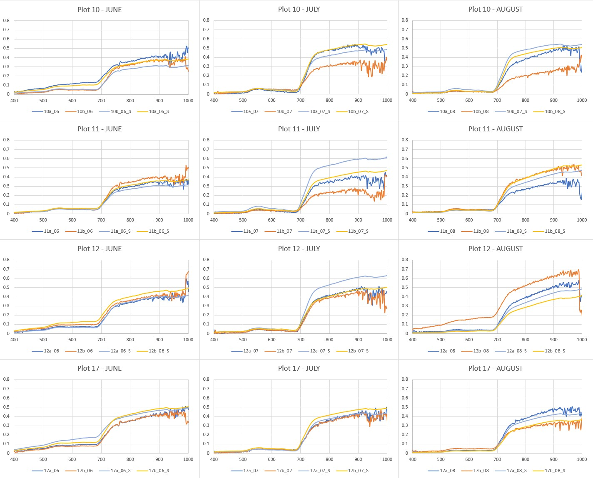
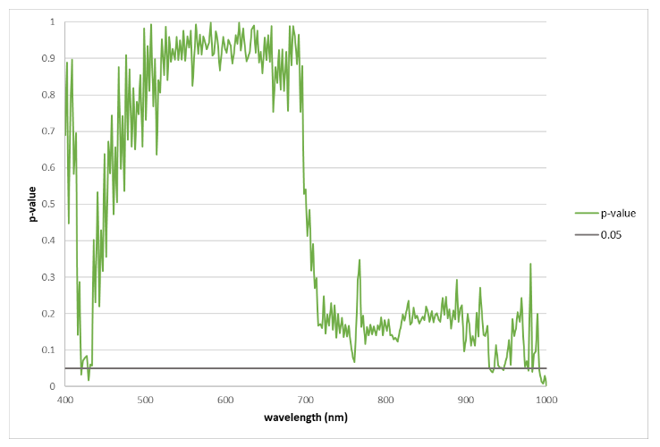
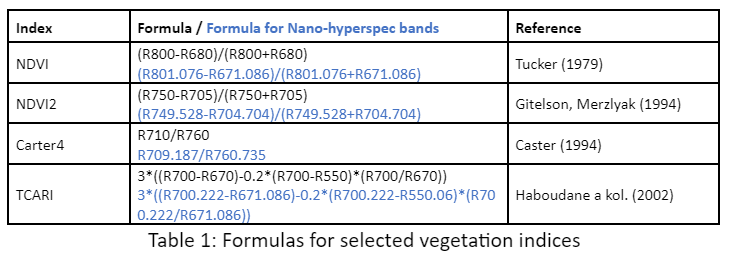
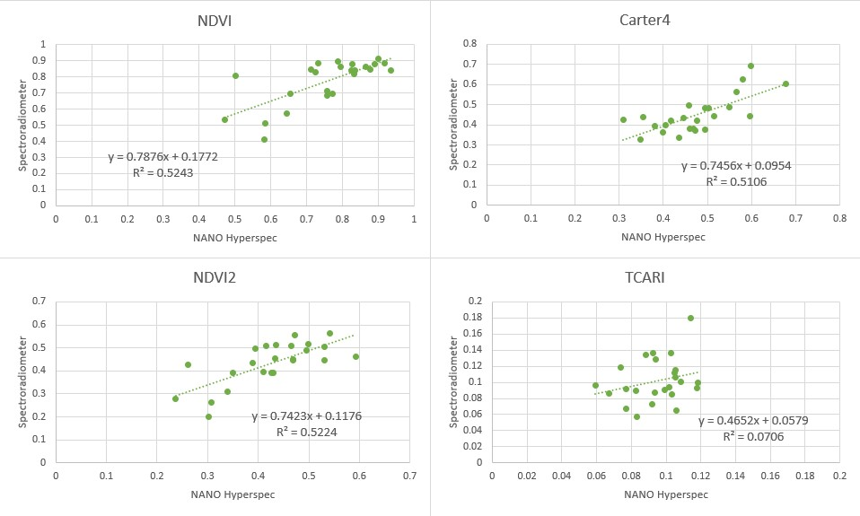

# Tutorial: Relating imaging spectroscopy and in-situ spectroscopy. 

## Comparison of spectra acquired by field spectroradiometer and by hyperspectral camera attached to the drone

Are the spectra measured by the spectroradiometer ASD FieldSpec4 Wide-Res in the field and spectra extracted from Headwall Nano-Hyperspec® images comparable? Are the vegetation indices calculated from both datasets comparable? We will demonstrate this comparison on measurements of Calamagrostis villosa in June, July and August 2020. We had four stable plots (diameter app. 2 m) where two subplots (a, b) were randomly selected every month and measured by the spectroradiometer and by geodetic GNSS instrument for the precise location (for the details of the study design see Červená et al. (2022)). In the same dayas, flights for acquisition of hyperspectral data were performed. From the pixels of hyperspectral images corresponding to measured GNSS positions of sublots the spectra were extracted. However, both spectra sources have different spectral resolution, so data from spectroradiometer with 2151 bands had to be resampled to the same 269 bands as image data has. You can see all the resulting spectra in *Figure 1*.

<p align="center">

</p>

*Figure 1: Spectra acquired by spectroradiometer ASD FieldSpec4 Wide-Res in the field and spectra extracted from Headwall Nano-Hyperspec® images for four plots with two subplots and three months.*

You can see from Figure 1 that spectra are similar but not the same:
* Spectra extracted from the image data are noisier (without further processing). 
* The difference between the spectra is more visible at near infrared. It can be influenced by different ground sample area which was measured. Spectra in the field were measured from approximately 0.5 m height above the canopy, i.e. a circle with a diameter of 22 cm on the ground. Image data has pixel size of only 9 cm (resampled from original 3cm data).
* Some of the spectra can be also influenced by changing weather conditions in the mountains

To quantify the differences, the paired t-tests were computed for all the wavelengths and the p-values were saved using script 1. The results can be seen in Figure 2. 

```
data=read.delim("Calamagrostis_drone_spectroradiometer_269bands.txt")
fix(data)
dim(data)

results <- vector()

for (I in 5:273)
{
	model<-t.test(data[data$origin=="drone",I],data[data$origin=="spectroradiometer",I],paired=TRUE)
	out<-capture.output(model);
	results <- append(results,grep ("p-value", out, value = TRUE) );
}

write(results, "ttest_ Calamagrostis.txt") 

```

*Script 1: Paired T-test calculation in R*

<p align="center">

</p>

*Figure 2: P-values of t-test comparing the reflectances from image data and spectroradiometer*

The null hypothesis of paired t-test says that the reflectance means of both instruments are equal at the given wavelength or in the other words used in R: “true mean difference is equal to 0”. The null hypothesis is rejected when the p-value is less than a pre-specified significance level which is usually set to 0.05.  At most of the wavelengths the null hypothesis was not rejected, so the reflectances of both methods of measurement should be comparable. But it can be clearly seen, that p-values are considerably lower in near infrared than in visible part of spectra.
In the next step we try to answer the second question if the vegetation indices calculated from both datasets are also comparable. We had selected four indices suitable for chlorophyll content estimations: two of them are normalized difference indices (NDVI, NDVI2), one is simple ratio (Carter4) and the last one (TCARI) is more complicated formula with some constants. For formulas and references see *Table 1*.

<p align="center">

</p>

*Table 1: Formulas for selected vegetation indices*

Firstly, we performed paired t-test and here are the results from R for all four indices:

NDVI: t = -0.79486, df = 23, p-value = 0.4348
NDVI2: t = -0.57476, df = 23, p-value = 0.571
Carter4: t = 1.8077, df = 23, p-value = 0.08375
TCARI: t = -1.3071, df = 23, p-value = 0.204
For all four indices the null hypothesis was not rejected based on the p-values. To find out more about the indices we plotted indices calculated from image data against indices calculated from spectroradiometer data (Figure 3) and added the linear trend which says how well they are correlated. We can see that both normalized difference indices perform the best, simple ratio is only slightly worse and TCARI index has the worst correlation. 


<p align="center">

</p>

*Figure 3: Correlations of selected indices calculated from image data and spectroradiometer data.*

## Conclusions 

Two questions were raised at the beginning of this tutorial: Are the spectra measured by the spectroradiometer ASD FieldSpec4 Wide-Res in the field and spectra extracted from Headwall Nano-Hyperspec® images comparable? Are the vegetation indices calculated from both datasets comparable? The answer to both questions is based on our example yes, however, there are also differences between them which can be caused by different factors – mostly it is the height from which the spectra were acquired. In our case the area on the ground is not of absolutely the same extend for both measurements’ methods. Also, the atmosphere can influence data acquired from higher altitudes more. The noise especially in the image data is another issue and application of some smoothening filter could be helpful before further data processing. Ratio-based indices and normalized difference indices calculated based on data from different devices can be more comparable because they also eliminate different illumination of data which can easily happen in the real word (especially in the mountainous areas with very changeable weather conditions).  

## References

CASTER, G. A. (1994): Ratios of leaf reflectance in narrow wavebands as indicator of plant stress. International Journal of Remote Sensing, 3, 15, 697–704.

ČERVENÁ, L., KUPKOVÁ, L., POTŮČKOVÁ, M., LYSÁK, J., 2020. Seasonal Spectral Separability of Selected Grasses: Case Study From The Krkonoše Mts. Tundra Ecosystem. Int. Arch. Photogramm. Remote Sens. Spat. Inf. Sci. RLIII-B3-2020, 371–376. https://doi.org/10.5194/isprs-archives-RLIII-B3-2020-371-2020

GITELSON, A., MERZLYAK, M. N. (1994): Quantitative estimation of chlorophyll-a using reflectance spectra: eRperiments with autumn chestnut and maple leaves. Journal of Photochemistry and Photobiology B: Biology, 3, 22, 247–252. 

HABOUDANE, D., JOHN, R., MILLER, J. R., TREMBLAY, N., ZARCO-TEJADA, P. J. DERTRAZE, L. (2002): Integrated narrow-band vegetation indices for prediction of crop chlorophyll content for application to precision agriculture. Remote Sensing of Environment, 2–3, 81, 416–426.

TUCKER, C. J. (1979): Red and photographic infrared linear combinations for monitoring vegetation. Remote Sensing of Environment, 2, 8, 127–150. 
