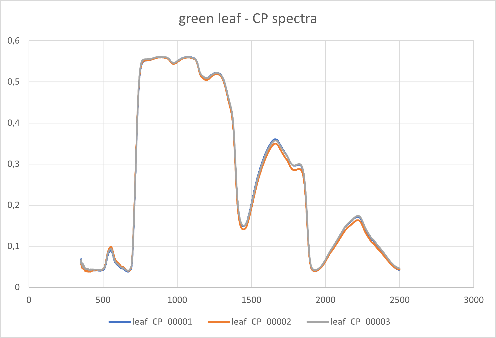

## Report

####

##### Data visualization

The graphs show that the three spectra measured for green paper are more similar than the three spectra measured for green leaf. 
It is caused by the paper's homogeneity; the leaf varies more. However, the differences are very small for both materials, 
so there are no obvious measurement errors, and the leaf shows no signs of senescence or disease.

<i>Green leaf spectra measured by contact probe</i>

<i>Green paper spectra measured by contact probe</i>

Median spectra for both materials were calculated.

<i>Example of calculated median spectra (green column) for contact probe measurements</i>

##### Comparision of reflectance spectra  
Although the spectra are similar, there are noticeable differences. 
The spectra measured by the integrating sphere exhibit noise at the lowest and highest wavelengths. In addition, 
different measurement principles cause distinctions, which seem to be more visible for  leaf measurements. 
If you are interested in the comparison of spectra acquired by different devices, have a look at [Potůčková et al., 2016](#references), 
especially Section 2.3 for spectra comparison methods and Section 3.1. for results.

<i>Comparision of green leaf spectra measured by contact probe and integrating sphere</i>

<i>Comparision of green paper spectra measured by contact probe and integrating sphere</i>

## References
Potůčková, M., Červená, L., Kupková, L., Lhotáková, Z., Lukeš, P., Hanuš, J., Novotný, J., Albrechtová, J. (2016):
Comparison of Reflectance Measurements Acquired with a Contact Probe and an Integration Sphere: Implications for the Spectral Properties of Vegetation at a Leaf Level. Sensors, 16, 1801. [10.3390/s16111801](http://dx.doi.org/10.3390/s16111801)   

### Back to theme 
Proceed by returning to [Principles of laboratory spectroscopy](../03_02_principles_of_laboratory_spectroscopy.md)