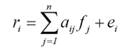
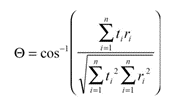

# Machine learning in imaging spectroscopy

Image classification is one of basic processing steps in remote sensing aiming at the retrieval of thematic information (e.g., land cover types, vegetation species) from imagery. General introduction to image classification was given in Module 1 [Time series analysis based on classification](../../module1/03_time_series_analysis_based_on_classification/03_time_series_analysis_based_on_classification.md) and Module 2 [Multitemporal classification](../../module2/04_multitemporal_classification/04_multitemporal_classification.md). In this theme these concepts will be extended to a linear unmixing model basically allowing for a single-date classification with subpixel accuracy, spectral angle mapper (SAM), spectral feature fitting (SFF), and a convolutional neural network (CNN) model to classify mono- or multitemporal hyperspectral (HS) imagery.  

The objective of this theme is to learn about:

* examples of classification methods suitable for HS imagery, namely linear spectral unmixing, SAM, and SID,

* definition of spectral endmembers.

The theme ends with a self-evaluation quiz, a set of exercises, and a list of references.

In the practical exercise you will use linear spectral unmixing, CNN, and optionally also earlier learned random forest and support vector machine classifiers on an example of HS data collected at the Bílá louka plot of [the Krkonoše Mountains National Park study site](../../data_usecases/usecase_grasses_krkonose.md) from an RPAS platform.

After finishing this theme, you will understand the principles of HS data classification and you will be able implement them in Python, R, or EnMapBox.

This theme is focused on supervised methods used for HS classification. Existence of high-resolution spectral information opens up for methods based on spectra comparison. The spectra may originate from spectral libraries or can be derived directly from imagery. For purpose of this text, such methods are further called as “based on reference spectra”. Other option is to use training data in the same manner as you learned in the Module 1 and Module 2 mentioned above. These methods will be referred as “based on training samples”.

## Supervised classification of hyperspectral images based on reference spectra
Classification legend comprises (in ideal case all) materials/surfaces existing in the scene. Thus, each of the material shall be specified with a reference spectrum. Available spectral libraries and in-situ measurements do not always contain all spectra needed. This problem can be solved by extracting the reference, so called **endmember spectra** for each class/material from image itself. In hyperspectral imaging, an endmember is understood as an idealized, pure signature for a class which represents only single material within the scene. Not every endmember needs to be a pure pixel, it is a spectral signature that is considered to be pure. Thus, only pixel which spectral signature is an endmember can be called as pure (Kale at al., 2017).

### Endmember extraction from HS imagery
There are several possibilities how to extract endmembers from the image:

**Manual picking from image data**

* Assumption of homogeneity of the area

* Some endmembers may be missed

**Manual picking from existing library spectra**

* Requires knowledge of ground composition

* Library spectra may differ from image spectra

**Using endmember extraction algorithm**

* Output endmembers represent “spectral” classes that might differ from “user” classes

There are several endmember extraction algorithms such as Pixel Purity Index (PPI), N-FINDR, Automatic Morphological Endmember Extraction (AMEE). The often used PPI is based on the Minimum Noise Fraction transformation (see [Theme 2](../02_aerial_acquisition_preprocessing/02_aerial_acquisition_preprocessing.md) of this Module). For a detailed explanation and comparison refer to Martínez et al. (2006) and Kale at al., 2017. 

Once the endmember spectra are defined, you can proceed with classification.

### Linear spectral unmixing
Spectral mixture analysis or spectral unmixing assumes that a spectrum of in a pixel might be a result of a composition (mixure) of several endmembers. The goal of unmixing is to find a fraction of endmembers in a pixel (Adams et al., 1986). If the materials in the field of view are optically separated (there is no multiple scattering between components), it can be assumed that the final signal is a linear combination of the endmembers. The relation can be expressed as:

where ri is the measured spectrum, aij is the endmember of the spectrum j, fij is the respective endmember fraction, and ei is the error between the measurement and the derived model. The unknown fractions are determined by adjustment (e.g., by the least squares method). It shall be mentioned that spectral unmixing is only possible when the number of endmembers of the image is lower than the number of spectral bands (leads to over-dimensioning of the system of equations). The spectral differences between the original and modelled spectral values in each pixel can be calculated and statistically expressed as the [root mean square error](https://en.wikipedia.org/wiki/Root-mean-square_deviation).

Numerous examples of applications of linear unmixing can be found e.g., Okujeni etal. (2021), Cooper et al. (2020).

### Spectral angle mapper
The endmember and measured spectra can be considered as vectors in the spectral feature space. Spectral angle mapper (SAM) calculates an n-D angle to match pixels to endmembers. 
 

 
where Θ is the calculated spectral angle, t is the measured spectrum, r is the reference (endmember), i is the number of the spectral band. The pixel is assigned to an endmember with smallest angle (Yuhas et al., 1992). For each endmember, the spectral angle to the image pixels can be calculated. After visualisation brighter pixel means a larger spectral angle to the endmember.

### Spectral information divergence
A comparison of endmember and measured spectra based on probability theory and entropy was suggested by proposed by Chang (2000). Du et al. (2004) uses this concept and shows advantages to SAM (especially in case of small spectral angles).

## Supervised classification of hyperspectral images based training data
Support vector machines (SVM), random forest (RF) and CNN classifiers are used for hyperspectral data in same manner as explained for multispectral datasets in the Module 1 and Module 2 of this course. They are further practiced and in the case of the CNN also explained in practical the exercises. RF classification applied on a multitemporal dataset of HS imagery is the topic of the case study on [Discrimination of selected grass species from time series of RPAS hyperspectral imagery](https://3dgeo-heidelberg.github.io/etrainee/module4/06_Krkonose_tundra_grasslands/06_Krkonose_tundra_grasslands.html).

## Self-evaluation quiz

<!--Question 1-->
<label for="q_01">
Spectra unmixing
</label> 
<input type="radio" name="q_01">reveals information on spectral composition inside the pixel. 
<input type="radio" name="q_01">provides information on spatial distribution of materials within the pixel. 

reveals information on spectral composition inside the pixel.

<output id="output_q_01"></output>  

<!--Question 2-->
<label for="q_02">
The abbreviation SAM in image spectra classification stands for
</label> 
<input type="radio" name="q_02">Spatial Airborne Mapper 
<input type="radio" name="q_02">Spectral Angle Mapper 
<input type="radio" name="q_02">Spectral Average Mapper 

Spectral Angle Mapper

<output id="output_q_02"></output>  

<!--Question 3-->
<label for="q_03">
The similarity measure between the reference and measured spectra in the SID classificator is based on
</label> 
<input type="radio" name="q_03">correlation 
<input type="radio" name="q_03">Euclidian distance 
<input type="radio" name="q_03">entropy 

entropy

<output id="output_q_03"></output>  

<!--Question 4-->
<label for="q_04">
The purpose of the kernel function used with the SVM classifier is to
</label> 
<input type="radio" name="q_04">increase the data dimension to improve separability between classes. 
<input type="radio" name="q_04">reduce the number of outliers in the training dataset. 
<input type="radio" name="q_04">produce new training data. 

increase the data dimension to improve separability between classes.

<output id="output_q_04"></output>  

<input type="submit" value="Submit" style="font-size:14pt">  

<output id="output_overall">
</output>
</form>

## Exercise

A set of classification algoritms is provided. While the algorithms based on reference spectra (linear unmixing, SAM, SID) are suitable for single date datasets and multitemporal analysis must be carried out on the classification results, the multitemporal datasets can be an input to present methods based on training samples (RF, SVM, CNN).

Proceed to the exercises: [Hyperspectral data classification](04_time_series_specifics_exercise.md).

### Next unit
Proceed with [Temporal vs. spatial and spectral resolution](../05_specific_resolution_contribution/05_specific_resolution_contribution.md)

## References

Adams, J. B., Smith, M. O., Johnson, P. E. (1986). Spectral mixture modeling: A new analysis of rock and soil types at the Viking Lander 1 site. Journal of Geophysical Research: Solid Earth, 91(B8), 8098-8112. [https://doi.org/10.1029/JB091iB08p08098](https://doi.org/10.1029/JB091iB08p08098)

Dvořák, J., Potůčková, M., Treml, V. (2022). Weakly supervised learning for treeline ecotone classification based on aerial orthoimages and an ancillary DSM. ISPRS Annals of the Photogrammetry, Remote Sensing and Spatial Information Sciences,  Volume V-3-2022. [https://doi.org/10.5194/isprs-annals-V-3-2022-33-2022](https://doi.org/10.5194/isprs-annals-V-3-2022-33-2022)

Chang, C. I. (2000). An information-theoretic approach to spectral variability, similarity, and discrimination for hyperspectral image analysis. IEEE Transactions on information theory, 46(5), 1927-1932. [https://ieeexplore.ieee.org/abstract/document/857802](https://ieeexplore.ieee.org/abstract/document/857802)

Cooper, S., Okujeni, A., Jänicke, C., Clark, M., van der Linden, S., Hostert, P. (2020). Disentangling fractional vegetation cover: Regression-based unmixing of simulated spaceborne imaging spectroscopy data. Remote Sensing of Environment, 246, 111856. [https://doi.org/10.1016/j.rse.2020.111856](https://doi.org/10.1016/j.rse.2020.111856)

Du, Y., Chang, C. I., Ren, H., Chang, C. C., Jensen, J. O., D’Amico, F. M. (2004). New hyperspectral discrimination measure for spectral characterization. Optical engineering, 43(8), 1777-1786. [https://doi.org/10.1117/1.1766301](https://doi.org/10.1117/1.1766301)

Kale, K. V., Solankar, M. M., Nalawade, D. B., Dhumal, R. K., Gite, H. R. (2017). A research review on hyperspectral data processing and analysis algorithms. Proceedings of the national academy of sciences, India section a: physical sciences, 87, 541-555. [https://doi.org/10.1007/s40010-017-0433-y](https://doi.org/10.1007/s40010-017-0433-y)

Martínez, P. J., Pérez, R. M., Plaza, A., Aguilar, P. L., Cantero, M. C., Plaza, J. (2006). Endmember extraction algorithms from hyperspectral images. [http://hdl.handle.net/2122/1963](http://hdl.handle.net/2122/1963)

Okujeni, A., Jänicke, C., Cooper, S., Frantz, D., Hostert, P., Clark, M., ...  van der Linden, S. (2021). Multi-season unmixing of vegetation class fractions across diverse Californian ecoregions using simulated spaceborne imaging spectroscopy data. Remote Sensing of Environment, 264, 112558. [https://doi.org/10.1016/j.rse.2021.112558](https://doi.org/10.1016/j.rse.2021.112558)

Yuhas, R. H., Goetz, A. F., Boardman, J. W. (1992). Discrimination among semi-arid landscape endmembers using the spectral angle mapper (SAM) algorithm. In JPL, Summaries of the Third Annual JPL Airborne Geoscience Workshop. Volume 1: AVIRIS Workshop. [https://ntrs.nasa.gov/citations/19940012238](https://ntrs.nasa.gov/citations/19940012238)

Wang, X., Liu, J., Chi, W., Wang, W., & Ni, Y. (2023). Advances in Hyperspectral Image Classification Methods with Small Samples: A Review. Remote Sensing, 15(15), 3795. [https://doi.org/10.3390/rs15153795](https://doi.org/10.3390/rs15153795)
