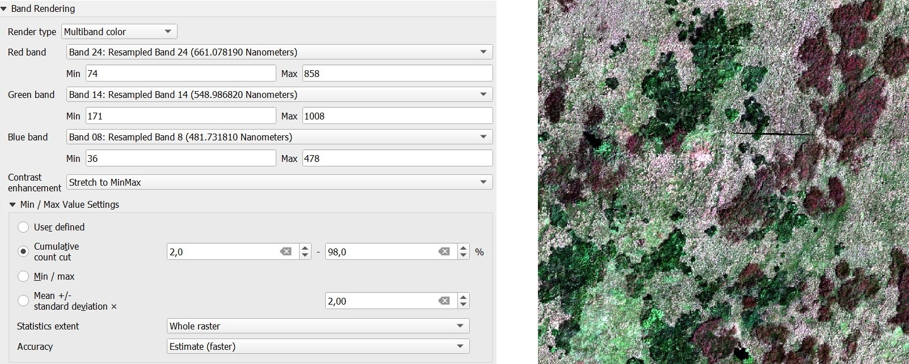
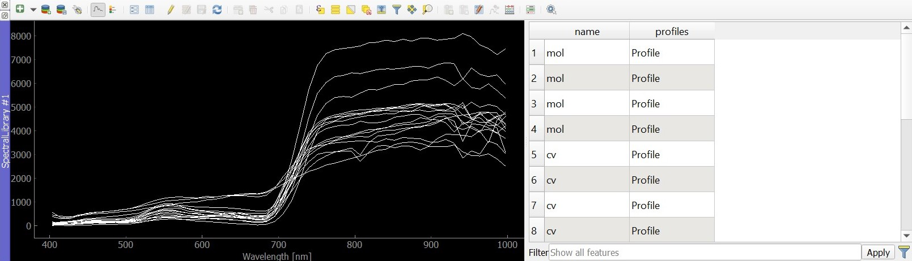
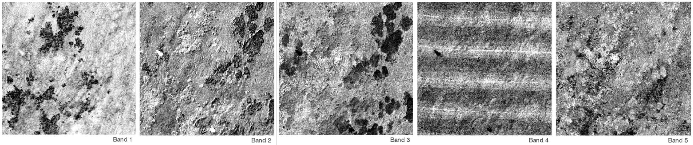
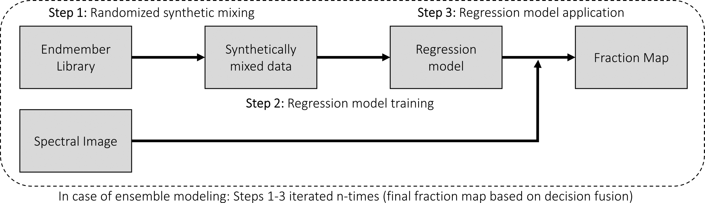
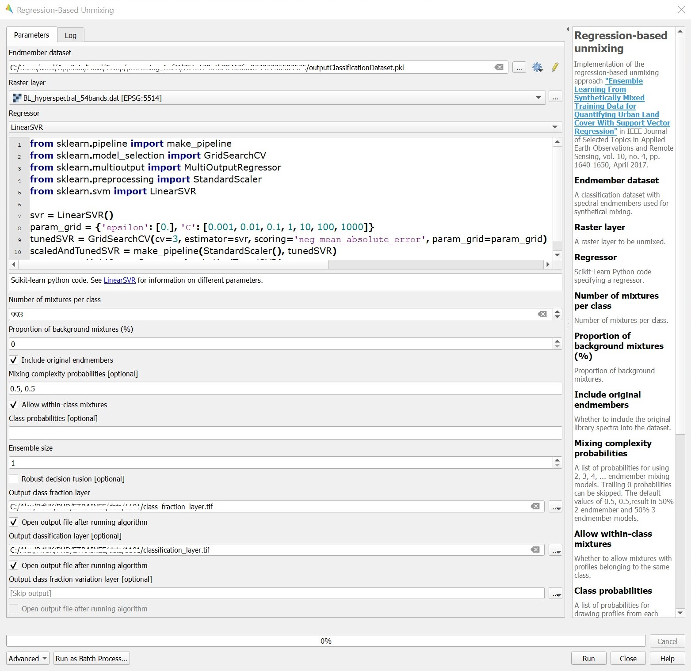
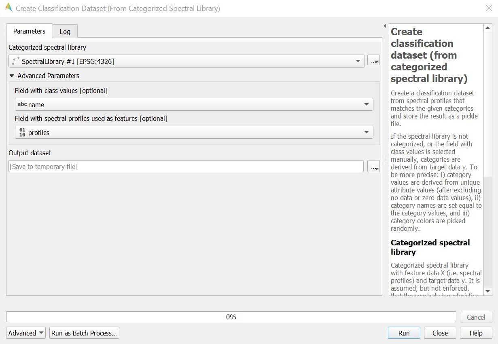
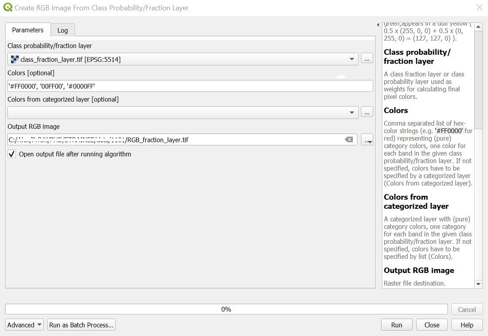
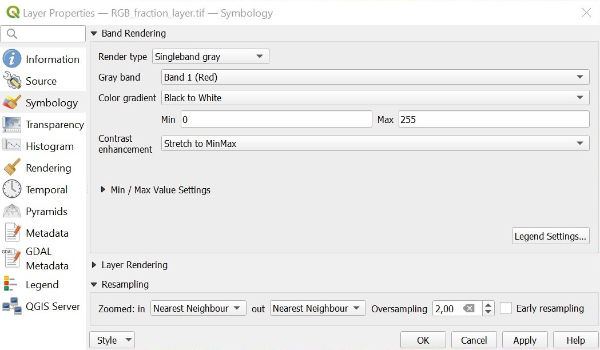
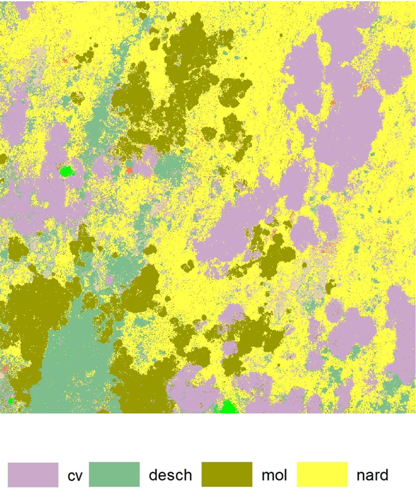

# Subpixel classification

The aim of this exercise is to explore the possibilities of subpixel classification, namely the different methods of endmember collection, regression-based spectral unmixing, and evaluation of the resulting species maps.

- *Prerequisites*
    - Installed EnMAP-Box plugin for QGIS ([manual](../../software/software_enmap_box.md))  
    By now you should have EnMAP-Box installed on your computer as a QGIS plugin and be familiar with the basic software operations. If not, please refer back to [Exploration of hyperspectral data using EnMAP-Box](../01_spectroscopy_principles/01_spectroscopy_principles_exercise.md).
    - Downloaded data ([module4/theme4_exercise_subpixel_classification](https://doi.org/10.5281/zenodo.10003574))    
    The dataset consists of:
        + preprocessed (geometrically and radiometrically corrected) hyperspectral images: BL_hyperspectral_image.dat (data file) and BL_hyperspectral_image.hdr (header file). More information about the acquisition of the data can be found [here](../../data_usecases/usecase_grasses_krkonose.md).
        + training polygons for all classes (species): BL_training_polygons.shp (shapefile)
        + pixel purity index image: BL_ppi_image.dat (data file) and BL_ppi_image.hdr (header file):
        + spectral library with semi-automatically pre-extracted endmembers: BL_spectral_library.gpkg (GeoPackage).
         
- *Tasks*
    - Manually extracting endmembers from hyperspectral images 
    - Comparing the acquired spectra with the provided spectral library 
    - Spectral unmixing – subpixel classification
    - Results evaluation


## 0. Data preparation and exploration
The area of interest is Bílá louka meadow, a patchwork of alpine grasslands located in the Krkonoše mountains (50.729N, 15.683E). Matgrass (*Nardus stricta*), reedgrass (*Calamagrostis villosa*), and purple moor-grass *(Molinia caerulea*) form monodominant stands that are occasionally mixed with other grasses and herbs. Several isolated Norway spruce (Picea abies) trees can be found. Despite the grass stands low species diversity, they play an important role from an environmental point of view. Thus, the development of methods for reliable monitoring of vegetation change is crucial. Our exercise goal will be to experiment with subpixel species classification.

| Species | Abbreviation |
| ------ | ----------- |
| *Calamagrostis villosa* | cv |
| *Molinia caerulea* | mol |
| *Nardus stricta* | nard |

<div align="left">

<i>Bílá louka species and their abbreviations</i>

</div>

Start with visualizing the hyperspectral image `BL_hyperspectral_image.dat` in EnMAP-Box, mapping Band 24 to Red, Band 14 to Green, and Band 8 to Blue, and stretching the values to Min and Max using a Cumulative count cut should give you an image resembling true colors. It is also possible to use a different band combination for the RGB composite.
<p align="center">

</p>

<div align="center">

<i>Band Rendering settings to achieve true color visualization</i>

</div>

Overlay the image with the training polygons `BL_training_polygons.shp`. Using "Layer Properties-> Symbology" and the Value stored in the field CLASS classify the polygons, so each species is visualized with a different color. Feel free to play around with the data. 
```  
Determine the spatial and spectral resolution of the image from metadata. What is the wavelength range?
```
## 1. Endmember extraction
“A hyperspectral endmember (also known as ‘pure pixel’) is an idealized, pure signature of a spectral class. The pure spectral signature signifies the complete reflectance of a pixel exclusively occupied by a single surface material.” ([Karbhari et al., 2015](#references))  

Endmembers can be acquired from an existing spectral library, by measuring spectra in the field or lab, or extracted from hyperspectral/multispectral images. The first task is to manually extract endmembers from the hyperspectral image. 

Add the Pixel Purity Index (PPI) image `BL_ppi.dat` as an available data source and visualize it. Using the knowledge from [Exploration of hyperspectral data using EnMAP-Box](../01_spectroscopy_principles/01_spectroscopy_principles_exercise.md) create a labeled spectral library with at least one endmember for each species.

The training polygons should give you an idea where the species are located, and the PPI image serves as a measure of pixel purity (the higher the value the purer). You can link multiple Map windows in “View -> Set Map Linking -> Link Map Scale and Center” to easily identify and select pure pixels located inside the training polygons. 
<p align="center">

</p>

<div align="center">

<i>Imported spectral library view BL_spectral_library.gpkg</i>

</div>

```  
Compare the extracted endmember spectra with the semi-automatically pre-extracted endmembers located in the spectral library BL_spectral_library.gpgk  
Do they differ significantly and if yes, then why?
```
*To obtain the provided PPI image, first the Minimum Noise Fraction (MNF) transformation was applied on the hyperspectral image. Based on the eigenvalues, only the first 11 MNF bands were considered. To reduce spatial dimensions, the PPI was then calculated on the MNF transformed data using a threshold factor of 2.5 and 20 000 iterations.*
<p align="center">

</p>

<div align="center">

<i>First five bands after applying MNF transformation</i>

</div>

## 2. Spectral unmixing
Open the Regression-based unmixing application in EnMAP-Box. As the **"Endmember dataset"** choose either the provided spectral library `BL_spectral_library.gpkg` or the one you created during the previous steps. The library can be added using the “Create Classification dataset (from categorized spectral library)” option. The other input is the **“Raster layer”** on which the spectral unmixing is going to be performed, in our case that is the hyperspectral image. 
  
Next, the **Regressor** algorithm needs to be defined. Both linear and nonlinear options are available. EnMAP-Box uses the Python scikit-learn library. More information on the different machine learning (ML) algorithms can be found in the [documentation](https://scikit-learn.org/stable/supervised_learning.html#supervised-learning). Use an ML algorithm of your choice, but keep in mind that some algorithms are more costly than others, thus, to reduce running time, one of the following is advisable: LinearRegression, RandomForestRegressor, SupportVectorRegressor.  

The process of creating the synthetically mixed spectra as training data from the endmember library is affected by the **mixing parameters**. “Number of mixtures per class” defines the total number of mixtures per class to be created. “Mixing complexity probability” consists of a list of probabilities for using 2, 3, 4, ... endmembers in the mixing models. Other options decide whether to include the original library spectra into the dataset or allow mixtures with profiles belonging to the same class. For the first run, you can leave all of these values at their defaults.

<p align="center">

</p>

<div align="center">

<i>Regression based-unmixing workflow (Figure by Janz et al. 2023/ <a href="https://www.gnu.org/licenses/gpl-3.0.html">GPL-3.0</a>)</i>

</div>

Finally, the **outputs** need to be specified. Fill in the file destination for the “Output class fraction layer” and the “Output classification layer”, which is derived from the class fraction layer and corresponds to the maximum class fraction.  

Now you are ready to run the application.  
```  
Pick one or more of the mixing parameters and determine their changing effect on the results in terms of visual inspection of the output images, accuracy etc.
```

<p align="center">

</p>

<div align="center">

<i>Regression based-unmixing application settings</i>

</div>

<p align="center">

</p>

<div align="center">

<i>Create Classification dataset (from categorized spectral library) settings</i>

</div>

## 3. Results evaluation
Visualize the classification layer and the class fraction layer. You can create an RGB image from the class fraction layer using Symbology or the EnMAP-Box Processing Toolbox, respectively the “Create RGB image from class probability/fraction layer”. The RGB pixel color of a single pixel will then be given by the weighted mean of the given class colors. The weights are given by class fractions/probabilities (i.e. values between 0 and 1). For example, pure pixels with cover fractions of 1 appear in its pure class color. A mixed pixel with 50% fractions in two classes colored in red and green, appears in a dull yellow.

<p align="center">

</p>

<div align="center">

<i>Create RGB image from class probability/fraction layer settings</i>

</div>

A different way to assess the fraction layer is to use single band visualization. In "Layer Properties -> Symbology -> Band Rendering" choose Singleband gray as “Render type”. Each band corresponds to a class/species. The fraction of a given class/species in each pixel will then be defined by a grayscale value. 

<p align="center">

</p>

<div align="center">

<i>Single band visualization settings</i>

</div>

Accuracy assessment of classification results should generally include computation of various accuracy metrics, such as overall accuracy, confusion matrix, user and producer accuracy, F1 score. However, visual comparison will suffice for the purpose of this exercise.

**Examine the original hyperspectral image, all the unmixing outputs, the reference map below obtained using pixel classification, and try to answer the following questions:** 
```  
What does the class fraction layer represent?  
Describe the resulting RGB image, are there mixed/pure pixels?  

The northwest edges of compact mol areas seem to be mixed with cv, but not the other edges.  
Can you determine what is causing this effect?  
(hint: Carefully looking at the original hyperspectral image might help.)

The reference map contains the class desch which we did not classify.  
How are these areas manifested in the class fraction layer and the classification layer? 

Compare the classification layer and reference map.  
Do both maps show a good agreement in terms of spatial patterns? Discuss all the possible effects on the outcome.

What kind of data might be more suitable for subpixel classification and why? 
```

<p align="center">

</p>

<div align="center">

<i>Reference map obtained using pixel classification</i>

</div>


## References 
Karbhari, K., Solankar, M., Nalawade, D. (2020): Hyperspectral Endmember Extraction Techniques. [10.5772/intechopen.88910](http://dx.doi.org/10.5772/intechopen.88910).  

Janz, A., Jakimow, B., Thiel, F., Linden, S., Hostert, P. (2022): EnMAP-Box 3 Documentation. [enmap-box.readthedocs.io](https://enmap-box.readthedocs.io/).


### Exercise solution 
Proceed to example solution [Subpixel classification - report](solution/04_time_series_specifics_exercise_subpixel_solution.md)

### Back to theme 
Proceed by returning to [Machine learning in imaging spectroscopy](04_time_series_specifics.md)
