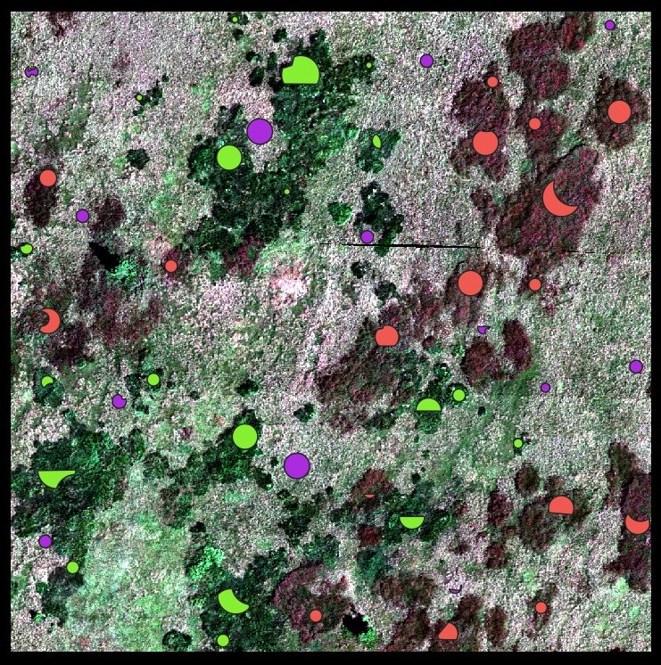
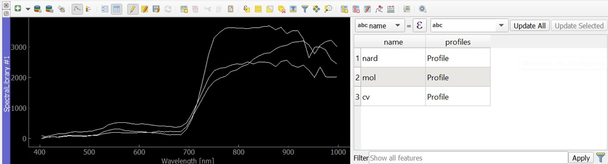
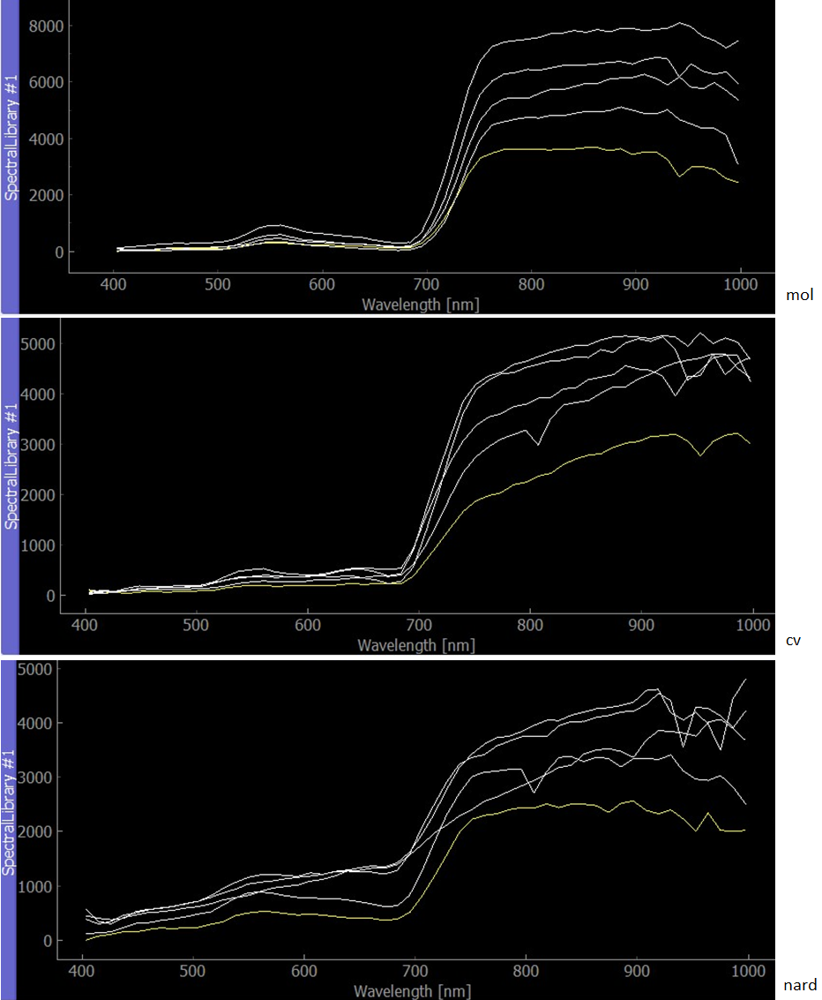
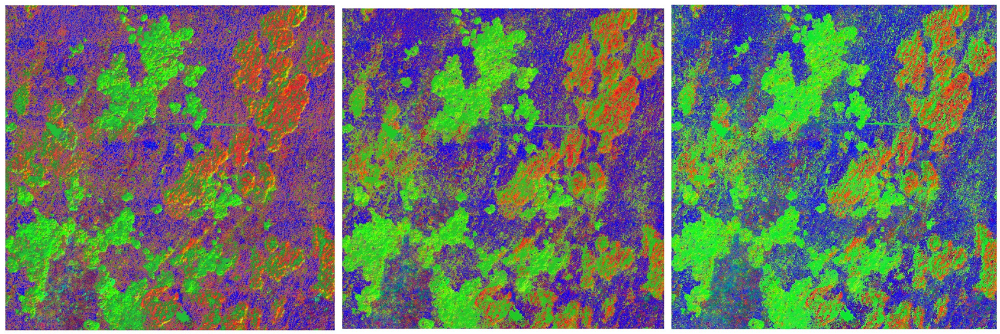
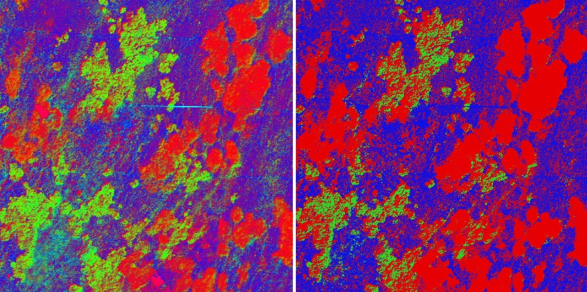
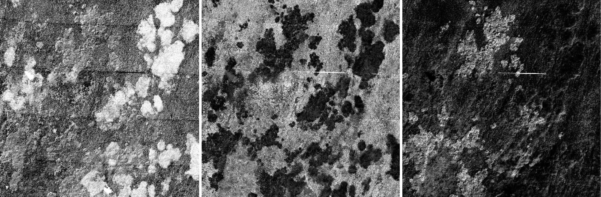

## Report
The hyperspectral image was loaded in the EnMAP-Box environment and visualized in true colors using the recommended bands. From the image metadata the following information was extracted: 

number of bands: 54  
wavelength range: 397.663 to 1001.839 nanometers  
spatial resolution: 0.09 m

Overlaying the image with the training polygons gives a clear overview of the location of the dominant grass stands. The mol species corresponds to the green polygons, the cv species to red, and the nard species is in violet. 

<i>Hyperspectral image in true colors overlaid with training polygons</i>

##### Endmember extraction

One endmember spectra for each species was extracted using the pixel purity index image. Pixels with the highest purity lying inside the training polygons were chosen. When compared to the provided semi-automatically pre-extracted endmembers, the reflectance values are generally lower in the longer wavelengths, however, the shape/trend of the curve remains the same. 

<i>Created spectral library</i>

<i>Comparison of the extracted endmember spectra (yellow) with the semi-automatically pre-extracted endmembers (white)</i>

##### Spectral unmixing

Spectral unmixing was carried out  on the hyperspectral image using the provided spectral library. The “Regressor” algorithm RandomForestRegressor was chosen to observe the effect of the “Number of mixtures per class” parameter. Values 100, 500, and 1000 were tested sequentially. All the other parameters were left at their defaults. Changing the value had a significant effect on the class fraction layer. A low mixture per class value favored the cv species, while a higher value favored the mol species. Increasing the amount also resulted in a less noisy image and more compact areas.

<i>Effect of changing parameter Number of mixtures per class (Left: 100; Center: 500; Right: 1000)</i>

Setting the “Regressor” algorithm to LinearSVR and leaving all the other parameters at their default state gave the following results:

<i>Class fraction layer and classification layer (Red: cv; Green: mol; Blue: nard)</i>

<i>Single band visualization</i>

##### Q&A
* What does the class fraction layer represent? Describe the resulting RGB image, are there mixed/pure pixels?  
    + the class fraction layer represents the fraction/probability of the classes in  pixels; each image band corresponds to one species and holds the value of the fraction
one can distinguish compact areas with relatively pure pixels of cv (bright red), compact areas of mol mixed with cv (bright red and green), and mixed nard forming the “background”
* The northwest edges of compact mol areas seem to be mixed with cv, but not the other edges. Can you determine what is causing this effect?
    + shadows in the image
* The reference map contains the class desch which we did not classify. How are these areas manifested in the class fraction layer and the classification layer? 
    + class fraction layer: mixed species areas where none of the species is dominant 
    + classification layer: nard species
* Compare the classification layer and reference map. Do both maps show a good agreement in terms of spatial patterns? Discuss all the possible effects on the outcome.
    + spatial patterns yes - otherwise not so much
    + effects: data acquisition, geometric and radiometric corrections, endmember extraction, chosen mixing parameters and regression algorithm 
* What kind of data might be more suitable for subpixel classification and why? 
    + data with lower spatial resolution
    + more separable classes (spectrally distinct)

### Back to theme
Proceed by returning to [Machine learning in imaging spectroscopy](../04_time_series_specifics.md)
